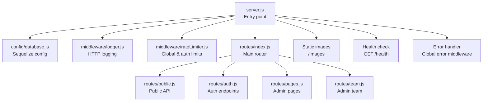
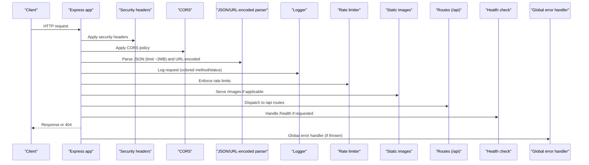
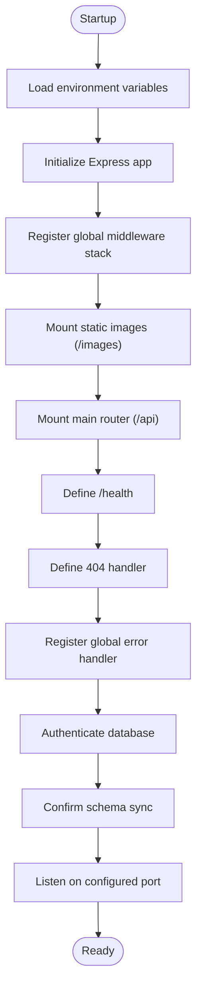
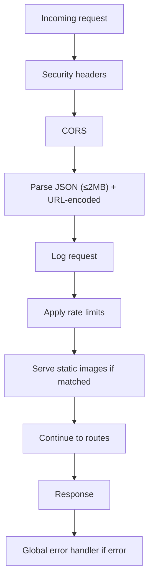
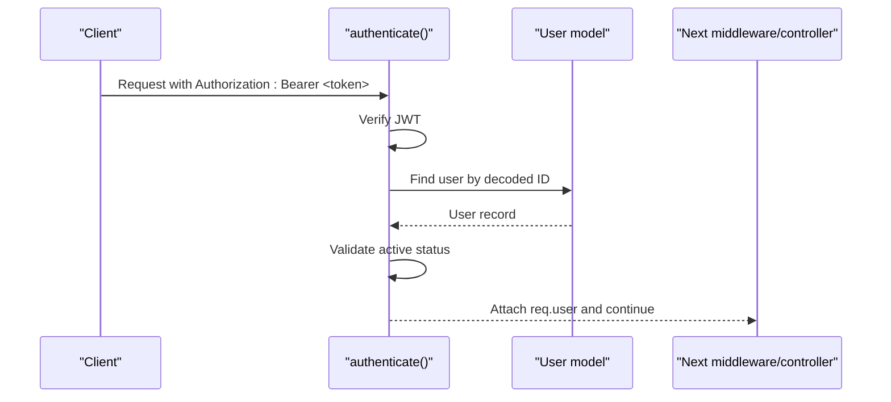
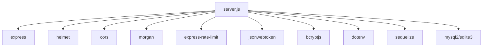

# API Architecture and Foundation

<cite>
**Referenced Files in This Document**
- [server.js](file://rsf-backend/server.js)
- [routes/index.js](file://rsf-backend/routes/index.js)
- [routes/public.js](file://rsf-backend/routes/public.js)
- [routes/auth.js](file://rsf-backend/routes/auth.js)
- [routes/pages.js](file://rsf-backend/routes/pages.js)
- [routes/team.js](file://rsf-backend/routes/team.js)
- [middleware/logger.js](file://rsf-backend/middleware/logger.js)
- [middleware/errorHandler.js](file://rsf-backend/middleware/errorHandler.js)
- [middleware/rateLimiter.js](file://rsf-backend/middleware/rateLimiter.js)
- [middleware/auth.js](file://rsf-backend/middleware/auth.js)
- [middleware/validate.js](file://rsf-backend/middleware/validate.js)
- [controllers/crudFactory.js](file://rsf-backend/controllers/crudFactory.js)
- [models/index.js](file://rsf-backend/models/index.js)
- [config/database.js](file://rsf-backend/config/database.js)
- [package.json](file://rsf-backend/package.json)
- [README.md](file://rsf-backend/README.md)
</cite>

## Table of Contents
1. [Introduction](#introduction)
2. [Project Structure](#project-structure)
3. [Core Components](#core-components)
4. [Architecture Overview](#architecture-overview)
5. [Detailed Component Analysis](#detailed-component-analysis)
6. [Dependency Analysis](#dependency-analysis)
7. [Performance Considerations](#performance-considerations)
8. [Troubleshooting Guide](#troubleshooting-guide)
9. [Conclusion](#conclusion)
10. [Appendices](#appendices)

## Introduction
This document describes the Express.js backend foundation for the Réseau Solidarité France project. It explains server initialization, middleware pipeline configuration, request/response flow, global middleware stack (security headers, CORS, JSON parsing limits, rate limiting), health checks, static asset serving, routing organization under the /api prefix, error handling, logging, and database connection management. It also provides examples of middleware execution order and discusses scalability and security implications.

## Project Structure
The backend is organized around a layered architecture:
- Entry point initializes the Express app, loads environment variables, connects to the database, mounts middleware, routes, and static assets, and starts the server.
- Routes are grouped by domain (/api/public for public endpoints, /api/* for admin endpoints).
- Controllers implement business logic, often leveraging a generic CRUD factory.
- Middleware handles authentication, authorization, validation, logging, rate limiting, and error handling.
- Models define the data schema via Sequelize ORM, with centralized registration and associations.

**Diagram sources**
- [server.js:1-84](file://rsf-backend/server.js#L1-L84)
- [routes/index.js:1-28](file://rsf-backend/routes/index.js#L1-L28)
- [routes/public.js:1-201](file://rsf-backend/routes/public.js#L1-L201)
- [routes/auth.js:1-25](file://rsf-backend/routes/auth.js#L1-L25)
- [routes/pages.js:1-10](file://rsf-backend/routes/pages.js#L1-L10)
- [routes/team.js:1-13](file://rsf-backend/routes/team.js#L1-L13)
- [middleware/logger.js:1-28](file://rsf-backend/middleware/logger.js#L1-L28)
- [middleware/rateLimiter.js:1-21](file://rsf-backend/middleware/rateLimiter.js#L1-L21)
- [config/database.js:1-69](file://rsf-backend/config/database.js#L1-L69)

**Section sources**
- [README.md:7-69](file://rsf-backend/README.md#L7-L69)
- [server.js:18-53](file://rsf-backend/server.js#L18-L53)

## Core Components
- Express server initialization and startup sequence with database authentication and sync confirmation.
- Global middleware stack: security headers, CORS, JSON parsing limits, logging, rate limiting, static image serving, and error handling.
- Routing structure: public endpoints under /api/public and admin endpoints under /api with JWT-based protection.
- Database connection management via Sequelize with support for SQLite, MySQL, and PostgreSQL.
- Logging and error handling middleware for consistent diagnostics and response formatting.
- Generic CRUD controller factory enabling standardized admin endpoints.

**Section sources**
- [server.js:54-84](file://rsf-backend/server.js#L54-L84)
- [routes/index.js:6-26](file://rsf-backend/routes/index.js#L6-L26)
- [config/database.js:9-66](file://rsf-backend/config/database.js#L9-L66)
- [middleware/logger.js:14-26](file://rsf-backend/middleware/logger.js#L14-L26)
- [middleware/errorHandler.js:4-28](file://rsf-backend/middleware/errorHandler.js#L4-L28)
- [controllers/crudFactory.js:39-96](file://rsf-backend/controllers/crudFactory.js#L39-L96)

## Architecture Overview
The runtime flow begins at the server entry point, where the application:
- Loads environment variables.
- Initializes Express and Sequelize.
- Registers global middleware in a specific order.
- Mounts static image serving.
- Mounts the main router under /api.
- Defines a health check endpoint.
- Handles 404s and global error handling.
- Starts listening on the configured port after successful database authentication.

**Diagram sources**
- [server.js:21-52](file://rsf-backend/server.js#L21-L52)
- [middleware/logger.js:14-26](file://rsf-backend/middleware/logger.js#L14-L26)
- [middleware/rateLimiter.js:5-11](file://rsf-backend/middleware/rateLimiter.js#L5-L11)
- [routes/index.js:7-25](file://rsf-backend/routes/index.js#L7-L25)

## Detailed Component Analysis

### Server Initialization and Startup
- Environment loading and Express initialization.
- Global middleware registration order and purpose.
- Static image serving under /images.
- Mounting of the main router under /api.
- Health check endpoint returning service metadata and DB dialect.
- 404 handling for unknown routes.
- Global error middleware.
- Asynchronous startup sequence: database authentication, schema sync confirmation, and server listen.

**Diagram sources**
- [server.js:6-19](file://rsf-backend/server.js#L6-L19)
- [server.js:21-52](file://rsf-backend/server.js#L21-L52)
- [server.js:55-81](file://rsf-backend/server.js#L55-L81)

**Section sources**
- [server.js:6-19](file://rsf-backend/server.js#L6-L19)
- [server.js:21-52](file://rsf-backend/server.js#L21-L52)
- [server.js:55-81](file://rsf-backend/server.js#L55-L81)

### Global Middleware Stack
- Security headers: HTTP security headers applied globally.
- CORS: Cross-origin resource sharing enabled.
- JSON parsing: Body parsing with a 2 MB limit and URL-encoded support.
- Request logging: Morgan-based colored logging for HTTP requests.
- Rate limiting: Global rate limiter and stricter limiter for authentication endpoints.
- Static assets: Serving images from the public/images directory.
- Error handling: Centralized error handler invoked for unhandled exceptions.

**Diagram sources**
- [server.js:22-27](file://rsf-backend/server.js#L22-L27)
- [middleware/logger.js:14-26](file://rsf-backend/middleware/logger.js#L14-L26)
- [middleware/rateLimiter.js:5-11](file://rsf-backend/middleware/rateLimiter.js#L5-L11)

**Section sources**
- [server.js:22-27](file://rsf-backend/server.js#L22-L27)
- [middleware/logger.js:14-26](file://rsf-backend/middleware/logger.js#L14-L26)
- [middleware/rateLimiter.js:5-11](file://rsf-backend/middleware/rateLimiter.js#L5-L11)

### Authentication and Authorization Middleware
- JWT verification middleware attaches the authenticated user to the request context.
- Role-based authorization middleware restricts access to specific roles after authentication.
- These middlewares are applied to protected routes under /api.

**Diagram sources**
- [middleware/auth.js:10-33](file://rsf-backend/middleware/auth.js#L10-L33)

**Section sources**
- [middleware/auth.js:10-33](file://rsf-backend/middleware/auth.js#L10-L33)
- [routes/index.js:14](file://rsf-backend/routes/index.js#L14)

### Validation Middleware
- Validates incoming requests using express-validator and returns structured 422 responses on validation failures.

**Section sources**
- [middleware/validate.js:9-19](file://rsf-backend/middleware/validate.js#L9-L19)

### Error Handling Strategy
- Centralized error handler:
  - Logs error details.
  - Handles Sequelize validation and constraint errors with 422 and structured field-level errors.
  - Supports custom errors with explicit status codes.
  - Returns environment-aware messages for 500 errors.
- Utility to create errors with status codes for consistent propagation.

**Section sources**
- [middleware/errorHandler.js:4-35](file://rsf-backend/middleware/errorHandler.js#L4-L35)

### Logging Mechanism
- Morgan-based logger with colored tokens for HTTP method and status code.
- Provides concise request summaries for observability during development and production.

**Section sources**
- [middleware/logger.js:14-26](file://rsf-backend/middleware/logger.js#L14-L26)

### Database Connection Management
- Sequelize configuration supports SQLite, MySQL, and PostgreSQL.
- Environment-driven dialect selection, connection pooling for relational databases, and SQL logging toggled by environment.
- Automatic schema synchronization confirmation during startup.

**Section sources**
- [config/database.js:9-66](file://rsf-backend/config/database.js#L9-L66)
- [server.js:57-64](file://rsf-backend/server.js#L57-L64)

### Routing Structure and API Organization
- Public API:
  - Mounted under /api/public for frontend consumption without authentication.
  - Includes endpoints for pages, team, missions, testimonials, events, actualities, donation modes, settings, and navigation.
- Admin API:
  - Mounted under /api with JWT authentication enforced.
  - Includes endpoints for pages, team, missions, testimonials, events, actualities, donations, settings, and navigation.
- Authentication endpoints:
  - Mounted under /api/auth with rate limiting on login and validation middleware for input safety.

```mermaid
graph TB
Root["/api"] --> Public["/public (no auth)"]
Root --> Protected["/ (auth required)"]
Public --> PubPages["/pages/:pageKey"]
Public --> PubTeam["/team"]
Public --> PubMissions["/missions"]
Public --> PubTestimonials["/testimonials"]
Public --> PubEvents["/events"]
Public --> PubActualities["/actualities"]
Public --> PubDon["/don-modes"]
Public --> PubSettings["/settings"]
Public --> PubNav["/nav"]
Protected --> Pages["/pages/:pageKey"]
Protected --> Team["/team"]
Protected --> Missions["/missions"]
Protected --> Testimonials["/testimonials"]
Protected --> Events["/events"]
Protected --> Actualities["/actualities"]
Protected --> Don["/don"]
Protected --> Settings["/settings"]
Protected --> Nav["/nav"]
Root --> Auth["/auth (auth)"]
Auth --> Login["/login (rate-limited)"]
Auth --> Me["/me"]
Auth --> ChangePwd["/change-password"]
```

**Diagram sources**
- [routes/index.js:7-25](file://rsf-backend/routes/index.js#L7-L25)
- [routes/public.js:46-198](file://rsf-backend/routes/public.js#L46-L198)
- [routes/auth.js:10-22](file://rsf-backend/routes/auth.js#L10-L22)
- [routes/pages.js:5-7](file://rsf-backend/routes/pages.js#L5-L7)
- [routes/team.js:5-10](file://rsf-backend/routes/team.js#L5-L10)

**Section sources**
- [routes/index.js:7-25](file://rsf-backend/routes/index.js#L7-L25)
- [routes/public.js:46-198](file://rsf-backend/routes/public.js#L46-L198)
- [routes/auth.js:10-22](file://rsf-backend/routes/auth.js#L10-L22)
- [routes/pages.js:5-7](file://rsf-backend/routes/pages.js#L5-L7)
- [routes/team.js:5-10](file://rsf-backend/routes/team.js#L5-L10)

### Health Check Endpoint
- GET /health returns service status, version, timestamp, and database dialect for monitoring and readiness probes.

**Section sources**
- [server.js:36-44](file://rsf-backend/server.js#L36-L44)

### Static File Serving for Image Assets
- Images served from the public/images directory under the /images base path.

**Section sources**
- [server.js:30](file://rsf-backend/server.js#L30)

### Generic CRUD Controller Factory
- Provides standardized CRUD operations for Sequelize models with:
  - Filtering by query parameters with type casting.
  - Public vs. authenticated filtering.
  - Sorting and pagination-friendly structure.
  - Reordering endpoint for sortable records.

**Section sources**
- [controllers/crudFactory.js:39-96](file://rsf-backend/controllers/crudFactory.js#L39-L96)

### Models and Associations
- Centralized model registry and associations:
  - Mission ↔ MissionItem (one-to-many).
  - Event ↔ EventProgram (one-to-many).
- Exported as a single registry for use across controllers and routes.

**Section sources**
- [models/index.js:24-31](file://rsf-backend/models/index.js#L24-L31)
- [models/index.js:33-50](file://rsf-backend/models/index.js#L33-L50)

## Dependency Analysis
External dependencies relevant to the architecture:
- Express for web framework.
- Helmet for HTTP security headers.
- CORS for cross-origin policies.
- Morgan for logging.
- express-rate-limit for rate limiting.
- express-validator for input validation.
- jsonwebtoken for JWT handling.
- bcryptjs for password hashing.
- dotenv for environment variables.
- sequelize and database drivers for ORM and connectivity.

**Diagram sources**
- [package.json:16-28](file://rsf-backend/package.json#L16-L28)
- [server.js:7-10](file://rsf-backend/server.js#L7-L10)

**Section sources**
- [package.json:16-28](file://rsf-backend/package.json#L16-L28)

## Performance Considerations
- Rate limiting reduces abuse and protects resources; adjust windows and max values per deployment needs.
- JSON body parsing limit prevents oversized payloads; tune according to content types.
- Database pooling improves concurrency for MySQL/PostgreSQL deployments.
- Morgan logging can be disabled or redirected in production to reduce overhead.
- Static image serving offloads CDN or reverse proxy for scalability.

[No sources needed since this section provides general guidance]

## Troubleshooting Guide
- Database connectivity:
  - Confirm environment variables for dialect and credentials.
  - Verify storage path for SQLite and directory permissions.
- Authentication:
  - Ensure JWT secret is set and tokens are present and unexpired.
  - Check user active status and role requirements for protected routes.
- Validation errors:
  - Review 422 responses for field-level validation messages.
- Error visibility:
  - Use global error handler logs and environment-aware messages.
- Health and readiness:
  - Use /health to confirm service status and DB dialect.

**Section sources**
- [config/database.js:26-48](file://rsf-backend/config/database.js#L26-L48)
- [middleware/auth.js:10-33](file://rsf-backend/middleware/auth.js#L10-L33)
- [middleware/errorHandler.js:4-28](file://rsf-backend/middleware/errorHandler.js#L4-L28)
- [server.js:36-44](file://rsf-backend/server.js#L36-L44)

## Conclusion
The backend follows a clean, modular Express architecture with strong emphasis on security, observability, and maintainability. The global middleware stack establishes robust defaults for headers, CORS, parsing, logging, and rate limiting. The routing model cleanly separates public and admin APIs with JWT-based protection. The database layer is flexible across dialects, and the CRUD factory accelerates endpoint development while preserving consistency. Together, these components provide a scalable and secure foundation suitable for production deployment.

[No sources needed since this section summarizes without analyzing specific files]

## Appendices

### Middleware Execution Order Example
- Request enters the server and passes through the global middleware stack in the following order:
  1) Security headers
  2) CORS
  3) JSON and URL-encoded parsing (with limits)
  4) Logger
  5) Rate limiter
  6) Static image serving (if matched)
  7) Main router dispatch
  8) Route-specific handlers
  9) Global error handler (if thrown)

**Section sources**
- [server.js:22-27](file://rsf-backend/server.js#L22-L27)
- [server.js:30](file://rsf-backend/server.js#L30)
- [server.js:33](file://rsf-backend/server.js#L33)
- [server.js:52](file://rsf-backend/server.js#L52)

### Security and Scalability Notes
- Security:
  - Helmet headers, CORS policy, JWT verification, bcrypt hashing, and input validation form a comprehensive baseline.
- Scalability:
  - Rate limiting, database pooling, static asset offloading, and modular routing support horizontal growth.
  - Consider adding a reverse proxy (e.g., Nginx) and load balancer for production traffic distribution.

**Section sources**
- [middleware/rateLimiter.js:5-11](file://rsf-backend/middleware/rateLimiter.js#L5-L11)
- [config/database.js:46-62](file://rsf-backend/config/database.js#L46-L62)
- [README.md:200-206](file://rsf-backend/README.md#L200-L206)