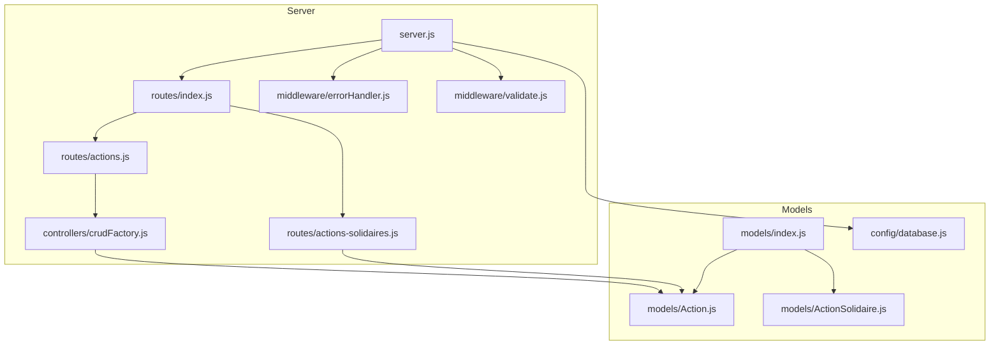
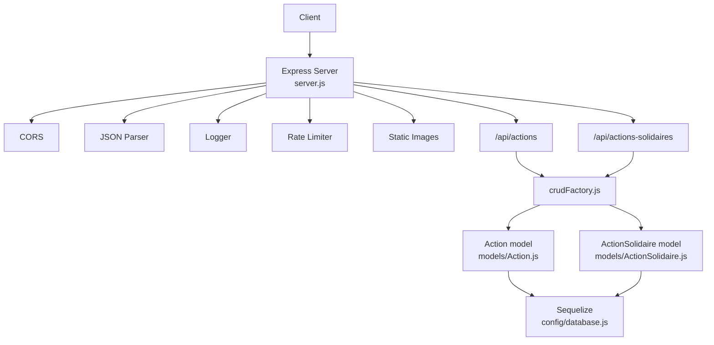
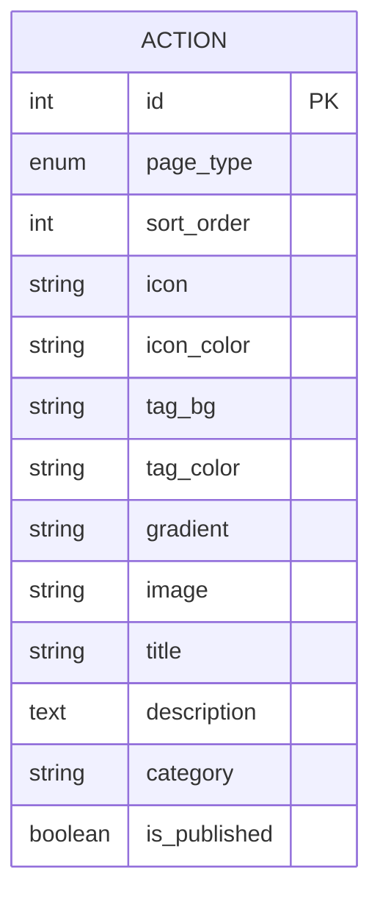
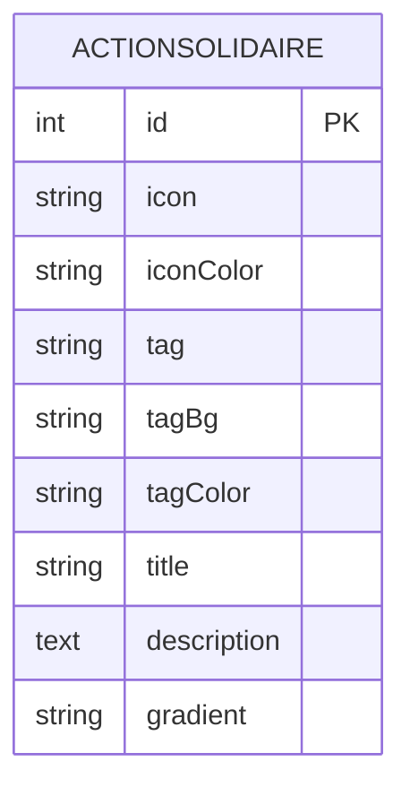
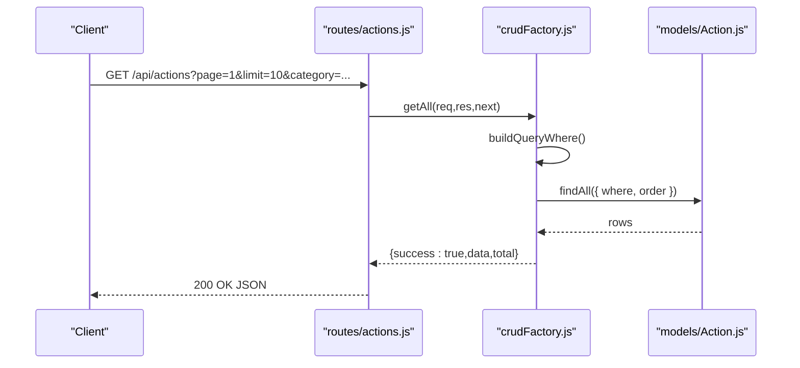
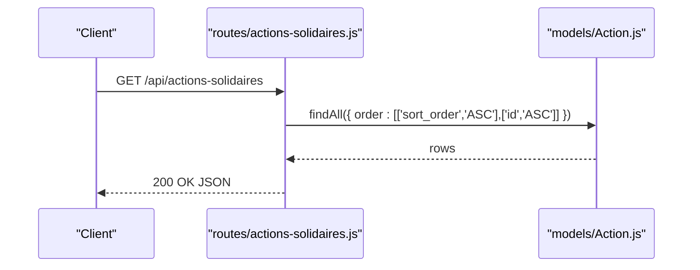
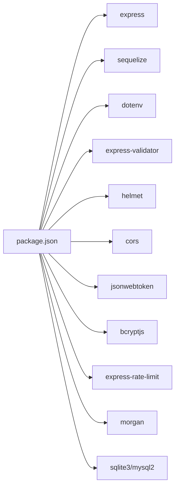

# Action Programs API

<cite>
**Referenced Files in This Document**
- [server.js](file://rsf-backend/server.js)
- [routes/index.js](file://rsf-backend/routes/index.js)
- [routes/actions.js](file://rsf-backend/routes/actions.js)
- [routes/actions-solidaires.js](file://rsf-backend/routes/actions-solidaires.js)
- [controllers/crudFactory.js](file://rsf-backend/controllers/crudFactory.js)
- [middleware/errorHandler.js](file://rsf-backend/middleware/errorHandler.js)
- [middleware/validate.js](file://rsf-backend/middleware/validate.js)
- [models/index.js](file://rsf-backend/models/index.js)
- [models/Action.js](file://rsf-backend/models/Action.js)
- [models/ActionSolidaire.js](file://rsf-backend/models/ActionSolidaire.js)
- [config/database.js](file://rsf-backend/config/database.js)
- [package.json](file://rsf-backend/package.json)
</cite>

## Table of Contents
1. [Introduction](#introduction)
2. [Project Structure](#project-structure)
3. [Core Components](#core-components)
4. [Architecture Overview](#architecture-overview)
5. [Detailed Component Analysis](#detailed-component-analysis)
6. [Dependency Analysis](#dependency-analysis)
7. [Performance Considerations](#performance-considerations)
8. [Troubleshooting Guide](#troubleshooting-guide)
9. [Conclusion](#conclusion)
10. [Appendices](#appendices)

## Introduction
This document describes the Action Programs API responsible for managing domestic solidarity actions and international cooperation programs. It covers:
- The Action model for domestic solidarity initiatives
- The ActionSolidaire model for international cooperation programs
- API endpoints for retrieving action listings, individual records, reordering, creation, updates, and deletions
- Filtering and ordering mechanisms
- Data structures for action descriptions, target groups, program objectives, and implementation details
- Examples of action retrieval, program categorization, and geographic distribution queries
- Validation rules and integration with the broader content management system

## Project Structure
The backend API is organized around Express routes, Sequelize models, and a generic CRUD controller factory. Routes are mounted under /api, with separate endpoints for domestic actions and international actions.

**Diagram sources**
- [server.js:1-84](file://rsf-backend/server.js#L1-L84)
- [routes/index.js:1-28](file://rsf-backend/routes/index.js#L1-L28)
- [routes/actions.js:1-19](file://rsf-backend/routes/actions.js#L1-L19)
- [routes/actions-solidaires.js:1-15](file://rsf-backend/routes/actions-solidaires.js#L1-L15)
- [controllers/crudFactory.js:1-100](file://rsf-backend/controllers/crudFactory.js#L1-L100)
- [models/index.js:1-53](file://rsf-backend/models/index.js#L1-L53)
- [models/Action.js:1-22](file://rsf-backend/models/Action.js#L1-L22)
- [models/ActionSolidaire.js:1-49](file://rsf-backend/models/ActionSolidaire.js#L1-L49)
- [config/database.js:1-69](file://rsf-backend/config/database.js#L1-L69)

**Section sources**
- [server.js:1-84](file://rsf-backend/server.js#L1-L84)
- [routes/index.js:1-28](file://rsf-backend/routes/index.js#L1-L28)

## Core Components
- Action model: Represents domestic solidarity actions with fields for icon, image, title, category, description, page type, color and tag styling, gradient, publication status, and sort order.
- ActionSolidaire model: Represents international cooperation actions with icon, icon color, tag attributes, title, description, and gradient.
- CRUD controller factory: Provides standardized GET (all and one), POST, PUT (reorder and update), and DELETE handlers with configurable ordering and public filters.
- Routes:
  - /api/actions: CRUD for Action with public listing filtered by publication status and sorting by sort_order.
  - /api/actions-solidaires: Public listing of Action ordered by sort_order and id.

**Section sources**
- [models/Action.js:1-22](file://rsf-backend/models/Action.js#L1-L22)
- [models/ActionSolidaire.js:1-49](file://rsf-backend/models/ActionSolidaire.js#L1-L49)
- [controllers/crudFactory.js:1-100](file://rsf-backend/controllers/crudFactory.js#L1-L100)
- [routes/actions.js:1-19](file://rsf-backend/routes/actions.js#L1-L19)
- [routes/actions-solidaires.js:1-15](file://rsf-backend/routes/actions-solidaires.js#L1-L15)

## Architecture Overview
The API follows a layered architecture:
- HTTP layer: Express server with middleware for CORS, JSON parsing, logging, rate limiting, and static image serving
- Routing layer: Mounted routes under /api
- Controller layer: Generic CRUD factory and specialized routes
- Data access layer: Sequelize ORM with configurable dialects (SQLite, MySQL/MariaDB, PostgreSQL)
- Models layer: Action and ActionSolidaire models plus other CMS entities

**Diagram sources**
- [server.js:1-84](file://rsf-backend/server.js#L1-L84)
- [routes/actions.js:1-19](file://rsf-backend/routes/actions.js#L1-L19)
- [routes/actions-solidaires.js:1-15](file://rsf-backend/routes/actions-solidaires.js#L1-L15)
- [controllers/crudFactory.js:1-100](file://rsf-backend/controllers/crudFactory.js#L1-L100)
- [models/Action.js:1-22](file://rsf-backend/models/Action.js#L1-L22)
- [models/ActionSolidaire.js:1-49](file://rsf-backend/models/ActionSolidaire.js#L1-L49)
- [config/database.js:1-69](file://rsf-backend/config/database.js#L1-L69)

## Detailed Component Analysis

### Action Model (Domestic Solidarity)
The Action model defines the schema for domestic solidarity actions:
- Identity and metadata: id, page_type (ENUM solidaire/international), sort_order
- Presentation: icon, icon_color, tag_bg, tag_color, gradient, image
- Content: title, description, category
- Publication: is_published

**Diagram sources**
- [models/Action.js:1-22](file://rsf-backend/models/Action.js#L1-L22)

**Section sources**
- [models/Action.js:1-22](file://rsf-backend/models/Action.js#L1-L22)

### ActionSolidaire Model (International Programs)
The ActionSolidaire model defines the schema for international cooperation actions:
- Identity: id
- Presentation: icon, iconColor, tag, tagBg, tagColor, gradient
- Content: title, description

**Diagram sources**
- [models/ActionSolidaire.js:1-49](file://rsf-backend/models/ActionSolidaire.js#L1-L49)

**Section sources**
- [models/ActionSolidaire.js:1-49](file://rsf-backend/models/ActionSolidaire.js#L1-L49)

### API Endpoints

#### Domestic Actions (/api/actions)
- GET /api/actions
  - Retrieves all published actions by default, supports query filters mapped to model attributes
  - Ordering: sort_order ascending, then id ascending
  - Response: { success: true, data: [...], total: number }
- GET /api/actions/:id
  - Retrieves a single action by ID
  - Response: { success: true, data: Action }
- POST /api/actions
  - Creates a new action
  - Response: { success: true, message: "... créé(e).", data: Action }
- PUT /api/actions/reorder
  - Reorders actions via an array of { id, sort_order }
  - Response: { success: true, message: "Ordre mis à jour." }
- PUT /api/actions/:id
  - Updates an existing action
  - Response: { success: true, message: "... mis(e) à jour.", data: Action }
- DELETE /api/actions/:id
  - Deletes an action
  - Response: { success: true, message: "... supprimé(e)." }

Validation and error handling:
- Query parameters are sanitized and cast to appropriate types
- Non-existent resources return 404
- Database validation errors return 422 with field-specific messages
- Other errors return 500 with environment-appropriate messages

**Diagram sources**
- [routes/actions.js:1-19](file://rsf-backend/routes/actions.js#L1-L19)
- [controllers/crudFactory.js:16-52](file://rsf-backend/controllers/crudFactory.js#L16-L52)
- [models/Action.js:1-22](file://rsf-backend/models/Action.js#L1-L22)

**Section sources**
- [routes/actions.js:1-19](file://rsf-backend/routes/actions.js#L1-L19)
- [controllers/crudFactory.js:16-96](file://rsf-backend/controllers/crudFactory.js#L16-L96)
- [middleware/errorHandler.js:1-38](file://rsf-backend/middleware/errorHandler.js#L1-L38)

#### International Actions (/api/actions-solidaires)
- GET /api/actions-solidaires
  - Retrieves all actions ordered by sort_order, then id
  - Response: JSON array of actions

Notes:
- This route does not apply publication filters; it exposes all actions
- It uses the Action model but is mounted under a dedicated route for international actions

**Diagram sources**
- [routes/actions-solidaires.js:1-15](file://rsf-backend/routes/actions-solidaires.js#L1-L15)
- [models/Action.js:1-22](file://rsf-backend/models/Action.js#L1-L22)

**Section sources**
- [routes/actions-solidaires.js:1-15](file://rsf-backend/routes/actions-solidaires.js#L1-L15)

### Data Structures and Fields

#### Action (Domestic Solidarity)
- Identity and metadata
  - id: integer, primary key
  - page_type: ENUM('solidaire','international'), default 'solidaire'
  - sort_order: integer, default 0
- Presentation
  - icon: string (emoji or icon identifier)
  - icon_color: string (color)
  - tag_bg: string (background color)
  - tag_color: string (text color)
  - gradient: string (gradient definition)
  - image: string (image path)
- Content
  - title: string (up to 200 chars)
  - description: text (required)
  - category: string (optional)
- Publication
  - is_published: boolean, default true

#### ActionSolidaire (International Programs)
- Identity
  - id: integer, primary key
- Presentation
  - icon: string
  - iconColor: string
  - tag: string
  - tagBg: string
  - tagColor: string
  - gradient: string
- Content
  - title: string
  - description: text

Usage guidelines:
- Use category to group actions for filtering and display
- Use page_type to distinguish domestic vs international contexts
- Use sort_order to control presentation order; reorder endpoint updates multiple records atomically

**Section sources**
- [models/Action.js:1-22](file://rsf-backend/models/Action.js#L1-L22)
- [models/ActionSolidaire.js:1-49](file://rsf-backend/models/ActionSolidaire.js#L1-L49)

### Filtering and Ordering
- Query-based filtering
  - Any query parameter whose name matches a model attribute is included in WHERE conditions
  - Boolean and numeric values are cast appropriately
  - Pagination parameters (page, limit, offset) and sorting parameters (sort, order) are ignored in WHERE clauses
- Ordering
  - Default order: sort_order ASC, then id ASC
  - International listing uses explicit order: sort_order ASC, id ASC
- Public filter
  - Published listing applies is_published=true automatically for unauthenticated requests

**Section sources**
- [controllers/crudFactory.js:16-31](file://rsf-backend/controllers/crudFactory.js#L16-L31)
- [controllers/crudFactory.js:39-49](file://rsf-backend/controllers/crudFactory.js#L39-L49)
- [routes/actions.js:6-9](file://rsf-backend/routes/actions.js#L6-L9)
- [routes/actions-solidaires.js:4-12](file://rsf-backend/routes/actions-solidaires.js#L4-L12)

### Examples

#### Retrieve Domestic Actions with Category Filter
- Endpoint: GET /api/actions?category=health
- Behavior: Returns published actions matching category, ordered by sort_order

#### Retrieve International Actions
- Endpoint: GET /api/actions-solidaires
- Behavior: Returns all actions ordered by sort_order and id

#### Reorder Domestic Actions
- Endpoint: PUT /api/actions/reorder
- Request body: { order: [{ id: number, sort_order: number }, ...] }
- Behavior: Updates sort_order for each provided action

#### Create a New Domestic Action
- Endpoint: POST /api/actions
- Request body: Action payload (omit id; page_type defaults to 'solidaire')
- Response: 201 with created resource

#### Update a Domestic Action
- Endpoint: PUT /api/actions/:id
- Request body: Partial Action fields
- Response: Updated resource

#### Delete a Domestic Action
- Endpoint: DELETE /api/actions/:id
- Response: Deletion confirmation

**Section sources**
- [routes/actions.js:11-16](file://rsf-backend/routes/actions.js#L11-L16)
- [controllers/crudFactory.js:87-96](file://rsf-backend/controllers/crudFactory.js#L87-L96)
- [routes/actions-solidaires.js:4-12](file://rsf-backend/routes/actions-solidaires.js#L4-L12)

## Dependency Analysis
The API integrates several layers and external libraries:
- Express for HTTP routing and middleware
- Sequelize for ORM and database abstraction
- dotenv for environment configuration
- bcryptjs, jsonwebtoken for authentication-related features (not used in action endpoints)
- express-validator for input validation (validate middleware present but not applied to action routes)

**Diagram sources**
- [package.json:1-34](file://rsf-backend/package.json#L1-L34)

**Section sources**
- [package.json:1-34](file://rsf-backend/package.json#L1-L34)

## Performance Considerations
- Sorting: Both endpoints rely on sort_order for ordering; ensure indices exist on sort_order and id for optimal performance
- Filtering: Query filters are applied via Sequelize where clauses; keep filterable fields indexed as needed
- Pagination: The CRUD factory ignores pagination parameters in WHERE clauses; implement server-side pagination if lists grow large
- Image serving: Static images are served from public/images; ensure appropriate caching headers and compression

## Troubleshooting Guide
Common issues and resolutions:
- 404 Not Found: Occurs when requesting a non-existent action ID
- 422 Unprocessable Entity: Returned for validation failures from database constraints or input validation middleware
- 500 Internal Server Error: Generic server error; check logs for stack traces
- Authentication: Protected routes require JWT; ensure Authorization header is set for admin endpoints

Operational checks:
- Health endpoint: GET /health confirms service availability and database dialect
- Database dialect: Supported dialects include sqlite, mysql, mariadb, postgres

**Section sources**
- [middleware/errorHandler.js:1-38](file://rsf-backend/middleware/errorHandler.js#L1-L38)
- [server.js:35-44](file://rsf-backend/server.js#L35-L44)
- [config/database.js:9-66](file://rsf-backend/config/database.js#L9-L66)

## Conclusion
The Action Programs API provides a robust foundation for managing domestic solidarity actions and international cooperation programs. Its generic CRUD factory simplifies maintenance, while explicit routes enable distinct behaviors for domestic and international listings. The schema supports rich presentation and flexible filtering, enabling content editors to curate and publish actionable content effectively.

## Appendices

### API Endpoints Summary
- GET /api/actions
  - Filters: any model attribute; pagination params ignored in WHERE
  - Ordering: sort_order ASC, id ASC
  - Public filter: is_published=true for unauthenticated
- GET /api/actions/:id
  - Single record retrieval
- POST /api/actions
  - Create action
- PUT /api/actions/reorder
  - Batch reorder actions
- PUT /api/actions/:id
  - Update action
- DELETE /api/actions/:id
  - Delete action
- GET /api/actions-solidaires
  - List all actions ordered by sort_order, id

**Section sources**
- [routes/actions.js:11-16](file://rsf-backend/routes/actions.js#L11-L16)
- [routes/actions-solidaires.js:4-12](file://rsf-backend/routes/actions-solidaires.js#L4-L12)