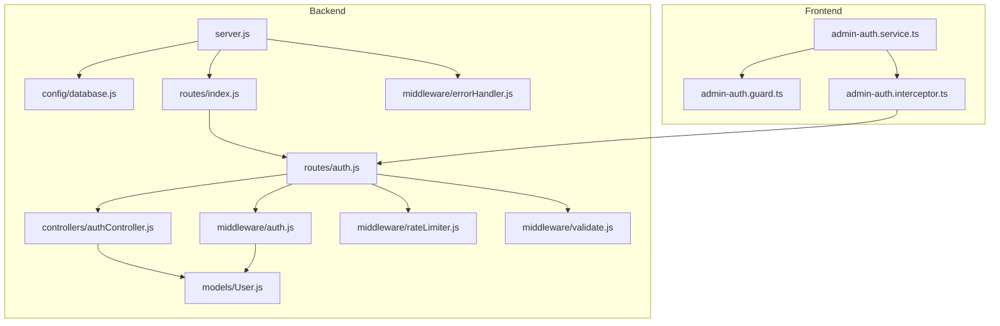
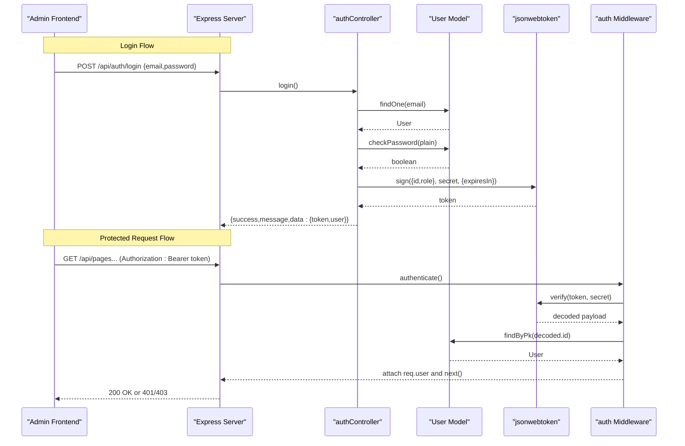
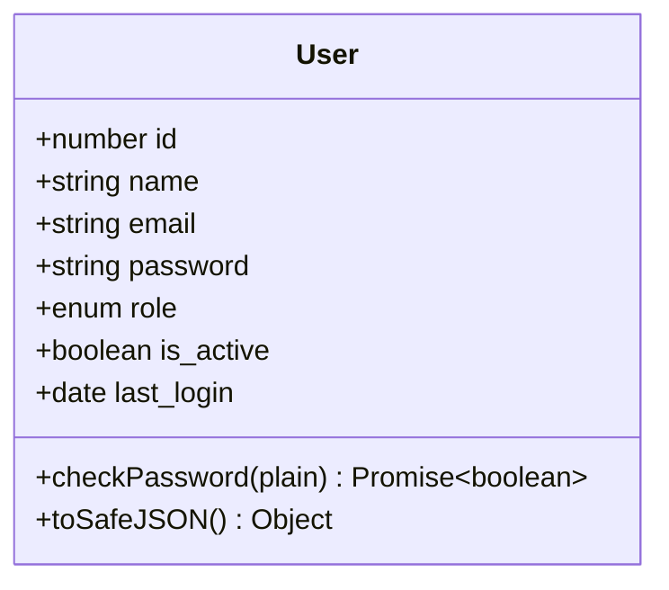
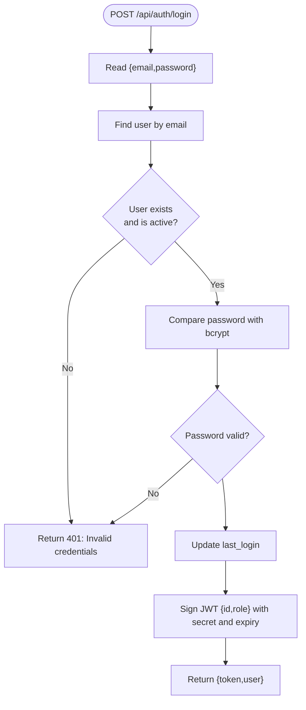
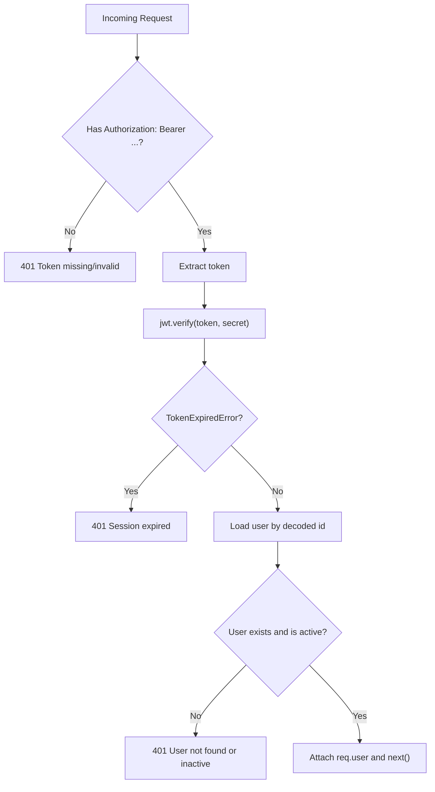
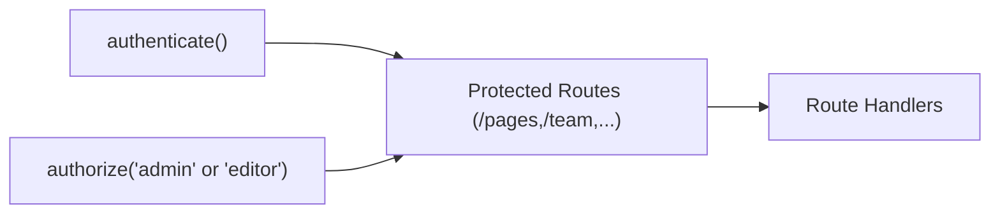
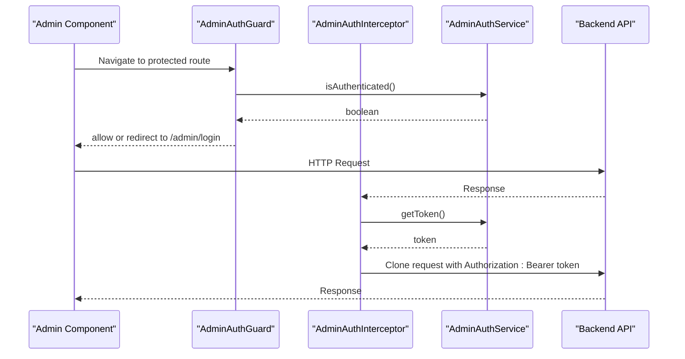
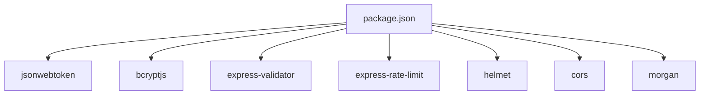

# Authentication and Authorization

<cite>
**Referenced Files in This Document**
- [server.js](file://rsf-backend/server.js)
- [config/database.js](file://rsf-backend/config/database.js)
- [routes/index.js](file://rsf-backend/routes/index.js)
- [routes/auth.js](file://rsf-backend/routes/auth.js)
- [controllers/authController.js](file://rsf-backend/controllers/authController.js)
- [middleware/auth.js](file://rsf-backend/middleware/auth.js)
- [middleware/rateLimiter.js](file://rsf-backend/middleware/rateLimiter.js)
- [middleware/validate.js](file://rsf-backend/middleware/validate.js)
- [middleware/errorHandler.js](file://rsf-backend/middleware/errorHandler.js)
- [models/User.js](file://rsf-backend/models/User.js)
- [package.json](file://rsf-backend/package.json)
- [admin-auth.service.ts](file://rsf-front/src/app/admin/admin-auth.service.ts)
- [admin-auth.guard.ts](file://rsf-front/src/app/admin/admin-auth.guard.ts)
- [admin-auth.interceptor.ts](file://rsf-front/src/app/admin/admin-auth.interceptor.ts)
</cite>

## Table of Contents
1. [Introduction](#introduction)
2. [Project Structure](#project-structure)
3. [Core Components](#core-components)
4. [Architecture Overview](#architecture-overview)
5. [Detailed Component Analysis](#detailed-component-analysis)
6. [Dependency Analysis](#dependency-analysis)
7. [Performance Considerations](#performance-considerations)
8. [Troubleshooting Guide](#troubleshooting-guide)
9. [Conclusion](#conclusion)
10. [Appendices](#appendices)

## Introduction
This document provides comprehensive documentation for the JWT-based authentication and authorization system used by the admin portal. It covers the complete authentication flow from login to token validation, password hashing with bcryptjs, JWT token generation and verification, role-based access control, and protected route protection. It also documents the User model, password encryption processes, and outlines token refresh mechanisms. Practical examples of login requests, token validation, and protected endpoint access are included, along with security measures such as token expiration, rate limiting, and session management. Finally, it provides troubleshooting guidance for common authentication issues and integration examples for frontend applications.

## Project Structure
The authentication system spans backend and frontend components:
- Backend: Express server, routes, controllers, middleware, models, and configuration.
- Frontend: Angular services for authentication, guards, and HTTP interceptors.

**Diagram sources**
- [server.js:1-84](file://rsf-backend/server.js#L1-L84)
- [config/database.js:1-69](file://rsf-backend/config/database.js#L1-L69)
- [routes/index.js:1-28](file://rsf-backend/routes/index.js#L1-L28)
- [routes/auth.js:1-25](file://rsf-backend/routes/auth.js#L1-L25)
- [controllers/authController.js:1-60](file://rsf-backend/controllers/authController.js#L1-L60)
- [middleware/auth.js:1-50](file://rsf-backend/middleware/auth.js#L1-L50)
- [middleware/rateLimiter.js:1-21](file://rsf-backend/middleware/rateLimiter.js#L1-L21)
- [middleware/validate.js:1-22](file://rsf-backend/middleware/validate.js#L1-L22)
- [middleware/errorHandler.js:1-38](file://rsf-backend/middleware/errorHandler.js#L1-L38)
- [models/User.js:1-75](file://rsf-backend/models/User.js#L1-L75)
- [admin-auth.service.ts:1-107](file://rsf-front/src/app/admin/admin-auth.service.ts#L1-L107)
- [admin-auth.guard.ts:1-19](file://rsf-front/src/app/admin/admin-auth.guard.ts#L1-L19)
- [admin-auth.interceptor.ts:1-30](file://rsf-front/src/app/admin/admin-auth.interceptor.ts#L1-L30)

**Section sources**
- [server.js:1-84](file://rsf-backend/server.js#L1-L84)
- [routes/index.js:1-28](file://rsf-backend/routes/index.js#L1-L28)
- [routes/auth.js:1-25](file://rsf-backend/routes/auth.js#L1-L25)
- [controllers/authController.js:1-60](file://rsf-backend/controllers/authController.js#L1-L60)
- [middleware/auth.js:1-50](file://rsf-backend/middleware/auth.js#L1-L50)
- [models/User.js:1-75](file://rsf-backend/models/User.js#L1-L75)
- [admin-auth.service.ts:1-107](file://rsf-front/src/app/admin/admin-auth.service.ts#L1-L107)
- [admin-auth.guard.ts:1-19](file://rsf-front/src/app/admin/admin-auth.guard.ts#L1-L19)
- [admin-auth.interceptor.ts:1-30](file://rsf-front/src/app/admin/admin-auth.interceptor.ts#L1-L30)

## Core Components
- User model with bcrypt-based password hashing, safe serialization, and role enumeration.
- Authentication controller handling login, profile retrieval, and password change.
- Authentication middleware validating JWT tokens and enforcing role-based authorization.
- Route definitions for authentication endpoints with input validation and rate limiting.
- Frontend authentication service, guard, and HTTP interceptor for secure client-side integration.

Key implementation references:
- Password hashing and comparison via bcryptjs in the User model.
- JWT token generation and verification in the authentication controller and middleware.
- Role-based access control using the authorize middleware.
- Protected routes mounted under a global authentication middleware.

**Section sources**
- [models/User.js:1-75](file://rsf-backend/models/User.js#L1-L75)
- [controllers/authController.js:1-60](file://rsf-backend/controllers/authController.js#L1-L60)
- [middleware/auth.js:1-50](file://rsf-backend/middleware/auth.js#L1-L50)
- [routes/auth.js:1-25](file://rsf-backend/routes/auth.js#L1-L25)
- [admin-auth.service.ts:1-107](file://rsf-front/src/app/admin/admin-auth.service.ts#L1-L107)

## Architecture Overview
The authentication architecture enforces JWT-based authentication across the backend and integrates with the frontend via an HTTP interceptor and route guard.

**Diagram sources**
- [controllers/authController.js:6-36](file://rsf-backend/controllers/authController.js#L6-L36)
- [middleware/auth.js:10-33](file://rsf-backend/middleware/auth.js#L10-L33)
- [models/User.js:63-71](file://rsf-backend/models/User.js#L63-L71)
- [routes/auth.js:9-13](file://rsf-backend/routes/auth.js#L9-L13)
- [routes/index.js:13-26](file://rsf-backend/routes/index.js#L13-L26)

## Detailed Component Analysis

### User Model
The User model defines the schema, password hashing hooks, and helper methods:
- Fields: id, name, email, password, role, is_active, last_login.
- Hooks: automatic bcrypt hashing before create/update when password changes.
- Methods: checkPassword for bcrypt comparison and toSafeJSON for safe serialization.

**Diagram sources**
- [models/User.js:6-71](file://rsf-backend/models/User.js#L6-L71)

**Section sources**
- [models/User.js:1-75](file://rsf-backend/models/User.js#L1-L75)

### Authentication Controller
Handles:
- POST /api/auth/login: validates credentials, updates last_login, generates JWT, returns token and user.
- GET /api/auth/me: returns authenticated user profile.
- POST /api/auth/change-password: verifies current password and updates to new password.

**Diagram sources**
- [controllers/authController.js:6-36](file://rsf-backend/controllers/authController.js#L6-L36)
- [models/User.js:47-65](file://rsf-backend/models/User.js#L47-L65)

**Section sources**
- [controllers/authController.js:1-60](file://rsf-backend/controllers/authController.js#L1-L60)
- [routes/auth.js:9-22](file://rsf-backend/routes/auth.js#L9-L22)

### Authentication Middleware
Provides:
- authenticate: extracts Bearer token from Authorization header, verifies JWT, loads user, attaches to req.user.
- authorize: role-based enforcement after authenticate.

**Diagram sources**
- [middleware/auth.js:10-33](file://rsf-backend/middleware/auth.js#L10-L33)

**Section sources**
- [middleware/auth.js:1-50](file://rsf-backend/middleware/auth.js#L1-L50)

### Protected Routes and Role-Based Access Control
- Global authentication middleware is applied to admin-only routes.
- authorize(role) ensures only authorized roles can access specific endpoints.

**Diagram sources**
- [routes/index.js:13-26](file://rsf-backend/routes/index.js#L13-L26)
- [middleware/auth.js:39-47](file://rsf-backend/middleware/auth.js#L39-L47)

**Section sources**
- [routes/index.js:1-28](file://rsf-backend/routes/index.js#L1-L28)
- [middleware/auth.js:35-47](file://rsf-backend/middleware/auth.js#L35-L47)

### Frontend Authentication Integration
- AdminAuthService: manages session state, persists token/user, exposes helpers.
- AdminAuthGuard: protects routes requiring authentication.
- AdminAuthInterceptor: automatically attaches Authorization header and handles 401.

**Diagram sources**
- [admin-auth.guard.ts:5-18](file://rsf-front/src/app/admin/admin-auth.guard.ts#L5-L18)
- [admin-auth.interceptor.ts:7-29](file://rsf-front/src/app/admin/admin-auth.interceptor.ts#L7-L29)
- [admin-auth.service.ts:38-69](file://rsf-front/src/app/admin/admin-auth.service.ts#L38-L69)

**Section sources**
- [admin-auth.service.ts:1-107](file://rsf-front/src/app/admin/admin-auth.service.ts#L1-L107)
- [admin-auth.guard.ts:1-19](file://rsf-front/src/app/admin/admin-auth.guard.ts#L1-L19)
- [admin-auth.interceptor.ts:1-30](file://rsf-front/src/app/admin/admin-auth.interceptor.ts#L1-L30)

## Dependency Analysis
External libraries and their roles:
- jsonwebtoken: JWT signing and verification.
- bcryptjs: Password hashing and comparison.
- express-validator: Input validation for login and password change.
- express-rate-limit: Rate limiting for login and global traffic.
- helmet, cors, morgan: Security headers, CORS, and request logging.
- sequelize: ORM for User model and database abstraction.

**Diagram sources**
- [package.json:16-28](file://rsf-backend/package.json#L16-L28)

**Section sources**
- [package.json:1-34](file://rsf-backend/package.json#L1-L34)

## Performance Considerations
- Token expiration: Configure JWT expiration via environment variable to balance security and UX.
- Rate limiting: Login attempts are rate-limited to mitigate brute-force attacks.
- Database queries: Ensure indexes on email for efficient user lookup.
- Payload size: Keep JWT payload minimal (id, role) to reduce overhead.
- Caching: Consider caching non-sensitive user metadata per session to reduce DB load.

[No sources needed since this section provides general guidance]

## Troubleshooting Guide
Common issues and resolutions:
- Invalid credentials during login:
  - Ensure email and password are provided and valid.
  - Confirm user is active and password matches bcrypt hash.
- Missing or malformed Authorization header:
  - Verify frontend interceptor attaches Bearer token for API requests.
- Token expired:
  - Implement token refresh mechanism or prompt user to log in again.
- 403 Forbidden:
  - Confirm user role meets required authorization level.
- Database connection errors:
  - Check database configuration and connectivity.
- Validation errors:
  - Review input validation messages for required fields and formats.

**Section sources**
- [controllers/authController.js:12-17](file://rsf-backend/controllers/authController.js#L12-L17)
- [middleware/auth.js:13-32](file://rsf-backend/middleware/auth.js#L13-L32)
- [middleware/rateLimiter.js:14-18](file://rsf-backend/middleware/rateLimiter.js#L14-L18)
- [middleware/validate.js:9-19](file://rsf-backend/middleware/validate.js#L9-L19)
- [config/database.js:31-66](file://rsf-backend/config/database.js#L31-L66)

## Conclusion
The authentication system provides a robust JWT-based solution with bcrypt password hashing, input validation, rate limiting, and role-based access control. The backend enforces authentication globally for admin routes while the frontend integrates seamlessly via a dedicated service, guard, and interceptor. To enhance resilience, consider implementing token refresh and optional logout endpoints, and ensure environment variables are configured securely.

[No sources needed since this section summarizes without analyzing specific files]

## Appendices

### Environment Variables
- JWT_SECRET: Secret key for signing JWTs.
- JWT_EXPIRES_IN: Token lifetime (e.g., 7d).
- DB_DIALECT: Database dialect (sqlite, mysql, postgres).
- DB_*: Database connection parameters depending on dialect.

**Section sources**
- [controllers/authController.js:22-26](file://rsf-backend/controllers/authController.js#L22-L26)
- [config/database.js:9-66](file://rsf-backend/config/database.js#L9-L66)

### Practical Examples

- Login request:
  - Endpoint: POST /api/auth/login
  - Body: { email, password }
  - Response: { success, message, data: { token, user } }

- Get authenticated profile:
  - Endpoint: GET /api/auth/me
  - Requires: Authorization: Bearer <token>
  - Response: { success, data: user }

- Change password:
  - Endpoint: POST /api/auth/change-password
  - Body: { current_password, new_password }
  - Response: { success, message }

- Protected endpoint access:
  - Apply authenticate middleware to routes.
  - Optionally apply authorize('admin' or 'editor') for role checks.

**Section sources**
- [routes/auth.js:9-22](file://rsf-backend/routes/auth.js#L9-L22)
- [controllers/authController.js:38-57](file://rsf-backend/controllers/authController.js#L38-L57)
- [routes/index.js:13-26](file://rsf-backend/routes/index.js#L13-L26)
- [middleware/auth.js:39-47](file://rsf-backend/middleware/auth.js#L39-L47)

### Security Measures
- Token expiration: Controlled via JWT_EXPIRES_IN.
- Refresh token handling: Not implemented; consider adding refresh endpoints and secure refresh tokens.
- Session management: Frontend stores token in local storage; ensure HTTPS and secure headers.
- Rate limiting: Strict limits for login attempts and global rate limiting.
- Input validation: Validates email format and required fields.

**Section sources**
- [controllers/authController.js:22-26](file://rsf-backend/controllers/authController.js#L22-L26)
- [admin-auth.service.ts:84-105](file://rsf-front/src/app/admin/admin-auth.service.ts#L84-L105)
- [middleware/rateLimiter.js:14-18](file://rsf-backend/middleware/rateLimiter.js#L14-L18)
- [middleware/validate.js:9-19](file://rsf-backend/middleware/validate.js#L9-L19)