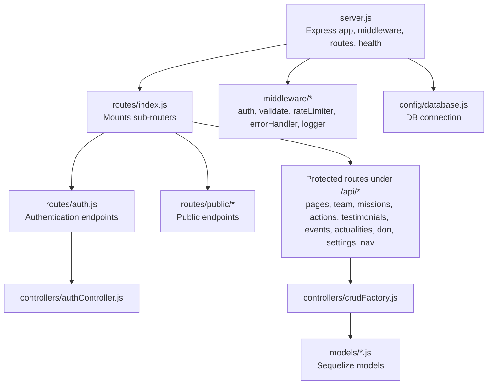
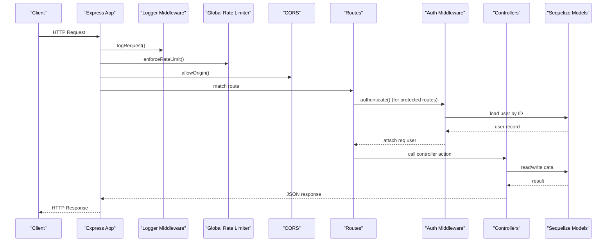
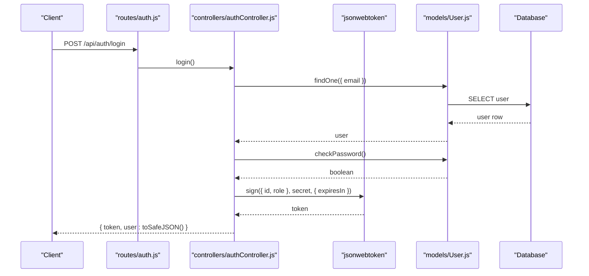
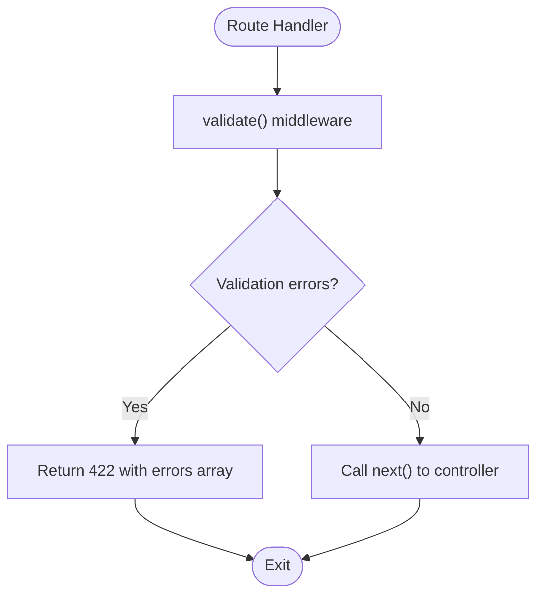
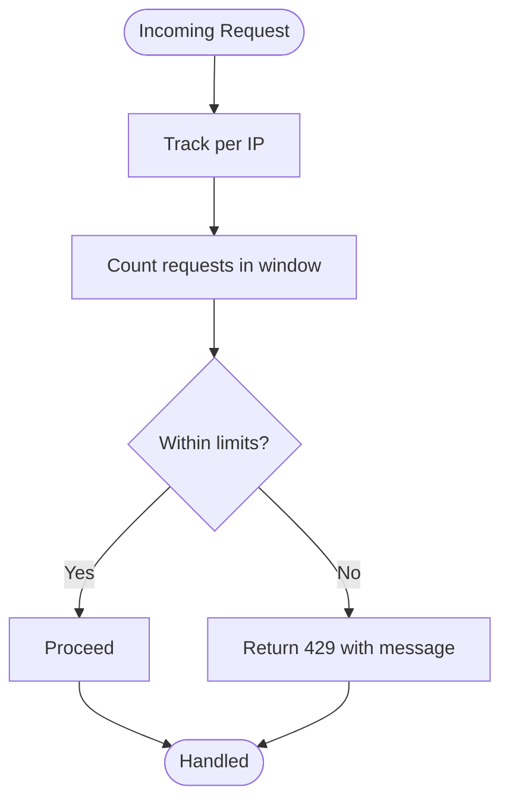
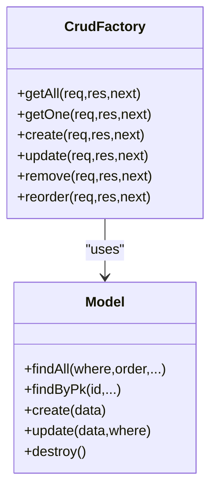
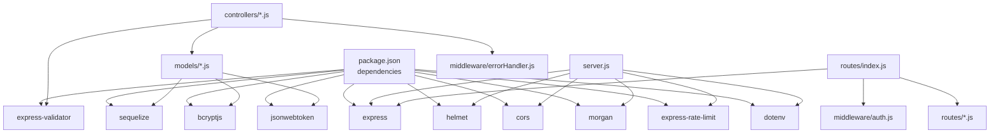

# Backend API Documentation

<cite>
**Referenced Files in This Document**
- [server.js](file://server.js)
- [package.json](file://package.json)
- [routes/index.js](file://routes/index.js)
- [routes/auth.js](file://routes/auth.js)
- [routes/pages.js](file://routes/pages.js)
- [routes/team.js](file://routes/team.js)
- [routes/events.js](file://routes/events.js)
- [routes/actualities.js](file://routes/actualities.js)
- [routes/testimonials.js](file://routes/testimonials.js)
- [middleware/auth.js](file://middleware/auth.js)
- [middleware/validate.js](file://middleware/validate.js)
- [middleware/rateLimiter.js](file://middleware/rateLimiter.js)
- [middleware/errorHandler.js](file://middleware/errorHandler.js)
- [middleware/logger.js](file://middleware/logger.js)
- [controllers/authController.js](file://controllers/authController.js)
- [controllers/crudFactory.js](file://controllers/crudFactory.js)
- [models/User.js](file://models/User.js)
- [config/database.js](file://config/database.js)
- [models/index.js](file://models/index.js)
</cite>

## Table of Contents
1. [Introduction](#introduction)
2. [Project Structure](#project-structure)
3. [Core Components](#core-components)
4. [Architecture Overview](#architecture-overview)
5. [Detailed Component Analysis](#detailed-component-analysis)
6. [Dependency Analysis](#dependency-analysis)
7. [Performance Considerations](#performance-considerations)
8. [Troubleshooting Guide](#troubleshooting-guide)
9. [Conclusion](#conclusion)
10. [Appendices](#appendices)

## Introduction
This document describes the backend API for the Réseau Solidarité France platform built with Express.js. It covers the routing structure, middleware pipeline, authentication and authorization using JWT, the CRUD factory pattern for streamlined API development, and the complete set of endpoints grouped by functional areas. It also documents request/response patterns, parameter validation, error handling, security measures, rate limiting, CORS configuration, and practical usage examples with curl commands.

## Project Structure
The backend is organized around a classic layered architecture:
- Entry point initializes Express, middleware, static assets, routes, health endpoint, and error handling.
- Routes define API namespaces and attach controller actions.
- Controllers implement business logic and delegate persistence to models via Sequelize.
- Models define the data schema and include hooks for secure password hashing and safe serialization.
- Middleware provides authentication, authorization, validation, logging, rate limiting, and centralized error handling.

**Diagram sources**
- [server.js:18-34](file://server.js#L18-L34)
- [routes/index.js:3-27](file://routes/index.js#L3-L27)
- [controllers/authController.js:1-60](file://controllers/authController.js#L1-L60)
- [controllers/crudFactory.js:1-100](file://controllers/crudFactory.js#L1-L100)
- [middleware/auth.js:1-50](file://middleware/auth.js#L1-L50)
- [middleware/validate.js:1-22](file://middleware/validate.js#L1-L22)
- [middleware/rateLimiter.js:1-21](file://middleware/rateLimiter.js#L1-L21)
- [middleware/errorHandler.js](file://middleware/errorHandler.js)
- [middleware/logger.js](file://middleware/logger.js)
- [config/database.js](file://config/database.js)
- [models/index.js](file://models/index.js)

**Section sources**
- [server.js:18-52](file://server.js#L18-L52)
- [routes/index.js:3-27](file://routes/index.js#L3-L27)

## Core Components
- Express server initialization and middleware stack:
  - Security headers, CORS, JSON parsing, URL-encoded parsing, logging, global rate limiting, static image serving, health endpoint, 404 handling, and global error handler.
- Routing:
  - Public routes mounted under /api/auth and /api/public.
  - Protected routes mounted under /api and guarded by JWT authentication middleware.
- Authentication and Authorization:
  - JWT verification attaches user context; role-based authorization restricts access to admin-only endpoints.
- Validation:
  - express-validator rules combined with a validation middleware to return structured 422 responses.
- Rate Limiting:
  - Global limiter and stricter limiter for login attempts.
- Error Handling:
  - Centralized error handler and a helper to create typed errors.
- Logging:
  - Request logging middleware.
- Database:
  - Sequelize ORM configured in config/database.js with models in models/.

**Section sources**
- [server.js:21-52](file://server.js#L21-L52)
- [routes/index.js:7-26](file://routes/index.js#L7-L26)
- [middleware/auth.js:10-47](file://middleware/auth.js#L10-L47)
- [middleware/validate.js:9-19](file://middleware/validate.js#L9-L19)
- [middleware/rateLimiter.js:5-18](file://middleware/rateLimiter.js#L5-L18)
- [middleware/errorHandler.js](file://middleware/errorHandler.js)
- [middleware/logger.js](file://middleware/logger.js)
- [config/database.js](file://config/database.js)

## Architecture Overview
The API follows a layered architecture:
- HTTP Layer: Express app with middleware pipeline.
- Routing Layer: Route files mount controllers per domain.
- Controller Layer: Business logic, validation, and delegation to models.
- Persistence Layer: Sequelize models and database connection.
- Security Layer: JWT auth, role checks, rate limits, and CORS.

**Diagram sources**
- [server.js:21-34](file://server.js#L21-L34)
- [routes/index.js:13-26](file://routes/index.js#L13-L26)
- [middleware/auth.js:10-33](file://middleware/auth.js#L10-L33)
- [controllers/authController.js:7-36](file://controllers/authController.js#L7-L36)
- [models/User.js:47-71](file://models/User.js#L47-L71)

## Detailed Component Analysis

### Authentication and Authorization
- Login endpoint validates email/password, verifies user activity, updates last login, and issues a signed JWT with configurable expiry.
- Protected routes require a valid Bearer token; the middleware loads the user and ensures active status.
- Role-based authorization middleware restricts endpoints to specific roles after successful authentication.

**Diagram sources**
- [routes/auth.js:10-13](file://routes/auth.js#L10-L13)
- [controllers/authController.js:7-36](file://controllers/authController.js#L7-L36)
- [models/User.js:63-71](file://models/User.js#L63-L71)

**Section sources**
- [routes/auth.js:9-22](file://routes/auth.js#L9-L22)
- [controllers/authController.js:7-36](file://controllers/authController.js#L7-L36)
- [middleware/auth.js:10-47](file://middleware/auth.js#L10-L47)
- [models/User.js:27-30](file://models/User.js#L27-L30)

### Validation Pipeline
- Validation rules are declared per route using express-validator.
- A single validation middleware checks for errors and returns a structured 422 response with field-level messages.

**Diagram sources**
- [middleware/validate.js:9-19](file://middleware/validate.js#L9-L19)
- [routes/auth.js:10-13](file://routes/auth.js#L10-L13)

**Section sources**
- [middleware/validate.js:9-19](file://middleware/validate.js#L9-L19)
- [routes/auth.js:10-13](file://routes/auth.js#L10-L13)

### Rate Limiting
- Global limiter enforces 200 requests per 15 minutes per IP.
- Login limiter enforces 10 attempts per 15 minutes per IP.

**Diagram sources**
- [middleware/rateLimiter.js:5-18](file://middleware/rateLimiter.js#L5-L18)

**Section sources**
- [middleware/rateLimiter.js:5-18](file://middleware/rateLimiter.js#L5-L18)

### CRUD Factory Pattern
- The factory generates standard CRUD operations for any Sequelize model.
- Supports filtering by query parameters, ordering, and optional public filters.
- Includes a reordering operation for sortable records.

**Diagram sources**
- [controllers/crudFactory.js:39-96](file://controllers/crudFactory.js#L39-L96)

**Section sources**
- [controllers/crudFactory.js:39-96](file://controllers/crudFactory.js#L39-L96)

### Endpoint Catalog

#### Authentication
- POST /api/auth/login
  - Body: email, password
  - Response: token, user (without password)
  - Validation: email format, password present
  - Rate limiting: strict limiter
- GET /api/auth/me
  - Response: logged-in user profile
  - Auth: JWT required
- POST /api/auth/change-password
  - Body: current_password, new_password (min length)
  - Auth: JWT required

**Section sources**
- [routes/auth.js:9-22](file://routes/auth.js#L9-L22)
- [controllers/authController.js:7-57](file://controllers/authController.js#L7-L57)
- [middleware/rateLimiter.js:14-18](file://middleware/rateLimiter.js#L14-L18)

#### Pages
- GET /api/pages
  - Response: list of pages
- GET /api/pages/:pageKey
  - Response: single page
- PUT /api/pages/:pageKey
  - Body: page content fields
  - Auth: JWT required

**Section sources**
- [routes/pages.js:5-7](file://routes/pages.js#L5-L7)

#### Team Management
- GET /api/team
- GET /api/team/:id
- POST /api/team
- PUT /api/team/:id
- DELETE /api/team/:id
- PUT /api/team/reorder
  - Body: array of { id, sort_order }
  - Auth: JWT required

**Section sources**
- [routes/team.js:5-10](file://routes/team.js#L5-L10)

#### Events
- GET /api/events
- GET /api/events/:id
- POST /api/events
- PUT /api/events/:id
- DELETE /api/events/:id
- PUT /api/events/reorder
  - Body: array of { id, sort_order }
  - Auth: JWT required

**Section sources**
- [routes/events.js:4-9](file://routes/events.js#L4-L9)

#### Actualities (News)
- GET /api/actualities
  - Query params: pagination/ordering via ignored keys
  - Public filter: only published items for non-authenticated users
- GET /api/actualities/:id
- POST /api/actualities
- PUT /api/actualities/:id
- DELETE /api/actualities/:id
- PUT /api/actualities/reorder
  - Body: array of { id, sort_order }

**Section sources**
- [routes/actualities.js:6-16](file://routes/actualities.js#L6-L16)

#### Testimonials
- GET /api/testimonials
  - Query params: pagination/ordering via ignored keys
  - Public filter: only published items for non-authenticated users
- GET /api/testimonials/:id
- POST /api/testimonials
- PUT /api/testimonials/:id
- DELETE /api/testimonials/:id
- PUT /api/testimonials/reorder
  - Body: array of { id, sort_order }

**Section sources**
- [routes/testimonials.js:6-16](file://routes/testimonials.js#L6-L16)

#### Additional Protected Areas
- /api/missions, /api/actions, /api/don, /api/settings, /api/nav
  - Follow the same CRUD pattern as other protected resources.
  - Auth: JWT required; some endpoints may require admin role depending on controller implementation.

**Section sources**
- [routes/index.js:16-25](file://routes/index.js#L16-L25)

### Request/Response Patterns and Validation
- All protected endpoints require Authorization: Bearer <token>.
- Successful responses include success: true and data payload.
- Validation failures return 422 with errors array containing field and message.
- Not found resources return 404 via factory error helper.
- Rate limit violations return 429 with a message.

**Section sources**
- [middleware/validate.js:9-19](file://middleware/validate.js#L9-L19)
- [controllers/crudFactory.js:57-84](file://controllers/crudFactory.js#L57-L84)
- [middleware/rateLimiter.js:5-18](file://middleware/rateLimiter.js#L5-L18)

### Security Measures
- JWT-based authentication with role-based authorization.
- Passwords hashed with bcrypt before creation/update.
- Safe user serialization excludes sensitive fields.
- Helmet disabled by default; CORS enabled broadly; consider tightening in production.
- Rate limiting applied globally and specifically to login.

**Section sources**
- [middleware/auth.js:10-47](file://middleware/auth.js#L10-L47)
- [models/User.js:47-71](file://models/User.js#L47-L71)
- [server.js:22-24](file://server.js#L22-L24)
- [middleware/rateLimiter.js:5-18](file://middleware/rateLimiter.js#L5-L18)

### Practical Usage Examples

- Login
  - curl -X POST "$BASE_URL/api/auth/login" -H "Content-Type: application/json" -d '{"email":"admin@rsf.fr","password":"your_password"}'
- Get my profile
  - curl -H "Authorization: Bearer $TOKEN" "$BASE_URL/api/auth/me"
- Change password
  - curl -X POST "$BASE_URL/api/auth/change-password" -H "Authorization: Bearer $TOKEN" -H "Content-Type: application/json" -d '{"current_password":"old","new_password":"new_secure_password"}'
- List testimonials (public)
  - curl "$BASE_URL/api/testimonials"
- Create a team member (admin/editor)
  - curl -X POST "$BASE_URL/api/team" -H "Authorization: Bearer $TOKEN" -H "Content-Type: application/json" -d '{"name":"John","role":"member","biography":"..."}'

Notes:
- Replace $BASE_URL with your host and port.
- Use Authorization header for protected endpoints.
- Respect rate limits and validation rules.

## Dependency Analysis
The backend depends on Express, Sequelize, bcrypt, jsonwebtoken, helmet, cors, morgan, express-rate-limit, express-validator, and dotenv. The server mounts middleware and routes, while controllers depend on models and validation middleware.

**Diagram sources**
- [package.json:16-28](file://package.json#L16-L28)
- [server.js:7-16](file://server.js#L7-L16)
- [routes/index.js:4](file://routes/index.js#L4)
- [controllers/authController.js:2](file://controllers/authController.js#L2)
- [controllers/crudFactory.js:3](file://controllers/crudFactory.js#L3)
- [middleware/auth.js:3](file://middleware/auth.js#L3)
- [middleware/errorHandler.js](file://middleware/errorHandler.js)
- [models/User.js:3](file://models/User.js#L3)

**Section sources**
- [package.json:16-28](file://package.json#L16-L28)
- [server.js:7-16](file://server.js#L7-L16)
- [routes/index.js:4](file://routes/index.js#L4)

## Performance Considerations
- Keep payloads reasonable; images served statically from /images.
- Use pagination/ordering via query parameters supported by the factory to avoid large result sets.
- Monitor rate limits to prevent throttling.
- Consider enabling Helmet and configuring CORS more strictly in production.

## Troubleshooting Guide
- 401 Unauthorized:
  - Missing or invalid Bearer token; expired token; inactive user.
- 403 Forbidden:
  - Insufficient role for the requested endpoint.
- 404 Not Found:
  - Resource not found by ID.
- 422 Unprocessable Entity:
  - Validation errors returned with field-level messages.
- 429 Too Many Requests:
  - Exceeded global or login rate limits.
- 500 Internal Server Error:
  - Centralized error handler returns generic server error; check logs.

**Section sources**
- [middleware/auth.js:13-32](file://middleware/auth.js#L13-L32)
- [middleware/errorHandler.js](file://middleware/errorHandler.js)
- [middleware/validate.js:9-19](file://middleware/validate.js#L9-L19)
- [middleware/rateLimiter.js:5-18](file://middleware/rateLimiter.js#L5-L18)

## Conclusion
The backend provides a robust, layered Express API with JWT authentication, role-based authorization, a reusable CRUD factory, and strong validation and rate limiting. The modular route/controller design enables rapid development of content management features while maintaining security and consistency.

## Appendices

### CORS and Security Headers
- CORS is enabled broadly; consider scoping origins in production.
- Helmet is imported but disabled by default; enable for additional security headers.

**Section sources**
- [server.js:22-24](file://server.js#L22-L24)

### Health Endpoint
- GET /health returns service metadata and database dialect.

**Section sources**
- [server.js:36-44](file://server.js#L36-L44)

### Database Configuration
- Sequelize connection and model definitions are initialized in config/database.js and models/index.js.

**Section sources**
- [config/database.js](file://config/database.js)
- [models/index.js](file://models/index.js)