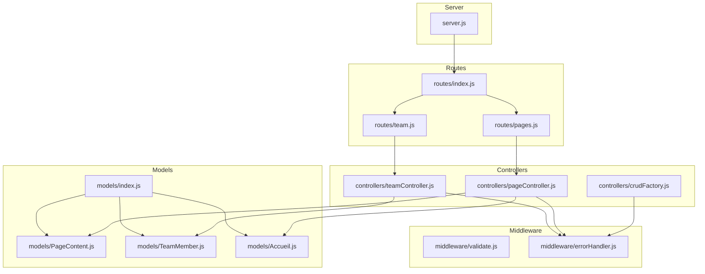
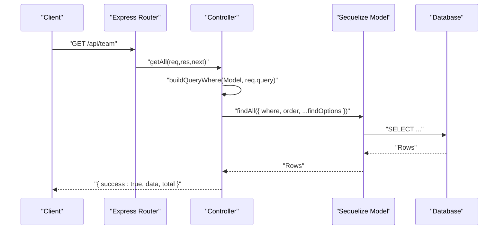
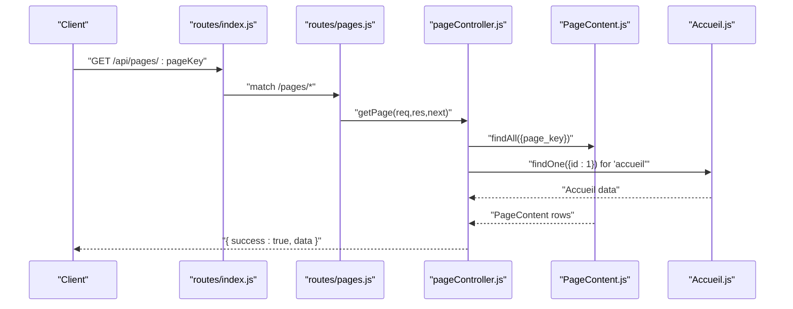
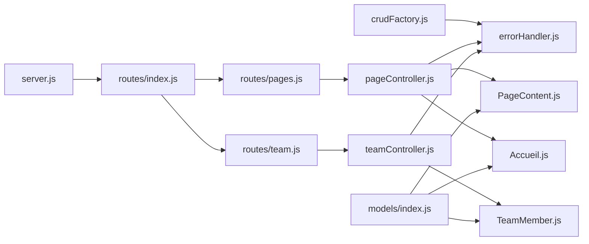

# CRUD Factory Pattern Implementation

<cite>
**Referenced Files in This Document**
- [crudFactory.js](file://rsf-backend/controllers/crudFactory.js)
- [pageController.js](file://rsf-backend/controllers/pageController.js)
- [teamController.js](file://rsf-backend/controllers/teamController.js)
- [validate.js](file://rsf-backend/middleware/validate.js)
- [errorHandler.js](file://rsf-backend/middleware/errorHandler.js)
- [pages.js](file://rsf-backend/routes/pages.js)
- [team.js](file://rsf-backend/routes/team.js)
- [PageContent.js](file://rsf-backend/models/PageContent.js)
- [TeamMember.js](file://rsf-backend/models/TeamMember.js)
- [Accueil.js](file://rsf-backend/models/Accueil.js)
- [index.js](file://rsf-backend/models/index.js)
- [server.js](file://rsf-backend/server.js)
- [index.js](file://rsf-backend/routes/index.js)
</cite>

## Table of Contents
1. [Introduction](#introduction)
2. [Project Structure](#project-structure)
3. [Core Components](#core-components)
4. [Architecture Overview](#architecture-overview)
5. [Detailed Component Analysis](#detailed-component-analysis)
6. [Dependency Analysis](#dependency-analysis)
7. [Performance Considerations](#performance-considerations)
8. [Troubleshooting Guide](#troubleshooting-guide)
9. [Conclusion](#conclusion)

## Introduction
This document explains the CRUD factory pattern implementation that standardizes API development across multiple resources in the backend. The generic controller factory generates consistent CRUD operations for different Sequelize models, minimizing code duplication while ensuring uniform behavior, parameter handling, validation, and error management. It also documents how specialized controllers extend the factory pattern for domain-specific needs, such as page content management and team member ordering.

## Project Structure
The backend follows a layered architecture:
- Controllers define HTTP endpoints and orchestrate model operations
- Routes register endpoints under logical namespaces
- Models describe database schemas and relationships
- Middleware handles validation, logging, rate limiting, and error management
- The server initializes Express, loads middleware, mounts routes, and starts the HTTP server

**Diagram sources**
- [server.js:1-84](file://rsf-backend/server.js#L1-L84)
- [routes/index.js:1-28](file://rsf-backend/routes/index.js#L1-L28)
- [routes/pages.js:1-10](file://rsf-backend/routes/pages.js#L1-L10)
- [routes/team.js:1-13](file://rsf-backend/routes/team.js#L1-L13)
- [controllers/crudFactory.js:1-100](file://rsf-backend/controllers/crudFactory.js#L1-L100)
- [controllers/pageController.js:1-185](file://rsf-backend/controllers/pageController.js#L1-L185)
- [controllers/teamController.js:1-57](file://rsf-backend/controllers/teamController.js#L1-L57)
- [models/PageContent.js:1-49](file://rsf-backend/models/PageContent.js#L1-L49)
- [models/TeamMember.js:1-37](file://rsf-backend/models/TeamMember.js#L1-L37)
- [models/Accueil.js:1-52](file://rsf-backend/models/Accueil.js#L1-L52)
- [models/index.js:1-53](file://rsf-backend/models/index.js#L1-L53)
- [middleware/validate.js:1-22](file://rsf-backend/middleware/validate.js#L1-L22)
- [middleware/errorHandler.js:1-38](file://rsf-backend/middleware/errorHandler.js#L1-L38)

**Section sources**
- [server.js:1-84](file://rsf-backend/server.js#L1-L84)
- [routes/index.js:1-28](file://rsf-backend/routes/index.js#L1-L28)

## Core Components
- Generic CRUD Factory: Generates standard CRUD handlers for any Sequelize model with consistent query building, filtering, ordering, and error handling.
- Specialized Controllers: Extend or complement the factory with domain-specific logic (e.g., page content assembly, team member reordering).
- Validation and Error Middleware: Centralized validation and error handling for consistent responses.
- Routes: Mount controllers under logical namespaces (/api/pages, /api/team, etc.).

Key capabilities:
- Parameter casting and query filtering based on model attributes
- Public vs. authenticated filtering via a configurable public filter
- Reorder endpoint for sortable records
- Consistent JSON response shape with success flags and messages

**Section sources**
- [crudFactory.js:1-100](file://rsf-backend/controllers/crudFactory.js#L1-L100)
- [validate.js:1-22](file://rsf-backend/middleware/validate.js#L1-L22)
- [errorHandler.js:1-38](file://rsf-backend/middleware/errorHandler.js#L1-L38)

## Architecture Overview
The factory pattern reduces boilerplate by generating CRUD handlers from a model definition and optional options. Specialized controllers either wrap the factory or implement bespoke logic for complex domain requirements.

**Diagram sources**
- [routes/team.js:1-13](file://rsf-backend/routes/team.js#L1-L13)
- [controllers/teamController.js:1-57](file://rsf-backend/controllers/teamController.js#L1-L57)
- [controllers/crudFactory.js:39-96](file://rsf-backend/controllers/crudFactory.js#L39-L96)

## Detailed Component Analysis

### Generic CRUD Factory
The factory accepts a Sequelize model, a human-readable label, and options to customize behavior:
- findOptions: Additional options passed to model queries
- orderBy: Default ordering applied to queries
- publicFilter: Default filter applied when no authenticated user is present

Core operations:
- getAll: Builds a where clause from query parameters, merges with publicFilter when applicable, and returns paginated-like results with total count
- getOne: Retrieves a record by primary key with 404 handling
- create: Inserts a new record and returns 201 with created data
- update: Finds by primary key, updates, and returns updated data
- remove: Finds by primary key and deletes it
- reorder: Applies batch updates to sort_order fields

Parameter handling and validation:
- Query parameters are filtered to only include keys that match model attributes and are not reserved pagination/ordering keys
- Values are cast to booleans or numbers when appropriate
- Pagination/ordering keys are ignored during where clause construction

Error management:
- Uses centralized error handler middleware for consistent responses
- Throws custom errors with status codes for missing records

Usage patterns:
- Controllers import the factory and pass model + label + options
- Routes mount the generated handlers

Custom method extensions:
- reorder is included for sortable records
- Factories can be extended to support soft delete, filters, or nested includes

**Section sources**
- [crudFactory.js:1-100](file://rsf-backend/controllers/crudFactory.js#L1-L100)

### Page Controller (Domain-Specific Extension)
Unlike generic CRUD, the page controller manages editable content stored as key-value pairs per page. It:
- Validates requested page keys against a whitelist
- Assembles content from PageContent entries and augments with static data from Accueil when applicable
- Supports updating both dynamic PageContent entries and static Accueil fields
- Serializes/deserializes JSON values for complex content

Validation and error handling:
- Returns 404 for unknown page keys
- Returns 400 for malformed fields payload
- Delegates database and business logic errors to the global error handler

Relevance to factory pattern:
- While not generated by the factory, it demonstrates how specialized controllers can coexist alongside factory-generated ones
- It uses upsert patterns and JSON serialization similar to factory’s create/update but tailored to content management

**Section sources**
- [pageController.js:1-185](file://rsf-backend/controllers/pageController.js#L1-L185)
- [PageContent.js:1-49](file://rsf-backend/models/PageContent.js#L1-L49)
- [Accueil.js:1-52](file://rsf-backend/models/Accueil.js#L1-L52)

### Team Controller (Factory-Inspired Customization)
The team controller implements standard CRUD plus a reorder endpoint. It:
- Orders members by leadership status first, then by sort_order
- Provides create, update, remove, and reorder handlers
- Uses the centralized error factory for consistent 404 responses

Comparison to factory:
- Implements the same operation names and patterns as the factory
- Adds domain-specific ordering logic
- Demonstrates how controllers can reuse factory concepts while adding custom behavior

**Section sources**
- [teamController.js:1-57](file://rsf-backend/controllers/teamController.js#L1-L57)
- [TeamMember.js:1-37](file://rsf-backend/models/TeamMember.js#L1-L37)

### Validation and Error Management
Validation middleware:
- Checks express-validator results and returns structured 422 responses with field-level errors

Error handler:
- Handles Sequelize validation/unique constraint errors with 422
- Handles custom errors with explicit status codes
- Returns 500 for unhandled errors, with environment-aware messages

These middlewares are used by controllers to maintain consistent error responses across the API.

**Section sources**
- [validate.js:1-22](file://rsf-backend/middleware/validate.js#L1-L22)
- [errorHandler.js:1-38](file://rsf-backend/middleware/errorHandler.js#L1-L38)

### Route Registration and Control Flow
Routes mount controllers under logical namespaces:
- Pages: list, get, update endpoints for content management
- Team: standard CRUD plus reorder for sortable members

The main route aggregator applies authentication middleware globally, ensuring protected routes require JWT tokens.

**Diagram sources**
- [routes/index.js:1-28](file://rsf-backend/routes/index.js#L1-L28)
- [routes/pages.js:1-10](file://rsf-backend/routes/pages.js#L1-L10)
- [controllers/pageController.js:66-104](file://rsf-backend/controllers/pageController.js#L66-L104)
- [models/PageContent.js:1-49](file://rsf-backend/models/PageContent.js#L1-L49)
- [models/Accueil.js:1-52](file://rsf-backend/models/Accueil.js#L1-L52)

**Section sources**
- [routes/pages.js:1-10](file://rsf-backend/routes/pages.js#L1-L10)
- [routes/team.js:1-13](file://rsf-backend/routes/team.js#L1-L13)
- [routes/index.js:1-28](file://rsf-backend/routes/index.js#L1-L28)

## Dependency Analysis
The system exhibits clear separation of concerns:
- Controllers depend on models and middleware
- Routes depend on controllers
- Models are registered centrally and export associations
- Middleware is applied globally in the server bootstrap

**Diagram sources**
- [controllers/crudFactory.js:1-100](file://rsf-backend/controllers/crudFactory.js#L1-L100)
- [controllers/pageController.js:1-185](file://rsf-backend/controllers/pageController.js#L1-L185)
- [controllers/teamController.js:1-57](file://rsf-backend/controllers/teamController.js#L1-L57)
- [middleware/errorHandler.js:1-38](file://rsf-backend/middleware/errorHandler.js#L1-L38)
- [models/PageContent.js:1-49](file://rsf-backend/models/PageContent.js#L1-L49)
- [models/TeamMember.js:1-37](file://rsf-backend/models/TeamMember.js#L1-L37)
- [models/Accueil.js:1-52](file://rsf-backend/models/Accueil.js#L1-L52)
- [routes/pages.js:1-10](file://rsf-backend/routes/pages.js#L1-L10)
- [routes/team.js:1-13](file://rsf-backend/routes/team.js#L1-L13)
- [routes/index.js:1-28](file://rsf-backend/routes/index.js#L1-L28)
- [server.js:1-84](file://rsf-backend/server.js#L1-L84)
- [models/index.js:1-53](file://rsf-backend/models/index.js#L1-L53)

**Section sources**
- [models/index.js:1-53](file://rsf-backend/models/index.js#L1-L53)
- [server.js:1-84](file://rsf-backend/server.js#L1-L84)

## Performance Considerations
- Query filtering avoids unnecessary conditions by checking model attributes and ignoring pagination/ordering keys
- Batch updates for reorder operations reduce round-trips
- Centralized error handling prevents redundant checks in controllers
- Consider adding indexes on frequently queried fields and implementing cursor-based pagination for large datasets

## Troubleshooting Guide
Common issues and resolutions:
- 404 Not Found: Occurs when records are missing; ensure correct IDs and that publicFilter does not hide records unintentionally
- 422 Validation Error: Indicates invalid input; review field names and types according to model definitions
- 500 Internal Error: Unhandled exceptions; check server logs and ensure error handler middleware is mounted last

Operational tips:
- Verify route registration under /api and authentication middleware application
- Confirm model attributes match query parameter names
- Use the reorder endpoint for sortable records to maintain consistency

**Section sources**
- [errorHandler.js:1-38](file://rsf-backend/middleware/errorHandler.js#L1-L38)
- [validate.js:1-22](file://rsf-backend/middleware/validate.js#L1-L22)

## Conclusion
The CRUD factory pattern significantly accelerates API development by generating consistent, reusable handlers for standard operations. Specialized controllers extend this pattern to address domain-specific needs while preserving uniformity in parameter handling, validation, and error management. This approach improves maintainability, reduces duplication, and ensures predictable behavior across the platform.