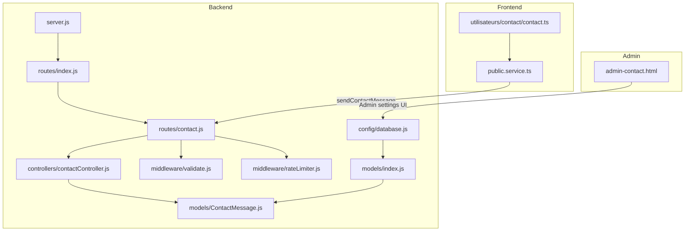
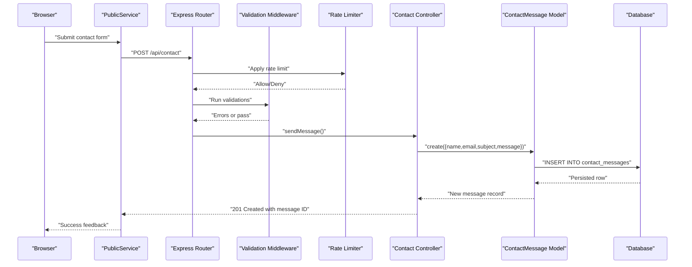
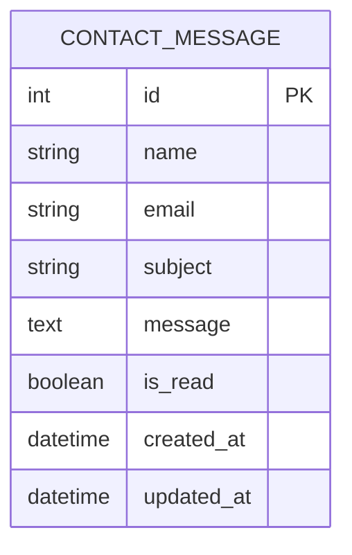
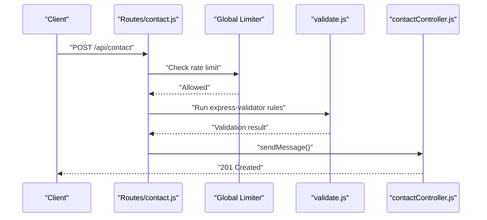
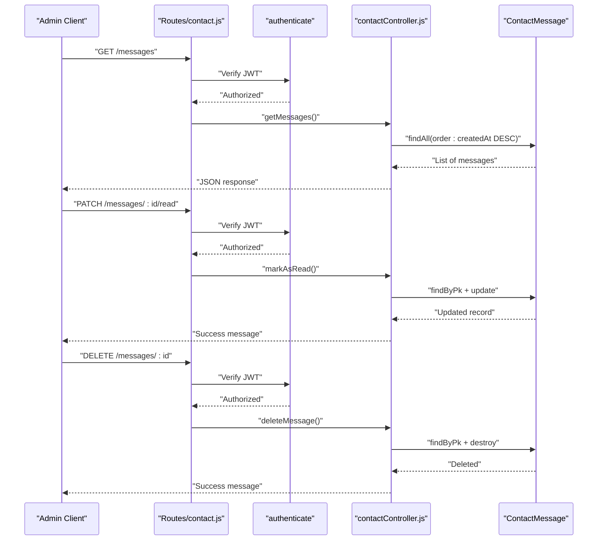
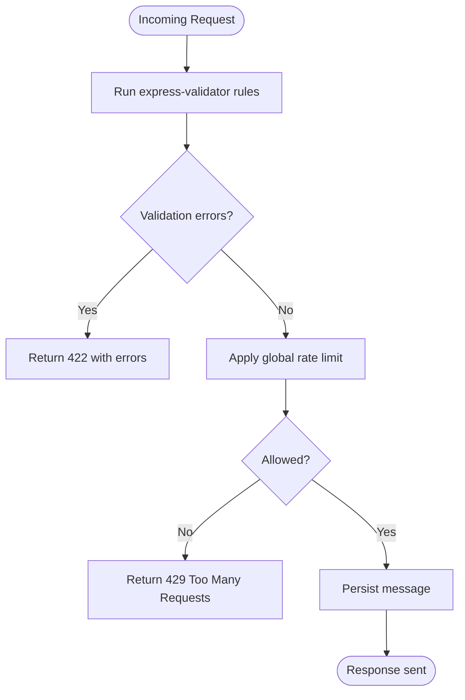
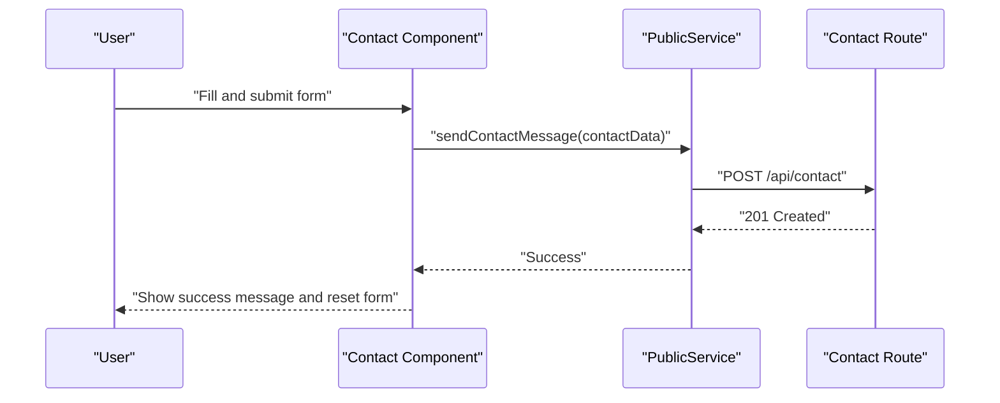
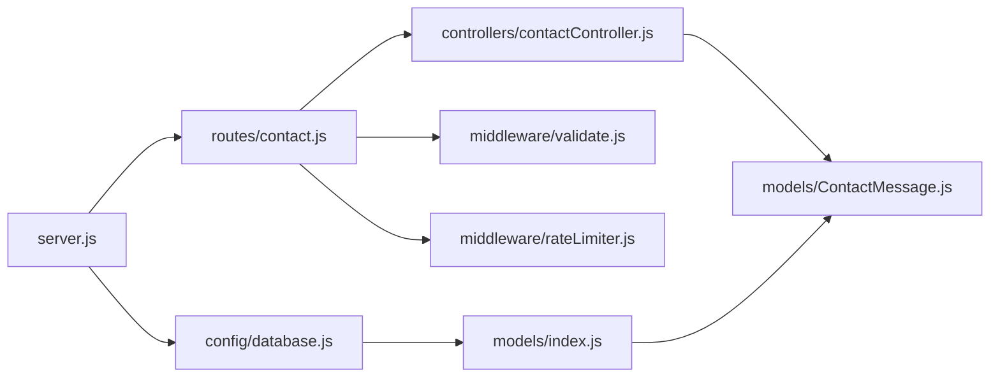

# Contact Management API

<cite>
**Referenced Files in This Document**
- [ContactMessage.js](file://rsf-backend/models/ContactMessage.js)
- [contactController.js](file://rsf-backend/controllers/contactController.js)
- [contact.js](file://rsf-backend/routes/contact.js)
- [validate.js](file://rsf-backend/middleware/validate.js)
- [rateLimiter.js](file://rsf-backend/middleware/rateLimiter.js)
- [index.js](file://rsf-backend/models/index.js)
- [database.js](file://rsf-backend/config/database.js)
- [server.js](file://rsf-backend/server.js)
- [routes/index.js](file://rsf-backend/routes/index.js)
- [public.service.ts](file://rsf-front/src/app/services/public.service.ts)
- [contact.ts](file://rsf-front/src/app/utilisateurs/contact/contact.ts)
- [admin-contact.html](file://rsf-admin/rsf-admin/admin-contact.html)
</cite>

## Table of Contents
1. [Introduction](#introduction)
2. [Project Structure](#project-structure)
3. [Core Components](#core-components)
4. [Architecture Overview](#architecture-overview)
5. [Detailed Component Analysis](#detailed-component-analysis)
6. [Dependency Analysis](#dependency-analysis)
7. [Performance Considerations](#performance-considerations)
8. [Troubleshooting Guide](#troubleshooting-guide)
9. [Conclusion](#conclusion)
10. [Appendices](#appendices)

## Introduction
This document describes the Contact Management API responsible for handling public contact form submissions and administrative message management. It covers the ContactMessage model, validation and rate-limiting middleware, API endpoints, and the integration with the frontend and administration panels. It also outlines the current capabilities and highlights areas for enhancement such as automated notifications and message categorization.

## Project Structure
The contact management system spans backend API routes, controllers, models, and middleware, and integrates with the frontend public contact page and the admin panel.

**Diagram sources**
- [server.js:1-84](file://rsf-backend/server.js#L1-L84)
- [routes/index.js:1-28](file://rsf-backend/routes/index.js#L1-L28)
- [contact.js:1-22](file://rsf-backend/routes/contact.js#L1-L22)
- [contactController.js:1-47](file://rsf-backend/controllers/contactController.js#L1-L47)
- [ContactMessage.js:1-18](file://rsf-backend/models/ContactMessage.js#L1-L18)
- [validate.js:1-22](file://rsf-backend/middleware/validate.js#L1-L22)
- [rateLimiter.js:1-21](file://rsf-backend/middleware/rateLimiter.js#L1-L21)
- [database.js:1-69](file://rsf-backend/config/database.js#L1-L69)
- [index.js:1-53](file://rsf-backend/models/index.js#L1-L53)
- [public.service.ts](file://rsf-front/src/app/services/public.service.ts)
- [contact.ts:1-110](file://rsf-front/src/app/utilisateurs/contact/contact.ts#L1-L110)
- [admin-contact.html](file://rsf-admin/rsf-admin/admin-contact.html)

**Section sources**
- [server.js:1-84](file://rsf-backend/server.js#L1-L84)
- [routes/index.js:1-28](file://rsf-backend/routes/index.js#L1-L28)
- [contact.js:1-22](file://rsf-backend/routes/contact.js#L1-L22)
- [contactController.js:1-47](file://rsf-backend/controllers/contactController.js#L1-L47)
- [ContactMessage.js:1-18](file://rsf-backend/models/ContactMessage.js#L1-L18)
- [validate.js:1-22](file://rsf-backend/middleware/validate.js#L1-L22)
- [rateLimiter.js:1-21](file://rsf-backend/middleware/rateLimiter.js#L1-L21)
- [database.js:1-69](file://rsf-backend/config/database.js#L1-L69)
- [index.js:1-53](file://rsf-backend/models/index.js#L1-L53)

## Core Components
- ContactMessage model: Defines the persisted structure for contact submissions, including sender identity, subject, content, and read status.
- Contact controller: Implements endpoints for submitting messages, retrieving messages, marking as read, and deleting messages.
- Contact routes: Expose public and admin endpoints with validation and rate limiting.
- Validation middleware: Centralized validation error handling for request bodies.
- Rate limiter middleware: Global rate limiting for public endpoints.
- Database configuration and model registry: Sequelize setup and model registration.

**Section sources**
- [ContactMessage.js:1-18](file://rsf-backend/models/ContactMessage.js#L1-L18)
- [contactController.js:1-47](file://rsf-backend/controllers/contactController.js#L1-L47)
- [contact.js:1-22](file://rsf-backend/routes/contact.js#L1-L22)
- [validate.js:1-22](file://rsf-backend/middleware/validate.js#L1-L22)
- [rateLimiter.js:1-21](file://rsf-backend/middleware/rateLimiter.js#L1-L21)
- [database.js:1-69](file://rsf-backend/config/database.js#L1-L69)
- [index.js:1-53](file://rsf-backend/models/index.js#L1-L53)

## Architecture Overview
The API follows a layered architecture:
- HTTP entrypoint initializes middleware and routes.
- Public contact endpoint validates input, applies rate limits, and persists messages.
- Admin endpoints require authentication to manage messages.

**Diagram sources**
- [contact.js:1-22](file://rsf-backend/routes/contact.js#L1-L22)
- [validate.js:1-22](file://rsf-backend/middleware/validate.js#L1-L22)
- [rateLimiter.js:1-21](file://rsf-backend/middleware/rateLimiter.js#L1-L21)
- [contactController.js:1-47](file://rsf-backend/controllers/contactController.js#L1-L47)
- [ContactMessage.js:1-18](file://rsf-backend/models/ContactMessage.js#L1-L18)

## Detailed Component Analysis

### ContactMessage Model
The ContactMessage model defines the schema for storing contact submissions. It includes:
- Identity: auto-incremented numeric identifier.
- Sender: name and email with validation constraints.
- Subject: optional short text field.
- Content: required long text field.
- Read status: boolean flag indicating whether the message was read by administrators.

**Diagram sources**
- [ContactMessage.js:1-18](file://rsf-backend/models/ContactMessage.js#L1-L18)

**Section sources**
- [ContactMessage.js:1-18](file://rsf-backend/models/ContactMessage.js#L1-L18)
- [index.js:1-53](file://rsf-backend/models/index.js#L1-L53)

### API Endpoints

#### Public Endpoint
- Method: POST
- Path: /api/contact
- Purpose: Accept contact form submissions from the public.
- Authentication: Not required.
- Rate limiting: Applied globally.
- Validation:
  - Name: trimmed, length 2–150 characters.
  - Email: valid email format.
  - Message: trimmed, minimum length 10 characters.
- Response: 201 with success flag and message ID.

**Diagram sources**
- [contact.js:1-22](file://rsf-backend/routes/contact.js#L1-L22)
- [validate.js:1-22](file://rsf-backend/middleware/validate.js#L1-L22)
- [contactController.js:1-47](file://rsf-backend/controllers/contactController.js#L1-L47)

**Section sources**
- [contact.js:1-22](file://rsf-backend/routes/contact.js#L1-L22)
- [validate.js:1-22](file://rsf-backend/middleware/validate.js#L1-L22)
- [contactController.js:1-47](file://rsf-backend/controllers/contactController.js#L1-L47)

#### Admin Endpoints
- Get messages:
  - Method: GET
  - Path: /api/contact/messages
  - Authentication: Required.
  - Behavior: Returns all messages ordered by creation date descending.
- Mark as read:
  - Method: PATCH
  - Path: /api/contact/messages/:id/read
  - Authentication: Required.
  - Behavior: Sets is_read to true for the specified message.
- Delete message:
  - Method: DELETE
  - Path: /api/contact/messages/:id
  - Authentication: Required.
  - Behavior: Removes the specified message.

**Diagram sources**
- [contact.js:1-22](file://rsf-backend/routes/contact.js#L1-L22)
- [contactController.js:1-47](file://rsf-backend/controllers/contactController.js#L1-L47)
- [ContactMessage.js:1-18](file://rsf-backend/models/ContactMessage.js#L1-L18)

**Section sources**
- [contact.js:1-22](file://rsf-backend/routes/contact.js#L1-L22)
- [contactController.js:1-47](file://rsf-backend/controllers/contactController.js#L1-L47)

### Data Validation and Spam Prevention
- Validation:
  - Name length and trimming.
  - Email format validation.
  - Message minimum length and trimming.
  - Centralized error response with field-specific messages.
- Rate limiting:
  - Global limiter restricts requests per IP over a 15-minute window.
  - Additional stricter limiter exists for authentication attempts.

**Diagram sources**
- [validate.js:1-22](file://rsf-backend/middleware/validate.js#L1-L22)
- [rateLimiter.js:1-21](file://rsf-backend/middleware/rateLimiter.js#L1-L21)
- [contact.js:1-22](file://rsf-backend/routes/contact.js#L1-L22)

**Section sources**
- [validate.js:1-22](file://rsf-backend/middleware/validate.js#L1-L22)
- [rateLimiter.js:1-21](file://rsf-backend/middleware/rateLimiter.js#L1-L21)
- [contact.js:1-22](file://rsf-backend/routes/contact.js#L1-L22)

### Frontend Integration
- Public contact page collects name, email, subject, and message.
- Submissions are sent via a public service to the API endpoint.
- On success, the form resets and shows a success message.

**Diagram sources**
- [contact.ts:1-110](file://rsf-front/src/app/utilisateurs/contact/contact.ts#L1-L110)
- [public.service.ts](file://rsf-front/src/app/services/public.service.ts)
- [contact.js:1-22](file://rsf-backend/routes/contact.js#L1-L22)

**Section sources**
- [contact.ts:1-110](file://rsf-front/src/app/utilisateurs/contact/contact.ts#L1-L110)
- [public.service.ts](file://rsf-front/src/app/services/public.service.ts)
- [contact.js:1-22](file://rsf-backend/routes/contact.js#L1-L22)

### Administrative Settings and Panels
- Admin settings UI includes fields for contact hours, email, response delay, and website.
- These settings can be managed in the admin panel and influence the public contact page presentation.

**Section sources**
- [admin-contact.html](file://rsf-admin/rsf-admin/admin-contact.html)

## Dependency Analysis
The contact system relies on:
- Express routing and middleware stack.
- Sequelize ORM for persistence.
- Validation and rate limiting middlewares.
- Frontend services for API communication.

**Diagram sources**
- [contact.js:1-22](file://rsf-backend/routes/contact.js#L1-L22)
- [contactController.js:1-47](file://rsf-backend/controllers/contactController.js#L1-L47)
- [ContactMessage.js:1-18](file://rsf-backend/models/ContactMessage.js#L1-L18)
- [validate.js:1-22](file://rsf-backend/middleware/validate.js#L1-L22)
- [rateLimiter.js:1-21](file://rsf-backend/middleware/rateLimiter.js#L1-L21)
- [server.js:1-84](file://rsf-backend/server.js#L1-L84)
- [database.js:1-69](file://rsf-backend/config/database.js#L1-L69)
- [index.js:1-53](file://rsf-backend/models/index.js#L1-L53)

**Section sources**
- [routes/index.js:1-28](file://rsf-backend/routes/index.js#L1-L28)
- [contact.js:1-22](file://rsf-backend/routes/contact.js#L1-L22)
- [contactController.js:1-47](file://rsf-backend/controllers/contactController.js#L1-L47)
- [ContactMessage.js:1-18](file://rsf-backend/models/ContactMessage.js#L1-L18)
- [validate.js:1-22](file://rsf-backend/middleware/validate.js#L1-L22)
- [rateLimiter.js:1-21](file://rsf-backend/middleware/rateLimiter.js#L1-L21)
- [server.js:1-84](file://rsf-backend/server.js#L1-L84)
- [database.js:1-69](file://rsf-backend/config/database.js#L1-L69)
- [index.js:1-53](file://rsf-backend/models/index.js#L1-L53)

## Performance Considerations
- Indexing: The model defines indexes on is_read and created_at, supporting efficient filtering and sorting for admin views.
- Rate limiting: Prevents abuse of the public endpoint and protects downstream processing.
- Database pooling: Configurable pool sizes for MySQL/PostgreSQL dialects help manage concurrent connections.

Recommendations:
- Add indexes for frequently filtered fields if message categorization is introduced.
- Consider asynchronous processing for notifications to avoid blocking request handling.
- Monitor database query performance for large message volumes.

**Section sources**
- [ContactMessage.js:1-18](file://rsf-backend/models/ContactMessage.js#L1-L18)
- [rateLimiter.js:1-21](file://rsf-backend/middleware/rateLimiter.js#L1-L21)
- [database.js:1-69](file://rsf-backend/config/database.js#L1-L69)

## Troubleshooting Guide
Common issues and resolutions:
- Validation errors (422): Ensure name, email, and message meet specified constraints. Review returned field-level error messages.
- Rate limit exceeded (429): Reduce submission frequency or wait for the window to reset.
- Not found errors (404): Occur when attempting to mark as read or delete a non-existent message ID.
- Database connectivity: Verify environment variables and database configuration.

Operational checks:
- Health endpoint: GET /health confirms service availability and database dialect.
- Logging: Enable development logging to inspect SQL statements.

**Section sources**
- [validate.js:1-22](file://rsf-backend/middleware/validate.js#L1-L22)
- [rateLimiter.js:1-21](file://rsf-backend/middleware/rateLimiter.js#L1-L21)
- [contactController.js:1-47](file://rsf-backend/controllers/contactController.js#L1-L47)
- [server.js:1-84](file://rsf-backend/server.js#L1-L84)

## Conclusion
The Contact Management API provides a focused solution for accepting public contact submissions and enabling administrative oversight. It leverages validation and rate limiting for robustness and includes a clean separation between public and admin endpoints. Future enhancements could include message categorization, priority handling, and automated notification workflows.

## Appendices

### API Definitions

- POST /api/contact
  - Description: Submit a contact message.
  - Authentication: Not required.
  - Rate limit: Yes.
  - Body fields:
    - name: string (required, 2–150 chars)
    - email: string (required, valid email)
    - subject: string (optional)
    - message: string (required, min 10 chars)
  - Responses:
    - 201 Created: success, message, data.id
    - 422 Unprocessable Entity: validation errors
    - 429 Too Many Requests: rate limit exceeded

- GET /api/contact/messages
  - Description: Retrieve all messages ordered by newest first.
  - Authentication: Required.
  - Responses:
    - 200 OK: success, data[], total

- PATCH /api/contact/messages/:id/read
  - Description: Mark a message as read.
  - Authentication: Required.
  - Responses:
    - 200 OK: success, message
    - 404 Not Found: message not found

- DELETE /api/contact/messages/:id
  - Description: Delete a message.
  - Authentication: Required.
  - Responses:
    - 200 OK: success, message
    - 404 Not Found: message not found

**Section sources**
- [contact.js:1-22](file://rsf-backend/routes/contact.js#L1-L22)
- [contactController.js:1-47](file://rsf-backend/controllers/contactController.js#L1-L47)

### Data Model Reference

- ContactMessage
  - Fields: id, name, email, subject, message, is_read, created_at, updated_at
  - Indexes: is_read, created_at
  - Notes: Uses Sequelize timestamps; email validated as email format.

**Section sources**
- [ContactMessage.js:1-18](file://rsf-backend/models/ContactMessage.js#L1-L18)

### Example Workflows

- Submitting a message:
  - Client sends POST /api/contact with name, email, subject, message.
  - Server validates inputs and rate limits.
  - On success, server responds with 201 and message ID.

- Admin viewing and managing messages:
  - Admin authenticates and calls GET /api/contact/messages.
  - To acknowledge, PATCH /api/contact/messages/:id/read.
  - To remove, DELETE /api/contact/messages/:id.

**Section sources**
- [contact.js:1-22](file://rsf-backend/routes/contact.js#L1-L22)
- [contactController.js:1-47](file://rsf-backend/controllers/contactController.js#L1-L47)

### Enhancements and Extensions
- Message categorization and priority:
  - Add category and priority fields to ContactMessage.
  - Extend routes and controller to accept and filter by category/priority.
- Automated notifications:
  - Integrate an email service to send acknowledgments or alerts upon new messages.
  - Queue asynchronous tasks for sending emails after successful submissions.
- Enhanced spam prevention:
  - Introduce CAPTCHA or hCaptcha verification on the public endpoint.
  - Add configurable spam keywords filtering and IP blacklisting.

[No sources needed since this section provides general guidance]