# Content Management API

<cite>
**Referenced Files in This Document**
- [server.js](file://rsf-backend/server.js)
- [routes/index.js](file://rsf-backend/routes/index.js)
- [routes/pages.js](file://rsf-backend/routes/pages.js)
- [controllers/pageController.js](file://rsf-backend/controllers/pageController.js)
- [middleware/validate.js](file://rsf-backend/middleware/validate.js)
- [models/index.js](file://rsf-backend/models/index.js)
- [models/PageContent.js](file://rsf-backend/models/PageContent.js)
- [models/Accueil.js](file://rsf-backend/models/Accueil.js)
- [models/NavItem.js](file://rsf-backend/models/NavItem.js)
- [models/Setting.js](file://rsf-backend/models/Setting.js)
- [config/database.js](file://rsf-backend/config/database.js)
- [admin-editor-config.ts](file://rsf-front/src/app/admin/admin-editor-config.ts)
- [admin-api.service.ts](file://rsf-front/src/app/admin/admin-api.service.ts)
</cite>

## Table of Contents
1. [Introduction](#introduction)
2. [Project Structure](#project-structure)
3. [Core Components](#core-components)
4. [Architecture Overview](#architecture-overview)
5. [Detailed Component Analysis](#detailed-component-analysis)
6. [Dependency Analysis](#dependency-analysis)
7. [Performance Considerations](#performance-considerations)
8. [Troubleshooting Guide](#troubleshooting-guide)
9. [Conclusion](#conclusion)
10. [Appendices](#appendices)

## Introduction
This document describes the Content Management API used to dynamically edit and manage website content across multiple sections. It focuses on:
- The PageContent model and its role as the generic editable content store
- Rich text and structured content handling via field types and serialization
- Specialized models such as Accueil and NavItem and their integration with the generic content system
- API endpoints for retrieving and updating content per page
- Field type management, validation, and content retrieval patterns
- Editing workflows and integration patterns for the Angular admin client

## Project Structure
The API is implemented in a Node.js/Express backend with Sequelize ORM, organized by concerns:
- Routes: Define endpoint contracts under /api
- Controllers: Implement business logic for page content and related resources
- Models: Define data structures and relationships
- Middleware: Provide cross-cutting concerns like validation and error handling
- Frontend: Angular admin client integrates with the API to render editors and persist changes

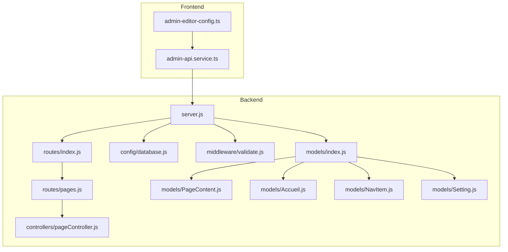

**Diagram sources**
- [server.js:1-84](file://rsf-backend/server.js#L1-L84)
- [routes/index.js:1-28](file://rsf-backend/routes/index.js#L1-L28)
- [routes/pages.js:1-10](file://rsf-backend/routes/pages.js#L1-L10)
- [controllers/pageController.js:1-185](file://rsf-backend/controllers/pageController.js#L1-L185)
- [config/database.js:1-69](file://rsf-backend/config/database.js#L1-L69)
- [middleware/validate.js:1-22](file://rsf-backend/middleware/validate.js#L1-L22)
- [models/index.js:1-53](file://rsf-backend/models/index.js#L1-L53)
- [models/PageContent.js:1-49](file://rsf-backend/models/PageContent.js#L1-L49)
- [models/Accueil.js:1-52](file://rsf-backend/models/Accueil.js#L1-L52)
- [models/NavItem.js:1-16](file://rsf-backend/models/NavItem.js#L1-L16)
- [models/Setting.js:1-16](file://rsf-backend/models/Setting.js#L1-L16)
- [admin-editor-config.ts:1-373](file://rsf-front/src/app/admin/admin-editor-config.ts#L1-L373)
- [admin-api.service.ts:46-77](file://rsf-front/src/app/admin/admin-api.service.ts#L46-L77)

**Section sources**
- [server.js:1-84](file://rsf-backend/server.js#L1-L84)
- [routes/index.js:1-28](file://rsf-backend/routes/index.js#L1-L28)
- [routes/pages.js:1-10](file://rsf-backend/routes/pages.js#L1-L10)
- [controllers/pageController.js:1-185](file://rsf-backend/controllers/pageController.js#L1-L185)
- [models/index.js:1-53](file://rsf-backend/models/index.js#L1-L53)

## Core Components
- PageContent model: Generic key/value store for editable content per page, with field type metadata and ordering.
- Accueil model: Specialized content for the homepage hero and stats, integrated with PageContent for other fields.
- NavItem model: Navigation items used across the site.
- Setting model: Global site settings stored as key/value pairs with typed values.
- pageController: Implements list, get, and update operations for pages, including special handling for Accueil.
- Routes: Expose /api/pages endpoints for listing, retrieving, and updating page content.

Key characteristics:
- Field type ENUM supports text, textarea, html, url, color, boolean, number.
- Values are stored as TEXT and serialized/deserialized when needed.
- Accueil fields are merged into the page response alongside PageContent entries.

**Section sources**
- [models/PageContent.js:1-49](file://rsf-backend/models/PageContent.js#L1-L49)
- [models/Accueil.js:1-52](file://rsf-backend/models/Accueil.js#L1-L52)
- [models/NavItem.js:1-16](file://rsf-backend/models/NavItem.js#L1-L16)
- [models/Setting.js:1-16](file://rsf-backend/models/Setting.js#L1-L16)
- [controllers/pageController.js:1-185](file://rsf-backend/controllers/pageController.js#L1-L185)
- [routes/pages.js:1-10](file://rsf-backend/routes/pages.js#L1-L10)

## Architecture Overview
The Content Management API follows a layered architecture:
- Transport: Express server with CORS and rate limiting
- Routing: Mounted under /api with authentication applied for protected routes
- Controllers: Implement page content operations and integrate specialized models
- Models: Persist content to database with indexes for fast lookups
- Middleware: Validation and error handling

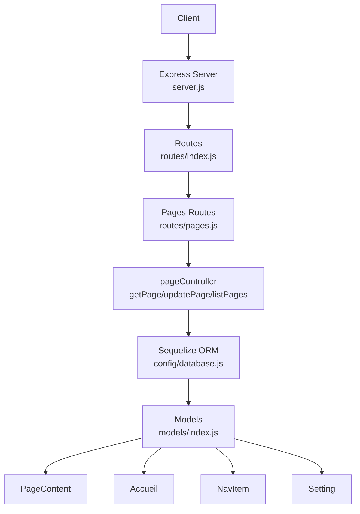

**Diagram sources**
- [server.js:1-84](file://rsf-backend/server.js#L1-L84)
- [routes/index.js:1-28](file://rsf-backend/routes/index.js#L1-L28)
- [routes/pages.js:1-10](file://rsf-backend/routes/pages.js#L1-L10)
- [controllers/pageController.js:1-185](file://rsf-backend/controllers/pageController.js#L1-L185)
- [config/database.js:1-69](file://rsf-backend/config/database.js#L1-L69)
- [models/index.js:1-53](file://rsf-backend/models/index.js#L1-L53)
- [models/PageContent.js:1-49](file://rsf-backend/models/PageContent.js#L1-L49)
- [models/Accueil.js:1-52](file://rsf-backend/models/Accueil.js#L1-L52)
- [models/NavItem.js:1-16](file://rsf-backend/models/NavItem.js#L1-L16)
- [models/Setting.js:1-16](file://rsf-backend/models/Setting.js#L1-L16)

## Detailed Component Analysis

### PageContent Model
Purpose:
- Store editable content keyed by page_key and field_key
- Track field_type for UI rendering hints
- Support ordering via sort_order
- Provide unique constraint on (page_key, field_key)

Data model highlights:
- Composite unique index on (page_key, field_key)
- Index on page_key for efficient filtering
- field_type ENUM supports multiple input types
- value stored as TEXT with long capacity

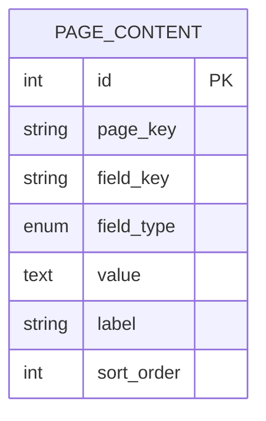

**Diagram sources**
- [models/PageContent.js:6-45](file://rsf-backend/models/PageContent.js#L6-L45)

**Section sources**
- [models/PageContent.js:1-49](file://rsf-backend/models/PageContent.js#L1-L49)

### Accueil Model
Purpose:
- Manage homepage-specific content (hero and stats)
- Provide JSON parsing for structured hero_features
- Upsert via single record ID

Integration:
- pageController merges Accueil fields into the page response for the accueil page
- Separate handling ensures both generic PageContent and specialized fields are returned consistently

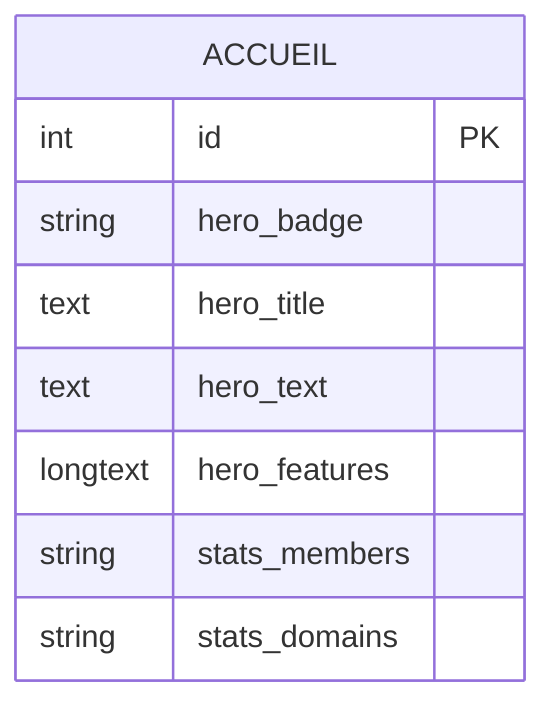

**Diagram sources**
- [models/Accueil.js:5-48](file://rsf-backend/models/Accueil.js#L5-L48)

**Section sources**
- [models/Accueil.js:1-52](file://rsf-backend/models/Accueil.js#L1-L52)
- [controllers/pageController.js:80-98](file://rsf-backend/controllers/pageController.js#L80-L98)

### NavItem Model
Purpose:
- Define navigation items with label, href, icon, visibility, CTA flag, and sort order
- Supports menu rendering and highlighting of call-to-action items

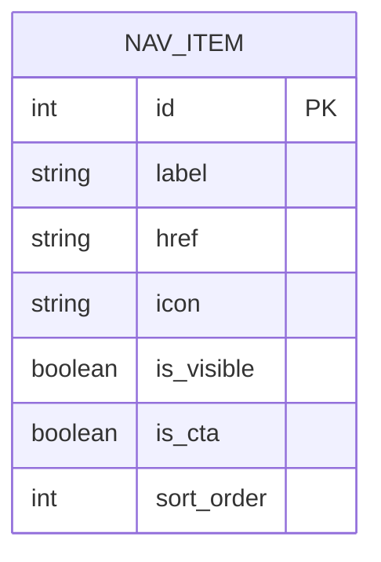

**Diagram sources**
- [models/NavItem.js:5-13](file://rsf-backend/models/NavItem.js#L5-L13)

**Section sources**
- [models/NavItem.js:1-16](file://rsf-backend/models/NavItem.js#L1-L16)

### Setting Model
Purpose:
- Global site settings as key/value pairs with typed values
- Grouping for logical organization (e.g., appearance, contact)
- Used by the admin editor configuration to drive UI controls

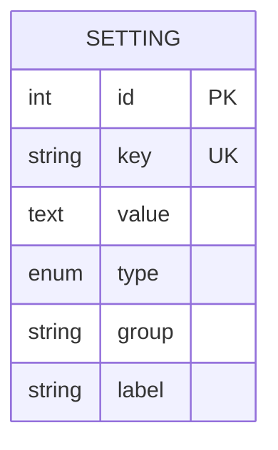

**Diagram sources**
- [models/Setting.js:6-13](file://rsf-backend/models/Setting.js#L6-L13)

**Section sources**
- [models/Setting.js:1-16](file://rsf-backend/models/Setting.js#L1-L16)

### pageController: Retrieval and Update Logic
Responsibilities:
- getPage: Retrieve all PageContent entries for a given page_key, ordered by sort_order, then merge Accueil fields for the accueil page
- updatePage: Validate input, handle Accueil-specific nested hero/stats fields, upsert PageContent records, and support JSON serialization for complex values
- listPages: Return the list of supported page keys

Processing logic:
- Value parsing: Attempt to parse stored string values as JSON when applicable
- Serialization: Serialize complex values (objects/arrays) to strings before storing
- Special handling for accueil: Merge hero and stats fields from Accueil into the page payload

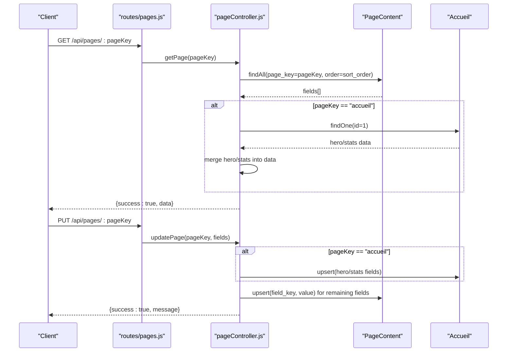

**Diagram sources**
- [routes/pages.js:5-7](file://rsf-backend/routes/pages.js#L5-L7)
- [controllers/pageController.js:66-104](file://rsf-backend/controllers/pageController.js#L66-L104)
- [controllers/pageController.js:106-178](file://rsf-backend/controllers/pageController.js#L106-L178)
- [models/PageContent.js:6-45](file://rsf-backend/models/PageContent.js#L6-L45)
- [models/Accueil.js:5-48](file://rsf-backend/models/Accueil.js#L5-L48)

**Section sources**
- [controllers/pageController.js:1-185](file://rsf-backend/controllers/pageController.js#L1-L185)

### API Endpoints
Base path: /api

- GET /
  - Description: List supported page keys
  - Response: { success: boolean, data: string[] }

- GET /pages
  - Description: List supported page keys
  - Response: { success: boolean, data: string[] }

- GET /pages/:pageKey
  - Description: Retrieve content for a specific page
  - Path params: pageKey ∈ VALID_PAGES
  - Response: { success: boolean, data: object }
  - Notes: For accueil, merges Accueil hero/stats into the response

- PUT /pages/:pageKey
  - Description: Update content for a specific page
  - Path params: pageKey ∈ VALID_PAGES
  - Request body: { fields: object }
  - Response: { success: boolean, message: string }
  - Notes: For accueil, supports nested hero and stats updates; other fields are upserted into PageContent

Validation and error handling:
- Validation middleware checks for express-validator errors and returns 422 with details
- Controller validates pageKey against supported list and fields object presence

**Section sources**
- [routes/pages.js:5-7](file://rsf-backend/routes/pages.js#L5-L7)
- [controllers/pageController.js:47-64](file://rsf-backend/controllers/pageController.js#L47-L64)
- [controllers/pageController.js:106-178](file://rsf-backend/controllers/pageController.js#L106-L178)
- [middleware/validate.js:1-22](file://rsf-backend/middleware/validate.js#L1-L22)

### Field Type Management and Rich Text Handling
Field types:
- ENUM: text, textarea, html, url, color, boolean, number
- Stored as TEXT with optional JSON serialization for arrays/objects
- Parsing logic attempts JSON.parse for stored strings that appear to be JSON

Rich text and structured content:
- HTML fields can be stored as rich text
- JSON fields (e.g., hero_features) are parsed and serialized automatically
- Boolean and numeric values are preserved as primitives

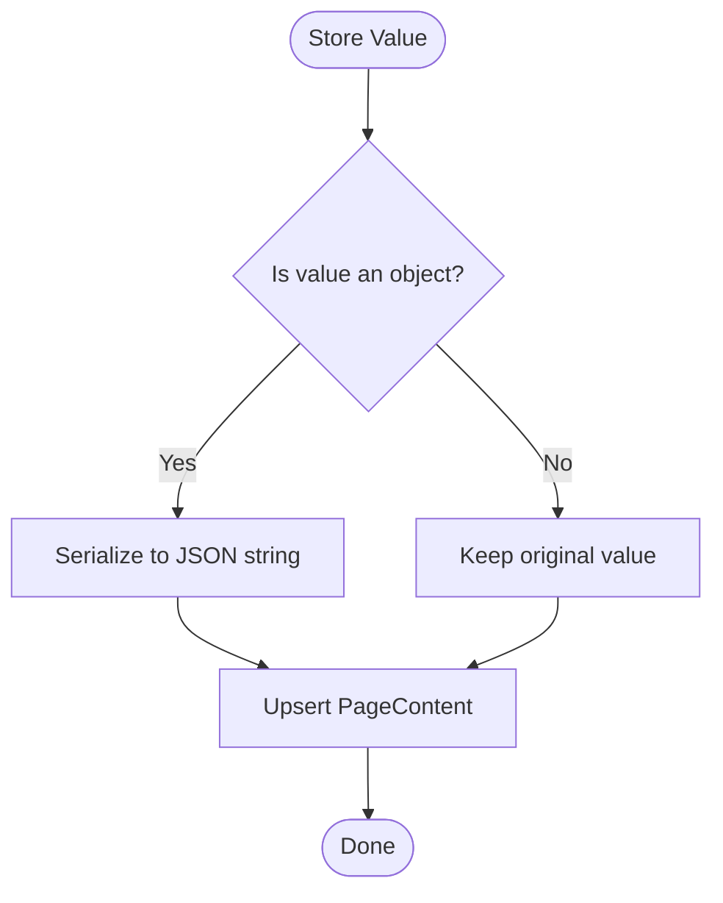

**Diagram sources**
- [controllers/pageController.js:24-28](file://rsf-backend/controllers/pageController.js#L24-L28)
- [controllers/pageController.js:164-170](file://rsf-backend/controllers/pageController.js#L164-L170)

**Section sources**
- [models/PageContent.js:22-29](file://rsf-backend/models/PageContent.js#L22-L29)
- [controllers/pageController.js:3-22](file://rsf-backend/controllers/pageController.js#L3-L22)
- [controllers/pageController.js:151-159](file://rsf-backend/controllers/pageController.js#L151-L159)

### Version Control Mechanisms
Observations:
- No explicit versioning or audit trail is implemented in the current codebase
- Timestamps are enabled via Sequelize define.timestamps for models
- Consider adding a dedicated version table or a content_version field if versioning becomes required

Recommendations:
- Add a content_versions table with foreign key to PageContent
- Track created_by, created_at, updated_by, updated_at
- Provide diff views and rollback endpoints

[No sources needed since this section provides general guidance]

### Content Retrieval Patterns
Patterns:
- Single-page retrieval aggregates PageContent entries and merges Accueil hero/stats for the homepage
- Ordering is enforced via sort_order ascending
- Nested hero/stats are supported for accueil

Example retrieval flow:
- GET /api/pages/accueil
- Returns combined data: { hero: {...}, stats: {...}, other fields... }

**Section sources**
- [controllers/pageController.js:66-104](file://rsf-backend/controllers/pageController.js#L66-L104)

### Content Update Requests
Examples:
- Update a single field:
  - PUT /api/pages/qui-sommes-nous
  - Body: { fields: { intro_title: "New Title", intro_text: "Updated text." } }

- Update homepage hero and stats:
  - PUT /api/pages/accueil
  - Body: { fields: { hero: { badge: "Updated", title: "Welcome", text: "..." }, stats: { members: "100+", domains: "5" } } }

- Mixed update with nested hero and standalone fields:
  - PUT /api/pages/organisation
  - Body: { fields: { hero: { title: "..." }, intro_description: "..." } }

Serialization behavior:
- Objects and arrays are serialized to strings before storage
- On retrieval, strings that look like JSON are parsed back to objects

**Section sources**
- [controllers/pageController.js:106-178](file://rsf-backend/controllers/pageController.js#L106-L178)
- [controllers/pageController.js:3-22](file://rsf-backend/controllers/pageController.js#L3-L22)

### Relationship Between PageContent and Specialized Models
- Accueil: For the accueil page, hero and stats fields are stored in Accueil and merged into the page response
- Other pages: All editable content is stored in PageContent
- NavItem: Separate navigation model not part of PageContent
- Setting: Global settings stored separately in Setting

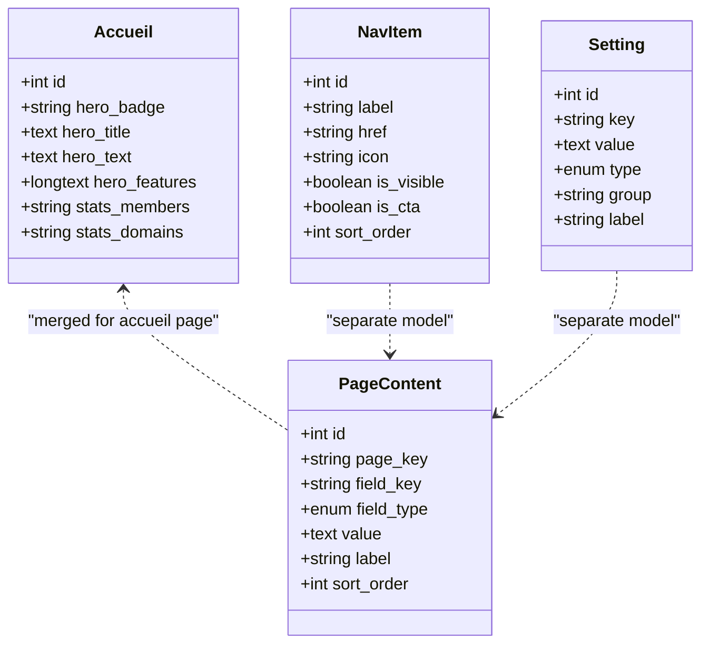

**Diagram sources**
- [models/PageContent.js:6-45](file://rsf-backend/models/PageContent.js#L6-L45)
- [models/Accueil.js:5-48](file://rsf-backend/models/Accueil.js#L5-L48)
- [models/NavItem.js:5-13](file://rsf-backend/models/NavItem.js#L5-L13)
- [models/Setting.js:6-13](file://rsf-backend/models/Setting.js#L6-L13)

**Section sources**
- [controllers/pageController.js:80-98](file://rsf-backend/controllers/pageController.js#L80-L98)
- [models/index.js:18-20](file://rsf-backend/models/index.js#L18-L20)

### API Integration Patterns (Angular Admin)
- Editor configuration defines field types and UI behavior for collections and pages
- Admin API service wraps HTTP calls to /api routes
- Example usage:
  - Fetch settings: GET /api/settings
  - Update settings: PUT /api/settings
  - Reorder items: PUT /api/{resource}/reorder
  - CRUD for resources: POST/GET/PUT/DELETE /api/{resource}/{id}

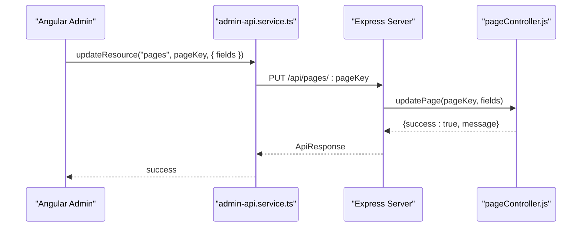

**Diagram sources**
- [admin-api.service.ts:52-56](file://rsf-front/src/app/admin/admin-api.service.ts#L52-L56)
- [routes/pages.js:7](file://rsf-backend/routes/pages.js#L7)
- [controllers/pageController.js:106-178](file://rsf-backend/controllers/pageController.js#L106-L178)

**Section sources**
- [admin-editor-config.ts:1-373](file://rsf-front/src/app/admin/admin-editor-config.ts#L1-L373)
- [admin-api.service.ts:46-77](file://rsf-front/src/app/admin/admin-api.service.ts#L46-L77)

## Dependency Analysis
- Controllers depend on models and middleware
- Routes mount under /api and apply authentication for protected endpoints
- Models share a central registry and define indexes for performance
- Frontend depends on backend endpoints and editor configuration

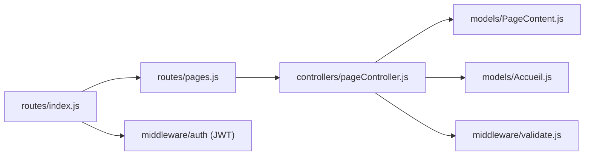

**Diagram sources**
- [routes/index.js:14](file://rsf-backend/routes/index.js#L14)
- [routes/pages.js:1-10](file://rsf-backend/routes/pages.js#L1-L10)
- [controllers/pageController.js:1-185](file://rsf-backend/controllers/pageController.js#L1-L185)
- [models/PageContent.js:1-49](file://rsf-backend/models/PageContent.js#L1-L49)
- [models/Accueil.js:1-52](file://rsf-backend/models/Accueil.js#L1-L52)

**Section sources**
- [routes/index.js:1-28](file://rsf-backend/routes/index.js#L1-L28)
- [models/index.js:1-53](file://rsf-backend/models/index.js#L1-L53)

## Performance Considerations
- Indexes:
  - Unique composite index on (page_key, field_key) for fast lookups
  - Single-column index on page_key for filtering
- Upsert batching:
  - updatePage uses Promise.all to upsert multiple fields efficiently
- JSON parsing:
  - Minimal parsing overhead; only attempted when value appears to be JSON
- Recommendations:
  - Consider caching frequently accessed pages in development
  - Monitor query logs during sync operations

[No sources needed since this section provides general guidance]

## Troubleshooting Guide
Common issues and resolutions:
- Unsupported page key:
  - Symptom: 404 response when retrieving/updating a page
  - Cause: pageKey not included in VALID_PAGES
  - Resolution: Use a supported page key from listPages

- Invalid fields payload:
  - Symptom: 400 response when updating page
  - Cause: missing or invalid fields object
  - Resolution: Ensure request body contains { fields: { ... } }

- Validation errors:
  - Symptom: 422 response with field/message details
  - Cause: express-validator errors
  - Resolution: Fix field values according to validation rules

- JSON parsing failures:
  - Symptom: Stored string not parsed back to object
  - Cause: malformed JSON in value
  - Resolution: Ensure values are valid JSON when storing arrays/objects

**Section sources**
- [controllers/pageController.js:66-72](file://rsf-backend/controllers/pageController.js#L66-L72)
- [controllers/pageController.js:114-117](file://rsf-backend/controllers/pageController.js#L114-L117)
- [middleware/validate.js:9-18](file://rsf-backend/middleware/validate.js#L9-L18)

## Conclusion
The Content Management API provides a flexible, extensible foundation for dynamic page editing:
- A generic PageContent model enables easy addition of new editable fields
- Specialized models like Accueil integrate seamlessly with the generic system
- Clear separation of concerns between routing, controllers, and models
- Strong typing via ENUM and JSON serialization supports diverse content types
- The Angular admin client integrates smoothly with the API for editing workflows

Future enhancements could include explicit versioning, richer validation, and expanded field type support.

## Appendices

### Supported Page Keys
The listPages endpoint returns the canonical set of editable pages. These keys are validated in the controller before retrieval or updates.

**Section sources**
- [controllers/pageController.js:47-64](file://rsf-backend/controllers/pageController.js#L47-L64)
- [routes/pages.js:5](file://rsf-backend/routes/pages.js#L5)

### Database Configuration
The backend supports SQLite, MySQL, and PostgreSQL with environment-driven configuration. Logging is enabled in development mode.

**Section sources**
- [config/database.js:11-69](file://rsf-backend/config/database.js#L11-L69)
- [server.js:55-81](file://rsf-backend/server.js#L55-L81)