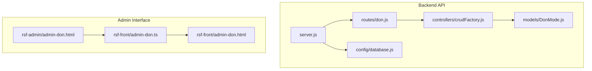
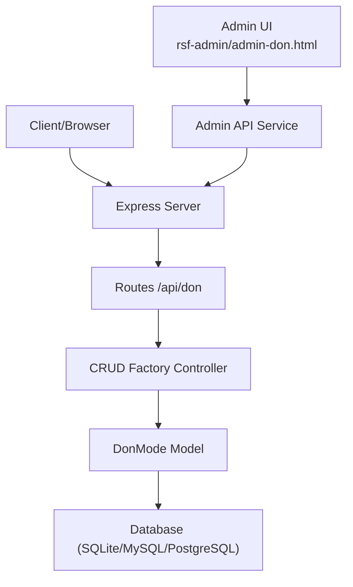
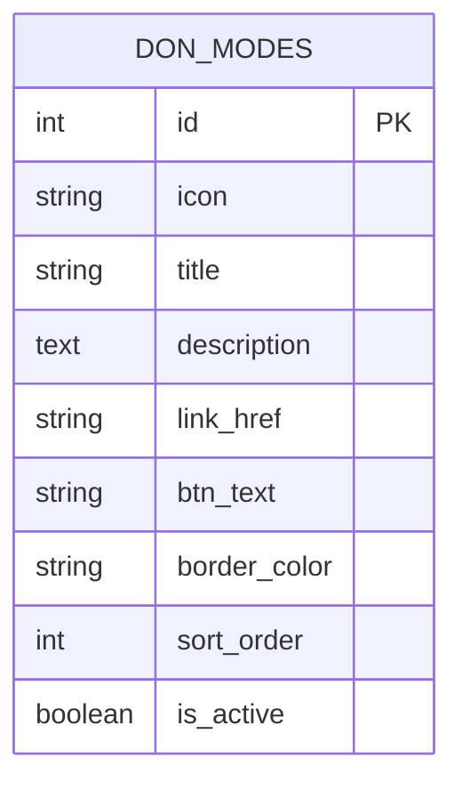
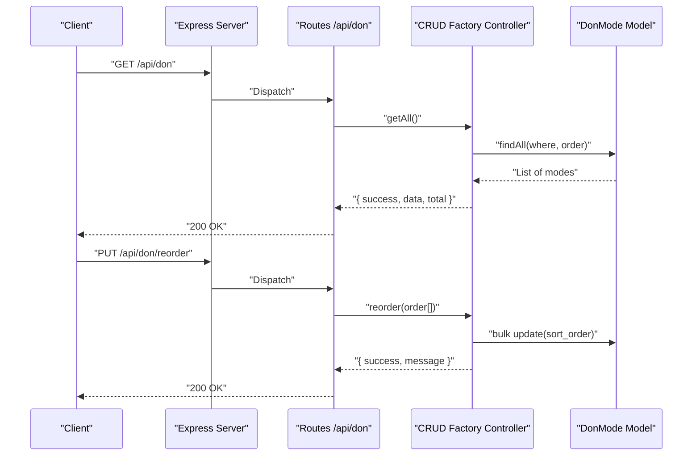
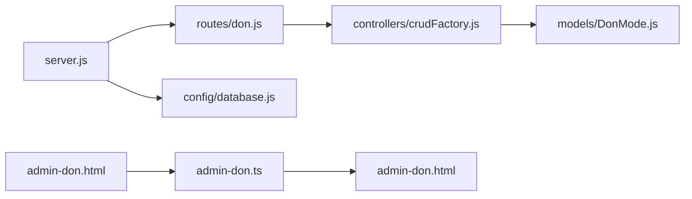

# Donation System API

<cite>
**Referenced Files in This Document**
- [DonMode.js](file://rsf-backend/models/DonMode.js)
- [don.js](file://rsf-backend/routes/don.js)
- [crudFactory.js](file://rsf-backend/controllers/crudFactory.js)
- [index.js](file://rsf-backend/models/index.js)
- [database.js](file://rsf-backend/config/database.js)
- [server.js](file://rsf-backend/server.js)
- [admin-don.html](file://rsf-admin/rsf-admin/admin-don.html)
- [admin-don.ts](file://rsf-front/src/app/admin/admin-don/admin-don.ts)
- [admin-don.html](file://rsf-front/src/app/admin/admin-don/admin-don.html)
</cite>

## Table of Contents
1. [Introduction](#introduction)
2. [Project Structure](#project-structure)
3. [Core Components](#core-components)
4. [Architecture Overview](#architecture-overview)
5. [Detailed Component Analysis](#detailed-component-analysis)
6. [Dependency Analysis](#dependency-analysis)
7. [Performance Considerations](#performance-considerations)
8. [Troubleshooting Guide](#troubleshooting-guide)
9. [Conclusion](#conclusion)
10. [Appendices](#appendices)

## Introduction
This document describes the donation system API focused on payment modes and donation configuration. It explains the DonMode model structure, API endpoints for retrieving and managing donation options, and how the system integrates with external payment processors. It also documents the data structures for donation categories, processing fees, and donor information handling, along with examples, validation rules, and reporting capabilities.

## Project Structure
The donation system spans backend API, database models, and admin/front-end interfaces:
- Backend API exposes donation mode management endpoints.
- Database model defines the payment mode schema.
- Admin interface allows editing donation page content and modes.
- Front-end admin component fetches and updates donation page content.

**Diagram sources**
- [server.js:1-84](file://rsf-backend/server.js#L1-L84)
- [don.js:1-19](file://rsf-backend/routes/don.js#L1-L19)
- [crudFactory.js:1-100](file://rsf-backend/controllers/crudFactory.js#L1-L100)
- [DonMode.js:1-18](file://rsf-backend/models/DonMode.js#L1-L18)
- [database.js:1-69](file://rsf-backend/config/database.js#L1-L69)
- [admin-don.html](file://rsf-admin/rsf-admin/admin-don.html)
- [admin-don.ts:1-33](file://rsf-front/src/app/admin/admin-don/admin-don.ts#L1-L33)
- [admin-don.html](file://rsf-front/src/app/admin/admin-don/admin-don.html)

**Section sources**
- [server.js:1-84](file://rsf-backend/server.js#L1-L84)
- [don.js:1-19](file://rsf-backend/routes/don.js#L1-L19)
- [crudFactory.js:1-100](file://rsf-backend/controllers/crudFactory.js#L1-L100)
- [DonMode.js:1-18](file://rsf-backend/models/DonMode.js#L1-L18)
- [database.js:1-69](file://rsf-backend/config/database.js#L1-L69)
- [admin-don.html](file://rsf-admin/rsf-admin/admin-don.html)
- [admin-don.ts:1-33](file://rsf-front/src/app/admin/admin-don/admin-don.ts#L1-L33)
- [admin-don.html](file://rsf-front/src/app/admin/admin-don/admin-don.html)

## Core Components
- DonMode model: Defines the schema for payment modes displayed on the donation page.
- Routes: Expose CRUD endpoints for donation modes with reordering capability.
- Controller factory: Provides generic CRUD operations with query filtering and ordering.
- Database configuration: Supports SQLite, MySQL, and PostgreSQL with environment-driven setup.
- Admin interfaces: Allow editing donation page content and managing modes.

Key capabilities:
- Retrieve donation modes with ordering and optional public filter.
- Create, update, delete, and reorder donation modes.
- Integrate with external payment processors via link_href and button text.

**Section sources**
- [DonMode.js:1-18](file://rsf-backend/models/DonMode.js#L1-L18)
- [don.js:1-19](file://rsf-backend/routes/don.js#L1-L19)
- [crudFactory.js:1-100](file://rsf-backend/controllers/crudFactory.js#L1-L100)
- [database.js:1-69](file://rsf-backend/config/database.js#L1-L69)

## Architecture Overview
The donation system follows a layered architecture:
- HTTP layer: Express server with middleware and routing.
- Controller layer: Generic CRUD factory for resource operations.
- Model layer: Sequelize model for donation modes.
- Persistence layer: Configurable SQL dialects with environment variables.
- Admin layer: Static admin HTML and Angular component for content management.

**Diagram sources**
- [server.js:1-84](file://rsf-backend/server.js#L1-L84)
- [don.js:1-19](file://rsf-backend/routes/don.js#L1-L19)
- [crudFactory.js:1-100](file://rsf-backend/controllers/crudFactory.js#L1-L100)
- [DonMode.js:1-18](file://rsf-backend/models/DonMode.js#L1-L18)
- [database.js:1-69](file://rsf-backend/config/database.js#L1-L69)
- [admin-don.html](file://rsf-admin/rsf-admin/admin-don.html)

## Detailed Component Analysis

### DonMode Model
The DonMode model defines the payment mode entity persisted in the database. It includes attributes for icons, titles, descriptions, links, button text, visual styling, ordering, and activation status.

**Diagram sources**
- [DonMode.js:5-15](file://rsf-backend/models/DonMode.js#L5-L15)

**Section sources**
- [DonMode.js:1-18](file://rsf-backend/models/DonMode.js#L1-L18)
- [index.js:16](file://rsf-backend/models/index.js#L16)

### API Endpoints for Donation Modes
The donation route exposes standard CRUD operations with additional reordering support. The controller factory applies ordering and optional public filters.

Endpoints:
- GET /api/don: List all donation modes with ordering and optional public filter.
- GET /api/don/:id: Retrieve a single donation mode by ID.
- POST /api/don: Create a new donation mode.
- PUT /api/don/:id: Update an existing donation mode.
- DELETE /api/don/:id: Delete a donation mode.
- PUT /api/don/reorder: Reorder multiple donation modes.

Ordering and filtering:
- Default order: sort_order ascending.
- Public filter: is_active true for anonymous requests.

Validation and casting:
- Query parameters are sanitized and cast to appropriate types (boolean, number).

**Section sources**
- [don.js:1-19](file://rsf-backend/routes/don.js#L1-L19)
- [crudFactory.js:16-31](file://rsf-backend/controllers/crudFactory.js#L16-L31)
- [crudFactory.js:39-49](file://rsf-backend/controllers/crudFactory.js#L39-L49)

### Admin Interface and Donation Content Management
The admin interface supports editing donation page content and managing four primary donation modes. The Angular admin component fetches and updates donation page content via the API.

Admin features:
- Edit donation page header and description.
- Manage four donation modes with icon, title, description, link, and button text.
- Visual impact blocks at the bottom of the page.

Front-end integration:
- Admin component loads donation page content and saves changes to the backend.

**Section sources**
- [admin-don.html](file://rsf-admin/rsf-admin/admin-don.html)
- [admin-don.ts:1-33](file://rsf-front/src/app/admin/admin-don/admin-don.ts#L1-L33)
- [admin-don.html](file://rsf-front/src/app/admin/admin-don/admin-don.html)

### Payment Mode Management Workflow
The workflow for managing payment modes involves creating, updating, reordering, and deleting entries. The system ensures consistent ordering and visibility through sort_order and is_active.

**Diagram sources**
- [don.js:11-16](file://rsf-backend/routes/don.js#L11-L16)
- [crudFactory.js:87-95](file://rsf-backend/controllers/crudFactory.js#L87-L95)
- [DonMode.js:5-15](file://rsf-backend/models/DonMode.js#L5-L15)

### Data Structures and Validation Rules
Donation categories and processing:
- Categories: Four primary modes managed via the admin interface.
- Processing configuration: Link href and button text enable external payment processor integration.
- Validation: Query parameters are sanitized and cast; missing or invalid keys are ignored.

Amount ranges and processing fees:
- No explicit amount range or fee fields are defined in the current model.
- Amount ranges and fees can be modeled by extending the schema or by using separate configuration entities.

Donor information handling:
- The current model does not include donor personal data.
- Payment processor integrations typically handle donor data separately.

**Section sources**
- [DonMode.js:5-15](file://rsf-backend/models/DonMode.js#L5-L15)
- [crudFactory.js:7-14](file://rsf-backend/controllers/crudFactory.js#L7-L14)
- [crudFactory.js:16-31](file://rsf-backend/controllers/crudFactory.js#L16-L31)

### Examples

- Retrieve donation options:
  - Endpoint: GET /api/don
  - Behavior: Returns all active donation modes ordered by sort_order.

- Payment method configuration:
  - Fields: icon, title, description, link_href, btn_text, border_color, sort_order, is_active.
  - Integration: Use link_href to redirect to external payment processors.

- Reordering modes:
  - Endpoint: PUT /api/don/reorder
  - Payload: Array of { id, sort_order } objects.

- Admin content management:
  - Endpoint: GET/PUT /api/pages/don (via admin API service)
  - Purpose: Edit donation page header, description, and impact blocks.

**Section sources**
- [don.js:11-16](file://rsf-backend/routes/don.js#L11-L16)
- [crudFactory.js:87-95](file://rsf-backend/controllers/crudFactory.js#L87-L95)
- [admin-don.ts:21-31](file://rsf-front/src/app/admin/admin-don/admin-don.ts#L21-L31)

## Dependency Analysis
The donation system exhibits clear separation of concerns:
- Routes depend on the CRUD factory and the DonMode model.
- The CRUD factory depends on Sequelize attributes and sanitizes query parameters.
- The server initializes middleware, routes, and database connections.
- The admin UI depends on the API for content synchronization.

**Diagram sources**
- [server.js:1-84](file://rsf-backend/server.js#L1-L84)
- [don.js:1-19](file://rsf-backend/routes/don.js#L1-L19)
- [crudFactory.js:1-100](file://rsf-backend/controllers/crudFactory.js#L1-L100)
- [DonMode.js:1-18](file://rsf-backend/models/DonMode.js#L1-L18)
- [database.js:1-69](file://rsf-backend/config/database.js#L1-L69)
- [admin-don.html](file://rsf-admin/rsf-admin/admin-don.html)
- [admin-don.ts:1-33](file://rsf-front/src/app/admin/admin-don/admin-don.ts#L1-L33)
- [admin-don.html](file://rsf-front/src/app/admin/admin-don/admin-don.html)

**Section sources**
- [server.js:1-84](file://rsf-backend/server.js#L1-L84)
- [don.js:1-19](file://rsf-backend/routes/don.js#L1-L19)
- [crudFactory.js:1-100](file://rsf-backend/controllers/crudFactory.js#L1-L100)
- [DonMode.js:1-18](file://rsf-backend/models/DonMode.js#L1-L18)
- [database.js:1-69](file://rsf-backend/config/database.js#L1-L69)
- [admin-don.html](file://rsf-admin/rsf-admin/admin-don.html)
- [admin-don.ts:1-33](file://rsf-front/src/app/admin/admin-don/admin-don.ts#L1-L33)
- [admin-don.html](file://rsf-front/src/app/admin/admin-don/admin-don.html)

## Performance Considerations
- Query filtering and ordering: The CRUD factory applies where clauses and orders by sort_order, minimizing unnecessary data transfer.
- Bulk operations: Reordering uses batch updates to reduce round trips.
- Database pooling: Environment-driven connection pooling improves throughput for concurrent requests.
- Middleware: JSON parsing and rate limiting help manage load and protect resources.

[No sources needed since this section provides general guidance]

## Troubleshooting Guide
Common issues and resolutions:
- Route not found: Verify endpoint registration under /api and correct HTTP method.
- Authentication: Anonymous users receive public-filtered results; authenticated users see all records.
- Parameter casting: Ensure numeric and boolean query parameters are passed correctly.
- Database connectivity: Confirm environment variables for dialect and credentials are set.

**Section sources**
- [server.js:46-52](file://rsf-backend/server.js#L46-L52)
- [crudFactory.js:7-14](file://rsf-backend/controllers/crudFactory.js#L7-L14)
- [crudFactory.js:42-51](file://rsf-backend/controllers/crudFactory.js#L42-L51)
- [database.js:64-66](file://rsf-backend/config/database.js#L64-L66)

## Conclusion
The donation system API provides a robust foundation for managing payment modes and integrating with external payment processors. The DonMode model, combined with generic CRUD operations and admin interfaces, enables flexible configuration and presentation of donation options. Extending the model to include amount ranges and processing fees will further enhance the system’s capabilities for comprehensive donation processing and reporting.

[No sources needed since this section summarizes without analyzing specific files]

## Appendices

### API Definition Summary
- Base URL: /api
- Authentication: Optional; public filter applies for anonymous users.
- Ordering: sort_order ascending by default.
- Filtering: Query parameters sanitized and applied where supported.

Endpoints:
- GET /api/don: List modes with optional filters.
- GET /api/don/:id: Retrieve a mode by ID.
- POST /api/don: Create a mode.
- PUT /api/don/:id: Update a mode.
- DELETE /api/don/:id: Delete a mode.
- PUT /api/don/reorder: Reorder modes.

Response format:
- Success envelope: { success: boolean, data, total? }
- Errors: Standardized error handler returns structured messages.

**Section sources**
- [don.js:11-16](file://rsf-backend/routes/don.js#L11-L16)
- [crudFactory.js:42-85](file://rsf-backend/controllers/crudFactory.js#L42-L85)
- [server.js:46-52](file://rsf-backend/server.js#L46-L52)