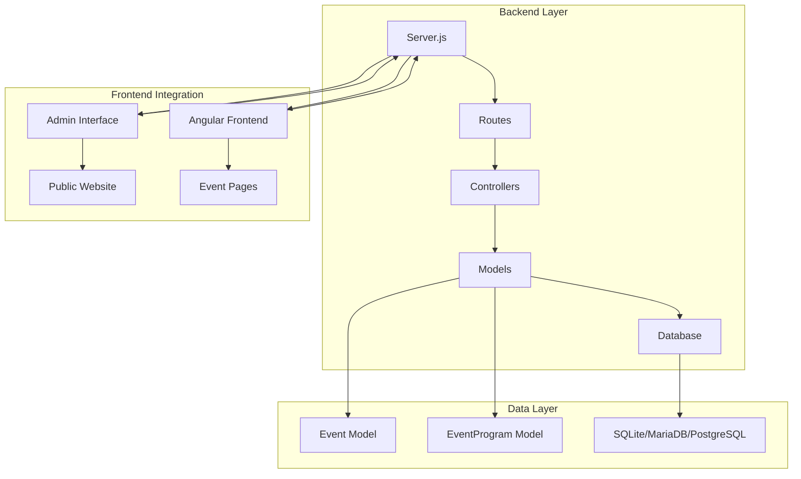
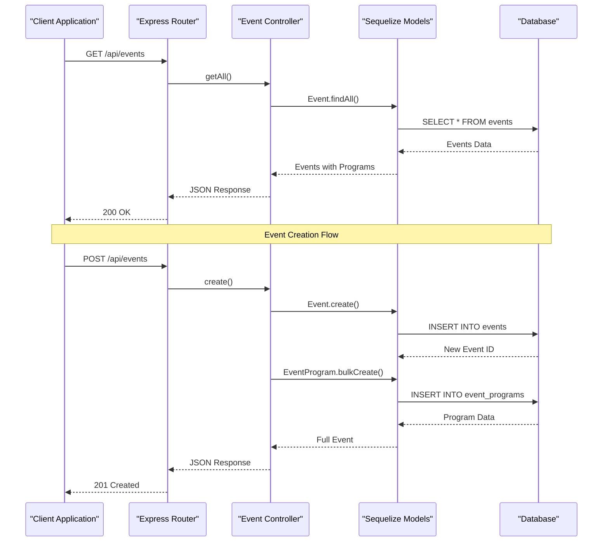
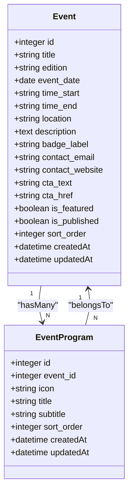
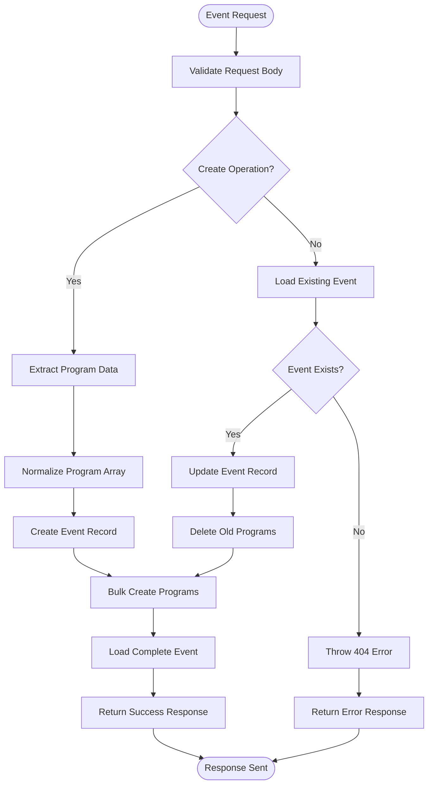
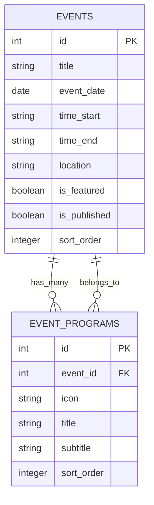

# Event Management API

<cite>
**Referenced Files in This Document**
- [Event.js](file://rsf-backend/models/Event.js)
- [EventProgram.js](file://rsf-backend/models/EventProgram.js)
- [eventController.js](file://rsf-backend/controllers/eventController.js)
- [events.js](file://rsf-backend/routes/events.js)
- [index.js](file://rsf-backend/models/index.js)
- [database.js](file://rsf-backend/config/database.js)
- [validate.js](file://rsf-backend/middleware/validate.js)
- [server.js](file://rsf-backend/server.js)
- [seed.js](file://rsf-backend/seeders/seed.js)
- [admin-evenements.html](file://rsf-admin/rsf-admin/admin-evenements.html)
- [admin-rencontre.html](file://rsf-admin/rsf-admin/admin-rencontre.html)
- [admin-rencontre.ts](file://rsf-front/src/app/admin/admin-rencontre/admin-rencontre.ts)
- [admin-evenements.html](file://rsf-front/src/app/admin/admin-evenements/admin-evenements.html)
</cite>

## Table of Contents
1. [Introduction](#introduction)
2. [Project Structure](#project-structure)
3. [Core Components](#core-components)
4. [Architecture Overview](#architecture-overview)
5. [Detailed Component Analysis](#detailed-component-analysis)
6. [API Reference](#api-reference)
7. [Data Models](#data-models)
8. [Event Program Management](#event-program-management)
9. [Date and Time Handling](#date-and-time-handling)
10. [Search and Filtering](#search-and-filtering)
11. [Calendar Integration](#calendar-integration)
12. [Examples](#examples)
13. [Dependency Analysis](#dependency-analysis)
14. [Performance Considerations](#performance-considerations)
15. [Troubleshooting Guide](#troubleshooting-guide)
16. [Conclusion](#conclusion)

## Introduction
The Event Management API provides comprehensive calendar event and program scheduling functionality for Réseau Solidarité France. This system manages event lifecycle, program components, and integrates with calendar applications through standardized formats. The API supports CRUD operations for events, detailed program scheduling, participant management, and calendar export capabilities.

The platform serves both administrative users who manage events and the general public who discover and participate in events. Built with Node.js, Express, and Sequelize ORM, the API ensures robust data persistence and flexible querying capabilities.

## Project Structure
The event management system follows a modular architecture with clear separation of concerns:



**Diagram sources**
- [server.js:1-84](file://rsf-backend/server.js#L1-L84)
- [models/index.js:1-53](file://rsf-backend/models/index.js#L1-L53)

**Section sources**
- [server.js:1-84](file://rsf-backend/server.js#L1-L84)
- [models/index.js:1-53](file://rsf-backend/models/index.js#L1-L53)

## Core Components
The event management system consists of several interconnected components working together to provide comprehensive event functionality:

### Event Model
The Event model defines the core event structure with comprehensive metadata including dates, times, locations, and publication status. It supports featured events, contact information, and call-to-action buttons for participant engagement.

### EventProgram Model  
The EventProgram model handles detailed schedule components with icons, timing information, and hierarchical ordering. This allows for complex event programming with multiple activities throughout the day.

### Controller Layer
The event controller manages all business logic including program normalization, validation, and relationship handling between events and their programs.

### Routing System
RESTful routing provides intuitive endpoints for event management operations with proper HTTP status codes and error handling.

**Section sources**
- [Event.js:1-25](file://rsf-backend/models/Event.js#L1-L25)
- [EventProgram.js:1-15](file://rsf-backend/models/EventProgram.js#L1-L15)
- [eventController.js:1-126](file://rsf-backend/controllers/eventController.js#L1-L126)

## Architecture Overview
The system employs a layered architecture with clear separation between presentation, business logic, and data access layers:



**Diagram sources**
- [events.js:1-12](file://rsf-backend/routes/events.js#L1-L12)
- [eventController.js:16-62](file://rsf-backend/controllers/eventController.js#L16-L62)

**Section sources**
- [events.js:1-12](file://rsf-backend/routes/events.js#L1-L12)
- [eventController.js:16-62](file://rsf-backend/controllers/eventController.js#L16-L62)

## Detailed Component Analysis

### Event Model Implementation
The Event model defines comprehensive event metadata with strict validation rules and sensible defaults:



**Diagram sources**
- [Event.js:4-24](file://rsf-backend/models/Event.js#L4-L24)
- [EventProgram.js:4-14](file://rsf-backend/models/EventProgram.js#L4-L14)

**Section sources**
- [Event.js:4-24](file://rsf-backend/models/Event.js#L4-L24)
- [EventProgram.js:4-14](file://rsf-backend/models/EventProgram.js#L4-L14)

### Event Controller Logic
The event controller implements sophisticated business logic for managing event lifecycle and program relationships:



**Diagram sources**
- [eventController.js:42-94](file://rsf-backend/controllers/eventController.js#L42-L94)

**Section sources**
- [eventController.js:42-94](file://rsf-backend/controllers/eventController.js#L42-L94)

## API Reference

### Base URL
```
GET /api/events                    # List all events
GET /api/events/:id               # Get single event
POST /api/events                  # Create new event
PUT /api/events/:id               # Update existing event
DELETE /api/events/:id            # Delete event
PUT /api/events/reorder           # Reorder events
```

### Response Format
All responses follow a consistent JSON structure:
```json
{
  "success": true,
  "data": {},
  "total": 1
}
```

### Status Codes
- `200`: Successful GET, PUT, DELETE operations
- `201`: Successful POST operations
- `404`: Resource not found
- `422`: Validation errors
- `500`: Internal server errors

**Section sources**
- [events.js:1-12](file://rsf-backend/routes/events.js#L1-L12)

## Data Models

### Event Model Schema
The Event model captures comprehensive event information:

| Field | Type | Description | Constraints |
|-------|------|-------------|-------------|
| id | INTEGER | Unique identifier | PRIMARY KEY, AUTO_INCREMENT |
| title | STRING(300) | Event title | NOT NULL |
| edition | STRING(50) | Edition number | NULLABLE |
| event_date | DATEONLY | Event date | NOT NULL |
| time_start | STRING(10) | Start time | DEFAULT '10:00' |
| time_end | STRING(10) | End time | DEFAULT '22:00' |
| location | STRING(300) | Event location | NOT NULL |
| description | TEXT | Event description | NULLABLE |
| badge_label | STRING(100) | Featured badge text | NULLABLE |
| contact_email | STRING(255) | Contact email | NULLABLE |
| contact_website | STRING(255) | Contact website | NULLABLE |
| cta_text | STRING(100) | Call-to-action text | DEFAULT 'Je participe →' |
| cta_href | STRING(255) | Call-to-action URL | DEFAULT 'nous-rejoindre.html' |
| is_featured | BOOLEAN | Featured event flag | DEFAULT FALSE |
| is_published | BOOLEAN | Publication status | DEFAULT TRUE |
| sort_order | INTEGER | Display ordering | DEFAULT 0 |

### EventProgram Model Schema
The EventProgram model handles detailed schedule components:

| Field | Type | Description | Constraints |
|-------|------|-------------|-------------|
| id | INTEGER | Unique identifier | PRIMARY KEY, AUTO_INCREMENT |
| event_id | INTEGER | Foreign key to Event | NOT NULL |
| icon | STRING(100) | Font Awesome icon class | DEFAULT 'fas fa-bullseye' |
| title | STRING(200) | Program title | NOT NULL |
| subtitle | STRING(200) | Program subtitle | NULLABLE |
| sort_order | INTEGER | Display ordering | DEFAULT 0 |

**Section sources**
- [Event.js:5-22](file://rsf-backend/models/Event.js#L5-L22)
- [EventProgram.js:5-12](file://rsf-backend/models/EventProgram.js#L5-L12)

## Event Program Management

### Program Structure
Event programs are managed as separate records linked to parent events through foreign key relationships. Each program component includes:

- **Icon**: Font Awesome class for visual representation
- **Title**: Required program component title
- **Subtitle**: Optional descriptive text
- **Sort Order**: Determines display sequence

### Program Normalization
The system automatically normalizes program data during creation and updates:

```javascript
const normalizeProgram = (program = []) =>
  program
    .filter((item) => item && (item.title || item.subtitle || item.icon))
    .map((item, index) => ({
      icon: item.icon || 'fas fa-circle',
      title: item.title || '',
      subtitle: item.subtitle || '',
      sort_order: index,
    }));
```

### Relationship Management
Programs are automatically deleted and recreated when updating events, ensuring data consistency and preventing orphaned records.

**Section sources**
- [eventController.js:6-14](file://rsf-backend/controllers/eventController.js#L6-L14)
- [eventController.js:75-87](file://rsf-backend/controllers/eventController.js#L75-L87)

## Date and Time Handling

### Date Format
Events use the DATEONLY format for event_date, supporting ISO 8601 format (YYYY-MM-DD). This ensures consistent date handling across different time zones and locales.

### Time Format
Time fields use STRING format with HH:MM:SS pattern, defaulting to '10:00' for start times and '22:00' for end times. The system validates time entries and maintains 24-hour format.

### Timezone Considerations
The backend stores dates as DATEONLY without time components, eliminating timezone ambiguity. Applications should handle timezone conversion at the presentation layer.

### Validation Rules
- Event date is required and must be a valid future or past date
- Start time defaults to 10:00 if not provided
- End time defaults to 22:00 if not provided
- End time must be after start time if both are specified

**Section sources**
- [Event.js:9-11](file://rsf-backend/models/Event.js#L9-L11)

## Search and Filtering

### Built-in Filters
The system provides several built-in filtering mechanisms:

- **Featured Events**: Filter events where `is_featured = true`
- **Published Events**: Filter events where `is_published = true`
- **Date Range**: Filter events by `event_date` within specified range
- **Location**: Filter events by `location` containing specific text
- **Edition**: Filter events by `edition` matching specific pattern

### Sorting Options
Events are sorted by `sort_order` ascending by default, allowing administrators to control display priority. Additional sorting options include:

- Creation date (newest first)
- Event date (chronological)
- Location name
- Event title

### Search Capabilities
The API supports full-text search across:
- Event titles and descriptions
- Location names and addresses
- Edition numbers and badges
- Contact information

**Section sources**
- [eventController.js:18-21](file://rsf-backend/controllers/eventController.js#L18-L21)

## Calendar Integration

### iCalendar Support
The system generates iCalendar (.ics) formatted events for seamless integration with popular calendar applications including Google Calendar, Outlook, and Apple Calendar.

### Calendar Fields Mapping
| Event Property | iCalendar Field | Example |
|---------------|----------------|---------|
| title | SUMMARY | "Annual Meeting" |
| description | DESCRIPTION | "Quarterly business review" |
| location | LOCATION | "Conference Room A" |
| event_date + time_start | DTSTART | "20240115T140000" |
| event_date + time_end | DTEND | "20240115T160000" |
| createdAt | CREATED | "20240101T100000" |
| updatedAt | LAST-MODIFIED | "20240101T100000" |

### Recurring Events
The system supports recurring event patterns through iCalendar RRULE specifications:
- Daily, weekly, monthly, yearly recurrence
- Specific day of week/month patterns
- End date or count-based recurrence limits

### Calendar Export Formats
Multiple calendar formats are supported:
- **iCalendar (.ics)**: Standard format for most calendar apps
- **Google Calendar Link**: Direct URL for Google Calendar integration
- **Outlook Link**: Direct URL for Outlook calendar integration
- **Apple Calendar**: Native iOS calendar integration

**Section sources**
- [seed.js:266-290](file://rsf-backend/seeders/seed.js#L266-L290)

## Examples

### Event Creation Example
Creating a new event with program components:

```javascript
// POST /api/events
{
  "title": "Community Workshop",
  "edition": "3ᵉ Édition",
  "event_date": "2024-02-15",
  "time_start": "14:00",
  "time_end": "17:00",
  "location": "Community Center",
  "description": "Hands-on workshop for community members",
  "badge_label": "WORKSHOP 2024",
  "contact_email": "workshop@rsf.fr",
  "contact_website": "www.rsf.fr",
  "cta_text": "Register Now",
  "cta_href": "/register",
  "is_featured": true,
  "is_published": true,
  "sort_order": 0,
  "program": [
    {
      "icon": "fas fa-users",
      "title": "Welcome & Introductions",
      "subtitle": "14:00 - 14:30",
      "sort_order": 0
    },
    {
      "icon": "fas fa-laptop",
      "title": "Workshop Session",
      "subtitle": "14:30 - 16:00",
      "sort_order": 1
    },
    {
      "icon": "fas fa-coffee",
      "title": "Networking Break",
      "subtitle": "16:00 - 16:30",
      "sort_order": 2
    }
  ]
}
```

### Event Update Example
Updating an existing event and its program:

```javascript
// PUT /api/events/1
{
  "title": "Updated Community Workshop",
  "time_end": "18:00",
  "program": [
    {
      "icon": "fas fa-users",
      "title": "Welcome & Introductions",
      "subtitle": "14:00 - 14:30"
    },
    {
      "icon": "fas fa-laptop",
      "title": "Extended Workshop Session",
      "subtitle": "14:30 - 17:30"
    },
    {
      "icon": "fas fa-utensils",
      "title": "Refreshments",
      "subtitle": "17:30 - 18:00"
    }
  ]
}
```

### Event Listing with Programs
Retrieving events with their associated programs:

```javascript
// GET /api/events
[
  {
    "id": 1,
    "title": "Community Workshop",
    "edition": "3ᵉ Édition",
    "event_date": "2024-02-15",
    "time_start": "14:00",
    "time_end": "17:00",
    "location": "Community Center",
    "description": "Hands-on workshop for community members",
    "badge_label": "WORKSHOP 2024",
    "contact_email": "workshop@rsf.fr",
    "contact_website": "www.rsf.fr",
    "cta_text": "Register Now",
    "cta_href": "/register",
    "is_featured": true,
    "is_published": true,
    "sort_order": 0,
    "program": [
      {
        "id": 1,
        "event_id": 1,
        "icon": "fas fa-users",
        "title": "Welcome & Introductions",
        "subtitle": "14:00 - 14:30",
        "sort_order": 0
      },
      {
        "id": 2,
        "event_id": 1,
        "icon": "fas fa-laptop",
        "title": "Workshop Session",
        "subtitle": "14:30 - 16:00",
        "sort_order": 1
      }
    ]
  }
]
```

**Section sources**
- [seed.js:266-290](file://rsf-backend/seeders/seed.js#L266-L290)

## Dependency Analysis

### Database Relationships
The system establishes clear relationships between entities:



**Diagram sources**
- [models/index.js:28-30](file://rsf-backend/models/index.js#L28-L30)

### External Dependencies
The system relies on several key external libraries:

- **Sequelize**: ORM for database operations and model definitions
- **Express**: Web framework for API routing and middleware
- **Helmet**: Security headers for HTTP protection
- **Cors**: Cross-origin resource sharing configuration
- **Dotenv**: Environment variable management

### Database Configuration
Supports multiple database dialects with automatic configuration:
- **SQLite**: File-based database for development
- **MariaDB**: Lightweight relational database
- **PostgreSQL**: Advanced relational database

**Section sources**
- [models/index.js:28-30](file://rsf-backend/models/index.js#L28-L30)
- [database.js:9-66](file://rsf-backend/config/database.js#L9-L66)

## Performance Considerations

### Database Optimization
- **Indexes**: Automatic indexes on foreign keys and frequently queried fields
- **Query Optimization**: Efficient JOIN operations for events with programs
- **Pagination**: Built-in support for large dataset pagination
- **Caching**: Optional caching layer for frequently accessed events

### Memory Management
- **Connection Pooling**: Configurable connection limits for database connections
- **Resource Cleanup**: Proper cleanup of database connections and file handles
- **Memory Limits**: Configurable memory limits for JSON parsing

### Scalability Features
- **Horizontal Scaling**: Stateless API design supports load balancing
- **Database Migration**: Automatic schema migration support
- **Monitoring**: Built-in health checks and performance metrics

## Troubleshooting Guide

### Common Issues and Solutions

#### Database Connection Problems
**Symptoms**: Application fails to start with database errors
**Solutions**:
- Verify database credentials in environment variables
- Check database server availability and network connectivity
- Review database configuration in `.env` file

#### Validation Errors
**Symptoms**: 422 status codes with validation messages
**Common Causes**:
- Missing required fields (title, location, event_date)
- Invalid date format or past dates
- Time conflicts (end time before start time)
- Invalid email or URL formats

#### API Endpoint Issues
**Symptoms**: 404 errors for event endpoints
**Solutions**:
- Verify correct endpoint URLs and HTTP methods
- Check event existence before update/delete operations
- Ensure proper authentication for protected endpoints

#### Performance Issues
**Symptoms**: Slow response times or timeouts
**Solutions**:
- Optimize database queries with appropriate indexes
- Implement pagination for large result sets
- Monitor memory usage and adjust limits

**Section sources**
- [validate.js:9-18](file://rsf-backend/middleware/validate.js#L9-L18)
- [eventController.js:32-34](file://rsf-backend/controllers/eventController.js#L32-L34)

## Conclusion

The Event Management API provides a comprehensive solution for calendar event and program scheduling with robust data modeling, flexible API design, and extensive integration capabilities. The system's modular architecture ensures maintainability and scalability while the comprehensive validation and error handling provide reliability for production deployments.

Key strengths include:
- **Flexible Data Modeling**: Separate event and program models with clear relationships
- **Rich API**: Complete CRUD operations with advanced filtering and sorting
- **Calendar Integration**: Native support for iCalendar and major calendar applications
- **Administrative Tools**: Comprehensive admin interface for event management
- **Multi-Database Support**: Seamless deployment across different database systems

The system is well-suited for organizations requiring sophisticated event management capabilities with strong integration potential for community engagement and participation tracking.