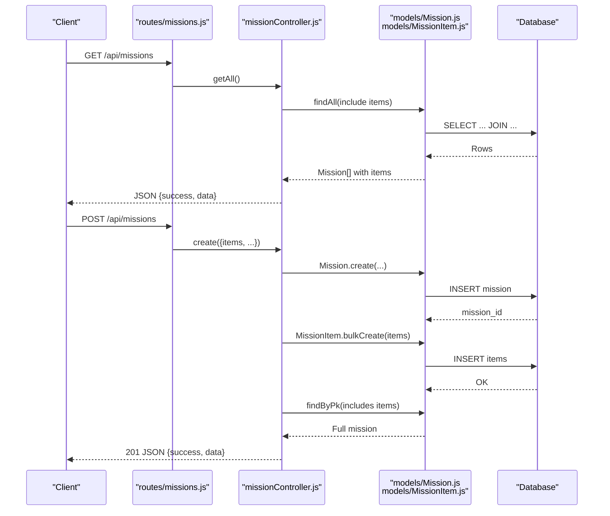
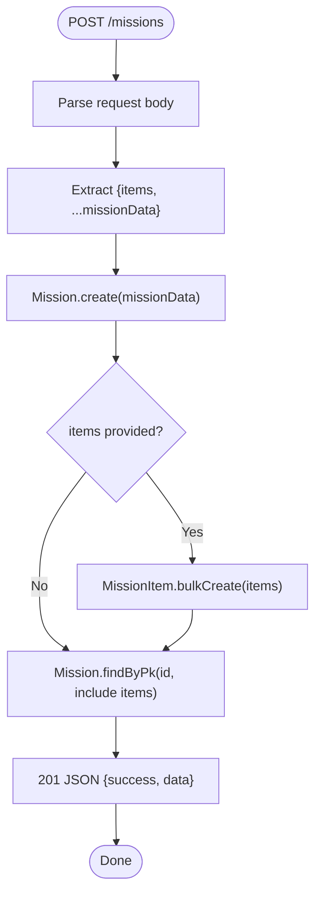
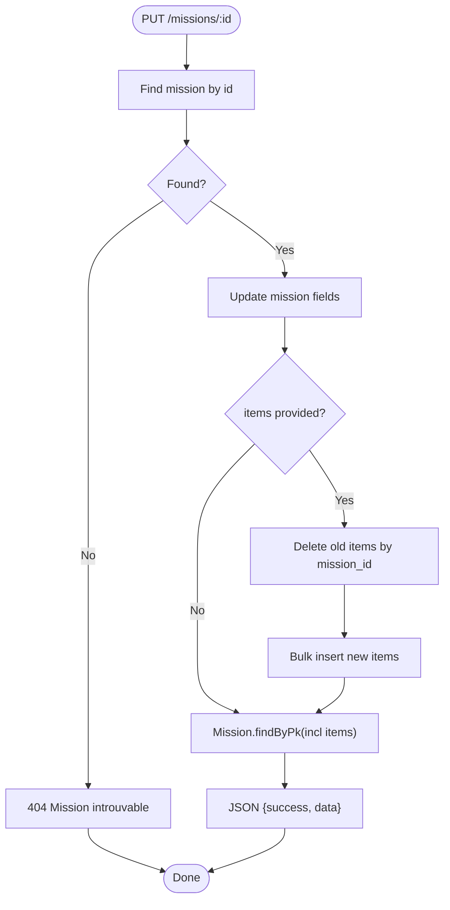
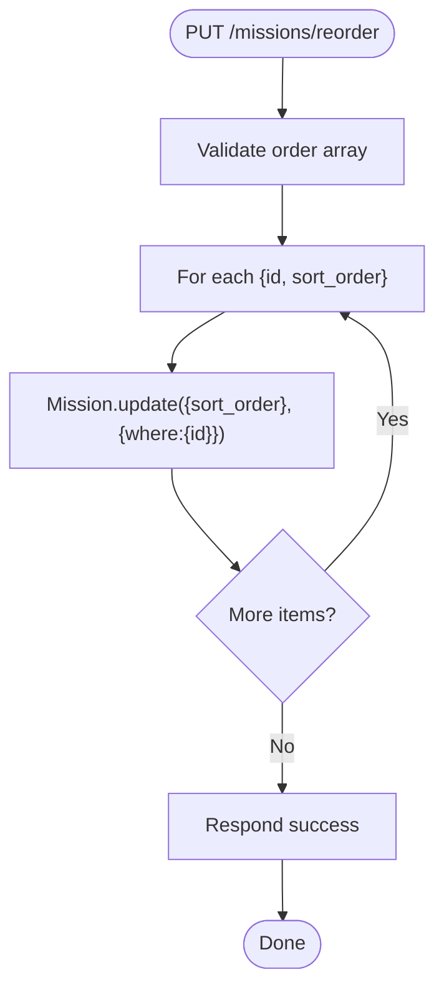
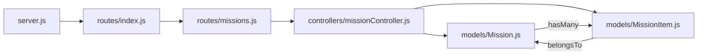

# Mission Management API

<cite>
**Referenced Files in This Document**
- [Mission.js](file://rsf-backend/models/Mission.js)
- [MissionItem.js](file://rsf-backend/models/MissionItem.js)
- [missionController.js](file://rsf-backend/controllers/missionController.js)
- [missions.js](file://rsf-backend/routes/missions.js)
- [index.js](file://rsf-backend/models/index.js)
- [server.js](file://rsf-backend/server.js)
- [index.js](file://rsf-backend/routes/index.js)
- [validate.js](file://rsf-backend/middleware/validate.js)
- [seed.js](file://rsf-backend/seeders/seed.js)
- [api-tests.http](file://rsf-backend/api-tests.http)
- [public.service.ts](file://rsf-front/src/app/services/public.service.ts)
- [admin-missions.ts](file://rsf-front/src/app/admin/admin-missions/admin-missions.ts)
- [admin-api.service.ts](file://rsf-front/src/app/admin/admin-api.service.ts)
- [nos-missions.html](file://rsf-website/nos-missions.html)
</cite>

## Table of Contents
1. [Introduction](#introduction)
2. [Project Structure](#project-structure)
3. [Core Components](#core-components)
4. [Architecture Overview](#architecture-overview)
5. [Detailed Component Analysis](#detailed-component-analysis)
6. [Dependency Analysis](#dependency-analysis)
7. [Performance Considerations](#performance-considerations)
8. [Troubleshooting Guide](#troubleshooting-guide)
9. [Conclusion](#conclusion)
10. [Appendices](#appendices)

## Introduction
This document describes the Mission Management API used to store and manage organizational mission statements and their detailed components. It covers:
- Mission model for core mission statements
- MissionItem model for mission components and progress indicators
- API endpoints for retrieving mission information, managing hierarchies, and reordering missions
- Data structures, validation rules, and display formatting for web presentation
- Examples of mission retrieval, item management, and progress visualization

## Project Structure
The Mission Management API is implemented in the backend and consumed by both the public website and the admin interface.

```mermaid
graph TB
subgraph "Backend"
A["server.js<br/>Express server"]
B["routes/index.js<br/>Main router"]
C["routes/missions.js<br/>Missions endpoints"]
D["controllers/missionController.js<br/>Business logic"]
E["models/Mission.js<br/>Mission model"]
F["models/MissionItem.js<br/>MissionItem model"]
G["models/index.js<br/>Associations"]
H["middleware/validate.js<br/>Validation middleware"]
end
subgraph "Frontend"
I["public.service.ts<br/>Public client"]
J["admin-api.service.ts<br/>Admin client"]
K["admin-missions.ts<br/>Admin component"]
L["nos-missions.html<br/>Public page"]
end
A --> B
B --> C
C --> D
D --> E
D --> F
E <- --> F
D --> H
I --> |"GET /api/public/missions"| A
J --> |"GET/PUT/DELETE /api/missions"| A
K --> J
L --> I
```

**Diagram sources**
- [server.js:1-84](file://rsf-backend/server.js#L1-L84)
- [index.js:1-28](file://rsf-backend/routes/index.js#L1-L28)
- [missions.js:1-13](file://rsf-backend/routes/missions.js#L1-L13)
- [missionController.js:1-74](file://rsf-backend/controllers/missionController.js#L1-L74)
- [Mission.js:1-16](file://rsf-backend/models/Mission.js#L1-L16)
- [MissionItem.js:1-13](file://rsf-backend/models/MissionItem.js#L1-L13)
- [index.js:22-26](file://rsf-backend/models/index.js#L22-L26)
- [validate.js:1-22](file://rsf-backend/middleware/validate.js#L1-L22)
- [public.service.ts:65-70](file://rsf-front/src/app/services/public.service.ts#L65-L70)
- [admin-api.service.ts:22-64](file://rsf-front/src/app/admin/admin-api.service.ts#L22-L64)
- [admin-missions.ts:21-31](file://rsf-front/src/app/admin/admin-missions/admin-missions.ts#L21-L31)
- [nos-missions.html:1-230](file://rsf-website/nos-missions.html#L1-L230)

**Section sources**
- [server.js:1-84](file://rsf-backend/server.js#L1-L84)
- [index.js:1-28](file://rsf-backend/routes/index.js#L1-L28)
- [missions.js:1-13](file://rsf-backend/routes/missions.js#L1-L13)
- [missionController.js:1-74](file://rsf-backend/controllers/missionController.js#L1-L74)
- [Mission.js:1-16](file://rsf-backend/models/Mission.js#L1-L16)
- [MissionItem.js:1-13](file://rsf-backend/models/MissionItem.js#L1-L13)
- [index.js:22-26](file://rsf-backend/models/index.js#L22-L26)
- [validate.js:1-22](file://rsf-backend/middleware/validate.js#L1-L22)
- [public.service.ts:65-70](file://rsf-front/src/app/services/public.service.ts#L65-L70)
- [admin-api.service.ts:22-64](file://rsf-front/src/app/admin/admin-api.service.ts#L22-L64)
- [admin-missions.ts:21-31](file://rsf-front/src/app/admin/admin-missions/admin-missions.ts#L21-L31)
- [nos-missions.html:1-230](file://rsf-website/nos-missions.html#L1-L230)

## Core Components
- Mission model: stores core mission metadata and ordering.
- MissionItem model: stores individual mission components (goals) linked to a mission.
- Controller: orchestrates CRUD operations, hierarchy management, and reordering.
- Routes: exposes REST endpoints under /api/missions.
- Associations: Mission 1→N MissionItem with cascade delete.

Key behaviors:
- Retrieval includes nested items ordered by sort_order.
- Creation supports bulk creation of items via an items array.
- Update supports replacing items by passing an items array; missing items are deleted.
- Deletion cascades to child items.
- Reorder endpoint updates sort_order for multiple missions atomically.

**Section sources**
- [Mission.js:1-16](file://rsf-backend/models/Mission.js#L1-L16)
- [MissionItem.js:1-13](file://rsf-backend/models/MissionItem.js#L1-L13)
- [missionController.js:5-71](file://rsf-backend/controllers/missionController.js#L5-L71)
- [missions.js:5-10](file://rsf-backend/routes/missions.js#L5-L10)
- [index.js:24-26](file://rsf-backend/models/index.js#L24-L26)

## Architecture Overview
The API follows a layered architecture:
- HTTP layer: Express routes
- Business logic: Controllers
- Data access: Sequelize models with associations
- Validation: express-validator middleware pipeline



**Diagram sources**
- [missions.js:5-10](file://rsf-backend/routes/missions.js#L5-L10)
- [missionController.js:5-35](file://rsf-backend/controllers/missionController.js#L5-L35)
- [Mission.js:1-16](file://rsf-backend/models/Mission.js#L1-L16)
- [MissionItem.js:1-13](file://rsf-backend/models/MissionItem.js#L1-L13)

## Detailed Component Analysis

### Mission Model
Stores core mission metadata:
- id: primary key
- icon: font awesome icon identifier
- title: mission title
- description: optional long description
- color_name: semantic color category
- sort_order: integer for ordering
- is_active: boolean flag

Constraints and defaults:
- Non-empty icon and title
- Defaults for color_name and sort_order
- Optional description

**Section sources**
- [Mission.js:5-13](file://rsf-backend/models/Mission.js#L5-L13)

### MissionItem Model
Stores mission components:
- id: primary key
- mission_id: foreign key to Mission
- text: component text (goal/description)
- sort_order: integer for ordering within a mission

Constraints:
- mission_id required
- text required
- sort_order default 0

**Section sources**
- [MissionItem.js:5-10](file://rsf-backend/models/MissionItem.js#L5-L10)

### Associations
- Mission hasMany MissionItem (onDelete: CASCADE)
- MissionItem belongsTo Mission

This ensures that deleting a mission removes all its items automatically.

**Section sources**
- [index.js:24-26](file://rsf-backend/models/index.js#L24-L26)

### API Endpoints
- GET /api/missions
  - Returns all missions with items ordered by sort_order
- GET /api/missions/:id
  - Returns a single mission with items; 404 if not found
- POST /api/missions
  - Creates a mission; accepts items array to create child items
  - Returns 201 with full mission
- PUT /api/missions/:id
  - Updates a mission; pass items array to replace children
  - Returns updated mission
- DELETE /api/missions/:id
  - Deletes a mission; items are cascade-deleted
- PUT /api/missions/reorder
  - Accepts { order: [{ id, sort_order }] } to update multiple missions

Response format:
- Always returns { success: boolean, message?: string, data?: any }

**Section sources**
- [missions.js:5-10](file://rsf-backend/routes/missions.js#L5-L10)
- [missionController.js:5-71](file://rsf-backend/controllers/missionController.js#L5-L71)

### Data Structures

#### Mission
- id: number
- icon: string
- title: string
- description: string?
- color_name: string
- sort_order: number
- is_active: boolean
- items: MissionItem[]

#### MissionItem
- id: number
- mission_id: number
- text: string
- sort_order: number

**Section sources**
- [Mission.js:5-13](file://rsf-backend/models/Mission.js#L5-L13)
- [MissionItem.js:5-10](file://rsf-backend/models/MissionItem.js#L5-L10)

### Processing Logic

#### Create Mission with Items


**Diagram sources**
- [missionController.js:25-35](file://rsf-backend/controllers/missionController.js#L25-L35)

#### Update Mission Items


**Diagram sources**
- [missionController.js:37-52](file://rsf-backend/controllers/missionController.js#L37-L52)

#### Reorder Missions


**Diagram sources**
- [missionController.js:63-71](file://rsf-backend/controllers/missionController.js#L63-L71)

### Validation Rules
- Validation middleware checks express-validator results and returns 422 with structured errors when validation fails.
- While explicit validator rules are not defined in the controller, the presence of the validate middleware indicates validation is expected for write operations.

Note: The current implementation relies on the validation middleware to enforce rules. Define express-validator rules in the route handlers to provide precise field-level validation.

**Section sources**
- [validate.js:9-18](file://rsf-backend/middleware/validate.js#L9-L18)

### Display Formatting for Web Presentation
- Public website displays missions as cards with:
  - Icon box
  - Title
  - Ordered list of items
  - Semantic border colors derived from mission.color_name
- Admin interface loads missions via the API and allows editing.

Frontend consumption:
- Public page fetches missions via PublicService.getMissions()
- Admin component fetches missions via AdminApiService.listResource('missions')

**Section sources**
- [nos-missions.html:90-156](file://rsf-website/nos-missions.html#L90-L156)
- [public.service.ts:65-70](file://rsf-front/src/app/services/public.service.ts#L65-L70)
- [admin-api.service.ts:32-44](file://rsf-front/src/app/admin/admin-api.service.ts#L32-L44)
- [admin-missions.ts:21-25](file://rsf-front/src/app/admin/admin-missions/admin-missions.ts#L21-L25)

### Examples

#### Example: Retrieve All Missions
- Endpoint: GET /api/missions
- Expected response: { success: true, data: Mission[] }
- Each Mission includes items ordered by sort_order

**Section sources**
- [missions.js:5](file://rsf-backend/routes/missions.js#L5)
- [missionController.js:5-13](file://rsf-backend/controllers/missionController.js#L5-L13)

#### Example: Create a Mission with Items
- Endpoint: POST /api/missions
- Request body: { title, icon?, color_name?, sort_order?, description?, items?: [string, ...] }
- Response: 201 with full mission including items

**Section sources**
- [missions.js:7](file://rsf-backend/routes/missions.js#L7)
- [missionController.js:25-35](file://rsf-backend/controllers/missionController.js#L25-L35)
- [seed.js:222-231](file://rsf-backend/seeders/seed.js#L222-L231)

#### Example: Update Mission Items
- Endpoint: PUT /api/missions/:id
- Request body: { title?, icon?, color_name?, sort_order?, description?, items?: [string, ...] }
- Behavior: replaces existing items with the provided array

**Section sources**
- [missions.js:9](file://rsf-backend/routes/missions.js#L9)
- [missionController.js:37-52](file://rsf-backend/controllers/missionController.js#L37-L52)
- [api-tests.http:186-200](file://rsf-backend/api-tests.http#L186-L200)

#### Example: Progress Visualization
- Each MissionItem.text represents a progress indicator or goal.
- The public page renders items as a bullet list under each mission card.

**Section sources**
- [MissionItem.js:8](file://rsf-backend/models/MissionItem.js#L8)
- [nos-missions.html:94-155](file://rsf-website/nos-missions.html#L94-L155)

## Dependency Analysis


**Diagram sources**
- [missions.js:1-13](file://rsf-backend/routes/missions.js#L1-L13)
- [missionController.js:1-74](file://rsf-backend/controllers/missionController.js#L1-L74)
- [Mission.js:1-16](file://rsf-backend/models/Mission.js#L1-L16)
- [MissionItem.js:1-13](file://rsf-backend/models/MissionItem.js#L1-L13)
- [index.js:24-26](file://rsf-backend/models/index.js#L24-L26)
- [server.js:33](file://rsf-backend/server.js#L33)
- [index.js:18](file://rsf-backend/routes/index.js#L18)

**Section sources**
- [missions.js:1-13](file://rsf-backend/routes/missions.js#L1-L13)
- [missionController.js:1-74](file://rsf-backend/controllers/missionController.js#L1-L74)
- [Mission.js:1-16](file://rsf-backend/models/Mission.js#L1-L16)
- [MissionItem.js:1-13](file://rsf-backend/models/MissionItem.js#L1-L13)
- [index.js:24-26](file://rsf-backend/models/index.js#L24-L26)
- [server.js:33](file://rsf-backend/server.js#L33)
- [index.js:18](file://rsf-backend/routes/index.js#L18)

## Performance Considerations
- Use sort_order to avoid expensive sorting on the client.
- Bulk operations: MissionItem.bulkCreate reduces round-trips during creation.
- Cascade deletes prevent orphaned items and simplify cleanup.
- Consider adding database indexes on mission_id and sort_order for large datasets.

## Troubleshooting Guide
Common issues and resolutions:
- 404 Not Found when retrieving non-existent mission
  - Ensure the mission exists before calling GET /api/missions/:id
- 422 Unprocessable Entity on validation failure
  - Add express-validator rules to enforce required fields and constraints
- Items not updating when calling PUT /api/missions/:id
  - Pass items array to replace children; omitting items preserves existing items
- Deleting a mission does not remove items
  - Confirm associations and onDelete: 'CASCADE' are configured

**Section sources**
- [missionController.js:15-23](file://rsf-backend/controllers/missionController.js#L15-L23)
- [missionController.js:37-52](file://rsf-backend/controllers/missionController.js#L37-L52)
- [index.js:24-26](file://rsf-backend/models/index.js#L24-L26)
- [validate.js:9-18](file://rsf-backend/middleware/validate.js#L9-L18)

## Conclusion
The Mission Management API provides a clean, hierarchical structure for organizing organizational missions and their components. It supports robust CRUD operations, maintains referential integrity through associations, and integrates seamlessly with both public and admin frontends. Extending validation rules and adding database indexes will further improve reliability and performance.

## Appendices

### API Definition Summary
- GET /api/missions
  - Description: Retrieve all missions with items
  - Response: { success: boolean, data: Mission[] }
- GET /api/missions/:id
  - Description: Retrieve a mission by ID with items
  - Response: { success: boolean, data: Mission }
- POST /api/missions
  - Description: Create a mission and optional items
  - Body: { title, icon?, color_name?, sort_order?, description?, items?: [string, ...] }
  - Response: 201 { success: boolean, data: Mission }
- PUT /api/missions/:id
  - Description: Update mission and replace items
  - Body: { title?, icon?, color_name?, sort_order?, description?, items?: [string, ...] }
  - Response: { success: boolean, data: Mission }
- DELETE /api/missions/:id
  - Description: Delete mission (items cascade)
  - Response: { success: boolean, message: string }
- PUT /api/missions/reorder
  - Description: Update sort_order for multiple missions
  - Body: { order: [{ id: number, sort_order: number }] }
  - Response: { success: boolean, message: string }

**Section sources**
- [missions.js:5-10](file://rsf-backend/routes/missions.js#L5-L10)
- [missionController.js:5-71](file://rsf-backend/controllers/missionController.js#L5-L71)