# News and Activities API

<cite>
**Referenced Files in This Document**
- [Actuality.js](file://rsf-backend/models/Actuality.js)
- [actualities.js](file://rsf-backend/routes/actualities.js)
- [crudFactory.js](file://rsf-backend/controllers/crudFactory.js)
- [public.js](file://rsf-backend/routes/public.js)
- [index.js](file://rsf-backend/routes/index.js)
- [server.js](file://rsf-backend/server.js)
- [auth.js](file://rsf-backend/middleware/auth.js)
- [validate.js](file://rsf-backend/middleware/validate.js)
- [errorHandler.js](file://rsf-backend/middleware/errorHandler.js)
- [database.js](file://rsf-backend/config/database.js)
- [api-tests.http](file://rsf-backend/api-tests.http)
- [admin-actualites.html](file://rsf-admin/rsf-admin/admin-actualites.html)
- [admin-actualites.html](file://rsf-front/src/app/admin/admin-actualites/admin-actualites.html)
- [admin-editor-config.ts](file://rsf-front/src/app/admin/admin-editor-config.ts)
</cite>

## Table of Contents
1. [Introduction](#introduction)
2. [Project Structure](#project-structure)
3. [Core Components](#core-components)
4. [Architecture Overview](#architecture-overview)
5. [Detailed Component Analysis](#detailed-component-analysis)
6. [API Endpoints Reference](#api-endpoints-reference)
7. [Content Management Workflows](#content-management-workflows)
8. [Image Handling for News Articles](#image-handling-for-news-articles)
9. [SEO and Publication Features](#seo-and-publication-features)
10. [Category Organization](#category-organization)
11. [Validation Rules and Error Handling](#validation-rules-and-error-handling)
12. [Integration with Public Website](#integration-with-public-website)
13. [Performance Considerations](#performance-considerations)
14. [Troubleshooting Guide](#troubleshooting-guide)
15. [Conclusion](#conclusion)

## Introduction
This document provides comprehensive documentation for the News and Activities API, focusing on the article management and publication workflows for news articles. It covers the Actuality model structure, API endpoints for CRUD operations, content management processes, image handling, SEO optimization features, category-based filtering, and integration with the public website display system.

## Project Structure
The News and Activities API is part of a larger backend system built with Express.js and Sequelize. The structure follows a modular pattern with dedicated folders for models, routes, controllers, middleware, and configuration.

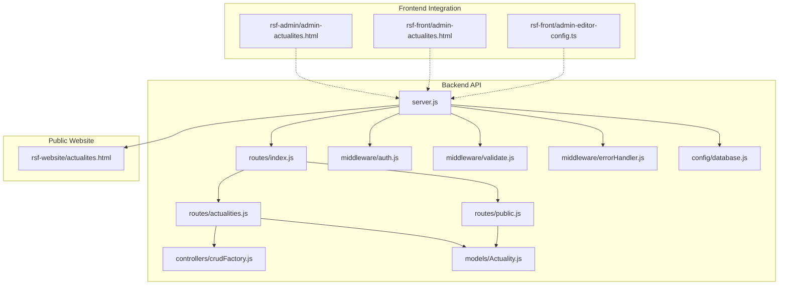

**Diagram sources**
- [server.js:1-84](file://rsf-backend/server.js#L1-L84)
- [index.js:1-28](file://rsf-backend/routes/index.js#L1-L28)
- [actualities.js:1-19](file://rsf-backend/routes/actualities.js#L1-L19)
- [public.js:1-201](file://rsf-backend/routes/public.js#L1-L201)

**Section sources**
- [server.js:1-84](file://rsf-backend/server.js#L1-L84)
- [index.js:1-28](file://rsf-backend/routes/index.js#L1-L28)

## Core Components
The News and Activities API consists of several key components working together to manage news articles and their publication workflow.

### Actuality Model
The Actuality model defines the structure for news articles with comprehensive metadata support:

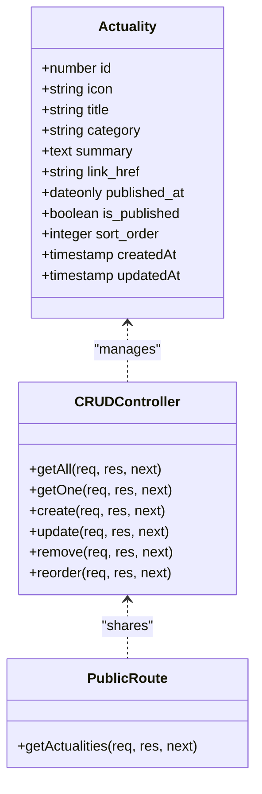

**Diagram sources**
- [Actuality.js:1-18](file://rsf-backend/models/Actuality.js#L1-L18)
- [crudFactory.js:1-100](file://rsf-backend/controllers/crudFactory.js#L1-L100)
- [public.js:133-143](file://rsf-backend/routes/public.js#L133-L143)

**Section sources**
- [Actuality.js:1-18](file://rsf-backend/models/Actuality.js#L1-L18)

## Architecture Overview
The API follows a layered architecture with clear separation of concerns between presentation, business logic, and data access layers.

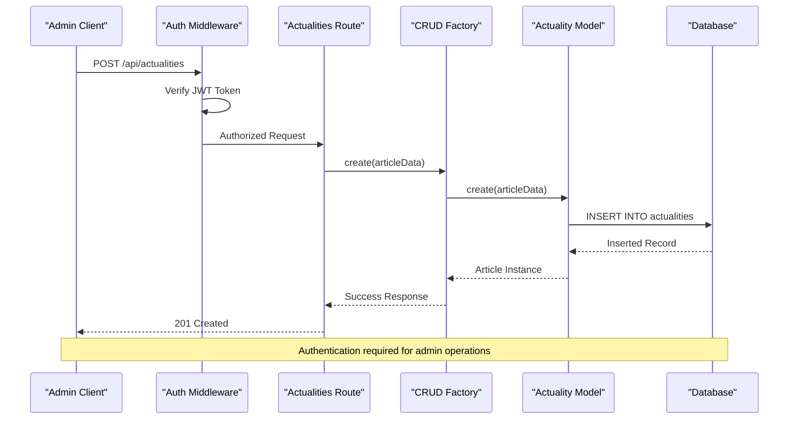

**Diagram sources**
- [auth.js:1-50](file://rsf-backend/middleware/auth.js#L1-L50)
- [actualities.js:1-19](file://rsf-backend/routes/actualities.js#L1-L19)
- [crudFactory.js:62-67](file://rsf-backend/controllers/crudFactory.js#L62-L67)

The architecture ensures secure access to administrative operations while providing public access to published content through dedicated endpoints.

**Section sources**
- [auth.js:1-50](file://rsf-backend/middleware/auth.js#L1-L50)
- [server.js:21-28](file://rsf-backend/server.js#L21-L28)

## Detailed Component Analysis

### Actuality Model Structure
The Actuality model provides comprehensive support for news article management with the following key attributes:

| Attribute | Type | Constraints | Description |
|-----------|------|-------------|-------------|
| `id` | INTEGER | PRIMARY KEY, AUTO_INCREMENT | Unique identifier for each article |
| `icon` | STRING(100) | DEFAULT: 'fas fa-newspaper' | Font Awesome icon identifier for article display |
| `title` | STRING(300) | NOT NULL | Headline/title of the news article |
| `category` | STRING(100) | NULLABLE | Category classification for article organization |
| `summary` | TEXT | NOT NULL | Brief description or excerpt for article listings |
| `link_href` | STRING(255) | NULLABLE | Internal link to related page or external URL |
| `published_at` | DATEONLY | NULLABLE | Publication date for scheduling and ordering |
| `is_published` | BOOLEAN | DEFAULT: true | Visibility flag for content management |
| `sort_order` | INTEGER | DEFAULT: 0 | Manual ordering priority for article display |

### CRUD Operations Implementation
The CRUD factory provides standardized operations with enhanced filtering capabilities:

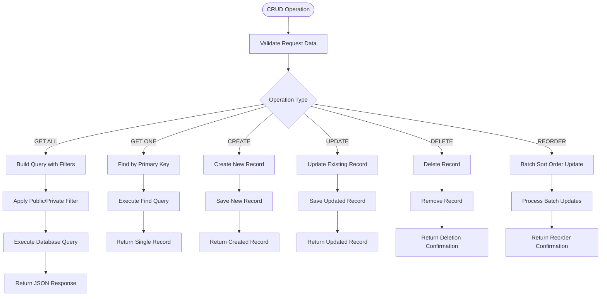

**Diagram sources**
- [crudFactory.js:42-96](file://rsf-backend/controllers/crudFactory.js#L42-L96)

**Section sources**
- [crudFactory.js:1-100](file://rsf-backend/controllers/crudFactory.js#L1-L100)

### Public Content Delivery
The public API endpoint provides filtered access to published content:

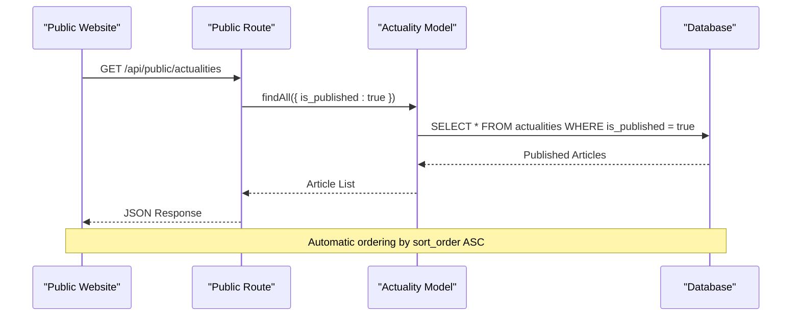

**Diagram sources**
- [public.js:133-143](file://rsf-backend/routes/public.js#L133-L143)

**Section sources**
- [public.js:133-143](file://rsf-backend/routes/public.js#L133-L143)

## API Endpoints Reference

### Administrative Endpoints (Protected)
All administrative endpoints require a valid JWT token:

| Method | Endpoint | Description | Authentication |
|--------|----------|-------------|----------------|
| GET | `/api/actualities` | Retrieve all news articles | JWT Required |
| GET | `/api/actualities/:id` | Get specific article by ID | JWT Required |
| POST | `/api/actualities` | Create new news article | JWT Required |
| PUT | `/api/actualities/:id` | Update existing article | JWT Required |
| DELETE | `/api/actualities/:id` | Delete article permanently | JWT Required |
| PUT | `/api/actualities/reorder` | Update article sort order | JWT Required |

### Public Endpoints
Public endpoints are accessible without authentication:

| Method | Endpoint | Description | Access |
|--------|----------|-------------|--------|
| GET | `/api/public/actualities` | Get published news articles | Public |
| GET | `/api/public/actualities/:id` | Get published article by ID | Public |

### Query Parameters for Filtering
Administrative endpoints support flexible filtering through query parameters:

| Parameter | Type | Description | Example |
|-----------|------|-------------|---------|
| `page` | number | Page number for pagination | `?page=2` |
| `limit` | number | Number of records per page | `?limit=10` |
| `sort` | string | Field to sort by | `?sort=title` |
| `order` | string | Sort direction (`ASC`/`DESC`) | `?order=DESC` |
| `category` | string | Filter by category | `?category=Événement` |
| `is_published` | boolean | Filter by publication status | `?is_published=true` |
| `published_at` | date | Filter by publication date | `?published_at=2025-01-15` |

**Section sources**
- [actualities.js:11-16](file://rsf-backend/routes/actualities.js#L11-L16)
- [public.js:133-143](file://rsf-backend/routes/public.js#L133-L143)
- [crudFactory.js:16-31](file://rsf-backend/controllers/crudFactory.js#L16-L31)

## Content Management Workflows

### Article Creation Workflow
The article creation process involves several validation and processing steps:

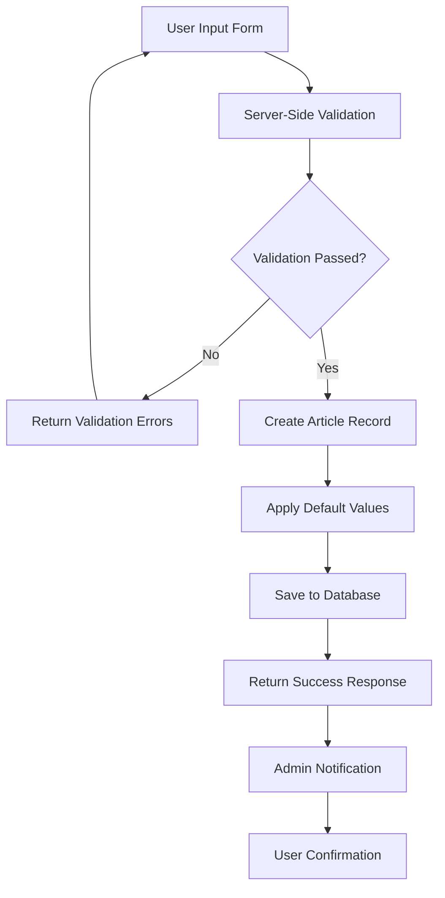

**Diagram sources**
- [validate.js:1-22](file://rsf-backend/middleware/validate.js#L1-L22)
- [crudFactory.js:62-67](file://rsf-backend/controllers/crudFactory.js#L62-L67)

### Publication Management
The publication workflow supports both immediate and scheduled publishing:

| Status | Description | Impact |
|--------|-------------|---------|
| `is_published: true` | Article visible on public site | Appears in `/api/public/actualities` |
| `is_published: false` | Article hidden from public | Not returned by public endpoint |
| `published_at: null` | No scheduled publication date | Published immediately if `is_published: true` |
| `published_at: YYYY-MM-DD` | Scheduled publication date | Published automatically on specified date |

### Featured Content Management
While the Actuality model doesn't have a dedicated `is_featured` field, the `sort_order` field serves as the primary mechanism for content prioritization and manual curation.

**Section sources**
- [Actuality.js:12-14](file://rsf-backend/models/Actuality.js#L12-L14)
- [crudFactory.js:42-52](file://rsf-backend/controllers/crudFactory.js#L42-L52)

## Image Handling for News Articles
The current Actuality model does not include a dedicated image field. However, the admin interface provides flexibility for content presentation:

### Current Image Handling Approach
- **Icon Field**: Uses Font Awesome icon identifiers for visual representation
- **Link Field**: Supports internal page links for article navigation
- **External Images**: Can be embedded within the `summary` field using HTML markup

### Recommended Image Implementation
For enhanced image support, consider extending the model with:

| Field | Type | Purpose | Implementation |
|-------|------|---------|----------------|
| `image_url` | STRING(255) | Primary article image | Store CDN/public URL |
| `image_alt` | STRING(255) | Alt text for accessibility | SEO optimization |
| `thumbnail_url` | STRING(255) | Thumbnail for listings | Responsive display |
| `image_caption` | TEXT | Image description | Enhanced UX |

### Image Upload Integration
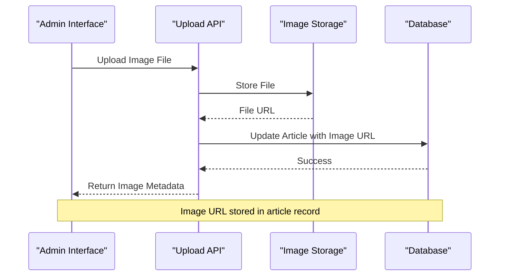

**Section sources**
- [admin-actualites.html:125-137](file://rsf-admin/rsf-admin/admin-actualites.html#L125-L137)
- [admin-actualites.html:88-100](file://rsf-front/src/app/admin/admin-actualites/admin-actualites.html#L88-L100)

## SEO and Publication Features

### Built-in SEO Elements
The Actuality model includes several fields optimized for search engine optimization:

| Field | SEO Benefit | Implementation |
|-------|-------------|----------------|
| `title` | Primary page title | Used as headline in listings |
| `summary` | Meta description | Provides article preview |
| `category` | Content categorization | Improves navigation and indexing |
| `published_at` | Freshness signal | Helps search ranking |
| `link_href` | Internal linking | Supports site architecture |

### Publication Scheduling
The `published_at` field enables sophisticated content scheduling:

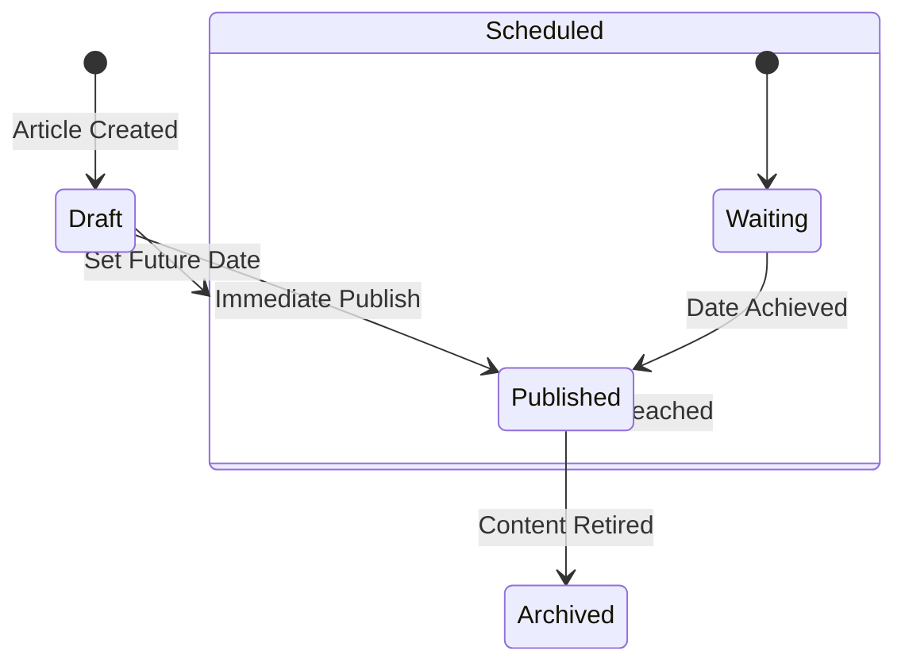

**Diagram sources**
- [Actuality.js:12](file://rsf-backend/models/Actuality.js#L12)

### Content Organization
Categories provide semantic structure for content organization and discovery:

| Category Type | Use Case | Benefits |
|---------------|----------|----------|
| `Événement` | Upcoming events | Calendar integration potential |
| `Actualité` | News articles | RSS feed generation |
| `Projet` | Ongoing projects | Long-term content strategy |
| `Partenaire` | Partner spotlight | Community building |

**Section sources**
- [Actuality.js:8-10](file://rsf-backend/models/Actuality.js#L8-L10)

## Category Organization
The category system provides flexible content classification and filtering capabilities.

### Category-Based Filtering
Administrative endpoints support category filtering through query parameters:

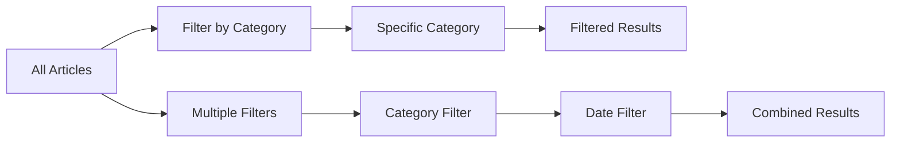

**Diagram sources**
- [crudFactory.js:16-31](file://rsf-backend/controllers/crudFactory.js#L16-L31)

### Category Management Best Practices
- Use consistent naming conventions across all articles
- Limit categories to prevent content fragmentation
- Regularly review and consolidate unused categories
- Consider hierarchical categories for complex content structures

**Section sources**
- [crudFactory.js:44-48](file://rsf-backend/controllers/crudFactory.js#L44-L48)

## Validation Rules and Error Handling

### Server-Side Validation
The API implements comprehensive validation at multiple levels:

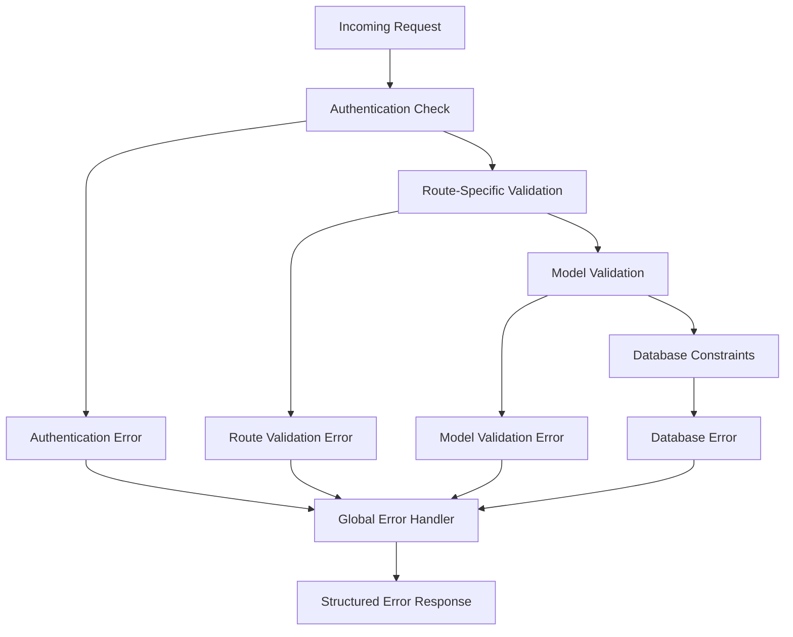

**Diagram sources**
- [validate.js:9-19](file://rsf-backend/middleware/validate.js#L9-L19)
- [errorHandler.js:4-28](file://rsf-backend/middleware/errorHandler.js#L4-L28)

### Error Response Format
All error responses follow a consistent JSON structure:

| Field | Type | Description |
|-------|------|-------------|
| `success` | boolean | Indicates operation failure |
| `message` | string | Human-readable error description |
| `errors` | array | Detailed validation errors (optional) |

### Common Validation Scenarios
- **Required Fields**: `title` and `summary` are mandatory
- **Type Validation**: Ensures proper data types for each field
- **Range Validation**: Limits string lengths and numeric ranges
- **Unique Constraints**: Prevents duplicate entries where applicable

**Section sources**
- [validate.js:1-22](file://rsf-backend/middleware/validate.js#L1-L22)
- [errorHandler.js:1-38](file://rsf-backend/middleware/errorHandler.js#L1-L38)

## Integration with Public Website

### Frontend Integration Points
The API integrates seamlessly with both admin and public interfaces:

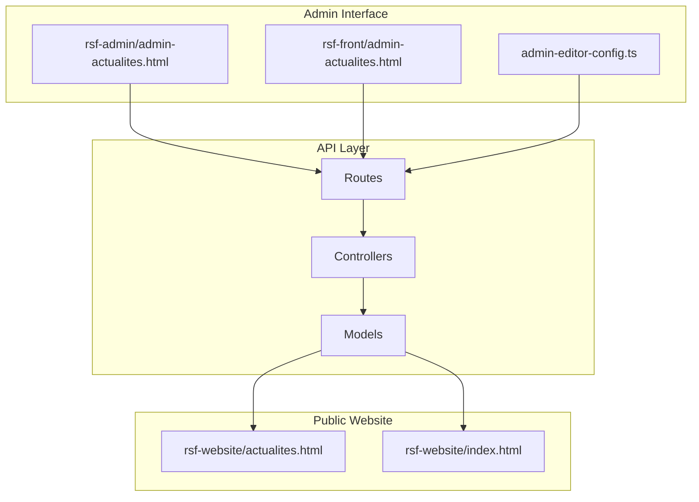

**Diagram sources**
- [index.js:22](file://rsf-backend/routes/index.js#L22)
- [public.js:133-143](file://rsf-backend/routes/public.js#L133-L143)

### Data Synchronization
The public website receives real-time updates through the `/api/public/actualities` endpoint, ensuring content consistency across all platforms.

### Responsive Content Display
The admin interface supports responsive design patterns that adapt to various screen sizes and devices, providing optimal content management experiences.

**Section sources**
- [admin-actualites.html:125-137](file://rsf-admin/rsf-admin/admin-actualites.html#L125-L137)
- [admin-actualites.html:88-100](file://rsf-front/src/app/admin/admin-actualites/admin-actualites.html#L88-L100)
- [admin-editor-config.ts:355-363](file://rsf-front/src/app/admin/admin-editor-config.ts#L355-L363)

## Performance Considerations
The API is designed with performance optimization in mind through several key mechanisms:

### Database Optimization
- **Indexing**: Strategic indexing on frequently queried fields
- **Connection Pooling**: Efficient database connection management
- **Query Optimization**: Minimized queries through bulk operations

### Caching Strategies
- **Static Assets**: Dedicated static file serving for images and assets
- **Response Caching**: Potential for implementing caching layers
- **Database Query Caching**: Opportunities for read-heavy operation caching

### Scalability Features
- **Modular Architecture**: Easy to scale individual components
- **Database Abstraction**: Support for multiple database dialects
- **Middleware Pattern**: Extensible request processing pipeline

## Troubleshooting Guide

### Common Issues and Solutions

#### Authentication Problems
**Symptoms**: 401 Unauthorized responses from protected endpoints
**Causes**: Missing or invalid JWT tokens
**Solutions**: 
- Verify token validity and expiration
- Check token format (Bearer prefix required)
- Confirm user account status

#### Validation Errors
**Symptoms**: 422 Unprocessable Entity responses
**Common Causes**: Missing required fields, invalid data types
**Solutions**:
- Review validation rules for required fields
- Check data type compatibility
- Validate against model constraints

#### Database Connection Issues
**Symptoms**: Application startup failures or database errors
**Causes**: Incorrect database configuration
**Solutions**:
- Verify database credentials and connection string
- Check database availability and network connectivity
- Review supported database dialects

### Debugging Tools
The development environment includes comprehensive logging and error reporting capabilities to facilitate troubleshooting and monitoring.

**Section sources**
- [auth.js:10-33](file://rsf-backend/middleware/auth.js#L10-L33)
- [errorHandler.js:4-28](file://rsf-backend/middleware/errorHandler.js#L4-L28)
- [database.js:31-66](file://rsf-backend/config/database.js#L31-L66)

## Conclusion
The News and Activities API provides a robust foundation for managing news articles and activities with comprehensive content management capabilities. Its modular architecture, strong validation systems, and flexible filtering options make it suitable for various content management scenarios while maintaining excellent performance and scalability characteristics.

The API's design supports both immediate publication needs and future enhancements, including potential image handling improvements and advanced SEO features. The integration with both admin and public interfaces ensures seamless content management and delivery across all platform touchpoints.