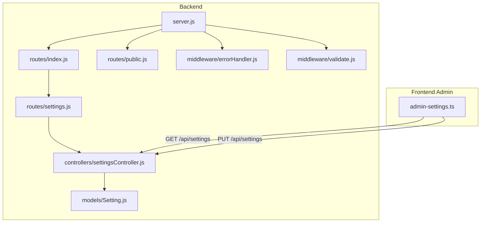
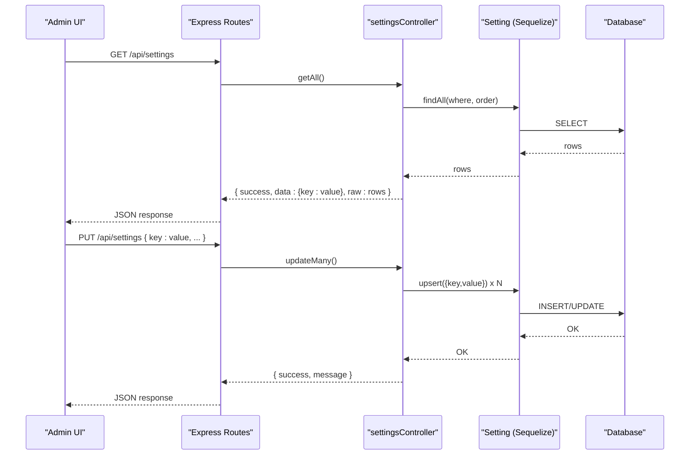
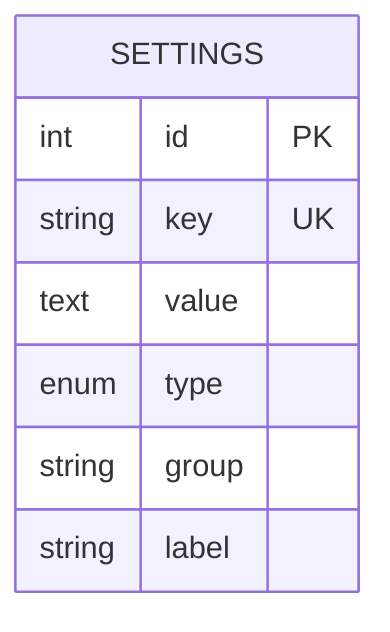
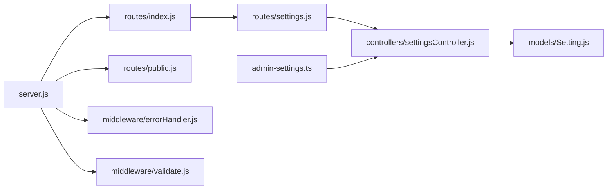
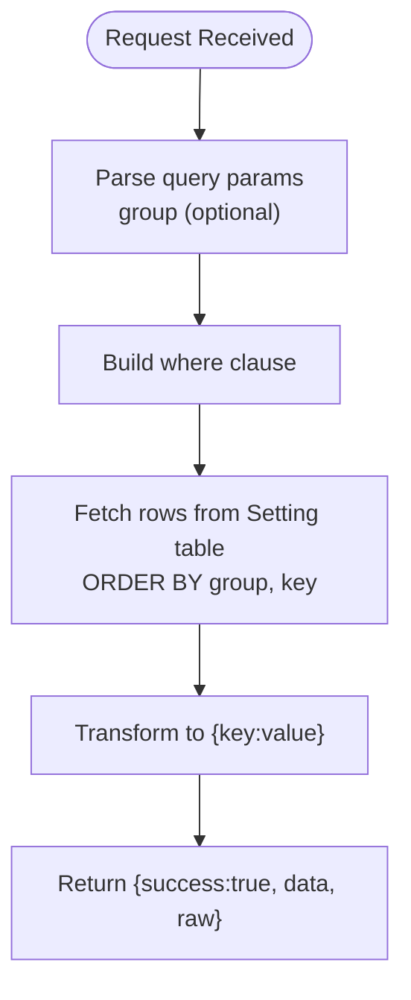
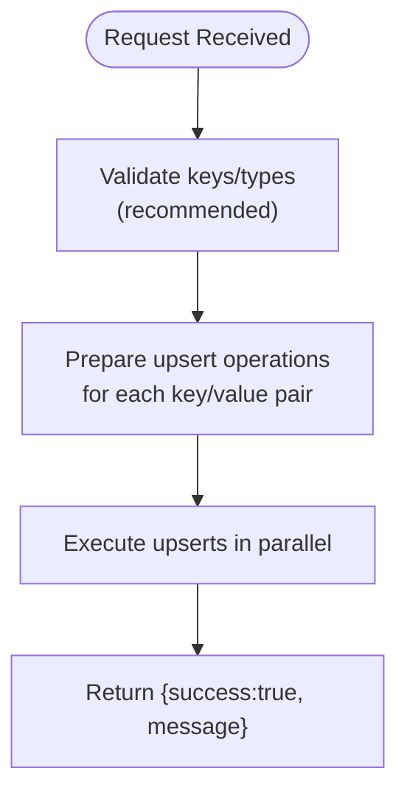

# Settings Management API

<cite>
**Referenced Files in This Document**
- [server.js](file://rsf-backend/server.js)
- [routes/index.js](file://rsf-backend/routes/index.js)
- [routes/settings.js](file://rsf-backend/routes/settings.js)
- [controllers/settingsController.js](file://rsf-backend/controllers/settingsController.js)
- [models/Setting.js](file://rsf-backend/models/Setting.js)
- [routes/public.js](file://rsf-backend/routes/public.js)
- [middleware/errorHandler.js](file://rsf-backend/middleware/errorHandler.js)
- [middleware/validate.js](file://rsf-backend/middleware/validate.js)
- [admin-settings.ts](file://rsf-front/src/app/admin/admin-settings/admin-settings.ts)
</cite>

## Table of Contents
1. [Introduction](#introduction)
2. [Project Structure](#project-structure)
3. [Core Components](#core-components)
4. [Architecture Overview](#architecture-overview)
5. [Detailed Component Analysis](#detailed-component-analysis)
6. [Dependency Analysis](#dependency-analysis)
7. [Performance Considerations](#performance-considerations)
8. [Troubleshooting Guide](#troubleshooting-guide)
9. [Conclusion](#conclusion)
10. [Appendices](#appendices)

## Introduction
This document describes the Settings Management API that powers global configuration and site-wide parameters for the application. It covers the Setting model structure, API endpoints for retrieving and updating configuration values, data validation and type safety, and the relationship between settings and application behavior. It also outlines security considerations and provides guidance for backup and restore procedures.

## Project Structure
The settings subsystem spans backend routes, controller, model, middleware, and the frontend admin interface:
- Backend routes expose protected and public endpoints for settings.
- The controller implements batch retrieval and batch update operations.
- The Setting model defines the schema and categories for configuration keys.
- Public routes expose settings for the frontend website.
- Middleware handles validation and error responses.
- The Angular admin component manages settings editing and submission.

**Diagram sources**
- [server.js:1-84](file://rsf-backend/server.js#L1-L84)
- [routes/index.js:1-28](file://rsf-backend/routes/index.js#L1-L28)
- [routes/settings.js:1-9](file://rsf-backend/routes/settings.js#L1-L9)
- [controllers/settingsController.js:1-28](file://rsf-backend/controllers/settingsController.js#L1-L28)
- [models/Setting.js:1-16](file://rsf-backend/models/Setting.js#L1-L16)
- [routes/public.js:1-201](file://rsf-backend/routes/public.js#L1-L201)
- [middleware/errorHandler.js:1-38](file://rsf-backend/middleware/errorHandler.js#L1-L38)
- [middleware/validate.js:1-22](file://rsf-backend/middleware/validate.js#L1-L22)
- [admin-settings.ts:1-389](file://rsf-front/src/app/admin/admin-settings/admin-settings.ts#L1-L389)

**Section sources**
- [server.js:1-84](file://rsf-backend/server.js#L1-L84)
- [routes/index.js:1-28](file://rsf-backend/routes/index.js#L1-L28)
- [routes/settings.js:1-9](file://rsf-backend/routes/settings.js#L1-L9)
- [controllers/settingsController.js:1-28](file://rsf-backend/controllers/settingsController.js#L1-L28)
- [models/Setting.js:1-16](file://rsf-backend/models/Setting.js#L1-L16)
- [routes/public.js:1-201](file://rsf-backend/routes/public.js#L1-L201)
- [middleware/errorHandler.js:1-38](file://rsf-backend/middleware/errorHandler.js#L1-L38)
- [middleware/validate.js:1-22](file://rsf-backend/middleware/validate.js#L1-L22)
- [admin-settings.ts:1-389](file://rsf-front/src/app/admin/admin-settings/admin-settings.ts#L1-L389)

## Core Components
- Setting model: Defines configuration keys, values, types, groups, and labels. Keys are unique and indexed.
- Protected settings endpoints:
  - GET /api/settings: Retrieve all settings or filter by group.
  - PUT /api/settings: Batch update settings via upsert.
- Public settings endpoint:
  - GET /api/public/settings: Retrieve settings transformed for the frontend, parsing JSON values safely.
- Frontend admin component:
  - Loads settings, converts editor values to API-safe values, validates JSON, and submits updates.

**Section sources**
- [models/Setting.js:1-16](file://rsf-backend/models/Setting.js#L1-L16)
- [controllers/settingsController.js:1-28](file://rsf-backend/controllers/settingsController.js#L1-L28)
- [routes/public.js:175-186](file://rsf-backend/routes/public.js#L175-L186)
- [admin-settings.ts:277-388](file://rsf-front/src/app/admin/admin-settings/admin-settings.ts#L277-L388)

## Architecture Overview
The settings API follows a layered architecture:
- HTTP layer: Express routes register GET and PUT handlers.
- Controller layer: Implements business logic for retrieval and batch updates.
- Data access layer: Uses Sequelize to query and upsert settings.
- Presentation layer: Admin UI formats values per type and sends validated payloads.

**Diagram sources**
- [routes/settings.js:1-9](file://rsf-backend/routes/settings.js#L1-L9)
- [controllers/settingsController.js:1-28](file://rsf-backend/controllers/settingsController.js#L1-L28)
- [models/Setting.js:1-16](file://rsf-backend/models/Setting.js#L1-L16)

## Detailed Component Analysis

### Setting Model
The Setting model defines the schema for global configuration:
- Fields:
  - id: integer, primary key
  - key: string (unique), used as the configuration identifier
  - value: text, stored as string; parsed to native types on retrieval
  - type: enum with allowed values text, number, boolean, color, json
  - group: string with default general; supports appearance, contact, footer, nav
  - label: optional human-readable label derived from key
- Indexes:
  - Unique index on key ensures no duplicate configuration keys.

**Diagram sources**
- [models/Setting.js:6-13](file://rsf-backend/models/Setting.js#L6-L13)

**Section sources**
- [models/Setting.js:1-16](file://rsf-backend/models/Setting.js#L1-L16)

### API Endpoints

- GET /api/settings
  - Optional query parameter: group (string)
  - Returns success flag, a flat object mapping key to value, and raw rows for admin UI.
  - Sorting: by group ascending, then by key ascending.

- PUT /api/settings
  - Request body: object mapping key to value
  - Performs batch upsert of settings; returns success and message.

- GET /api/public/settings
  - Returns success flag and a flat object mapping key to value.
  - Values are parsed to JSON when applicable; otherwise returned as stored.

Example requests and responses:
- GET /api/settings
  - Query: none or group=contact
  - Response: { success: true, data: { key: value, ... }, raw: [...] }

- PUT /api/settings
  - Body: { key1: value1, key2: value2 }
  - Response: { success: true, message: "Paramètres enregistrés." }

- GET /api/public/settings
  - Response: { success: true, data: { key: valueParsed, ... } }

Notes:
- Group filtering is supported on the protected endpoint.
- The public endpoint does not support group filtering.

**Section sources**
- [controllers/settingsController.js:4-14](file://rsf-backend/controllers/settingsController.js#L4-L14)
- [controllers/settingsController.js:16-25](file://rsf-backend/controllers/settingsController.js#L16-L25)
- [routes/public.js:175-186](file://rsf-backend/routes/public.js#L175-L186)
- [routes/settings.js:1-9](file://rsf-backend/routes/settings.js#L1-L9)

### Data Validation and Type Safety
- Controller-level validation:
  - The controller performs batch upserts without explicit per-field validation. Validation middleware exists but is not attached to these routes.
- Frontend validation:
  - The admin component converts editor values to API-safe values:
    - boolean: serialized to "true"/"false"
    - number: serialized to string representation
    - json: validates and normalizes JSON; rejects invalid JSON with an error
    - text/color: treated as strings
- Public retrieval:
  - Values are parsed back to native types when appropriate (JSON arrays/objects), with safe fallback to original string on parse failure.

Recommendations:
- Add express-validator rules for keys, types, and values on the protected endpoint.
- Enforce allowed types per key in the controller or middleware.

**Section sources**
- [middleware/validate.js:1-22](file://rsf-backend/middleware/validate.js#L1-L22)
- [controllers/settingsController.js:16-25](file://rsf-backend/controllers/settingsController.js#L16-L25)
- [routes/public.js:17-36](file://rsf-backend/routes/public.js#L17-L36)
- [admin-settings.ts:336-379](file://rsf-front/src/app/admin/admin-settings/admin-settings.ts#L336-L379)

### Caching Mechanisms
- No explicit caching layer is implemented for settings in the backend.
- The public endpoint returns values directly from the database, with JSON parsing performed per request.
- Recommendation:
  - Introduce an in-memory cache (e.g., LRU) keyed by group or globally, with TTL and refresh on write.
  - Invalidate cache entries on successful PUT to /api/settings.

**Section sources**
- [controllers/settingsController.js:4-14](file://rsf-backend/controllers/settingsController.js#L4-L14)
- [routes/public.js:175-186](file://rsf-backend/routes/public.js#L175-L186)

### Relationship Between Settings and Application Behavior
- Global parameters:
  - Site-wide labels, contact info, and flags are exposed via GET /api/public/settings.
- Navigation:
  - Navigation items are managed separately via the nav endpoint; settings influence grouping and presentation.
- Admin-only updates:
  - Only authenticated administrators can modify settings via PUT /api/settings.

**Section sources**
- [routes/public.js:175-198](file://rsf-backend/routes/public.js#L175-L198)
- [routes/index.js:13-25](file://rsf-backend/routes/index.js#L13-L25)

### Security Considerations
- Authentication:
  - The settings routes are mounted after JWT authentication middleware, ensuring only authorized users can update settings.
- Authorization:
  - The route registration occurs under the authenticated router; enforce role-based checks if sensitive keys require elevated permissions.
- Data exposure:
  - Avoid exposing sensitive configuration values in public endpoints; currently, only GET /api/public/settings is public.
- Input sanitization:
  - Add strict validation for keys, types, and values to prevent injection and malformed data.

**Section sources**
- [routes/index.js:13-25](file://rsf-backend/routes/index.js#L13-L25)
- [middleware/errorHandler.js:1-38](file://rsf-backend/middleware/errorHandler.js#L1-L38)

### Backup and Restore Procedures
- Database-level backup:
  - For SQLite, back up the database file.
  - For MySQL/MariaDB/PostgreSQL, use vendor-native backup tools.
- Export settings:
  - Use GET /api/settings to export current configuration as a flat object.
- Import settings:
  - Use PUT /api/settings to bulk apply exported configuration.
- Seed and reset:
  - The database check script supports reset and seeding; use cautiously in development.

**Section sources**
- [routes/public.js:175-186](file://rsf-backend/routes/public.js#L175-L186)
- [controllers/settingsController.js:16-25](file://rsf-backend/controllers/settingsController.js#L16-L25)
- [scripts/checkDatabase.js:247-254](file://rsf-backend/scripts/checkDatabase.js#L247-L254)

## Dependency Analysis

**Diagram sources**
- [server.js:1-84](file://rsf-backend/server.js#L1-L84)
- [routes/index.js:1-28](file://rsf-backend/routes/index.js#L1-L28)
- [routes/settings.js:1-9](file://rsf-backend/routes/settings.js#L1-L9)
- [controllers/settingsController.js:1-28](file://rsf-backend/controllers/settingsController.js#L1-L28)
- [models/Setting.js:1-16](file://rsf-backend/models/Setting.js#L1-L16)
- [routes/public.js:1-201](file://rsf-backend/routes/public.js#L1-L201)
- [middleware/errorHandler.js:1-38](file://rsf-backend/middleware/errorHandler.js#L1-L38)
- [middleware/validate.js:1-22](file://rsf-backend/middleware/validate.js#L1-L22)
- [admin-settings.ts:1-389](file://rsf-front/src/app/admin/admin-settings/admin-settings.ts#L1-L389)

**Section sources**
- [server.js:1-84](file://rsf-backend/server.js#L1-L84)
- [routes/index.js:1-28](file://rsf-backend/routes/index.js#L1-L28)
- [routes/settings.js:1-9](file://rsf-backend/routes/settings.js#L1-L9)
- [controllers/settingsController.js:1-28](file://rsf-backend/controllers/settingsController.js#L1-L28)
- [models/Setting.js:1-16](file://rsf-backend/models/Setting.js#L1-L16)
- [routes/public.js:1-201](file://rsf-backend/routes/public.js#L1-L201)
- [middleware/errorHandler.js:1-38](file://rsf-backend/middleware/errorHandler.js#L1-L38)
- [middleware/validate.js:1-22](file://rsf-backend/middleware/validate.js#L1-L22)
- [admin-settings.ts:1-389](file://rsf-front/src/app/admin/admin-settings/admin-settings.ts#L1-L389)

## Performance Considerations
- Current behavior:
  - Batch updates use Promise.all to upsert multiple keys concurrently.
  - Retrieval returns all settings and transforms to a flat object.
- Recommendations:
  - Add caching for frequent reads (GET /api/public/settings).
  - Paginate or filter settings on the client-side if the dataset grows large.
  - Consider lazy-loading or grouped retrieval by category.

**Section sources**
- [controllers/settingsController.js:16-25](file://rsf-backend/controllers/settingsController.js#L16-L25)
- [controllers/settingsController.js:4-14](file://rsf-backend/controllers/settingsController.js#L4-L14)

## Troubleshooting Guide
- 422 Unprocessable Entity:
  - Occurs when database validation fails (e.g., unique constraint on key).
- 500 Internal Server Error:
  - Generic error response with optional stack trace in non-production environments.
- Validation errors:
  - express-validator middleware returns structured error details with field and message.

Actions:
- Review error responses for field-level messages.
- Verify keys and types match the Setting model definition.
- Confirm authentication and authorization tokens for protected endpoints.

**Section sources**
- [middleware/errorHandler.js:4-28](file://rsf-backend/middleware/errorHandler.js#L4-L28)
- [middleware/validate.js:9-19](file://rsf-backend/middleware/validate.js#L9-L19)

## Conclusion
The Settings Management API provides a compact, extensible mechanism for global configuration. The Setting model’s type and group fields enable organized, typed parameters. While the current implementation lacks explicit validation and caching, it offers a clear path for enhancement: add input validation, introduce caching, and refine error handling. The public endpoint safely parses values for the frontend, while protected endpoints remain secured behind authentication.

## Appendices

### API Definitions

- GET /api/settings
  - Query parameters:
    - group: string (optional)
  - Response:
    - success: boolean
    - data: object { key: value }
    - raw: array of Setting rows

- PUT /api/settings
  - Request body:
    - object { key: value, ... }
  - Response:
    - success: boolean
    - message: string

- GET /api/public/settings
  - Response:
    - success: boolean
    - data: object { key: valueParsed }

**Section sources**
- [controllers/settingsController.js:4-14](file://rsf-backend/controllers/settingsController.js#L4-L14)
- [controllers/settingsController.js:16-25](file://rsf-backend/controllers/settingsController.js#L16-L25)
- [routes/public.js:175-186](file://rsf-backend/routes/public.js#L175-L186)

### Data Flow for Settings Retrieval

**Diagram sources**
- [controllers/settingsController.js:4-14](file://rsf-backend/controllers/settingsController.js#L4-L14)

### Data Flow for Settings Update

**Diagram sources**
- [controllers/settingsController.js:16-25](file://rsf-backend/controllers/settingsController.js#L16-L25)