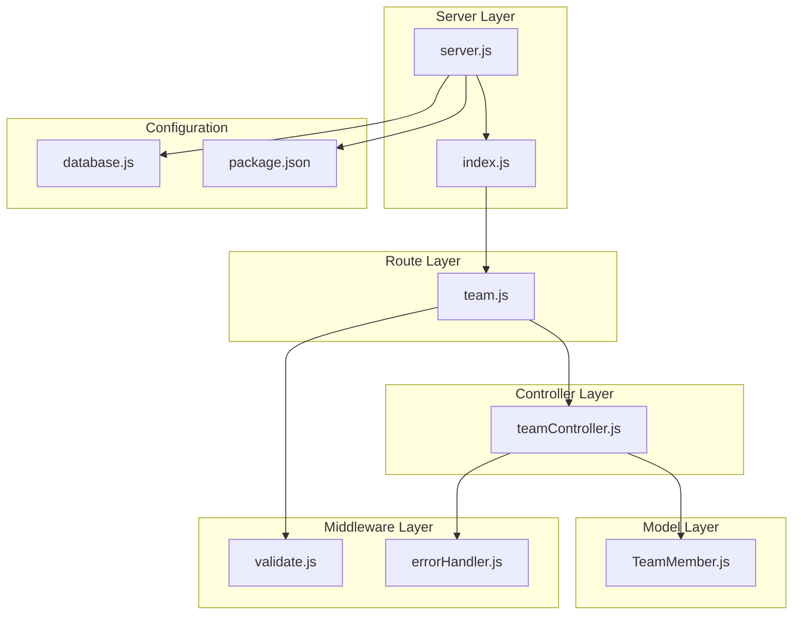
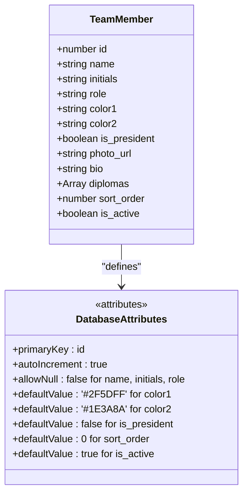
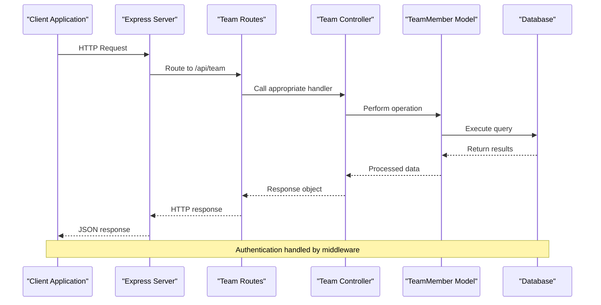
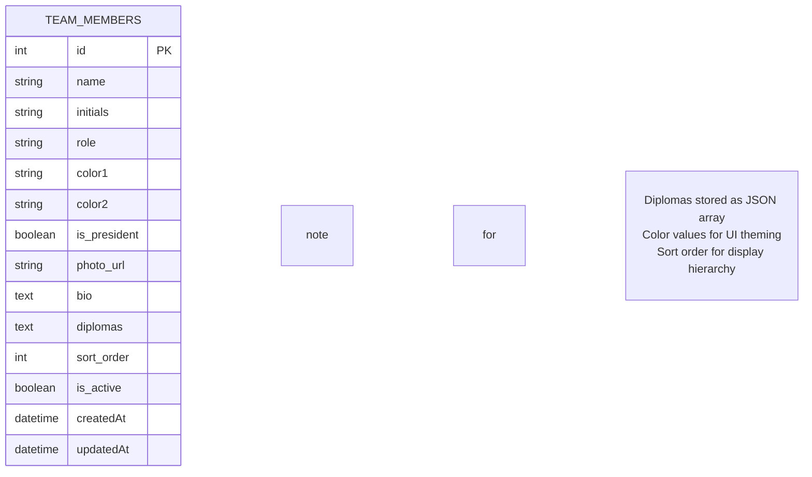
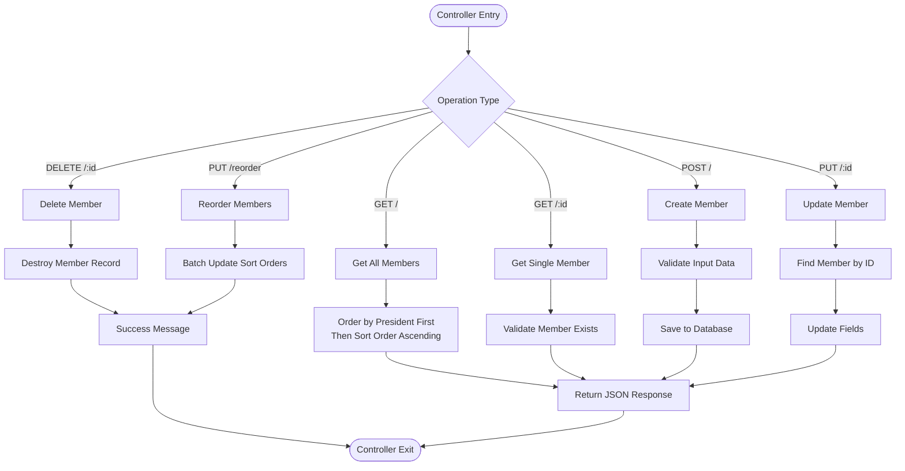
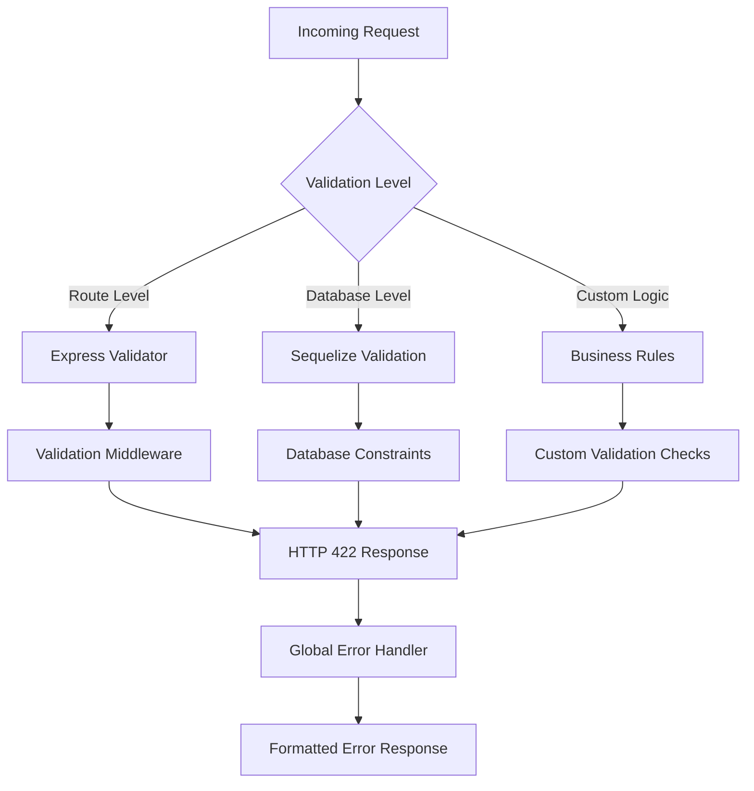
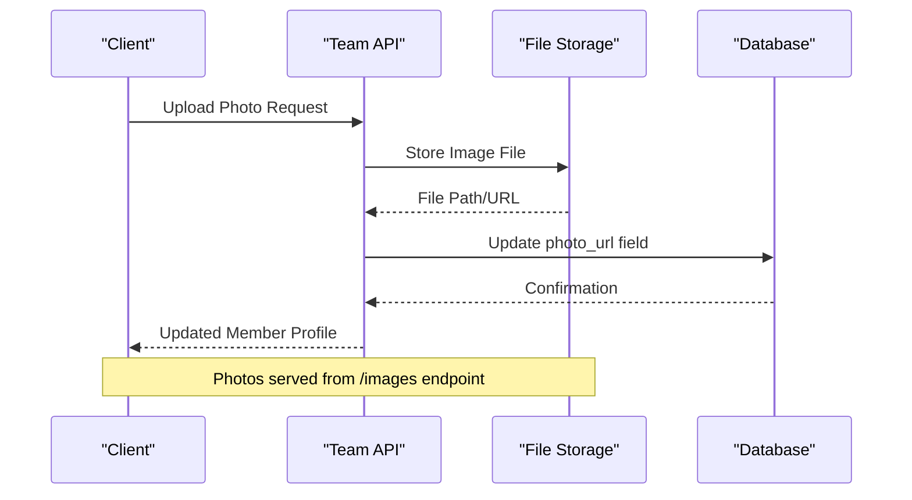
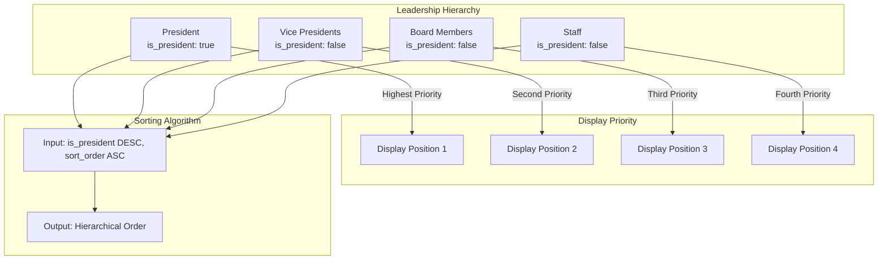
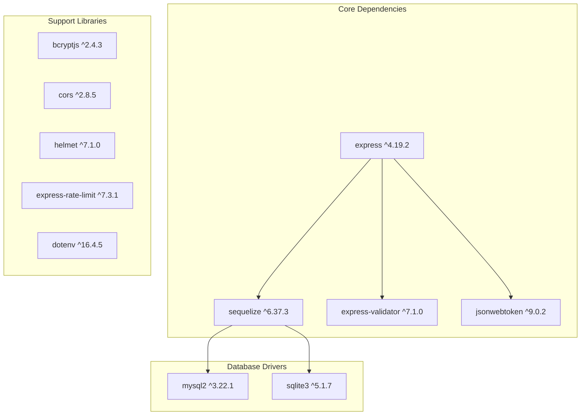
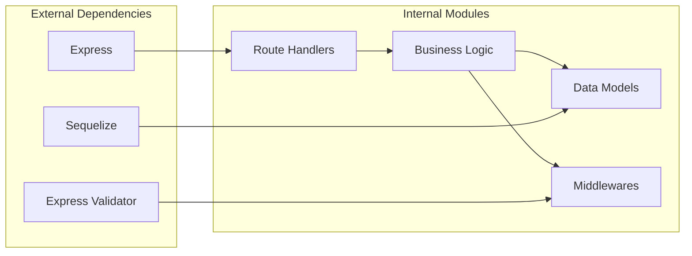

# Team Management API

<cite>
**Referenced Files in This Document**
- [TeamMember.js](file://rsf-backend/models/TeamMember.js)
- [teamController.js](file://rsf-backend/controllers/teamController.js)
- [team.js](file://rsf-backend/routes/team.js)
- [index.js](file://rsf-backend/routes/index.js)
- [validate.js](file://rsf-backend/middleware/validate.js)
- [errorHandler.js](file://rsf-backend/middleware/errorHandler.js)
- [server.js](file://rsf-backend/server.js)
- [database.js](file://rsf-backend/config/database.js)
- [package.json](file://rsf-backend/package.json)
</cite>

## Table of Contents
1. [Introduction](#introduction)
2. [Project Structure](#project-structure)
3. [Core Components](#core-components)
4. [Architecture Overview](#architecture-overview)
5. [Detailed Component Analysis](#detailed-component-analysis)
6. [API Reference](#api-reference)
7. [Data Validation and Image Upload](#data-validation-and-image-upload)
8. [Organizational Structure and Sorting](#organizational-structure-and-sorting)
9. [Dependency Analysis](#dependency-analysis)
10. [Performance Considerations](#performance-considerations)
11. [Troubleshooting Guide](#troubleshooting-guide)
12. [Conclusion](#conclusion)

## Introduction
This document provides comprehensive documentation for the Team Management API, which handles organizational structure and team member profile management for Réseau Solidarité France. The API enables listing team members, retrieving individual profiles, creating/updating team member records, managing organizational hierarchy, and reordering team members for display purposes. It supports image uploads for member photos and provides robust data validation and error handling.

## Project Structure
The Team Management API follows a layered architecture with clear separation of concerns:
- Model layer defines the TeamMember entity and its attributes
- Controller layer implements business logic and data operations
- Route layer exposes REST endpoints under the /api/team namespace
- Middleware layer provides validation and error handling
- Configuration layer manages database connections and environment settings



**Diagram sources**
- [server.js:1-84](file://rsf-backend/server.js#L1-L84)
- [index.js:1-28](file://rsf-backend/routes/index.js#L1-L28)
- [team.js:1-13](file://rsf-backend/routes/team.js#L1-L13)
- [teamController.js:1-57](file://rsf-backend/controllers/teamController.js#L1-L57)
- [TeamMember.js:1-37](file://rsf-backend/models/TeamMember.js#L1-L37)
- [validate.js:1-22](file://rsf-backend/middleware/validate.js#L1-L22)
- [errorHandler.js:1-38](file://rsf-backend/middleware/errorHandler.js#L1-L38)
- [database.js:1-69](file://rsf-backend/config/database.js#L1-L69)
- [package.json:1-34](file://rsf-backend/package.json#L1-L34)

**Section sources**
- [server.js:1-84](file://rsf-backend/server.js#L1-L84)
- [index.js:1-28](file://rsf-backend/routes/index.js#L1-L28)

## Core Components
The Team Management API consists of several key components working together to provide comprehensive team member management capabilities.

### TeamMember Model
The TeamMember model defines the core data structure for team member profiles with the following attributes:
- Unique identifier (auto-incremented integer)
- Personal information (name, initials)
- Professional information (role, color scheme)
- Leadership indicators (president flag)
- Media assets (photo URL)
- Biographical data (biography, diplomas)
- Display preferences (sort order, active status)



**Diagram sources**
- [TeamMember.js:5-36](file://rsf-backend/models/TeamMember.js#L5-L36)

**Section sources**
- [TeamMember.js:1-37](file://rsf-backend/models/TeamMember.js#L1-L37)

### Controller Operations
The team controller implements six primary operations:
- List all team members with hierarchical ordering
- Retrieve individual team member profiles
- Create new team member records
- Update existing team member information
- Delete team member records
- Reorder team members for display

**Section sources**
- [teamController.js:1-57](file://rsf-backend/controllers/teamController.js#L1-L57)

## Architecture Overview
The Team Management API follows RESTful principles with JWT authentication for protected routes. The architecture ensures clean separation between presentation, business logic, and data persistence layers.



**Diagram sources**
- [server.js:32-52](file://rsf-backend/server.js#L32-L52)
- [index.js:13-17](file://rsf-backend/routes/index.js#L13-L17)
- [team.js:5-10](file://rsf-backend/routes/team.js#L5-L10)
- [teamController.js:5-43](file://rsf-backend/controllers/teamController.js#L5-L43)

## Detailed Component Analysis

### Data Model Implementation
The TeamMember model leverages Sequelize ORM with custom getters/setters for complex data types and intelligent defaults for display properties.



**Diagram sources**
- [TeamMember.js:5-36](file://rsf-backend/models/TeamMember.js#L5-L36)

**Section sources**
- [TeamMember.js:15-31](file://rsf-backend/models/TeamMember.js#L15-L31)

### Controller Business Logic
The controller implements comprehensive CRUD operations with proper error handling and response formatting.



**Diagram sources**
- [teamController.js:5-54](file://rsf-backend/controllers/teamController.js#L5-L54)

**Section sources**
- [teamController.js:5-54](file://rsf-backend/controllers/teamController.js#L5-L54)

### Routing Configuration
The routing system provides clean, RESTful endpoints under the /api/team namespace with automatic authentication enforcement.

```mermaid
graph LR
subgraph "API Routes"
Root[/api] --> Team[/team]
subgraph "Team Endpoints"
Team --> GET_ALL[GET / - List All]
Team --> GET_ONE[GET /:id - Get One]
Team --> POST_CREATE[POST / - Create]
Team --> PUT_UPDATE[PUT /:id - Update]
Team --> PUT_REORDER[PUT /reorder - Reorder]
Team --> DELETE_ONE[DELETE /:id - Delete]
end
end
subgraph "Authentication"
Auth[JWT Required] --> Team
end
```

**Diagram sources**
- [index.js:17](file://rsf-backend/routes/index.js#L17)
- [team.js:5-10](file://rsf-backend/routes/team.js#L5-L10)

**Section sources**
- [team.js:1-13](file://rsf-backend/routes/team.js#L1-L13)
- [index.js:13-17](file://rsf-backend/routes/index.js#L13-L17)

## API Reference

### Base URL and Authentication
- Base URL: `/api/team`
- Authentication: JWT required for all endpoints except public routes
- Content-Type: `application/json`

### Endpoint Definitions

#### List All Team Members
**GET** `/api/team/`
- **Description**: Retrieves all team members ordered by leadership hierarchy and display priority
- **Response**: Array of team member objects with pagination metadata
- **Sorting**: President first, then by sort_order ascending

#### Get Individual Team Member
**GET** `/api/team/:id`
- **Description**: Retrieves a specific team member by ID
- **Parameters**: 
  - `id` (integer): Team member identifier
- **Response**: Single team member object

#### Create Team Member
**POST** `/api/team/`
- **Description**: Creates a new team member record
- **Request Body**: Complete team member object (excluding auto-generated fields)
- **Response**: Created team member object with success message

#### Update Team Member
**PUT** `/api/team/:id`
- **Description**: Updates an existing team member's information
- **Parameters**:
  - `id` (integer): Team member identifier
- **Request Body**: Partial team member object with fields to update
- **Response**: Updated team member object

#### Delete Team Member
**DELETE** `/api/team/:id`
- **Description**: Removes a team member from the database
- **Parameters**:
  - `id` (integer): Team member identifier
- **Response**: Success confirmation message

#### Reorder Team Members
**PUT** `/api/team/reorder`
- **Description**: Updates the display order of multiple team members
- **Request Body**: Array of objects containing member ID and new sort order
- **Response**: Success confirmation message

**Section sources**
- [team.js:5-10](file://rsf-backend/routes/team.js#L5-L10)
- [teamController.js:5-54](file://rsf-backend/controllers/teamController.js#L5-L54)

## Data Validation and Image Upload

### Input Validation
The API implements comprehensive validation at multiple levels:



**Diagram sources**
- [validate.js:9-18](file://rsf-backend/middleware/validate.js#L9-L18)
- [errorHandler.js:8-14](file://rsf-backend/middleware/errorHandler.js#L8-L14)

### Validation Features
- **Field Presence**: Required fields validated (name, initials, role)
- **Data Types**: Type checking for all fields
- **Length Constraints**: String length limits enforced
- **Format Validation**: Email and URL format validation
- **Business Rules**: Custom validation logic for domain-specific requirements

### Image Upload Handling
The API supports team member photo uploads through the photo_url field:



**Diagram sources**
- [server.js:29-30](file://rsf-backend/server.js#L29-L30)

**Section sources**
- [validate.js:1-22](file://rsf-backend/middleware/validate.js#L1-L22)
- [errorHandler.js:1-38](file://rsf-backend/middleware/errorHandler.js#L1-L38)
- [server.js:29-30](file://rsf-backend/server.js#L29-L30)

## Organizational Structure and Sorting

### Leadership Hierarchy
The API enforces a clear organizational hierarchy through the is_president flag and sorting mechanism:



**Diagram sources**
- [teamController.js:7](file://rsf-backend/controllers/teamController.js#L7)

### Display Ordering Mechanism
The sorting system combines leadership status with manual ordering:

1. **Primary Sort**: Leadership status (presidents first)
2. **Secondary Sort**: Manual sort order (ascending)
3. **Tertiary Sort**: Automatic ID ordering for ties

**Section sources**
- [teamController.js:7](file://rsf-backend/controllers/teamController.js#L7)
- [TeamMember.js:32](file://rsf-backend/models/TeamMember.js#L32)

## Dependency Analysis

### External Dependencies
The Team Management API relies on several key external libraries:



**Diagram sources**
- [package.json:16-28](file://rsf-backend/package.json#L16-L28)

### Internal Dependencies
The system exhibits clean dependency management with minimal coupling between components.



**Diagram sources**
- [server.js:12-16](file://rsf-backend/server.js#L12-L16)
- [index.js:4](file://rsf-backend/routes/index.js#L4)

**Section sources**
- [package.json:16-28](file://rsf-backend/package.json#L16-L28)
- [server.js:12-16](file://rsf-backend/server.js#L12-L16)

## Performance Considerations
The Team Management API is designed for optimal performance through several architectural decisions:

### Database Optimization
- **Indexing Strategy**: Primary key indexing on ID field
- **Query Optimization**: Efficient ORDER BY clauses for sorting
- **Connection Pooling**: Configurable pool sizes for concurrent requests
- **Memory Management**: Proper cleanup of database connections

### Caching Opportunities
- **Response Caching**: Potential for caching static team member data
- **Query Result Caching**: Caching frequently accessed team lists
- **Image Caching**: Browser-level caching for member photos

### Scalability Factors
- **Horizontal Scaling**: Stateless design allows load balancing
- **Database Scaling**: Support for multiple database dialects
- **API Rate Limiting**: Built-in protection against abuse

## Troubleshooting Guide

### Common Issues and Solutions

#### Authentication Errors
- **Problem**: 401 Unauthorized responses
- **Cause**: Invalid or missing JWT token
- **Solution**: Ensure proper authentication header format

#### Validation Errors
- **Problem**: 422 Unprocessable Entity responses
- **Cause**: Invalid input data format
- **Solution**: Verify required fields and data types match model definitions

#### Database Connection Issues
- **Problem**: 500 Internal Server errors during database operations
- **Cause**: Database connectivity problems
- **Solution**: Check database credentials and connection string

#### File Upload Problems
- **Problem**: Photo upload failures
- **Cause**: File size limits or unsupported formats
- **Solution**: Ensure files meet size and format requirements

### Error Response Format
All error responses follow a consistent JSON format:
```json
{
  "success": false,
  "message": "Error description",
  "errors": [
    {
      "field": "field_name",
      "message": "Specific error message"
    }
  ]
}
```

**Section sources**
- [errorHandler.js:4-28](file://rsf-backend/middleware/errorHandler.js#L4-L28)
- [validate.js:9-18](file://rsf-backend/middleware/validate.js#L9-L18)

## Conclusion
The Team Management API provides a robust, scalable solution for managing organizational structure and team member profiles. Its clean architecture, comprehensive validation, and flexible data model support various organizational needs while maintaining excellent performance characteristics. The API's modular design facilitates future enhancements and ensures maintainability across different deployment environments.

The implementation demonstrates best practices in RESTful API design, including proper HTTP status codes, consistent response formats, and comprehensive error handling. The integration of database constraints, input validation, and business logic creates a reliable foundation for team management operations.