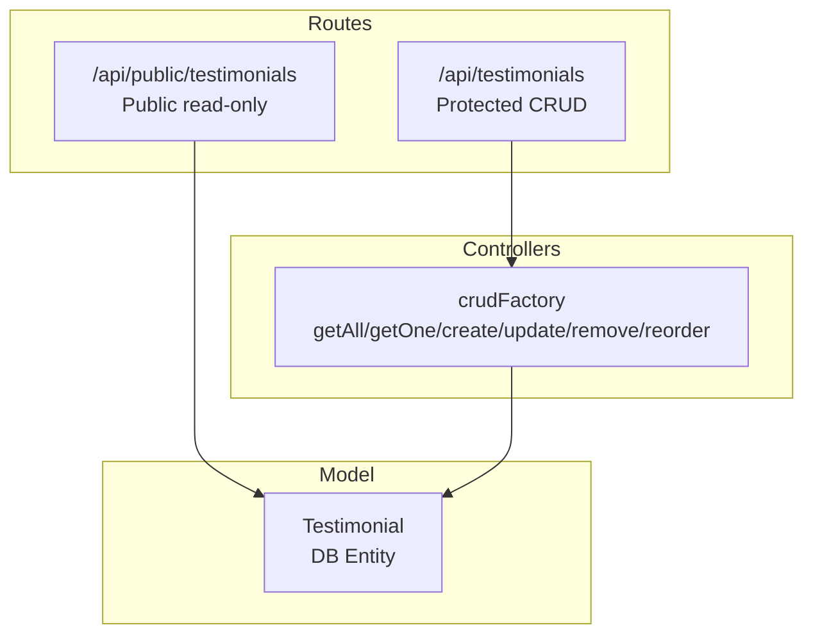
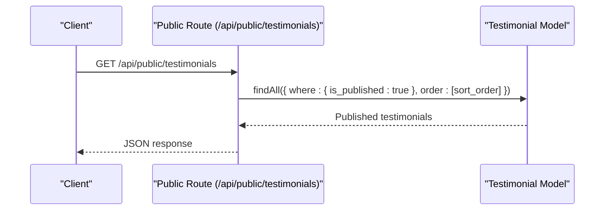
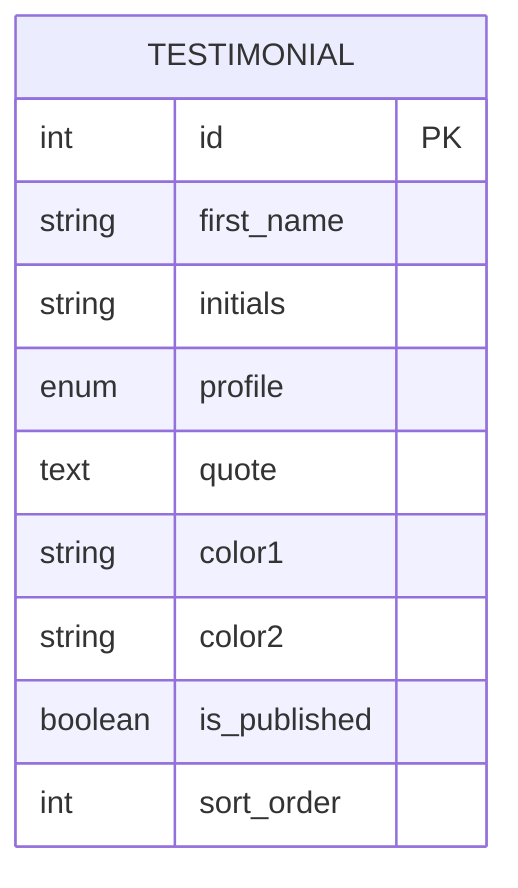
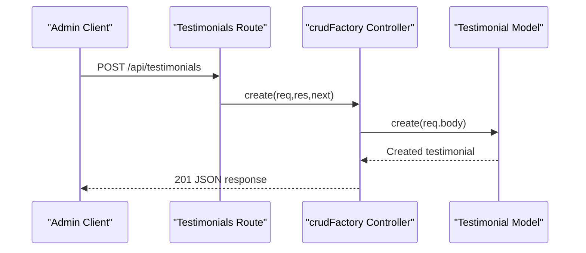
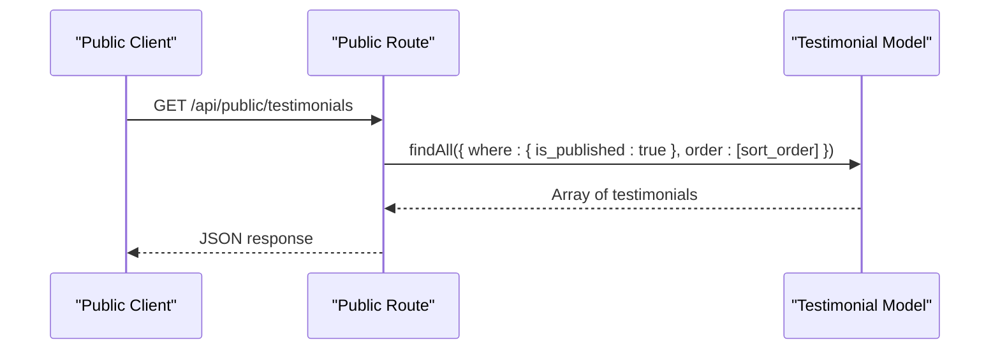
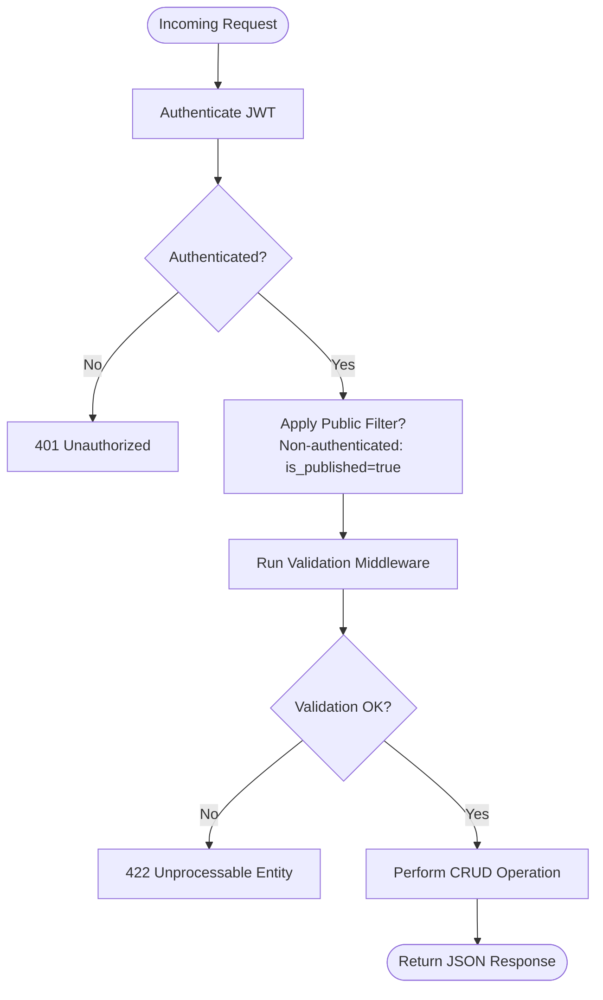
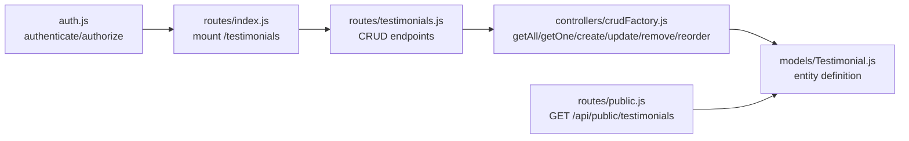

# Testimonial System API

<cite>
**Referenced Files in This Document**
- [Testimonial.js](file://rsf-backend/models/Testimonial.js)
- [testimonials.js](file://rsf-backend/routes/testimonials.js)
- [public.js](file://rsf-backend/routes/public.js)
- [crudFactory.js](file://rsf-backend/controllers/crudFactory.js)
- [validate.js](file://rsf-backend/middleware/validate.js)
- [auth.js](file://rsf-backend/middleware/auth.js)
- [index.js](file://rsf-backend/routes/index.js)
- [seed.js](file://rsf-backend/seeders/seed.js)
</cite>

## Table of Contents
1. [Introduction](#introduction)
2. [Project Structure](#project-structure)
3. [Core Components](#core-components)
4. [Architecture Overview](#architecture-overview)
5. [Detailed Component Analysis](#detailed-component-analysis)
6. [Dependency Analysis](#dependency-analysis)
7. [Performance Considerations](#performance-considerations)
8. [Troubleshooting Guide](#troubleshooting-guide)
9. [Conclusion](#conclusion)

## Introduction
This document describes the Testimonial System API that powers community stories and verification processes for Réseau Solidarité France. It covers the Testimonial model structure, API endpoints for submission and management, public display controls, validation and moderation mechanisms, and integration with user authentication and content moderation workflows.

## Project Structure
The testimonial system spans three main layers:
- Model: Defines the Testimonial entity and its attributes.
- Routes: Exposes CRUD endpoints for testimonials and a public endpoint for retrieving published testimonials.
- Controllers: Provides a generic CRUD factory that handles standard operations with configurable filters and ordering.

**Diagram sources**
- [testimonials.js:1-19](file://rsf-backend/routes/testimonials.js#L1-L19)
- [public.js:108-118](file://rsf-backend/routes/public.js#L108-L118)
- [crudFactory.js:39-96](file://rsf-backend/controllers/crudFactory.js#L39-L96)
- [Testimonial.js:4-15](file://rsf-backend/models/Testimonial.js#L4-L15)

**Section sources**
- [testimonials.js:1-19](file://rsf-backend/routes/testimonials.js#L1-L19)
- [public.js:108-118](file://rsf-backend/routes/public.js#L108-L118)
- [crudFactory.js:39-96](file://rsf-backend/controllers/crudFactory.js#L39-L96)
- [Testimonial.js:4-15](file://rsf-backend/models/Testimonial.js#L4-L15)

## Core Components
- Testimonial Model: Defines the schema for community stories, including author identifiers, profile category, quoted content, visual theming, publication state, and sorting.
- Protected CRUD Routes: Full CRUD operations for administrators and authorized users.
- Public Read Endpoint: Returns only published testimonials ordered by sort priority.
- Generic CRUD Controller: Implements standard operations with configurable filtering and ordering.

Key model attributes:
- Identity: first_name, initials
- Profile: profile (enumerated category)
- Content: quote (long-form text)
- Presentation: color1, color2
- Controls: is_published, sort_order

Validation and middleware:
- Input validation middleware exists for request bodies.
- Authentication middleware secures protected routes.
- Authorization middleware can enforce roles (not currently applied to testimonials).

**Section sources**
- [Testimonial.js:4-15](file://rsf-backend/models/Testimonial.js#L4-L15)
- [testimonials.js:6-9](file://rsf-backend/routes/testimonials.js#L6-L9)
- [public.js:108-118](file://rsf-backend/routes/public.js#L108-L118)
- [crudFactory.js:39-96](file://rsf-backend/controllers/crudFactory.js#L39-L96)
- [validate.js:9-19](file://rsf-backend/middleware/validate.js#L9-L19)
- [auth.js:10-47](file://rsf-backend/middleware/auth.js#L10-L47)

## Architecture Overview
The testimonial API follows a layered architecture:
- Public consumers query published testimonials via a dedicated public endpoint.
- Administrators use protected endpoints to manage testimonials, including reordering and publishing controls.

**Diagram sources**
- [public.js:108-118](file://rsf-backend/routes/public.js#L108-L118)
- [Testimonial.js:13-14](file://rsf-backend/models/Testimonial.js#L13-L14)

**Section sources**
- [public.js:108-118](file://rsf-backend/routes/public.js#L108-L118)
- [index.js:7-8](file://rsf-backend/routes/index.js#L7-L8)

## Detailed Component Analysis

### Testimonial Model
The Testimonial entity defines the shape of stored testimonials, including:
- Author identity: first_name, initials
- Profile classification: profile (enumerated values)
- Story content: quote
- Visual theming: color1, color2
- Publication and ordering: is_published, sort_order

**Diagram sources**
- [Testimonial.js:4-15](file://rsf-backend/models/Testimonial.js#L4-L15)

**Section sources**
- [Testimonial.js:4-15](file://rsf-backend/models/Testimonial.js#L4-L15)

### Protected CRUD Endpoints
The testimonials route exposes standard CRUD operations secured by authentication middleware. The controller applies:
- Ordering by sort_order ascending
- Public filter for non-authenticated requests: only published testimonials are returned

Endpoints:
- GET /api/testimonials: List all testimonials (admin view)
- GET /api/testimonials/:id: Retrieve a specific testimonial
- POST /api/testimonials: Create a new testimonial
- PUT /api/testimonials/reorder: Bulk reorder testimonials
- PUT /api/testimonials/:id: Update a testimonial
- DELETE /api/testimonials/:id: Remove a testimonial

**Diagram sources**
- [testimonials.js:11-16](file://rsf-backend/routes/testimonials.js#L11-L16)
- [crudFactory.js:62-67](file://rsf-backend/controllers/crudFactory.js#L62-L67)
- [Testimonial.js:4-15](file://rsf-backend/models/Testimonial.js#L4-L15)

**Section sources**
- [testimonials.js:1-19](file://rsf-backend/routes/testimonials.js#L1-L19)
- [crudFactory.js:39-96](file://rsf-backend/controllers/crudFactory.js#L39-L96)

### Public Display Endpoint
The public endpoint retrieves only published testimonials, ensuring unauthenticated clients cannot access drafts or pending content.

Endpoint:
- GET /api/public/testimonials: Returns published testimonials ordered by sort_order

**Diagram sources**
- [public.js:108-118](file://rsf-backend/routes/public.js#L108-L118)
- [Testimonial.js:13-14](file://rsf-backend/models/Testimonial.js#L13-L14)

**Section sources**
- [public.js:108-118](file://rsf-backend/routes/public.js#L108-L118)

### Data Validation and Moderation Workflows
- Input validation: A validation middleware checks for express-validator errors and returns structured 422 responses.
- Authentication: Protected endpoints require a valid JWT bearer token; inactive users are rejected.
- Authorization: Role-based access control is available via an authorize helper, though not currently applied to testimonials.
- Publication control: is_published governs visibility for both public and admin views.
- Sorting: sort_order enables manual prioritization of testimonials.

**Diagram sources**
- [auth.js:10-47](file://rsf-backend/middleware/auth.js#L10-L47)
- [validate.js:9-19](file://rsf-backend/middleware/validate.js#L9-L19)
- [testimonials.js:6-9](file://rsf-backend/routes/testimonials.js#L6-L9)
- [crudFactory.js:42-52](file://rsf-backend/controllers/crudFactory.js#L42-L52)

**Section sources**
- [validate.js:9-19](file://rsf-backend/middleware/validate.js#L9-L19)
- [auth.js:10-47](file://rsf-backend/middleware/auth.js#L10-L47)
- [testimonials.js:6-9](file://rsf-backend/routes/testimonials.js#L6-L9)

### Examples

#### Example: Create a Testimonial
- Endpoint: POST /api/testimonials
- Required fields: first_name, initials, quote, profile
- Optional fields: color1, color2, sort_order, is_published
- Response: 201 with created testimonial

Reference path:
- [testimonials.js:13-13](file://rsf-backend/routes/testimonials.js#L13-L13)
- [crudFactory.js:62-67](file://rsf-backend/controllers/crudFactory.js#L62-L67)

#### Example: Approve/Unapprove a Testimonial
- Update is_published to true/false via PUT /api/testimonials/:id
- Non-published testimonials are excluded from public listings

Reference path:
- [Testimonial.js:13-13](file://rsf-backend/models/Testimonial.js#L13-L13)
- [public.js:108-118](file://rsf-backend/routes/public.js#L108-L118)

#### Example: Reorder Testimonials
- POST new sort_order values via PUT /api/testimonials/reorder
- Useful for manual curation of featured stories

Reference path:
- [testimonials.js:14-14](file://rsf-backend/routes/testimonials.js#L14-L14)
- [crudFactory.js:87-95](file://rsf-backend/controllers/crudFactory.js#L87-L95)

#### Example: Public Display Query
- GET /api/public/testimonials returns only published testimonials sorted by sort_order

Reference path:
- [public.js:108-118](file://rsf-backend/routes/public.js#L108-L118)

**Section sources**
- [testimonials.js:11-16](file://rsf-backend/routes/testimonials.js#L11-L16)
- [crudFactory.js:87-95](file://rsf-backend/controllers/crudFactory.js#L87-L95)
- [public.js:108-118](file://rsf-backend/routes/public.js#L108-L118)
- [Testimonial.js:13-14](file://rsf-backend/models/Testimonial.js#L13-L14)

## Dependency Analysis
The testimonial system integrates with:
- Authentication middleware for route protection
- Generic CRUD controller for standardized operations
- Public route handler for controlled exposure
- Model for persistence and filtering

**Diagram sources**
- [index.js:13-20](file://rsf-backend/routes/index.js#L13-L20)
- [testimonials.js:1-19](file://rsf-backend/routes/testimonials.js#L1-L19)
- [crudFactory.js:39-96](file://rsf-backend/controllers/crudFactory.js#L39-L96)
- [Testimonial.js:4-15](file://rsf-backend/models/Testimonial.js#L4-L15)
- [public.js:108-118](file://rsf-backend/routes/public.js#L108-L118)

**Section sources**
- [index.js:13-20](file://rsf-backend/routes/index.js#L13-L20)
- [testimonials.js:1-19](file://rsf-backend/routes/testimonials.js#L1-L19)
- [crudFactory.js:39-96](file://rsf-backend/controllers/crudFactory.js#L39-L96)
- [Testimonial.js:4-15](file://rsf-backend/models/Testimonial.js#L4-L15)
- [public.js:108-118](file://rsf-backend/routes/public.js#L108-L118)

## Performance Considerations
- Sorting: Queries use sort_order to maintain stable ordering; keep updates minimal to avoid frequent re-sort operations.
- Filtering: Public endpoint filters by is_published to reduce payload size for client rendering.
- Pagination: The generic controller supports query parameters (page, limit, offset, sort, order) for scaling future pagination needs.

[No sources needed since this section provides general guidance]

## Troubleshooting Guide
Common issues and resolutions:
- 401 Unauthorized: Missing or invalid JWT token; ensure Authorization header with Bearer token is present and valid.
- 403 Forbidden: Insufficient privileges; verify user role if authorization is enforced.
- 422 Unprocessable Entity: Validation errors; check required fields and data types.
- 404 Not Found: Testimonial ID does not exist; confirm resource ID.
- Unexpected empty public list: Verify is_published flag is set to true.

**Section sources**
- [auth.js:10-47](file://rsf-backend/middleware/auth.js#L10-L47)
- [validate.js:9-19](file://rsf-backend/middleware/validate.js#L9-L19)
- [crudFactory.js:54-58](file://rsf-backend/controllers/crudFactory.js#L54-L58)

## Conclusion
The Testimonial System API provides a robust foundation for managing community stories with clear separation between administrative CRUD operations and public read access. Its design leverages a generic controller, strong publication controls, and straightforward validation pathways to support moderation and quality assurance. Future enhancements could include explicit validation rules for testimonials and optional role-based authorization for sensitive operations.