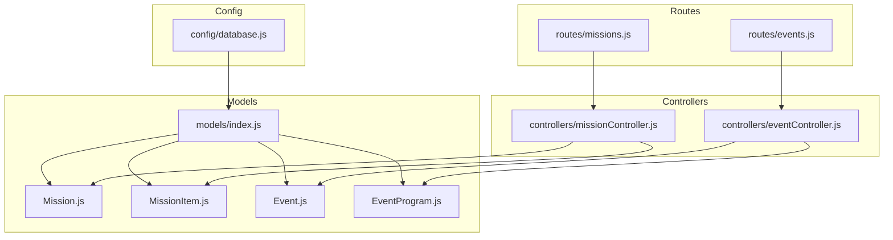
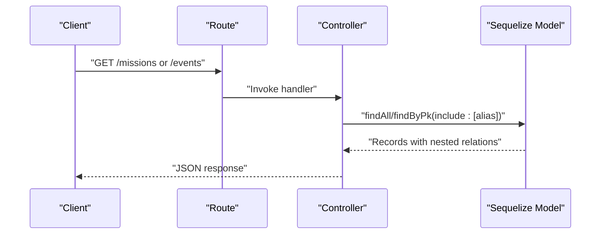
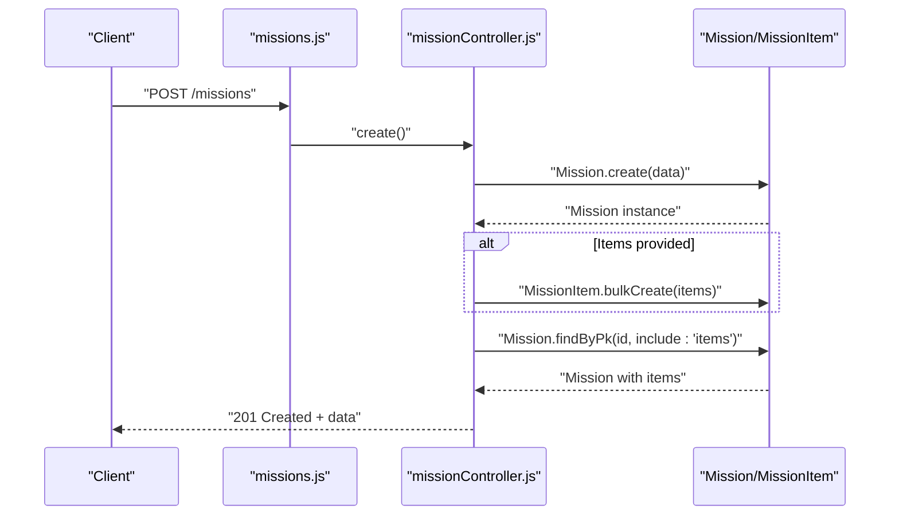
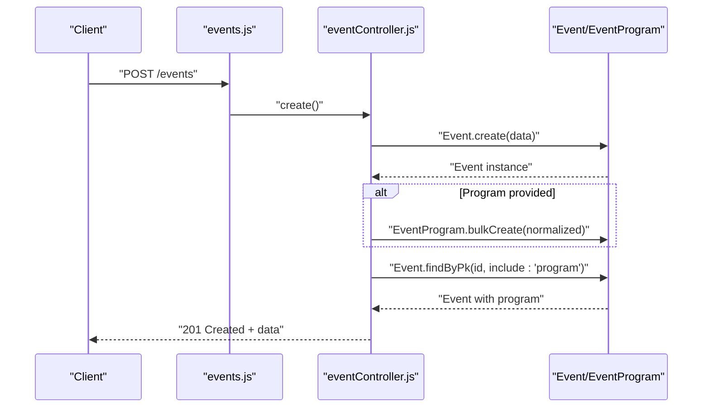
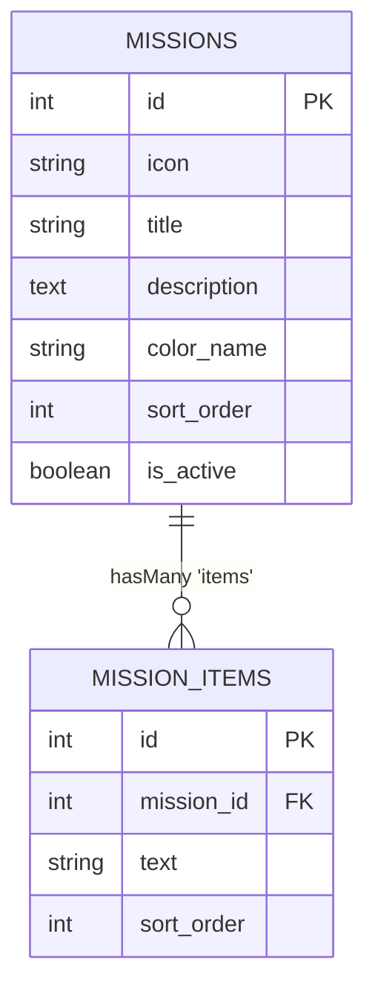
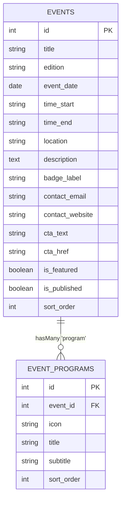
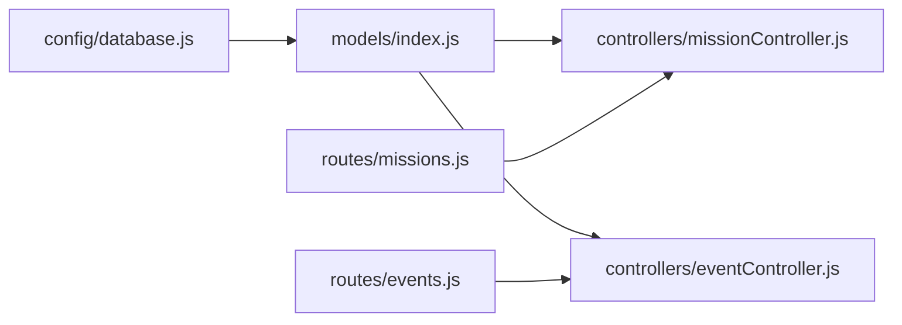

# Association and Relationships

<cite>
**Referenced Files in This Document**
- [models/index.js](file://rsf-backend/models/index.js)
- [models/Mission.js](file://rsf-backend/models/Mission.js)
- [models/MissionItem.js](file://rsf-backend/models/MissionItem.js)
- [models/Event.js](file://rsf-backend/models/Event.js)
- [models/EventProgram.js](file://rsf-backend/models/EventProgram.js)
- [controllers/missionController.js](file://rsf-backend/controllers/missionController.js)
- [controllers/eventController.js](file://rsf-backend/controllers/eventController.js)
- [routes/missions.js](file://rsf-backend/routes/missions.js)
- [routes/events.js](file://rsf-backend/routes/events.js)
- [config/database.js](file://rsf-backend/config/database.js)
</cite>

## Table of Contents
1. [Introduction](#introduction)
2. [Project Structure](#project-structure)
3. [Core Components](#core-components)
4. [Architecture Overview](#architecture-overview)
5. [Detailed Component Analysis](#detailed-component-analysis)
6. [Dependency Analysis](#dependency-analysis)
7. [Performance Considerations](#performance-considerations)
8. [Troubleshooting Guide](#troubleshooting-guide)
9. [Conclusion](#conclusion)

## Introduction
This document explains the Sequelize ORM association patterns and relationship definitions that connect models in the backend. It focuses on:
- Hierarchical mission structures via Mission and MissionItem (hasMany/belongsTo)
- Daily scheduling via Event and EventProgram (hasMany/belongsTo)
- Foreign key constraints and cascade behaviors
- Asynchronous patterns used in controllers and routes
- Association aliases enabling complex queries and data retrieval
- Entity relationship diagrams and performance considerations

## Project Structure
The associations are centrally defined in the models registry and consumed by controllers and routes. The database configuration sets global Sequelize options, including naming conventions and logging.

**Diagram sources**
- [models/index.js:22-31](file://rsf-backend/models/index.js#L22-L31)
- [controllers/missionController.js:1-74](file://rsf-backend/controllers/missionController.js#L1-L74)
- [controllers/eventController.js:1-126](file://rsf-backend/controllers/eventController.js#L1-L126)
- [routes/missions.js:1-13](file://rsf-backend/routes/missions.js#L1-L13)
- [routes/events.js:1-12](file://rsf-backend/routes/events.js#L1-L12)
- [config/database.js:11-21](file://rsf-backend/config/database.js#L11-L21)

**Section sources**
- [models/index.js:22-31](file://rsf-backend/models/index.js#L22-L31)
- [config/database.js:11-21](file://rsf-backend/config/database.js#L11-L21)

## Core Components
- Mission and MissionItem
  - One-to-many: Mission has many MissionItem entries; each MissionItem belongs to a Mission.
  - Alias: Mission -> as: 'items'; MissionItem -> as: 'mission'.
  - Cascade: onDelete: 'CASCADE' ensures deleting a Mission removes its MissionItems.
  - Foreign key: mission_id in MissionItem.
- Event and EventProgram
  - One-to-many: Event has many EventProgram entries; each EventProgram belongs to an Event.
  - Alias: Event -> as: 'program'; EventProgram -> as: 'event'.
  - Cascade: onDelete: 'CASCADE' ensures deleting an Event removes its EventProgram items.
  - Foreign key: event_id in EventProgram.

These associations are declared in the central models registry and leveraged by controllers to fetch related data.

**Section sources**
- [models/index.js:24-30](file://rsf-backend/models/index.js#L24-L30)
- [models/Mission.js:1-16](file://rsf-backend/models/Mission.js#L1-L16)
- [models/MissionItem.js:1-13](file://rsf-backend/models/MissionItem.js#L1-L13)
- [models/Event.js:1-25](file://rsf-backend/models/Event.js#L1-L25)
- [models/EventProgram.js:1-15](file://rsf-backend/models/EventProgram.js#L1-L15)

## Architecture Overview
The runtime flow for retrieving associated data follows a predictable pattern:
- Routes receive requests
- Controllers call model methods with include options using association aliases
- Sequelize executes joins and returns hydrated records with nested relations
- Responses are sent to clients

**Diagram sources**
- [routes/missions.js:5-10](file://rsf-backend/routes/missions.js#L5-L10)
- [routes/events.js:4-9](file://rsf-backend/routes/events.js#L4-L9)
- [controllers/missionController.js:7-22](file://rsf-backend/controllers/missionController.js#L7-L22)
- [controllers/eventController.js:18-39](file://rsf-backend/controllers/eventController.js#L18-L39)

## Detailed Component Analysis

### Mission-MissionItem Associations
- Definition
  - Mission.hasMany(MissionItem, { foreignKey: 'mission_id', as: 'items', onDelete: 'CASCADE' })
  - MissionItem.belongsTo(Mission, { foreignKey: 'mission_id', as: 'mission' })
- Usage in controllers
  - findAll/getOne include 'items' with ordering by sort_order
  - create/update handle bulk creation/deletion of MissionItem entries linked to a Mission
  - delete triggers cascade deletion of MissionItem entries
- Asynchronous patterns
  - Controllers use async/await for all model operations
  - Bulk operations use Promise.all for concurrent updates where applicable
- Aliases and query patterns
  - The 'items' alias enables fetching nested MissionItem entries alongside Mission
  - Ordering by sort_order ensures deterministic presentation

**Diagram sources**
- [routes/missions.js:7](file://rsf-backend/routes/missions.js#L7)
- [controllers/missionController.js:25-35](file://rsf-backend/controllers/missionController.js#L25-L35)
- [models/index.js:24-26](file://rsf-backend/models/index.js#L24-L26)

**Section sources**
- [models/index.js:24-26](file://rsf-backend/models/index.js#L24-L26)
- [controllers/missionController.js:7-22](file://rsf-backend/controllers/missionController.js#L7-L22)
- [controllers/missionController.js:25-51](file://rsf-backend/controllers/missionController.js#L25-L51)
- [controllers/missionController.js:54-61](file://rsf-backend/controllers/missionController.js#L54-L61)

### Event-EventProgram Associations
- Definition
  - Event.hasMany(EventProgram, { foreignKey: 'event_id', as: 'program', onDelete: 'CASCADE' })
  - EventProgram.belongsTo(Event, { foreignKey: 'event_id', as: 'event' })
- Usage in controllers
  - findAll/getOne include 'program' with ordering by sort_order
  - create/update normalize and persist EventProgram entries per Event
  - delete triggers cascade deletion of EventProgram entries
- Asynchronous patterns
  - Controllers use async/await for all model operations
  - Reordering uses Promise.all for concurrent updates
- Aliases and query patterns
  - The 'program' alias enables fetching nested EventProgram entries alongside Event
  - normalizeProgram ensures minimal, valid entries with default values

**Diagram sources**
- [routes/events.js:6](file://rsf-backend/routes/events.js#L6)
- [controllers/eventController.js:42-58](file://rsf-backend/controllers/eventController.js#L42-L58)
- [models/index.js:28-30](file://rsf-backend/models/index.js#L28-L30)

**Section sources**
- [models/index.js:28-30](file://rsf-backend/models/index.js#L28-L30)
- [controllers/eventController.js:16-39](file://rsf-backend/controllers/eventController.js#L16-L39)
- [controllers/eventController.js:42-94](file://rsf-backend/controllers/eventController.js#L42-L94)
- [controllers/eventController.js:96-108](file://rsf-backend/controllers/eventController.js#L96-L108)

### Entity Relationship Diagrams

#### Mission and MissionItem ER

**Diagram sources**
- [models/Mission.js:5-13](file://rsf-backend/models/Mission.js#L5-L13)
- [models/MissionItem.js:5-10](file://rsf-backend/models/MissionItem.js#L5-L10)
- [models/index.js:24-26](file://rsf-backend/models/index.js#L24-L26)

#### Event and EventProgram ER

**Diagram sources**
- [models/Event.js:5-22](file://rsf-backend/models/Event.js#L5-L22)
- [models/EventProgram.js:5-12](file://rsf-backend/models/EventProgram.js#L5-L12)
- [models/index.js:28-30](file://rsf-backend/models/index.js#L28-L30)

### Association Aliases and Complex Queries
- Aliases
  - Mission -> MissionItem: as: 'items'
  - MissionItem -> Mission: as: 'mission'
  - Event -> EventProgram: as: 'program'
  - EventProgram -> Event: as: 'event'
- How they help
  - Controllers pass include: [{ model: RelatedModel, as: 'alias' }] to fetch nested relations
  - Ordering by sort_order ensures consistent presentation
  - Enables composite responses for hierarchical and scheduled content
- Examples in code
  - Mission controller includes 'items' with ordering
  - Event controller includes 'program' with ordering
  - Both controllers return full records with nested relations

**Section sources**
- [controllers/missionController.js:7-22](file://rsf-backend/controllers/missionController.js#L7-L22)
- [controllers/eventController.js:18-39](file://rsf-backend/controllers/eventController.js#L18-L39)

## Dependency Analysis
- Central associations
  - models/index.js defines all associations and exports the registry
- Controllers depend on models and Sequelize APIs
- Routes depend on controllers
- Database configuration influences naming conventions and logging

**Diagram sources**
- [config/database.js:11-21](file://rsf-backend/config/database.js#L11-L21)
- [models/index.js:22-31](file://rsf-backend/models/index.js#L22-L31)
- [routes/missions.js:1-13](file://rsf-backend/routes/missions.js#L1-L13)
- [routes/events.js:1-12](file://rsf-backend/routes/events.js#L1-L12)

**Section sources**
- [models/index.js:22-31](file://rsf-backend/models/index.js#L22-L31)
- [routes/missions.js:1-13](file://rsf-backend/routes/missions.js#L1-L13)
- [routes/events.js:1-12](file://rsf-backend/routes/events.js#L1-L12)

## Performance Considerations
- Use includes judiciously
  - Controllers already include related sets; avoid unnecessary includes to reduce payload size
- Prefer targeted queries
  - Use where conditions and attributes to limit fetched columns
- Batch operations
  - Controllers use bulkCreate and bulkDestroy; leverage Promise.all for concurrent updates (as seen in reordering)
- Indexing and ordering
  - sort_order fields enable efficient client-side ordering; ensure appropriate indexing on frequently filtered/sorted columns
- Logging and diagnostics
  - Development logging helps identify slow queries; consider adding query hints or EXPLAIN plans for complex includes
- Connection pooling
  - Database configuration supports connection pooling; tune pool sizes according to workload

[No sources needed since this section provides general guidance]

## Troubleshooting Guide
- Missing associations
  - Ensure models/index.js registers associations before controllers use them
- Cascade deletion
  - onDelete: 'CASCADE' is configured; verify foreign keys exist and referential integrity is intact
- Asynchronous errors
  - Controllers wrap operations in try/catch and forward errors via next(); inspect error responses for details
- Ordering anomalies
  - Confirm sort_order values are set consistently during create/update flows
- Route mismatches
  - Verify routes match controller method signatures and HTTP verbs

**Section sources**
- [models/index.js:24-30](file://rsf-backend/models/index.js#L24-L30)
- [controllers/missionController.js:5-23](file://rsf-backend/controllers/missionController.js#L5-L23)
- [controllers/eventController.js:16-39](file://rsf-backend/controllers/eventController.js#L16-L39)

## Conclusion
The Sequelize associations for Mission-MissionItem and Event-EventProgram are defined centrally with clear aliases and cascade behaviors. Controllers leverage these associations to deliver structured, nested responses, while routes expose straightforward CRUD endpoints. Following the outlined patterns ensures referential integrity, predictable cascades, and maintainable query flows.