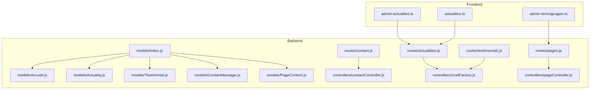
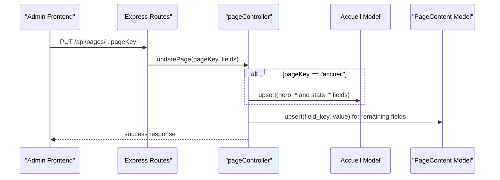
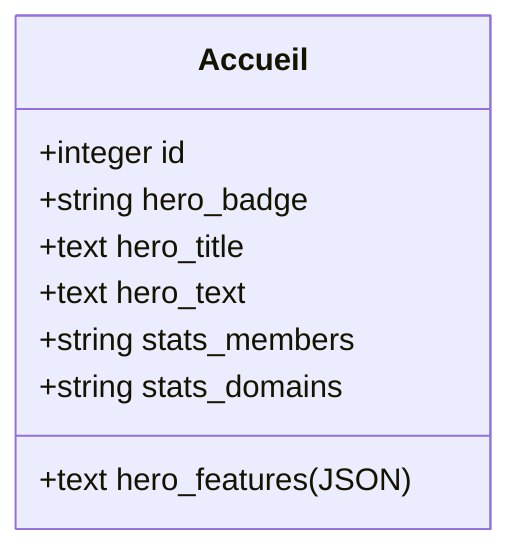
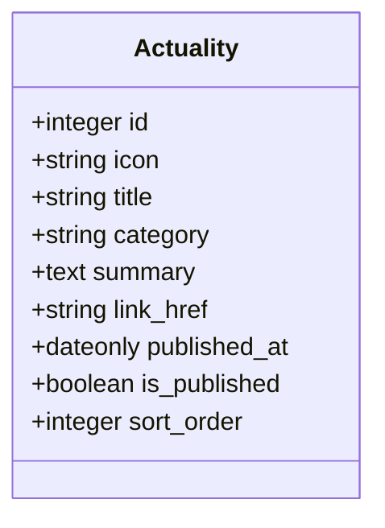
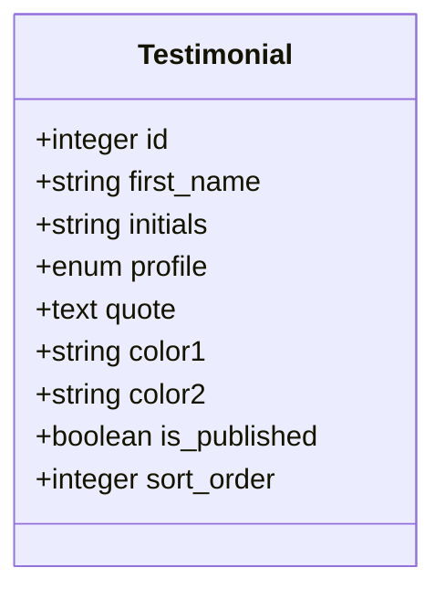
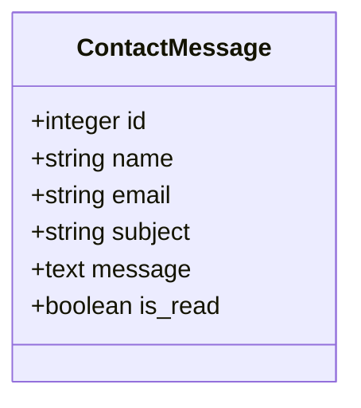
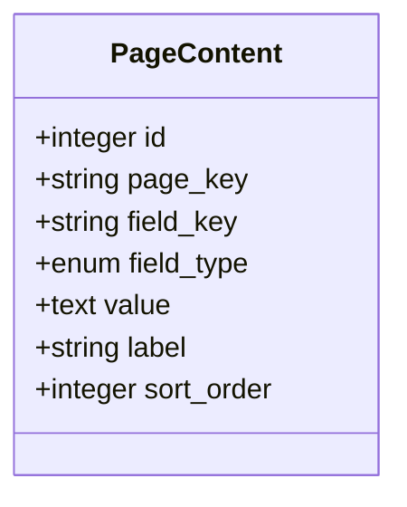
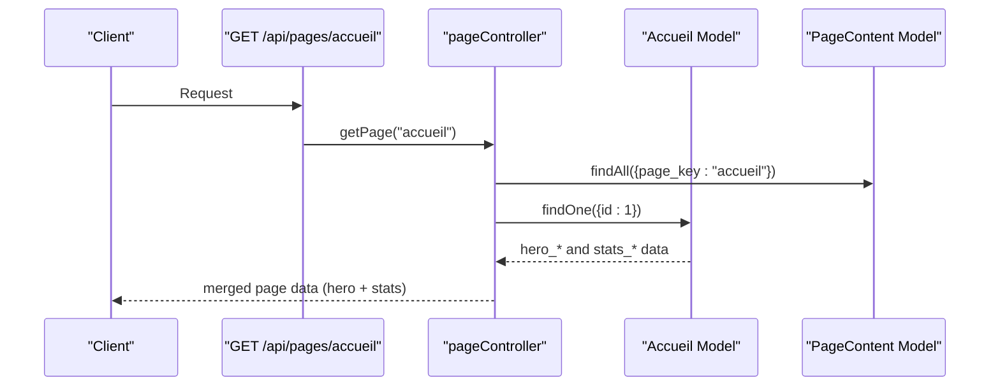
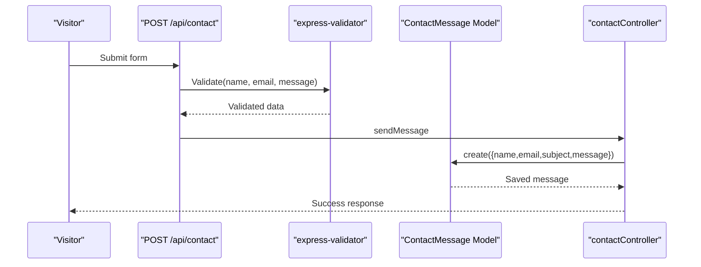
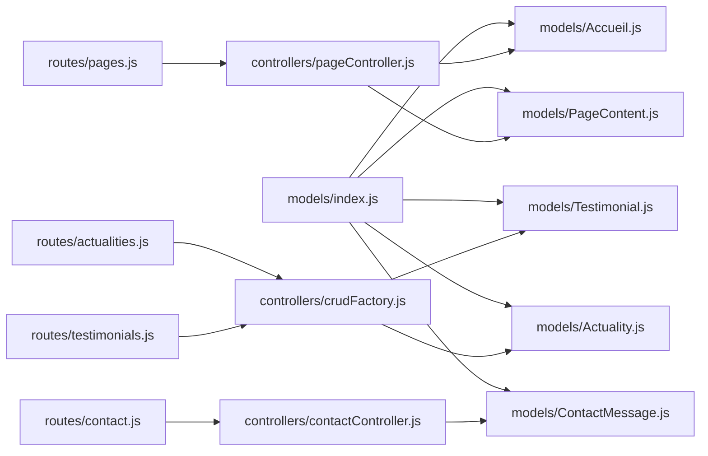

# Content Management Models

<cite>
**Referenced Files in This Document**
- [Accueil.js](file://rsf-backend/models/Accueil.js)
- [Actuality.js](file://rsf-backend/models/Actuality.js)
- [Testimonial.js](file://rsf-backend/models/Testimonial.js)
- [ContactMessage.js](file://rsf-backend/models/ContactMessage.js)
- [PageContent.js](file://rsf-backend/models/PageContent.js)
- [index.js](file://rsf-backend/models/index.js)
- [pageController.js](file://rsf-backend/controllers/pageController.js)
- [crudFactory.js](file://rsf-backend/controllers/crudFactory.js)
- [pages.js](file://rsf-backend/routes/pages.js)
- [actualities.js](file://rsf-backend/routes/actualities.js)
- [testimonials.js](file://rsf-backend/routes/testimonials.js)
- [contact.js](file://rsf-backend/routes/contact.js)
- [contactController.js](file://rsf-backend/controllers/contactController.js)
- [admin-actualites.ts](file://rsf-front/src/app/admin/admin-actualites/admin-actualites.ts)
- [admin-temoignages.ts](file://rsf-front/src/app/admin/admin-temoignages/admin-temoignages.ts)
- [actualites.ts](file://rsf-front/src/app/utilisateurs/actualites/actualites.ts)
</cite>

## Table of Contents
1. [Introduction](#introduction)
2. [Project Structure](#project-structure)
3. [Core Components](#core-components)
4. [Architecture Overview](#architecture-overview)
5. [Detailed Component Analysis](#detailed-component-analysis)
6. [Dependency Analysis](#dependency-analysis)
7. [Performance Considerations](#performance-considerations)
8. [Troubleshooting Guide](#troubleshooting-guide)
9. [Conclusion](#conclusion)

## Introduction
This document describes the content management data models used by the Réseau Solidarité France platform. It focuses on four primary models:
- Accueil: homepage content management
- Actuality: news and article management
- Testimonial: community stories and verification processes
- ContactMessage: visitor inquiries and form submissions

It explains how rich text and structured content are stored, how media and links are handled, and how content approval and publication workflows operate. It also details the relationship between these models and the dynamic page system that powers editable pages across the site.

## Project Structure
The backend uses a modular structure with models, controllers, routes, and middleware. Models are registered centrally and exported as a single registry. Dynamic page content is managed via a generic PageContent model and a dedicated controller. Specialized models (Actuality, Testimonial, ContactMessage) are exposed through REST endpoints using a generic CRUD factory.

**Diagram sources**
- [index.js:1-53](file://rsf-backend/models/index.js#L1-L53)
- [pages.js:1-10](file://rsf-backend/routes/pages.js#L1-L10)
- [actualities.js:1-19](file://rsf-backend/routes/actualities.js#L1-L19)
- [testimonials.js:1-19](file://rsf-backend/routes/testimonials.js#L1-L19)
- [contact.js:1-22](file://rsf-backend/routes/contact.js#L1-L22)
- [pageController.js:1-185](file://rsf-backend/controllers/pageController.js#L1-L185)
- [crudFactory.js:1-100](file://rsf-backend/controllers/crudFactory.js#L1-L100)
- [contactController.js:1-47](file://rsf-backend/controllers/contactController.js#L1-L47)
- [admin-actualites.ts:1-78](file://rsf-front/src/app/admin/admin-actualites/admin-actualites.ts#L1-L78)
- [admin-temoignages.ts:1-33](file://rsf-front/src/app/admin/admin-temoignages/admin-temoignages.ts#L1-L33)
- [actualites.ts:1-77](file://rsf-front/src/app/utilisateurs/actualites/actualites.ts#L1-L77)

**Section sources**
- [index.js:1-53](file://rsf-backend/models/index.js#L1-L53)
- [pages.js:1-10](file://rsf-backend/routes/pages.js#L1-L10)
- [actualities.js:1-19](file://rsf-backend/routes/actualities.js#L1-L19)
- [testimonials.js:1-19](file://rsf-backend/routes/testimonials.js#L1-L19)
- [contact.js:1-22](file://rsf-backend/routes/contact.js#L1-L22)

## Core Components
This section documents the four content models and their roles in the platform.

- Accueil
  - Purpose: Stores homepage-specific content (hero section, statistics) with JSON serialization for structured features.
  - Key fields: hero_badge, hero_title, hero_text, hero_features (JSON array), stats_members, stats_domains.
  - Notes: Uses getters/setters to parse/store JSON for features; integrated into the dynamic page system for the homepage.

- Actuality
  - Purpose: Manages news articles and highlights with optional external links and publication scheduling.
  - Key fields: icon, title, category, summary, link_href, published_at, is_published, sort_order.
  - Notes: Public filter excludes unpublished items; supports reordering.

- Testimonial
  - Purpose: Manages community stories with profile metadata and color theming.
  - Key fields: first_name, initials, profile, quote, color1, color2, is_published, sort_order.
  - Notes: Enumerated profile values; public filter excludes unpublished items; supports reordering.

- ContactMessage
  - Purpose: Captures visitor inquiries from the public contact form and tracks read/unread status.
  - Key fields: name, email, subject, message, is_read.
  - Notes: Email validation built-in; admin endpoints for listing, marking as read, and deletion.

**Section sources**
- [Accueil.js:1-52](file://rsf-backend/models/Accueil.js#L1-L52)
- [Actuality.js:1-18](file://rsf-backend/models/Actuality.js#L1-L18)
- [Testimonial.js:1-18](file://rsf-backend/models/Testimonial.js#L1-L18)
- [ContactMessage.js:1-18](file://rsf-backend/models/ContactMessage.js#L1-L18)

## Architecture Overview
The dynamic page system stores arbitrary editable fields per page using a generic PageContent model. The pageController retrieves and merges these fields with specialized model data (e.g., Accueil for homepage). Specialized models (Actuality, Testimonial) expose REST endpoints via a generic CRUD factory. ContactMessage is handled by a dedicated controller and route.

**Diagram sources**
- [pages.js:1-10](file://rsf-backend/routes/pages.js#L1-L10)
- [pageController.js:106-178](file://rsf-backend/controllers/pageController.js#L106-L178)
- [Accueil.js:1-52](file://rsf-backend/models/Accueil.js#L1-L52)
- [PageContent.js:1-49](file://rsf-backend/models/PageContent.js#L1-L49)

## Detailed Component Analysis

### Accueil Model
- Data storage
  - Hero section fields support rich text via TEXT and TEXT('long').
  - Structured features stored as JSON array with automatic parsing/unpacking.
  - Statistics fields support short text values.
- Integration with dynamic pages
  - On homepage retrieval, pageController merges Accueil data into the hero and stats sections of the page payload.
- Validation and lifecycle
  - No explicit validation rules in the model; defaults are applied by the controller during updates.

**Diagram sources**
- [Accueil.js:4-51](file://rsf-backend/models/Accueil.js#L4-L51)

**Section sources**
- [Accueil.js:1-52](file://rsf-backend/models/Accueil.js#L1-L52)
- [pageController.js:80-98](file://rsf-backend/controllers/pageController.js#L80-L98)

### Actuality Model
- Data storage
  - Rich text summaries via TEXT; optional external link via link_href; publication date via published_at; boolean flag is_published; sortable via sort_order.
- Publication workflow
  - Public API filters out unpublished items; administrators can toggle is_published to publish/unpublish.
- Reordering
  - Supports reordering via a dedicated endpoint generated by the CRUD factory.

**Diagram sources**
- [Actuality.js:4-17](file://rsf-backend/models/Actuality.js#L4-L17)

**Section sources**
- [Actuality.js:1-18](file://rsf-backend/models/Actuality.js#L1-L18)
- [actualities.js:1-19](file://rsf-backend/routes/actualities.js#L1-L19)
- [crudFactory.js:39-96](file://rsf-backend/controllers/crudFactory.js#L39-L96)

### Testimonial Model
- Data storage
  - Profile metadata (first_name, initials, profile enum), quote as rich text, color theming, sort_order, and is_published.
- Verification and approval
  - Public API filters out unpublished testimonials; administrators can approve by toggling is_published.
- Reordering
  - Supports reordering via the CRUD factory.

**Diagram sources**
- [Testimonial.js:4-17](file://rsf-backend/models/Testimonial.js#L4-L17)

**Section sources**
- [Testimonial.js:1-18](file://rsf-backend/models/Testimonial.js#L1-L18)
- [testimonials.js:1-19](file://rsf-backend/routes/testimonials.js#L1-L19)
- [crudFactory.js:39-96](file://rsf-backend/controllers/crudFactory.js#L39-L96)

### ContactMessage Model
- Data storage
  - Visitor-submitted fields: name, email, subject, message; internal tracking: is_read.
- Validation
  - Email validation enforced by Sequelize validator; request validation enforced by express-validator middleware on the public endpoint.
- Admin workflow
  - Admin endpoints allow listing, marking as read, and deleting messages.

**Diagram sources**
- [ContactMessage.js:4-17](file://rsf-backend/models/ContactMessage.js#L4-L17)

**Section sources**
- [ContactMessage.js:1-18](file://rsf-backend/models/ContactMessage.js#L1-L18)
- [contact.js:9-22](file://rsf-backend/routes/contact.js#L9-L22)
- [contactController.js:1-47](file://rsf-backend/controllers/contactController.js#L1-L47)

### Dynamic Page System (PageContent)
- Purpose
  - Provides a flexible, key-value storage mechanism for editable page content across the site.
- Schema
  - page_key identifies the page; field_key identifies the field; field_type defines the editor type; value stores serialized content; label supports admin labeling; sort_order enables ordering.
- Indexes
  - Unique composite index on (page_key, field_key); separate index on page_key for fast lookups.
- Controller behavior
  - getPage loads all fields for a page, orders by sort_order, and parses JSON values.
  - updatePage persists fields via upsert; special handling for homepage integrates with Accueil.

**Diagram sources**
- [PageContent.js:5-49](file://rsf-backend/models/PageContent.js#L5-L49)

**Section sources**
- [PageContent.js:1-49](file://rsf-backend/models/PageContent.js#L1-L49)
- [pageController.js:30-36](file://rsf-backend/controllers/pageController.js#L30-L36)
- [pageController.js:66-104](file://rsf-backend/controllers/pageController.js#L66-L104)
- [pageController.js:106-178](file://rsf-backend/controllers/pageController.js#L106-L178)

### API Workflows

#### Homepage Merge Workflow

**Diagram sources**
- [pages.js:5-7](file://rsf-backend/routes/pages.js#L5-L7)
- [pageController.js:66-104](file://rsf-backend/controllers/pageController.js#L66-L104)
- [Accueil.js:1-52](file://rsf-backend/models/Accueil.js#L1-L52)
- [PageContent.js:1-49](file://rsf-backend/models/PageContent.js#L1-L49)

#### Public Contact Form Submission

**Diagram sources**
- [contact.js:9-14](file://rsf-backend/routes/contact.js#L9-L14)
- [contactController.js:5-16](file://rsf-backend/controllers/contactController.js#L5-L16)
- [ContactMessage.js:1-18](file://rsf-backend/models/ContactMessage.js#L1-L18)

### Content Lifecycle and Publication States
- Publication states
  - is_published flag controls visibility in public APIs for Actuality and Testimonial.
  - For Actuality, published_at can be used to schedule publication dates.
- Archiving and ordering
  - sort_order supports manual ordering; reorder endpoints are provided via the CRUD factory.
- Read status (ContactMessage)
  - is_read allows administrators to track message read status.

**Section sources**
- [Actuality.js:12-14](file://rsf-backend/models/Actuality.js#L12-L14)
- [Testimonial.js:13-14](file://rsf-backend/models/Testimonial.js#L13-L14)
- [crudFactory.js:87-95](file://rsf-backend/controllers/crudFactory.js#L87-L95)
- [ContactMessage.js:11](file://rsf-backend/models/ContactMessage.js#L11)

### Rich Text Storage and Media Attachments
- Rich text storage
  - TEXT and TEXT('long') fields are used for content requiring rich text formatting.
  - JSON fields (e.g., Accueil.hero_features) store structured arrays of feature items.
- Media and links
  - link_href supports external URLs for articles and highlights.
  - Color theming fields (Testimonial.color1, color2) enable visual customization.
- Frontend integration
  - The actualités page displays formatted dates and handles internal vs external links appropriately.

**Section sources**
- [Accueil.js:24-35](file://rsf-backend/models/Accueil.js#L24-L35)
- [Actuality.js:11](file://rsf-backend/models/Actuality.js#L11)
- [Testimonial.js:11-12](file://rsf-backend/models/Testimonial.js#L11-L12)
- [actualites.ts:29-52](file://rsf-front/src/app/utilisateurs/actualites/actualites.ts#L29-L52)

## Dependency Analysis
The models are registered centrally and consumed by controllers and routes. The pageController orchestrates merging of specialized models with PageContent for dynamic pages. The CRUD factory standardizes operations for Actuality and Testimonial.

**Diagram sources**
- [index.js:1-53](file://rsf-backend/models/index.js#L1-L53)
- [pages.js:1-10](file://rsf-backend/routes/pages.js#L1-L10)
- [actualities.js:1-19](file://rsf-backend/routes/actualities.js#L1-L19)
- [testimonials.js:1-19](file://rsf-backend/routes/testimonials.js#L1-L19)
- [contact.js:1-22](file://rsf-backend/routes/contact.js#L1-L22)
- [pageController.js:1-185](file://rsf-backend/controllers/pageController.js#L1-L185)
- [crudFactory.js:1-100](file://rsf-backend/controllers/crudFactory.js#L1-100)
- [contactController.js:1-47](file://rsf-backend/controllers/contactController.js#L1-L47)

**Section sources**
- [index.js:1-53](file://rsf-backend/models/index.js#L1-L53)
- [pageController.js:106-178](file://rsf-backend/controllers/pageController.js#L106-L178)
- [crudFactory.js:39-96](file://rsf-backend/controllers/crudFactory.js#L39-L96)

## Performance Considerations
- JSON parsing overhead
  - Accueil.hero_features is stored as JSON and parsed on read; consider caching parsed values if frequently accessed.
- Query patterns
  - PageContent queries are filtered by page_key and ordered by sort_order; ensure appropriate indexes are maintained.
- Rate limiting
  - Public contact form submission is rate-limited to prevent abuse.

[No sources needed since this section provides general guidance]

## Troubleshooting Guide
- Homepage content not updating
  - Verify that updatePage receives hero and stats fields under the correct keys; ensure upsert operations target the singleton Accueil record.
- Dynamic page fields missing
  - Confirm that PageContent entries exist for the requested page_key and that field_key matches the expected keys.
- Public content not appearing
  - Check is_published flag for Actuality and Testimonial records; public filters exclude unpublished items.
- Contact form errors
  - Validate client-side trimming and length constraints; server-side validation enforces email format and minimum message length.

**Section sources**
- [pageController.js:119-162](file://rsf-backend/controllers/pageController.js#L119-L162)
- [pageController.js:164-174](file://rsf-backend/controllers/pageController.js#L164-L174)
- [contact.js:10-14](file://rsf-backend/routes/contact.js#L10-L14)
- [contactController.js:18-34](file://rsf-backend/controllers/contactController.js#L18-L34)

## Conclusion
The platform’s content management relies on a flexible dynamic page system (PageContent) augmented by specialized models for homepage (Accueil), news (Actuality), testimonials (Testimonial), and contact messages (ContactMessage). Rich text and structured content are supported through TEXT fields and JSON serialization, while publication and approval workflows are controlled via boolean flags and public filters. The centralized model registry and generic CRUD factory streamline development and maintenance across content types.