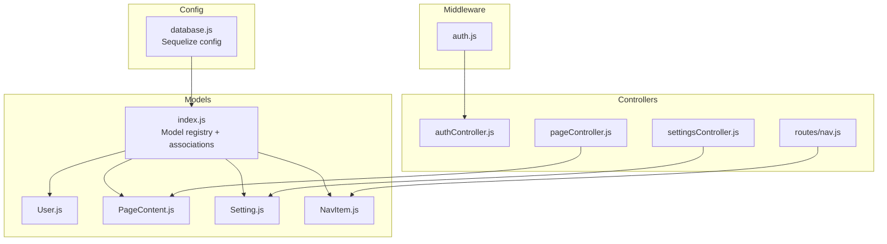
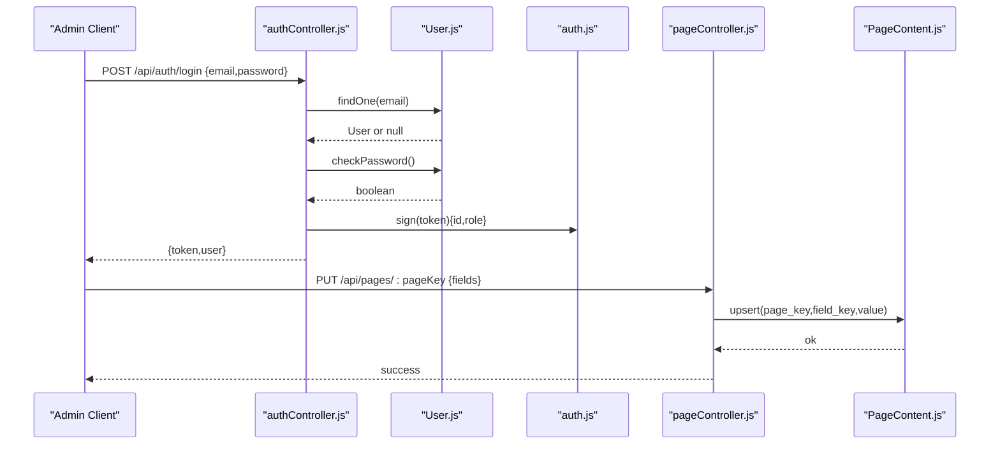
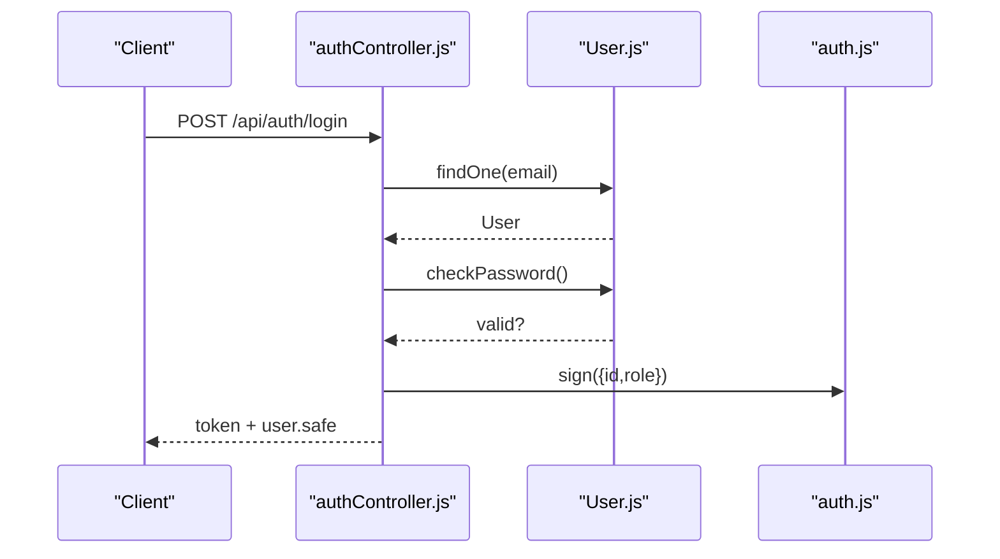
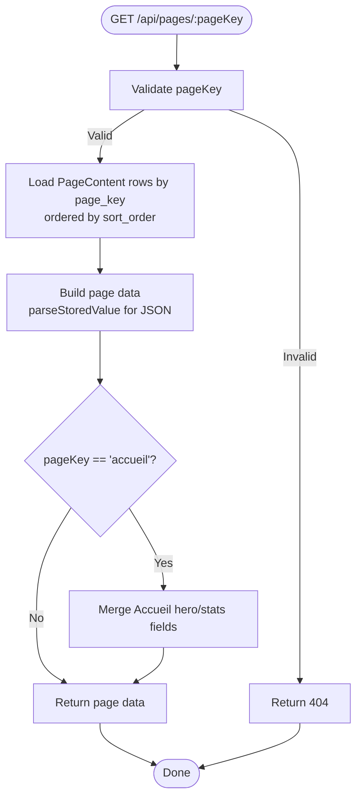
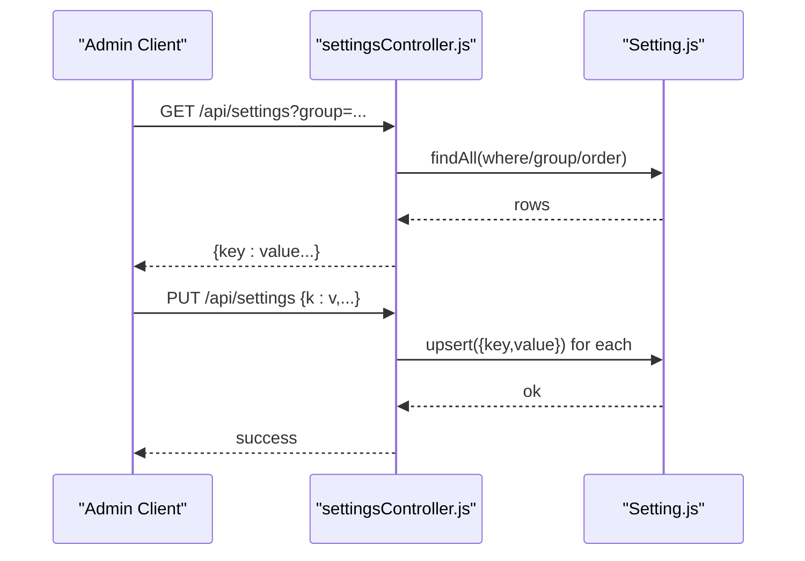
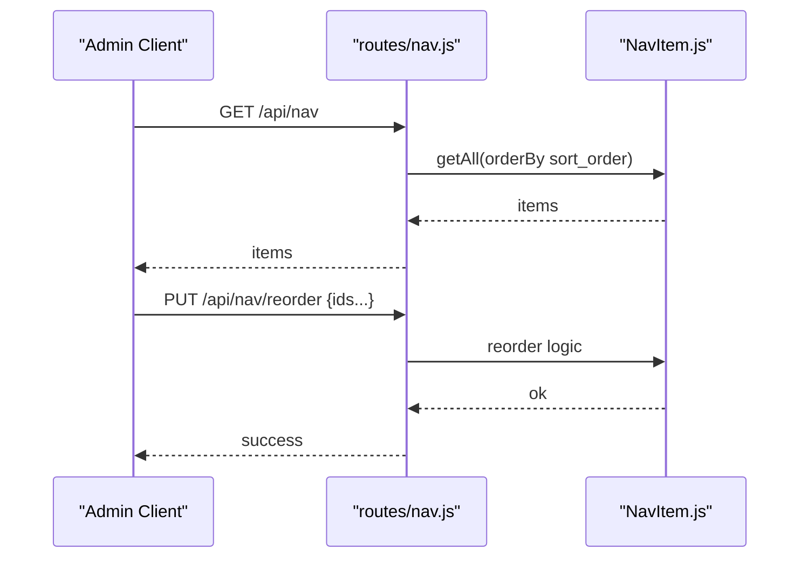
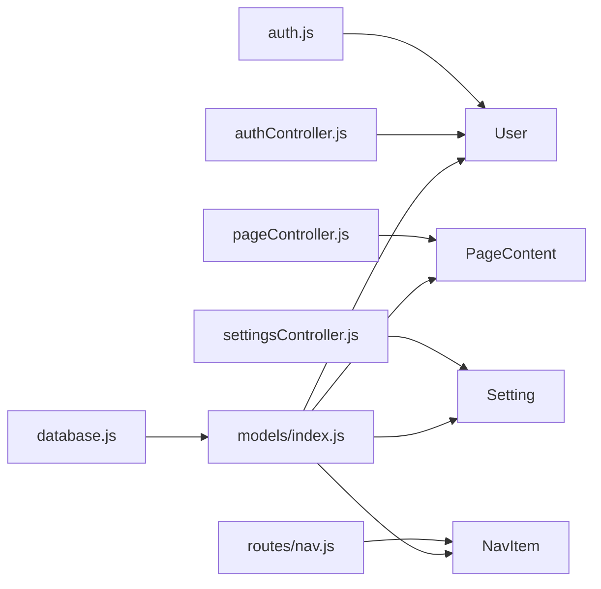

# Core Data Models

<cite>
**Referenced Files in This Document**
- [User.js](file://rsf-backend/models/User.js)
- [PageContent.js](file://rsf-backend/models/PageContent.js)
- [Setting.js](file://rsf-backend/models/Setting.js)
- [NavItem.js](file://rsf-backend/models/NavItem.js)
- [index.js](file://rsf-backend/models/index.js)
- [database.js](file://rsf-backend/config/database.js)
- [auth.js](file://rsf-backend/middleware/auth.js)
- [authController.js](file://rsf-backend/controllers/authController.js)
- [settingsController.js](file://rsf-backend/controllers/settingsController.js)
- [pageController.js](file://rsf-backend/controllers/pageController.js)
- [nav.js](file://rsf-backend/routes/nav.js)
</cite>

## Table of Contents
1. [Introduction](#introduction)
2. [Project Structure](#project-structure)
3. [Core Components](#core-components)
4. [Architecture Overview](#architecture-overview)
5. [Detailed Component Analysis](#detailed-component-analysis)
6. [Dependency Analysis](#dependency-analysis)
7. [Performance Considerations](#performance-considerations)
8. [Troubleshooting Guide](#troubleshooting-guide)
9. [Conclusion](#conclusion)

## Introduction
This document describes the core data models that underpin the Réseau Solidarité France platform. It focuses on:
- User: authentication, authorization, and security-related attributes
- PageContent: dynamic, editable content fields per page with type safety and ordering
- Setting: global configuration key/value store with typed values and grouping
- NavItem: navigation structure for the website front-end

It explains field definitions, data types, validation rules, and business logic constraints, and documents how these models relate to each other and to the broader system architecture.

## Project Structure
The models are defined with Sequelize and registered centrally. Authentication and authorization are enforced via middleware and controllers. Settings and page content are managed through dedicated controllers and routes.

**Diagram sources**
- [database.js:1-69](file://rsf-backend/config/database.js#L1-L69)
- [index.js:1-53](file://rsf-backend/models/index.js#L1-L53)
- [User.js:1-75](file://rsf-backend/models/User.js#L1-L75)
- [PageContent.js:1-49](file://rsf-backend/models/PageContent.js#L1-L49)
- [Setting.js:1-16](file://rsf-backend/models/Setting.js#L1-L16)
- [NavItem.js:1-16](file://rsf-backend/models/NavItem.js#L1-L16)
- [authController.js:1-60](file://rsf-backend/controllers/authController.js#L1-L60)
- [auth.js:1-50](file://rsf-backend/middleware/auth.js#L1-L50)
- [settingsController.js:1-28](file://rsf-backend/controllers/settingsController.js#L1-L28)
- [pageController.js:1-185](file://rsf-backend/controllers/pageController.js#L1-L185)
- [nav.js:1-19](file://rsf-backend/routes/nav.js#L1-L19)

**Section sources**
- [database.js:1-69](file://rsf-backend/config/database.js#L1-L69)
- [index.js:1-53](file://rsf-backend/models/index.js#L1-L53)

## Core Components
This section defines each core model’s fields, types, constraints, and notable behaviors.

- User
  - Purpose: Store user credentials, roles, and activity metadata for authentication and authorization.
  - Fields:
    - id: integer, primary key, auto-increment
    - name: string, max 150, required, length validated between 2 and 150
    - email: string, max 255, required, unique, validated as email
    - password: string, max 255, required (hashed before save)
    - role: enum('admin','editor'), defaults to 'editor'
    - is_active: boolean, defaults to true
    - last_login: date-time, nullable
  - Hooks:
    - Password hashing on create/update when password is present
  - Methods:
    - checkPassword(plain): compares plain text against stored hash
    - toSafeJSON(): returns user object without password
  - Indexes:
    - Unique index on email

- PageContent
  - Purpose: Dynamic editable content per page, keyed by page_key and field_key.
  - Fields:
    - id: integer, primary key, auto-increment
    - page_key: string, max 100, required, identifies page (e.g., 'accueil')
    - field_key: string, max 100, required, identifies field (e.g., 'hero_title')
    - field_type: enum('text','textarea','html','url','color','boolean','number'), defaults to 'text'
    - value: long TEXT, optional
    - label: string, max 200, optional, for admin UI labeling
    - sort_order: integer, defaults to 0
  - Constraints:
    - Unique composite index on (page_key, field_key)
    - Additional index on page_key
  - Business logic:
    - Values are serialized/deserialized; JSON arrays/objects are stored as strings and parsed back when retrieved

- Setting
  - Purpose: Global configuration key/value store with type and grouping.
  - Fields:
    - id: integer, primary key, auto-increment
    - key: string, max 100, required, unique
    - value: TEXT, optional
    - type: enum('text','number','boolean','color','json'), defaults to 'text'
    - group: string, max 50, defaults to 'general'; categories include general, appearance, contact, footer, nav
    - label: string, max 200, optional
  - Constraints:
    - Unique index on key

- NavItem
  - Purpose: Navigation items for the front-end.
  - Fields:
    - id: integer, primary key, auto-increment
    - label: string, max 100, required
    - href: string, max 255, required
    - icon: string, max 100, optional
    - is_visible: boolean, defaults to true
    - is_cta: boolean, defaults to false
    - sort_order: integer, defaults to 0
  - Notes:
    - CRUD endpoints expose reordering and visibility controls

**Section sources**
- [User.js:5-75](file://rsf-backend/models/User.js#L5-L75)
- [PageContent.js:5-49](file://rsf-backend/models/PageContent.js#L5-L49)
- [Setting.js:5-16](file://rsf-backend/models/Setting.js#L5-L16)
- [NavItem.js:4-16](file://rsf-backend/models/NavItem.js#L4-L16)

## Architecture Overview
The core models integrate with middleware and controllers to enforce authentication, authorization, and content management.

**Diagram sources**
- [authController.js:6-36](file://rsf-backend/controllers/authController.js#L6-L36)
- [auth.js:10-33](file://rsf-backend/middleware/auth.js#L10-L33)
- [pageController.js:106-178](file://rsf-backend/controllers/pageController.js#L106-L178)
- [User.js:63-71](file://rsf-backend/models/User.js#L63-L71)
- [PageContent.js:5-49](file://rsf-backend/models/PageContent.js#L5-L49)

## Detailed Component Analysis

### User Model
- Authentication flow:
  - Login validates email existence and active status, checks password, updates last_login, and issues a signed JWT containing user id and role.
  - Protected routes use middleware to verify JWT and attach user context.
- Authorization:
  - Middleware supports role-based access control using an authorize higher-order function that restricts endpoints to specific roles.
- Security:
  - Passwords are hashed with bcrypt before creation and updates.
  - Safe serialization excludes sensitive fields from JSON responses.

**Diagram sources**
- [authController.js:7-32](file://rsf-backend/controllers/authController.js#L7-L32)
- [auth.js:10-33](file://rsf-backend/middleware/auth.js#L10-L33)
- [User.js:47-71](file://rsf-backend/models/User.js#L47-L71)

**Section sources**
- [authController.js:1-60](file://rsf-backend/controllers/authController.js#L1-L60)
- [auth.js:1-50](file://rsf-backend/middleware/auth.js#L1-L50)
- [User.js:1-75](file://rsf-backend/models/User.js#L1-L75)

### PageContent Model
- Dynamic content system:
  - Each editable field is stored as a row with page_key and field_key.
  - field_type drives editor behavior in the admin UI.
  - sort_order enables ordered rendering.
- Value handling:
  - Values are serialized to strings when stored; JSON arrays/objects are supported and parsed back on retrieval.
- Page-specific logic:
  - The homepage aggregates content from PageContent and a dedicated Accueil model, merging hero and stats fields.
- Validation:
  - Controllers validate page keys against a whitelist and ensure fields payload presence and shape.

**Diagram sources**
- [pageController.js:66-104](file://rsf-backend/controllers/pageController.js#L66-L104)
- [PageContent.js:5-49](file://rsf-backend/models/PageContent.js#L5-L49)

**Section sources**
- [pageController.js:1-185](file://rsf-backend/controllers/pageController.js#L1-L185)
- [PageContent.js:1-49](file://rsf-backend/models/PageContent.js#L1-L49)

### Setting Model
- Global configuration:
  - Key/value pairs with explicit type to guide admin UI and parsing.
  - Grouping allows organizing settings (e.g., contact, footer).
- Management:
  - Bulk update endpoint uses upsert to apply multiple settings atomically.
  - Retrieval supports filtering by group and returns a flattened object.

**Diagram sources**
- [settingsController.js:4-27](file://rsf-backend/controllers/settingsController.js#L4-L27)
- [Setting.js:5-16](file://rsf-backend/models/Setting.js#L5-L16)

**Section sources**
- [settingsController.js:1-28](file://rsf-backend/controllers/settingsController.js#L1-L28)
- [Setting.js:1-16](file://rsf-backend/models/Setting.js#L1-L16)

### NavItem Model
- Navigation structure:
  - Stores labels, links, icons, visibility flags, and call-to-action markers.
  - sort_order controls presentation order.
- Public exposure:
  - Routes expose a CRUD interface with reordering and a public filter for visibility.

**Diagram sources**
- [nav.js:6-18](file://rsf-backend/routes/nav.js#L6-L18)
- [NavItem.js:5-16](file://rsf-backend/models/NavItem.js#L5-L16)

**Section sources**
- [nav.js:1-19](file://rsf-backend/routes/nav.js#L1-L19)
- [NavItem.js:1-16](file://rsf-backend/models/NavItem.js#L1-L16)

## Dependency Analysis
- Central registration:
  - The models index registers all models and defines associations among related entities (notably PageContent and Setting/NavItem).
- External dependencies:
  - bcrypt for password hashing
  - jsonwebtoken for JWT tokens
  - dotenv for environment variables
- Database configuration:
  - Supports SQLite, MySQL/MariaDB, and PostgreSQL with environment-driven configuration.

**Diagram sources**
- [database.js:1-69](file://rsf-backend/config/database.js#L1-L69)
- [index.js:1-53](file://rsf-backend/models/index.js#L1-L53)
- [authController.js:1-60](file://rsf-backend/controllers/authController.js#L1-L60)
- [auth.js:1-50](file://rsf-backend/middleware/auth.js#L1-L50)
- [pageController.js:1-185](file://rsf-backend/controllers/pageController.js#L1-L185)
- [settingsController.js:1-28](file://rsf-backend/controllers/settingsController.js#L1-L28)
- [nav.js:1-19](file://rsf-backend/routes/nav.js#L1-L19)

**Section sources**
- [index.js:1-53](file://rsf-backend/models/index.js#L1-L53)
- [database.js:1-69](file://rsf-backend/config/database.js#L1-L69)

## Performance Considerations
- Indexes:
  - Unique indexes on email (User), (page_key, field_key) and page_key (PageContent), and key (Setting) improve lookup performance.
- Batching:
  - Settings bulk update uses Promise.all to minimize round-trips.
- Sorting:
  - sort_order fields enable efficient front-end rendering without additional joins.
- Storage:
  - Long TEXT fields for values allow flexible content while keeping a normalized schema.

## Troubleshooting Guide
- Authentication failures:
  - Missing or invalid bearer token, expired token, or disabled user account will return 401.
  - Incorrect credentials trigger a 401 with a specific message.
- Authorization failures:
  - Requests without sufficient role receive 403 with the required role(s) indicated.
- Content not found:
  - Accessing an unsupported page key returns 404 in page retrieval.
- Settings update errors:
  - Ensure keys are unique and values match declared types; bulk update uses upsert and may fail if constraints are violated.
- Password changes:
  - Current password must be valid; otherwise returns 400.

**Section sources**
- [auth.js:10-47](file://rsf-backend/middleware/auth.js#L10-L47)
- [authController.js:7-36](file://rsf-backend/controllers/authController.js#L7-L36)
- [pageController.js:66-104](file://rsf-backend/controllers/pageController.js#L66-L104)
- [settingsController.js:16-25](file://rsf-backend/controllers/settingsController.js#L16-L25)

## Conclusion
The core models provide a secure, extensible foundation for the platform:
- User ensures robust authentication and role-based access control.
- PageContent enables flexible, typed, and ordered page editing.
- Setting centralizes global configuration with type safety and grouping.
- NavItem structures navigation with visibility and ordering controls.

These models integrate cleanly with middleware and controllers, leveraging indexes and batch operations for performance and maintainability.