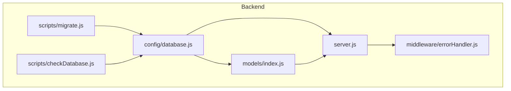
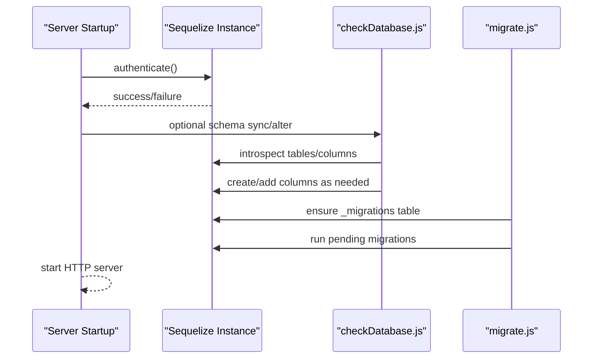
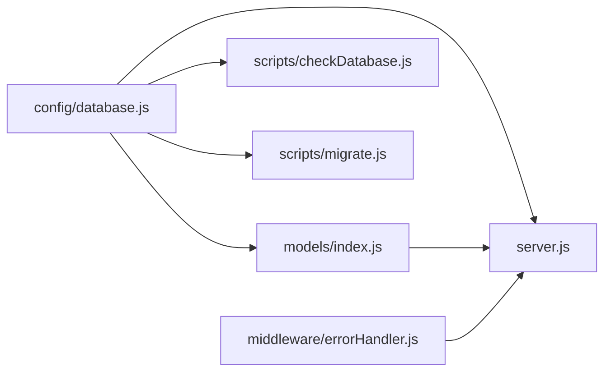

# Database Architecture

<cite>
**Referenced Files in This Document**
- [database.js](file://rsf-backend/config/database.js)
- [index.js](file://rsf-backend/models/index.js)
- [migrate.js](file://rsf-backend/scripts/migrate.js)
- [checkDatabase.js](file://rsf-backend/scripts/checkDatabase.js)
- [package.json](file://rsf-backend/package.json)
- [server.js](file://rsf-backend/server.js)
- [User.js](file://rsf-backend/models/User.js)
- [Action.js](file://rsf-backend/models/Action.js)
- [Mission.js](file://rsf-backend/models/Mission.js)
- [Event.js](file://rsf-backend/models/Event.js)
- [Setting.js](file://rsf-backend/models/Setting.js)
- [errorHandler.js](file://rsf-backend/middleware/errorHandler.js)
</cite>

## Table of Contents
1. [Introduction](#introduction)
2. [Project Structure](#project-structure)
3. [Core Components](#core-components)
4. [Architecture Overview](#architecture-overview)
5. [Detailed Component Analysis](#detailed-component-analysis)
6. [Dependency Analysis](#dependency-analysis)
7. [Performance Considerations](#performance-considerations)
8. [Troubleshooting Guide](#troubleshooting-guide)
9. [Conclusion](#conclusion)
10. [Appendices](#appendices)

## Introduction
This document describes the multi-database architecture for the Réseau Solidarité France backend. It explains how Sequelize is configured to support SQLite, MySQL, and PostgreSQL, how connections are managed, how environment-based database selection works, and how migrations and schema maintenance are handled. It also documents initialization, connection pooling, error handling, and operational guidance for different deployment environments.

## Project Structure
The database-related components are organized under the backend project:
- Configuration: centralized database configuration via Sequelize
- Models: model definitions and associations
- Scripts: database initialization and migration utilities
- Server: application bootstrap and health endpoint exposing database dialect

**Diagram sources**
- [database.js:1-69](file://rsf-backend/config/database.js#L1-L69)
- [index.js:1-53](file://rsf-backend/models/index.js#L1-L53)
- [server.js:1-84](file://rsf-backend/server.js#L1-L84)
- [migrate.js:1-390](file://rsf-backend/scripts/migrate.js#L1-L390)
- [checkDatabase.js:1-381](file://rsf-backend/scripts/checkDatabase.js#L1-L381)

**Section sources**
- [database.js:1-69](file://rsf-backend/config/database.js#L1-L69)
- [index.js:1-53](file://rsf-backend/models/index.js#L1-L53)
- [server.js:1-84](file://rsf-backend/server.js#L1-L84)
- [migrate.js:1-390](file://rsf-backend/scripts/migrate.js#L1-L390)
- [checkDatabase.js:1-381](file://rsf-backend/scripts/checkDatabase.js#L1-L381)

## Core Components
- Database configuration module: creates a Sequelize instance based on environment variables and selects the appropriate dialect and connection parameters.
- Model registry and associations: loads all models and defines relations between them.
- Initialization script: checks database connectivity, ensures tables exist, adds missing columns, seeds default admin, and reports status.
- Migration script: runs ordered migrations tracked in a dedicated table, supports listing and undoing the last migration.
- Server bootstrap: authenticates the database connection at startup and exposes a health endpoint indicating the active dialect.

**Section sources**
- [database.js:9-66](file://rsf-backend/config/database.js#L9-L66)
- [index.js:6-50](file://rsf-backend/models/index.js#L6-L50)
- [checkDatabase.js:55-69](file://rsf-backend/scripts/checkDatabase.js#L55-L69)
- [migrate.js:304-336](file://rsf-backend/scripts/migrate.js#L304-L336)
- [server.js:55-81](file://rsf-backend/server.js#L55-L81)

## Architecture Overview
The system uses a single Sequelize instance configured at runtime based on environment variables. The server authenticates against the selected database, models are loaded centrally, and two complementary maintenance utilities keep the schema aligned with model definitions and evolve it over time.

**Diagram sources**
- [server.js:55-81](file://rsf-backend/server.js#L55-L81)
- [checkDatabase.js:323-358](file://rsf-backend/scripts/checkDatabase.js#L323-L358)
- [migrate.js:304-336](file://rsf-backend/scripts/migrate.js#L304-L336)

## Detailed Component Analysis

### Database Configuration and Environment Selection
- Dialect selection: reads the dialect from an environment variable and supports sqlite, mysql, mariadb, and postgres.
- SQLite: creates the storage directory if missing and uses a local file path.
- MySQL/MariaDB and PostgreSQL: use host, port, credentials, and connection pool options.
- Logging: enables SQL logging in development mode.
- Timestamps and naming: uses snake_case and automatic createdAt/updatedAt fields.

Operational notes:
- Connection pooling is configured with fixed limits suitable for small to medium workloads.
- The configuration throws on unsupported dialects.

**Section sources**
- [database.js:9-66](file://rsf-backend/config/database.js#L9-L66)

### Model Registry and Associations
- Centralized model loading registers all models and exports them as a single object.
- Associations define foreign keys and cascading deletes for related entities (e.g., Mission–MissionItem, Event–EventProgram).
- Models define indexes (e.g., unique email on User, unique key on Setting).

**Section sources**
- [index.js:6-50](file://rsf-backend/models/index.js#L6-L50)
- [User.js:41-46](file://rsf-backend/models/User.js#L41-L46)
- [Setting.js](file://rsf-backend/models/Setting.js#L13)

### Initialization Script (Schema Sync and Column Additions)
- Tests database connectivity and reports dialect and database name.
- Enumerates existing tables per dialect and compares with model definitions.
- Adds missing columns respecting dialect limitations (notably SQLite’s limited ALTER support).
- Ensures a default admin user exists when the users table is empty.
- Provides a summary report and optional seeding.

Key behaviors:
- Uses dialect-specific queries to discover tables and columns.
- Applies Sequelize model.sync({ force: false }) to create missing tables.
- Adds columns using ALTER TABLE with dialect-aware SQL.

**Section sources**
- [checkDatabase.js:55-69](file://rsf-backend/scripts/checkDatabase.js#L55-L69)
- [checkDatabase.js:71-99](file://rsf-backend/scripts/checkDatabase.js#L71-L99)
- [checkDatabase.js:101-131](file://rsf-backend/scripts/checkDatabase.js#L101-L131)
- [checkDatabase.js:133-156](file://rsf-backend/scripts/checkDatabase.js#L133-L156)
- [checkDatabase.js:210-232](file://rsf-backend/scripts/checkDatabase.js#L210-L232)
- [checkDatabase.js:256-280](file://rsf-backend/scripts/checkDatabase.js#L256-L280)

### Migration System
- Manual migrations stored as an ordered array with up/down functions.
- Tracks applied migrations in a dedicated table (_migrations) with dialect-aware SQL.
- Supports listing pending/applied migrations, applying pending ones, and undoing the last migration.
- Stops on first error during migration execution.

Dialect-specific handling:
- Creates tables and alters columns with database-specific syntax.
- Uses INSERT IGNORE semantics depending on dialect for tracking.

**Section sources**
- [migrate.js:34-214](file://rsf-backend/scripts/migrate.js#L34-L214)
- [migrate.js:217-244](file://rsf-backend/scripts/migrate.js#L217-L244)
- [migrate.js:246-269](file://rsf-backend/scripts/migrate.js#L246-L269)
- [migrate.js:303-336](file://rsf-backend/scripts/migrate.js#L303-L336)
- [migrate.js:338-364](file://rsf-backend/scripts/migrate.js#L338-L364)

### Server Bootstrap and Health Endpoint
- Authenticates the database connection at startup.
- Optionally performs schema synchronization (commented by default).
- Exposes a health endpoint that returns the active database dialect.

**Section sources**
- [server.js:55-81](file://rsf-backend/server.js#L55-L81)
- [server.js:35-44](file://rsf-backend/server.js#L35-L44)

### Error Handling
- Global error handler normalizes Sequelize validation and unique constraint errors into structured responses.
- Preserves custom status codes set on errors.
- Returns production-safe messages in production environments.

**Section sources**
- [errorHandler.js:4-28](file://rsf-backend/middleware/errorHandler.js#L4-L28)

## Dependency Analysis
The following diagram shows how the configuration, models, scripts, and server depend on each other.

**Diagram sources**
- [database.js:1-69](file://rsf-backend/config/database.js#L1-L69)
- [index.js:1-53](file://rsf-backend/models/index.js#L1-L53)
- [server.js:1-84](file://rsf-backend/server.js#L1-L84)
- [checkDatabase.js:1-381](file://rsf-backend/scripts/checkDatabase.js#L1-L381)
- [migrate.js:1-390](file://rsf-backend/scripts/migrate.js#L1-L390)
- [errorHandler.js:1-38](file://rsf-backend/middleware/errorHandler.js#L1-L38)

**Section sources**
- [package.json:6-14](file://rsf-backend/package.json#L6-L14)

## Performance Considerations
- Connection pooling: configured with modest limits suitable for small deployments. For higher concurrency, adjust pool.max and related acquisition/idle timeouts.
- SQLite: file-based storage; ensure adequate disk I/O and consider WAL mode for improved concurrency in production.
- MySQL/PostgreSQL: tune server-side connection limits and query timeouts according to workload.
- Indexes: Sequelize manages indexes at creation time; avoid heavy writes during initial sync in production.
- Logging: SQL logging is enabled in development; disable in production to reduce overhead.

[No sources needed since this section provides general guidance]

## Troubleshooting Guide
Common issues and remedies:
- Connection failures: verify environment variables for dialect, host, port, database name, and credentials.
- SQLite file permissions: ensure the storage directory is writable by the application process.
- Migration errors: inspect the specific migration failure, fix the underlying schema issue, then re-run migrations.
- Schema drift after manual edits: use the initialization script to reconcile missing columns and tables.
- Validation errors: Sequelize validation errors are normalized and returned with field-level details.

**Section sources**
- [checkDatabase.js:55-69](file://rsf-backend/scripts/checkDatabase.js#L55-L69)
- [migrate.js:322-330](file://rsf-backend/scripts/migrate.js#L322-L330)
- [errorHandler.js:7-14](file://rsf-backend/middleware/errorHandler.js#L7-L14)

## Conclusion
The backend employs a clean, environment-driven Sequelize configuration supporting SQLite, MySQL, and PostgreSQL. A dual maintenance strategy keeps the schema aligned with models and enables controlled evolution via manual migrations. With proper environment configuration and operational monitoring, the system supports reliable multi-database deployments.

[No sources needed since this section summarizes without analyzing specific files]

## Appendices

### Environment Variables and Configuration Examples
- Dialect selection: set the database dialect via an environment variable.
- SQLite:
  - Storage path: configure the absolute or relative path to the SQLite file.
- MySQL/MariaDB:
  - Host, port, database name, user, and password must be provided.
- PostgreSQL:
  - Host, port, database name, user, and password must be provided.
- Logging:
  - SQL logging is enabled in development mode by default.

**Section sources**
- [database.js:9-66](file://rsf-backend/config/database.js#L9-L66)

### Deployment Scenarios and Recommendations
- Development:
  - SQLite with local storage is convenient for local development.
  - Enable SQL logging for debugging.
- Staging:
  - Use MySQL or PostgreSQL with connection pooling tuned for expected load.
- Production:
  - Prefer managed database services with backups and monitoring.
  - Disable SQL logging in production.
  - Use migrations for schema changes; avoid manual DDL.

[No sources needed since this section provides general guidance]

### Database-Specific Notes
- SQLite:
  - Limited ALTER support; migrations often rebuild columns via temporary tables.
  - File locking and concurrent write patterns should be considered.
- MySQL/MariaDB:
  - Use UTF8MB4 collations for international text.
  - Monitor slow query logs and optimize indexes.
- PostgreSQL:
  - Use appropriate extensions and collations for text search if needed.
  - Monitor autovacuum and analyze frequency.

[No sources needed since this section provides general guidance]

### Model-to-Table Mapping Highlights
- Users: unique email index, password hashing via hooks.
- Actions: includes styling columns introduced via migrations.
- Missions and Events: structured content with publication flags and ordering.

**Section sources**
- [User.js:41-46](file://rsf-backend/models/User.js#L41-L46)
- [Action.js:13-18](file://rsf-backend/models/Action.js#L13-L18)
- [Mission.js:10-12](file://rsf-backend/models/Mission.js#L10-L12)
- [Event.js:17-21](file://rsf-backend/models/Event.js#L17-L21)