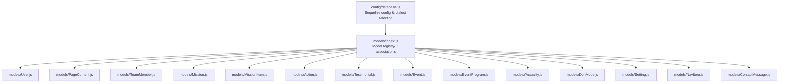
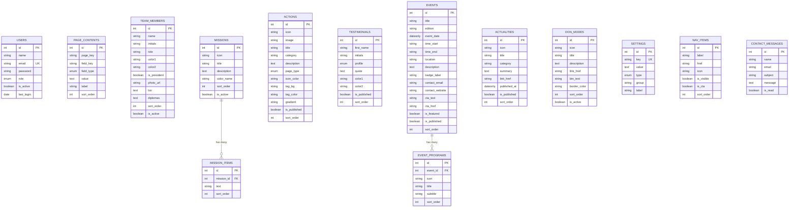
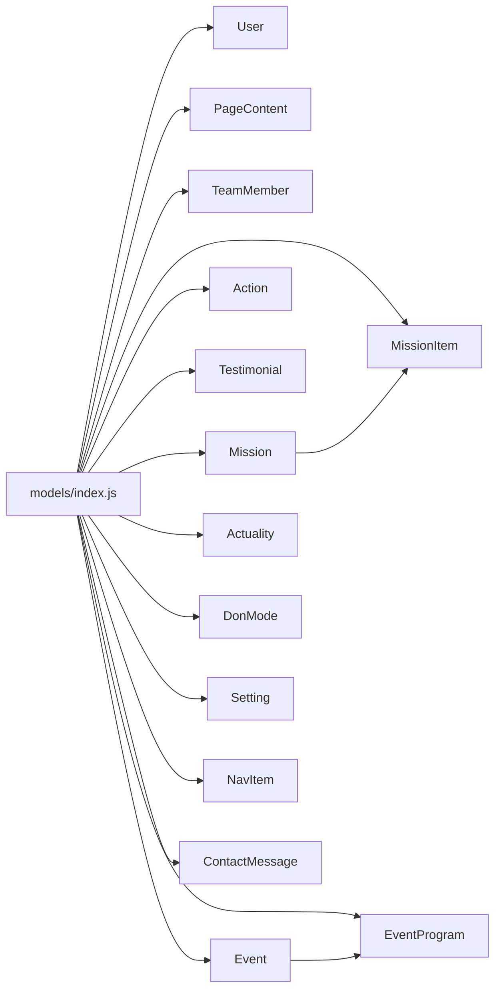
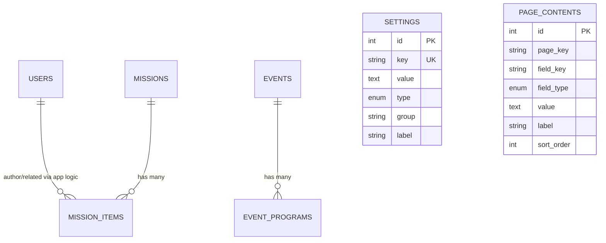

# Database Schema Design

<cite>
**Referenced Files in This Document**
- [database.js](file://rsf-backend/config/database.js)
- [index.js](file://rsf-backend/models/index.js)
- [User.js](file://rsf-backend/models/User.js)
- [PageContent.js](file://rsf-backend/models/PageContent.js)
- [TeamMember.js](file://rsf-backend/models/TeamMember.js)
- [Mission.js](file://rsf-backend/models/Mission.js)
- [MissionItem.js](file://rsf-backend/models/MissionItem.js)
- [Event.js](file://rsf-backend/models/Event.js)
- [EventProgram.js](file://rsf-backend/models/EventProgram.js)
- [Actuality.js](file://rsf-backend/models/Actuality.js)
- [Action.js](file://rsf-backend/models/Action.js)
- [Testimonial.js](file://rsf-backend/models/Testimonial.js)
- [DonMode.js](file://rsf-backend/models/DonMode.js)
- [Setting.js](file://rsf-backend/models/Setting.js)
- [NavItem.js](file://rsf-backend/models/NavItem.js)
- [ContactMessage.js](file://rsf-backend/models/ContactMessage.js)
</cite>

## Table of Contents
1. [Introduction](#introduction)
2. [Project Structure](#project-structure)
3. [Core Components](#core-components)
4. [Architecture Overview](#architecture-overview)
5. [Detailed Component Analysis](#detailed-component-analysis)
6. [Dependency Analysis](#dependency-analysis)
7. [Performance Considerations](#performance-considerations)
8. [Troubleshooting Guide](#troubleshooting-guide)
9. [Conclusion](#conclusion)
10. [Appendices](#appendices)

## Introduction
This document describes the database schema and multi-database support for the Réseau Solidarité France platform built with Sequelize ORM. It covers configuration for SQLite, MySQL, and PostgreSQL, the complete entity model (including Users, dynamic PageContent, TeamMember profiles, Mission hierarchy, Event scheduling, and related content types), association patterns, foreign keys, indexing strategies, and constraints. It also outlines migration and schema evolution capabilities, and provides guidance for extending the schema while maintaining backward compatibility.

## Project Structure
The database layer is organized around a central Sequelize configuration and a model registry with explicit associations. The configuration supports three SQL dialects and applies common Sequelize options such as underscored column names, automatic timestamps, and optional soft deletes.

**Diagram sources**
- [database.js:1-69](file://rsf-backend/config/database.js#L1-L69)
- [index.js:1-53](file://rsf-backend/models/index.js#L1-L53)

**Section sources**
- [database.js:1-69](file://rsf-backend/config/database.js#L1-L69)
- [index.js:1-53](file://rsf-backend/models/index.js#L1-L53)

## Core Components
- Multi-database configuration: SQLite (default), MySQL/MariaDB, and PostgreSQL are supported via environment variables. Logging is enabled in development mode.
- Centralized model registry: All models are imported and exported from a single index file, which also defines associations.
- Validation and constraints: Sequelize validators enforce data integrity at the ORM level (e.g., email format, length limits, enums).
- Indexes: Strategic indexes are defined per model to optimize common queries (e.g., unique page/field keys, page_key lookup, contact read status).
- Hooks: Password hashing is handled via Sequelize hooks before create/update.

**Section sources**
- [database.js:9-66](file://rsf-backend/config/database.js#L9-L66)
- [index.js:5-52](file://rsf-backend/models/index.js#L5-L52)
- [User.js:12-38](file://rsf-backend/models/User.js#L12-L38)
- [PageContent.js:41-44](file://rsf-backend/models/PageContent.js#L41-L44)
- [ContactMessage.js:14](file://rsf-backend/models/ContactMessage.js#L14)

## Architecture Overview
The schema centers on editable content and administrative entities, with hierarchical and one-to-many relationships. Associations are declared centrally to keep coupling low and enable maintainable refactoring.

**Diagram sources**
- [index.js:24-30](file://rsf-backend/models/index.js#L24-L30)
- [Mission.js:5-13](file://rsf-backend/models/Mission.js#L5-L13)
- [MissionItem.js:5-10](file://rsf-backend/models/MissionItem.js#L5-L10)
- [Event.js:5-22](file://rsf-backend/models/Event.js#L5-L22)
- [EventProgram.js:5-12](file://rsf-backend/models/EventProgram.js#L5-L12)

## Detailed Component Analysis

### Multi-database Support and Configuration
- Dialect selection is controlled by an environment variable with defaults to SQLite. MySQL/MariaDB and PostgreSQL are supported via standard connection parameters.
- SQLite uses a local storage path with automatic directory creation.
- Connection pooling is configured for MySQL/PostgreSQL.
- Logging is toggled based on NODE_ENV.

Operational guidance:
- Set DB_DIALECT to sqlite, mysql, or postgres.
- Provide credentials and host/port for non-SQLite dialects.
- Use DB_STORAGE for SQLite to control the database file location.

**Section sources**
- [database.js:9-66](file://rsf-backend/config/database.js#L9-L66)

### User Management
- Fields include identity, authentication, role, activity status, and last login.
- Unique index on email ensures uniqueness.
- Hooks hash passwords before create/update; safe serialization excludes sensitive fields.

Validation and constraints:
- Name length validated.
- Email validated and unique.
- Role constrained to predefined values.
- Boolean flags for activity and login tracking.

Security note:
- Passwords are hashed using bcrypt in hooks; never store plaintext.

**Section sources**
- [User.js:12-38](file://rsf-backend/models/User.js#L12-L38)
- [User.js:47-60](file://rsf-backend/models/User.js#L47-L60)

### Dynamic Page Content System
- Stores editable content keyed by page and field.
- Composite unique index on page_key and field_key prevents duplicates.
- Optional label and ordering for CMS-like editing.

Usage pattern:
- Retrieve by page_key and field_key combination.
- Paginate or filter by page_key for rendering.

**Section sources**
- [PageContent.js:12-38](file://rsf-backend/models/PageContent.js#L12-L38)
- [PageContent.js:41-44](file://rsf-backend/models/PageContent.js#L41-L44)

### TeamMember Profiles
- Profile fields include personal info, roles, branding colors, photo, biography, and optional diplomas stored as JSON.
- Sort order and activity flag support presentation controls.

Data handling:
- JSON parsing/setter for diplomas ensures robust storage/retrieval.

**Section sources**
- [TeamMember.js:5-34](file://rsf-backend/models/TeamMember.js#L5-L34)

### Mission Hierarchies
- Mission defines top-level goals with metadata and ordering.
- MissionItem items belong to a Mission with text content and ordering.
- Association cascade deletion ensures cleanup when a Mission is removed.

**Section sources**
- [index.js:24-26](file://rsf-backend/models/index.js#L24-L26)
- [Mission.js:5-13](file://rsf-backend/models/Mission.js#L5-L13)
- [MissionItem.js:5-10](file://rsf-backend/models/MissionItem.js#L5-L10)

### Event Scheduling and Programs
- Event captures scheduling, location, CTA, publication flags, and ordering.
- EventProgram defines daily schedule items linked to an Event.
- Association cascade deletion maintains referential integrity.

Indexing:
- Events benefit from date and publication filters; consider adding indexes on event_date and is_published if queries grow.

**Section sources**
- [index.js:28-30](file://rsf-backend/models/index.js#L28-L30)
- [Event.js:5-22](file://rsf-backend/models/Event.js#L5-L22)
- [EventProgram.js:5-12](file://rsf-backend/models/EventProgram.js#L5-L12)

### Additional Content Types
- Actions: categorized action cards with icons, colors, gradients, and publication flags.
- Testimonials: quoted testimonials with profile categories and colors.
- Actualities: news items with categories, summaries, and publication dates.
- Don Modes: donation options with links and visual attributes.
- Settings: global key/value store with typed values and grouping.
- Navigation Items: menu entries with visibility and CTA flags.
- Contact Messages: inbound messages with read status and timestamps.

Constraints and validations:
- Enums constrain values for roles/profiles/page types.
- Email validation on users and contacts.
- Date-only fields for event and news publication dates.
- Unique keys for settings and page content.

**Section sources**
- [Action.js:5-19](file://rsf-backend/models/Action.js#L5-L19)
- [Testimonial.js:5-15](file://rsf-backend/models/Testimonial.js#L5-L15)
- [Actuality.js:5-15](file://rsf-backend/models/Actuality.js#L5-L15)
- [DonMode.js:5-15](file://rsf-backend/models/DonMode.js#L5-L15)
- [Setting.js:6-13](file://rsf-backend/models/Setting.js#L6-L13)
- [NavItem.js:5-13](file://rsf-backend/models/NavItem.js#L5-L13)
- [ContactMessage.js:5-15](file://rsf-backend/models/ContactMessage.js#L5-L15)

## Dependency Analysis
The model registry imports all models and declares associations in a single place. This minimizes coupling and centralizes relationship definitions.

**Diagram sources**
- [index.js:5-52](file://rsf-backend/models/index.js#L5-L52)

**Section sources**
- [index.js:24-30](file://rsf-backend/models/index.js#L24-L30)

## Performance Considerations
- Indexes:
  - PageContent: unique composite index on page_key and field_key; single-column index on page_key for filtering.
  - ContactMessage: indexes on is_read and created_at to accelerate listing unread messages and chronological sorting.
  - User: unique index on email for fast lookup and uniqueness.
- Timestamps: createdAt/updatedAt are enabled globally; ensure appropriate indexes on time-based queries if needed.
- Pooling: MySQL/PostgreSQL configurations include connection pooling; tune max/min/idle/acquire based on workload.
- Storage: SQLite storage path is configurable; ensure adequate disk space and permissions.

[No sources needed since this section provides general guidance]

## Troubleshooting Guide
Common issues and resolutions:
- Unsupported dialect: Ensure DB_DIALECT is set to sqlite, mysql, or postgres. The configuration throws an error for unsupported values.
- SQLite file path: Verify DB_STORAGE exists and is writable; the configuration creates the directory automatically.
- Email validation failures: Confirm email format matches standard patterns; validations are enforced at the ORM level.
- Unique constraint violations: Check unique indexes (email, page_key+field_key, setting key) and adjust inputs accordingly.
- Password hashing: Hooks handle bcrypt hashing; avoid storing plaintext passwords manually.

**Section sources**
- [database.js:64-66](file://rsf-backend/config/database.js#L64-L66)
- [User.js:17-22](file://rsf-backend/models/User.js#L17-L22)
- [PageContent.js:42](file://rsf-backend/models/PageContent.js#L42)
- [Setting.js:13](file://rsf-backend/models/Setting.js#L13)

## Conclusion
The schema provides a solid foundation for the Réseau Solidarité France platform with clear separation of concerns, strong validation, and flexible multi-database support. Associations are centralized, and indexes target common query patterns. Extending the schema follows established patterns: add a model with constraints and indexes, register it in the model index, and declare associations centrally.

[No sources needed since this section summarizes without analyzing specific files]

## Appendices

### Migration and Schema Evolution
- Sequelize migrations: Use Sequelize CLI to generate and run migrations for schema changes. Keep migrations minimal and reversible where possible.
- Seeders: Populate initial data (e.g., default settings, admin user) via seeders executed after migrations.
- Versioning: Tag migrations with semantic versioning and document breaking changes.
- Backward compatibility: Add new columns with defaults, avoid dropping columns, and use nullable fields when migrating existing data.

[No sources needed since this section provides general guidance]

### Entity Relationship Diagram (ERD)

**Diagram sources**
- [index.js:24-30](file://rsf-backend/models/index.js#L24-L30)
- [Setting.js:6-13](file://rsf-backend/models/Setting.js#L6-L13)
- [PageContent.js:12-38](file://rsf-backend/models/PageContent.js#L12-L38)