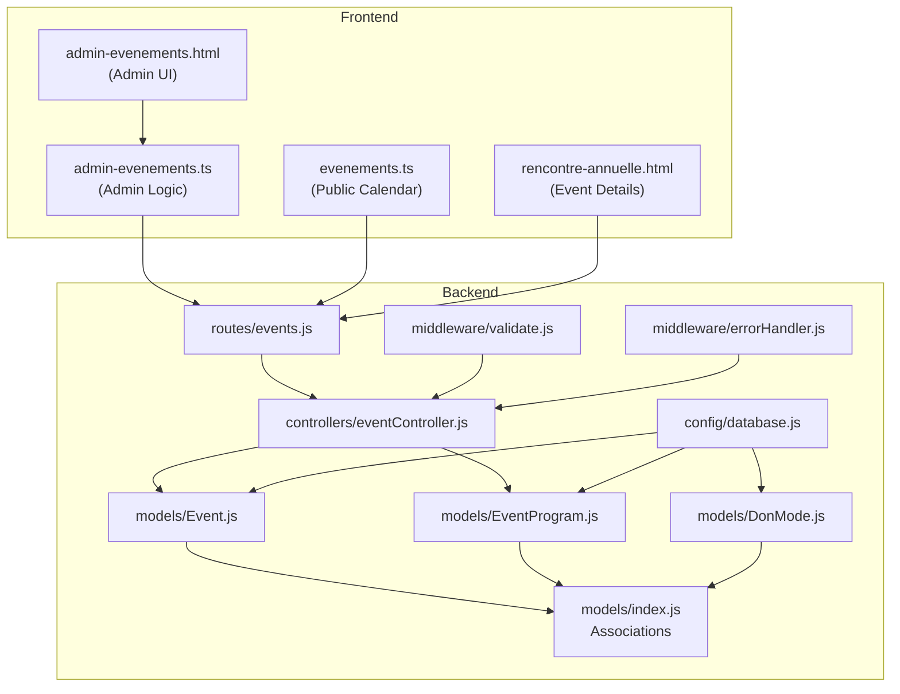
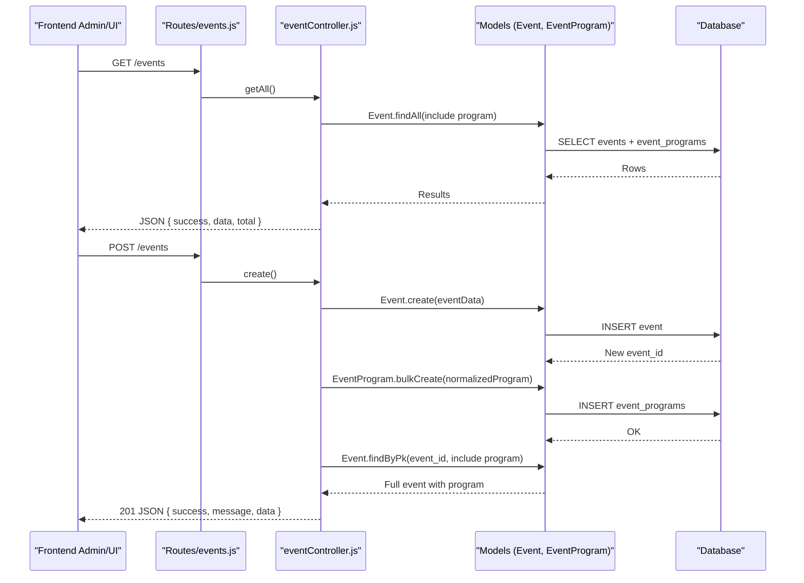
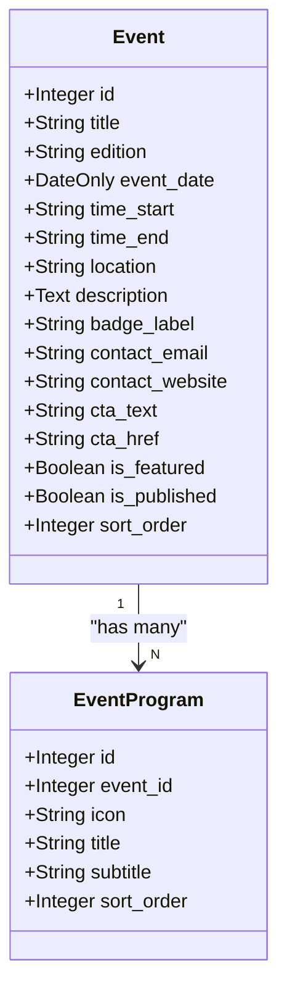
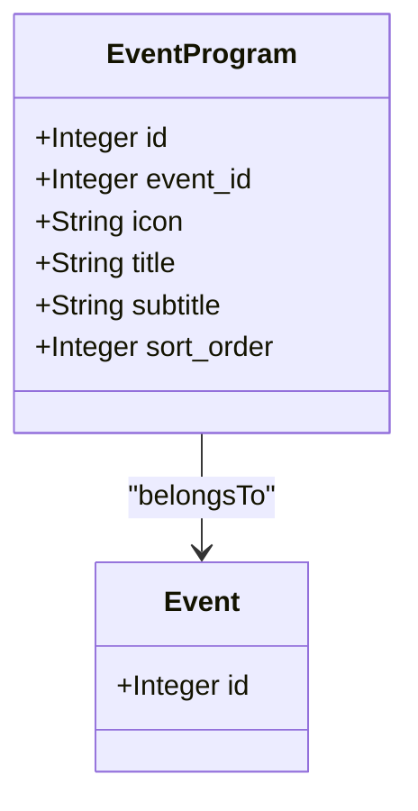
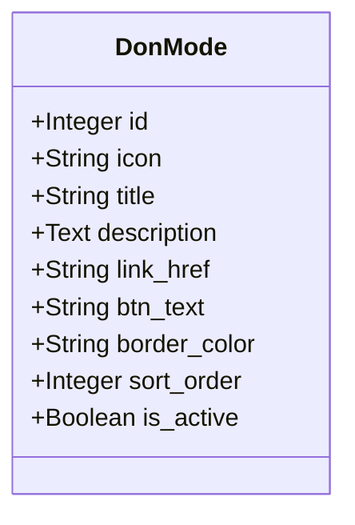
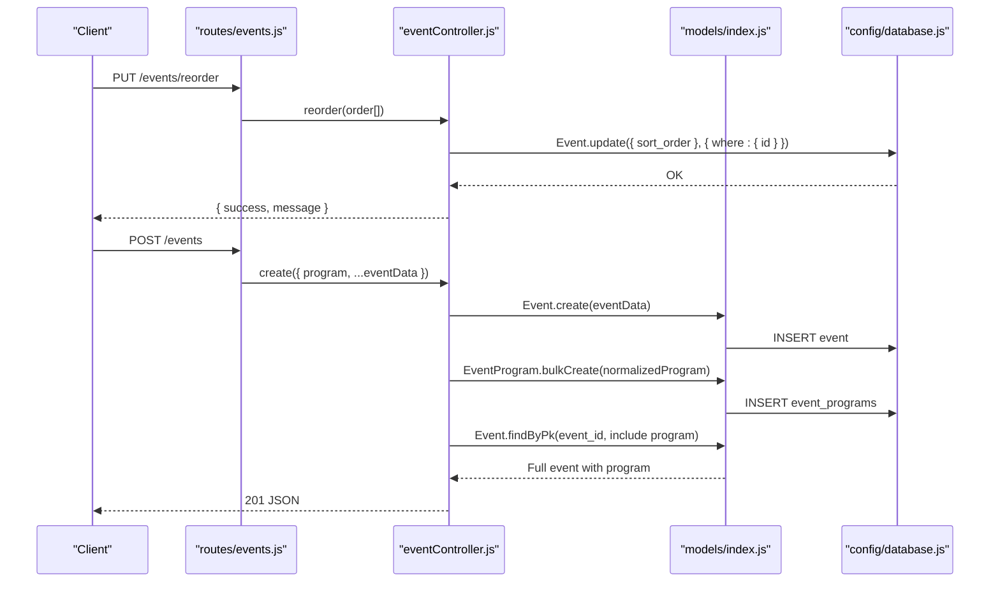
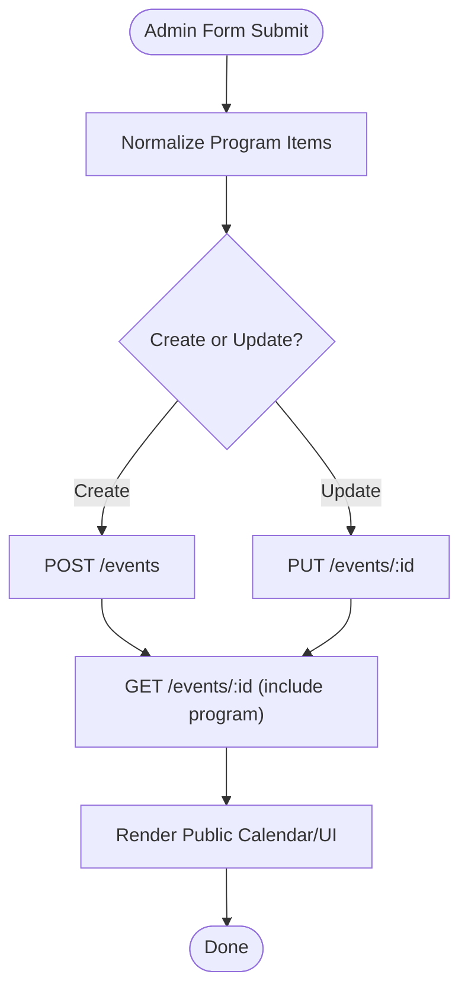
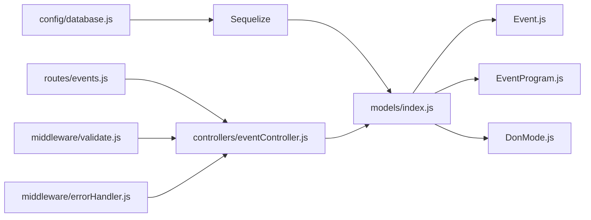

# Event and Calendar Models

<cite>
**Referenced Files in This Document**
- [Event.js](file://rsf-backend/models/Event.js)
- [EventProgram.js](file://rsf-backend/models/EventProgram.js)
- [DonMode.js](file://rsf-backend/models/DonMode.js)
- [index.js](file://rsf-backend/models/index.js)
- [eventController.js](file://rsf-backend/controllers/eventController.js)
- [events.js](file://rsf-backend/routes/events.js)
- [validate.js](file://rsf-backend/middleware/validate.js)
- [errorHandler.js](file://rsf-backend/middleware/errorHandler.js)
- [database.js](file://rsf-backend/config/database.js)
- [admin-evenements.html](file://rsf-front/src/app/admin/admin-evenements/admin-evenements.html)
- [admin-evenements.ts](file://rsf-front/src/app/admin/admin-evenements/admin-evenements.ts)
- [evenements.ts](file://rsf-front/src/app/utilisateurs/evenements/evenements.ts)
- [rencontre-annuelle.html](file://rsf-front/src/app/utilisateurs/rencontre-annuelle/rencontre-annuelle.html)
</cite>

## Table of Contents
1. [Introduction](#introduction)
2. [Project Structure](#project-structure)
3. [Core Components](#core-components)
4. [Architecture Overview](#architecture-overview)
5. [Detailed Component Analysis](#detailed-component-analysis)
6. [Dependency Analysis](#dependency-analysis)
7. [Performance Considerations](#performance-considerations)
8. [Troubleshooting Guide](#troubleshooting-guide)
9. [Conclusion](#conclusion)

## Introduction
This document provides comprehensive documentation for the event management and calendar data models used in the Réseau Solidarité France platform. It focuses on three primary models:
- Event: Manages calendar events, scheduling, location details, and registration call-to-action (CTA) links.
- EventProgram: Defines daily event programs, activity schedules, and time-slot management.
- DonMode: Handles donation payment options, amount configurations, and payment method integrations.

The documentation covers field specifications, validation rules, business logic for event scheduling and ordering, and the relationships between events and their associated programs. It also explains how these models support the public event calendar and admin scheduling interfaces.

## Project Structure
The event-related models and their supporting infrastructure are organized as follows:
- Backend models define the database schema for Events, EventPrograms, and DonModes.
- Associations connect Events to their associated EventPrograms.
- Controllers handle CRUD operations and program normalization.
- Routes expose REST endpoints for event management.
- Middleware provides validation and error handling.
- Frontend components consume the backend APIs to render the public calendar and admin interfaces.

**Diagram sources**
- [Event.js:1-25](file://rsf-backend/models/Event.js#L1-L25)
- [EventProgram.js:1-15](file://rsf-backend/models/EventProgram.js#L1-L15)
- [DonMode.js:1-18](file://rsf-backend/models/DonMode.js#L1-L18)
- [index.js:28-30](file://rsf-backend/models/index.js#L28-L30)
- [eventController.js:1-126](file://rsf-backend/controllers/eventController.js#L1-L126)
- [events.js:1-12](file://rsf-backend/routes/events.js#L1-L12)
- [validate.js:1-22](file://rsf-backend/middleware/validate.js#L1-L22)
- [errorHandler.js:1-38](file://rsf-backend/middleware/errorHandler.js#L1-L38)
- [database.js:1-69](file://rsf-backend/config/database.js#L1-L69)
- [admin-evenements.html:24-33](file://rsf-front/src/app/admin/admin-evenements/admin-evenements.html#L24-L33)
- [admin-evenements.ts:1-75](file://rsf-front/src/app/admin/admin-evenements/admin-evenements.ts#L1-L75)
- [evenements.ts:45-76](file://rsf-front/src/app/utilisateurs/evenements/evenements.ts#L45-L76)
- [rencontre-annuelle.html:31-59](file://rsf-front/src/app/utilisateurs/rencontre-annuelle/rencontre-annuelle.html#L31-L59)

**Section sources**
- [Event.js:1-25](file://rsf-backend/models/Event.js#L1-L25)
- [EventProgram.js:1-15](file://rsf-backend/models/EventProgram.js#L1-L15)
- [DonMode.js:1-18](file://rsf-backend/models/DonMode.js#L1-L18)
- [index.js:28-30](file://rsf-backend/models/index.js#L28-L30)
- [eventController.js:1-126](file://rsf-backend/controllers/eventController.js#L1-L126)
- [events.js:1-12](file://rsf-backend/routes/events.js#L1-L12)
- [validate.js:1-22](file://rsf-backend/middleware/validate.js#L1-L22)
- [errorHandler.js:1-38](file://rsf-backend/middleware/errorHandler.js#L1-L38)
- [database.js:1-69](file://rsf-backend/config/database.js#L1-L69)
- [admin-evenements.html:24-33](file://rsf-front/src/app/admin/admin-evenements/admin-evenements.html#L24-L33)
- [admin-evenements.ts:1-75](file://rsf-front/src/app/admin/admin-evenements/admin-evenements.ts#L1-L75)
- [evenements.ts:45-76](file://rsf-front/src/app/utilisateurs/evenements/evenements.ts#L45-L76)
- [rencontre-annuelle.html:31-59](file://rsf-front/src/app/utilisateurs/rencontre-annuelle/rencontre-annuelle.html#L31-L59)

## Core Components
This section documents the three core models and their roles in the event management system.

### Event Model
The Event model defines the structure for calendar events, including scheduling, location, and registration CTA fields.

- Primary key: id (auto-increment integer)
- Fields:
  - title: String (up to 300 characters), required
  - edition: String (up to 50 characters), optional
  - event_date: DateOnly, required
  - time_start: String (HH:MM), optional, default '10:00'
  - time_end: String (HH:MM), optional, default '22:00'
  - location: String (up to 300 characters), required
  - description: Text, optional
  - badge_label: String (up to 100 characters), optional
  - contact_email: String (up to 255 characters), optional
  - contact_website: String (up to 255 characters), optional
  - cta_text: String (up to 100 characters), default 'Je participe →'
  - cta_href: String (up to 255 characters), default 'nous-rejoindre.html'
  - is_featured: Boolean, default false
  - is_published: Boolean, default true
  - sort_order: Integer, default 0

Validation and defaults:
- Required fields enforced by model definition.
- Default values ensure sensible scheduling and presentation defaults.
- Ordering is controlled via sort_order for consistent display.

Business logic:
- Events are ordered by sort_order ascending in listings.
- Program items are included via association and ordered by sort_order ascending.

**Section sources**
- [Event.js:5-22](file://rsf-backend/models/Event.js#L5-L22)
- [index.js:28-30](file://rsf-backend/models/index.js#L28-L30)
- [eventController.js:4-4](file://rsf-backend/controllers/eventController.js#L4-L4)

### EventProgram Model
The EventProgram model stores daily activity schedules and time slots associated with an event.

- Primary key: id (auto-increment integer)
- Foreign key: event_id (integer, required)
- Fields:
  - icon: String (up to 100 characters), default 'fas fa-bullseye'
  - title: String (up to 200 characters), required
  - subtitle: String (up to 200 characters), optional
  - sort_order: Integer, default 0

Validation and defaults:
- Required fields enforced by model definition.
- Default icon ensures visual consistency when unspecified.
- sort_order controls chronological presentation.

Business logic:
- Programs are ordered by sort_order ascending.
- Programs are normalized during creation/update to ensure consistent structure and sequential sort_order.

**Section sources**
- [EventProgram.js:5-12](file://rsf-backend/models/EventProgram.js#L5-L12)
- [index.js:29-30](file://rsf-backend/models/index.js#L29-L30)
- [eventController.js:6-14](file://rsf-backend/controllers/eventController.js#L6-L14)

### DonMode Model
The DonMode model manages donation payment options and method integrations.

- Primary key: id (auto-increment integer)
- Fields:
  - icon: String (up to 100 characters), default 'fas fa-heart'
  - title: String (up to 200 characters), required
  - description: Text, required
  - link_href: String (up to 255 characters), optional
  - btn_text: String (up to 100 characters), default 'En savoir plus'
  - border_color: String (up to 20 characters), default '#2F5DFF'
  - sort_order: Integer, default 0
  - is_active: Boolean, default true

Validation and defaults:
- Required fields enforced by model definition.
- Default icon and button text provide consistent UX.
- is_active enables/disables payment options without deletion.

Business logic:
- Active options are presented in the donation interface.
- Ordering is controlled via sort_order for consistent display.

**Section sources**
- [DonMode.js:5-15](file://rsf-backend/models/DonMode.js#L5-L15)

## Architecture Overview
The event management architecture connects frontend UIs to backend models and controllers through REST endpoints. Associations ensure that events include their associated programs, and controllers normalize program data to maintain consistent structure.

**Diagram sources**
- [events.js:4-9](file://rsf-backend/routes/events.js#L4-L9)
- [eventController.js:16-58](file://rsf-backend/controllers/eventController.js#L16-L58)
- [Event.js:5-22](file://rsf-backend/models/Event.js#L5-L22)
- [EventProgram.js:5-12](file://rsf-backend/models/EventProgram.js#L5-L12)
- [index.js:28-30](file://rsf-backend/models/index.js#L28-L30)

## Detailed Component Analysis

### Event Model Analysis
The Event model encapsulates all event metadata and presentation fields. It integrates with the EventProgram association to provide a complete event record including its daily schedule.

**Diagram sources**
- [Event.js:5-22](file://rsf-backend/models/Event.js#L5-L22)
- [EventProgram.js:5-12](file://rsf-backend/models/EventProgram.js#L5-L12)
- [index.js:28-30](file://rsf-backend/models/index.js#L28-L30)

Field specifications and defaults:
- Title and location are required for visibility and usability.
- Time defaults ensure reasonable scheduling when not specified.
- CTA fields enable direct registration links.
- Publishing flags control visibility and feature status.

Validation rules:
- Required fields are enforced by the model definition.
- Default values prevent null values for scheduling and presentation.

Business logic:
- Events are sorted by sort_order for consistent display.
- Programs are included and ordered by sort_order ascending.

**Section sources**
- [Event.js:5-22](file://rsf-backend/models/Event.js#L5-L22)
- [index.js:28-30](file://rsf-backend/models/index.js#L28-L30)
- [eventController.js:4-4](file://rsf-backend/controllers/eventController.js#L4-L4)

### EventProgram Model Analysis
The EventProgram model defines daily activities and time slots. It maintains a strict ordering and provides icons for visual cues.

**Diagram sources**
- [EventProgram.js:5-12](file://rsf-backend/models/EventProgram.js#L5-L12)
- [index.js:29-30](file://rsf-backend/models/index.js#L29-L30)

Normalization logic:
- During create/update, programs are normalized to ensure:
  - Presence of icon/title/subtitle fields
  - Sequential sort_order based on input array position
- This guarantees consistent rendering and prevents partial or empty entries.

**Section sources**
- [EventProgram.js:5-12](file://rsf-backend/models/EventProgram.js#L5-L12)
- [eventController.js:6-14](file://rsf-backend/controllers/eventController.js#L6-L14)

### DonMode Model Analysis
The DonMode model supports donation options with flexible presentation and integration fields.

**Diagram sources**
- [DonMode.js:5-15](file://rsf-backend/models/DonMode.js#L5-L15)

Business logic:
- is_active controls whether options appear in the donation interface.
- sort_order determines presentation order.
- link_href enables external payment integrations.

**Section sources**
- [DonMode.js:5-15](file://rsf-backend/models/DonMode.js#L5-L15)

### Controller and Route Flow
The event controller orchestrates CRUD operations and program normalization. Routes expose endpoints for listing, retrieving, creating, updating, deleting, and reordering events.

**Diagram sources**
- [events.js:7-8](file://rsf-backend/routes/events.js#L7-L8)
- [eventController.js:110-123](file://rsf-backend/controllers/eventController.js#L110-L123)
- [eventController.js:42-58](file://rsf-backend/controllers/eventController.js#L42-L58)
- [index.js:13-14](file://rsf-backend/models/index.js#L13-L14)
- [database.js:1-69](file://rsf-backend/config/database.js#L1-L69)

**Section sources**
- [eventController.js:16-123](file://rsf-backend/controllers/eventController.js#L16-L123)
- [events.js:1-12](file://rsf-backend/routes/events.js#L1-L12)

### Frontend Integration
The frontend admin and public components integrate with the backend APIs to manage and present events.

Admin interface:
- AdminEvenements component lists, creates, updates, and deletes events.
- Form fields map to Event model fields for editing.

Public calendar:
- Evenements service normalizes event data and sorts programs by sort_order.
- RencontreAnnuelle page renders event details including location, date, time range, and program list.

**Diagram sources**
- [admin-evenements.ts:43-57](file://rsf-front/src/app/admin/admin-evenements/admin-evenements.ts#L43-L57)
- [evenements.ts:6-14](file://rsf-backend/controllers/eventController.js#L6-L14)
- [rencontre-annuelle.html:31-59](file://rsf-front/src/app/utilisateurs/rencontre-annuelle/rencontre-annuelle.html#L31-L59)

**Section sources**
- [admin-evenements.html:24-33](file://rsf-front/src/app/admin/admin-evenements/admin-evenements.html#L24-L33)
- [admin-evenements.ts:1-75](file://rsf-front/src/app/admin/admin-evenements/admin-evenements.ts#L1-L75)
- [evenements.ts:69-76](file://rsf-front/src/app/utilisateurs/evenements/evenements.ts#L69-L76)
- [rencontre-annuelle.html:31-59](file://rsf-front/src/app/utilisateurs/rencontre-annuelle/rencontre-annuelle.html#L31-L59)

## Dependency Analysis
The models and controllers depend on Sequelize for ORM, Express for routing, and middleware for validation and error handling. Associations define the relationship between Event and EventProgram.

**Diagram sources**
- [database.js:1-69](file://rsf-backend/config/database.js#L1-L69)
- [index.js:1-53](file://rsf-backend/models/index.js#L1-L53)
- [Event.js:1-25](file://rsf-backend/models/Event.js#L1-L25)
- [EventProgram.js:1-15](file://rsf-backend/models/EventProgram.js#L1-L15)
- [DonMode.js:1-18](file://rsf-backend/models/DonMode.js#L1-L18)
- [eventController.js:1-126](file://rsf-backend/controllers/eventController.js#L1-L126)
- [events.js:1-12](file://rsf-backend/routes/events.js#L1-L12)
- [validate.js:1-22](file://rsf-backend/middleware/validate.js#L1-L22)
- [errorHandler.js:1-38](file://rsf-backend/middleware/errorHandler.js#L1-L38)

**Section sources**
- [index.js:28-30](file://rsf-backend/models/index.js#L28-L30)
- [eventController.js:1-126](file://rsf-backend/controllers/eventController.js#L1-L126)
- [events.js:1-12](file://rsf-backend/routes/events.js#L1-L12)
- [validate.js:1-22](file://rsf-backend/middleware/validate.js#L1-L22)
- [errorHandler.js:1-38](file://rsf-backend/middleware/errorHandler.js#L1-L38)

## Performance Considerations
- Association inclusion: The controller includes EventPrograms for all queries, which can increase payload size. Consider lazy loading or pagination for large datasets.
- Bulk operations: Program creation uses bulk inserts to minimize round-trips.
- Sorting: sort_order is used for efficient client-side sorting and consistent display.
- Database dialect: The configuration supports SQLite, MySQL, and PostgreSQL. Choose the appropriate dialect for production scale and performance characteristics.

[No sources needed since this section provides general guidance]

## Troubleshooting Guide
Common issues and resolutions:
- Validation errors: The validation middleware returns structured 422 responses with field-specific messages. Review the errors array to identify missing or invalid fields.
- Not found errors: The controller throws a custom error when an event is not found, returning a 404 response.
- Database constraint errors: Sequelize validation and unique constraint errors are caught and returned with detailed field information.
- Program normalization: Ensure program arrays include at least one of icon, title, or subtitle; otherwise, items are filtered out.

**Section sources**
- [validate.js:9-18](file://rsf-backend/middleware/validate.js#L9-L18)
- [errorHandler.js:8-14](file://rsf-backend/middleware/errorHandler.js#L8-L14)
- [eventController.js:32-34](file://rsf-backend/controllers/eventController.js#L32-L34)
- [eventController.js:69-71](file://rsf-backend/controllers/eventController.js#L69-L71)

## Conclusion
The event management system combines robust data models with clear business logic to support both public calendars and admin scheduling. The Event model captures essential scheduling and presentation details, while the EventProgram model organizes daily activities with consistent ordering and normalization. The DonMode model provides flexible donation options with activation controls and presentation fields. Associations and controllers ensure seamless integration between frontend and backend, enabling efficient management and display of events across the platform.