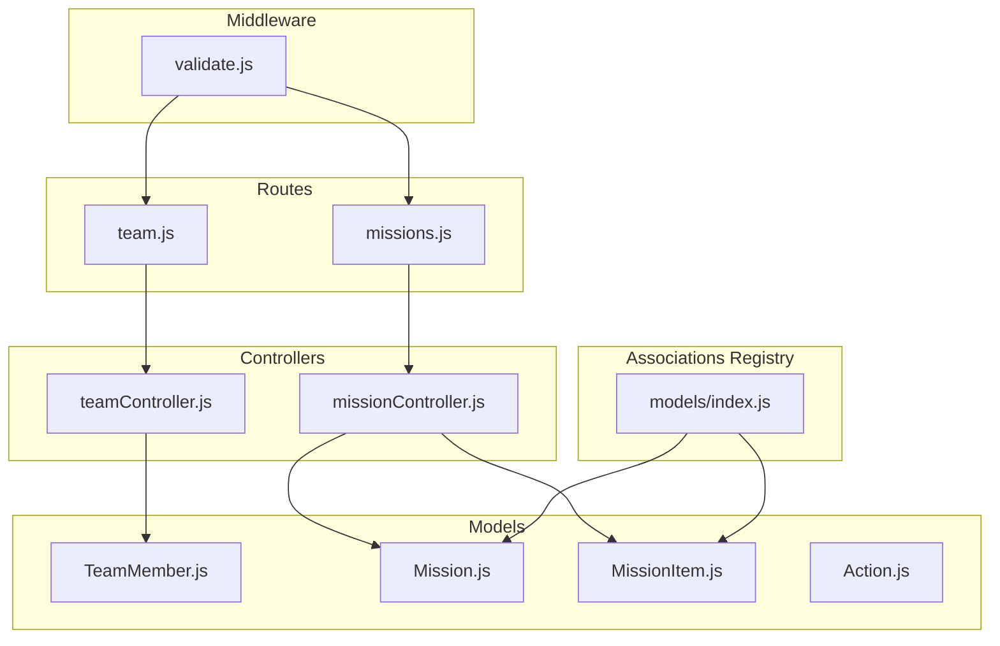
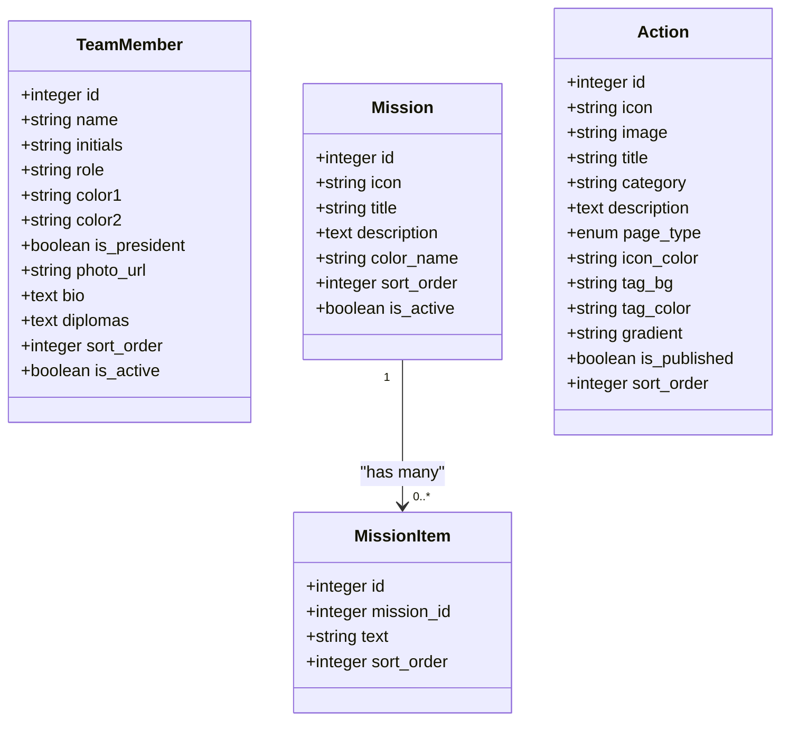
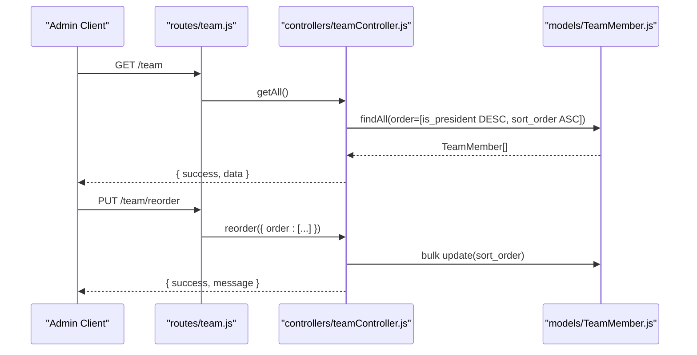
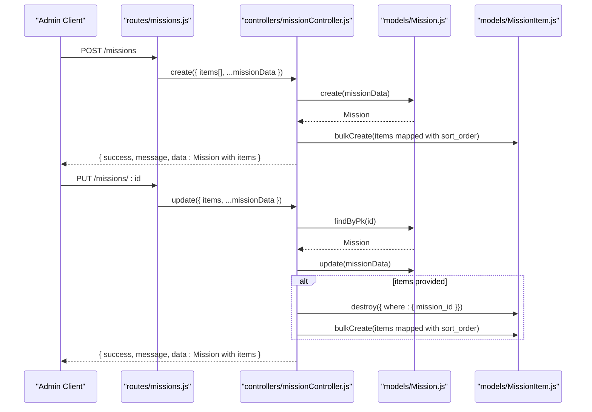
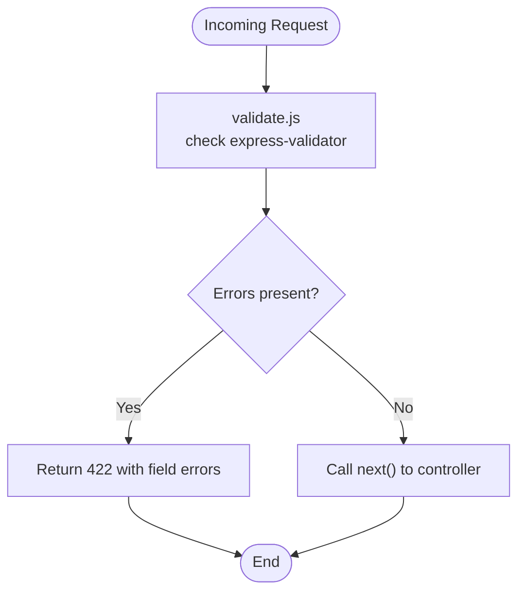
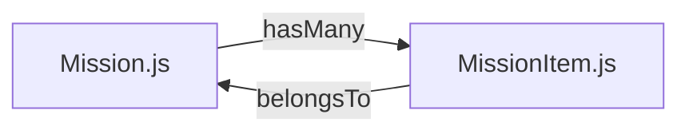

# Organizational Structure Models

<cite>
**Referenced Files in This Document**
- [TeamMember.js](file://rsf-backend/models/TeamMember.js)
- [Mission.js](file://rsf-backend/models/Mission.js)
- [MissionItem.js](file://rsf-backend/models/MissionItem.js)
- [Action.js](file://rsf-backend/models/Action.js)
- [teamController.js](file://rsf-backend/controllers/teamController.js)
- [missionController.js](file://rsf-backend/controllers/missionController.js)
- [team.js](file://rsf-backend/routes/team.js)
- [missions.js](file://rsf-backend/routes/missions.js)
- [index.js](file://rsf-backend/models/index.js)
- [validate.js](file://rsf-backend/middleware/validate.js)
</cite>

## Table of Contents
1. [Introduction](#introduction)
2. [Project Structure](#project-structure)
3. [Core Components](#core-components)
4. [Architecture Overview](#architecture-overview)
5. [Detailed Component Analysis](#detailed-component-analysis)
6. [Dependency Analysis](#dependency-analysis)
7. [Performance Considerations](#performance-considerations)
8. [Troubleshooting Guide](#troubleshooting-guide)
9. [Conclusion](#conclusion)

## Introduction
This document describes the organizational structure data models that power Réseau Solidarité France’s public website and administrative interface. It focuses on:
- TeamMember: leadership and staff profiles with display controls and ordering
- Mission: core organizational goals and statements
- MissionItem: hierarchical mission items supporting progress tracking
- Action: solidarity and international action programs

It explains hierarchical relationships, category classifications, display ordering, validation rules, and content management features. It also illustrates how these models support the public website’s organizational presentation.

## Project Structure
The backend organizes models, controllers, routes, and middleware under rsf-backend. Models define the schema and relationships; controllers implement CRUD and ordering operations; routes expose endpoints; middleware validates inputs; and the central models registry defines associations.

**Diagram sources**
- [team.js:1-13](file://rsf-backend/routes/team.js#L1-L13)
- [missions.js:1-13](file://rsf-backend/routes/missions.js#L1-L13)
- [teamController.js:1-57](file://rsf-backend/controllers/teamController.js#L1-L57)
- [missionController.js:1-74](file://rsf-backend/controllers/missionController.js#L1-L74)
- [TeamMember.js:1-37](file://rsf-backend/models/TeamMember.js#L1-L37)
- [Mission.js:1-16](file://rsf-backend/models/Mission.js#L1-L16)
- [MissionItem.js:1-13](file://rsf-backend/models/MissionItem.js#L1-L13)
- [Action.js:1-22](file://rsf-backend/models/Action.js#L1-L22)
- [index.js:1-53](file://rsf-backend/models/index.js#L1-L53)
- [validate.js:1-22](file://rsf-backend/middleware/validate.js#L1-L22)

**Section sources**
- [team.js:1-13](file://rsf-backend/routes/team.js#L1-L13)
- [missions.js:1-13](file://rsf-backend/routes/missions.js#L1-L13)
- [index.js:1-53](file://rsf-backend/models/index.js#L1-L53)

## Core Components
This section documents each model’s schema, validation rules, and content management features.

### TeamMember Model
Purpose: Store leadership and staff profiles with display attributes and ordering.

Key attributes and behaviors:
- Identification: integer primary key with auto-increment
- Personal info: name, initials, role
- Visual identity: two color fields for gradients, optional photo URL
- Content: biography and structured diplomas stored as JSON array with getter/setter helpers
- Organization: president flag, activity toggle, and sort order for display
- Ordering: controlled via dedicated endpoint

Validation and constraints:
- Non-empty name, initials, and role enforced by model definition
- Optional photo URL and biography
- Diplomas stored as JSON with robust parsing

Display and ordering:
- Public presentation orders by president first, then ascending sort order
- Administrative reordering supported via batch update endpoint

**Section sources**
- [TeamMember.js:1-37](file://rsf-backend/models/TeamMember.js#L1-L37)
- [teamController.js:1-57](file://rsf-backend/controllers/teamController.js#L1-L57)

### Mission Model
Purpose: Define core organizational goals with visual and ordering metadata.

Key attributes and behaviors:
- Identification: integer primary key with auto-increment
- Presentation: icon, title, optional description
- Theming: color name with predefined semantic values
- Organization: sort order and activation flag
- Hierarchical relationship: Mission has many MissionItems

Validation and constraints:
- Non-empty icon and title
- Optional description
- Color name constrained to a predefined set
- Sort order and activation flags included

**Section sources**
- [Mission.js:1-16](file://rsf-backend/models/Mission.js#L1-L16)
- [index.js:24-26](file://rsf-backend/models/index.js#L24-L26)

### MissionItem Model
Purpose: Represent hierarchical items under a Mission for goal breakdown and progress tracking.

Key attributes and behaviors:
- Identification: integer primary key with auto-increment
- Relationship: belongs to a Mission via mission_id
- Content: text content with length constraint
- Organization: sort order for item ordering

Validation and constraints:
- Non-empty text
- Required mission_id
- Sort order maintained per mission

**Section sources**
- [MissionItem.js:1-13](file://rsf-backend/models/MissionItem.js#L1-L13)
- [index.js:24-26](file://rsf-backend/models/index.js#L24-L26)

### Action Model
Purpose: Represent solidarity and international action programs with rich presentation metadata.

Key attributes and behaviors:
- Identification: integer primary key with auto-increment
- Presentation: icon, optional image, title, optional category
- Content: description text
- Classification: page_type ENUM with values solidaire and international
- Theming: icon color, tag background and text colors, gradient
- Lifecycle: publication flag and sort order
- Image capability: optional image URL field

Validation and constraints:
- Non-empty title and description
- Optional icon and image URLs
- Category and colors as strings
- Page type constrained to ENUM values
- Publication and sort order flags included

**Section sources**
- [Action.js:1-22](file://rsf-backend/models/Action.js#L1-L22)

## Architecture Overview
The models are orchestrated by controllers and exposed via routes. Validation middleware ensures incoming requests meet schema expectations. Associations connect Mission to MissionItem, enabling hierarchical retrieval.

**Diagram sources**
- [TeamMember.js:1-37](file://rsf-backend/models/TeamMember.js#L1-L37)
- [Mission.js:1-16](file://rsf-backend/models/Mission.js#L1-L16)
- [MissionItem.js:1-13](file://rsf-backend/models/MissionItem.js#L1-L13)
- [Action.js:1-22](file://rsf-backend/models/Action.js#L1-L22)
- [index.js:24-26](file://rsf-backend/models/index.js#L24-L26)

## Detailed Component Analysis

### TeamMember Management Workflow
The team controller exposes endpoints for listing, retrieving, creating, updating, deleting, and reordering members. The route layer binds these to HTTP endpoints.

**Diagram sources**
- [team.js:1-13](file://rsf-backend/routes/team.js#L1-L13)
- [teamController.js:1-57](file://rsf-backend/controllers/teamController.js#L1-L57)
- [TeamMember.js:1-37](file://rsf-backend/models/TeamMember.js#L1-L37)

**Section sources**
- [teamController.js:1-57](file://rsf-backend/controllers/teamController.js#L1-L57)
- [team.js:1-13](file://rsf-backend/routes/team.js#L1-L13)

### Mission and MissionItem Management Workflow
The mission controller supports hierarchical creation, updates, and deletion. On update, existing items are replaced when a new items array is provided.

**Diagram sources**
- [missions.js:1-13](file://rsf-backend/routes/missions.js#L1-L13)
- [missionController.js:1-74](file://rsf-backend/controllers/missionController.js#L1-L74)
- [Mission.js:1-16](file://rsf-backend/models/Mission.js#L1-L16)
- [MissionItem.js:1-13](file://rsf-backend/models/MissionItem.js#L1-L13)

**Section sources**
- [missionController.js:1-74](file://rsf-backend/controllers/missionController.js#L1-L74)
- [missions.js:1-13](file://rsf-backend/routes/missions.js#L1-L13)

### Data Validation Flow
Requests pass through the validation middleware, which checks for express-validator errors and returns a structured 422 response if validation fails.

**Diagram sources**
- [validate.js:1-22](file://rsf-backend/middleware/validate.js#L1-L22)

**Section sources**
- [validate.js:1-22](file://rsf-backend/middleware/validate.js#L1-L22)

## Dependency Analysis
The central models registry defines associations and exports the database namespace. Mission to MissionItem association is configured with a foreign key and cascade delete semantics.

**Diagram sources**
- [index.js:24-26](file://rsf-backend/models/index.js#L24-L26)

**Section sources**
- [index.js:1-53](file://rsf-backend/models/index.js#L1-L53)

## Performance Considerations
- Prefer batch updates for reordering operations to minimize round-trips (as seen in team and mission reorder endpoints).
- Use inclusion queries with ordered sublists to avoid N+1 problems when fetching missions with items.
- Keep sort_order fields indexed at the database level for efficient ordering on large datasets.
- Limit payload sizes for JSON fields like diplomas to reduce memory overhead.

## Troubleshooting Guide
Common issues and resolutions:
- Missing or invalid fields: Validation middleware returns 422 with field-specific messages. Ensure required fields (name, initials, role; icon, title for Mission; text for MissionItem; title, description for Action) are provided.
- Not found errors: Controllers return 404 when resources are missing; confirm IDs and existence before update/delete.
- Reordering failures: Verify the order payload structure matches expected shape with id and sort_order pairs.
- Association cleanup: Deleting a Mission triggers cascade removal of related MissionItems.

**Section sources**
- [validate.js:1-22](file://rsf-backend/middleware/validate.js#L1-L22)
- [teamController.js:1-57](file://rsf-backend/controllers/teamController.js#L1-L57)
- [missionController.js:1-74](file://rsf-backend/controllers/missionController.js#L1-L74)
- [index.js:24-26](file://rsf-backend/models/index.js#L24-L26)

## Conclusion
These models form the backbone of Réseau Solidarité France’s organizational presentation:
- TeamMember enables clear leadership and staff display with customizable visuals and ordering.
- Mission and MissionItem provide a hierarchical structure for communicating goals and tracking progress.
- Action supports both solidarity and international program pages with rich theming and classification.

The controllers and routes offer robust CRUD and ordering capabilities, while validation and associations ensure data integrity and efficient retrieval for the public website.