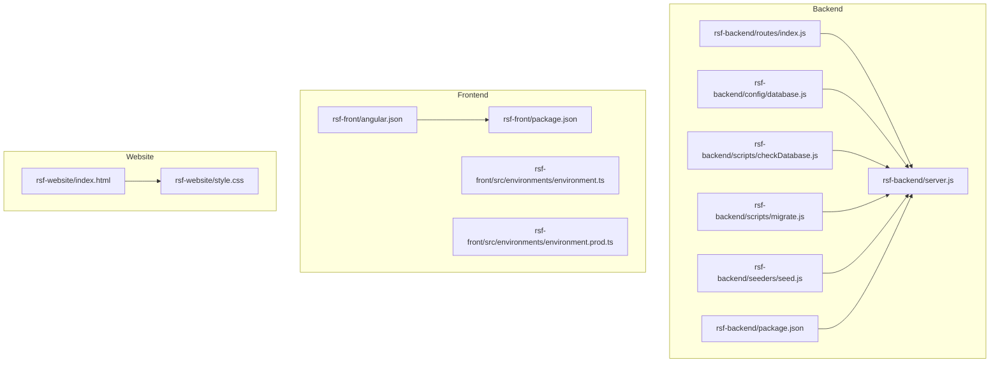
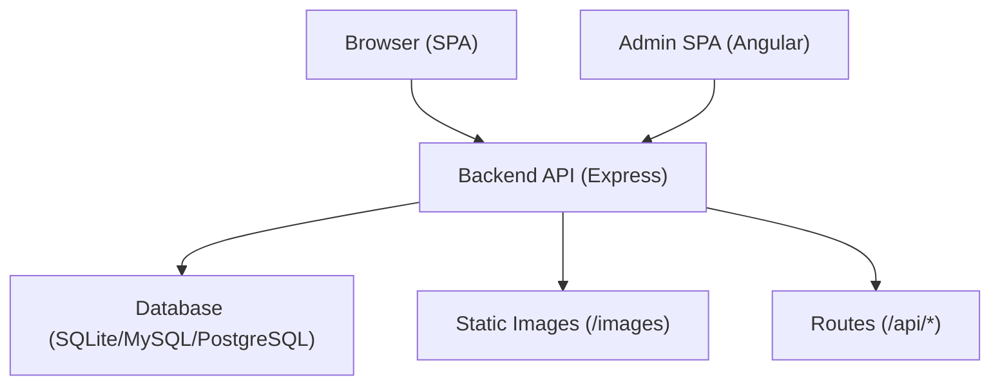
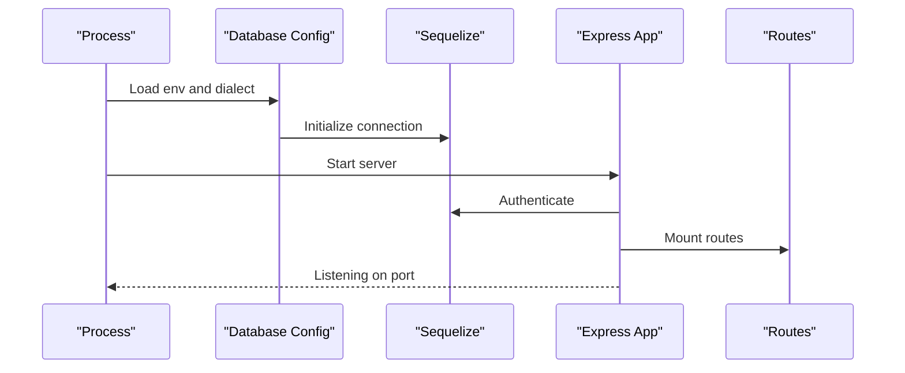
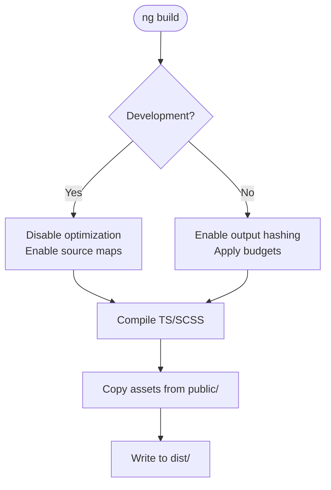
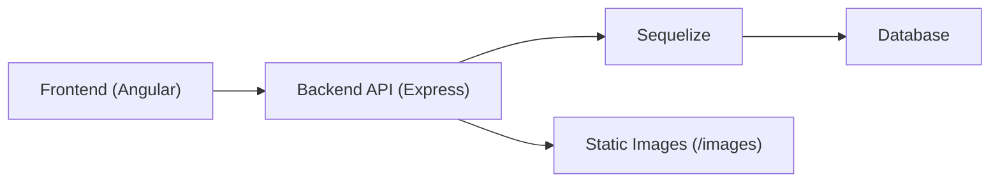

# Build and Deployment

<cite>
**Referenced Files in This Document**
- [package.json](file://rsf-backend/package.json)
- [server.js](file://rsf-backend/server.js)
- [database.js](file://rsf-backend/config/database.js)
- [checkDatabase.js](file://rsf-backend/scripts/checkDatabase.js)
- [migrate.js](file://rsf-backend/scripts/migrate.js)
- [seed.js](file://rsf-backend/seeders/seed.js)
- [routes/index.js](file://rsf-backend/routes/index.js)
- [.gitignore](file://rsf-backend/.gitignore)
- [package.json](file://rsf-front/package.json)
- [angular.json](file://rsf-front/angular.json)
- [README.md](file://rsf-front/README.md)
- [environment.ts](file://rsf-front/src/environments/environment.ts)
- [environment.prod.ts](file://rsf-front/src/environments/environment.prod.ts)
- [.gitignore](file://rsf-front/.gitignore)
- [index.html](file://rsf-website/index.html)
- [style.css](file://rsf-website/style.css)
</cite>

## Table of Contents
1. [Introduction](#introduction)
2. [Project Structure](#project-structure)
3. [Core Components](#core-components)
4. [Architecture Overview](#architecture-overview)
5. [Detailed Component Analysis](#detailed-component-analysis)
6. [Dependency Analysis](#dependency-analysis)
7. [Performance Considerations](#performance-considerations)
8. [Troubleshooting Guide](#troubleshooting-guide)
9. [Conclusion](#conclusion)
10. [Appendices](#appendices)

## Introduction
This document describes the complete build and deployment process for the Réseau Solidarité France platform. It covers:
- Backend and frontend build pipelines
- Environment-specific configurations and scripts
- Database initialization, migrations, and seeding
- Static site generation for the legacy website
- Deployment targets and strategies across development, staging, and production
- Containerization options and multi-stage builds
- Rollback, blue-green, and zero-downtime deployment techniques

## Project Structure
The platform consists of three main parts:
- Backend API (Node.js + Express + Sequelize)
- Frontend SPA (Angular)
- Legacy static website (HTML/CSS)

**Diagram sources**
- [server.js:1-84](file://rsf-backend/server.js#L1-L84)
- [database.js:1-69](file://rsf-backend/config/database.js#L1-L69)
- [checkDatabase.js:1-381](file://rsf-backend/scripts/checkDatabase.js#L1-L381)
- [migrate.js:1-390](file://rsf-backend/scripts/migrate.js#L1-L390)
- [seed.js:1-490](file://rsf-backend/seeders/seed.js#L1-L490)
- [routes/index.js:1-28](file://rsf-backend/routes/index.js#L1-L28)
- [package.json:1-34](file://rsf-backend/package.json#L1-L34)
- [package.json:1-34](file://rsf-front/package.json#L1-L34)
- [angular.json:1-75](file://rsf-front/angular.json#L1-L75)
- [environment.ts:1-5](file://rsf-front/src/environments/environment.ts#L1-L5)
- [environment.prod.ts:1-5](file://rsf-front/src/environments/environment.prod.ts#L1-L5)
- [index.html](file://rsf-website/index.html)
- [style.css](file://rsf-website/style.css)

**Section sources**
- [server.js:1-84](file://rsf-backend/server.js#L1-L84)
- [angular.json:1-75](file://rsf-front/angular.json#L1-L75)
- [package.json:1-34](file://rsf-backend/package.json#L1-L34)
- [package.json:1-34](file://rsf-front/package.json#L1-L34)

## Core Components
- Backend API
  - Starts the Express server, loads environment variables, connects to the database, applies middleware, exposes health endpoint, and mounts routes.
  - Scripts for database verification, migrations, and seeding.
- Frontend SPA
  - Angular CLI-based build with production and development configurations, assets handling, and unit test builder.
- Static Website
  - Pure HTML/CSS pages for legacy content.

**Section sources**
- [server.js:1-84](file://rsf-backend/server.js#L1-L84)
- [database.js:1-69](file://rsf-backend/config/database.js#L1-L69)
- [checkDatabase.js:1-381](file://rsf-backend/scripts/checkDatabase.js#L1-L381)
- [migrate.js:1-390](file://rsf-backend/scripts/migrate.js#L1-L390)
- [seed.js:1-490](file://rsf-backend/seeders/seed.js#L1-L490)
- [angular.json:1-75](file://rsf-front/angular.json#L1-L75)
- [environment.ts:1-5](file://rsf-front/src/environments/environment.ts#L1-L5)
- [environment.prod.ts:1-5](file://rsf-front/src/environments/environment.prod.ts#L1-L5)

## Architecture Overview
High-level runtime architecture:
- Frontend (Angular) serves static assets and communicates with the Backend API via HTTP.
- Backend exposes REST endpoints under /api and serves images from a static folder.
- Database is configured via environment variables and supports SQLite, MySQL, and PostgreSQL.

**Diagram sources**
- [server.js:18-52](file://rsf-backend/server.js#L18-L52)
- [routes/index.js:1-28](file://rsf-backend/routes/index.js#L1-L28)
- [database.js:9-66](file://rsf-backend/config/database.js#L9-L66)

## Detailed Component Analysis

### Backend Build and Runtime
- Startup and configuration
  - Loads environment variables, sets up middleware, authenticates database, and starts the server on a configurable port.
- Database configuration
  - Supports SQLite, MySQL, and PostgreSQL with environment-driven dialect selection and connection pooling.
- Scripts
  - Database verification and auto-schema sync with admin creation and optional seeding.
  - Manual migration engine with a tracked migration table and undo support.
  - Seeding script for initial content and settings.

**Diagram sources**
- [server.js:55-81](file://rsf-backend/server.js#L55-L81)
- [database.js:31-66](file://rsf-backend/config/database.js#L31-L66)
- [routes/index.js:1-28](file://rsf-backend/routes/index.js#L1-L28)

**Section sources**
- [server.js:1-84](file://rsf-backend/server.js#L1-L84)
- [database.js:1-69](file://rsf-backend/config/database.js#L1-L69)
- [checkDatabase.js:1-381](file://rsf-backend/scripts/checkDatabase.js#L1-L381)
- [migrate.js:1-390](file://rsf-backend/scripts/migrate.js#L1-L390)
- [seed.js:1-490](file://rsf-backend/seeders/seed.js#L1-L490)

### Frontend Build and Asset Pipeline
- Angular build targets
  - Production configuration enables output hashing and budgets.
  - Development configuration disables optimization and enables source maps.
- Assets and styles
  - Public assets are included via the Angular configuration.
- Scripts
  - ng serve, ng build, and ng test commands are available.

**Diagram sources**
- [angular.json:17-71](file://rsf-front/angular.json#L17-L71)
- [package.json:4-10](file://rsf-front/package.json#L4-L10)

**Section sources**
- [angular.json:1-75](file://rsf-front/angular.json#L1-L75)
- [package.json:1-34](file://rsf-front/package.json#L1-L34)
- [README.md:29-37](file://rsf-front/README.md#L29-L37)

### Environment Variables and Configuration
- Backend
  - Database dialect selection and credentials are controlled via environment variables.
  - Logging behavior depends on NODE_ENV.
- Frontend
  - API base URL is configured per environment (development vs production).
  - Production build target updates the API URL for deployment.

**Section sources**
- [database.js:9-66](file://rsf-backend/config/database.js#L9-L66)
- [environment.ts:1-5](file://rsf-front/src/environments/environment.ts#L1-L5)
- [environment.prod.ts:1-5](file://rsf-front/src/environments/environment.prod.ts#L1-L5)

### Static Site Generation (Legacy Website)
- The static website is composed of HTML pages and a shared stylesheet.
- No build tooling is present; files are served as-is.

**Section sources**
- [index.html](file://rsf-website/index.html)
- [style.css](file://rsf-website/style.css)

## Dependency Analysis
- Backend dependencies
  - Express, Sequelize ORM, CORS, Helmet, rate limiter, Morgan, bcrypt, JWT, dotenv.
- Frontend dependencies
  - Angular core packages, RxJS, and Angular CLI toolchain.
- Internal dependencies
  - Backend routes mount under /api.
  - Frontend consumes the backend API at /api.

**Diagram sources**
- [routes/index.js:6-26](file://rsf-backend/routes/index.js#L6-L26)
- [server.js:30-33](file://rsf-backend/server.js#L30-L33)

**Section sources**
- [package.json:16-32](file://rsf-backend/package.json#L16-L32)
- [package.json:13-32](file://rsf-front/package.json#L13-L32)
- [routes/index.js:1-28](file://rsf-backend/routes/index.js#L1-L28)

## Performance Considerations
- Backend
  - Enable database pooling and appropriate dialect-specific settings.
  - Use production-grade logging and disable verbose logs in production.
- Frontend
  - Leverage Angular’s production build with output hashing and budgets.
  - Keep asset sizes minimal and lazy-load non-critical features.
- Static Website
  - Compress and cache static assets appropriately at the web server level.

[No sources needed since this section provides general guidance]

## Troubleshooting Guide
- Database connectivity
  - Verify DB_DIALECT and related credentials; confirm the database exists and is reachable.
- Schema synchronization
  - Use the database check script to validate tables and columns; re-run with reset or seed flags if needed.
- Migrations
  - List pending migrations, apply or undo as required; ensure the migration tracking table exists.
- Health endpoint
  - Confirm the /health route returns expected metadata and database dialect.

**Section sources**
- [database.js:9-66](file://rsf-backend/config/database.js#L9-L66)
- [checkDatabase.js:304-321](file://rsf-backend/scripts/checkDatabase.js#L304-L321)
- [migrate.js:282-301](file://rsf-backend/scripts/migrate.js#L282-L301)
- [server.js:35-44](file://rsf-backend/server.js#L35-L44)

## Conclusion
The platform provides a straightforward, environment-driven stack with robust database lifecycle tooling and a modern Angular frontend. The documented build and deployment steps enable repeatable releases across environments with clear rollback and operational controls.

[No sources needed since this section summarizes without analyzing specific files]

## Appendices

### A. Build and Deployment Playbooks

- Backend
  - Install dependencies: use the package manager defined in the backend package manifest.
  - Local development: start the backend with the development script; it will load environment variables and start the server.
  - Production: set NODE_ENV to production and start the backend; ensure database credentials and dialect are configured.
  - Database initialization:
    - Run the database check script to verify and synchronize schema; optionally seed with default data.
    - Apply manual migrations as needed; list or undo as required.
  - Static assets: images are served from the backend static route; ensure the images directory exists and is writable.

- Frontend
  - Install dependencies: use the package manager defined in the frontend package manifest.
  - Local development: start the Angular dev server; it will proxy API requests to the backend during development.
  - Production build: produce optimized artifacts for deployment; configure the production environment to point to the production backend.
  - Testing: run unit tests using the provided script.

- Static Website
  - Deploy the HTML and CSS files to a static hosting provider or web server.

**Section sources**
- [package.json:6-14](file://rsf-backend/package.json#L6-L14)
- [server.js:55-81](file://rsf-backend/server.js#L55-L81)
- [checkDatabase.js:285-321](file://rsf-backend/scripts/checkDatabase.js#L285-L321)
- [migrate.js:303-336](file://rsf-backend/scripts/migrate.js#L303-L336)
- [package.json:4-10](file://rsf-front/package.json#L4-L10)
- [angular.json:17-71](file://rsf-front/angular.json#L17-L71)
- [README.md:29-37](file://rsf-front/README.md#L29-L37)

### B. Environment Variable Reference

- Backend
  - DB_DIALECT: sqlite, mysql, mariadb, postgres
  - DB_NAME, DB_USER, DB_PASS, DB_HOST, DB_PORT: database credentials and connection details
  - NODE_ENV: development or production
  - PORT: server port (defaults to a configured value)
  - ADMIN_*: defaults for initial admin user creation

- Frontend
  - apiUrl: base URL for API calls (development vs production)

**Section sources**
- [database.js:9-66](file://rsf-backend/config/database.js#L9-L66)
- [environment.ts:1-5](file://rsf-front/src/environments/environment.ts#L1-L5)
- [environment.prod.ts:1-5](file://rsf-front/src/environments/environment.prod.ts#L1-L5)

### C. Deployment Targets and Strategies

- Development
  - Use SQLite for simplicity; run backend and frontend locally; configure frontend environment to point to the local backend.
- Staging
  - Use a managed database (e.g., MySQL or PostgreSQL) with read replicas; deploy backend behind a reverse proxy; enable production logging and monitoring.
- Production
  - Use a managed database with backups and replication; deploy backend with health checks and readiness probes; expose /health for load balancers and orchestrators.

- Zero-Downtime and Rollback
  - Blue-green deployments: maintain two identical environments; switch traffic after validating the new version; roll back by switching back.
  - Canary releases: gradually shift traffic to the new version; monitor metrics and logs before full rollout.
  - Rollback: keep previous container images and database migration snapshots; revert to the last known good state.

[No sources needed since this section provides general guidance]

### D. Containerization Options

- Multi-stage build (recommended)
  - Stage 1: install dependencies and build frontend (Angular).
  - Stage 2: copy built assets and backend code into a minimal runtime image; install only runtime dependencies.
  - Use separate stages for backend and frontend to reduce image size and attack surface.

- Image optimization
  - Use a minimal base image for the runtime.
  - Exclude devDependencies and build artifacts from the final image.
  - Persist database files externally (volume or cloud storage) to avoid bloating the container image.

[No sources needed since this section provides general guidance]