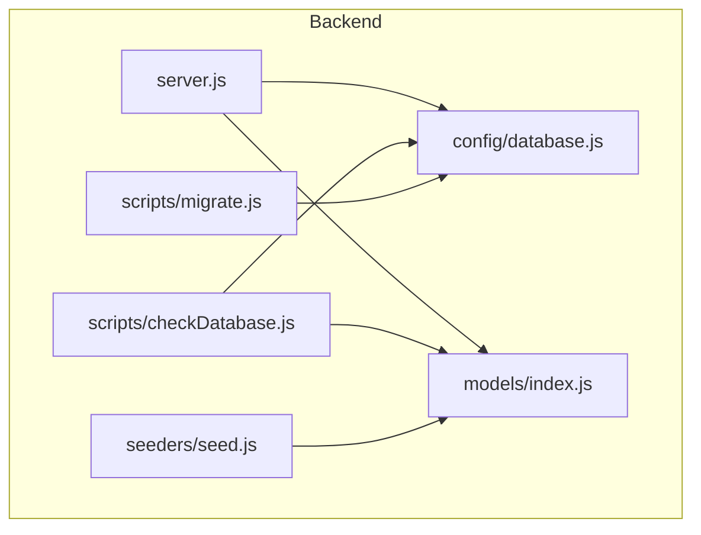
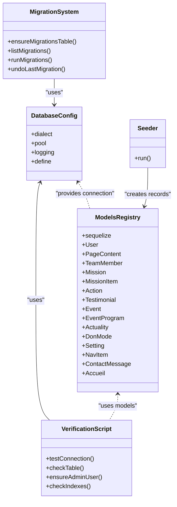
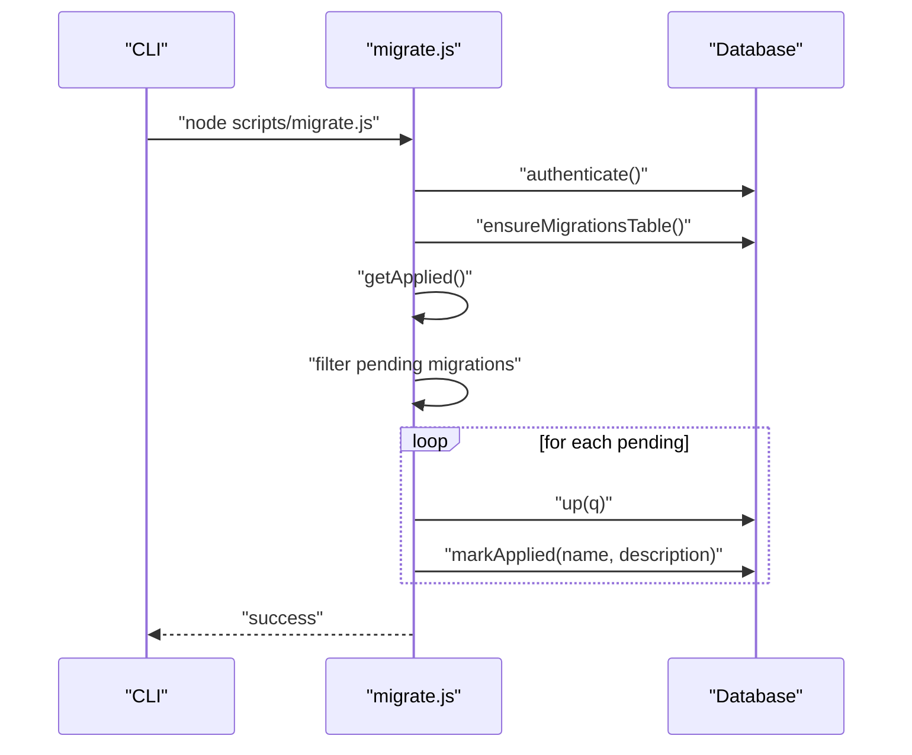
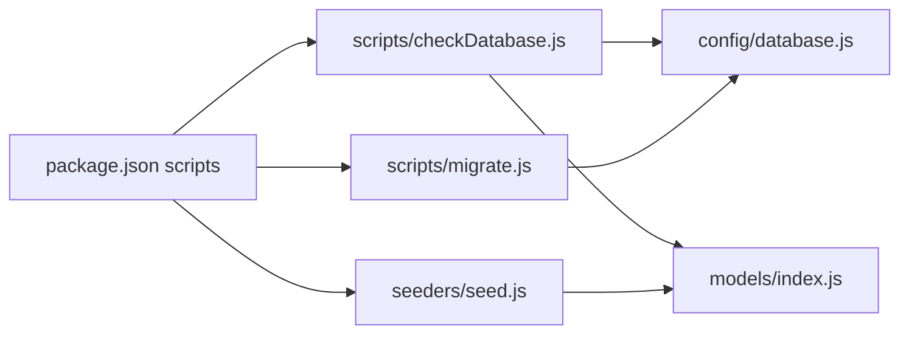

# Database Operations

<cite>
**Referenced Files in This Document**
- [database.js](file://rsf-backend/config/database.js)
- [migrate.js](file://rsf-backend/scripts/migrate.js)
- [checkDatabase.js](file://rsf-backend/scripts/checkDatabase.js)
- [seed.js](file://rsf-backend/seeders/seed.js)
- [package.json](file://rsf-backend/package.json)
- [index.js](file://rsf-backend/models/index.js)
- [User.js](file://rsf-backend/models/User.js)
- [Setting.js](file://rsf-backend/models/Setting.js)
- [Accueil.js](file://rsf-backend/models/Accueil.js)
- [Event.js](file://rsf-backend/models/Event.js)
- [server.js](file://rsf-backend/server.js)
- [README.md](file://rsf-backend/README.md)
</cite>

## Table of Contents
1. [Introduction](#introduction)
2. [Project Structure](#project-structure)
3. [Core Components](#core-components)
4. [Architecture Overview](#architecture-overview)
5. [Detailed Component Analysis](#detailed-component-analysis)
6. [Dependency Analysis](#dependency-analysis)
7. [Performance Considerations](#performance-considerations)
8. [Troubleshooting Guide](#troubleshooting-guide)
9. [Conclusion](#conclusion)
10. [Appendices](#appendices)

## Introduction
This document describes database operations for the Réseau Solidarité France platform. It covers:
- Database configuration and multi-database support (SQLite, MySQL, PostgreSQL)
- Schema verification and automatic updates
- Manual migration system with version tracking
- Seeding for initial and testing data
- Backup and restore procedures
- Monitoring, performance tuning, and connection pooling
- Maintenance tasks and health checks
- Troubleshooting common database issues

## Project Structure
The backend uses Sequelize ORM with a dedicated configuration and two complementary operational scripts:
- Configuration: centralized database connection and dialect selection
- Verification script: ensures tables and columns exist and seeds default data
- Manual migration script: applies ordered, idempotent migrations with tracking
- Seeder: inserts default content for development and testing

**Diagram sources**
- [database.js:1-69](file://rsf-backend/config/database.js#L1-L69)
- [index.js:1-53](file://rsf-backend/models/index.js#L1-L53)
- [server.js:1-84](file://rsf-backend/server.js#L1-L84)
- [checkDatabase.js:1-381](file://rsf-backend/scripts/checkDatabase.js#L1-L381)
- [migrate.js:1-390](file://rsf-backend/scripts/migrate.js#L1-L390)
- [seed.js:1-490](file://rsf-backend/seeders/seed.js#L1-L490)

**Section sources**
- [README.md:1-206](file://rsf-backend/README.md#L1-L206)
- [package.json:1-34](file://rsf-backend/package.json#L1-L34)

## Core Components
- Database configuration supports SQLite (default), MySQL, and PostgreSQL with environment-driven settings and connection pooling.
- Automatic schema verification and column addition for all models.
- Manual migration system with a dedicated tracking table and commands to list, apply, and undo migrations.
- Seeder script to populate default content for development and testing.

**Section sources**
- [database.js:1-69](file://rsf-backend/config/database.js#L1-L69)
- [checkDatabase.js:1-381](file://rsf-backend/scripts/checkDatabase.js#L1-L381)
- [migrate.js:1-390](file://rsf-backend/scripts/migrate.js#L1-L390)
- [seed.js:1-490](file://rsf-backend/seeders/seed.js#L1-L490)

## Architecture Overview
The database architecture centers around a single Sequelize instance configured via environment variables. Models define tables and relationships. Operational scripts manage schema and data lifecycle.

**Diagram sources**
- [database.js:1-69](file://rsf-backend/config/database.js#L1-L69)
- [index.js:1-53](file://rsf-backend/models/index.js#L1-L53)
- [migrate.js:1-390](file://rsf-backend/scripts/migrate.js#L1-L390)
- [checkDatabase.js:1-381](file://rsf-backend/scripts/checkDatabase.js#L1-L381)
- [seed.js:1-490](file://rsf-backend/seeders/seed.js#L1-L490)

## Detailed Component Analysis

### Database Configuration and Multi-Database Support
- Dialect selection is controlled by an environment variable with defaults to SQLite.
- SQLite stores data in a local file path; missing directories are created automatically.
- MySQL and PostgreSQL use connection parameters from environment variables with sensible defaults for host, port, and connection pooling.
- Logging is enabled in development and disabled otherwise.

Operational implications:
- Choose the appropriate dialect and credentials for each environment.
- Connection pooling is configured for MySQL and PostgreSQL; adjust pool sizes according to workload.

**Section sources**
- [database.js:1-69](file://rsf-backend/config/database.js#L1-L69)

### Schema Verification and Automatic Updates
- The verification script connects to the database, lists existing tables, and compares them against Sequelize models.
- For each model:
  - Creates missing tables.
  - Adds missing columns with appropriate types and defaults.
  - Skips unsupported column additions (e.g., certain enum-like types on SQLite).
- Ensures an admin user exists if the users table is empty.
- Indexes are managed by Sequelize during sync; the script reports index verification status.
- Supports reset mode to drop and recreate all tables.

Usage:
- Run the script after adding models or fields to keep the schema aligned.
- Use reset mode only for destructive operations (e.g., local development resets).

**Section sources**
- [checkDatabase.js:1-381](file://rsf-backend/scripts/checkDatabase.js#L1-L381)
- [User.js:1-75](file://rsf-backend/models/User.js#L1-L75)
- [Setting.js:1-16](file://rsf-backend/models/Setting.js#L1-L16)
- [Accueil.js:1-52](file://rsf-backend/models/Accueil.js#L1-L52)
- [Event.js:1-25](file://rsf-backend/models/Event.js#L1-L25)

### Manual Migration System
- A manual migration system maintains a dedicated tracking table and a list of ordered migrations.
- Each migration defines an up function (required) and optionally a down function.
- Commands:
  - Apply pending migrations
  - List applied and pending migrations
  - Undo the last migration

Supported dialects:
- SQLite, MySQL/MariaDB, and PostgreSQL are supported in migration SQL generation.

Rollback considerations:
- Some migrations include warnings about limitations (e.g., column removal on SQLite).

**Diagram sources**
- [migrate.js:1-390](file://rsf-backend/scripts/migrate.js#L1-L390)

**Section sources**
- [migrate.js:1-390](file://rsf-backend/scripts/migrate.js#L1-L390)

### Seeding Processes
- The seeder script clears target tables and inserts default content for:
  - Settings
  - Navigation items
  - Team members
  - Missions and mission items
  - Testimonials
  - Events and programs
  - Actualities
  - Actions
  - Home page content
  - Donation modes
- Uses model factories to insert structured data and JSON-serialized fields where needed.

Environment integration:
- Default admin credentials are taken from environment variables if provided.

**Section sources**
- [seed.js:1-490](file://rsf-backend/seeders/seed.js#L1-L490)

### Health Checks and Monitoring
- The server exposes a health endpoint that returns runtime status and database dialect information.
- Database connectivity is verified at startup.

Monitoring recommendations:
- Integrate the health endpoint into uptime monitoring.
- Track response times and error rates for database operations.

**Section sources**
- [server.js:1-84](file://rsf-backend/server.js#L1-L84)

## Dependency Analysis
- Models registry imports and registers all models and defines associations.
- Scripts depend on the database configuration and models to perform schema checks and data seeding.
- Package scripts expose convenient commands for database operations.

**Diagram sources**
- [package.json:1-34](file://rsf-backend/package.json#L1-L34)
- [database.js:1-69](file://rsf-backend/config/database.js#L1-L69)
- [index.js:1-53](file://rsf-backend/models/index.js#L1-L53)
- [checkDatabase.js:1-381](file://rsf-backend/scripts/checkDatabase.js#L1-L381)
- [migrate.js:1-390](file://rsf-backend/scripts/migrate.js#L1-L390)
- [seed.js:1-490](file://rsf-backend/seeders/seed.js#L1-L490)

**Section sources**
- [package.json:1-34](file://rsf-backend/package.json#L1-L34)
- [index.js:1-53](file://rsf-backend/models/index.js#L1-L53)

## Performance Considerations
- Connection pooling:
  - MySQL and PostgreSQL pools are configured in the database configuration. Adjust max/min, acquire, and idle timeouts based on traffic and resource limits.
- Logging:
  - SQL logging is enabled in development; disable it in production to reduce overhead.
- Indexes:
  - Sequelize manages indexes during sync. Ensure frequently queried columns are indexed in models.
- Data types:
  - Prefer appropriate data types (e.g., TEXT for large content) to avoid unnecessary conversions.

[No sources needed since this section provides general guidance]

## Troubleshooting Guide
Common issues and resolutions:
- Connection failures:
  - Verify dialect and credentials in environment variables.
  - Confirm database availability and network accessibility.
- SQLite file permissions:
  - Ensure the storage directory exists and is writable.
- Column addition failures:
  - Some column types are not supported on SQLite; the verification script handles these gracefully.
- Migration errors:
  - Fix the failing migration and re-run the migration command.
  - Use undo to revert the last migration if necessary.
- Admin creation:
  - If no admin exists, the verification script creates one using environment-provided credentials.

Health checks:
- Use the health endpoint to confirm service and database status.

**Section sources**
- [database.js:1-69](file://rsf-backend/config/database.js#L1-L69)
- [checkDatabase.js:1-381](file://rsf-backend/scripts/checkDatabase.js#L1-L381)
- [migrate.js:1-390](file://rsf-backend/scripts/migrate.js#L1-L390)
- [server.js:1-84](file://rsf-backend/server.js#L1-L84)

## Conclusion
The platform’s database operations combine a robust configuration supporting multiple databases, an automatic schema verification system, a manual migration tracker, and a comprehensive seeder. Together, these components enable safe, repeatable schema evolution and reliable data initialization across environments.

[No sources needed since this section summarizes without analyzing specific files]

## Appendices

### Backup and Restore Procedures
Backup:
- SQLite: copy the database file from the configured storage path.
- MySQL/PostgreSQL: use vendor-specific tools (mysqldump, pg_dump) to export logical backups.

Restore:
- SQLite: replace the database file with the backup copy.
- MySQL/PostgreSQL: import the logical backup using vendor tools.

Automated scheduling:
- Schedule periodic backups using cron or OS-native schedulers.
- Store backups securely and test restoration regularly.

Disaster recovery:
- Maintain off-site copies of backups.
- Document restore steps and rehearse recovery drills.

[No sources needed since this section provides general guidance]

### Maintenance Tasks
- Index optimization:
  - Review slow queries and add indexes on frequently filtered/sorted columns.
- Cleanup procedures:
  - Archive or prune old logs and temporary data.
- Health checks:
  - Monitor database connectivity, pool utilization, and query performance.
  - Use the health endpoint for basic service checks.

[No sources needed since this section provides general guidance]