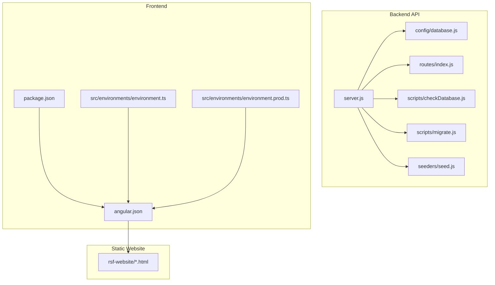
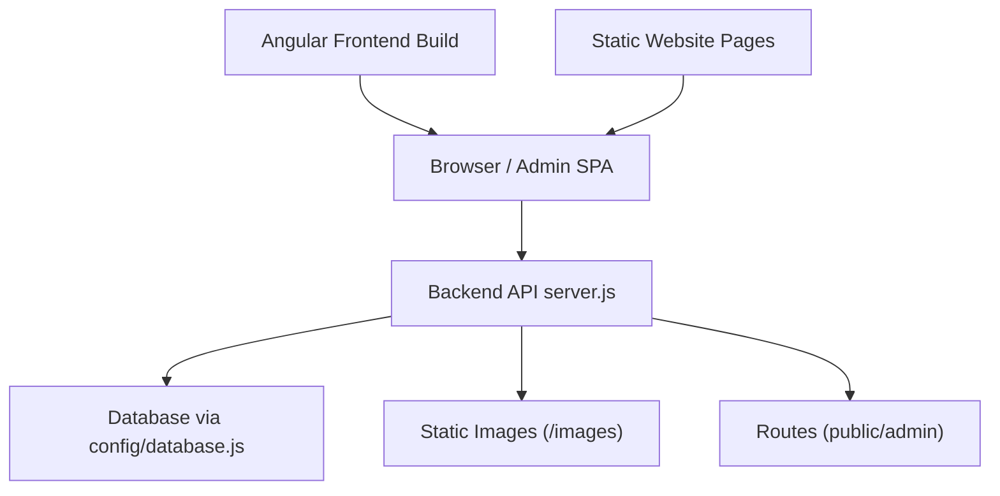
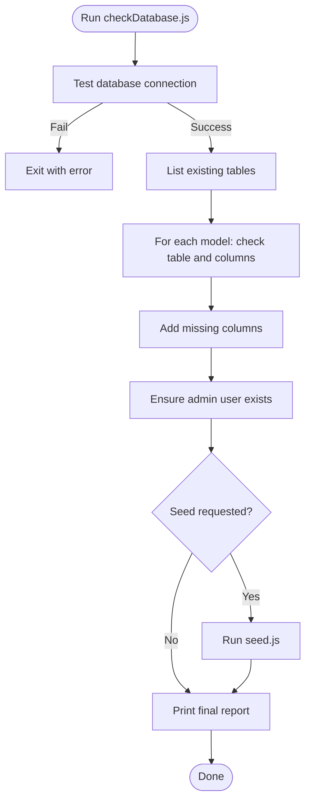
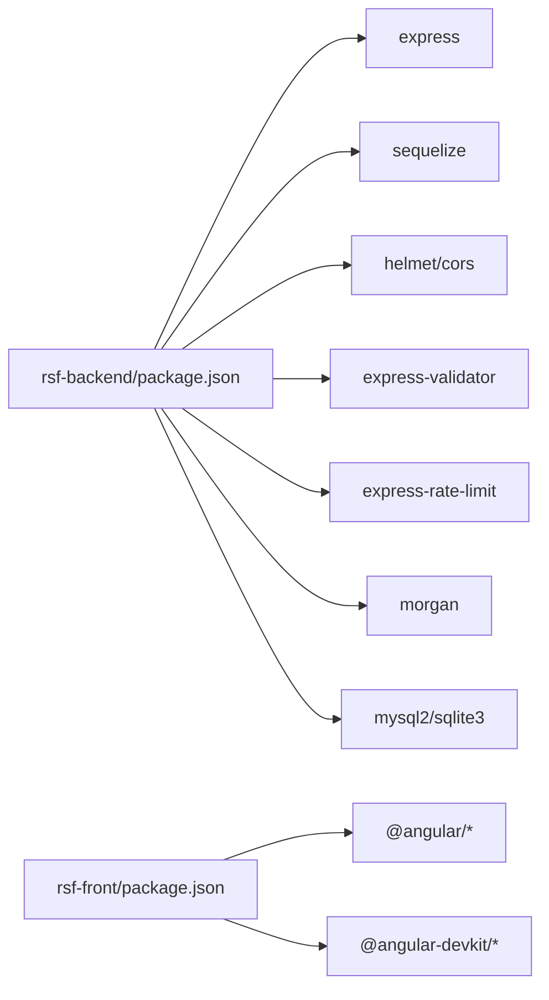

# Deployment and Operations

<cite>
**Referenced Files in This Document**
- [package.json](file://rsf-backend/package.json)
- [server.js](file://rsf-backend/server.js)
- [database.js](file://rsf-backend/config/database.js)
- [README.md](file://rsf-backend/README.md)
- [checkDatabase.js](file://rsf-backend/scripts/checkDatabase.js)
- [migrate.js](file://rsf-backend/scripts/migrate.js)
- [seed.js](file://rsf-backend/seeders/seed.js)
- [routes/index.js](file://rsf-backend/routes/index.js)
- [environment.ts](file://rsf-front/src/environments/environment.ts)
- [environment.prod.ts](file://rsf-front/src/environments/environment.prod.ts)
- [angular.json](file://rsf-front/angular.json)
- [package.json](file://rsf-front/package.json)
</cite>

## Table of Contents
1. [Introduction](#introduction)
2. [Project Structure](#project-structure)
3. [Core Components](#core-components)
4. [Architecture Overview](#architecture-overview)
5. [Detailed Component Analysis](#detailed-component-analysis)
6. [Dependency Analysis](#dependency-analysis)
7. [Performance Considerations](#performance-considerations)
8. [Troubleshooting Guide](#troubleshooting-guide)
9. [Conclusion](#conclusion)
10. [Appendices](#appendices)

## Introduction
This document provides comprehensive deployment and operations guidance for the Réseau Solidarité France platform. It covers backend API deployment, frontend build processes, static site hosting, environment configuration management across development, staging, and production, database migration and seeding, backup strategies, monitoring approaches, containerization options, CI/CD pipeline setup, automated deployment workflows, performance monitoring, error tracking, maintenance procedures, scaling and load balancing, disaster recovery planning, and troubleshooting for common operational issues.

## Project Structure
The platform consists of three primary parts:
- Backend API (Express + Sequelize): Provides admin and public APIs, manages database via SQLite or relational databases, and serves static images.
- Frontend (Angular): Builds a single-page application for public consumption and admin-facing features.
- Static Website: Prebuilt HTML/CSS pages for public sections.

**Diagram sources**
- [server.js:1-84](file://rsf-backend/server.js#L1-L84)
- [database.js:1-69](file://rsf-backend/config/database.js#L1-L69)
- [routes/index.js:1-28](file://rsf-backend/routes/index.js#L1-L28)
- [checkDatabase.js:1-381](file://rsf-backend/scripts/checkDatabase.js#L1-L381)
- [migrate.js:1-390](file://rsf-backend/scripts/migrate.js#L1-L390)
- [seed.js:1-490](file://rsf-backend/seeders/seed.js#L1-L490)
- [environment.ts:1-5](file://rsf-front/src/environments/environment.ts#L1-L5)
- [environment.prod.ts:1-5](file://rsf-front/src/environments/environment.prod.ts#L1-L5)
- [angular.json:1-75](file://rsf-front/angular.json#L1-L75)
- [package.json:1-34](file://rsf-front/package.json#L1-L34)

**Section sources**
- [server.js:1-84](file://rsf-backend/server.js#L1-L84)
- [README.md:1-206](file://rsf-backend/README.md#L1-L206)

## Core Components
- Backend API server: Initializes Express, applies middleware, mounts routes, serves static images, exposes health endpoint, and handles errors globally.
- Database configuration: Supports SQLite, MySQL, and PostgreSQL with environment-driven dialect selection and connection pooling.
- Database verification and synchronization: Automated script checks/creates tables, adds missing columns, seeds default data, and ensures admin account creation.
- Manual migrations: Lightweight migration runner with a dedicated tracking table and rollback hooks where applicable.
- Seed data: Comprehensive dataset initialization for settings, navigation, team, missions, testimonials, events, actualities, actions, homepage content, and donation modes.
- Frontend build pipeline: Angular CLI builds assets and outputs production bundles; environment files configure API base URLs.
- Static website: Prebuilt HTML pages hosted alongside the Angular app.

**Section sources**
- [server.js:1-84](file://rsf-backend/server.js#L1-L84)
- [database.js:1-69](file://rsf-backend/config/database.js#L1-L69)
- [checkDatabase.js:1-381](file://rsf-backend/scripts/checkDatabase.js#L1-L381)
- [migrate.js:1-390](file://rsf-backend/scripts/migrate.js#L1-L390)
- [seed.js:1-490](file://rsf-backend/seeders/seed.js#L1-L490)
- [environment.ts:1-5](file://rsf-front/src/environments/environment.ts#L1-L5)
- [environment.prod.ts:1-5](file://rsf-front/src/environments/environment.prod.ts#L1-L5)
- [angular.json:1-75](file://rsf-front/angular.json#L1-L75)

## Architecture Overview
The backend API exposes:
- Public endpoints for the frontend (no auth required).
- Admin endpoints protected by JWT authentication.
- Health endpoint for runtime checks.
- Static image serving for uploaded assets.

The frontend consumes the backend API and is built for production with asset hashing and budgets. The static website provides prebuilt pages for public sections.

**Diagram sources**
- [server.js:1-84](file://rsf-backend/server.js#L1-L84)
- [database.js:1-69](file://rsf-backend/config/database.js#L1-L69)
- [routes/index.js:1-28](file://rsf-backend/routes/index.js#L1-L28)
- [angular.json:1-75](file://rsf-front/angular.json#L1-L75)

## Detailed Component Analysis

### Backend API Deployment
- Startup and health: The server authenticates to the database, logs environment and service metadata, and exposes a health endpoint returning service status and DB dialect.
- Middleware stack: CORS enabled, JSON body parsing with size limits, request logging, global rate limiting, and error handling.
- Static assets: Serves images from a public directory under /images.
- Routing: Mounts public and admin routes; admin routes are protected by JWT middleware.

Operational steps:
- Install dependencies and start in development or production mode.
- Run database verification and optional seeding before first launch or after schema changes.
- Apply manual migrations as needed.

**Section sources**
- [server.js:1-84](file://rsf-backend/server.js#L1-L84)
- [routes/index.js:1-28](file://rsf-backend/routes/index.js#L1-L28)
- [README.md:73-110](file://rsf-backend/README.md#L73-L110)

### Database Configuration Management
- Dialect selection via environment variable supports SQLite, MySQL, and PostgreSQL.
- Logging toggled by NODE_ENV for development visibility.
- Pooling configured for MySQL/PostgreSQL; SQLite storage path configurable.
- Automatic schema sync during startup (commented) and explicit verification via script.

Environment variables:
- DB_DIALECT, DB_HOST, DB_PORT, DB_NAME, DB_USER, DB_PASS, DB_STORAGE, NODE_ENV, PORT.

**Section sources**
- [database.js:1-69](file://rsf-backend/config/database.js#L1-L69)
- [README.md:188-196](file://rsf-backend/README.md#L188-L196)

### Database Verification and Seeding
- checkDatabase.js:
  - Tests connectivity, lists existing tables, compares model attributes, adds missing columns, ensures admin user creation, and prints a detailed report.
  - Supports reset and seed options.
- seed.js:
  - Destroys and re-inserts default records for settings, navigation, team, missions, testimonials, events, actualities, actions, homepage content, and donation modes.

Recommended workflow:
- On initial setup: run verification with seed.
- After adding models or fields: run verification without reset.
- For full resets (staging/testing): use reset option.

**Diagram sources**
- [checkDatabase.js:1-381](file://rsf-backend/scripts/checkDatabase.js#L1-L381)
- [seed.js:1-490](file://rsf-backend/seeders/seed.js#L1-L490)

**Section sources**
- [checkDatabase.js:1-381](file://rsf-backend/scripts/checkDatabase.js#L1-L381)
- [seed.js:1-490](file://rsf-backend/seeders/seed.js#L1-L490)
- [README.md:114-143](file://rsf-backend/README.md#L114-L143)

### Manual Migrations
- migrate.js:
  - Maintains a migration registry table and executes pending migrations in order.
  - Provides listing, applying, and undo commands with optional rollback functions.
  - Supports SQLite, MySQL/MariaDB, and PostgreSQL.

Usage:
- node scripts/migrate.js (apply pending)
- node scripts/migrate.js --list (list migrations)
- node scripts/migrate.js --undo (undo last migration)

**Section sources**
- [migrate.js:1-390](file://rsf-backend/scripts/migrate.js#L1-L390)

### Frontend Build and Environment Configuration
- Angular CLI configuration defines production and development builds, asset inclusion, and output hashing.
- Environment files set apiUrl for development and production.
- Scripts include serve, build, watch, and test commands.

Build and deploy:
- Build production bundle and publish to a CDN or static hosting provider.
- Configure apiUrl appropriately for each environment.

**Section sources**
- [angular.json:1-75](file://rsf-front/angular.json#L1-L75)
- [environment.ts:1-5](file://rsf-front/src/environments/environment.ts#L1-L5)
- [environment.prod.ts:1-5](file://rsf-front/src/environments/environment.prod.ts#L1-L5)
- [package.json:1-34](file://rsf-front/package.json#L1-L34)

### Static Site Hosting
- Prebuilt HTML pages reside under rsf-website and can be served via static hosting.
- The Angular build output can coexist with static pages if configured accordingly.

Recommendations:
- Host static assets and pages on a CDN for performance and reliability.
- Ensure proper caching headers and HTTPS termination.

[No sources needed since this section doesn't analyze specific files]

## Dependency Analysis
- Backend depends on Express, Sequelize, and supporting libraries for security, validation, rate limiting, logging, and database drivers.
- Frontend depends on Angular and related tooling for building and testing.
- Routes mount public and admin endpoints; admin endpoints require JWT authentication.

**Diagram sources**
- [package.json:1-34](file://rsf-backend/package.json#L1-L34)
- [package.json:1-34](file://rsf-front/package.json#L1-L34)

**Section sources**
- [package.json:1-34](file://rsf-backend/package.json#L1-L34)
- [package.json:1-34](file://rsf-front/package.json#L1-L34)

## Performance Considerations
- Database pooling: Adjust pool sizes according to workload; monitor connection acquisition and idle timeouts.
- Request size limits: JSON payload limits are configured; tune based on content types.
- Static image delivery: Serve images via CDN and enable compression/gzip.
- Frontend optimization: Enable production builds with output hashing and budgets; lazy-load modules where appropriate.
- Monitoring: Track response times, error rates, and resource utilization.

[No sources needed since this section provides general guidance]

## Troubleshooting Guide
Common operational issues and resolutions:
- Database connection failures:
  - Verify DB_DIALECT and credentials; confirm database availability and network reachability.
  - For SQLite, ensure storage path exists and is writable.
- Port conflicts:
  - Change PORT environment variable if port 3001 is in use.
- Missing admin user:
  - Re-run verification with seed to create default admin.
- Migration errors:
  - Review migration logs and fix SQL syntax; use undo cautiously and only on non-production data.
- CORS or rate limiting issues:
  - Adjust CORS origins and rate limiter thresholds as needed.
- Health endpoint failures:
  - Confirm database authentication and that the server started successfully.

**Section sources**
- [database.js:1-69](file://rsf-backend/config/database.js#L1-L69)
- [server.js:1-84](file://rsf-backend/server.js#L1-L84)
- [checkDatabase.js:1-381](file://rsf-backend/scripts/checkDatabase.js#L1-L381)
- [migrate.js:1-390](file://rsf-backend/scripts/migrate.js#L1-L390)

## Conclusion
The Réseau Solidarité France platform provides a robust foundation for deployment and operations. By leveraging the backend’s database verification and migration tools, the frontend’s Angular build pipeline, and static hosting for public pages, teams can reliably operate the platform across environments. Adopting the recommended practices for environment configuration, monitoring, backups, and CI/CD will further strengthen operational resilience.

[No sources needed since this section summarizes without analyzing specific files]

## Appendices

### Environment Configuration Matrix
- Development:
  - NODE_ENV=development
  - DB_DIALECT=sqlite (or mysql/postgres)
  - PORT=3001
  - apiUrl=http://localhost:3001/api
- Staging:
  - NODE_ENV=staging
  - DB_DIALECT=mysql or postgres
  - PORT=3001
  - apiUrl=https://staging.api.reseau-solidarite-france.fr/api
- Production:
  - NODE_ENV=production
  - DB_DIALECT=postgres (recommended)
  - PORT=3001
  - apiUrl=https://api.reseau-solidarite-france.fr/api

[No sources needed since this section provides general guidance]

### Backup Strategies
- SQLite: Back up the storage file regularly; consider WAL mode for improved durability.
- MySQL/PostgreSQL: Use native logical backups (mysqldump/pg_dump) and point-in-time recovery where available.
- Offsite retention: Store backups in secure, geographically separated locations.
- Test restoration: Periodically validate restore procedures.

[No sources needed since this section provides general guidance]

### Monitoring and Error Tracking
- Health endpoint: Use /health for basic service checks.
- Logs: Enable Morgan logging in development; integrate structured logging in production.
- Metrics: Track response latency, throughput, and error rates.
- Error tracking: Integrate an error reporting service for client-side and server-side exceptions.

[No sources needed since this section provides general guidance]

### CI/CD Pipeline Setup
- Backend:
  - Install dependencies, run database verification, apply migrations, seed data (optional), build artifacts, and deploy to servers or containers.
- Frontend:
  - Build production bundle, upload to CDN, and invalidate cache.
- Static Website:
  - Deploy rsf-website folder to static hosting provider.

[No sources needed since this section provides general guidance]

### Scaling and Load Balancing
- Horizontal scaling: Run multiple backend instances behind a load balancer.
- Stateless design: Keep sessions/JWT-based stateless authentication.
- CDN: Offload static assets to a CDN.
- Auto-scaling: Configure auto-scaling groups based on CPU/memory metrics.

[No sources needed since this section provides general guidance]

### Disaster Recovery Planning
- Backup and restore: Maintain regular backups and test restoration procedures.
- Multi-region deployments: Replicate infrastructure across regions.
- Rollback strategy: Keep previous releases available for quick rollback.
- Communication plan: Establish incident communication protocols.

[No sources needed since this section provides general guidance]