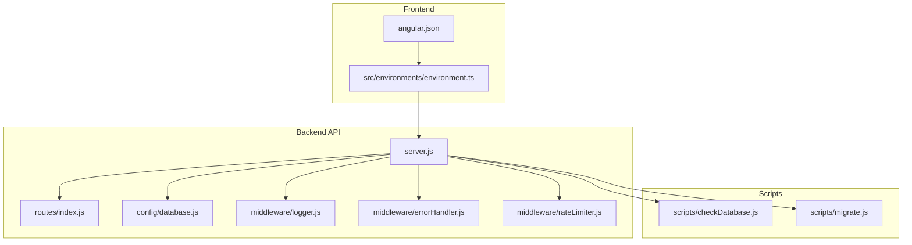
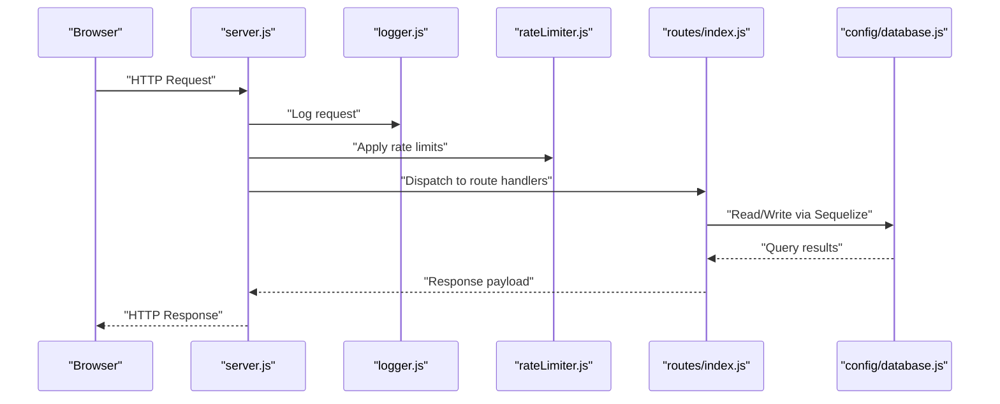
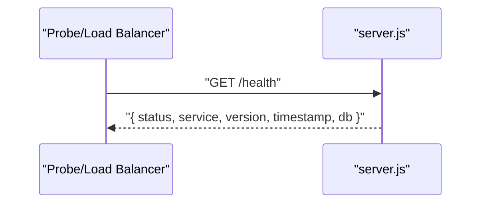
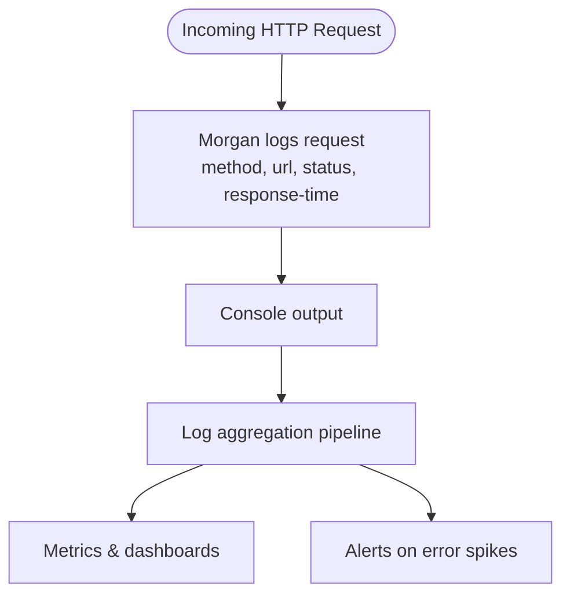
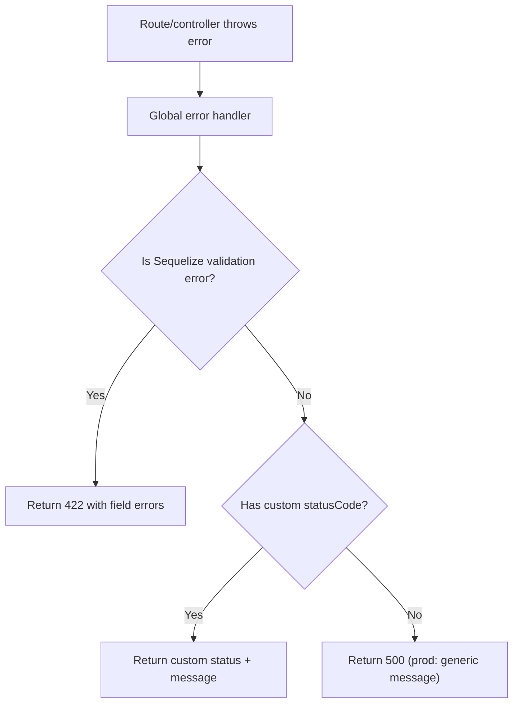
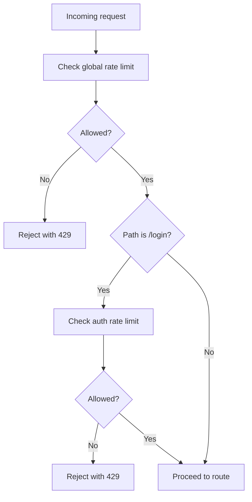
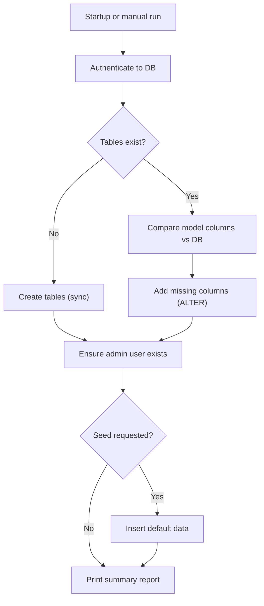
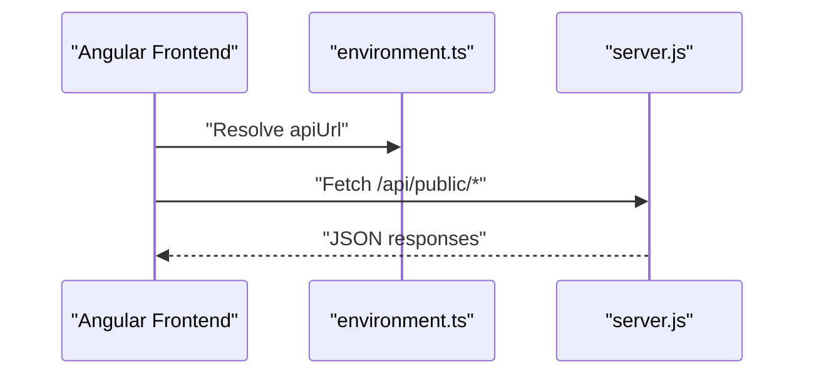
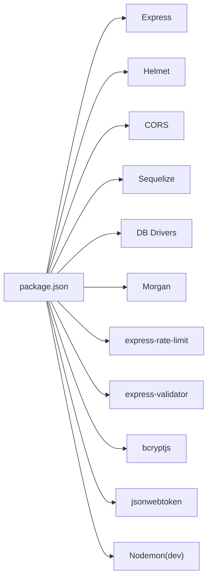

# Monitoring and Maintenance

<cite>
**Referenced Files in This Document**
- [server.js](file://rsf-backend/server.js)
- [package.json](file://rsf-backend/package.json)
- [database.js](file://rsf-backend/config/database.js)
- [logger.js](file://rsf-backend/middleware/logger.js)
- [errorHandler.js](file://rsf-backend/middleware/errorHandler.js)
- [rateLimiter.js](file://rsf-backend/middleware/rateLimiter.js)
- [index.js](file://rsf-backend/routes/index.js)
- [README.md](file://rsf-backend/README.md)
- [.gitignore](file://rsf-backend/.gitignore)
- [checkDatabase.js](file://rsf-backend/scripts/checkDatabase.js)
- [migrate.js](file://rsf-backend/scripts/migrate.js)
- [environment.ts](file://rsf-front/src/environments/environment.ts)
- [angular.json](file://rsf-front/angular.json)
</cite>

## Table of Contents
1. [Introduction](#introduction)
2. [Project Structure](#project-structure)
3. [Core Components](#core-components)
4. [Architecture Overview](#architecture-overview)
5. [Detailed Component Analysis](#detailed-component-analysis)
6. [Dependency Analysis](#dependency-analysis)
7. [Performance Considerations](#performance-considerations)
8. [Troubleshooting Guide](#troubleshooting-guide)
9. [Conclusion](#conclusion)
10. [Appendices](#appendices)

## Introduction
This document provides comprehensive monitoring and maintenance guidance for the Réseau Solidarité France platform. It covers application monitoring strategies (performance metrics, error tracking, health checks), logging configuration and analysis, system maintenance (updates, security patches, dependency management), alerting and incident response, capacity planning and scaling, maintenance windows and emergency procedures, troubleshooting, and backup/disaster recovery practices. The guidance is grounded in the actual backend implementation and associated scripts.

## Project Structure
The platform consists of:
- Backend API (Express + Sequelize): responsible for authentication, content management, and public APIs.
- Frontend (Angular): serves the public website and admin interface.
- Scripts for database verification and migrations: ensure schema integrity and controlled evolution.
- Environment and build configuration for development and production.

**Diagram sources**
- [server.js:1-84](file://rsf-backend/server.js#L1-L84)
- [routes/index.js:1-28](file://rsf-backend/routes/index.js#L1-L28)
- [config/database.js:1-69](file://rsf-backend/config/database.js#L1-L69)
- [middleware/logger.js:1-28](file://rsf-backend/middleware/logger.js#L1-L28)
- [middleware/errorHandler.js:1-38](file://rsf-backend/middleware/errorHandler.js#L1-L38)
- [middleware/rateLimiter.js:1-21](file://rsf-backend/middleware/rateLimiter.js#L1-L21)
- [scripts/checkDatabase.js:1-381](file://rsf-backend/scripts/checkDatabase.js#L1-L381)
- [scripts/migrate.js:1-390](file://rsf-backend/scripts/migrate.js#L1-L390)
- [src/environments/environment.ts:1-5](file://rsf-front/src/environments/environment.ts#L1-L5)
- [angular.json:1-75](file://rsf-front/angular.json#L1-L75)

**Section sources**
- [README.md:1-206](file://rsf-backend/README.md#L1-L206)
- [server.js:1-84](file://rsf-backend/server.js#L1-L84)
- [angular.json:1-75](file://rsf-front/angular.json#L1-L75)

## Core Components
- Health endpoint: exposes service status and DB dialect for readiness checks.
- Logging middleware: colored HTTP request logs via Morgan.
- Global error handler: standardized JSON responses and stack tracing in development.
- Rate limiter: protects against abuse with global and login-specific limits.
- Database configuration: supports SQLite, MySQL, and PostgreSQL with connection pooling.
- Database verification script: ensures tables, columns, and admin user are present; safe for production runs.
- Manual migration script: tracks and applies one-off schema changes safely.

**Section sources**
- [server.js:35-44](file://rsf-backend/server.js#L35-L44)
- [middleware/logger.js:1-28](file://rsf-backend/middleware/logger.js#L1-L28)
- [middleware/errorHandler.js:1-38](file://rsf-backend/middleware/errorHandler.js#L1-L38)
- [middleware/rateLimiter.js:1-21](file://rsf-backend/middleware/rateLimiter.js#L1-L21)
- [config/database.js:1-69](file://rsf-backend/config/database.js#L1-L69)
- [scripts/checkDatabase.js:1-381](file://rsf-backend/scripts/checkDatabase.js#L1-L381)
- [scripts/migrate.js:1-390](file://rsf-backend/scripts/migrate.js#L1-L390)

## Architecture Overview
The backend exposes public and admin endpoints, with authentication and rate limiting enforced. Static images are served from the backend. The frontend consumes the backend API and is built for development and production configurations.

**Diagram sources**
- [server.js:18-52](file://rsf-backend/server.js#L18-L52)
- [middleware/logger.js:1-28](file://rsf-backend/middleware/logger.js#L1-L28)
- [middleware/rateLimiter.js:1-21](file://rsf-backend/middleware/rateLimiter.js#L1-L21)
- [routes/index.js:1-28](file://rsf-backend/routes/index.js#L1-L28)
- [config/database.js:1-69](file://rsf-backend/config/database.js#L1-L69)

## Detailed Component Analysis

### Health Endpoint
- Purpose: Lightweight readiness/liveness probe returning service metadata and DB dialect.
- Usage: Configure load balancers or orchestrator probes to call the endpoint.
- Observability: Combine with logs and error handler to detect startup and runtime issues.

**Diagram sources**
- [server.js:35-44](file://rsf-backend/server.js#L35-L44)

**Section sources**
- [server.js:35-44](file://rsf-backend/server.js#L35-L44)

### Logging Configuration and Analysis
- Logger: Morgan-based with colored method and status tokens for quick visual scanning.
- Output: Console logs; in production, redirect stdout/stderr to your log aggregator.
- Analysis: Use structured log parsing to extract request latency, status codes, and URLs for dashboards/alerts.

**Diagram sources**
- [middleware/logger.js:1-28](file://rsf-backend/middleware/logger.js#L1-L28)

**Section sources**
- [middleware/logger.js:1-28](file://rsf-backend/middleware/logger.js#L1-L28)

### Error Tracking and Global Error Handler
- Behavior: Logs stack traces in development; returns sanitized messages in production.
- Validation errors: Converts Sequelize validation errors into structured JSON with field-level details.
- Custom errors: Supports attaching HTTP status codes for consistent responses.

**Diagram sources**
- [middleware/errorHandler.js:1-38](file://rsf-backend/middleware/errorHandler.js#L1-L38)

**Section sources**
- [middleware/errorHandler.js:1-38](file://rsf-backend/middleware/errorHandler.js#L1-L38)

### Rate Limiting
- Global limit: 200 requests per 15 minutes per IP.
- Login limit: 10 attempts per 15 minutes per IP.
- Protection: Prevents brute-force and abuse; integrates with authentication flows.

**Diagram sources**
- [middleware/rateLimiter.js:1-21](file://rsf-backend/middleware/rateLimiter.js#L1-L21)

**Section sources**
- [middleware/rateLimiter.js:1-21](file://rsf-backend/middleware/rateLimiter.js#L1-L21)

### Database Connectivity and Schema Management
- Dialects: SQLite (default), MySQL, PostgreSQL.
- Pooling: Configured for MySQL/PostgreSQL; SQLite local file storage.
- Verification script: Ensures tables/columns exist, adds missing columns, seeds admin if empty, prints a detailed report.
- Migrations script: Tracks applied migrations in a dedicated table and supports listing, applying, and undoing.

**Diagram sources**
- [scripts/checkDatabase.js:1-381](file://rsf-backend/scripts/checkDatabase.js#L1-L381)
- [scripts/migrate.js:1-390](file://rsf-backend/scripts/migrate.js#L1-L390)
- [config/database.js:1-69](file://rsf-backend/config/database.js#L1-L69)

**Section sources**
- [config/database.js:1-69](file://rsf-backend/config/database.js#L1-L69)
- [scripts/checkDatabase.js:1-381](file://rsf-backend/scripts/checkDatabase.js#L1-L381)
- [scripts/migrate.js:1-390](file://rsf-backend/scripts/migrate.js#L1-L390)

### Frontend API Consumption and Build
- API base URL: configured per environment; defaults to backend port 3001 during development.
- Build targets: separate development and production configurations with asset hashing and budgets.

**Diagram sources**
- [src/environments/environment.ts:1-5](file://rsf-front/src/environments/environment.ts#L1-L5)
- [server.js:32-33](file://rsf-backend/server.js#L32-L33)

**Section sources**
- [src/environments/environment.ts:1-5](file://rsf-front/src/environments/environment.ts#L1-L5)
- [angular.json:1-75](file://rsf-front/angular.json#L1-L75)

## Dependency Analysis
- Runtime dependencies include Express, Helmet, CORS, Sequelize, and database drivers.
- Development dependencies include Nodemon for auto-restart in development.
- Scripts expose commands for database verification, seeding, reset, and migrations.

**Diagram sources**
- [package.json:1-34](file://rsf-backend/package.json#L1-L34)

**Section sources**
- [package.json:1-34](file://rsf-backend/package.json#L1-L34)

## Performance Considerations
- Database pooling: Configure pool sizes according to expected concurrency; monitor acquire/idle timeouts.
- Request size limits: Body parsing is capped; adjust if large payloads are expected.
- Logging overhead: Morgan logs are lightweight; avoid excessive debug logging in production.
- Static assets: Images served by Express static middleware; consider CDN for production.
- Rate limiting: Tune thresholds based on traffic patterns to balance protection and usability.

[No sources needed since this section provides general guidance]

## Troubleshooting Guide
- Startup failures:
  - Verify database connectivity and credentials; check console logs for authentication errors.
  - Confirm environment variables for dialect and connection details.
- Health endpoint returns errors:
  - Inspect recent logs around startup; confirm DB authentication and schema verification steps.
- 429 Too Many Requests:
  - Review global and auth rate limits; temporarily increase limits for legitimate bursts if needed.
- Validation errors (422):
  - Inspect returned field-level errors; correct client payloads accordingly.
- Database schema issues:
  - Re-run database verification script; it safely creates missing tables/columns and seeds admin if needed.
- Migration failures:
  - Fix the failing migration step, then re-run migration; use undo only when safe to do so.

**Section sources**
- [server.js:54-81](file://rsf-backend/server.js#L54-L81)
- [middleware/errorHandler.js:1-38](file://rsf-backend/middleware/errorHandler.js#L1-L38)
- [middleware/rateLimiter.js:1-21](file://rsf-backend/middleware/rateLimiter.js#L1-L21)
- [scripts/checkDatabase.js:285-381](file://rsf-backend/scripts/checkDatabase.js#L285-L381)
- [scripts/migrate.js:303-364](file://rsf-backend/scripts/migrate.js#L303-L364)

## Conclusion
The backend provides robust foundations for monitoring and maintenance: a health endpoint, structured logging, global error handling, rate limiting, and two complementary scripts for schema verification and controlled migrations. Combine these with log aggregation, alerting on error rates and latency, and regular database verification to maintain reliability and performance.

[No sources needed since this section summarizes without analyzing specific files]

## Appendices

### Monitoring and Alerting Checklist
- Health checks: Probe /health endpoint; alert on non-200 responses.
- Error tracking: Capture 5xx responses and stack traces; alert on sustained increases.
- Latency: Track p95/p99 of response times; alert on regressions.
- Rate limiting: Monitor 429 responses; investigate bursts.
- Database: Alert on connection failures, slow queries, and migration failures.

[No sources needed since this section provides general guidance]

### Maintenance Procedures
- Updates:
  - Pull latest code, run database verification script, restart backend.
  - For breaking changes, review migration script and apply carefully.
- Security patches:
  - Update dependencies regularly; test in staging before production.
- Dependency management:
  - Use package manager lockfiles; scan for vulnerabilities periodically.
- Maintenance windows:
  - Schedule short maintenance slots; announce downtime; run pre-checks.
- Emergency response:
  - Freeze new deployments, scale out, rollback last known good version if necessary.

[No sources needed since this section provides general guidance]

### Capacity Planning and Scaling
- Horizontal scaling: Stateless backend allows multiple instances behind a load balancer.
- Database: Choose MySQL/PostgreSQL for production; configure replication and read replicas.
- CDN: Offload static images; cache public API responses where appropriate.
- Autoscaling: Scale backend instances based on CPU/memory and request latency.

[No sources needed since this section provides general guidance]

### Backup and Disaster Recovery
- Backups:
  - For SQLite, back up the database file; for MySQL/PostgreSQL, use native tools.
  - Automate backups and store offsite.
- Verification:
  - Periodically restore to a staging environment and run smoke tests.
- DR testing:
  - Practice failover scenarios; measure RTO/RPO targets.

[No sources needed since this section provides general guidance]