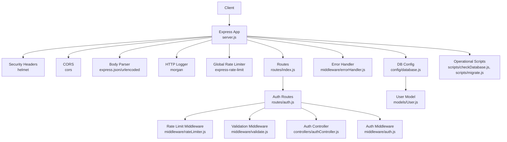
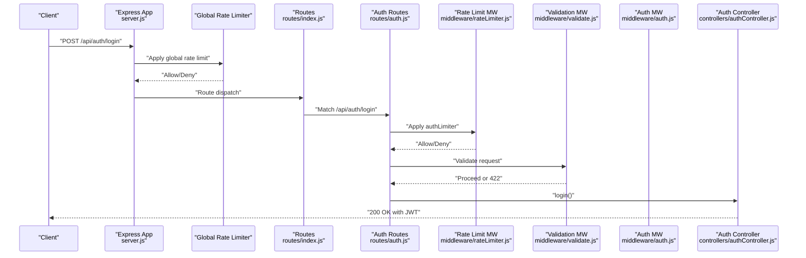
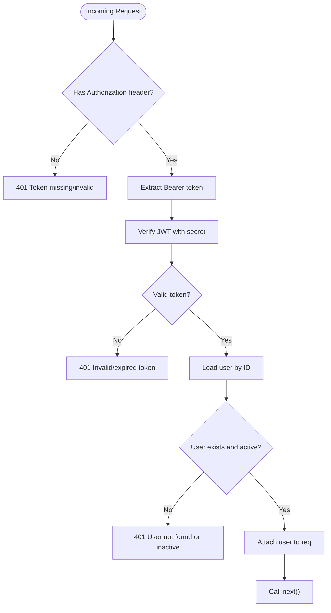
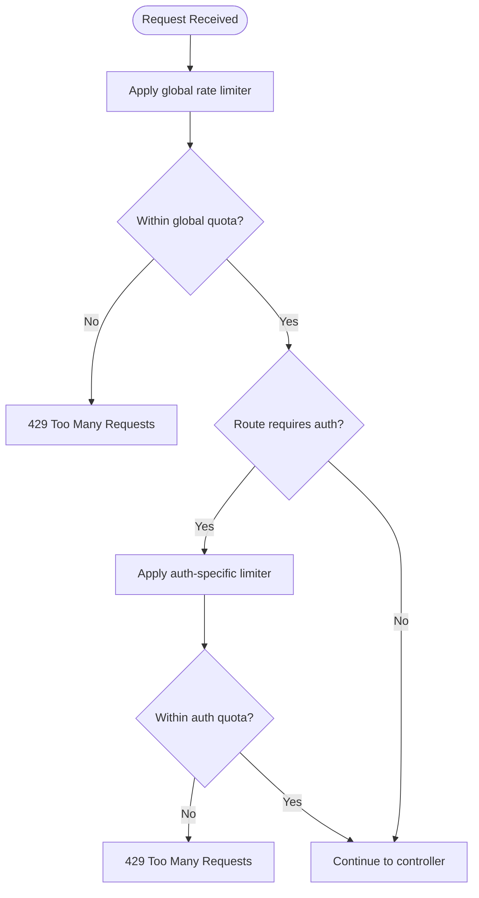
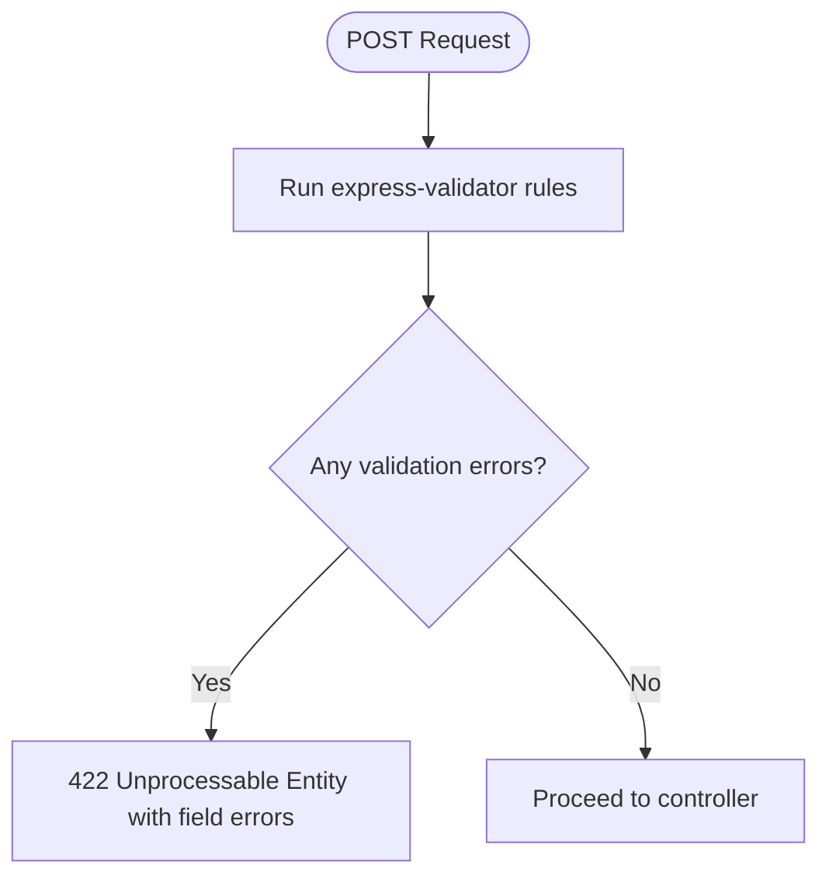
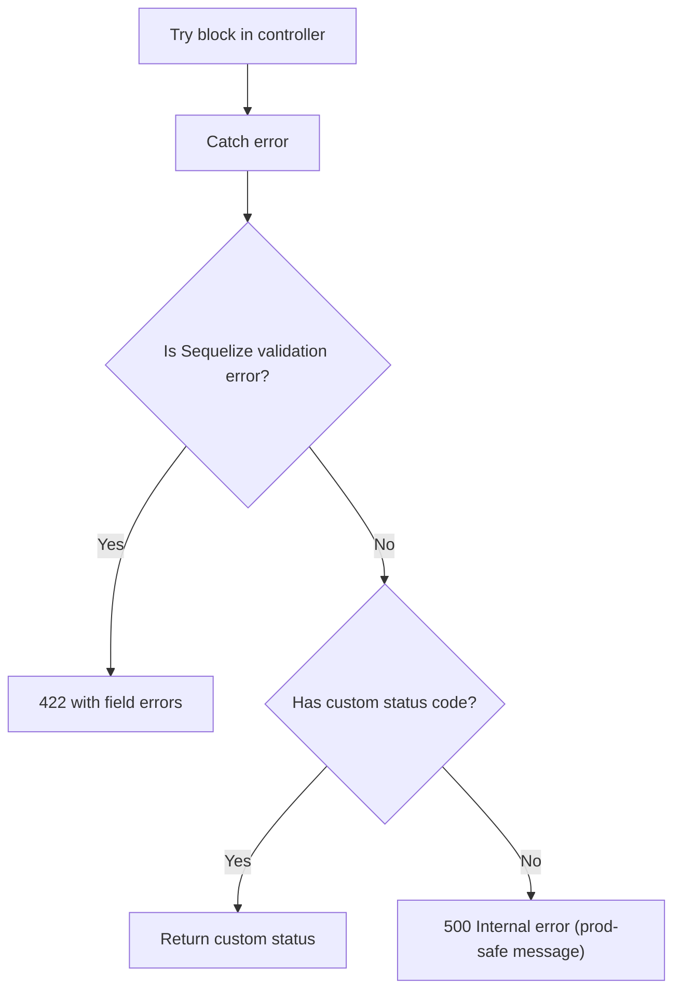
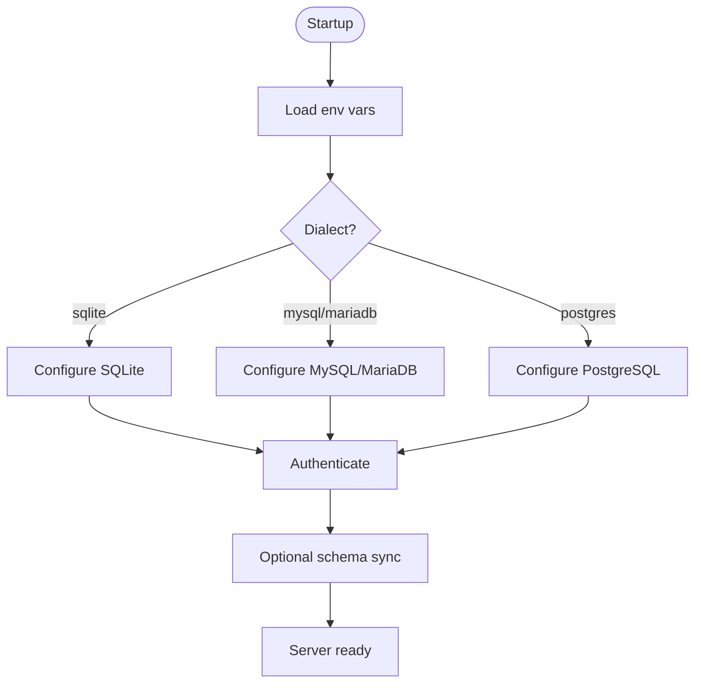
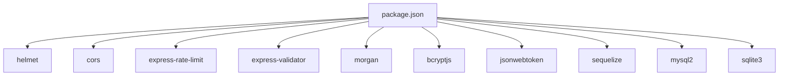

# Security and Configuration

<cite>
**Referenced Files in This Document**
- [server.js](file://rsf-backend/server.js)
- [package.json](file://rsf-backend/package.json)
- [database.js](file://rsf-backend/config/database.js)
- [auth.js](file://rsf-backend/middleware/auth.js)
- [rateLimiter.js](file://rsf-backend/middleware/rateLimiter.js)
- [validate.js](file://rsf-backend/middleware/validate.js)
- [errorHandler.js](file://rsf-backend/middleware/errorHandler.js)
- [logger.js](file://rsf-backend/middleware/logger.js)
- [authController.js](file://rsf-backend/controllers/authController.js)
- [auth.js](file://rsf-backend/routes/auth.js)
- [index.js](file://rsf-backend/routes/index.js)
- [User.js](file://rsf-backend/models/User.js)
- [checkDatabase.js](file://rsf-backend/scripts/checkDatabase.js)
- [migrate.js](file://rsf-backend/scripts/migrate.js)
</cite>

## Table of Contents
1. [Introduction](#introduction)
2. [Project Structure](#project-structure)
3. [Core Components](#core-components)
4. [Architecture Overview](#architecture-overview)
5. [Detailed Component Analysis](#detailed-component-analysis)
6. [Dependency Analysis](#dependency-analysis)
7. [Performance Considerations](#performance-considerations)
8. [Troubleshooting Guide](#troubleshooting-guide)
9. [Conclusion](#conclusion)
10. [Appendices](#appendices)

## Introduction
This document provides comprehensive security and configuration guidance for the Réseau Solidarité France platform. It focuses on backend security controls, authentication and authorization, rate limiting, input validation, environment configuration, secrets handling, SSL/TLS and secure communications, database security, encryption, backups, monitoring, and incident response. The content is grounded in the actual backend implementation and highlights areas requiring hardening for production deployments.

## Project Structure
The backend is an Express.js application with modular middleware, controllers, models, routes, and operational scripts. Security-related concerns span middleware layers (authentication, rate limiting, validation, logging, error handling), database configuration, and operational scripts for schema and migrations.

**Diagram sources**
- [server.js:18-52](file://rsf-backend/server.js#L18-L52)
- [index.js:1-28](file://rsf-backend/routes/index.js#L1-L28)
- [auth.js:1-25](file://rsf-backend/routes/auth.js#L1-L25)
- [authController.js:1-60](file://rsf-backend/controllers/authController.js#L1-L60)
- [auth.js:1-50](file://rsf-backend/middleware/auth.js#L1-L50)
- [rateLimiter.js:1-21](file://rsf-backend/middleware/rateLimiter.js#L1-L21)
- [validate.js:1-22](file://rsf-backend/middleware/validate.js#L1-L22)
- [errorHandler.js:1-38](file://rsf-backend/middleware/errorHandler.js#L1-L38)
- [database.js:1-69](file://rsf-backend/config/database.js#L1-L69)
- [User.js:1-75](file://rsf-backend/models/User.js#L1-L75)
- [checkDatabase.js:1-381](file://rsf-backend/scripts/checkDatabase.js#L1-L381)
- [migrate.js:1-390](file://rsf-backend/scripts/migrate.js#L1-L390)

**Section sources**
- [server.js:18-52](file://rsf-backend/server.js#L18-L52)
- [package.json:1-34](file://rsf-backend/package.json#L1-L34)

## Core Components
- Authentication and Authorization: JWT-based authentication with role-based authorization middleware.
- Rate Limiting: Global and strict per-endpoint limits, including login throttling.
- Input Validation: Structured validation using express-validator with centralized error handling.
- Logging and Monitoring: Morgan-based colored HTTP logging for observability.
- Error Handling: Centralized error handler with structured responses and environment-aware messages.
- Database Configuration: Support for SQLite, MySQL/MariaDB, and PostgreSQL with environment-driven options.
- Operational Scripts: Automated schema verification, seeding, and manual migrations.

**Section sources**
- [auth.js:1-50](file://rsf-backend/middleware/auth.js#L1-L50)
- [rateLimiter.js:1-21](file://rsf-backend/middleware/rateLimiter.js#L1-L21)
- [validate.js:1-22](file://rsf-backend/middleware/validate.js#L1-L22)
- [logger.js:1-28](file://rsf-backend/middleware/logger.js#L1-L28)
- [errorHandler.js:1-38](file://rsf-backend/middleware/errorHandler.js#L1-L38)
- [database.js:1-69](file://rsf-backend/config/database.js#L1-L69)
- [checkDatabase.js:1-381](file://rsf-backend/scripts/checkDatabase.js#L1-L381)
- [migrate.js:1-390](file://rsf-backend/scripts/migrate.js#L1-L390)

## Architecture Overview
The backend applies security middleware globally and enforces authentication and authorization at the route level. Authentication middleware validates JWTs and attaches user context; authorization middleware restricts endpoints by roles. Validation middleware ensures incoming payloads meet defined constraints. Rate limiting protects endpoints from abuse. Error handling centralizes error responses. Database configuration is environment-driven with support for multiple dialects.

**Diagram sources**
- [server.js:22-27](file://rsf-backend/server.js#L22-L27)
- [index.js:13-14](file://rsf-backend/routes/index.js#L13-L14)
- [auth.js:9-13](file://rsf-backend/routes/auth.js#L9-L13)
- [rateLimiter.js:13-18](file://rsf-backend/middleware/rateLimiter.js#L13-L18)
- [validate.js:9-19](file://rsf-backend/middleware/validate.js#L9-L19)
- [authController.js:6-36](file://rsf-backend/controllers/authController.js#L6-L36)

## Detailed Component Analysis

### Authentication and Authorization
- JWT Verification: Authentication middleware extracts the Bearer token, verifies it against the configured secret, loads the user, and ensures the account is active. It attaches the user to the request for downstream authorization checks.
- Role-Based Access Control: Authorization middleware checks that the authenticated user’s role matches required roles. It is intended to wrap protected routes after authentication.
- Password Handling: The User model hashes passwords using bcrypt before creation and updates. It exposes a method to compare plaintext with stored hash and a safe serialization method excluding sensitive fields.

**Diagram sources**
- [auth.js:10-33](file://rsf-backend/middleware/auth.js#L10-L33)
- [User.js:63-71](file://rsf-backend/models/User.js#L63-L71)

**Section sources**
- [auth.js:1-50](file://rsf-backend/middleware/auth.js#L1-L50)
- [User.js:1-75](file://rsf-backend/models/User.js#L1-L75)

### Rate Limiting
- Global Limit: A broad limiter allows a fixed number of requests per window per client IP.
- Login Throttling: A stricter limiter restricts login attempts to a small number per window to mitigate brute-force attacks.
- Response Headers: Standard headers indicate remaining quota and reset time.

**Diagram sources**
- [rateLimiter.js:4-18](file://rsf-backend/middleware/rateLimiter.js#L4-L18)
- [server.js:27-27](file://rsf-backend/server.js#L27-L27)
- [auth.js:10-13](file://rsf-backend/routes/auth.js#L10-L13)

**Section sources**
- [rateLimiter.js:1-21](file://rsf-backend/middleware/rateLimiter.js#L1-L21)
- [server.js:22-28](file://rsf-backend/server.js#L22-L28)
- [auth.js:9-13](file://rsf-backend/routes/auth.js#L9-L13)

### Input Validation
- Validation Layer: Uses express-validator to define validation rules per endpoint. A centralized validator middleware converts validation errors into a structured 422 response.
- Auth Endpoint Examples: Email validation and password presence for login; length constraints for password changes.

**Diagram sources**
- [validate.js:9-19](file://rsf-backend/middleware/validate.js#L9-L19)
- [auth.js:10-22](file://rsf-backend/routes/auth.js#L10-L22)

**Section sources**
- [validate.js:1-22](file://rsf-backend/middleware/validate.js#L1-L22)
- [auth.js:9-22](file://rsf-backend/routes/auth.js#L9-L22)

### Error Handling and Logging
- Error Handler: Centralizes error responses, handling Sequelize validation errors, custom errors with status codes, and generic internal errors. In production, it avoids exposing stack traces.
- Logging: Morgan logs HTTP requests with colored methods and statuses for quick observability.

**Diagram sources**
- [errorHandler.js:4-28](file://rsf-backend/middleware/errorHandler.js#L4-L28)
- [logger.js:14-25](file://rsf-backend/middleware/logger.js#L14-L25)

**Section sources**
- [errorHandler.js:1-38](file://rsf-backend/middleware/errorHandler.js#L1-L38)
- [logger.js:1-28](file://rsf-backend/middleware/logger.js#L1-L28)

### Database Configuration and Security
- Environment-Driven DSN: Database dialect and connection parameters are loaded from environment variables. Supports SQLite, MySQL/MariaDB, and PostgreSQL.
- Logging Controls: SQL logging is enabled only in development for visibility; disabled otherwise.
- Operational Scripts:
  - Schema and Column Sync: Automated table and column creation/update across dialects.
  - Admin Seed: Creates a default admin user if none exists, using environment-provided credentials.
  - Manual Migrations: Tracks applied migrations in a dedicated table and supports listing, applying, and undoing migrations.

**Diagram sources**
- [database.js:9-66](file://rsf-backend/config/database.js#L9-L66)
- [server.js:55-64](file://rsf-backend/server.js#L55-L64)

**Section sources**
- [database.js:1-69](file://rsf-backend/config/database.js#L1-L69)
- [checkDatabase.js:55-232](file://rsf-backend/scripts/checkDatabase.js#L55-L232)
- [migrate.js:217-277](file://rsf-backend/scripts/migrate.js#L217-L277)

### Operational Scripts: Security Implications
- checkDatabase.js: Ensures schema integrity and creates a default admin when the users table is empty. It prints a warning to change the default password post-first login.
- migrate.js: Provides a controlled migration system with a dedicated tracking table and rollback capability where implemented.

**Section sources**
- [checkDatabase.js:210-232](file://rsf-backend/scripts/checkDatabase.js#L210-L232)
- [migrate.js:303-336](file://rsf-backend/scripts/migrate.js#L303-L336)

## Dependency Analysis
The backend relies on several security-related libraries and follows a layered middleware pattern. Dependencies include helmet for HTTP security headers, cors for cross-origin policies, express-rate-limit for rate limiting, express-validator for validation, morgan for logging, bcryptjs for password hashing, jsonwebtoken for JWT, and sequelize for ORM.

**Diagram sources**
- [package.json:16-29](file://rsf-backend/package.json#L16-L29)

**Section sources**
- [package.json:1-34](file://rsf-backend/package.json#L1-L34)

## Performance Considerations
- Rate Limiting: Tune windows and max values per environment to balance user experience and abuse prevention.
- Body Parsing Limits: JSON payload size is capped; adjust according to expected payload sizes.
- Database Pooling: Connection pooling parameters are set; monitor contention under load.
- Logging Overhead: Morgan adds minimal overhead; disable in high-throughput production profiles if necessary.

[No sources needed since this section provides general guidance]

## Troubleshooting Guide
- Authentication Failures: Verify JWT secret correctness, token expiration, and user activation status.
- Validation Errors: Review 422 responses to identify invalid fields and update client payloads accordingly.
- Rate Limit Exceeded: Adjust quotas or implement client-side backoff; review auth limiter for login attempts.
- Database Connectivity: Confirm environment variables for dialect and credentials; check operational scripts for schema readiness.
- Error Visibility: In development, SQL logs and stack traces aid debugging; in production, rely on structured error responses and external logging systems.

**Section sources**
- [auth.js:27-32](file://rsf-backend/middleware/auth.js#L27-L32)
- [validate.js:9-19](file://rsf-backend/middleware/validate.js#L9-L19)
- [rateLimiter.js:4-18](file://rsf-backend/middleware/rateLimiter.js#L4-L18)
- [errorHandler.js:4-28](file://rsf-backend/middleware/errorHandler.js#L4-L28)
- [database.js:9-15](file://rsf-backend/config/database.js#L9-L15)

## Conclusion
The backend implements foundational security controls: JWT authentication with role-based authorization, robust input validation, global and endpoint-specific rate limiting, structured error handling, and comprehensive logging. Production hardening should focus on environment-driven configuration, secret management, transport security, database encryption, and operational monitoring. The provided operational scripts facilitate schema and migration management while highlighting the importance of changing default credentials.

[No sources needed since this section summarizes without analyzing specific files]

## Appendices

### A. Security Best Practices Checklist
- Environment Management
  - Store secrets via environment variables or a secrets manager; never commit secrets to source control.
  - Use separate environment files per stage (development, staging, production) with strict access controls.
- Transport Security
  - Enforce HTTPS/TLS at the edge (reverse proxy/load balancer) and configure strong cipher suites and TLS versions.
  - Use HSTS and secure cookie attributes when applicable.
- Secrets and Credentials
  - Rotate JWT secrets and database credentials regularly.
  - Change default admin credentials immediately after initial deployment.
- Database Security
  - Encrypt data at rest using database-native encryption or transparent encryption.
  - Restrict network access to the database; prefer private subnets and firewall rules.
  - Back up encrypted snapshots and test restoration procedures.
- Monitoring and Auditing
  - Aggregate logs centrally; alert on authentication failures, rate limit hits, and validation errors.
  - Retain audit trails for authentication and administrative actions.
- Incident Response
  - Define escalation paths for suspected breaches.
  - Contain incidents by revoking compromised tokens/secrets and blocking offending IPs.
  - Conduct post-mortems and update controls.

[No sources needed since this section provides general guidance]

### B. Configuration Templates and Compliance Notes
- Environment Variables (conceptual)
  - Database: DB_DIALECT, DB_HOST, DB_PORT, DB_NAME, DB_USER, DB_PASS, DB_STORAGE
  - Security: JWT_SECRET, JWT_EXPIRES_IN, NODE_ENV, PORT
  - Admin Defaults: ADMIN_NAME, ADMIN_EMAIL, ADMIN_PASSWORD
- Compliance Considerations
  - Data Protection: Treat personal data as sensitive; apply pseudonymization and encryption where feasible.
  - Access Control: Principle of least privilege; enforce role-based access for administrative endpoints.
  - Auditability: Maintain logs for authentication, authorization, and data modifications.

[No sources needed since this section provides general guidance]