# Admin Dashboard Components

<cite>
**Referenced Files in This Document**
- [admin-layout.ts](file://rsf-front/src/app/admin/admin-layout/admin-layout.ts)
- [admin-auth.service.ts](file://rsf-front/src/app/admin/admin-auth.service.ts)
- [admin-auth.guard.ts](file://rsf-front/src/app/admin/admin-auth.guard.ts)
- [admin-auth.interceptor.ts](file://rsf-front/src/app/admin/admin-auth.interceptor.ts)
- [admin-alert.service.ts](file://rsf-front/src/app/admin/admin-alert.service.ts)
- [admin-api.service.ts](file://rsf-front/src/app/admin/admin-api.service.ts)
- [admin-dashboard.ts](file://rsf-front/src/app/admin/admin-dashboard/admin-dashboard.ts)
- [admin-editor-config.ts](file://rsf-front/src/app/admin/admin-editor-config.ts)
- [admin-login.ts](file://rsf-front/src/app/admin/admin-login/admin-login.ts)
- [admin-settings.ts](file://rsf-front/src/app/admin/admin-settings/admin-settings.ts)
- [admin-accueil.ts](file://rsf-front/src/app/admin/admin-accueil/admin-accueil.ts)
- [admin-actions-solidaires.ts](file://rsf-front/src/app/admin/admin-actions-solidaires/admin-actions-solidaires.ts)
- [admin-actualites.ts](file://rsf-front/src/app/admin/admin-actualites/admin-actualites.ts)
- [admin-contact.ts](file://rsf-front/src/app/admin/admin-contact/admin-contact.ts)
- [app.config.ts](file://rsf-front/src/app/app.config.ts)
- [app.routes.ts](file://rsf-front/src/app/app.routes.ts)
- [environment.ts](file://rsf-front/src/environments/environment.ts)
</cite>

## Table of Contents
1. [Introduction](#introduction)
2. [Project Structure](#project-structure)
3. [Core Components](#core-components)
4. [Architecture Overview](#architecture-overview)
5. [Detailed Component Analysis](#detailed-component-analysis)
6. [Dependency Analysis](#dependency-analysis)
7. [Performance Considerations](#performance-considerations)
8. [Troubleshooting Guide](#troubleshooting-guide)
9. [Conclusion](#conclusion)

## Introduction
This document provides comprehensive documentation for the admin dashboard components and authentication system of the RESEAU SOLIDARITE FRANCE project. It covers the admin layout component (navigation, sidebar management, responsive design patterns), the authentication service implementation (JWT token handling, session management), the authentication guard mechanism for protecting admin routes, the HTTP interceptor for adding authentication headers, the admin alert service for user notifications, and the admin API service for backend communication. It also documents the dashboard component functionality, content management interfaces, and editor configurations, along with component communication patterns, form handling, and validation strategies used in the admin interface.

## Project Structure
The admin interface is organized under the Angular application’s admin module. Key areas include:
- Layout and navigation: AdminLayout component manages the global admin shell, navigation groups, and mobile responsiveness.
- Authentication: AdminAuthService handles login, logout, session persistence, and user metadata retrieval.
- Guards and Interceptors: adminAuthGuard protects routes; adminAuthInterceptor attaches tokens to outgoing requests and handles 401 responses.
- Services: AdminAlertService centralizes notifications; AdminApiService encapsulates backend communication.
- Dashboard and Editors: AdminDashboard presents overview statistics and quick links; admin-editor-config.ts defines editor configurations per page/resource.
- Page-specific editors: Components for managing content on specific pages (e.g., Accueil, Actualites, Contact) and collections (e.g., Actions Solidaires).

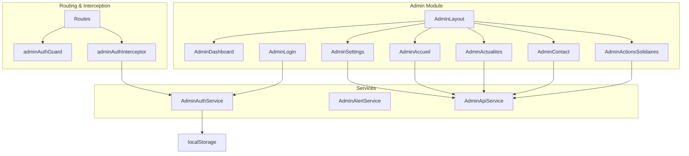

**Diagram sources**
- [admin-layout.ts:18-24](file://rsf-front/src/app/admin/admin-layout/admin-layout.ts#L18-L24)
- [admin-dashboard.ts:5-10](file://rsf-front/src/app/admin/admin-dashboard/admin-dashboard.ts#L5-L10)
- [admin-login.ts:9-14](file://rsf-front/src/app/admin/admin-login/admin-login.ts#L9-L14)
- [admin-settings.ts:27-32](file://rsf-front/src/app/admin/admin-settings/admin-settings.ts#L27-L32)
- [admin-accueil.ts:6-11](file://rsf-front/src/app/admin/admin-accueil/admin-accueil.ts#L6-L11)
- [admin-actualites.ts:7-12](file://rsf-front/src/app/admin/admin-actualites/admin-actualites.ts#L7-L12)
- [admin-contact.ts:7-12](file://rsf-front/src/app/admin/admin-contact/admin-contact.ts#L7-L12)
- [admin-actions-solidaires.ts:7-12](file://rsf-front/src/app/admin/admin-actions-solidaires/admin-actions-solidaires.ts#L7-L12)
- [admin-auth.service.ts:26-28](file://rsf-front/src/app/admin/admin-auth.service.ts#L26-L28)
- [admin-alert.service.ts:4-6](file://rsf-front/src/app/admin/admin-alert.service.ts#L4-L6)
- [admin-api.service.ts:14-16](file://rsf-front/src/app/admin/admin-api.service.ts#L14-L16)
- [admin-auth.guard.ts:1-19](file://rsf-front/src/app/admin/admin-auth.guard.ts#L1-L19)
- [admin-auth.interceptor.ts:1-30](file://rsf-front/src/app/admin/admin-auth.interceptor.ts#L1-L30)
- [app.routes.ts:20-112](file://rsf-front/src/app/app.routes.ts#L20-L112)
- [app.config.ts:8-14](file://rsf-front/src/app/app.config.ts#L8-L14)

**Section sources**
- [app.routes.ts:20-112](file://rsf-front/src/app/app.routes.ts#L20-L112)
- [app.config.ts:8-14](file://rsf-front/src/app/app.config.ts#L8-L14)

## Core Components
This section outlines the core building blocks of the admin interface and authentication system.

- AdminLayout: Provides the main admin shell, navigation groups, active path detection, mobile sidebar toggling, and logout flow.
- AdminAuthService: Manages authentication state, persists sessions in localStorage, exposes user metadata, and supports password changes.
- AdminAuthGuard: Protects admin routes by checking authentication status and redirecting unauthenticated users to the login page.
- AdminAuthInterceptor: Attaches Authorization headers for API requests and logs out on 401 responses.
- AdminAlertService: Centralized notifications using SweetAlert2 for confirmations, success, errors, and toasts.
- AdminApiService: Encapsulates CRUD operations for pages, resources, settings, and contact messages with standardized response mapping.
- AdminDashboard: Displays overview statistics and quick navigation links to admin sections.
- Editor Configurations: Strongly typed configurations for page editors and collections define fields, defaults, and behavior.

**Section sources**
- [admin-layout.ts:25-114](file://rsf-front/src/app/admin/admin-layout/admin-layout.ts#L25-L114)
- [admin-auth.service.ts:29-107](file://rsf-front/src/app/admin/admin-auth.service.ts#L29-L107)
- [admin-auth.guard.ts:5-18](file://rsf-front/src/app/admin/admin-auth.guard.ts#L5-L18)
- [admin-auth.interceptor.ts:7-29](file://rsf-front/src/app/admin/admin-auth.interceptor.ts#L7-L29)
- [admin-alert.service.ts:7-79](file://rsf-front/src/app/admin/admin-alert.service.ts#L7-L79)
- [admin-api.service.ts:17-93](file://rsf-front/src/app/admin/admin-api.service.ts#L17-L93)
- [admin-dashboard.ts:11-82](file://rsf-front/src/app/admin/admin-dashboard/admin-dashboard.ts#L11-L82)
- [admin-editor-config.ts:1-600](file://rsf-front/src/app/admin/admin-editor-config.ts#L1-L600)

## Architecture Overview
The admin architecture follows Angular best practices with clear separation of concerns:
- Routing guards protect admin routes.
- An HTTP interceptor ensures authenticated requests.
- Services handle state and API communication.
- Components focus on presentation and user interaction.

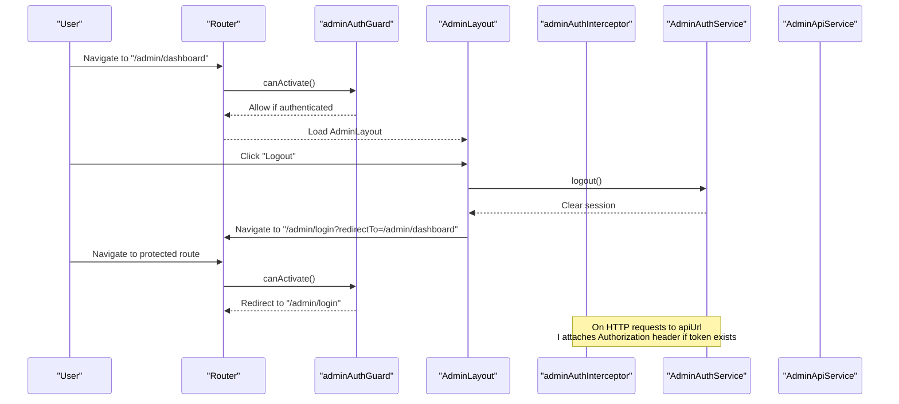

**Diagram sources**
- [admin-auth.guard.ts:5-18](file://rsf-front/src/app/admin/admin-auth.guard.ts#L5-L18)
- [admin-layout.ts:107-112](file://rsf-front/src/app/admin/admin-layout/admin-layout.ts#L107-L112)
- [admin-auth.interceptor.ts:7-29](file://rsf-front/src/app/admin/admin-auth.interceptor.ts#L7-L29)
- [admin-auth.service.ts:58-61](file://rsf-front/src/app/admin/admin-auth.service.ts#L58-L61)
- [app.routes.ts:20-112](file://rsf-front/src/app/app.routes.ts#L20-L112)

## Detailed Component Analysis

### Admin Layout Component
The AdminLayout component orchestrates the admin shell:
- Navigation groups: Hierarchical grouping of menu items for “Pages du site,” “Paramètres,” and “Tableau de bord.”
- Active path detection: Uses router events and snapshot data to set the active path, page title, and section label.
- Mobile sidebar: Toggle and close mechanisms for responsive design.
- User profile: Displays user initials derived from the authenticated user’s name.
- Logout: Confirms action and navigates to the login page.

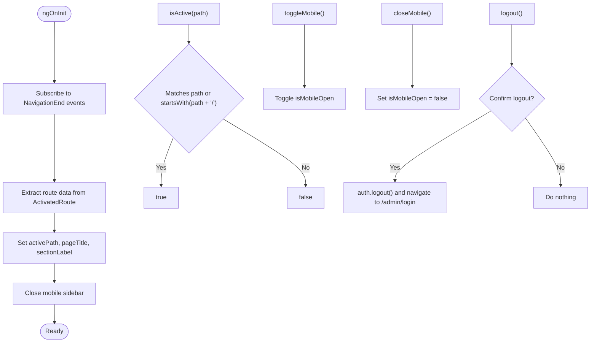

**Diagram sources**
- [admin-layout.ts:67-97](file://rsf-front/src/app/admin/admin-layout/admin-layout.ts#L67-L97)
- [admin-layout.ts:99-112](file://rsf-front/src/app/admin/admin-layout/admin-layout.ts#L99-L112)

**Section sources**
- [admin-layout.ts:25-114](file://rsf-front/src/app/admin/admin-layout/admin-layout.ts#L25-L114)

### Authentication Service Implementation
AdminAuthService manages authentication state and session persistence:
- Session state: Reactive signals store the current session and derive user data.
- Login: Posts credentials to the backend and stores the returned session.
- Password change: Calls the backend endpoint for changing passwords.
- Logout: Clears session state and removes stored session.
- Token and user helpers: Retrieves token and computes user initials.
- Persistence: Reads and writes session to localStorage with validation.

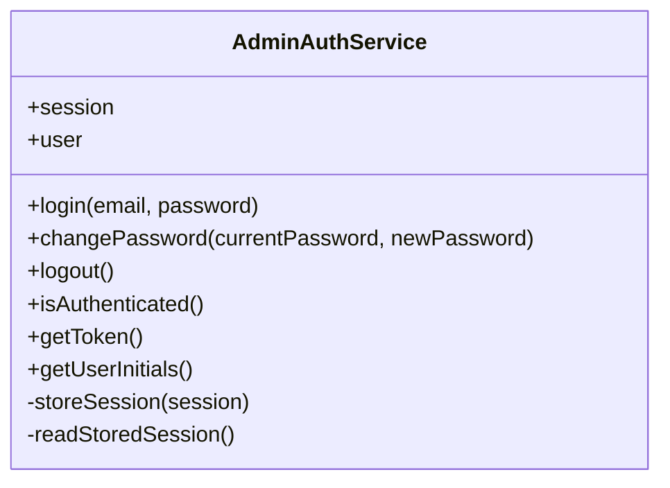

**Diagram sources**
- [admin-auth.service.ts:29-107](file://rsf-front/src/app/admin/admin-auth.service.ts#L29-L107)

**Section sources**
- [admin-auth.service.ts:29-107](file://rsf-front/src/app/admin/admin-auth.service.ts#L29-L107)

### Authentication Guard Mechanism
adminAuthGuard protects admin routes:
- Checks authentication via AdminAuthService.
- If authenticated, allows navigation.
- Otherwise, redirects to the login page with the intended URL as a query parameter.

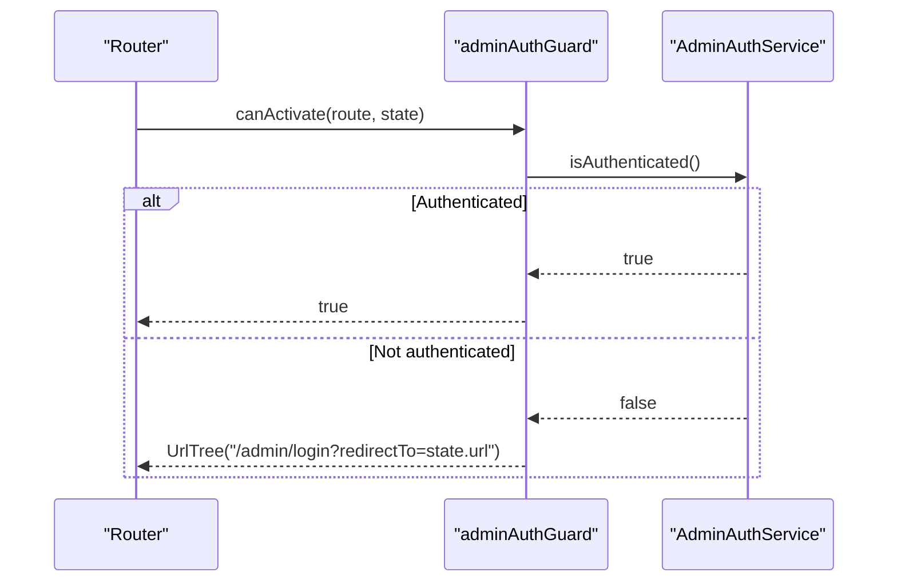

**Diagram sources**
- [admin-auth.guard.ts:5-18](file://rsf-front/src/app/admin/admin-auth.guard.ts#L5-L18)
- [admin-auth.service.ts:63-65](file://rsf-front/src/app/admin/admin-auth.service.ts#L63-L65)

**Section sources**
- [admin-auth.guard.ts:5-18](file://rsf-front/src/app/admin/admin-auth.guard.ts#L5-L18)

### HTTP Interceptor for Authentication Headers
adminAuthInterceptor automatically attaches Authorization headers and handles 401 responses:
- Attaches Bearer token for requests targeting the API base URL.
- On 401 responses, clears the session and rethrows the error.

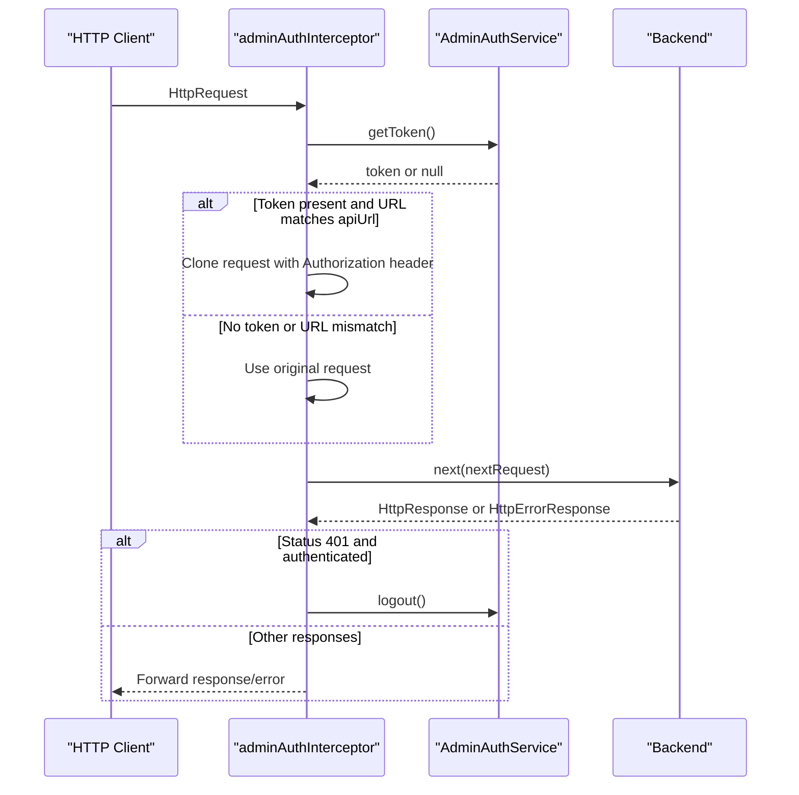

**Diagram sources**
- [admin-auth.interceptor.ts:7-29](file://rsf-front/src/app/admin/admin-auth.interceptor.ts#L7-L29)
- [admin-auth.service.ts:58-61](file://rsf-front/src/app/admin/admin-auth.service.ts#L58-L61)
- [environment.ts:1-5](file://rsf-front/src/environments/environment.ts#L1-L5)

**Section sources**
- [admin-auth.interceptor.ts:7-29](file://rsf-front/src/app/admin/admin-auth.interceptor.ts#L7-L29)

### Admin Alert Service
AdminAlertService centralizes user notifications:
- Confirmation dialogs with customizable titles, texts, icons, and button labels.
- Success and error notifications.
- Toast notifications for quick feedback.

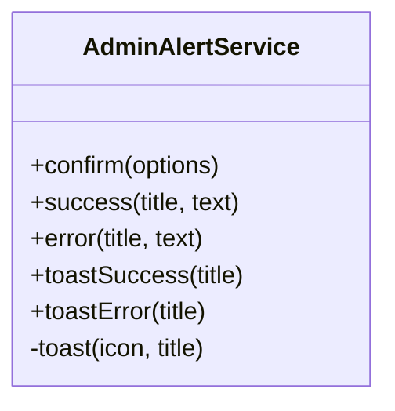

**Diagram sources**
- [admin-alert.service.ts:7-79](file://rsf-front/src/app/admin/admin-alert.service.ts#L7-L79)

**Section sources**
- [admin-alert.service.ts:7-79](file://rsf-front/src/app/admin/admin-alert.service.ts#L7-L79)

### Admin API Service
AdminApiService abstracts backend communication:
- Pages: Fetch and update page content by key.
- Resources: Generic list/create/update/delete/reorder endpoints for collections.
- Settings: Retrieve and update global settings.
- Contact: List, mark as read, and delete messages.

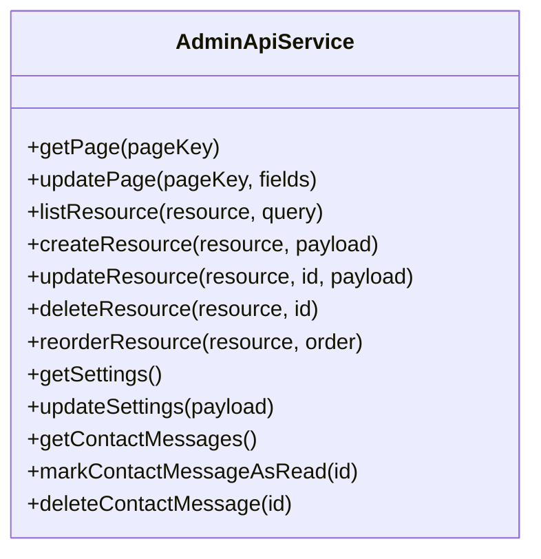

**Diagram sources**
- [admin-api.service.ts:17-93](file://rsf-front/src/app/admin/admin-api.service.ts#L17-L93)

**Section sources**
- [admin-api.service.ts:17-93](file://rsf-front/src/app/admin/admin-api.service.ts#L17-L93)

### Dashboard Component
AdminDashboard provides an overview and quick access:
- Stats cards: Overview metrics for pages, collections, navigation, and messages.
- Quick links: Direct navigation to key admin sections.
- Admin groups: Organized lists of admin sections grouped by functional area.

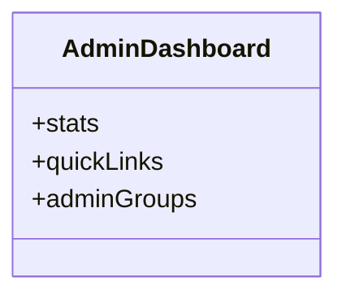

**Diagram sources**
- [admin-dashboard.ts:11-82](file://rsf-front/src/app/admin/admin-dashboard/admin-dashboard.ts#L11-L82)

**Section sources**
- [admin-dashboard.ts:11-82](file://rsf-front/src/app/admin/admin-dashboard/admin-dashboard.ts#L11-L82)

### Editor Configurations and Content Management Interfaces
Editor configurations define how content is edited:
- Strongly typed field definitions for text, textarea, boolean, number, date, string-list, and object-list.
- Collection configurations specify resource endpoints, labels, fields, defaults, filters, and ordering.
- Page configurations define page keys, descriptions, field orders, and defaults.

Page-specific editors demonstrate CRUD patterns:
- AdminAccueil: Loads and saves page content.
- AdminActualites: Lists, creates, updates, and deletes news items.
- AdminContact: Loads and saves contact page content.
- AdminActionsSolidaires: Manages actions with add/edit forms and deletion.

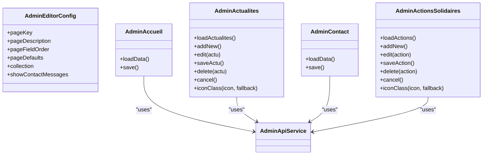

**Diagram sources**
- [admin-editor-config.ts:41-48](file://rsf-front/src/app/admin/admin-editor-config.ts#L41-L48)
- [admin-accueil.ts:12-33](file://rsf-front/src/app/admin/admin-accueil/admin-accueil.ts#L12-L33)
- [admin-actualites.ts:13-78](file://rsf-front/src/app/admin/admin-actualites/admin-actualites.ts#L13-L78)
- [admin-contact.ts:13-34](file://rsf-front/src/app/admin/admin-contact/admin-contact.ts#L13-L34)
- [admin-actions-solidaires.ts:13-80](file://rsf-front/src/app/admin/admin-actions-solidaires/admin-actions-solidaires.ts#L13-L80)
- [admin-api.service.ts:17-93](file://rsf-front/src/app/admin/admin-api.service.ts#L17-L93)

**Section sources**
- [admin-editor-config.ts:1-600](file://rsf-front/src/app/admin/admin-editor-config.ts#L1-L600)
- [admin-accueil.ts:12-33](file://rsf-front/src/app/admin/admin-accueil/admin-accueil.ts#L12-L33)
- [admin-actualites.ts:13-78](file://rsf-front/src/app/admin/admin-actualites/admin-actualites.ts#L13-L78)
- [admin-contact.ts:13-34](file://rsf-front/src/app/admin/admin-contact/admin-contact.ts#L13-L34)
- [admin-actions-solidaires.ts:13-80](file://rsf-front/src/app/admin/admin-actions-solidaires/admin-actions-solidaires.ts#L13-L80)

### Component Communication Patterns, Form Handling, and Validation Strategies
- Component-to-service communication: Components subscribe to service observables for data fetching and mutations.
- Form handling: Components maintain local state for forms (e.g., editing flags, current item), then call AdminApiService to persist changes.
- Validation strategies: Basic client-side checks (e.g., ensuring required fields are filled) and JSON parsing/validation for settings with JSON type. Backend validation errors are surfaced via alerts.

**Section sources**
- [admin-settings.ts:98-128](file://rsf-front/src/app/admin/admin-settings/admin-settings.ts#L98-L128)
- [admin-settings.ts:240-272](file://rsf-front/src/app/admin/admin-settings/admin-settings.ts#L240-L272)
- [admin-actions-solidaires.ts:43-57](file://rsf-front/src/app/admin/admin-actions-solidaires/admin-actions-solidaires.ts#L43-L57)
- [admin-actualites.ts:43-55](file://rsf-front/src/app/admin/admin-actualites/admin-actualites.ts#L43-L55)

## Dependency Analysis
The admin module exhibits clear dependency relationships:
- Routing depends on guards and interceptors.
- Components depend on services for data and state.
- Services depend on HTTP client and environment configuration.

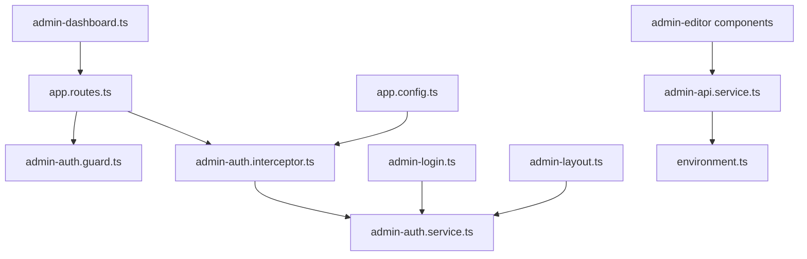

**Diagram sources**
- [app.routes.ts:20-112](file://rsf-front/src/app/app.routes.ts#L20-L112)
- [admin-auth.guard.ts:1-19](file://rsf-front/src/app/admin/admin-auth.guard.ts#L1-L19)
- [admin-auth.interceptor.ts:1-30](file://rsf-front/src/app/admin/admin-auth.interceptor.ts#L1-L30)
- [admin-auth.service.ts:1-107](file://rsf-front/src/app/admin/admin-auth.service.ts#L1-L107)
- [admin-login.ts:1-65](file://rsf-front/src/app/admin/admin-login/admin-login.ts#L1-L65)
- [admin-layout.ts:1-114](file://rsf-front/src/app/admin/admin-layout/admin-layout.ts#L1-L114)
- [admin-dashboard.ts:1-82](file://rsf-front/src/app/admin/admin-dashboard/admin-dashboard.ts#L1-L82)
- [admin-api.service.ts:1-93](file://rsf-front/src/app/admin/admin-api.service.ts#L1-L93)
- [environment.ts:1-5](file://rsf-front/src/environments/environment.ts#L1-L5)
- [app.config.ts:8-14](file://rsf-front/src/app/app.config.ts#L8-L14)

**Section sources**
- [app.routes.ts:20-112](file://rsf-front/src/app/app.routes.ts#L20-L112)
- [app.config.ts:8-14](file://rsf-front/src/app/app.config.ts#L8-L14)

## Performance Considerations
- Reactive state: Using signals and computed properties minimizes unnecessary computations.
- HTTP interception: Attaching headers only for relevant URLs reduces overhead.
- Local storage caching: Persisting session avoids repeated logins but requires careful invalidation on 401.
- Observables: Proper subscription cleanup and finalize usage prevent memory leaks.

## Troubleshooting Guide
- Authentication failures:
  - Verify backend login endpoint and response shape.
  - Ensure environment.apiUrl matches the backend URL.
  - Check that the interceptor attaches Authorization headers for API requests.
- 401 Unauthorized:
  - Confirm the interceptor triggers logout on 401 responses.
  - Verify token validity and expiration handling.
- Alerts not appearing:
  - Ensure SweetAlert2 is properly included and configured.
- API errors:
  - Inspect AdminApiService response mapping and error handling.
  - Validate query parameters and payload structures.

**Section sources**
- [admin-auth.interceptor.ts:20-28](file://rsf-front/src/app/admin/admin-auth.interceptor.ts#L20-L28)
- [admin-alert.service.ts:14-31](file://rsf-front/src/app/admin/admin-alert.service.ts#L14-L31)
- [admin-api.service.ts:22-30](file://rsf-front/src/app/admin/admin-api.service.ts#L22-L30)
- [environment.ts:1-5](file://rsf-front/src/environments/environment.ts#L1-L5)

## Conclusion
The admin dashboard components and authentication system are designed with Angular’s reactive patterns and clear separation of concerns. The AdminLayout provides a robust shell, AdminAuthService manages authentication state, adminAuthGuard and adminAuthInterceptor protect and secure routes, AdminAlertService standardizes user feedback, and AdminApiService encapsulates backend interactions. Editor configurations enable flexible content management across pages and collections, while component communication patterns ensure predictable data flow and validation strategies support reliable user experiences.