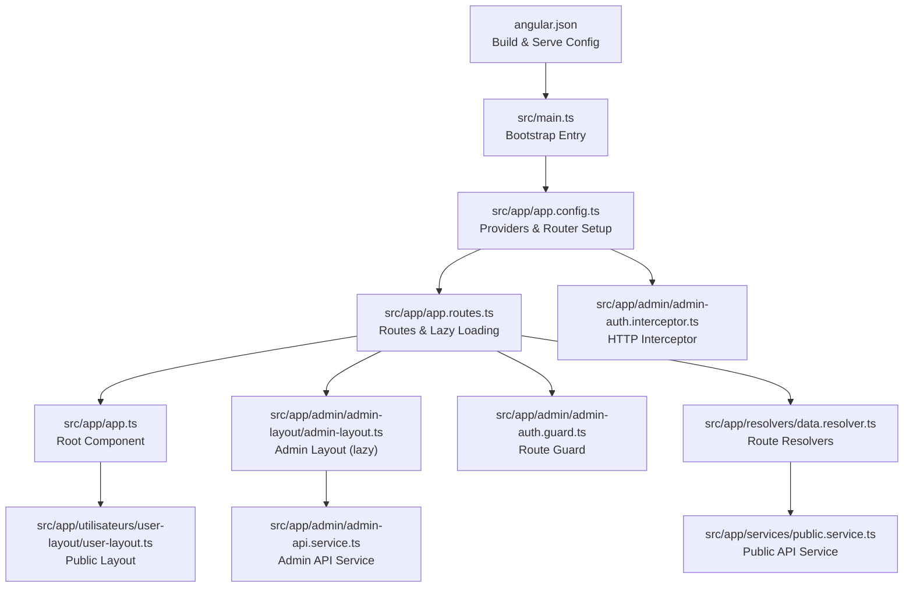
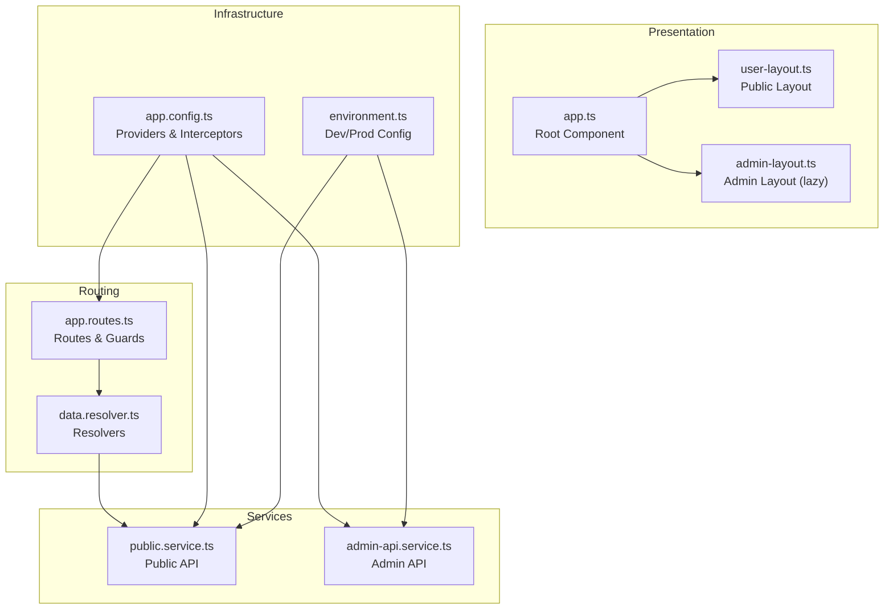
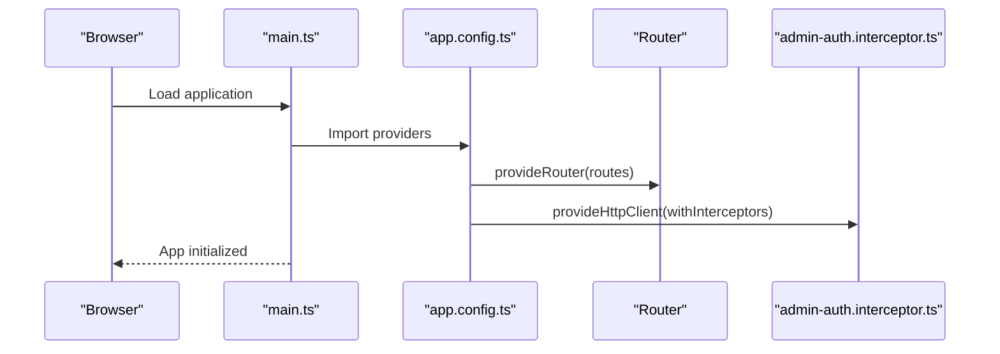
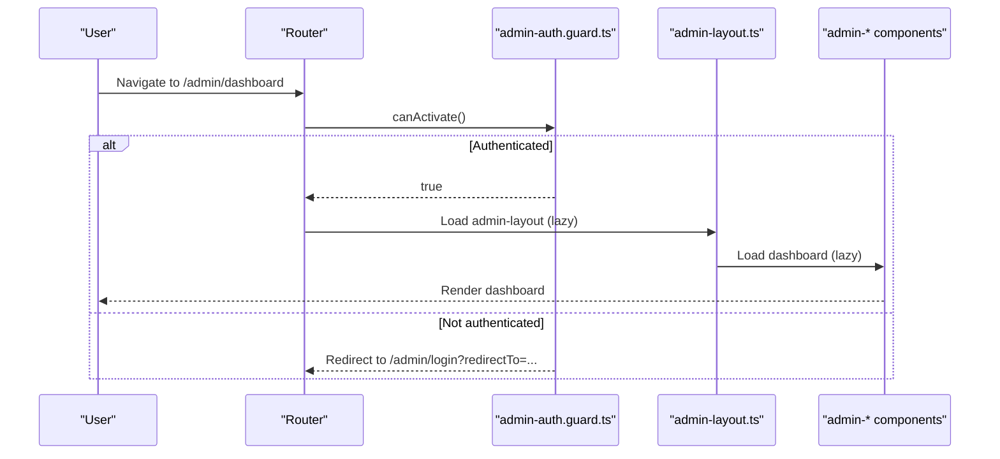
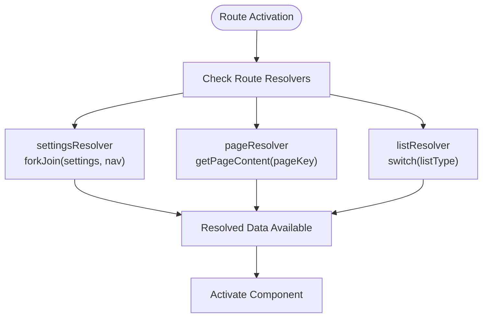
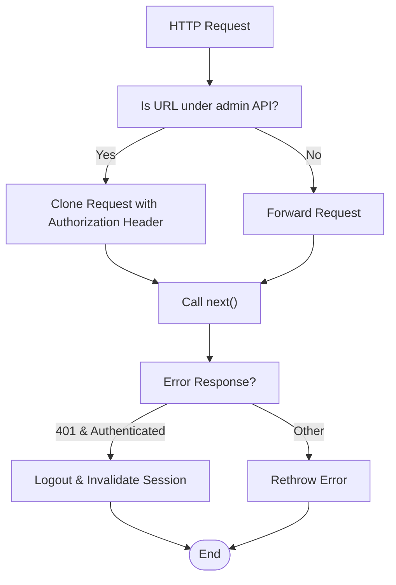
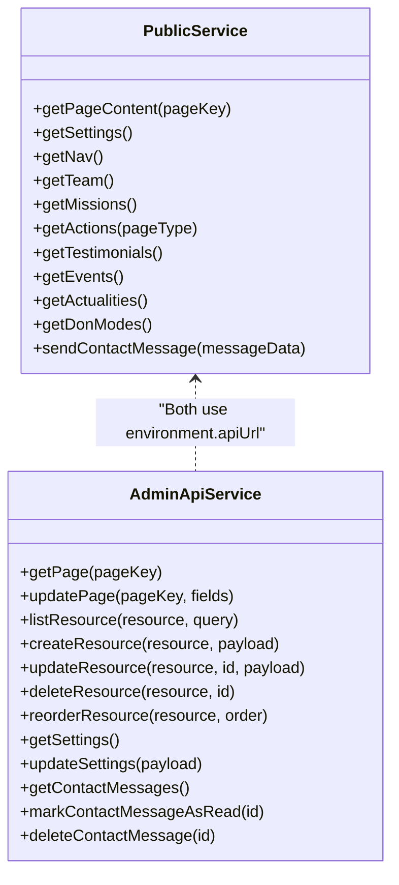
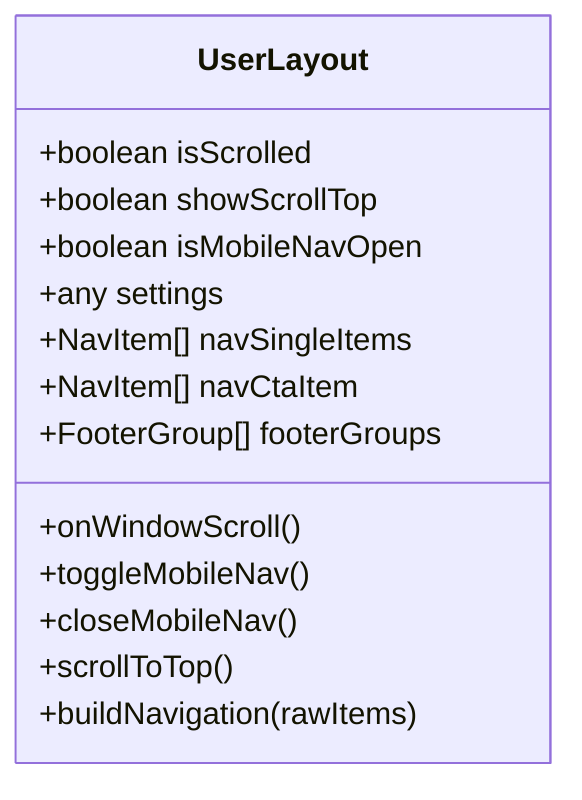
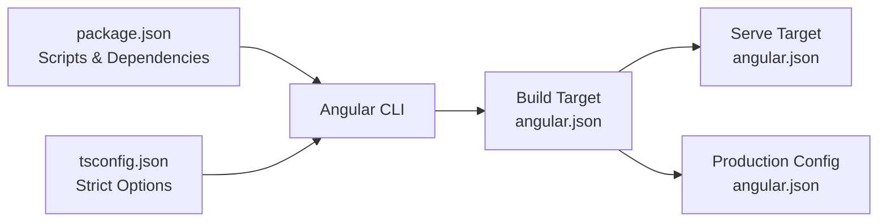

# Angular Application Structure

<cite>
**Referenced Files in This Document**
- [angular.json](file://rsf-front/angular.json)
- [package.json](file://rsf-front/package.json)
- [main.ts](file://rsf-front/src/main.ts)
- [app.config.ts](file://rsf-front/src/app/app.config.ts)
- [app.routes.ts](file://rsf-front/src/app/app.routes.ts)
- [app.ts](file://rsf-front/src/app/app.ts)
- [environment.ts](file://rsf-front/src/environments/environment.ts)
- [environment.prod.ts](file://rsf-front/src/environments/environment.prod.ts)
- [tsconfig.json](file://rsf-front/tsconfig.json)
- [user-layout.ts](file://rsf-front/src/app/utilisateurs/user-layout/user-layout.ts)
- [admin-auth.guard.ts](file://rsf-front/src/app/admin/admin-auth.guard.ts)
- [admin-auth.interceptor.ts](file://rsf-front/src/app/admin/admin-auth.interceptor.ts)
- [data.resolver.ts](file://rsf-front/src/app/resolvers/data.resolver.ts)
- [public.service.ts](file://rsf-front/src/app/services/public.service.ts)
- [admin-api.service.ts](file://rsf-front/src/app/admin/admin-api.service.ts)
</cite>

## Table of Contents
1. [Introduction](#introduction)
2. [Project Structure](#project-structure)
3. [Core Components](#core-components)
4. [Architecture Overview](#architecture-overview)
5. [Detailed Component Analysis](#detailed-component-analysis)
6. [Dependency Analysis](#dependency-analysis)
7. [Performance Considerations](#performance-considerations)
8. [Troubleshooting Guide](#troubleshooting-guide)
9. [Conclusion](#conclusion)
10. [Appendices](#appendices)

## Introduction
This document explains the Angular application structure and configuration for the frontend project. It covers the bootstrap process, module organization, dependency injection setup, routing with lazy loading and guards, build configuration, environment-specific settings, component hierarchy, service architecture, state management patterns via resolvers, TypeScript configuration, linting and code quality, performance optimization, and deployment strategies.

## Project Structure
The Angular application resides under rsf-front/src and is configured via Angular CLI. The build pipeline is managed by the Angular CLI builder, with assets served from the public directory and styles centralized in a global stylesheet. Development and production builds are configured with distinct optimization and hashing strategies.

**Diagram sources**
- [angular.json:17-54](file://rsf-front/angular.json#L17-L54)
- [main.ts:1-7](file://rsf-front/src/main.ts#L1-L7)
- [app.config.ts:8-14](file://rsf-front/src/app/app.config.ts#L8-L14)
- [app.routes.ts:20-176](file://rsf-front/src/app/app.routes.ts#L20-L176)
- [app.ts:4-12](file://rsf-front/src/app/app.ts#L4-L12)
- [user-layout.ts:22-28](file://rsf-front/src/app/utilisateurs/user-layout/user-layout.ts#L22-L28)
- [admin-auth.guard.ts:5-18](file://rsf-front/src/app/admin/admin-auth.guard.ts#L5-L18)
- [admin-auth.interceptor.ts:7-29](file://rsf-front/src/app/admin/admin-auth.interceptor.ts#L7-L29)
- [data.resolver.ts:6-41](file://rsf-front/src/app/resolvers/data.resolver.ts#L6-L41)
- [public.service.ts:9-149](file://rsf-front/src/app/services/public.service.ts#L9-L149)
- [admin-api.service.ts:14-92](file://rsf-front/src/app/admin/admin-api.service.ts#L14-L92)

**Section sources**
- [angular.json:1-75](file://rsf-front/angular.json#L1-L75)
- [package.json:1-34](file://rsf-front/package.json#L1-L34)

## Core Components
- Bootstrap entry initializes the application with a configuration object that provides router, HTTP client with interceptors, and global error listeners.
- Root component renders the router outlet and exposes a signal for the application title.
- Routing defines public pages under a user layout and an admin area with lazy-loaded components and guards.
- Resolvers fetch pre-render data for routes, ensuring content availability before activation.
- Services encapsulate HTTP calls to public and admin APIs, normalizing data and handling errors gracefully.

**Section sources**
- [main.ts:1-7](file://rsf-front/src/main.ts#L1-L7)
- [app.config.ts:8-14](file://rsf-front/src/app/app.config.ts#L8-L14)
- [app.ts:4-12](file://rsf-front/src/app/app.ts#L4-L12)
- [app.routes.ts:20-176](file://rsf-front/src/app/app.routes.ts#L20-L176)
- [data.resolver.ts:6-41](file://rsf-front/src/app/resolvers/data.resolver.ts#L6-L41)
- [public.service.ts:9-149](file://rsf-front/src/app/services/public.service.ts#L9-L149)
- [admin-api.service.ts:14-92](file://rsf-front/src/app/admin/admin-api.service.ts#L14-L92)

## Architecture Overview
The application follows a layered architecture:
- Presentation layer: Components organized under user and admin feature areas.
- Routing layer: Centralized routes with lazy loading and guards.
- Services layer: Public and admin services for data access.
- Infrastructure layer: HTTP interceptors and environment configuration.

**Diagram sources**
- [app.ts:4-12](file://rsf-front/src/app/app.ts#L4-L12)
- [user-layout.ts:22-28](file://rsf-front/src/app/utilisateurs/user-layout/user-layout.ts#L22-L28)
- [app.routes.ts:20-176](file://rsf-front/src/app/app.routes.ts#L20-L176)
- [data.resolver.ts:6-41](file://rsf-front/src/app/resolvers/data.resolver.ts#L6-L41)
- [public.service.ts:9-149](file://rsf-front/src/app/services/public.service.ts#L9-L149)
- [admin-api.service.ts:14-92](file://rsf-front/src/app/admin/admin-api.service.ts#L14-L92)
- [app.config.ts:8-14](file://rsf-front/src/app/app.config.ts#L8-L14)
- [environment.ts:1-5](file://rsf-front/src/environments/environment.ts#L1-L5)

## Detailed Component Analysis

### Bootstrap and DI Setup
- The application bootstraps using the modern application bootstrap API with a configuration object that:
  - Provides router configuration.
  - Configures HTTP client with an interceptor.
  - Enables global error listeners.

**Diagram sources**
- [main.ts:1-7](file://rsf-front/src/main.ts#L1-L7)
- [app.config.ts:8-14](file://rsf-front/src/app/app.config.ts#L8-L14)
- [admin-auth.interceptor.ts:7-29](file://rsf-front/src/app/admin/admin-auth.interceptor.ts#L7-L29)

**Section sources**
- [main.ts:1-7](file://rsf-front/src/main.ts#L1-L7)
- [app.config.ts:8-14](file://rsf-front/src/app/app.config.ts#L8-L14)

### Routing Strategy: Lazy Loading, Guards, and Navigation
- Public routes are nested under a user layout component and use resolvers to fetch settings and page content.
- Admin routes are lazy-loaded with a guard protecting access and a dedicated interceptor attaching tokens for admin API requests.
- Wildcard route redirects unmatched URLs to the home page.

**Diagram sources**
- [app.routes.ts:20-112](file://rsf-front/src/app/app.routes.ts#L20-L112)
- [admin-auth.guard.ts:5-18](file://rsf-front/src/app/admin/admin-auth.guard.ts#L5-L18)

**Section sources**
- [app.routes.ts:20-176](file://rsf-front/src/app/app.routes.ts#L20-L176)
- [admin-auth.guard.ts:5-18](file://rsf-front/src/app/admin/admin-auth.guard.ts#L5-L18)

### Route Resolvers and Data Fetching
- Resolvers prepare data before navigation:
  - Settings resolver fetches site-wide settings and navigation.
  - Page resolver fetches content for a specific page key.
  - List resolver selects and fetches lists based on route data.

**Diagram sources**
- [data.resolver.ts:6-41](file://rsf-front/src/app/resolvers/data.resolver.ts#L6-L41)
- [public.service.ts:51-144](file://rsf-front/src/app/services/public.service.ts#L51-L144)

**Section sources**
- [data.resolver.ts:6-41](file://rsf-front/src/app/resolvers/data.resolver.ts#L6-L41)
- [public.service.ts:9-149](file://rsf-front/src/app/services/public.service.ts#L9-L149)

### HTTP Interceptor and Authentication
- The admin HTTP interceptor attaches a Bearer token for admin API requests and handles 401 responses by logging out the user.

**Diagram sources**
- [admin-auth.interceptor.ts:7-29](file://rsf-front/src/app/admin/admin-auth.interceptor.ts#L7-L29)
- [environment.ts:1-5](file://rsf-front/src/environments/environment.ts#L1-L5)

**Section sources**
- [admin-auth.interceptor.ts:7-29](file://rsf-front/src/app/admin/admin-auth.interceptor.ts#L7-L29)
- [environment.ts:1-5](file://rsf-front/src/environments/environment.ts#L1-L5)

### Service Architecture: Public and Admin APIs
- Public service centralizes calls to the public API, normalizes links, and handles errors gracefully.
- Admin API service provides CRUD helpers for resources and settings, returning typed responses.

**Diagram sources**
- [public.service.ts:9-149](file://rsf-front/src/app/services/public.service.ts#L9-L149)
- [admin-api.service.ts:14-92](file://rsf-front/src/app/admin/admin-api.service.ts#L14-L92)
- [environment.ts:1-5](file://rsf-front/src/environments/environment.ts#L1-L5)

**Section sources**
- [public.service.ts:9-149](file://rsf-front/src/app/services/public.service.ts#L9-L149)
- [admin-api.service.ts:14-92](file://rsf-front/src/app/admin/admin-api.service.ts#L14-L92)

### Component Hierarchy: User Layout and Navigation
- The user layout component builds navigation groups and footer sections from resolved data, supports scroll detection, and toggles mobile navigation.

**Diagram sources**
- [user-layout.ts:22-124](file://rsf-front/src/app/utilisateurs/user-layout/user-layout.ts#L22-L124)

**Section sources**
- [user-layout.ts:22-124](file://rsf-front/src/app/utilisateurs/user-layout/user-layout.ts#L22-L124)

## Dependency Analysis
- Build and serve targets are defined in the Angular configuration with separate development and production configurations.
- Scripts in package.json orchestrate dev server, production build, watch mode, and unit tests.
- TypeScript strictness and Angular compiler options enforce code quality and template safety.

**Diagram sources**
- [package.json:4-10](file://rsf-front/package.json#L4-L10)
- [angular.json:16-71](file://rsf-front/angular.json#L16-L71)
- [tsconfig.json:6-23](file://rsf-front/tsconfig.json#L6-L23)

**Section sources**
- [package.json:1-34](file://rsf-front/package.json#L1-L34)
- [angular.json:1-75](file://rsf-front/angular.json#L1-L75)
- [tsconfig.json:1-34](file://rsf-front/tsconfig.json#L1-L34)

## Performance Considerations
- Production optimizations:
  - Output hashing is enabled for cache busting.
  - Budgets are configured to warn and error thresholds for initial bundle and component styles.
  - Optimization is disabled in development for faster rebuilds and source maps are enabled.
- Recommendations:
  - Monitor bundle sizes and split large modules further if needed.
  - Use onPush change detection strategies in components where appropriate.
  - Consider preloading strategy for non-critical lazy routes.
  - Analyze bundles with Angular build analyzer tools.

**Section sources**
- [angular.json:32-54](file://rsf-front/angular.json#L32-L54)

## Troubleshooting Guide
- Authentication failures:
  - If a 401 occurs while authenticated, the interceptor triggers logout. Verify token validity and backend session state.
- Route protection:
  - Unauthenticated admin access redirects to login with the intended URL in query parameters.
- Resolver errors:
  - Resolvers return empty arrays or null values on failure; ensure UI gracefully handles missing data.
- Environment configuration:
  - Confirm apiUrl matches backend deployment. Update production environment accordingly before deployment.

**Section sources**
- [admin-auth.interceptor.ts:20-28](file://rsf-front/src/app/admin/admin-auth.interceptor.ts#L20-L28)
- [admin-auth.guard.ts:13-17](file://rsf-front/src/app/admin/admin-auth.guard.ts#L13-L17)
- [data.resolver.ts:6-41](file://rsf-front/src/app/resolvers/data.resolver.ts#L6-L41)
- [environment.ts:1-5](file://rsf-front/src/environments/environment.ts#L1-L5)
- [environment.prod.ts:1-5](file://rsf-front/src/environments/environment.prod.ts#L1-L5)

## Conclusion
The Angular application is structured around a clean separation of concerns: routing with lazy loading and guards, resolvers for pre-loading data, and two-tier services for public and admin APIs. The build configuration supports efficient development and production deployments, while TypeScript and Angular compiler options enforce code quality. Following the outlined patterns ensures maintainability, scalability, and robust performance.

## Appendices

### Build and Serve Commands
- Development server: npm start
- Production build: npm run build
- Watch mode: npm run watch
- Unit tests: npm run test

**Section sources**
- [package.json:4-10](file://rsf-front/package.json#L4-L10)

### Environment Configuration
- Development: apiUrl points to local backend for public and admin endpoints.
- Production: apiUrl placeholder indicates deployment-specific override.

**Section sources**
- [environment.ts:1-5](file://rsf-front/src/environments/environment.ts#L1-L5)
- [environment.prod.ts:1-5](file://rsf-front/src/environments/environment.prod.ts#L1-L5)