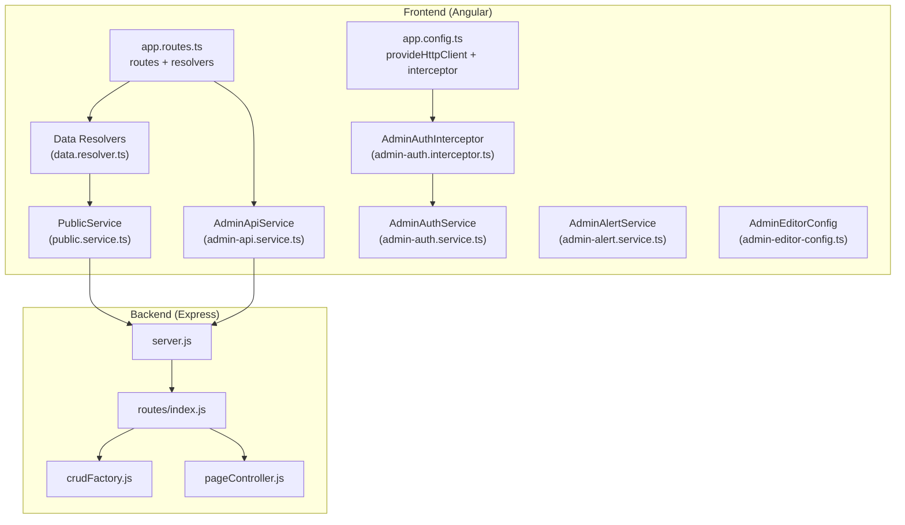
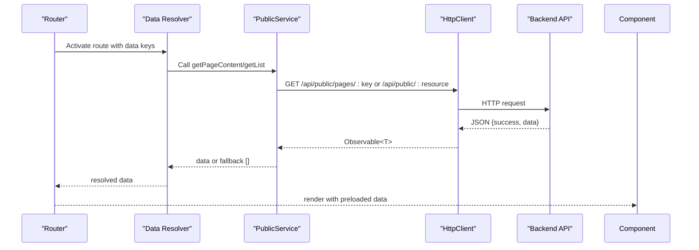
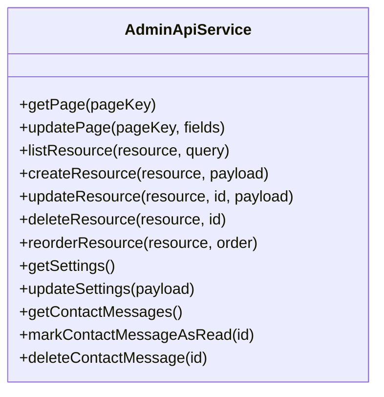
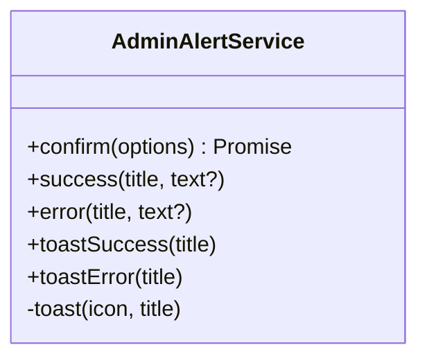
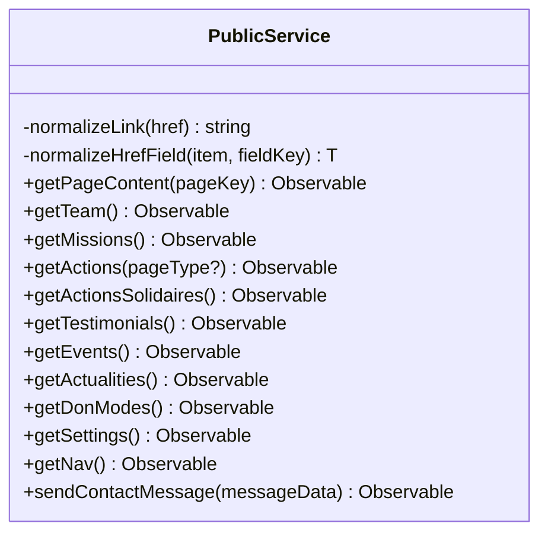
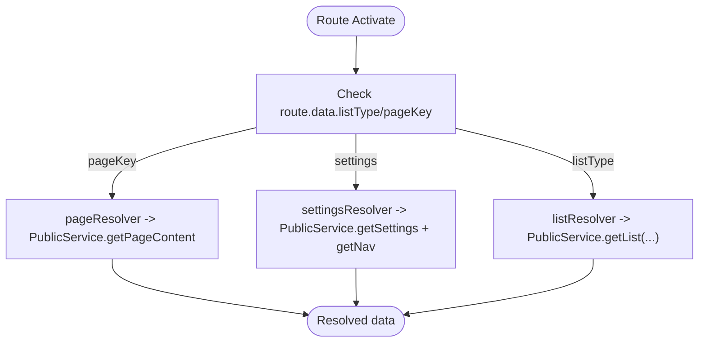
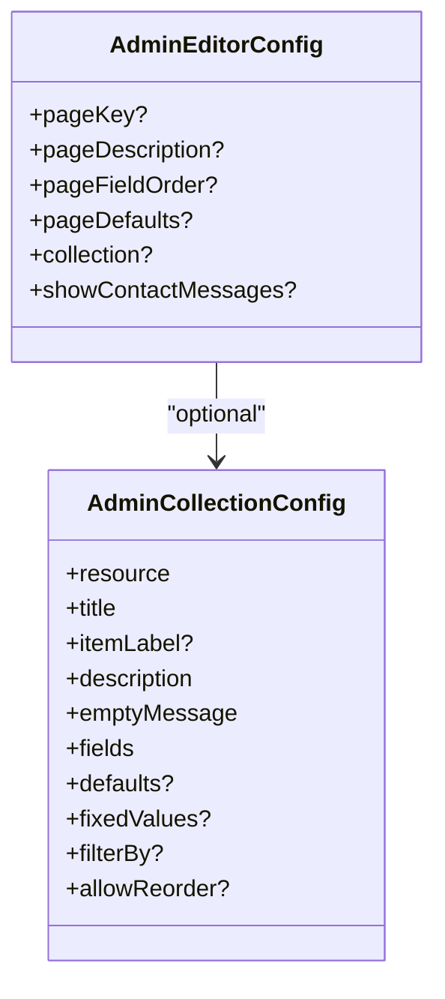
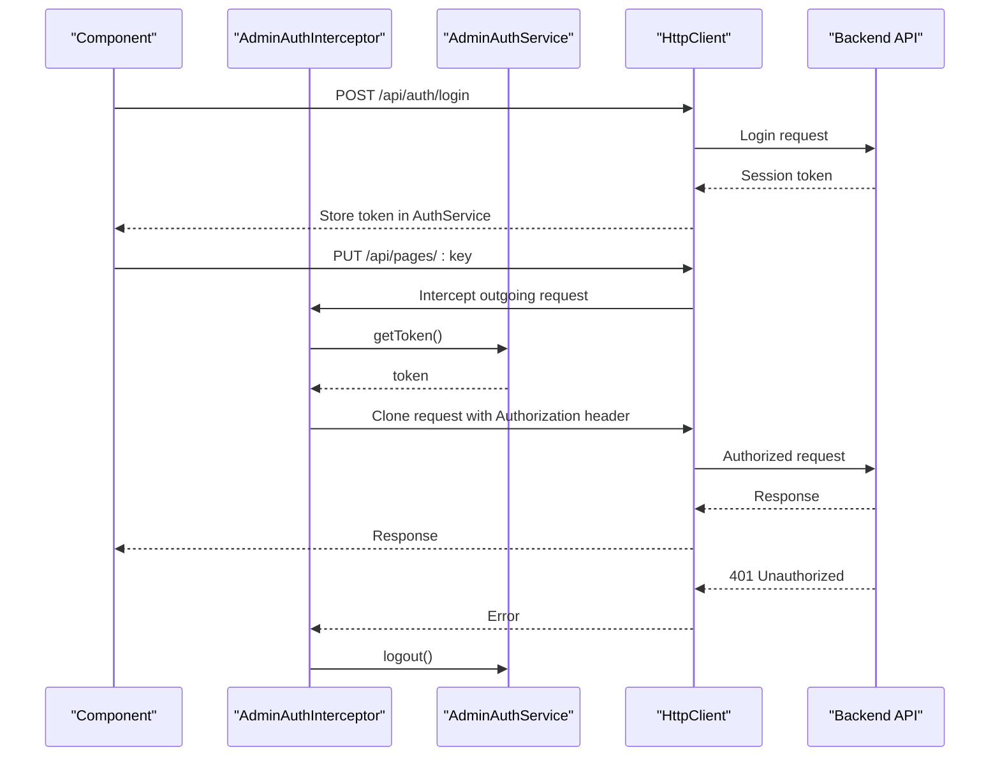
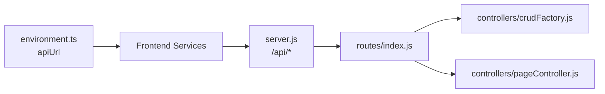
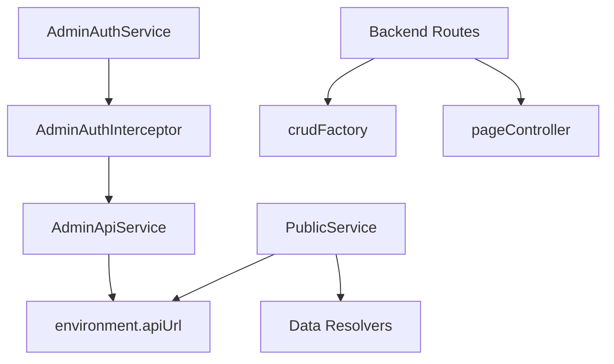

# Data Management and Services

<cite>
**Referenced Files in This Document**
- [admin-api.service.ts](file://rsf-front/src/app/admin/admin-api.service.ts)
- [admin-alert.service.ts](file://rsf-front/src/app/admin/admin-alert.service.ts)
- [public.service.ts](file://rsf-front/src/app/services/public.service.ts)
- [data.resolver.ts](file://rsf-front/src/app/resolvers/data.resolver.ts)
- [admin-editor-config.ts](file://rsf-front/src/app/admin/admin-editor-config.ts)
- [app.config.ts](file://rsf-front/src/app/app.config.ts)
- [app.routes.ts](file://rsf-front/src/app/app.routes.ts)
- [environment.ts](file://rsf-front/src/environments/environment.ts)
- [admin-auth.interceptor.ts](file://rsf-front/src/app/admin/admin-auth.interceptor.ts)
- [admin-auth.service.ts](file://rsf-front/src/app/admin/admin-auth.service.ts)
- [server.js](file://rsf-backend/server.js)
- [routes/index.js](file://rsf-backend/routes/index.js)
- [controllers/crudFactory.js](file://rsf-backend/controllers/crudFactory.js)
- [controllers/pageController.js](file://rsf-backend/controllers/pageController.js)
</cite>

## Table of Contents
1. [Introduction](#introduction)
2. [Project Structure](#project-structure)
3. [Core Components](#core-components)
4. [Architecture Overview](#architecture-overview)
5. [Detailed Component Analysis](#detailed-component-analysis)
6. [Dependency Analysis](#dependency-analysis)
7. [Performance Considerations](#performance-considerations)
8. [Troubleshooting Guide](#troubleshooting-guide)
9. [Conclusion](#conclusion)

## Introduction
This document explains the data management services and API communication layer for the platform. It covers:
- Admin API service implementation for content management
- Admin alert service for user notifications and feedback
- Public service for retrieving website content and managing public data requests
- Data resolver patterns for pre-loading content before route activation
- Editor configuration system for rich text editing capabilities
- Service architecture patterns, dependency injection, and singleton service management
- Caching strategies, offline handling, and performance optimization techniques

## Project Structure
The frontend Angular application exposes two primary service layers:
- Admin services: authentication, HTTP interception, API communication, alerts, and editor configuration
- Public services: content retrieval and normalization for public-facing pages
Routing integrates resolvers to pre-load data before views activate.

**Diagram sources**
- [app.config.ts:1-15](file://rsf-front/src/app/app.config.ts#L1-L15)
- [app.routes.ts:1-177](file://rsf-front/src/app/app.routes.ts#L1-L177)
- [public.service.ts:1-150](file://rsf-front/src/app/services/public.service.ts#L1-L150)
- [admin-api.service.ts:1-93](file://rsf-front/src/app/admin/admin-api.service.ts#L1-L93)
- [admin-auth.interceptor.ts:1-30](file://rsf-front/src/app/admin/admin-auth.interceptor.ts#L1-L30)
- [admin-auth.service.ts:1-107](file://rsf-front/src/app/admin/admin-auth.service.ts#L1-L107)
- [admin-alert.service.ts:1-79](file://rsf-front/src/app/admin/admin-alert.service.ts#L1-L79)
- [admin-editor-config.ts:1-600](file://rsf-front/src/app/admin/admin-editor-config.ts#L1-L600)
- [data.resolver.ts:1-42](file://rsf-front/src/app/resolvers/data.resolver.ts#L1-L42)
- [server.js:1-84](file://rsf-backend/server.js#L1-L84)
- [routes/index.js:1-28](file://rsf-backend/routes/index.js#L1-L28)
- [controllers/crudFactory.js:1-100](file://rsf-backend/controllers/crudFactory.js#L1-L100)
- [controllers/pageController.js:1-185](file://rsf-backend/controllers/pageController.js#L1-L185)

**Section sources**
- [app.config.ts:1-15](file://rsf-front/src/app/app.config.ts#L1-L15)
- [app.routes.ts:1-177](file://rsf-front/src/app/app.routes.ts#L1-L177)
- [environment.ts:1-5](file://rsf-front/src/environments/environment.ts#L1-L5)
- [server.js:1-84](file://rsf-backend/server.js#L1-L84)
- [routes/index.js:1-28](file://rsf-backend/routes/index.js#L1-L28)

## Core Components
- AdminApiService: Centralized HTTP client for admin endpoints, including CRUD operations, settings, and contact messages.
- PublicService: Normalizes and retrieves public content, with robust error handling via RxJS operators.
- AdminAlertService: Unified notification and feedback system using SweetAlert2, including toasts.
- Data Resolvers: Pre-fetch page content and lists before route activation.
- Admin Editor Config: Declarative configuration for admin editors, including defaults, field definitions, and filters.
- Admin Authentication: Token-based session management with interceptor auto-attach and 401 handling.
- Backend Routing and Controllers: Public and protected routes, CRUD factory, and page composition logic.

**Section sources**
- [admin-api.service.ts:1-93](file://rsf-front/src/app/admin/admin-api.service.ts#L1-L93)
- [public.service.ts:1-150](file://rsf-front/src/app/services/public.service.ts#L1-L150)
- [admin-alert.service.ts:1-79](file://rsf-front/src/app/admin/admin-alert.service.ts#L1-L79)
- [data.resolver.ts:1-42](file://rsf-front/src/app/resolvers/data.resolver.ts#L1-L42)
- [admin-editor-config.ts:1-600](file://rsf-front/src/app/admin/admin-editor-config.ts#L1-L600)
- [admin-auth.interceptor.ts:1-30](file://rsf-front/src/app/admin/admin-auth.interceptor.ts#L1-L30)
- [admin-auth.service.ts:1-107](file://rsf-front/src/app/admin/admin-auth.service.ts#L1-L107)
- [controllers/crudFactory.js:1-100](file://rsf-backend/controllers/crudFactory.js#L1-L100)
- [controllers/pageController.js:1-185](file://rsf-backend/controllers/pageController.js#L1-L185)

## Architecture Overview
The frontend uses Angular’s dependency injection and HTTP interceptors to centralize admin authentication and request handling. Public content is fetched through a dedicated service with normalization and error recovery. Resolvers ensure data availability before components render.

**Diagram sources**
- [app.routes.ts:113-177](file://rsf-front/src/app/app.routes.ts#L113-L177)
- [data.resolver.ts:1-42](file://rsf-front/src/app/resolvers/data.resolver.ts#L1-L42)
- [public.service.ts:51-148](file://rsf-front/src/app/services/public.service.ts#L51-L148)
- [server.js:32-52](file://rsf-backend/server.js#L32-L52)

## Detailed Component Analysis

### Admin API Service
AdminApiService encapsulates admin-only HTTP operations against the backend API. It:
- Builds typed responses with a common envelope
- Provides CRUD helpers for generic resources
- Supports pagination and ordering via query parameters
- Handles settings and contact message management

**Diagram sources**
- [admin-api.service.ts:14-92](file://rsf-front/src/app/admin/admin-api.service.ts#L14-L92)

**Section sources**
- [admin-api.service.ts:18-92](file://rsf-front/src/app/admin/admin-api.service.ts#L18-L92)

### Admin Alert Service
AdminAlertService provides unified alerting and feedback:
- Confirmation dialogs with customizable titles, icons, and texts
- Success and error toasts with automatic dismissal
- Consistent styling integration with SweetAlert2

**Diagram sources**
- [admin-alert.service.ts:4-78](file://rsf-front/src/app/admin/admin-alert.service.ts#L4-L78)

**Section sources**
- [admin-alert.service.ts:8-78](file://rsf-front/src/app/admin/admin-alert.service.ts#L8-L78)

### Public Service
PublicService fetches public content and normalizes links:
- Normalizes href/link_href fields for internal routing
- Applies RxJS error recovery to avoid breaking page loads
- Exposes typed getters for pages, teams, missions, actions, testimonials, events, actualities, donations, settings, navigation, and contact submission

**Diagram sources**
- [public.service.ts:6-149](file://rsf-front/src/app/services/public.service.ts#L6-L149)

**Section sources**
- [public.service.ts:14-149](file://rsf-front/src/app/services/public.service.ts#L14-L149)

### Data Resolvers
Resolvers pre-load data before route activation:
- pageResolver: loads a single page by key
- settingsResolver: loads settings and navigation concurrently
- listResolver: dispatches to appropriate list getter based on route data

**Diagram sources**
- [data.resolver.ts:6-41](file://rsf-front/src/app/resolvers/data.resolver.ts#L6-L41)
- [app.routes.ts:113-177](file://rsf-front/src/app/app.routes.ts#L113-L177)

**Section sources**
- [data.resolver.ts:6-41](file://rsf-front/src/app/resolvers/data.resolver.ts#L6-L41)
- [app.routes.ts:113-177](file://rsf-front/src/app/app.routes.ts#L113-L177)

### Editor Configuration System
AdminEditorConfig defines declarative configurations for admin editors:
- Types for field types and collections
- Resource-specific configs with defaults, field orders, and filters
- Example configurations for pages and collections (team, missions, actions, events, testimonials, actualities, don modes)

**Diagram sources**
- [admin-editor-config.ts:28-48](file://rsf-front/src/app/admin/admin-editor-config.ts#L28-L48)

**Section sources**
- [admin-editor-config.ts:1-600](file://rsf-front/src/app/admin/admin-editor-config.ts#L1-L600)

### Admin Authentication and Interception
AdminAuthService manages session state and storage, while AdminAuthInterceptor attaches tokens to admin API requests and handles 401 responses by logging out.

**Diagram sources**
- [admin-auth.interceptor.ts:7-29](file://rsf-front/src/app/admin/admin-auth.interceptor.ts#L7-L29)
- [admin-auth.service.ts:38-69](file://rsf-front/src/app/admin/admin-auth.service.ts#L38-L69)
- [admin-api.service.ts:28-30](file://rsf-front/src/app/admin/admin-api.service.ts#L28-L30)

**Section sources**
- [admin-auth.interceptor.ts:1-30](file://rsf-front/src/app/admin/admin-auth.interceptor.ts#L1-L30)
- [admin-auth.service.ts:1-107](file://rsf-front/src/app/admin/admin-auth.service.ts#L1-L107)

### Backend API Communication Patterns
- Frontend environment sets the base API URL
- Backend routes mount public and protected endpoints
- CRUD factory provides generic handlers for models
- Page controller composes page content from multiple sources

**Diagram sources**
- [environment.ts:1-5](file://rsf-front/src/environments/environment.ts#L1-L5)
- [server.js:32-52](file://rsf-backend/server.js#L32-L52)
- [routes/index.js:1-28](file://rsf-backend/routes/index.js#L1-L28)
- [controllers/crudFactory.js:39-96](file://rsf-backend/controllers/crudFactory.js#L39-L96)
- [controllers/pageController.js:66-104](file://rsf-backend/controllers/pageController.js#L66-L104)

**Section sources**
- [environment.ts:1-5](file://rsf-front/src/environments/environment.ts#L1-L5)
- [server.js:32-52](file://rsf-backend/server.js#L32-L52)
- [routes/index.js:1-28](file://rsf-backend/routes/index.js#L1-L28)
- [controllers/crudFactory.js:1-100](file://rsf-backend/controllers/crudFactory.js#L1-L100)
- [controllers/pageController.js:1-185](file://rsf-backend/controllers/pageController.js#L1-L185)

## Dependency Analysis
- Service architecture relies on Angular’s DI with singleton services
- AdminApiService and PublicService are provided root
- AdminAuthInterceptor depends on AdminAuthService
- Resolvers depend on PublicService
- Backend routes depend on controllers and the CRUD factory

**Diagram sources**
- [admin-auth.service.ts:26-36](file://rsf-front/src/app/admin/admin-auth.service.ts#L26-L36)
- [admin-auth.interceptor.ts:7-18](file://rsf-front/src/app/admin/admin-auth.interceptor.ts#L7-L18)
- [admin-api.service.ts:14-20](file://rsf-front/src/app/admin/admin-api.service.ts#L14-L20)
- [public.service.ts:6-12](file://rsf-front/src/app/services/public.service.ts#L6-L12)
- [data.resolver.ts:6-8](file://rsf-front/src/app/resolvers/data.resolver.ts#L6-L8)
- [server.js:32-52](file://rsf-backend/server.js#L32-L52)
- [controllers/crudFactory.js:39-96](file://rsf-backend/controllers/crudFactory.js#L39-L96)
- [controllers/pageController.js:66-104](file://rsf-backend/controllers/pageController.js#L66-L104)

**Section sources**
- [app.config.ts:8-14](file://rsf-front/src/app/app.config.ts#L8-L14)
- [app.routes.ts:17-177](file://rsf-front/src/app/app.routes.ts#L17-L177)
- [admin-auth.service.ts:26-36](file://rsf-front/src/app/admin/admin-auth.service.ts#L26-L36)
- [admin-auth.interceptor.ts:7-18](file://rsf-front/src/app/admin/admin-auth.interceptor.ts#L7-L18)
- [admin-api.service.ts:14-20](file://rsf-front/src/app/admin/admin-api.service.ts#L14-L20)
- [public.service.ts:6-12](file://rsf-front/src/app/services/public.service.ts#L6-L12)
- [data.resolver.ts:6-8](file://rsf-front/src/app/resolvers/data.resolver.ts#L6-L8)
- [server.js:32-52](file://rsf-backend/server.js#L32-L52)

## Performance Considerations
- Request normalization and minimal parsing reduce payload sizes
- RxJS map and catchError prevent cascading failures and enable fast fallbacks
- Resolvers pre-load data to avoid flickering and redundant network calls
- Backend uses a generic CRUD factory to minimize duplication and improve maintainability
- Page composition consolidates multiple sources efficiently

[No sources needed since this section provides general guidance]

## Troubleshooting Guide
Common issues and resolutions:
- Authentication errors: 401 responses trigger automatic logout; verify token presence and expiration
- Network failures: PublicService catches errors and returns empty arrays or nulls; inspect environment.apiUrl and CORS configuration
- Unexpected data shapes: PublicService normalizes links; ensure backend returns expected structures
- Resolver timeouts: Ensure resolvers are attached to routes and return observables promptly

**Section sources**
- [admin-auth.interceptor.ts:20-28](file://rsf-front/src/app/admin/admin-auth.interceptor.ts#L20-L28)
- [public.service.ts:51-148](file://rsf-front/src/app/services/public.service.ts#L51-L148)
- [app.routes.ts:113-177](file://rsf-front/src/app/app.routes.ts#L113-L177)

## Conclusion
The data management layer combines Angular services, interceptors, and resolvers to deliver a robust admin experience and a responsive public website. The backend leverages a generic CRUD factory and composed page controllers to keep APIs consistent and maintainable. Together, these patterns support scalability, reliability, and developer productivity.