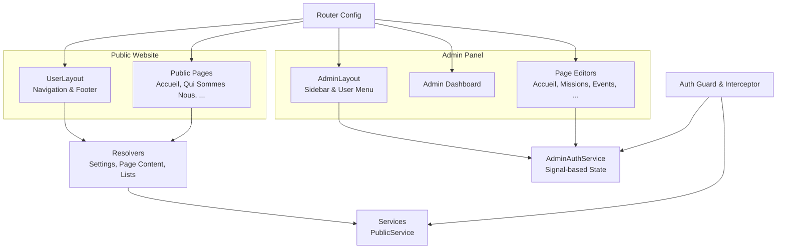
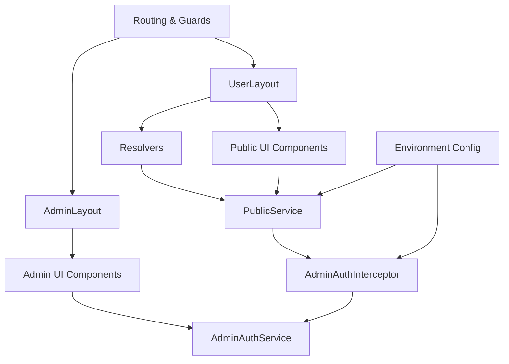
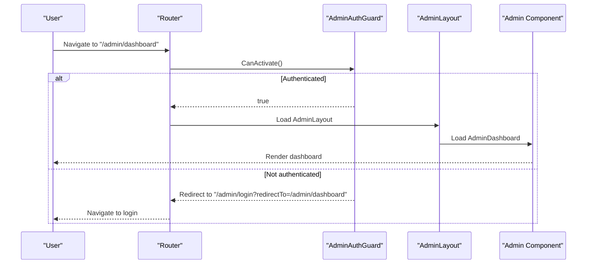
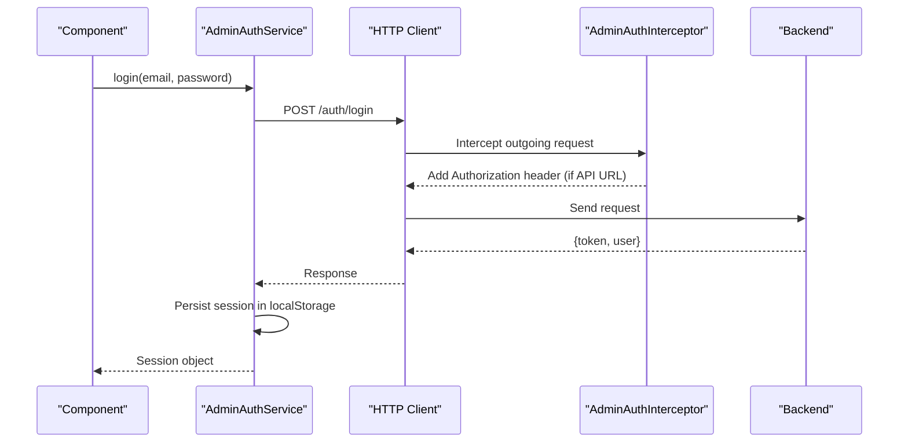
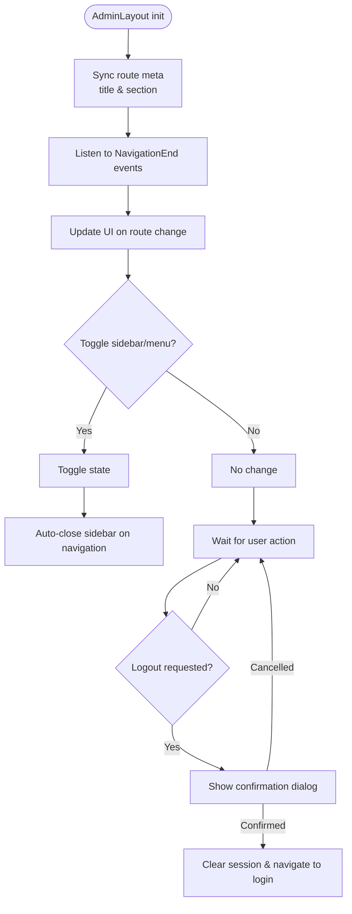
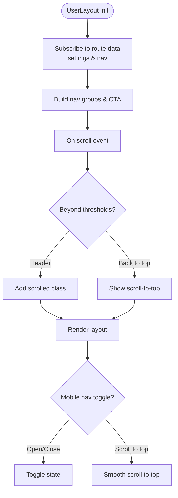
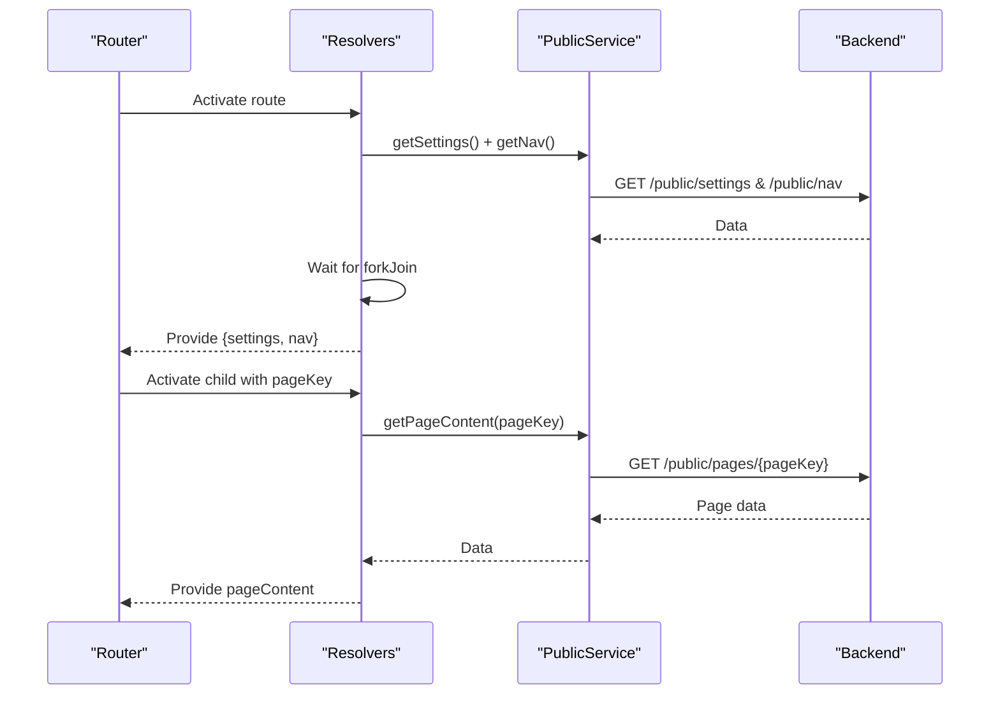
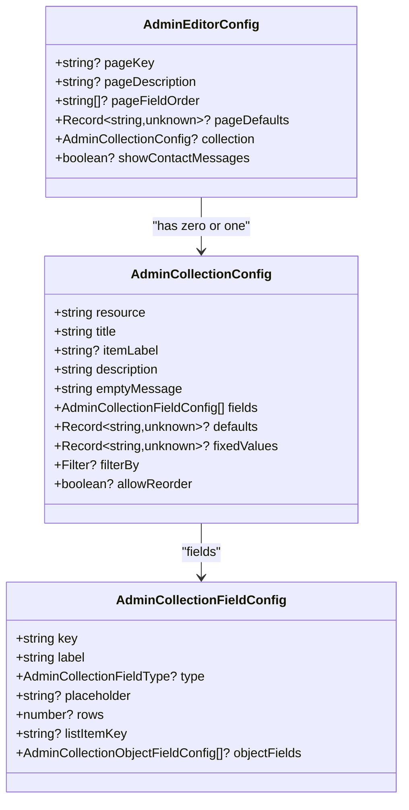
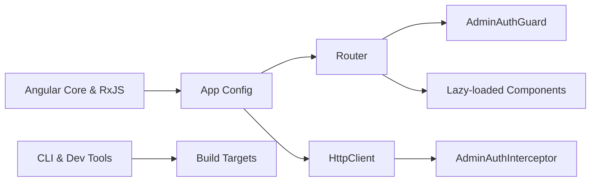

# Frontend Application Architecture

<cite>
**Referenced Files in This Document**
- [app.config.ts](file://rsf-front/src/app/app.config.ts)
- [app.routes.ts](file://rsf-front/src/app/app.routes.ts)
- [angular.json](file://rsf-front/angular.json)
- [package.json](file://rsf-front/package.json)
- [environment.ts](file://rsf-front/src/environments/environment.ts)
- [environment.prod.ts](file://rsf-front/src/environments/environment.prod.ts)
- [user-layout.ts](file://rsf-front/src/app/utilisateurs/user-layout/user-layout.ts)
- [admin-layout.ts](file://rsf-front/src/app/admin/admin-layout/admin-layout.ts)
- [admin-auth.guard.ts](file://rsf-front/src/app/admin/admin-auth.guard.ts)
- [admin-auth.interceptor.ts](file://rsf-front/src/app/admin/admin-auth.interceptor.ts)
- [admin-auth.service.ts](file://rsf-front/src/app/admin/admin-auth.service.ts)
- [data.resolver.ts](file://rsf-front/src/app/resolvers/data.resolver.ts)
- [public.service.ts](file://rsf-front/src/app/services/public.service.ts)
- [admin-editor-config.ts](file://rsf-front/src/app/admin/admin-editor-config.ts)
</cite>

## Table of Contents
1. [Introduction](#introduction)
2. [Project Structure](#project-structure)
3. [Core Components](#core-components)
4. [Architecture Overview](#architecture-overview)
5. [Detailed Component Analysis](#detailed-component-analysis)
6. [Dependency Analysis](#dependency-analysis)
7. [Performance Considerations](#performance-considerations)
8. [Troubleshooting Guide](#troubleshooting-guide)
9. [Conclusion](#conclusion)
10. [Appendices](#appendices)

## Introduction
This document describes the frontend application architecture for the Angular-based admin panel and public website of Network Solidarity France. It explains the dual-application structure, component hierarchy, routing strategy, authentication system with JWT token management, guards, interceptors, and the admin layout and content editor configurations. It also covers data fetching via resolvers and services, responsive design patterns, build configuration, environment management, deployment processes, state management, error handling, and performance optimization techniques.

## Project Structure
The frontend is organized as a single Angular application with two primary interface contexts:
- Public website: renders pages such as homepage, about, organization, missions, actions, events, testimonials, contact, donations, and join-us.
- Admin panel: a protected back-office for editing public pages and managing content collections.

Key structural elements:
- Routing separates public and admin contexts with lazy-loaded components.
- Resolvers pre-fetch data for public pages to improve perceived performance.
- Services abstract HTTP communication with the backend API.
- Environment files define runtime configuration for development and production.
- Build configuration supports production optimizations and asset handling.

**Diagram sources**
- [app.routes.ts:1-177](file://rsf-front/src/app/app.routes.ts#L1-L177)
- [user-layout.ts:1-124](file://rsf-front/src/app/utilisateurs/user-layout/user-layout.ts#L1-L124)
- [admin-layout.ts:1-140](file://rsf-front/src/app/admin/admin-layout/admin-layout.ts#L1-L140)
- [data.resolver.ts:1-42](file://rsf-front/src/app/resolvers/data.resolver.ts#L1-L42)
- [public.service.ts:1-150](file://rsf-front/src/app/services/public.service.ts#L1-L150)
- [admin-auth.guard.ts:1-19](file://rsf-front/src/app/admin/admin-auth.guard.ts#L1-L19)
- [admin-auth.interceptor.ts:1-30](file://rsf-front/src/app/admin/admin-auth.interceptor.ts#L1-L30)
- [admin-auth.service.ts:1-107](file://rsf-front/src/app/admin/admin-auth.service.ts#L1-L107)

**Section sources**
- [app.routes.ts:1-177](file://rsf-front/src/app/app.routes.ts#L1-L177)
- [angular.json:1-75](file://rsf-front/angular.json#L1-L75)
- [package.json:1-34](file://rsf-front/package.json#L1-L34)

## Core Components
- Routing and Guards: Separate admin and public routes, enforce authentication for admin area.
- Authentication: JWT-based session stored locally, with guard and HTTP interceptor.
- Layouts: UserLayout for public site navigation and footer; AdminLayout for sidebar and user menu.
- Resolvers: Fetch settings, navigation, and lists before rendering public pages.
- Services: PublicService encapsulates API calls for content, teams, missions, actions, testimonials, events, actualities, donation modes, and navigation.
- Editor Configuration: Centralized admin editor metadata for page content and collections.

**Section sources**
- [app.config.ts:1-15](file://rsf-front/src/app/app.config.ts#L1-L15)
- [app.routes.ts:1-177](file://rsf-front/src/app/app.routes.ts#L1-L177)
- [admin-auth.guard.ts:1-19](file://rsf-front/src/app/admin/admin-auth.guard.ts#L1-L19)
- [admin-auth.interceptor.ts:1-30](file://rsf-front/src/app/admin/admin-auth.interceptor.ts#L1-L30)
- [admin-auth.service.ts:1-107](file://rsf-front/src/app/admin/admin-auth.service.ts#L1-L107)
- [user-layout.ts:1-124](file://rsf-front/src/app/utilisateurs/user-layout/user-layout.ts#L1-L124)
- [admin-layout.ts:1-140](file://rsf-front/src/app/admin/admin-layout/admin-layout.ts#L1-L140)
- [data.resolver.ts:1-42](file://rsf-front/src/app/resolvers/data.resolver.ts#L1-L42)
- [public.service.ts:1-150](file://rsf-front/src/app/services/public.service.ts#L1-L150)
- [admin-editor-config.ts:1-600](file://rsf-front/src/app/admin/admin-editor-config.ts#L1-L600)

## Architecture Overview
The application follows a layered architecture:
- Presentation Layer: Components for public pages and admin editors.
- Routing Layer: Route definitions with guards and resolvers.
- Domain Layer: Services for data access and normalization.
- Infrastructure Layer: HTTP client configuration, interceptors, and environment management.

**Diagram sources**
- [app.routes.ts:1-177](file://rsf-front/src/app/app.routes.ts#L1-L177)
- [user-layout.ts:1-124](file://rsf-front/src/app/utilisateurs/user-layout/user-layout.ts#L1-L124)
- [admin-layout.ts:1-140](file://rsf-front/src/app/admin/admin-layout/admin-layout.ts#L1-L140)
- [data.resolver.ts:1-42](file://rsf-front/src/app/resolvers/data.resolver.ts#L1-L42)
- [public.service.ts:1-150](file://rsf-front/src/app/services/public.service.ts#L1-L150)
- [admin-auth.service.ts:1-107](file://rsf-front/src/app/admin/admin-auth.service.ts#L1-L107)
- [admin-auth.interceptor.ts:1-30](file://rsf-front/src/app/admin/admin-auth.interceptor.ts#L1-L30)
- [environment.ts:1-5](file://rsf-front/src/environments/environment.ts#L1-L5)
- [environment.prod.ts:1-5](file://rsf-front/src/environments/environment.prod.ts#L1-L5)

## Detailed Component Analysis

### Routing Strategy
- Admin area:
  - Protected by a guard that redirects unauthenticated users to the login page and preserves the intended destination.
  - Lazy-loaded components for performance.
  - Nested routes under /admin with titles and sections for breadcrumbs and meta synchronization.
- Public website:
  - Root layout with navigation groups and a call-to-action item.
  - Route-specific resolvers fetch page content and lists (team, missions, actions, testimonials, events, actualities, don modes).
  - Fallback route redirects to the homepage.

**Diagram sources**
- [app.routes.ts:20-112](file://rsf-front/src/app/app.routes.ts#L20-L112)
- [admin-auth.guard.ts:1-19](file://rsf-front/src/app/admin/admin-auth.guard.ts#L1-L19)
- [admin-layout.ts:71-81](file://rsf-front/src/app/admin/admin-layout/admin-layout.ts#L71-L81)

**Section sources**
- [app.routes.ts:1-177](file://rsf-front/src/app/app.routes.ts#L1-L177)
- [admin-auth.guard.ts:1-19](file://rsf-front/src/app/admin/admin-auth.guard.ts#L1-L19)

### Authentication System
- Session management:
  - JWT token and user info stored in memory signals and persisted in localStorage.
  - Computed selectors expose user and session state.
- Guard:
  - Prevents navigation to admin routes when not authenticated.
- Interceptor:
  - Automatically attaches Authorization header for requests to the configured API URL.
  - Handles 401 responses by logging out and propagating the error.

**Diagram sources**
- [admin-auth.service.ts:38-49](file://rsf-front/src/app/admin/admin-auth.service.ts#L38-L49)
- [admin-auth.interceptor.ts:7-18](file://rsf-front/src/app/admin/admin-auth.interceptor.ts#L7-L18)
- [admin-auth.service.ts:84-105](file://rsf-front/src/app/admin/admin-auth.service.ts#L84-L105)

**Section sources**
- [admin-auth.service.ts:1-107](file://rsf-front/src/app/admin/admin-auth.service.ts#L1-L107)
- [admin-auth.interceptor.ts:1-30](file://rsf-front/src/app/admin/admin-auth.interceptor.ts#L1-L30)
- [admin-auth.guard.ts:1-19](file://rsf-front/src/app/admin/admin-auth.guard.ts#L1-L19)

### Admin Layout and Navigation
- AdminLayout manages:
  - Mobile sidebar toggling and user menu.
  - Dynamic page title and section label derived from route data.
  - Logout flow with confirmation and navigation to login.
- Navigation sections are statically defined for quick access to all editable pages.

**Diagram sources**
- [admin-layout.ts:71-138](file://rsf-front/src/app/admin/admin-layout/admin-layout.ts#L71-L138)

**Section sources**
- [admin-layout.ts:1-140](file://rsf-front/src/app/admin/admin-layout/admin-layout.ts#L1-L140)

### Public Website Navigation and Responsive Design
- UserLayout builds navigation groups and a call-to-action item from resolved settings.
- Scroll-aware behavior shows a "back to top" button after scrolling down a threshold.
- Responsive mobile navigation toggling and smooth scrolling to top.

**Diagram sources**
- [user-layout.ts:42-122](file://rsf-front/src/app/utilisateurs/user-layout/user-layout.ts#L42-L122)

**Section sources**
- [user-layout.ts:1-124](file://rsf-front/src/app/utilisateurs/user-layout/user-layout.ts#L1-L124)

### Data Fetching and Resolvers
- SettingsResolver fetches global settings and navigation in parallel.
- PageResolver fetches content for a specific page key.
- ListResolver dispatches to backend endpoints based on listType.
- PublicService normalizes links and handles errors gracefully.

**Diagram sources**
- [data.resolver.ts:6-17](file://rsf-front/src/app/resolvers/data.resolver.ts#L6-L17)
- [data.resolver.ts:19-41](file://rsf-front/src/app/resolvers/data.resolver.ts#L19-L41)
- [public.service.ts:51-144](file://rsf-front/src/app/services/public.service.ts#L51-L144)

**Section sources**
- [data.resolver.ts:1-42](file://rsf-front/src/app/resolvers/data.resolver.ts#L1-L42)
- [public.service.ts:1-150](file://rsf-front/src/app/services/public.service.ts#L1-L150)

### Admin Content Editor Configuration
- Centralized editor metadata defines:
  - Page keys and descriptions.
  - Field orders and defaults.
  - Collections with typed fields (text, textarea, boolean, number, date, string-list, object-list).
  - Defaults and filters for backend resources.
- Used by admin editors to render forms and manage content.

**Diagram sources**
- [admin-editor-config.ts:1-600](file://rsf-front/src/app/admin/admin-editor-config.ts#L1-L600)

**Section sources**
- [admin-editor-config.ts:1-600](file://rsf-front/src/app/admin/admin-editor-config.ts#L1-L600)

## Dependency Analysis
- Providers and bootstrap:
  - Router and HTTP client configured with a global interceptor.
- Runtime dependencies:
  - Angular core, router, forms, platform browser, and RxJS.
- Build-time dependencies:
  - Angular CLI, build tools, unit testing framework, and Prettier.

**Diagram sources**
- [app.config.ts:8-14](file://rsf-front/src/app/app.config.ts#L8-L14)
- [package.json:13-32](file://rsf-front/package.json#L13-L32)

**Section sources**
- [app.config.ts:1-15](file://rsf-front/src/app/app.config.ts#L1-L15)
- [package.json:1-34](file://rsf-front/package.json#L1-L34)

## Performance Considerations
- Production optimizations:
  - Initial and component style budgets to limit bundle sizes.
  - Output hashing for cache busting.
  - Disabled source maps and license extraction in production.
- Development optimizations:
  - No optimization, source maps enabled for debugging.
- Routing and loading:
  - Lazy loading of admin components reduces initial bundle size.
  - Resolvers prefetch data to avoid blank screens and reduce perceived latency.
- HTTP:
  - Interceptor attaches tokens only for API URLs, minimizing unnecessary overhead.
  - Error short-circuit on 401 prevents wasted retries.

**Section sources**
- [angular.json:32-54](file://rsf-front/angular.json#L32-L54)
- [app.routes.ts:20-112](file://rsf-front/src/app/app.routes.ts#L20-L112)
- [admin-auth.interceptor.ts:7-18](file://rsf-front/src/app/admin/admin-auth.interceptor.ts#L7-L18)

## Troubleshooting Guide
- Authentication issues:
  - If redirected to login frequently, verify token presence and expiration via the auth service.
  - On 401 responses, the interceptor triggers logout automatically; check network tab for failed requests.
- Navigation problems:
  - Ensure route data includes required keys (title, section, pageKey) for proper meta updates.
  - Verify resolver data is provided before rendering components.
- Build and deployment:
  - Confirm environment.apiUrl matches backend URL in both development and production.
  - Use production configuration for optimized builds and verify assets are included.

**Section sources**
- [admin-auth.interceptor.ts:20-28](file://rsf-front/src/app/admin/admin-auth.interceptor.ts#L20-L28)
- [app.routes.ts:111-112](file://rsf-front/src/app/app.routes.ts#L111-L112)
- [environment.ts:1-5](file://rsf-front/src/environments/environment.ts#L1-L5)
- [environment.prod.ts:1-5](file://rsf-front/src/environments/environment.prod.ts#L1-L5)

## Conclusion
The frontend application employs a clean separation between the public website and the admin panel, leveraging Angular’s routing, guards, interceptors, and resolvers to deliver a robust, maintainable, and performant user experience. The admin panel’s centralized editor configuration streamlines content management, while the public site’s responsive layout and data prefetching ensure fast, accessible browsing. With environment-driven configuration and production-grade build settings, the application is ready for scalable deployments.

## Appendices
- Build and serve commands are defined in the package scripts.
- Assets are copied from the public directory during builds.

**Section sources**
- [package.json:4-10](file://rsf-front/package.json#L4-L10)
- [angular.json:22-30](file://rsf-front/angular.json#L22-L30)