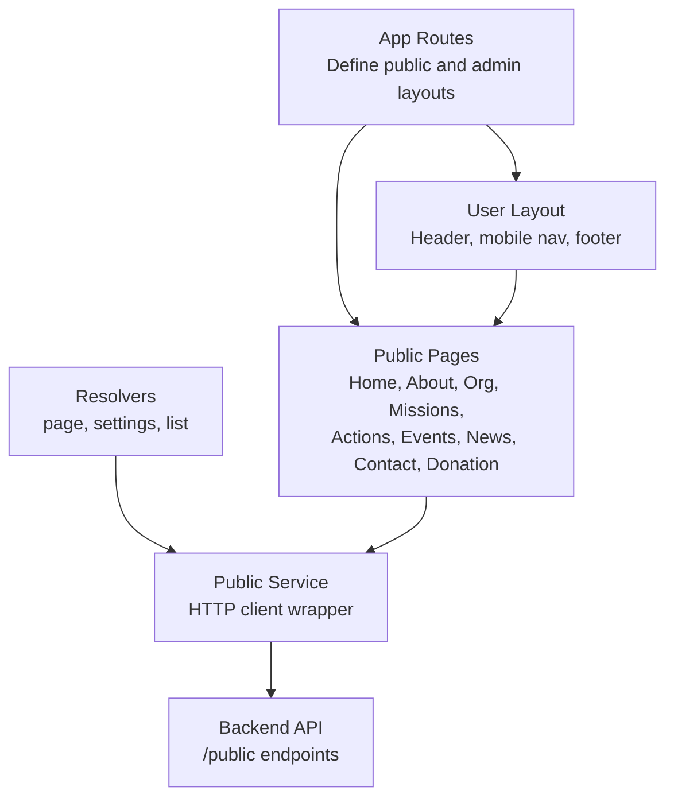
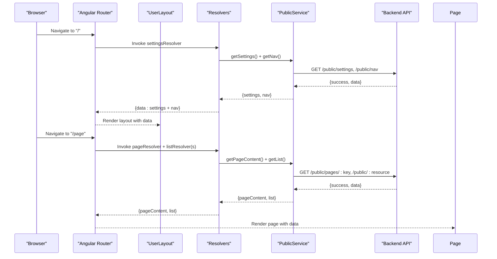
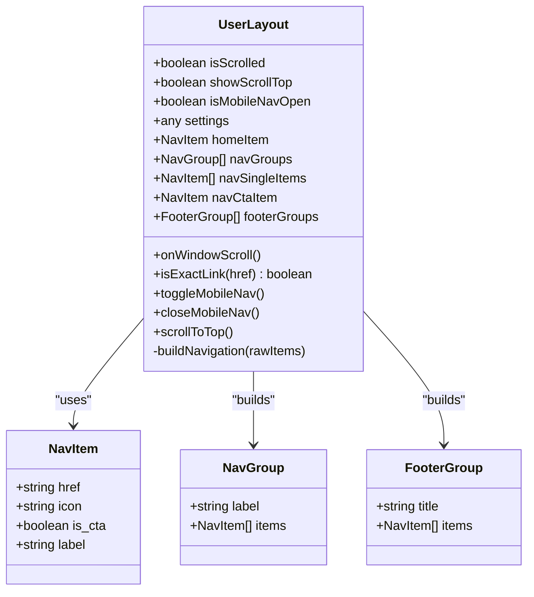
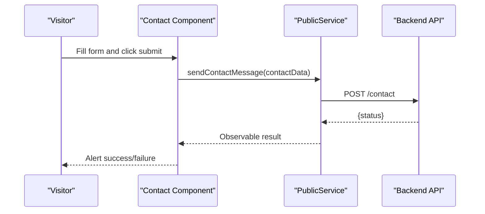
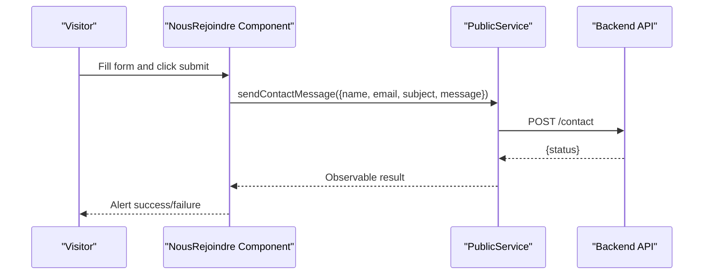
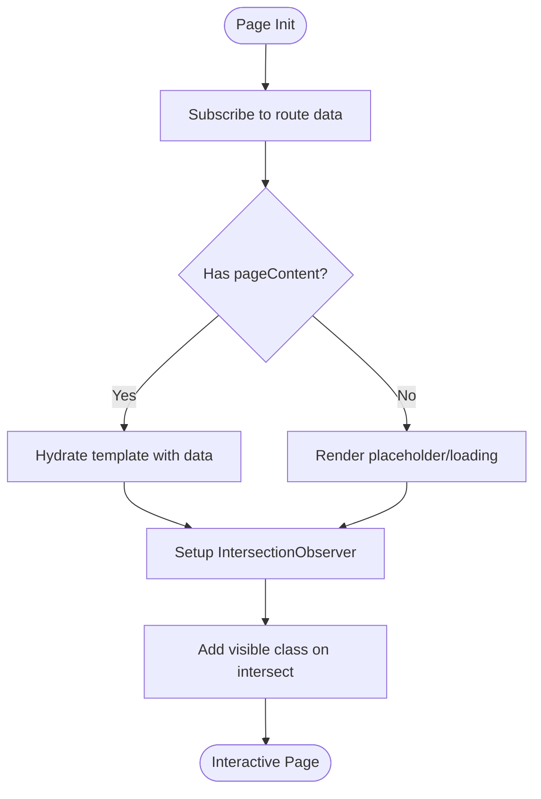
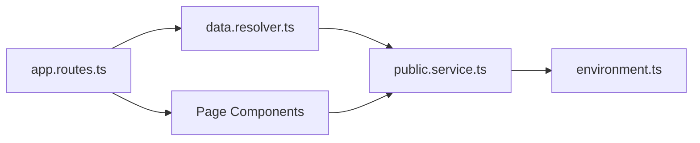

# Public Website Components

<cite>
**Referenced Files in This Document**
- [app.routes.ts](file://rsf-front/src/app/app.routes.ts)
- [public.service.ts](file://rsf-front/src/app/services/public.service.ts)
- [user-layout.ts](file://rsf-front/src/app/utilisateurs/user-layout/user-layout.ts)
- [user-layout.html](file://rsf-front/src/app/utilisateurs/user-layout/user-layout.html)
- [accueil.ts](file://rsf-front/src/app/utilisateurs/accueil/accueil.ts)
- [qui-sommes-nous.ts](file://rsf-front/src/app/utilisateurs/qui-sommes-nous/qui-sommes-nous.ts)
- [organisation.ts](file://rsf-front/src/app/utilisateurs/organisation/organisation.ts)
- [nos-missions.ts](file://rsf-front/src/app/utilisateurs/nos-missions/nos-missions.ts)
- [actions-solidaires.ts](file://rsf-front/src/app/utilisateurs/actions-solidaires/actions-solidaires.ts)
- [soutien-aux-membres.ts](file://rsf-front/src/app/utilisateurs/soutien-aux-membres/soutien-aux-membres.ts)
- [actions-internationales.ts](file://rsf-front/src/app/utilisateurs/actions-internationales/actions-internationales.ts)
- [evenements.ts](file://rsf-front/src/app/utilisateurs/evenements/evenements.ts)
- [rencontre-annuelle.ts](file://rsf-front/src/app/utilisateurs/rencontre-annuelle/rencontre-annuelle.ts)
- [temoignages.ts](file://rsf-front/src/app/utilisateurs/temoignages/temoignages.ts)
- [actualites.ts](file://rsf-front/src/app/utilisateurs/actualites/actualites.ts)
- [contact.ts](file://rsf-front/src/app/utilisateurs/contact/contact.ts)
- [don.ts](file://rsf-front/src/app/utilisateurs/don/don.ts)
- [nous-rejoindre.ts](file://rsf-front/src/app/utilisateurs/nous-rejoindre/nous-rejoindre.ts)
- [data.resolver.ts](file://rsf-front/src/app/resolvers/data.resolver.ts)
- [environment.ts](file://rsf-front/src/environments/environment.ts)
</cite>

## Table of Contents
1. [Introduction](#introduction)
2. [Project Structure](#project-structure)
3. [Core Components](#core-components)
4. [Architecture Overview](#architecture-overview)
5. [Detailed Component Analysis](#detailed-component-analysis)
6. [Dependency Analysis](#dependency-analysis)
7. [Performance Considerations](#performance-considerations)
8. [Troubleshooting Guide](#troubleshooting-guide)
9. [Conclusion](#conclusion)
10. [Appendices](#appendices)

## Introduction
This document describes the public website components and user-facing interfaces built with Angular. It covers the user layout and navigation system, the routing and data resolution strategy, and the implementation of each public page component. It also explains content display patterns, responsive design considerations, interactive elements, data fetching from the backend API, error handling, loading states, component communication patterns, form handling for contact and membership requests, and integration points. Accessibility, SEO, and performance best practices are included to guide maintainable and user-friendly development.

## Project Structure
The public website is organized as an Angular application under rsf-front. The routing module defines the public routes and lazy-loaded admin routes. Resolvers fetch pre-required data (settings, navigation, and lists) before rendering pages. Services encapsulate API interactions. Page components receive resolved data via route data and render content with reusable presentation patterns.

**Diagram sources**
- [app.routes.ts:20-177](file://rsf-front/src/app/app.routes.ts#L20-L177)
- [data.resolver.ts:6-42](file://rsf-front/src/app/resolvers/data.resolver.ts#L6-L42)
- [public.service.ts:10-149](file://rsf-front/src/app/services/public.service.ts#L10-L149)

**Section sources**
- [app.routes.ts:20-177](file://rsf-front/src/app/app.routes.ts#L20-L177)
- [data.resolver.ts:6-42](file://rsf-front/src/app/resolvers/data.resolver.ts#L6-L42)
- [public.service.ts:10-149](file://rsf-front/src/app/services/public.service.ts#L10-L149)

## Core Components
- User Layout: Provides the global header, navigation groups, mobile menu, and footer. It consumes settings and navigation data resolved at the layout level.
- Public Service: Centralized HTTP client for the /public API, including normalization helpers for links and robust error handling via RxJS operators.
- Resolvers: Fetch settings and navigation once per layout, and fetch lists (team, missions, actions, testimonials, events, actualities, donations) per page as needed.
- Page Components: Receive resolved data and implement content-specific rendering, animations, and forms.

Key responsibilities:
- Navigation building and grouping
- Content hydration from route data
- Form submission to the backend
- Responsive behavior and scroll controls
- Intersection-based animations

**Section sources**
- [user-layout.ts:29-124](file://rsf-front/src/app/utilisateurs/user-layout/user-layout.ts#L29-L124)
- [user-layout.html:1-106](file://rsf-front/src/app/utilisateurs/user-layout/user-layout.html#L1-L106)
- [public.service.ts:10-149](file://rsf-front/src/app/services/public.service.ts#L10-L149)
- [data.resolver.ts:6-42](file://rsf-front/src/app/resolvers/data.resolver.ts#L6-L42)

## Architecture Overview
The public website follows a resolver-driven data fetching pattern. The layout resolves site-wide settings and navigation. Individual pages resolve page content and related lists. Components subscribe to route data and render content. Forms submit to the backend via the service layer.

**Diagram sources**
- [app.routes.ts:113-174](file://rsf-front/src/app/app.routes.ts#L113-L174)
- [data.resolver.ts:6-42](file://rsf-front/src/app/resolvers/data.resolver.ts#L6-L42)
- [public.service.ts:51-143](file://rsf-front/src/app/services/public.service.ts#L51-L143)

## Detailed Component Analysis

### User Layout and Navigation System
- Responsibilities:
  - Build navigation groups and single items from raw nav data.
  - Provide responsive mobile navigation toggle and close behavior.
  - Manage scroll-aware header and scroll-to-top button.
  - Render footer with grouped links derived from navigation.
- Data sources:
  - Settings and navigation resolved at the layout level.
- Interaction highlights:
  - Exact matching for home link.
  - Dropdown menus for grouped sections.
  - Mobile hamburger menu with section dividers.

**Diagram sources**
- [user-layout.ts:5-124](file://rsf-front/src/app/utilisateurs/user-layout/user-layout.ts#L5-L124)

**Section sources**
- [user-layout.ts:29-124](file://rsf-front/src/app/utilisateurs/user-layout/user-layout.ts#L29-L124)
- [user-layout.html:1-106](file://rsf-front/src/app/utilisateurs/user-layout/user-layout.html#L1-L106)

### Home Page
- Responsibilities:
  - Render homepage content resolved from the pages endpoint.
  - Compute button classes based on variant.
  - Support dynamic stat value resolution (direct or by key lookup).
  - Lazy fade-in animation using IntersectionObserver.
- Data sources:
  - pageContent resolved via pageResolver.
- Accessibility/performance:
  - Uses semantic fade-up classes and intersection observer for smooth, efficient animations.

**Section sources**
- [accueil.ts:12-80](file://rsf-front/src/app/utilisateurs/accueil/accueil.ts#L12-L80)

### About Us
- Responsibilities:
  - Render content for “Qui sommes-nous”.
  - Lazy fade-in animation.
- Data sources:
  - pageContent resolved via pageResolver.

**Section sources**
- [qui-sommes-nous.ts:12-52](file://rsf-front/src/app/utilisateurs/qui-sommes-nous/qui-sommes-nous.ts#L12-L52)

### Organization
- Responsibilities:
  - Render organizational content.
  - Normalize team members and separate president.
  - Assign background classes for visual distinction.
  - Parse president diplomas safely.
  - Lazy fade-in animation.
- Data sources:
  - pageContent and team list resolved via pageResolver and listResolver.

**Section sources**
- [organisation.ts:12-77](file://rsf-front/src/app/utilisateurs/organisation/organisation.ts#L12-L77)

### Missions
- Responsibilities:
  - Render “Nos missions” content.
  - Transform mission items into cards with computed classes and points extraction.
  - Lazy fade-in animation.
- Data sources:
  - pageContent and missions list resolved via pageResolver and listResolver.

**Section sources**
- [nos-missions.ts:12-64](file://rsf-front/src/app/utilisateurs/nos-missions/nos-missions.ts#L12-L64)

### Solidarity Actions
- Responsibilities:
  - Render “Actions solidaires” content.
  - Map raw action items into a typed structure supporting icons and gradients.
  - Lazy fade-in animation.
- Data sources:
  - pageContent and actions list resolved via pageResolver and listResolver.

**Section sources**
- [actions-solidaires.ts:25-90](file://rsf-front/src/app/utilisateurs/actions-solidaires/actions-solidaires.ts#L25-L90)

### Member Support
- Responsibilities:
  - Render “Soutien aux membres” content.
  - Lazy fade-in animation.
- Data sources:
  - pageContent resolved via pageResolver.

**Section sources**
- [soutien-aux-membres.ts:12-50](file://rsf-front/src/app/utilisateurs/soutien-aux-membres/soutien-aux-membres.ts#L12-L50)

### International Actions
- Responsibilities:
  - Render “Actions internationales” content.
- Data sources:
  - pageContent resolved via pageResolver.

**Section sources**
- [actions-internationales.ts](file://rsf-front/src/app/utilisateurs/actions-internationales/actions-internationales.ts)

### Events
- Responsibilities:
  - Render “Événements” content.
  - Separate featured event and regular events.
  - Sort and normalize event programs.
  - Format dates and time ranges.
  - Lazy fade-in animation.
- Data sources:
  - pageContent and events list resolved via pageResolver and listResolver.

**Section sources**
- [evenements.ts:12-101](file://rsf-front/src/app/utilisateurs/evenements/evenements.ts#L12-L101)

### Annual Meeting
- Responsibilities:
  - Render “Rencontre annuelle” content.
  - Lazy fade-in animation.
- Data sources:
  - pageContent resolved via pageResolver.

**Section sources**
- [rencontre-annuelle.ts](file://rsf-front/src/app/utilisateurs/rencontre-annuelle/rencontre-annuelle.ts)

### Testimonials
- Responsibilities:
  - Render “Témoignages” content.
  - Compute quote colors and avatar gradients.
  - Derive initials for avatars.
  - Lazy fade-in animation.
- Data sources:
  - pageContent and testimonials list resolved via pageResolver and listResolver.

**Section sources**
- [temoignages.ts:12-74](file://rsf-front/src/app/utilisateurs/temoignages/temoignages.ts#L12-L74)

### News
- Responsibilities:
  - Render “Actualités” content.
  - Format publication dates.
  - Determine link targets (internal vs external).
  - Lazy fade-in animation.
- Data sources:
  - pageContent and actualities list resolved via pageResolver and listResolver.

**Section sources**
- [actualites.ts:12-77](file://rsf-front/src/app/utilisateurs/actualites/actualites.ts#L12-L77)

### Contact
- Responsibilities:
  - Render “Contact” content.
  - Populate subject options from page content.
  - Submit contact form via PublicService.
  - Lazy fade-in animation.
- Data sources:
  - pageContent resolved via pageResolver.
  - Parent route provides settings for address and contact info.
- Error handling:
  - Alerts indicate success or failure after submission.
- Accessibility:
  - Proper labels and focusable elements; consider adding ARIA attributes for form fields.

**Diagram sources**
- [contact.ts:90-108](file://rsf-front/src/app/utilisateurs/contact/contact.ts#L90-L108)
- [public.service.ts:146-148](file://rsf-front/src/app/services/public.service.ts#L146-L148)

**Section sources**
- [contact.ts:14-110](file://rsf-front/src/app/utilisateurs/contact/contact.ts#L14-L110)

### Donation
- Responsibilities:
  - Render “Don” content.
  - Display donation modes with computed button classes.
  - Lazy fade-in animation.
- Data sources:
  - pageContent and donModes list resolved via pageResolver and listResolver.

**Section sources**
- [don.ts:12-61](file://rsf-front/src/app/utilisateurs/don/don.ts#L12-L61)

### Join Us
- Responsibilities:
  - Render “Nous rejoindre” content.
  - Populate form options from page content.
  - Handle multi-select interests.
  - Submit membership request via PublicService.
  - Lazy fade-in animation.
- Data sources:
  - pageContent resolved via pageResolver.
- Error handling:
  - Alerts indicate success or failure after submission.

**Diagram sources**
- [nous-rejoindre.ts:92-129](file://rsf-front/src/app/utilisateurs/nous-rejoindre/nous-rejoindre.ts#L92-L129)
- [public.service.ts:146-148](file://rsf-front/src/app/services/public.service.ts#L146-L148)

**Section sources**
- [nous-rejoindre.ts:14-131](file://rsf-front/src/app/utilisateurs/nous-rejoindre/nous-rejoindre.ts#L14-L131)

### Conceptual Overview
Responsive design and interactivity are implemented consistently across components:
- Mobile-first navigation with a collapsible menu.
- Scroll-aware header and quick return to top.
- Fade-up animations triggered by IntersectionObserver.
- Dynamic content rendering based on resolved data.

[No sources needed since this diagram shows conceptual workflow, not actual code structure]

[No sources needed since this section doesn't analyze specific source files]

## Dependency Analysis
- Routing depends on resolvers to provide data before rendering.
- Resolvers depend on PublicService for HTTP calls.
- Components depend on route data and rely on PublicService for forms.
- Environment configuration centralizes the backend base URL.

**Diagram sources**
- [app.routes.ts:20-177](file://rsf-front/src/app/app.routes.ts#L20-L177)
- [data.resolver.ts:6-42](file://rsf-front/src/app/resolvers/data.resolver.ts#L6-L42)
- [public.service.ts:10-149](file://rsf-front/src/app/services/public.service.ts#L10-L149)
- [environment.ts:1-5](file://rsf-front/src/environments/environment.ts#L1-L5)

**Section sources**
- [app.routes.ts:20-177](file://rsf-front/src/app/app.routes.ts#L20-L177)
- [data.resolver.ts:6-42](file://rsf-front/src/app/resolvers/data.resolver.ts#L6-L42)
- [public.service.ts:10-149](file://rsf-front/src/app/services/public.service.ts#L10-L149)
- [environment.ts:1-5](file://rsf-front/src/environments/environment.ts#L1-L5)

## Performance Considerations
- IntersectionObserver-based animations reduce layout thrash and improve perceived performance.
- Resolvers prefetch essential data to avoid waterfall loads.
- Normalization helpers prevent malformed links and reduce rendering errors.
- Error handling via RxJS ensures graceful fallbacks when API calls fail.
- Consider virtualizing long lists (news, testimonials) and deferring heavy assets.

[No sources needed since this section provides general guidance]

## Troubleshooting Guide
- Navigation not appearing:
  - Verify settings and nav resolved at the layout level.
  - Confirm PublicService.getNav returns an array and is consumed by buildNavigation.
- Content missing on pages:
  - Ensure pageResolver returns pageContent for the given pageKey.
  - Check listResolver matches listType and returns arrays.
- Forms not submitting:
  - Confirm environment.apiUrl points to the correct backend.
  - Inspect sendContactMessage responses and alerts for feedback.
- Animations not triggering:
  - Ensure fade-up classes exist and IntersectionObserver is supported; fallback adds visible class when unsupported.

**Section sources**
- [user-layout.ts:72-122](file://rsf-front/src/app/utilisateurs/user-layout/user-layout.ts#L72-L122)
- [data.resolver.ts:6-42](file://rsf-front/src/app/resolvers/data.resolver.ts#L6-L42)
- [public.service.ts:51-148](file://rsf-front/src/app/services/public.service.ts#L51-L148)
- [environment.ts:1-5](file://rsf-front/src/environments/environment.ts#L1-L5)

## Conclusion
The public website leverages Angular’s resolver pattern to efficiently hydrate pages with pre-fetched data, ensuring fast and reliable user experiences. The user layout provides a consistent navigation and footer, while individual page components implement content-specific rendering and interactions. Robust error handling, responsive design, and animation strategies contribute to accessibility and performance. Extending the system involves adding routes, resolvers, and services endpoints, and mapping normalized data into components.

[No sources needed since this section summarizes without analyzing specific files]

## Appendices

### Data Fetching Strategies
- Settings and navigation are fetched once per layout.
- Page content is fetched per-page via pageResolver.
- Lists are fetched per-page via listResolver with type-based selection.
- Links are normalized to ensure consistent routing and external link handling.

**Section sources**
- [data.resolver.ts:6-42](file://rsf-front/src/app/resolvers/data.resolver.ts#L6-L42)
- [public.service.ts:14-144](file://rsf-front/src/app/services/public.service.ts#L14-L144)

### Accessibility Considerations
- Use semantic HTML and ARIA attributes for interactive elements.
- Ensure sufficient color contrast and keyboard navigability.
- Provide meaningful alt text for images and decorative icons.
- Add labels and roles for form controls and modals.

[No sources needed since this section provides general guidance]

### SEO Optimization
- Use canonical URLs and structured metadata via route data.
- Optimize images and defer non-critical resources.
- Implement breadcrumb navigation and internal linking.
- Ensure fast Core Web Vitals by leveraging IntersectionObserver and minimal reflows.

[No sources needed since this section provides general guidance]