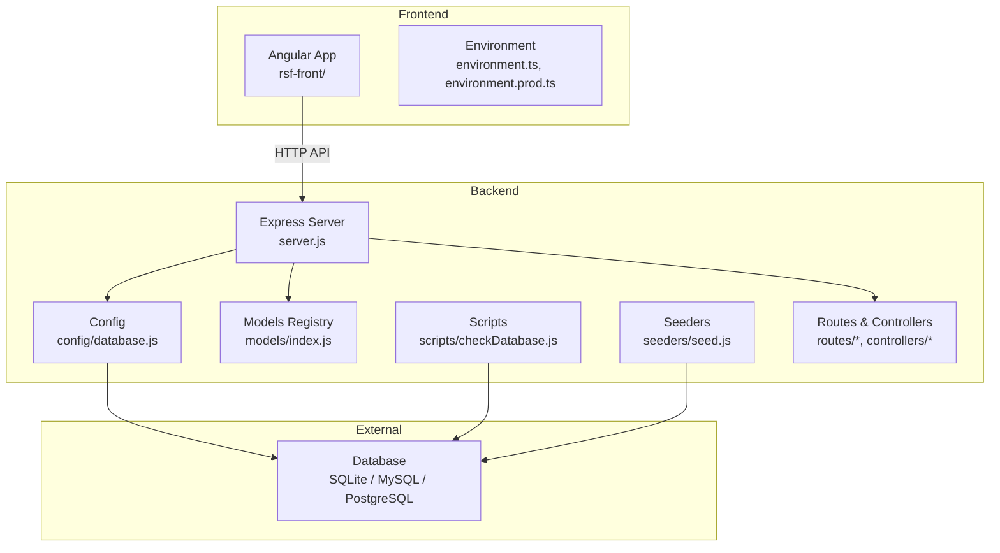
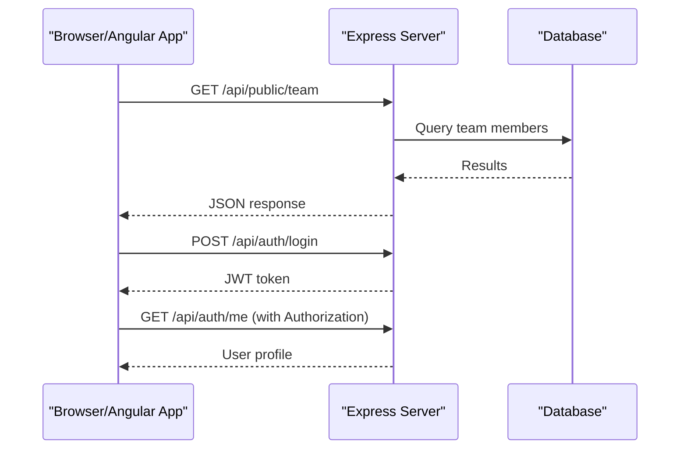
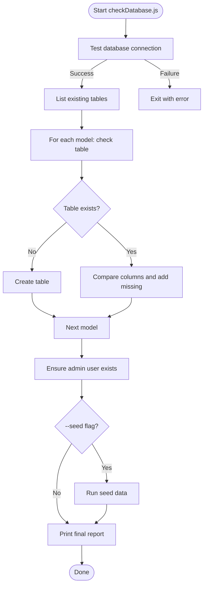
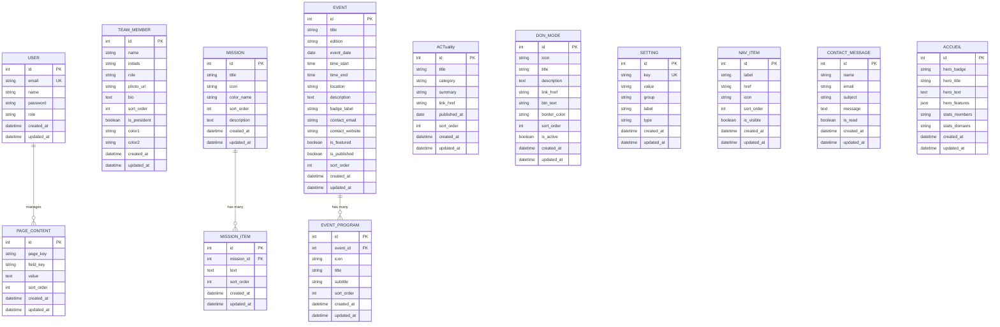
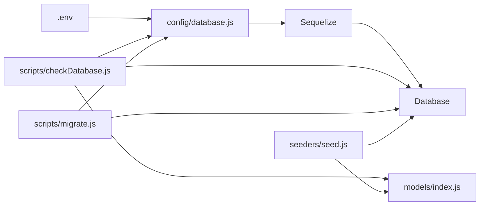

# Getting Started

<cite>
**Referenced Files in This Document**
- [package.json](file://rsf-backend/package.json)
- [README.md](file://rsf-backend/README.md)
- [DEMARRAGE_RAPIDE.md](file://rsf-backend/DEMARRAGE_RAPIDE.md)
- [server.js](file://rsf-backend/server.js)
- [config/database.js](file://rsf-backend/config/database.js)
- [scripts/checkDatabase.js](file://rsf-backend/scripts/checkDatabase.js)
- [scripts/migrate.js](file://rsf-backend/scripts/migrate.js)
- [seeders/seed.js](file://rsf-backend/seeders/seed.js)
- [models/index.js](file://rsf-backend/models/index.js)
- [package.json](file://rsf-front/package.json)
- [environment.ts](file://rsf-front/src/environments/environment.ts)
- [environment.prod.ts](file://rsf-front/src/environments/environment.prod.ts)
</cite>

## Table of Contents
1. [Introduction](#introduction)
2. [Project Structure](#project-structure)
3. [Core Components](#core-components)
4. [Architecture Overview](#architecture-overview)
5. [Detailed Component Analysis](#detailed-component-analysis)
6. [Dependency Analysis](#dependency-analysis)
7. [Performance Considerations](#performance-considerations)
8. [Troubleshooting Guide](#troubleshooting-guide)
9. [Conclusion](#conclusion)
10. [Appendices](#appendices)

## Introduction
This guide helps you set up the Réseau Solidarité France platform locally and prepare for deployment. It covers prerequisites, backend and frontend installation, environment configuration, database setup, and verification steps. You will learn how to run the backend API, seed the database, and connect the Angular frontend to the backend.

## Project Structure
The platform consists of:
- Backend API (Node.js + Express + Sequelize): Provides admin and public APIs, manages content, teams, missions, events, testimonials, actualities, donations, settings, and navigation.
- Frontend (Angular): A modern single-page application that consumes the backend API.
- Admin static pages: Lightweight HTML/CSS admin pages for quick editing tasks.

**Diagram sources**
- [server.js:1-84](file://rsf-backend/server.js#L1-L84)
- [config/database.js:1-69](file://rsf-backend/config/database.js#L1-L69)
- [models/index.js:1-53](file://rsf-backend/models/index.js#L1-L53)
- [scripts/checkDatabase.js:1-381](file://rsf-backend/scripts/checkDatabase.js#L1-L381)
- [seeders/seed.js:1-490](file://rsf-backend/seeders/seed.js#L1-L490)
- [environment.ts:1-5](file://rsf-front/src/environments/environment.ts#L1-L5)
- [environment.prod.ts:1-5](file://rsf-front/src/environments/environment.prod.ts#L1-L5)

**Section sources**
- [README.md:1-206](file://rsf-backend/README.md#L1-L206)
- [server.js:1-84](file://rsf-backend/server.js#L1-L84)
- [config/database.js:1-69](file://rsf-backend/config/database.js#L1-L69)
- [models/index.js:1-53](file://rsf-backend/models/index.js#L1-L53)

## Core Components
- Backend API: Express server with middleware, routes, controllers, models, and scripts for database verification and migrations.
- Database: Configurable via environment variables (SQLite by default, MySQL/PostgreSQL supported).
- Scripts: Automated database verification and seeding, plus manual migrations.
- Frontend: Angular app configured to consume the backend API.

**Section sources**
- [README.md:114-143](file://rsf-backend/README.md#L114-L143)
- [package.json:6-14](file://rsf-backend/package.json#L6-L14)
- [scripts/checkDatabase.js:1-381](file://rsf-backend/scripts/checkDatabase.js#L1-L381)
- [scripts/migrate.js:1-390](file://rsf-backend/scripts/migrate.js#L1-L390)
- [seeders/seed.js:1-490](file://rsf-backend/seeders/seed.js#L1-L490)

## Architecture Overview
The backend exposes:
- Public endpoints for content consumption (team, missions, testimonials, events, actualities, settings, navigation).
- Admin endpoints requiring JWT authentication for managing content.
- A health endpoint for monitoring.

**Diagram sources**
- [server.js:32-44](file://rsf-backend/server.js#L32-L44)
- [README.md:146-184](file://rsf-backend/README.md#L146-L184)

**Section sources**
- [README.md:146-184](file://rsf-backend/README.md#L146-L184)
- [server.js:32-44](file://rsf-backend/server.js#L32-L44)

## Detailed Component Analysis

### Prerequisites
- Node.js version ≥ 18
- npm version ≥ 9

These requirements are enforced by the project’s scripts and toolchain.

**Section sources**
- [README.md:75-77](file://rsf-backend/README.md#L75-L77)
- [DEMARRAGE_RAPIDE.md:3-5](file://rsf-backend/DEMARRAGE_RAPIDE.md#L3-L5)
- [package.json:30-32](file://rsf-backend/package.json#L30-L32)

### Backend Installation and Setup
1) Install dependencies
- Navigate to the backend directory and install packages.

2) Configure environment
- Copy the example environment file to .env and edit as needed.

3) Database verification and seeding
- Use the database verification script to check/create tables and optionally seed default data.
- Alternatively, use the convenience scripts defined in package.json.

4) Start the backend
- Development mode with auto-restart.
- Production mode.

**Section sources**
- [README.md:73-110](file://rsf-backend/README.md#L73-L110)
- [DEMARRAGE_RAPIDE.md:9-57](file://rsf-backend/DEMARRAGE_RAPIDE.md#L9-L57)
- [package.json:6-14](file://rsf-backend/package.json#L6-L14)

### Environment Variables
Essential variables for the backend:
- PORT: Server port (default 3001)
- DB_DIALECT: Database engine (sqlite, mysql, postgres)
- DB_HOST, DB_NAME, DB_USER, DB_PASS, DB_PORT: Database connection details (when not using SQLite)
- DB_STORAGE: Path to SQLite file (default ./database/rsf.sqlite)
- JWT_SECRET: Secret for signing JWT tokens (required in production)
- ADMIN_EMAIL, ADMIN_PASSWORD: Initial admin credentials (optional overrides)

Notes:
- SQLite requires no separate database server.
- For MySQL/MariaDB, provide host, port, name, user, and password.
- For PostgreSQL, provide host, port, name, user, and password.

**Section sources**
- [DEMARRAGE_RAPIDE.md:18-30](file://rsf-backend/DEMARRAGE_RAPIDE.md#L18-L30)
- [config/database.js:9-66](file://rsf-backend/config/database.js#L9-L66)
- [README.md:188-195](file://rsf-backend/README.md#L188-L195)

### Database Verification and Seeding
The database verification script performs:
- Connection test
- Table existence checks
- Column addition for missing attributes
- Admin user creation if none exists
- Optional default data seeding
- Final report summarizing changes

**Diagram sources**
- [scripts/checkDatabase.js:55-374](file://rsf-backend/scripts/checkDatabase.js#L55-L374)

**Section sources**
- [README.md:114-143](file://rsf-backend/README.md#L114-L143)
- [scripts/checkDatabase.js:1-381](file://rsf-backend/scripts/checkDatabase.js#L1-L381)
- [seeders/seed.js:26-474](file://rsf-backend/seeders/seed.js#L26-L474)

### Database Models Overview
The models registry defines all tables and their relationships. Typical tables include users, page contents, team members, missions, testimonials, events, actualities, donation modes, settings, navigation items, and contact messages. Associations are defined for hierarchical data like mission items and event programs.

**Diagram sources**
- [models/index.js:22-31](file://rsf-backend/models/index.js#L22-L31)
- [seeders/seed.js:46-471](file://rsf-backend/seeders/seed.js#L46-L471)

**Section sources**
- [models/index.js:1-53](file://rsf-backend/models/index.js#L1-L53)
- [seeders/seed.js:1-490](file://rsf-backend/seeders/seed.js#L1-L490)

### Frontend Installation and Setup
1) Install dependencies
- Navigate to the frontend directory and install packages.

2) Configure environment
- The Angular app targets the backend API via environment variables.
- Development defaults to localhost:3001; adjust for production.

3) Start the frontend
- Development server with live reload.
- Build for production.

**Section sources**
- [package.json:4-10](file://rsf-front/package.json#L4-L10)
- [environment.ts:1-5](file://rsf-front/src/environments/environment.ts#L1-L5)
- [environment.prod.ts:1-5](file://rsf-front/src/environments/environment.prod.ts#L1-L5)

### Health Checks and Verification
- Health endpoint: GET /health returns service status, version, timestamp, and database dialect.
- Use a browser or REST client to verify the backend is reachable at http://localhost:3001/health.

**Section sources**
- [server.js:35-44](file://rsf-backend/server.js#L35-L44)
- [README.md:181-184](file://rsf-backend/README.md#L181-L184)

### Deployment Preparation
- Backend
  - Set production environment variables (PORT, DB_* for chosen dialect, JWT_SECRET).
  - Use production start command.
  - Ensure the database is reachable and seeded.
- Frontend
  - Build for production and deploy static assets behind a reverse proxy or CDN.
  - Update environment.prod.ts apiUrl to the production backend URL.

**Section sources**
- [README.md:188-195](file://rsf-backend/README.md#L188-L195)
- [environment.prod.ts:1-5](file://rsf-front/src/environments/environment.prod.ts#L1-L5)

## Dependency Analysis
- Backend scripts depend on environment configuration and Sequelize models.
- Database verification script orchestrates connection, table/column checks, admin creation, optional seeding, and reporting.
- Migrations script maintains a migration table and applies ordered migrations.

**Diagram sources**
- [config/database.js:1-69](file://rsf-backend/config/database.js#L1-L69)
- [scripts/checkDatabase.js:21-24](file://rsf-backend/scripts/checkDatabase.js#L21-L24)
- [scripts/migrate.js:15-17](file://rsf-backend/scripts/migrate.js#L15-L17)
- [seeders/seed.js:1-2](file://rsf-backend/seeders/seed.js#L1-L2)
- [models/index.js:1-53](file://rsf-backend/models/index.js#L1-L53)

**Section sources**
- [scripts/checkDatabase.js:21-24](file://rsf-backend/scripts/checkDatabase.js#L21-L24)
- [scripts/migrate.js:15-17](file://rsf-backend/scripts/migrate.js#L15-L17)
- [seeders/seed.js:1-2](file://rsf-backend/seeders/seed.js#L1-L2)
- [models/index.js:1-53](file://rsf-backend/models/index.js#L1-L53)

## Performance Considerations
- Use production-grade databases (MySQL/PostgreSQL) for higher concurrency and reliability compared to SQLite.
- Enable rate limiting and appropriate CORS policies in production.
- Monitor database queries and consider indexing for frequently queried fields.
- Keep dependencies updated and prune unused packages.

[No sources needed since this section provides general guidance]

## Troubleshooting Guide
Common issues and resolutions:
- Port already in use
  - Change PORT in .env and restart the backend.
- Database connection failures
  - Verify DB_DIALECT and connection details (host, port, name, user, pass).
  - For SQLite, ensure the storage path exists or is writable.
- Admin credentials not working
  - Confirm ADMIN_EMAIL and ADMIN_PASSWORD in .env or ensure the admin was created during seeding.
- Frontend cannot reach backend
  - Ensure environment.apiUrl points to the correct backend URL.
- Health endpoint fails
  - Check server logs and database connectivity.

**Section sources**
- [DEMARRAGE_RAPIDE.md:120-131](file://rsf-backend/DEMARRAGE_RAPIDE.md#L120-L131)
- [config/database.js:25-66](file://rsf-backend/config/database.js#L25-L66)
- [environment.ts:1-5](file://rsf-front/src/environments/environment.ts#L1-L5)
- [environment.prod.ts:1-5](file://rsf-front/src/environments/environment.prod.ts#L1-L5)

## Conclusion
You now have the essentials to install, configure, and verify the Réseau Solidarité France platform locally. Use the backend scripts to manage the database and the frontend to interact with the API. For production, harden security with proper secrets and choose a production database.

[No sources needed since this section summarizes without analyzing specific files]

## Appendices

### Quick Commands Reference
- Backend
  - Install: cd rsf-backend && npm install
  - Configure: cp .env.example .env
  - Verify and seed: npm run db:seed
  - Dev server: npm run dev
  - Prod server: npm start
- Frontend
  - Install: cd rsf-front && npm install
  - Dev server: npm start
  - Build: npm run build

**Section sources**
- [README.md:73-110](file://rsf-backend/README.md#L73-L110)
- [DEMARRAGE_RAPIDE.md:9-57](file://rsf-backend/DEMARRAGE_RAPIDE.md#L9-L57)
- [package.json:4-10](file://rsf-front/package.json#L4-L10)