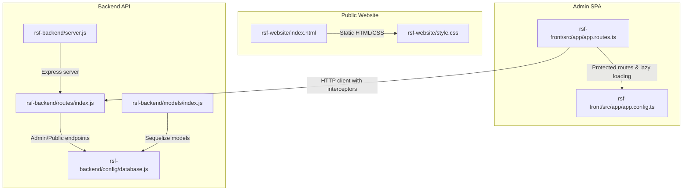
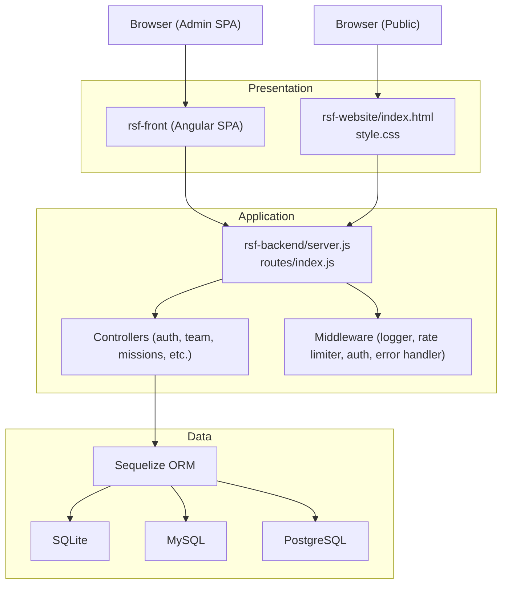
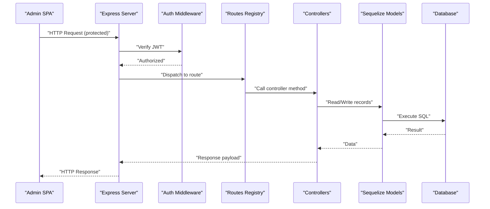
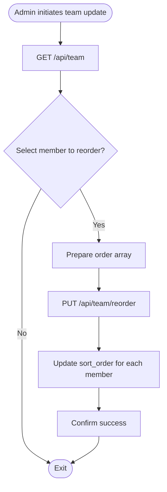
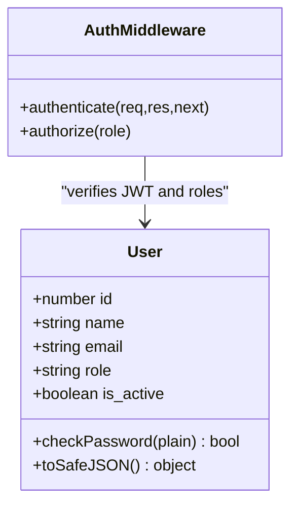
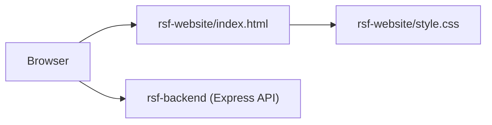
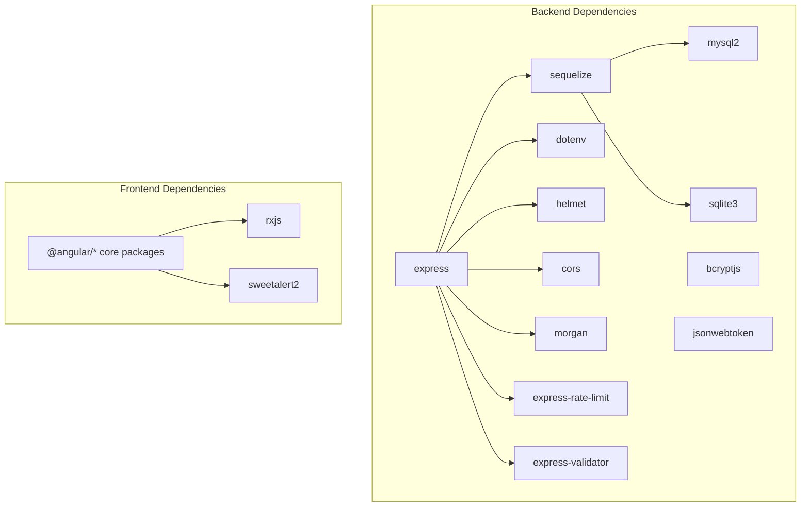

# Project Overview

<cite>
**Referenced Files in This Document**
- [README.md](file://rsf-backend/README.md)
- [package.json](file://rsf-backend/package.json)
- [server.js](file://rsf-backend/server.js)
- [database.js](file://rsf-backend/config/database.js)
- [index.js](file://rsf-backend/models/index.js)
- [crudFactory.js](file://rsf-backend/controllers/crudFactory.js)
- [index.js](file://rsf-backend/routes/index.js)
- [team.js](file://rsf-backend/routes/team.js)
- [teamController.js](file://rsf-backend/controllers/teamController.js)
- [User.js](file://rsf-backend/models/User.js)
- [TeamMember.js](file://rsf-backend/models/TeamMember.js)
- [package.json](file://rsf-front/package.json)
- [angular.json](file://rsf-front/angular.json)
- [app.config.ts](file://rsf-front/src/app/app.config.ts)
- [app.routes.ts](file://rsf-front/src/app/app.routes.ts)
- [index.html](file://rsf-website/index.html)
- [style.css](file://rsf-website/style.css)
</cite>

## Table of Contents
1. [Introduction](#introduction)
2. [Project Structure](#project-structure)
3. [Core Components](#core-components)
4. [Architecture Overview](#architecture-overview)
5. [Detailed Component Analysis](#detailed-component-analysis)
6. [Dependency Analysis](#dependency-analysis)
7. [Performance Considerations](#performance-considerations)
8. [Troubleshooting Guide](#troubleshooting-guide)
9. [Conclusion](#conclusion)

## Introduction
Réseau Solidarité France (RSF) is a complete digital platform designed to support a French solidarity association that accompanies students, employees, and individuals in precarious situations. The platform provides a public website for outreach and engagement, an Angular-based administration panel for content editors and administrators, and a Node.js/Express backend API that powers both public views and administrative workflows. The backend leverages Sequelize ORM to support SQLite, MySQL, and PostgreSQL, enabling flexible deployment across local development and production environments. The system emphasizes content management, team administration, event scheduling, testimonial curation, and donation modes, while maintaining strong security and operational reliability.

## Project Structure
The project is organized into three primary applications:
- rsf-website: A static public website built with HTML and CSS, providing the association’s public presence.
- rsf-front: An Angular single-page application (SPA) serving the administration panel with protected routes and user authentication.
- rsf-backend: A Node.js/Express API with Sequelize ORM, providing public and admin endpoints backed by a relational database.

**Diagram sources**
- [index.html](file://rsf-website/index.html)
- [style.css](file://rsf-website/style.css)
- [app.routes.ts](file://rsf-front/src/app/app.routes.ts)
- [app.config.ts](file://rsf-front/src/app/app.config.ts)
- [server.js](file://rsf-backend/server.js)
- [index.js](file://rsf-backend/routes/index.js)
- [database.js](file://rsf-backend/config/database.js)
- [index.js](file://rsf-backend/models/index.js)

**Section sources**
- [README.md](file://rsf-backend/README.md)
- [package.json](file://rsf-backend/package.json)
- [angular.json](file://rsf-front/angular.json)

## Core Components
- Public Website (rsf-website): A static HTML/CSS site offering the association’s public pages, navigation, and responsive design. It serves as the entry point for visitors seeking information about RSF’s mission, activities, events, testimonials, and donations.
- Admin SPA (rsf-front): An Angular application implementing protected routes, authentication guards, and HTTP interceptors. It provides a comprehensive content management interface for editors and administrators, including dashboard, page editing, team management, missions, testimonials, events, actualities, donations, and settings.
- Backend API (rsf-backend): A Node.js/Express server exposing public and admin endpoints. It integrates middleware for logging, rate limiting, CORS, and error handling, and uses Sequelize to manage models and database migrations. The API supports JWT-based authentication and a generic CRUD factory for streamlined resource management.

Key backend capabilities:
- Authentication and authorization with JWT and role-based access.
- Generic CRUD factory enabling rapid endpoint creation for resources.
- Database abstraction supporting SQLite, MySQL, and PostgreSQL.
- Public endpoints for retrieving published content (pages, team, missions, testimonials, events, actualities, settings, navigation).
- Admin endpoints for managing content, team, missions, testimonials, events, actualities, donations, and settings.

**Section sources**
- [README.md](file://rsf-backend/README.md)
- [server.js](file://rsf-backend/server.js)
- [index.js](file://rsf-backend/routes/index.js)
- [crudFactory.js](file://rsf-backend/controllers/crudFactory.js)
- [database.js](file://rsf-backend/config/database.js)
- [app.routes.ts](file://rsf-front/src/app/app.routes.ts)
- [app.config.ts](file://rsf-front/src/app/app.config.ts)

## Architecture Overview
The system follows a classic three-tier architecture:
- Presentation Layer: Static public website and Angular admin SPA.
- Application Layer: Express API with route handlers, controllers, and middleware.
- Data Layer: Relational database via Sequelize ORM, supporting SQLite, MySQL, and PostgreSQL.

**Diagram sources**
- [server.js](file://rsf-backend/server.js)
- [index.js](file://rsf-backend/routes/index.js)
- [database.js](file://rsf-backend/config/database.js)
- [index.js](file://rsf-backend/models/index.js)
- [index.html](file://rsf-website/index.html)
- [style.css](file://rsf-website/style.css)
- [app.routes.ts](file://rsf-front/src/app/app.routes.ts)

## Detailed Component Analysis

### Backend API and Data Access
The backend is structured around Express routes, controllers, middleware, and Sequelize models. The route registry mounts public and admin endpoints, with authentication middleware applied globally for protected routes. The database configuration supports multiple dialects and includes connection pooling and logging tailored to development and production environments.

**Diagram sources**
- [server.js](file://rsf-backend/server.js)
- [index.js](file://rsf-backend/routes/index.js)
- [index.js](file://rsf-backend/models/index.js)
- [database.js](file://rsf-backend/config/database.js)

**Section sources**
- [server.js](file://rsf-backend/server.js)
- [index.js](file://rsf-backend/routes/index.js)
- [database.js](file://rsf-backend/config/database.js)
- [index.js](file://rsf-backend/models/index.js)

### Team Management Workflow
Team management demonstrates the generic CRUD pattern and reordering capability. The route registry exposes endpoints for listing, retrieving, creating, updating, deleting, and reordering team members. The controller implements standard CRUD operations with explicit ordering updates.

**Diagram sources**
- [team.js](file://rsf-backend/routes/team.js)
- [teamController.js](file://rsf-backend/controllers/teamController.js)

**Section sources**
- [team.js](file://rsf-backend/routes/team.js)
- [teamController.js](file://rsf-backend/controllers/teamController.js)

### Authentication and Authorization
The backend enforces JWT-based authentication for admin endpoints. Users are represented by a dedicated model with hashed passwords and role-based permissions. The authentication middleware validates tokens and authorizes access to protected routes.

**Diagram sources**
- [User.js](file://rsf-backend/models/User.js)
- [index.js](file://rsf-backend/routes/index.js)

**Section sources**
- [User.js](file://rsf-backend/models/User.js)
- [index.js](file://rsf-backend/routes/index.js)

### Public Website Content Delivery
The public website serves as a static landing page and informational hub. It includes navigation, hero sections, feature highlights, testimonials, and footer links. While static, it integrates with the backend API for dynamic content retrieval in the admin SPA, ensuring a cohesive content strategy across both public and administrative interfaces.

**Diagram sources**
- [index.html](file://rsf-website/index.html)
- [style.css](file://rsf-website/style.css)
- [server.js](file://rsf-backend/server.js)

**Section sources**
- [index.html](file://rsf-website/index.html)
- [style.css](file://rsf-website/style.css)
- [server.js](file://rsf-backend/server.js)

## Dependency Analysis
The backend relies on a set of core libraries for HTTP handling, security, validation, logging, and database connectivity. The Angular frontend depends on the Angular framework and associated tooling for building the admin SPA. The static website is self-contained with minimal external dependencies.

**Diagram sources**
- [package.json](file://rsf-backend/package.json)
- [package.json](file://rsf-front/package.json)

**Section sources**
- [package.json](file://rsf-backend/package.json)
- [package.json](file://rsf-front/package.json)

## Performance Considerations
- Database pooling: The backend configures connection pools for MySQL and PostgreSQL to optimize concurrent connections and reduce overhead.
- Logging and monitoring: Morgan provides colored HTTP logging; consider structured logging and metrics collection in production deployments.
- Static assets: The backend serves images statically, reducing API load for media delivery.
- Frontend build: Angular’s production configuration enables optimization and hashing for efficient caching.
- Rate limiting: Global and login-specific rate limits protect the API from abuse while allowing legitimate traffic.

[No sources needed since this section provides general guidance]

## Troubleshooting Guide
Common operational tasks and checks:
- Health endpoint: Use the health route to verify server status and database dialect.
- Database verification: Run the database check script to ensure tables exist and columns match model definitions.
- Environment variables: Ensure .env is configured with appropriate database credentials and dialect selection.
- Authentication: Verify JWT tokens and roles when accessing admin endpoints.
- CORS and security headers: Confirm CORS policy and Helmet headers align with deployment requirements.

**Section sources**
- [server.js](file://rsf-backend/server.js)
- [README.md](file://rsf-backend/README.md)
- [package.json](file://rsf-backend/package.json)

## Conclusion
Réseau Solidarité France is a cohesive, full-stack solution that combines a static public website, an Angular administration panel, and a robust Node.js/Express backend powered by Sequelize. The platform supports the association’s mission by providing a scalable, secure, and maintainable foundation for content management, team administration, event coordination, and donor engagement. Its modular architecture, generic CRUD factory, and multi-database support enable efficient development and reliable operations across diverse hosting environments.