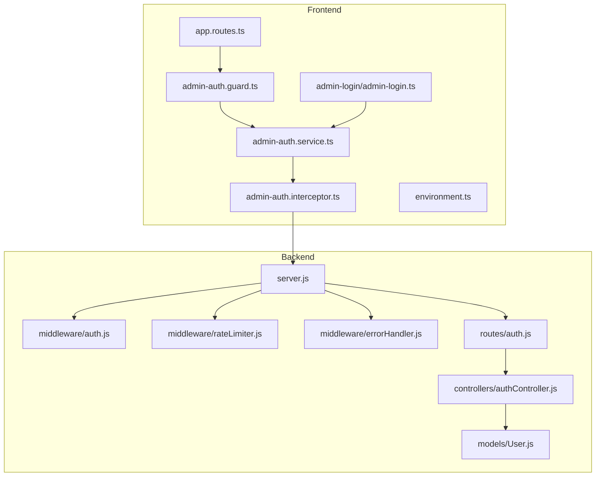
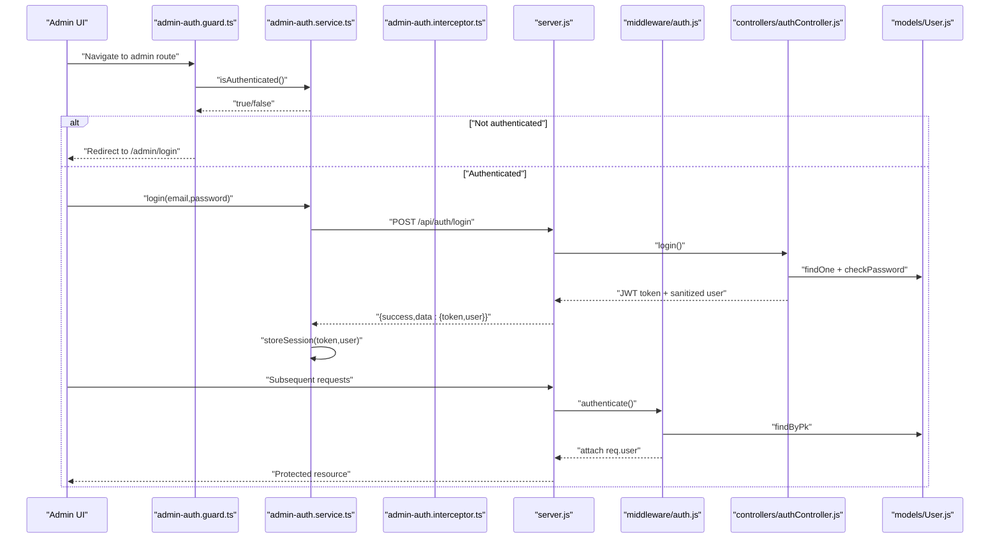
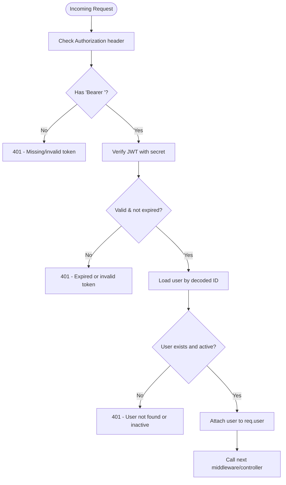
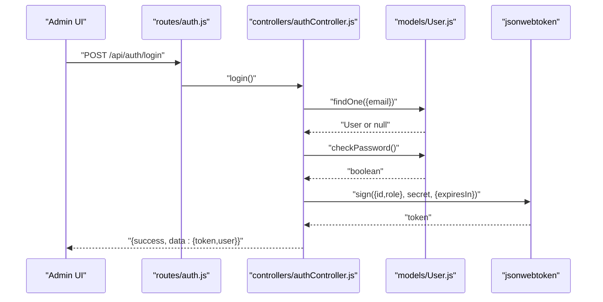
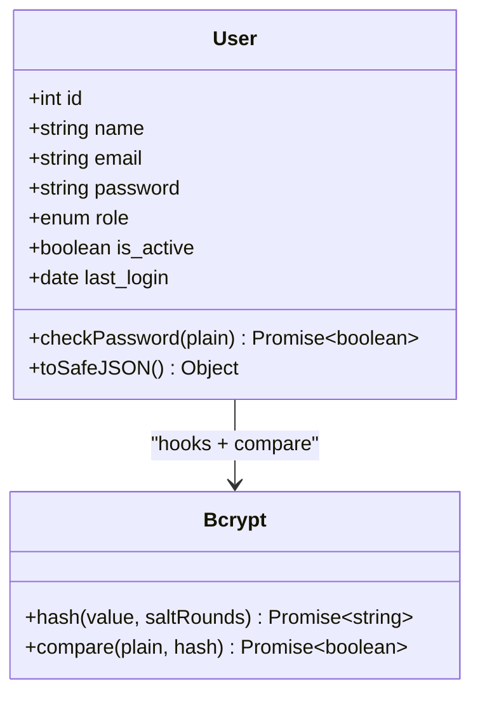
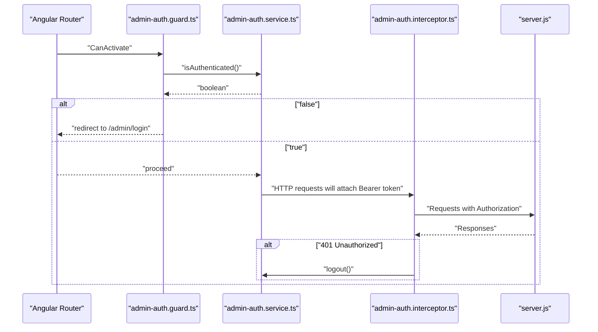
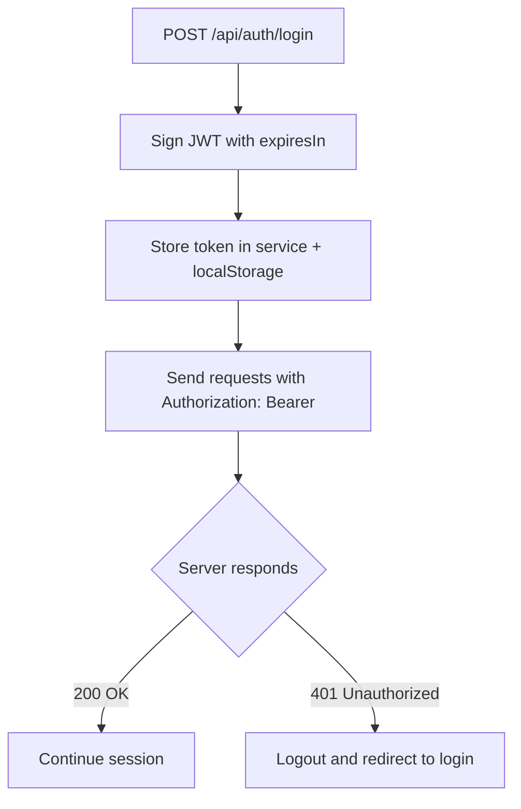
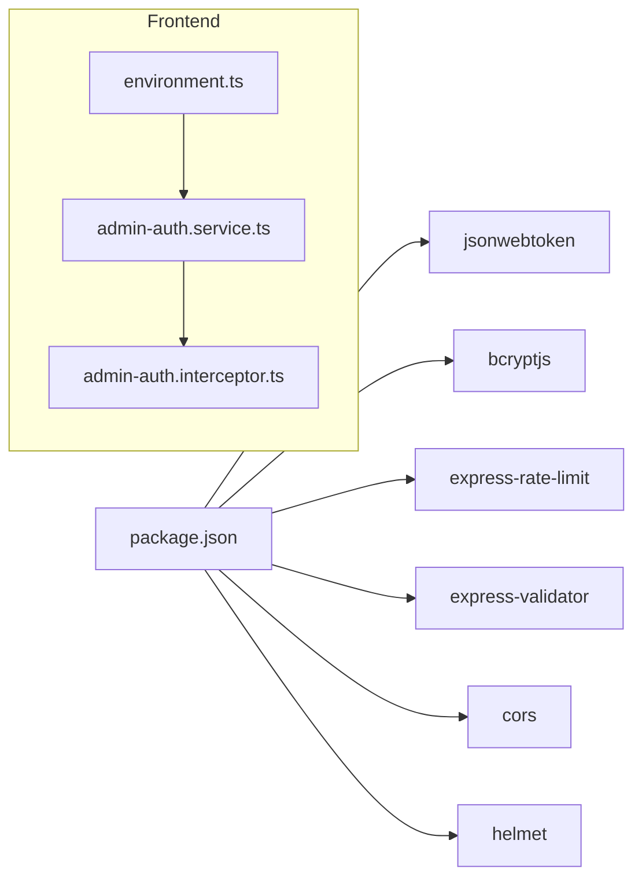

# Authentication System

<cite>
**Referenced Files in This Document**
- [server.js](file://rsf-backend/server.js)
- [auth.js](file://rsf-backend/middleware/auth.js)
- [errorHandler.js](file://rsf-backend/middleware/errorHandler.js)
- [rateLimiter.js](file://rsf-backend/middleware/rateLimiter.js)
- [auth.js](file://rsf-backend/routes/auth.js)
- [authController.js](file://rsf-backend/controllers/authController.js)
- [User.js](file://rsf-backend/models/User.js)
- [admin-auth.guard.ts](file://rsf-front/src/app/admin/admin-auth.guard.ts)
- [admin-auth.service.ts](file://rsf-front/src/app/admin/admin-auth.service.ts)
- [admin-auth.interceptor.ts](file://rsf-front/src/app/admin/admin-auth.interceptor.ts)
- [admin-login.ts](file://rsf-front/src/app/admin/admin-login/admin-login.ts)
- [app.routes.ts](file://rsf-front/src/app/app.routes.ts)
- [environment.ts](file://rsf-front/src/environments/environment.ts)
- [package.json](file://rsf-backend/package.json)
</cite>

## Table of Contents
1. [Introduction](#introduction)
2. [Project Structure](#project-structure)
3. [Core Components](#core-components)
4. [Architecture Overview](#architecture-overview)
5. [Detailed Component Analysis](#detailed-component-analysis)
6. [Dependency Analysis](#dependency-analysis)
7. [Performance Considerations](#performance-considerations)
8. [Troubleshooting Guide](#troubleshooting-guide)
9. [Conclusion](#conclusion)
10. [Appendices](#appendices)

## Introduction
This document describes the authentication system for the Réseau Solidarité France platform. It covers JWT-based authentication, token lifecycle, RBAC, password hashing, session management, and secure client-side token storage. It also documents the Angular guard and interceptor used to protect admin routes and attach authentication headers.

## Project Structure
The authentication system spans the backend API and the Angular admin frontend:
- Backend: Express server, JWT middleware, user model with bcrypt hashing, auth routes and controller, rate limiter, and global error handler.
- Frontend: Admin guard, auth service, HTTP interceptor, and login component.

**Diagram sources**
- [server.js:1-84](file://rsf-backend/server.js#L1-L84)
- [auth.js:1-50](file://rsf-backend/middleware/auth.js#L1-L50)
- [rateLimiter.js:1-21](file://rsf-backend/middleware/rateLimiter.js#L1-L21)
- [errorHandler.js:1-38](file://rsf-backend/middleware/errorHandler.js#L1-L38)
- [auth.js:1-25](file://rsf-backend/routes/auth.js#L1-L25)
- [authController.js:1-60](file://rsf-backend/controllers/authController.js#L1-L60)
- [User.js:1-75](file://rsf-backend/models/User.js#L1-L75)
- [admin-auth.guard.ts:1-19](file://rsf-front/src/app/admin/admin-auth.guard.ts#L1-L19)
- [admin-auth.service.ts:1-107](file://rsf-front/src/app/admin/admin-auth.service.ts#L1-L107)
- [admin-auth.interceptor.ts:1-30](file://rsf-front/src/app/admin/admin-auth.interceptor.ts#L1-L30)
- [admin-login.ts:1-65](file://rsf-front/src/app/admin/admin-login/admin-login.ts#L1-L65)
- [app.routes.ts:1-177](file://rsf-front/src/app/app.routes.ts#L1-L177)
- [environment.ts:1-5](file://rsf-front/src/environments/environment.ts#L1-L5)

**Section sources**
- [server.js:1-84](file://rsf-backend/server.js#L1-L84)
- [app.routes.ts:1-177](file://rsf-front/src/app/app.routes.ts#L1-L177)

## Core Components
- JWT middleware: Validates Authorization header, verifies token, loads user, and attaches user to request context. Handles expired and invalid tokens.
- Auth routes: Expose login, profile retrieval, and password change endpoints with validation and rate limiting.
- Auth controller: Implements login, returns token and sanitized user payload; implements change password with validation.
- User model: Defines schema, enums for role and activity, bcrypt hashing via Sequelize hooks, and helper methods for password comparison and safe serialization.
- Frontend guard: Protects admin routes by checking local session presence.
- Frontend auth service: Manages login, stores token and user in memory and localStorage, exposes helpers.
- Frontend interceptor: Attaches Authorization header for API requests and logs out on 401 responses.

**Section sources**
- [auth.js:1-50](file://rsf-backend/middleware/auth.js#L1-L50)
- [auth.js:1-25](file://rsf-backend/routes/auth.js#L1-L25)
- [authController.js:1-60](file://rsf-backend/controllers/authController.js#L1-L60)
- [User.js:1-75](file://rsf-backend/models/User.js#L1-L75)
- [admin-auth.guard.ts:1-19](file://rsf-front/src/app/admin/admin-auth.guard.ts#L1-L19)
- [admin-auth.service.ts:1-107](file://rsf-front/src/app/admin/admin-auth.service.ts#L1-L107)
- [admin-auth.interceptor.ts:1-30](file://rsf-front/src/app/admin/admin-auth.interceptor.ts#L1-L30)

## Architecture Overview
The authentication flow integrates backend JWT verification and frontend session/token management.

**Diagram sources**
- [admin-auth.guard.ts:1-19](file://rsf-front/src/app/admin/admin-auth.guard.ts#L1-L19)
- [admin-auth.service.ts:1-107](file://rsf-front/src/app/admin/admin-auth.service.ts#L1-L107)
- [admin-auth.interceptor.ts:1-30](file://rsf-front/src/app/admin/admin-auth.interceptor.ts#L1-L30)
- [server.js:1-84](file://rsf-backend/server.js#L1-L84)
- [auth.js:1-50](file://rsf-backend/middleware/auth.js#L1-L50)
- [authController.js:1-60](file://rsf-backend/controllers/authController.js#L1-L60)
- [User.js:1-75](file://rsf-backend/models/User.js#L1-L75)

## Detailed Component Analysis

### Backend JWT Middleware and RBAC
- Token extraction: Reads Authorization header, expects Bearer scheme.
- Verification: Uses JWT secret to verify signature and decode payload.
- User loading: Loads user by ID from payload and checks activation status.
- Role-based authorization: Helper middleware checks if user role matches allowed roles.

**Diagram sources**
- [auth.js:10-33](file://rsf-backend/middleware/auth.js#L10-L33)

**Section sources**
- [auth.js:1-50](file://rsf-backend/middleware/auth.js#L1-L50)

### Auth Routes and Controllers
- Login endpoint validates email/password, authenticates user, updates last login, signs JWT with configurable expiry, and returns token plus sanitized user.
- Profile endpoint requires authentication and returns sanitized user.
- Change password endpoint validates current and new passwords, verifies current password, and updates hashed password.

**Diagram sources**
- [auth.js:9-13](file://rsf-backend/routes/auth.js#L9-L13)
- [authController.js:6-36](file://rsf-backend/controllers/authController.js#L6-L36)
- [User.js:63-65](file://rsf-backend/models/User.js#L63-L65)

**Section sources**
- [auth.js:1-25](file://rsf-backend/routes/auth.js#L1-L25)
- [authController.js:1-60](file://rsf-backend/controllers/authController.js#L1-L60)
- [User.js:1-75](file://rsf-backend/models/User.js#L1-L75)

### Password Hashing with bcrypt
- Hooks: Automatic hashing on create and update when password changes.
- Comparison: Instance method compares plaintext against stored hash.
- Safe serialization: Instance method excludes sensitive password field.

**Diagram sources**
- [User.js:47-71](file://rsf-backend/models/User.js#L47-L71)

**Section sources**
- [User.js:1-75](file://rsf-backend/models/User.js#L1-L75)

### Frontend Guard and Session Management
- Guard: Prevents navigation to admin routes unless authenticated.
- Auth service: Stores session in memory and localStorage, exposes helpers for token and user.
- Interceptor: Adds Authorization header for API requests under the configured base URL and logs out on 401.
- Login component: Calls auth service login, navigates on success, shows error on failure.

**Diagram sources**
- [admin-auth.guard.ts:1-19](file://rsf-front/src/app/admin/admin-auth.guard.ts#L1-L19)
- [admin-auth.service.ts:1-107](file://rsf-front/src/app/admin/admin-auth.service.ts#L1-L107)
- [admin-auth.interceptor.ts:1-30](file://rsf-front/src/app/admin/admin-auth.interceptor.ts#L1-L30)
- [server.js:1-84](file://rsf-backend/server.js#L1-L84)

**Section sources**
- [admin-auth.guard.ts:1-19](file://rsf-front/src/app/admin/admin-auth.guard.ts#L1-L19)
- [admin-auth.service.ts:1-107](file://rsf-front/src/app/admin/admin-auth.service.ts#L1-L107)
- [admin-auth.interceptor.ts:1-30](file://rsf-front/src/app/admin/admin-auth.interceptor.ts#L1-L30)
- [admin-login.ts:1-65](file://rsf-front/src/app/admin/admin-login/admin-login.ts#L1-L65)
- [app.routes.ts:18-27](file://rsf-front/src/app/app.routes.ts#L18-L27)

### Token Expiration and Refresh
- Token signing includes an expiration period controlled by an environment variable.
- On expiration, the backend middleware responds with an expired error; the frontend interceptor triggers logout on 401 responses.

**Diagram sources**
- [authController.js:22-26](file://rsf-backend/controllers/authController.js#L22-L26)
- [auth.js:28-31](file://rsf-backend/middleware/auth.js#L28-L31)
- [admin-auth.interceptor.ts:20-28](file://rsf-front/src/app/admin/admin-auth.interceptor.ts#L20-L28)

**Section sources**
- [authController.js:1-60](file://rsf-backend/controllers/authController.js#L1-L60)
- [auth.js:1-50](file://rsf-backend/middleware/auth.js#L1-L50)
- [admin-auth.interceptor.ts:1-30](file://rsf-front/src/app/admin/admin-auth.interceptor.ts#L1-L30)

## Dependency Analysis
- Backend runtime dependencies include jsonwebtoken for JWT, bcryptjs for password hashing, express-rate-limit for rate limiting, express-validator for validation, and cors/helmet for security.
- Frontend depends on Angular HttpClient and RxJS for HTTP and reactive patterns.

**Diagram sources**
- [package.json:16-29](file://rsf-backend/package.json#L16-L29)
- [environment.ts:1-5](file://rsf-front/src/environments/environment.ts#L1-L5)
- [admin-auth.service.ts:1-107](file://rsf-front/src/app/admin/admin-auth.service.ts#L1-L107)
- [admin-auth.interceptor.ts:1-30](file://rsf-front/src/app/admin/admin-auth.interceptor.ts#L1-L30)

**Section sources**
- [package.json:1-34](file://rsf-backend/package.json#L1-L34)
- [environment.ts:1-5](file://rsf-front/src/environments/environment.ts#L1-L5)

## Performance Considerations
- Token verification is lightweight; ensure JWT secret is strong and rotation policies are considered for long-lived systems.
- Rate limiting is applied to login to mitigate brute force attacks.
- bcrypt cost is configured in the user model hooks; adjust salt rounds if hardware constraints change.
- Avoid storing tokens longer than necessary; rely on short-to-medium JWT lifetimes and prompt re-authentication after prolonged inactivity.

## Troubleshooting Guide
Common issues and resolutions:
- Missing or malformed Authorization header: Ensure requests include a Bearer token; the middleware rejects missing or improperly formatted headers.
- Invalid or expired token: The middleware returns explicit messages for expired vs invalid tokens; the frontend interceptor logs out on 401 responses.
- User not found or inactive: Authentication fails early if the user does not exist or is deactivated.
- Validation errors: Express validators enforce email and password constraints; review error messages returned by the auth routes.
- Global errors: The error handler centralizes 422 validation errors and generic 500 responses.

**Section sources**
- [auth.js:10-33](file://rsf-backend/middleware/auth.js#L10-L33)
- [auth.js:10-13](file://rsf-backend/routes/auth.js#L10-L13)
- [errorHandler.js:4-28](file://rsf-backend/middleware/errorHandler.js#L4-L28)
- [admin-auth.interceptor.ts:20-28](file://rsf-front/src/app/admin/admin-auth.interceptor.ts#L20-L28)

## Conclusion
The platform implements a straightforward JWT-based authentication system with robust middleware, validation, and frontend integration. Passwords are hashed securely, tokens carry minimal claims, and RBAC is enforced via role checks. The frontend guards protected routes and manages tokens safely in localStorage while attaching headers automatically for authenticated requests.

## Appendices

### Implementing New Authenticated Routes
- Backend:
  - Add route with validation middleware and attach the authentication middleware before your controller.
  - For role restrictions, chain the authorization middleware with allowed roles.
- Frontend:
  - Add a route guarded by the existing admin guard.
  - Ensure the base API URL is configured so the interceptor attaches Authorization headers automatically.

**Section sources**
- [auth.js:1-25](file://rsf-backend/routes/auth.js#L1-L25)
- [auth.js:35-47](file://rsf-backend/middleware/auth.js#L35-L47)
- [app.routes.ts:18-27](file://rsf-front/src/app/app.routes.ts#L18-L27)
- [environment.ts:1-5](file://rsf-front/src/environments/environment.ts#L1-L5)

### Secure Token Storage Guidelines
- Store tokens only in memory and localStorage for the admin session; avoid server-side sessions.
- Clear tokens on logout and invalidate tokens on password change.
- Prefer short-lived tokens and prompt re-authentication after inactivity.
- Keep the JWT secret secret and rotate periodically.

**Section sources**
- [admin-auth.service.ts:58-61](file://rsf-front/src/app/admin/admin-auth.service.ts#L58-L61)
- [authController.js:44-57](file://rsf-backend/controllers/authController.js#L44-L57)