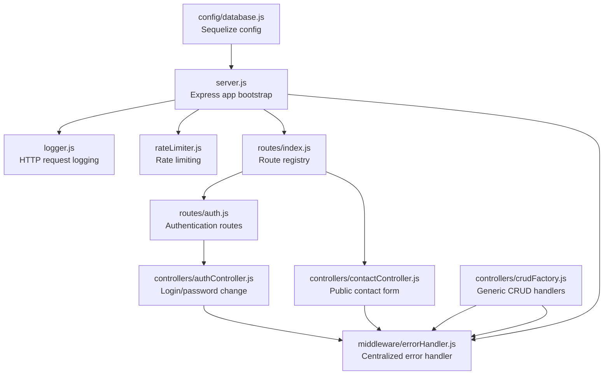
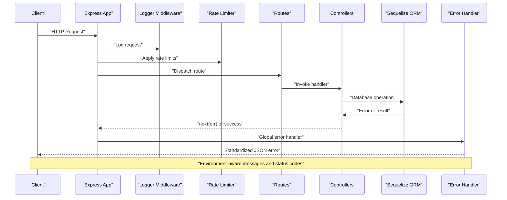
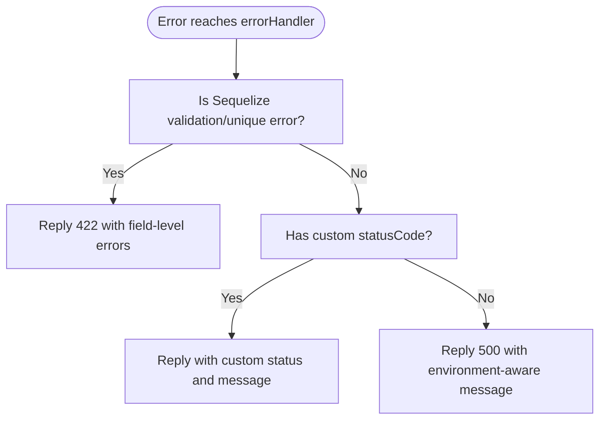
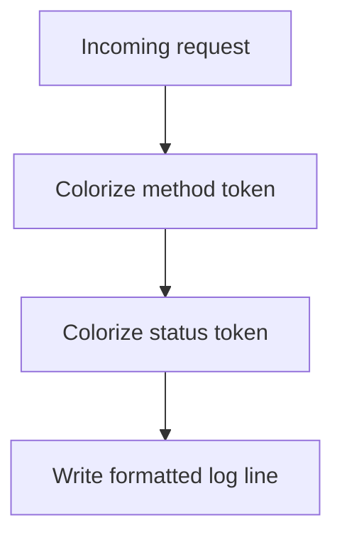
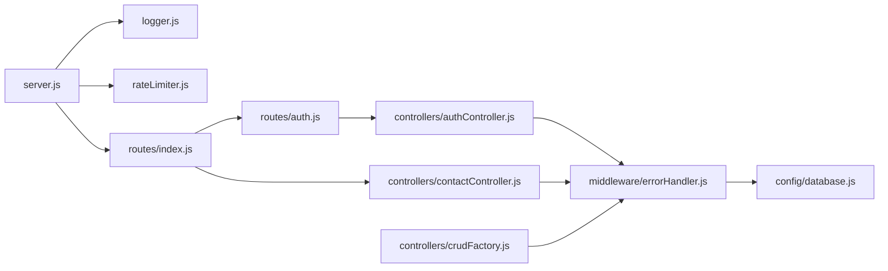

# Error Handling and Logging

<cite>
**Referenced Files in This Document**
- [server.js](file://rsf-backend/server.js)
- [errorHandler.js](file://rsf-backend/middleware/errorHandler.js)
- [logger.js](file://rsf-backend/middleware/logger.js)
- [rateLimiter.js](file://rsf-backend/middleware/rateLimiter.js)
- [validate.js](file://rsf-backend/middleware/validate.js)
- [crudFactory.js](file://rsf-backend/controllers/crudFactory.js)
- [authController.js](file://rsf-backend/controllers/authController.js)
- [contactController.js](file://rsf-backend/controllers/contactController.js)
- [auth.js](file://rsf-backend/routes/auth.js)
- [index.js](file://rsf-backend/routes/index.js)
- [database.js](file://rsf-backend/config/database.js)
- [package.json](file://rsf-backend/package.json)
</cite>

## Table of Contents
1. [Introduction](#introduction)
2. [Project Structure](#project-structure)
3. [Core Components](#core-components)
4. [Architecture Overview](#architecture-overview)
5. [Detailed Component Analysis](#detailed-component-analysis)
6. [Dependency Analysis](#dependency-analysis)
7. [Performance Considerations](#performance-considerations)
8. [Troubleshooting Guide](#troubleshooting-guide)
9. [Conclusion](#conclusion)
10. [Appendices](#appendices)

## Introduction
This document describes the error handling and logging systems for the Réseau Solidarité France backend API. It covers centralized error handling middleware, error classification and standardized response formatting, error code mapping, structured logging with colorized HTTP request logs, rate limiting, input validation, and practical patterns for propagating errors and graceful degradation. It also outlines strategies for handling sensitive information, integrating with external monitoring services, and establishing alerting and log analysis practices for proactive issue detection.

## Project Structure
The backend is an Express application with modular middleware and controllers. Error handling and logging are implemented as reusable middleware and integrated into the application lifecycle.

**Diagram sources**
- [server.js:1-84](file://rsf-backend/server.js#L1-L84)
- [logger.js:1-28](file://rsf-backend/middleware/logger.js#L1-L28)
- [rateLimiter.js:1-21](file://rsf-backend/middleware/rateLimiter.js#L1-L21)
- [index.js:1-28](file://rsf-backend/routes/index.js#L1-L28)
- [auth.js:1-25](file://rsf-backend/routes/auth.js#L1-L25)
- [authController.js:1-60](file://rsf-backend/controllers/authController.js#L1-L60)
- [contactController.js:1-47](file://rsf-backend/controllers/contactController.js#L1-L47)
- [crudFactory.js:1-100](file://rsf-backend/controllers/crudFactory.js#L1-L100)
- [errorHandler.js:1-38](file://rsf-backend/middleware/errorHandler.js#L1-L38)
- [database.js:1-69](file://rsf-backend/config/database.js#L1-L69)

**Section sources**
- [server.js:1-84](file://rsf-backend/server.js#L1-L84)
- [package.json:1-34](file://rsf-backend/package.json#L1-L34)

## Core Components
- Centralized error handler: Provides standardized JSON responses, classifies Sequelize validation errors, honors custom status codes, and returns generic internal error messages depending on environment.
- HTTP request logger: Colorized Morgan-based logger with method and status coloring for quick visual diagnostics.
- Rate limiter: Global and strict login rate limits to mitigate abuse.
- Input validator: Converts express-validator errors into a consistent 422 response format.
- Generic CRUD factory: Uses the centralized error handler via next(err) to propagate model errors.
- Authentication controller: Throws custom 401 errors for invalid credentials and delegates to the centralized handler.
- Database configuration: Conditional SQL logging for development and disabled logging for production.

**Section sources**
- [errorHandler.js:1-38](file://rsf-backend/middleware/errorHandler.js#L1-L38)
- [logger.js:1-28](file://rsf-backend/middleware/logger.js#L1-L28)
- [rateLimiter.js:1-21](file://rsf-backend/middleware/rateLimiter.js#L1-L21)
- [validate.js:1-22](file://rsf-backend/middleware/validate.js#L1-L22)
- [crudFactory.js:1-100](file://rsf-backend/controllers/crudFactory.js#L1-L100)
- [authController.js:1-60](file://rsf-backend/controllers/authController.js#L1-L60)
- [database.js:1-69](file://rsf-backend/config/database.js#L1-L69)

## Architecture Overview
The error handling and logging pipeline integrates at the application boundary and per-request level.

**Diagram sources**
- [server.js:1-84](file://rsf-backend/server.js#L1-L84)
- [logger.js:1-28](file://rsf-backend/middleware/logger.js#L1-L28)
- [rateLimiter.js:1-21](file://rsf-backend/middleware/rateLimiter.js#L1-L21)
- [index.js:1-28](file://rsf-backend/routes/index.js#L1-L28)
- [auth.js:1-25](file://rsf-backend/routes/auth.js#L1-L25)
- [authController.js:1-60](file://rsf-backend/controllers/authController.js#L1-L60)
- [errorHandler.js:1-38](file://rsf-backend/middleware/errorHandler.js#L1-L38)

## Detailed Component Analysis

### Centralized Error Handler
- Purpose: Standardizes error responses, classifies common ORM errors, and ensures consistent HTTP semantics.
- Classification and mapping:
  - Sequelize validation and uniqueness constraint errors → 422 with field-level details.
  - Custom errors with explicit statusCode → returned with that code.
  - Other errors → 500 with environment-aware message.
- Response shape: JSON with success flag, message, and optional nested errors array.
- Propagation pattern: Exposes a factory to attach statusCode to thrown errors; controllers and factories call next(err) to reach the handler.

**Diagram sources**
- [errorHandler.js:4-28](file://rsf-backend/middleware/errorHandler.js#L4-L28)

**Section sources**
- [errorHandler.js:1-38](file://rsf-backend/middleware/errorHandler.js#L1-L38)

### HTTP Request Logging
- Implementation: Morgan-based logger with colored tokens for HTTP method and status codes.
- Output: Method, URL, status, response time, and content length.
- Environment: Console output; suitable for local development and container logs.

**Diagram sources**
- [logger.js:14-25](file://rsf-backend/middleware/logger.js#L14-L25)

**Section sources**
- [logger.js:1-28](file://rsf-backend/middleware/logger.js#L1-L28)

### Rate Limiting
- Global limiter: 200 requests per 15 minutes per IP.
- Login limiter: 10 attempts per 15 minutes per IP.
- Responses: Standardized JSON with success=false and message.

**Section sources**
- [rateLimiter.js:1-21](file://rsf-backend/middleware/rateLimiter.js#L1-L21)

### Input Validation
- Validates express-validator results and returns 422 with a flat list of field/message pairs.
- Used alongside route-specific validations (e.g., email format, password length).

**Section sources**
- [validate.js:1-22](file://rsf-backend/middleware/validate.js#L1-L22)
- [auth.js:9-22](file://rsf-backend/routes/auth.js#L9-L22)

### Generic CRUD Factory
- Implements getAll/getOne/create/update/remove/reorder.
- On missing resources, throws a custom 404 error via the factory.
- Wraps operations in try/catch and forwards errors to the centralized handler via next(err).

**Section sources**
- [crudFactory.js:1-100](file://rsf-backend/controllers/crudFactory.js#L1-L100)

### Authentication Controller
- login: Throws 401 for invalid credentials; otherwise returns success with token and sanitized user data.
- changePassword: Throws 400 for incorrect current password; otherwise updates and returns success.
- Delegates to centralized error handler via next(err).

**Section sources**
- [authController.js:1-60](file://rsf-backend/controllers/authController.js#L1-L60)

### Contact Controller (Public)
- sendMessage: Creates a contact message and returns 201 with minimal data.
- getMessages/markAsRead/deleteMessage: Admin-only operations; uses next(err) for error propagation.

**Section sources**
- [contactController.js:1-47](file://rsf-backend/controllers/contactController.js#L1-L47)

### Route Composition and Security Guards
- routes/index.js mounts public and protected routes; applies JWT authentication guard globally after the initial mount.
- routes/auth.js applies rate limiting and validation before invoking controllers.

**Section sources**
- [index.js:1-28](file://rsf-backend/routes/index.js#L1-L28)
- [auth.js:1-25](file://rsf-backend/routes/auth.js#L1-L25)

### Database Configuration and SQL Logging
- Conditional SQL logging: Enabled in development, disabled in production.
- Supports SQLite, MySQL, and PostgreSQL with dialect-specific options.

**Section sources**
- [database.js:1-69](file://rsf-backend/config/database.js#L1-L69)

## Dependency Analysis
- Express app depends on:
  - Logger middleware for request visibility.
  - Rate limiter for abuse protection.
  - Routes for endpoint orchestration.
  - Controllers for business logic.
  - Centralized error handler for consistent error responses.
- Controllers depend on:
  - Validation middleware for input sanitization.
  - Error factory for throwing custom status errors.
  - Database models via Sequelize ORM.
- Routes depend on:
  - Authentication guard for protected endpoints.
  - Validation and rate limiting for security and quality.

**Diagram sources**
- [server.js:1-84](file://rsf-backend/server.js#L1-L84)
- [logger.js:1-28](file://rsf-backend/middleware/logger.js#L1-L28)
- [rateLimiter.js:1-21](file://rsf-backend/middleware/rateLimiter.js#L1-L21)
- [index.js:1-28](file://rsf-backend/routes/index.js#L1-L28)
- [auth.js:1-25](file://rsf-backend/routes/auth.js#L1-L25)
- [authController.js:1-60](file://rsf-backend/controllers/authController.js#L1-L60)
- [contactController.js:1-47](file://rsf-backend/controllers/contactController.js#L1-L47)
- [crudFactory.js:1-100](file://rsf-backend/controllers/crudFactory.js#L1-L100)
- [errorHandler.js:1-38](file://rsf-backend/middleware/errorHandler.js#L1-L38)
- [database.js:1-69](file://rsf-backend/config/database.js#L1-L69)

**Section sources**
- [server.js:1-84](file://rsf-backend/server.js#L1-L84)
- [package.json:16-29](file://rsf-backend/package.json#L16-L29)

## Performance Considerations
- SQL logging: Disabled in production to reduce I/O overhead; enabled in development for debugging.
- Rate limiting: Prevents resource exhaustion and improves resilience under load.
- Validation: Early exit on invalid input reduces downstream processing costs.
- Centralized error handling: Ensures predictable response shapes and avoids expensive stack traces in production.

[No sources needed since this section provides general guidance]

## Troubleshooting Guide
- Unexpected 500 errors:
  - Verify environment configuration; production hides internal messages.
  - Inspect centralized error handler’s classification branches.
- 422 validation errors:
  - Confirm express-validator middleware is applied before controllers.
  - Review field-level errors returned by the handler.
- 401/404 authentication/resource errors:
  - Check authentication guard and controller logic.
  - Ensure custom errors are thrown with appropriate status codes.
- Rate limit exceeded:
  - Review global and login-specific limits; adjust thresholds if needed.
- SQL noise in logs:
  - Confirm NODE_ENV and database logging settings.

**Section sources**
- [errorHandler.js:4-28](file://rsf-backend/middleware/errorHandler.js#L4-L28)
- [validate.js:9-19](file://rsf-backend/middleware/validate.js#L9-L19)
- [rateLimiter.js:4-18](file://rsf-backend/middleware/rateLimiter.js#L4-L18)
- [database.js:13-15](file://rsf-backend/config/database.js#L13-L15)

## Conclusion
The backend implements a robust, centralized error handling and logging strategy that standardizes responses, classifies common errors, and integrates with rate limiting and input validation. The modular design enables consistent error propagation across controllers and routes, while development-friendly logging and production-safe error masking support both debugging and operational safety.

[No sources needed since this section summarizes without analyzing specific files]

## Appendices

### Error Response Schema
- Fields:
  - success: Boolean flag indicating failure.
  - message: Human-readable error message.
  - errors: Optional array of field-level validation errors (when applicable).

**Section sources**
- [errorHandler.js:9-13](file://rsf-backend/middleware/errorHandler.js#L9-L13)
- [validate.js:12-16](file://rsf-backend/middleware/validate.js#L12-L16)

### Error Propagation Patterns
- Controllers and factories call next(err) to forward errors to the centralized handler.
- Custom errors are created with a message and status code using the factory.

**Section sources**
- [crudFactory.js:51](file://rsf-backend/controllers/crudFactory.js#L51)
- [crudFactory.js:76](file://rsf-backend/controllers/crudFactory.js#L76)
- [authController.js:34](file://rsf-backend/controllers/authController.js#L34)
- [errorHandler.js:30-35](file://rsf-backend/middleware/errorHandler.js#L30-L35)

### Graceful Degradation Strategies
- Health endpoint: Provides service metadata and DB dialect for readiness checks.
- 404 handling: Returns a standardized message for unknown routes.
- Rate limiting: Protects availability under high traffic.

**Section sources**
- [server.js:35-49](file://rsf-backend/server.js#L35-L49)

### Monitoring Integration and Alerting
- Recommended integrations:
  - Export Morgan logs to a log aggregator (e.g., ELK, Fluentd, Cloud logging).
  - Forward application logs to an APM/Sentry-like service for error tracking and alerting.
  - Monitor rate limiter hits and 5xx error rates as alerting signals.
- Alerting thresholds (examples):
  - Spike in 5xx errors over 5 minutes.
  - Consecutive 429 responses exceeding threshold.
  - DB connection failures or slow query alerts.

[No sources needed since this section provides general guidance]

### Log Rotation and Retention
- Use OS-level log rotation tools (e.g., logrotate on Linux) to manage file sizes.
- Archive rotated logs and enforce retention policies aligned with compliance needs.

[No sources needed since this section provides general guidance]

### Structured Logging and Audit Trail
- Extend Morgan to emit JSON with request ID, user agent, and correlation IDs.
- Record administrative actions (e.g., CRUD on protected resources) with timestamps and actor identifiers for auditability.

[No sources needed since this section provides general guidance]

### Handling Sensitive Information
- Never log raw passwords or tokens.
- Sanitize request bodies and headers before logging.
- Use redaction libraries and environment-based logging levels to avoid accidental exposure.

[No sources needed since this section provides general guidance]