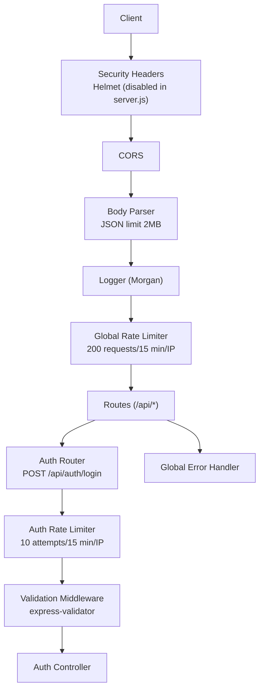
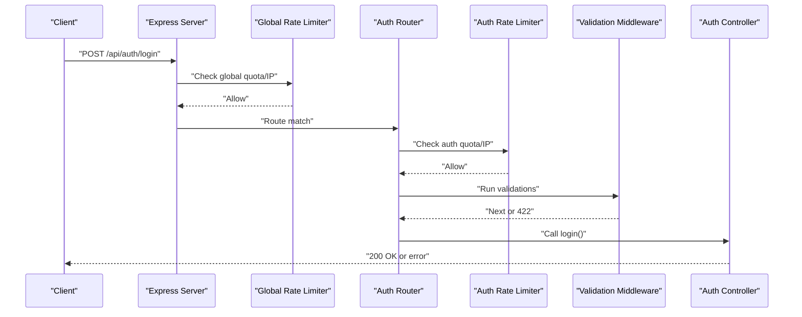
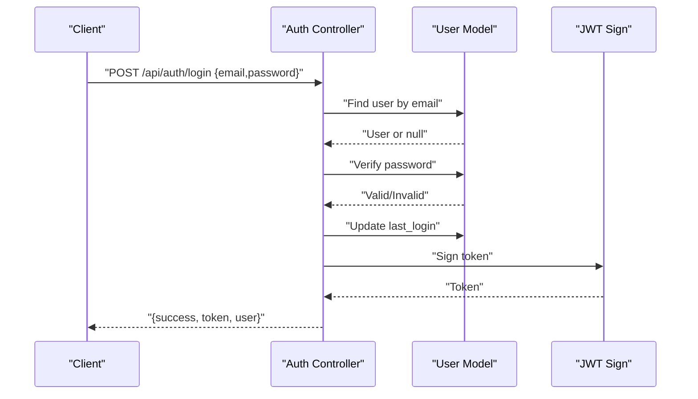
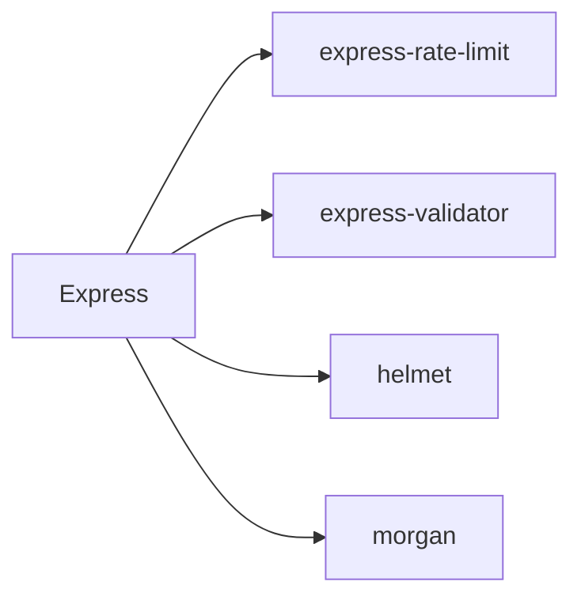

# Rate Limiting and Protection

<cite>
**Referenced Files in This Document**
- [server.js](file://rsf-backend/server.js)
- [rateLimiter.js](file://rsf-backend/middleware/rateLimiter.js)
- [validate.js](file://rsf-backend/middleware/validate.js)
- [errorHandler.js](file://rsf-backend/middleware/errorHandler.js)
- [auth.js](file://rsf-backend/middleware/auth.js)
- [authController.js](file://rsf-backend/controllers/authController.js)
- [auth.js](file://rsf-backend/routes/auth.js)
- [index.js](file://rsf-backend/routes/index.js)
- [logger.js](file://rsf-backend/middleware/logger.js)
- [package.json](file://rsf-backend/package.json)
</cite>

## Table of Contents
1. [Introduction](#introduction)
2. [Project Structure](#project-structure)
3. [Core Components](#core-components)
4. [Architecture Overview](#architecture-overview)
5. [Detailed Component Analysis](#detailed-component-analysis)
6. [Dependency Analysis](#dependency-analysis)
7. [Performance Considerations](#performance-considerations)
8. [Troubleshooting Guide](#troubleshooting-guide)
9. [Conclusion](#conclusion)
10. [Appendices](#appendices)

## Introduction
This document explains the rate limiting and API protection mechanisms implemented in the Réseau Solidarité France backend. It covers:
- Global and authentication-specific rate limiting with IP-based throttling
- Input validation middleware for sanitizing user inputs and preventing injection attacks
- Request size limits and basic DDoS mitigation via middleware ordering and configuration
- Suspicious activity detection through request logging and error handling
- Configuration examples for different scenarios and integration with the Express middleware stack
- Custom error responses for rate limit violations and guidance for tuning limits based on traffic patterns

## Project Structure
The backend is an Express application that mounts middleware globally and per-route. Authentication endpoints are protected with stricter limits, while general API routes use a global limiter. Input validation is enforced via express-validator, and errors are normalized by a central error handler.

**Diagram sources**
- [server.js:21-27](file://rsf-backend/server.js#L21-L27)
- [rateLimiter.js:4-18](file://rsf-backend/middleware/rateLimiter.js#L4-L18)
- [validate.js:5-19](file://rsf-backend/middleware/validate.js#L5-L19)
- [auth.js:9-13](file://rsf-backend/routes/auth.js#L9-L13)
- [authController.js:6-36](file://rsf-backend/controllers/authController.js#L6-L36)
- [errorHandler.js:4-28](file://rsf-backend/middleware/errorHandler.js#L4-L28)

**Section sources**
- [server.js:21-27](file://rsf-backend/server.js#L21-L27)
- [package.json:16-28](file://rsf-backend/package.json#L16-L28)

## Core Components
- Global rate limiter: Applies a sliding-window policy of 200 requests per 15 minutes per IP address.
- Authentication rate limiter: Applies a stricter sliding-window policy of 10 attempts per 15 minutes per IP address for login.
- Input validation middleware: Uses express-validator to validate request bodies and returns structured 422 responses on validation failures.
- Error handling middleware: Normalizes errors across the application, including validation errors and custom HTTP errors.
- Request parsing: JSON payload size is capped at 2 MB to mitigate large payload abuse.
- Request logging: Morgan logs method, URL, status, response time, and content length for observability.

**Section sources**
- [rateLimiter.js:4-18](file://rsf-backend/middleware/rateLimiter.js#L4-L18)
- [validate.js:5-19](file://rsf-backend/middleware/validate.js#L5-L19)
- [errorHandler.js:4-28](file://rsf-backend/middleware/errorHandler.js#L4-L28)
- [server.js:24-27](file://rsf-backend/server.js#L24-L27)
- [logger.js:14-25](file://rsf-backend/middleware/logger.js#L14-L25)

## Architecture Overview
The middleware stack is ordered to ensure security and performance:
1. CORS and optional Helmet (currently disabled)
2. Body parser with payload size limit
3. Request logger
4. Global rate limiter
5. Route handlers
6. Global error handler

Authentication endpoints mount an additional, stricter rate limiter before validation and controller logic.

**Diagram sources**
- [server.js:21-27](file://rsf-backend/server.js#L21-L27)
- [auth.js:9-13](file://rsf-backend/routes/auth.js#L9-L13)
- [rateLimiter.js:4-18](file://rsf-backend/middleware/rateLimiter.js#L4-L18)
- [validate.js:5-19](file://rsf-backend/middleware/validate.js#L5-L19)
- [authController.js:6-36](file://rsf-backend/controllers/authController.js#L6-L36)

## Detailed Component Analysis

### Global Rate Limiter
- Purpose: Prevent abuse and reduce load by limiting total requests per IP over a 15-minute window.
- Behavior: Returns a standardized JSON error response when the threshold is exceeded.
- Headers: Standard headers enabled; legacy headers disabled.

Implementation highlights:
- Window and quota configured centrally.
- Applied globally before routes.

**Section sources**
- [rateLimiter.js:4-11](file://rsf-backend/middleware/rateLimiter.js#L4-L11)
- [server.js:27-27](file://rsf-backend/server.js#L27-L27)

### Authentication Rate Limiter
- Purpose: Protect login attempts against brute-force attacks.
- Behavior: Stricter quota than global limiter; returns a tailored JSON error response.

Integration:
- Mounted only on the login endpoint.
- Works in tandem with input validation and controller logic.

**Section sources**
- [rateLimiter.js:13-18](file://rsf-backend/middleware/rateLimiter.js#L13-L18)
- [auth.js:9-13](file://rsf-backend/routes/auth.js#L9-L13)

### Input Validation Middleware
- Purpose: Sanitize and validate incoming request data using express-validator.
- Behavior: On validation failure, returns a structured 422 response with field-level error details.

Usage pattern:
- Route handlers define validation rules.
- The validate middleware checks and forwards or responds with errors.

**Section sources**
- [validate.js:5-19](file://rsf-backend/middleware/validate.js#L5-L19)
- [auth.js:10-13](file://rsf-backend/routes/auth.js#L10-L13)

### Authentication Controller and JWT Flow
- Login validates credentials, updates last login, and issues a signed JWT.
- Protected routes require a valid JWT via the auth middleware.
- Password change requires authentication.

**Diagram sources**
- [authController.js:6-36](file://rsf-backend/controllers/authController.js#L6-L36)
- [auth.js:9-13](file://rsf-backend/routes/auth.js#L9-L13)

**Section sources**
- [authController.js:6-36](file://rsf-backend/controllers/authController.js#L6-L36)
- [auth.js:9-13](file://rsf-backend/routes/auth.js#L9-L13)

### Authorization Middleware
- Validates presence and validity of Bearer tokens.
- Attaches the authenticated user to the request context.
- Provides role-based authorization guard after authentication.

**Section sources**
- [auth.js:10-33](file://rsf-backend/middleware/auth.js#L10-L33)

### Global Error Handler
- Handles Sequelize validation errors and unique constraint errors.
- Supports custom errors with explicit status codes.
- Returns generic 500 responses with environment-aware messages.

**Section sources**
- [errorHandler.js:4-28](file://rsf-backend/middleware/errorHandler.js#L4-L28)

### Request Logging and Observability
- Morgan logs HTTP method, URL, status code, response time, and content length.
- Colored tokens help quickly identify request types and outcomes.

**Section sources**
- [logger.js:14-25](file://rsf-backend/middleware/logger.js#L14-L25)

## Dependency Analysis
Key runtime dependencies for protection features:
- express-rate-limit: Implements sliding-window rate limiting.
- express-validator: Provides validation chain helpers and error extraction.
- helmet: Security headers module (currently unused in server).
- morgan: Structured request logging.

**Diagram sources**
- [package.json:16-28](file://rsf-backend/package.json#L16-L28)

**Section sources**
- [package.json:16-28](file://rsf-backend/package.json#L16-L28)

## Performance Considerations
- Payload size limit: JSON body parsing is limited to 2 MB to prevent resource exhaustion.
- Middleware order: Global rate limiter after body parsing ensures quotas are enforced consistently.
- Strict auth limiter: Reduces repeated login attempts and protects JWT generation.
- Logging overhead: Morgan adds minimal overhead but improves observability.

Recommendations:
- Monitor rate limiter hits and adjust quotas based on legitimate traffic patterns.
- Consider Redis-backed stores for distributed deployments to maintain coherent quotas across instances.
- Enable Helmet for additional HTTP security headers in production.

**Section sources**
- [server.js:24-27](file://rsf-backend/server.js#L24-L27)
- [rateLimiter.js:4-18](file://rsf-backend/middleware/rateLimiter.js#L4-L18)

## Troubleshooting Guide
Common issues and resolutions:
- 429 Too Many Requests: Indicates the global or auth limiter threshold was exceeded. Wait for the reset window or reduce client-side polling frequency.
- 422 Unprocessable Entity: Validation errors returned by the validator middleware. Review field names and formats according to the error array.
- 401 Unauthorized: Missing or invalid Bearer token; expired or invalid JWT handled by the auth middleware.
- 500 Internal Server Error: Generic error path; inspect server logs for stack traces.

Operational tips:
- Use the health endpoint to verify service availability.
- Inspect logs for patterns indicating abuse or misconfiguration.

**Section sources**
- [rateLimiter.js:10-17](file://rsf-backend/middleware/rateLimiter.js#L10-L17)
- [validate.js:11-18](file://rsf-backend/middleware/validate.js#L11-L18)
- [auth.js:13-32](file://rsf-backend/middleware/auth.js#L13-L32)
- [server.js:35-44](file://rsf-backend/server.js#L35-L44)

## Conclusion
The backend employs a layered protection strategy:
- Global and authentication-specific rate limiting with IP-based quotas
- Input validation with structured error responses
- Request size limits and request logging for observability
- Centralized error handling for consistent API responses

These controls provide a strong baseline for API stability and security. Tuning and operational monitoring will further harden the system against real-world traffic and threats.

## Appendices

### Configuration Examples and Scenarios
- Global rate limiting: 200 requests per 15 minutes per IP.
- Authentication rate limiting: 10 attempts per 15 minutes per IP.
- Request body size: 2 MB limit for JSON payloads.
- Validation: Field-level validation rules per route; 422 responses on failure.
- Error responses: Consistent JSON envelopes with success flags and messages.

Guidelines for tuning:
- Start with conservative limits and increase gradually based on analytics.
- Separate endpoints by sensitivity: stricter limits for login, moderate for CRUD, higher for read-heavy public APIs.
- Monitor rate limiter counters and adjust windows and maxima to balance user experience and protection.

Protected endpoints:
- Authentication: Login endpoint is protected by an additional rate limiter and validation.
- Administrative functions: Require authenticated sessions and role-based authorization.

**Section sources**
- [rateLimiter.js:4-18](file://rsf-backend/middleware/rateLimiter.js#L4-L18)
- [auth.js:9-13](file://rsf-backend/routes/auth.js#L9-L13)
- [auth.js:39-47](file://rsf-backend/middleware/auth.js#L39-L47)
- [index.js:13-26](file://rsf-backend/routes/index.js#L13-L26)