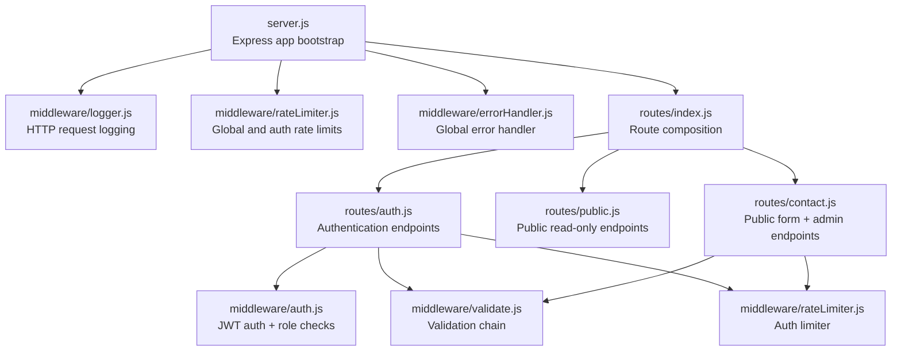
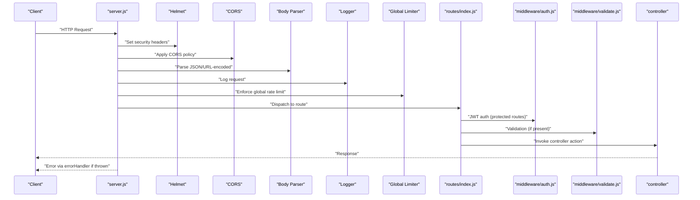
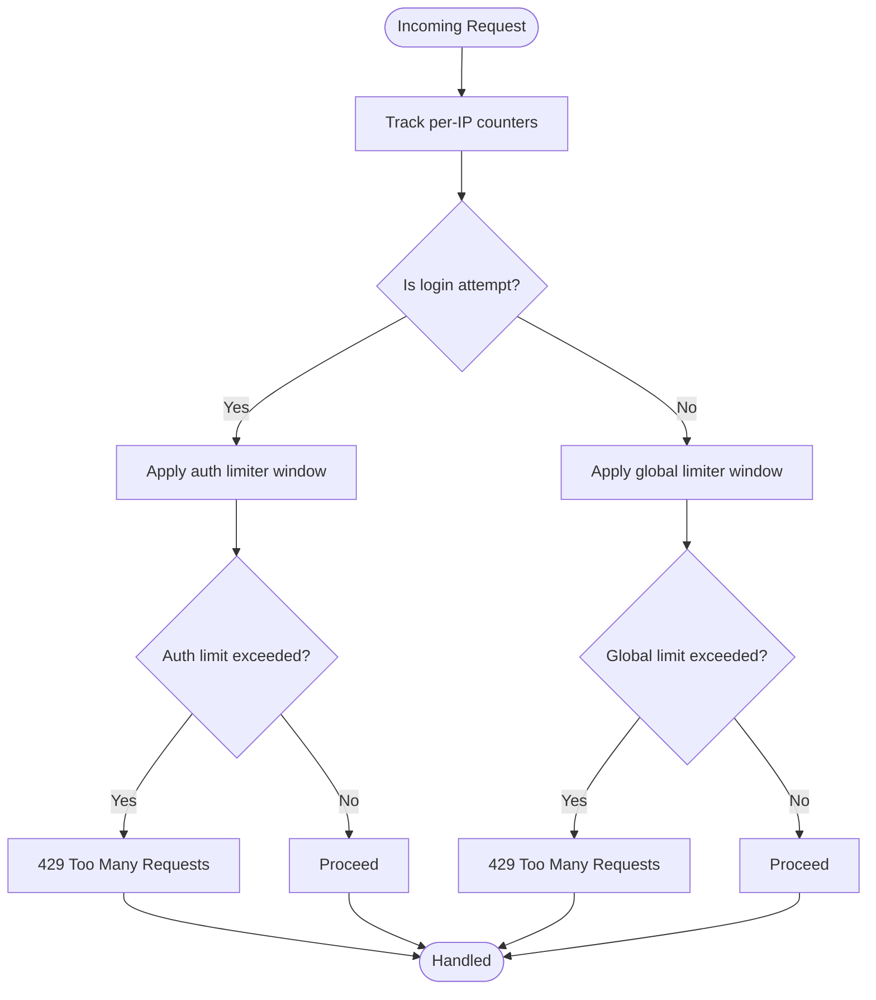
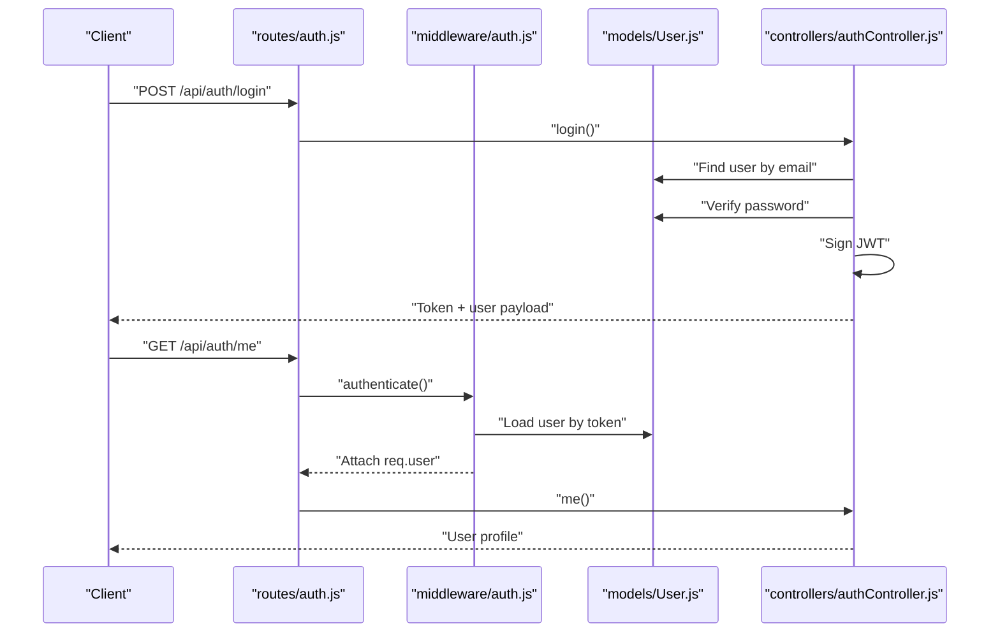
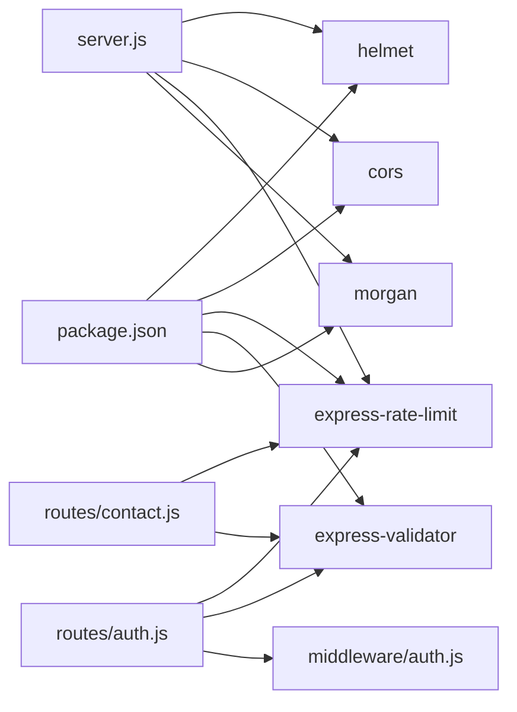

# Security Middleware Stack

<cite>
**Referenced Files in This Document**
- [server.js](file://rsf-backend/server.js)
- [package.json](file://rsf-backend/package.json)
- [middleware/auth.js](file://rsf-backend/middleware/auth.js)
- [middleware/rateLimiter.js](file://rsf-backend/middleware/rateLimiter.js)
- [middleware/validate.js](file://rsf-backend/middleware/validate.js)
- [middleware/errorHandler.js](file://rsf-backend/middleware/errorHandler.js)
- [middleware/logger.js](file://rsf-backend/middleware/logger.js)
- [routes/index.js](file://rsf-backend/routes/index.js)
- [routes/auth.js](file://rsf-backend/routes/auth.js)
- [routes/public.js](file://rsf-backend/routes/public.js)
- [routes/contact.js](file://rsf-backend/routes/contact.js)
- [controllers/authController.js](file://rsf-backend/controllers/authController.js)
- [controllers/contactController.js](file://rsf-backend/controllers/contactController.js)
- [models/User.js](file://rsf-backend/models/User.js)
</cite>

## Table of Contents
1. [Introduction](#introduction)
2. [Project Structure](#project-structure)
3. [Core Components](#core-components)
4. [Architecture Overview](#architecture-overview)
5. [Detailed Component Analysis](#detailed-component-analysis)
6. [Dependency Analysis](#dependency-analysis)
7. [Performance Considerations](#performance-considerations)
8. [Troubleshooting Guide](#troubleshooting-guide)
9. [Conclusion](#conclusion)
10. [Appendices](#appendices)

## Introduction
This document describes the security middleware stack for the Réseau Solidarité France backend API. It covers the middleware pipeline order, security headers via Helmet, CORS configuration, rate limiting, input validation, authentication and authorization, error handling, logging, and operational best practices. It also outlines testing strategies, security scanning integration, and compliance considerations for non-profit deployments.

## Project Structure
The backend is an Express.js application with a modular middleware and routing architecture. Security-related middleware is centralized under the middleware folder and applied globally in server.js, with route-specific enforcement in the routes folder.

**Diagram sources**
- [server.js:21-28](file://rsf-backend/server.js#L21-L28)
- [routes/index.js:13-26](file://rsf-backend/routes/index.js#L13-L26)
- [routes/auth.js:10-13](file://rsf-backend/routes/auth.js#L10-L13)
- [routes/contact.js:10-14](file://rsf-backend/routes/contact.js#L10-L14)
- [middleware/auth.js:10-33](file://rsf-backend/middleware/auth.js#L10-L33)
- [middleware/validate.js:9-19](file://rsf-backend/middleware/validate.js#L9-L19)
- [middleware/rateLimiter.js:5-18](file://rsf-backend/middleware/rateLimiter.js#L5-L18)
- [middleware/logger.js:25](file://rsf-backend/middleware/logger.js#L25)
- [middleware/errorHandler.js:4-28](file://rsf-backend/middleware/errorHandler.js#L4-L28)

**Section sources**
- [server.js:18-52](file://rsf-backend/server.js#L18-L52)
- [package.json:16-29](file://rsf-backend/package.json#L16-L29)

## Core Components
- Helmet: Applied globally to set secure HTTP headers. Current configuration uses defaults; consider environment-specific CSP and frame options.
- CORS: Enabled globally with default settings; configure origins per environment.
- Rate Limiting: Global limiter for general traffic and a stricter limiter for login attempts.
- Authentication: JWT verification middleware attaches user context; authorization middleware enforces roles.
- Validation: Express-validator integration to enforce input constraints and return structured 422 responses.
- Error Handling: Centralized handler for validation errors, custom errors, and generic 500 responses.
- Logging: Morgan-based colored logging for HTTP method, status, response time, and content length.

**Section sources**
- [server.js:22-27](file://rsf-backend/server.js#L22-L27)
- [middleware/rateLimiter.js:5-18](file://rsf-backend/middleware/rateLimiter.js#L5-L18)
- [middleware/auth.js:10-47](file://rsf-backend/middleware/auth.js#L10-L47)
- [middleware/validate.js:9-19](file://rsf-backend/middleware/validate.js#L9-L19)
- [middleware/errorHandler.js:4-28](file://rsf-backend/middleware/errorHandler.js#L4-L28)
- [middleware/logger.js:14-25](file://rsf-backend/middleware/logger.js#L14-L25)

## Architecture Overview
The middleware pipeline runs in a fixed order during request processing. Authentication and authorization are enforced at the route level after global middleware. Public endpoints apply rate limiting and validation but bypass JWT checks.

**Diagram sources**
- [server.js:21-28](file://rsf-backend/server.js#L21-L28)
- [routes/index.js:13-26](file://rsf-backend/routes/index.js#L13-L26)
- [middleware/auth.js:10-33](file://rsf-backend/middleware/auth.js#L10-L33)
- [middleware/validate.js:9-19](file://rsf-backend/middleware/validate.js#L9-L19)
- [middleware/errorHandler.js:4-28](file://rsf-backend/middleware/errorHandler.js#L4-L28)

## Detailed Component Analysis

### Helmet and Security Headers
- Helmet is included and imported but not currently invoked in server.js. To enable hardened headers, uncomment the Helmet middleware invocation and tune policies per environment.
- Recommended additions include Content-Security-Policy, Referrer-Policy, and frame options aligned with frontend delivery.

**Section sources**
- [server.js:8](file://rsf-backend/server.js#L8)
- [server.js:22](file://rsf-backend/server.js#L22)

### CORS Configuration
- CORS is enabled globally with default settings. Configure allowed origins, credentials, and exposed headers according to deployment (e.g., localhost for dev, specific domain(s) for prod).

**Section sources**
- [server.js:9](file://rsf-backend/server.js#L9)
- [server.js:23](file://rsf-backend/server.js#L23)

### Rate Limiting
- Global limiter: 200 requests per 15 minutes per IP.
- Authentication limiter: 10 failed login attempts per 15 minutes per IP.
- Apply the stricter limiter to sensitive endpoints (e.g., login) and consider endpoint-level customization.

**Diagram sources**
- [middleware/rateLimiter.js:5-18](file://rsf-backend/middleware/rateLimiter.js#L5-L18)

**Section sources**
- [middleware/rateLimiter.js:5-18](file://rsf-backend/middleware/rateLimiter.js#L5-L18)
- [routes/auth.js:10](file://rsf-backend/routes/auth.js#L10)

### Authentication and Authorization
- JWT verification: Extracts Bearer token, verifies signature, loads user, and attaches user context to the request.
- Role-based authorization: Enforces allowed roles after authentication.
- Password hashing: Bcrypt is used in the User model hooks to securely hash passwords on create/update.

**Diagram sources**
- [routes/auth.js:10-13](file://rsf-backend/routes/auth.js#L10-L13)
- [middleware/auth.js:10-33](file://rsf-backend/middleware/auth.js#L10-L33)
- [models/User.js:47-65](file://rsf-backend/models/User.js#L47-L65)
- [controllers/authController.js:7-36](file://rsf-backend/controllers/authController.js#L7-L36)

**Section sources**
- [middleware/auth.js:10-47](file://rsf-backend/middleware/auth.js#L10-L47)
- [models/User.js:47-71](file://rsf-backend/models/User.js#L47-L71)
- [controllers/authController.js:7-36](file://rsf-backend/controllers/authController.js#L7-L36)

### Input Validation and Sanitization
- Validation middleware integrates express-validator to check request bodies and return structured 422 responses with field-level errors.
- Public endpoints (e.g., contact form) apply validation and rate limiting without requiring authentication.

**Section sources**
- [middleware/validate.js:9-19](file://rsf-backend/middleware/validate.js#L9-L19)
- [routes/contact.js:10-14](file://rsf-backend/routes/contact.js#L10-L14)

### Error Handling
- Centralized error handler:
  - Sequelize validation and unique constraint errors return 422 with field-level details.
  - Custom errors with explicit status codes propagate status and message.
  - Generic 500 responses hide internal details in production.

**Section sources**
- [middleware/errorHandler.js:4-35](file://rsf-backend/middleware/errorHandler.js#L4-L35)

### Logging
- Morgan-based logger prints colored logs by HTTP method and status, aiding quick diagnostics in development.

**Section sources**
- [middleware/logger.js:14-25](file://rsf-backend/middleware/logger.js#L14-L25)

### Conditional Middleware Application
- Protected routes: Mounted behind a global authentication middleware that enforces JWT and role checks.
- Public routes: Mounted without authentication; apply rate limiting and validation as appropriate.

**Section sources**
- [routes/index.js:13-26](file://rsf-backend/routes/index.js#L13-L26)
- [routes/public.js:1-201](file://rsf-backend/routes/public.js#L1-L201)
- [routes/contact.js:16-19](file://rsf-backend/routes/contact.js#L16-L19)

## Dependency Analysis
Security middleware dependencies and their roles:

**Diagram sources**
- [package.json:16-29](file://rsf-backend/package.json#L16-L29)
- [server.js:8-9](file://rsf-backend/server.js#L8-L9)
- [routes/auth.js:7](file://rsf-backend/routes/auth.js#L7)
- [routes/contact.js:7](file://rsf-backend/routes/contact.js#L7)

**Section sources**
- [package.json:16-29](file://rsf-backend/package.json#L16-L29)
- [server.js:8-9](file://rsf-backend/server.js#L8-L9)

## Performance Considerations
- Helmet default headers add negligible overhead; enable only what is necessary for your deployment.
- Rate limiter windows and counts are memory-based by default; consider external stores (e.g., Redis) for clustered deployments.
- Validation adds CPU work per request; keep rules concise and avoid expensive checks.
- Logging in production should be tuned to reduce I/O overhead (e.g., sampling or structured logging to external systems).

## Troubleshooting Guide
- Authentication failures:
  - Missing or malformed Bearer token yields 401.
  - Expired or invalid tokens yield 401 with specific messages.
- Authorization failures:
  - Insufficient roles yield 403 with required role information.
- Validation failures:
  - 422 responses include field-level error details.
- Generic errors:
  - 500 responses hide internal details in production; inspect server logs for stack traces.

**Section sources**
- [middleware/auth.js:13-32](file://rsf-backend/middleware/auth.js#L13-L32)
- [middleware/auth.js:40-46](file://rsf-backend/middleware/auth.js#L40-L46)
- [middleware/validate.js:11-17](file://rsf-backend/middleware/validate.js#L11-L17)
- [middleware/errorHandler.js:22-27](file://rsf-backend/middleware/errorHandler.js#L22-L27)

## Conclusion
The backend implements a robust security foundation with Helmet, CORS, rate limiting, JWT authentication, role-based authorization, input validation, and centralized error handling. To strengthen security posture, enable Helmet with tailored policies, configure CORS per environment, integrate CSP, and consider advanced protections such as CSRF mitigation and input sanitization libraries. Adopt continuous security scanning and compliance audits aligned with non-profit data protection requirements.

## Appendices

### Security Best Practices for Express.js Applications
- Header hardening: Enable Helmet and customize headers (e.g., CSP, X-Content-Type-Options, X-Frame-Options).
- Content Security Policy: Define allowed sources for scripts, styles, and embedded resources.
- CSRF protection: Add CSRF tokens for state-changing forms and validate on the server.
- Injection prevention: Use parameterized queries, sanitize inputs, and restrict exposed fields.
- Request sanitization: Normalize and trim inputs; reject oversized payloads.
- Secrets management: Store JWT secret and database credentials in environment variables.
- Transport security: Enforce HTTPS in production and secure cookie flags if using session cookies.

### Configuration Examples by Environment
- Development:
  - Helmet: Defaults acceptable for local testing.
  - CORS: Allow localhost origins.
  - Rate limits: Moderate thresholds for developer convenience.
- Staging:
  - Helmet: Enable CSP and stricter frame options.
  - CORS: Allow staging domain(s).
  - Rate limits: Tighten thresholds closer to production.
- Production:
  - Helmet: Minimal, strict headers; tailor CSP to CDN and analytics providers.
  - CORS: Explicit allow-list of frontend domains.
  - Rate limits: Aggressive limits with observability.

### Security Scanning Integration
- Static analysis: Integrate ESLint with security plugins and npm audit.
- Dependency scanning: Use Snyk or GitHub Dependabot to monitor vulnerabilities.
- Runtime scanning: Add WAF and APM tools for real-time threat detection.
- Compliance: Align headers and data handling with GDPR requirements for non-profits.

### Middleware Testing Strategies
- Unit tests for validation middleware to assert 422 responses with expected fields.
- Integration tests for protected routes to assert 401/403 responses without/with invalid tokens.
- Load tests to validate rate limiter behavior under burst traffic.
- Penetration testing: Validate CSRF, XSS, and injection defenses in staging.

### Security Audit Procedures
- Monthly vulnerability scans of dependencies.
- Quarterly header and CSP reviews.
- Annual penetration test for critical endpoints.
- Access reviews for JWT secrets and admin accounts.