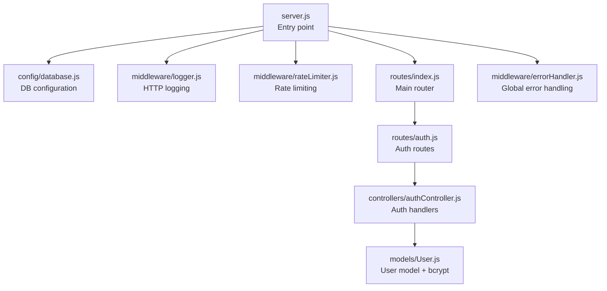
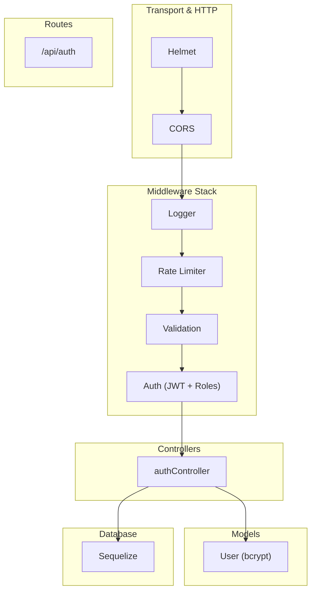
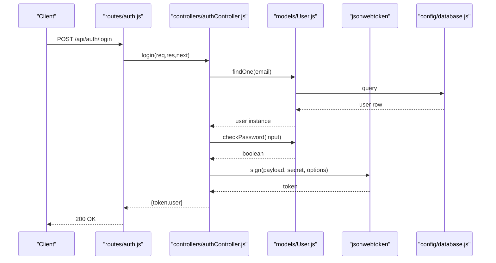
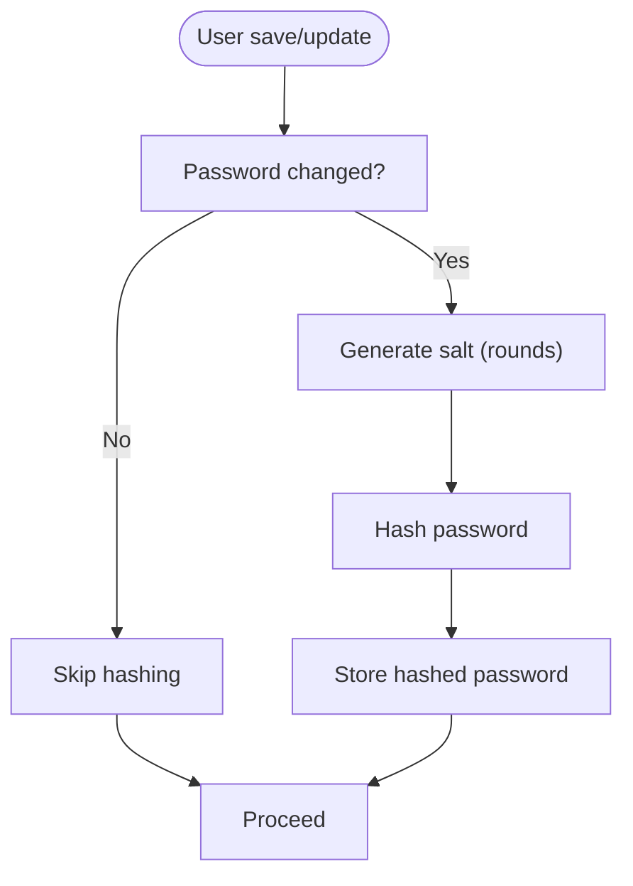
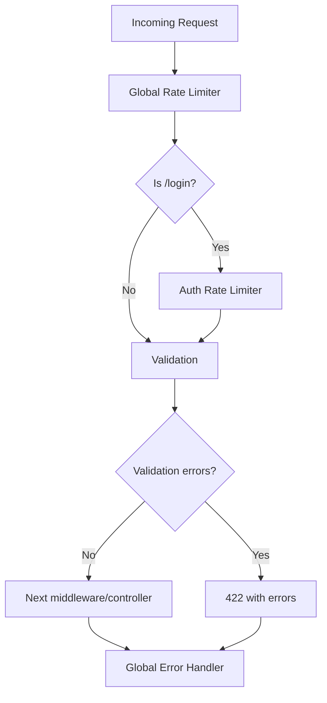
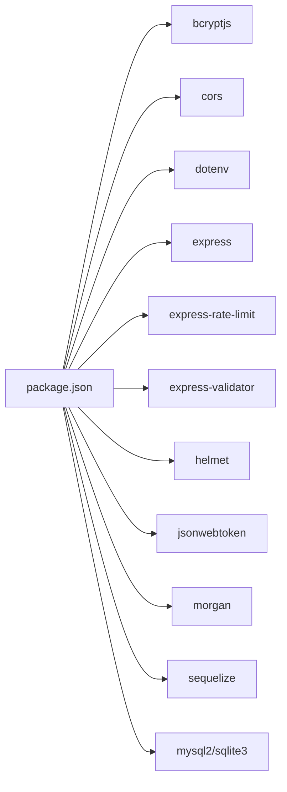

# Security and Configuration

<cite>
**Referenced Files in This Document**
- [server.js](file://rsf-backend/server.js)
- [package.json](file://rsf-backend/package.json)
- [README.md](file://rsf-backend/README.md)
- [config/database.js](file://rsf-backend/config/database.js)
- [middleware/auth.js](file://rsf-backend/middleware/auth.js)
- [middleware/rateLimiter.js](file://rsf-backend/middleware/rateLimiter.js)
- [middleware/validate.js](file://rsf-backend/middleware/validate.js)
- [middleware/errorHandler.js](file://rsf-backend/middleware/errorHandler.js)
- [middleware/logger.js](file://rsf-backend/middleware/logger.js)
- [controllers/authController.js](file://rsf-backend/controllers/authController.js)
- [models/User.js](file://rsf-backend/models/User.js)
- [routes/auth.js](file://rsf-backend/routes/auth.js)
- [routes/index.js](file://rsf-backend/routes/index.js)
- [scripts/checkDatabase.js](file://rsf-backend/scripts/checkDatabase.js)
</cite>

## Table of Contents
1. [Introduction](#introduction)
2. [Project Structure](#project-structure)
3. [Core Components](#core-components)
4. [Architecture Overview](#architecture-overview)
5. [Detailed Component Analysis](#detailed-component-analysis)
6. [Dependency Analysis](#dependency-analysis)
7. [Performance Considerations](#performance-considerations)
8. [Troubleshooting Guide](#troubleshooting-guide)
9. [Conclusion](#conclusion)
10. [Appendices](#appendices)

## Introduction
This document provides comprehensive security and configuration guidance for the Réseau Solidarité France platform backend. It explains the security architecture, middleware stack, authentication and authorization mechanisms, environment management, and operational best practices. It also covers database access, file upload handling, monitoring, and compliance considerations.

## Project Structure
The backend follows a layered architecture:
- Entry point initializes environment, middleware, static assets, routes, health endpoint, and error handling.
- Configuration loads environment variables and sets up the database connection.
- Authentication middleware verifies JWT tokens and enforces roles.
- Controllers implement business logic for authentication and protected resources.
- Routes define public and protected endpoints and apply validation and rate limits.
- Scripts manage database initialization and maintenance.

**Diagram sources**
- [server.js:1-84](file://rsf-backend/server.js#L1-L84)
- [config/database.js:1-69](file://rsf-backend/config/database.js#L1-L69)
- [middleware/logger.js:1-28](file://rsf-backend/middleware/logger.js#L1-L28)
- [middleware/rateLimiter.js:1-21](file://rsf-backend/middleware/rateLimiter.js#L1-L21)
- [routes/index.js:1-28](file://rsf-backend/routes/index.js#L1-L28)
- [routes/auth.js:1-25](file://rsf-backend/routes/auth.js#L1-L25)
- [controllers/authController.js:1-60](file://rsf-backend/controllers/authController.js#L1-L60)
- [models/User.js:1-75](file://rsf-backend/models/User.js#L1-L75)
- [middleware/errorHandler.js:1-38](file://rsf-backend/middleware/errorHandler.js#L1-L38)

**Section sources**
- [server.js:1-84](file://rsf-backend/server.js#L1-L84)
- [README.md:1-206](file://rsf-backend/README.md#L1-L206)

## Core Components
- JWT authentication with role-based access control
- Password hashing with bcrypt
- Input validation using express-validator
- Global and login-specific rate limiting
- Centralized error handling and structured logging
- Database configuration supporting SQLite, MySQL, and PostgreSQL
- Health endpoint and static image serving

**Section sources**
- [middleware/auth.js:1-50](file://rsf-backend/middleware/auth.js#L1-L50)
- [models/User.js:1-75](file://rsf-backend/models/User.js#L1-L75)
- [middleware/validate.js:1-22](file://rsf-backend/middleware/validate.js#L1-L22)
- [middleware/rateLimiter.js:1-21](file://rsf-backend/middleware/rateLimiter.js#L1-L21)
- [middleware/errorHandler.js:1-38](file://rsf-backend/middleware/errorHandler.js#L1-L38)
- [middleware/logger.js:1-28](file://rsf-backend/middleware/logger.js#L1-L28)
- [config/database.js:1-69](file://rsf-backend/config/database.js#L1-L69)
- [server.js:35-44](file://rsf-backend/server.js#L35-L44)

## Architecture Overview
The backend applies a layered security strategy:
- Transport and HTTP hardening via Helmet and CORS
- Request parsing with size limits
- Centralized logging and rate limiting
- Authentication middleware validating JWT and enforcing roles
- Input validation before controller execution
- Structured error handling returning consistent responses
- Database abstraction via Sequelize with environment-driven dialects

**Diagram sources**
- [server.js:22-27](file://rsf-backend/server.js#L22-L27)
- [middleware/logger.js:1-28](file://rsf-backend/middleware/logger.js#L1-L28)
- [middleware/rateLimiter.js:1-21](file://rsf-backend/middleware/rateLimiter.js#L1-L21)
- [middleware/validate.js:1-22](file://rsf-backend/middleware/validate.js#L1-L22)
- [middleware/auth.js:1-50](file://rsf-backend/middleware/auth.js#L1-L50)
- [controllers/authController.js:1-60](file://rsf-backend/controllers/authController.js#L1-L60)
- [models/User.js:1-75](file://rsf-backend/models/User.js#L1-L75)
- [routes/auth.js:1-25](file://rsf-backend/routes/auth.js#L1-L25)
- [config/database.js:1-69](file://rsf-backend/config/database.js#L1-L69)

## Detailed Component Analysis

### JWT Authentication and Role-Based Access Control
- Token verification validates signature and decodes payload.
- Active user enforcement ensures disabled accounts cannot authenticate.
- Role-based authorization restricts access to administrative endpoints.
- Protected routes are mounted after global authentication middleware.

**Diagram sources**
- [routes/auth.js:9-13](file://rsf-backend/routes/auth.js#L9-L13)
- [controllers/authController.js:6-36](file://rsf-backend/controllers/authController.js#L6-L36)
- [models/User.js:62-65](file://rsf-backend/models/User.js#L62-L65)
- [config/database.js:1-69](file://rsf-backend/config/database.js#L1-L69)

**Section sources**
- [middleware/auth.js:10-33](file://rsf-backend/middleware/auth.js#L10-L33)
- [middleware/auth.js:39-47](file://rsf-backend/middleware/auth.js#L39-L47)
- [routes/index.js:13-26](file://rsf-backend/routes/index.js#L13-L26)
- [controllers/authController.js:6-36](file://rsf-backend/controllers/authController.js#L6-L36)
- [models/User.js:27-30](file://rsf-backend/models/User.js#L27-L30)

### Password Hashing with bcrypt
- Passwords are hashed with bcrypt before creation and update hooks.
- A dedicated instance method compares plaintext with stored hash.
- Safe serialization excludes sensitive fields from JSON responses.

**Diagram sources**
- [models/User.js:47-65](file://rsf-backend/models/User.js#L47-L65)

**Section sources**
- [models/User.js:47-65](file://rsf-backend/models/User.js#L47-L65)
- [controllers/authController.js:44-57](file://rsf-backend/controllers/authController.js#L44-L57)

### Middleware Stack: Rate Limiting, Validation, Error Handling, Logging
- Global rate limiter protects against excessive requests.
- Strict limiter on login prevents brute-force attempts.
- Validation middleware checks express-validator rules and returns structured errors.
- Logger prints colored HTTP logs with method and status coloring.
- Global error handler responds consistently and logs stack traces.

**Diagram sources**
- [middleware/rateLimiter.js:4-18](file://rsf-backend/middleware/rateLimiter.js#L4-L18)
- [middleware/validate.js:9-19](file://rsf-backend/middleware/validate.js#L9-L19)
- [middleware/errorHandler.js:4-28](file://rsf-backend/middleware/errorHandler.js#L4-L28)
- [routes/auth.js:10-13](file://rsf-backend/routes/auth.js#L10-L13)

**Section sources**
- [middleware/rateLimiter.js:1-21](file://rsf-backend/middleware/rateLimiter.js#L1-L21)
- [middleware/validate.js:1-22](file://rsf-backend/middleware/validate.js#L1-L22)
- [middleware/logger.js:1-28](file://rsf-backend/middleware/logger.js#L1-L28)
- [middleware/errorHandler.js:1-38](file://rsf-backend/middleware/errorHandler.js#L1-L38)

### CORS, Helmet, and Security Headers
- Helmet is imported but currently commented out; enabling it adds robust HTTP security headers.
- CORS is enabled globally; configure origins in production deployments.
- Consider environment-specific header policies and origin allowlists.

**Section sources**
- [server.js:22-23](file://rsf-backend/server.js#L22-L23)
- [README.md:198-206](file://rsf-backend/README.md#L198-L206)

### Environment Variable Management and Secret Handling
- Environment variables are loaded at startup and used for database dialect and credentials.
- JWT secret and expiration are read from environment variables.
- Admin defaults are created using environment variables when the users table is empty.
- Use a dedicated secrets manager or environment injection in production.

**Section sources**
- [server.js:6](file://rsf-backend/server.js#L6)
- [config/database.js:7-66](file://rsf-backend/config/database.js#L7-L66)
- [controllers/authController.js:22-26](file://rsf-backend/controllers/authController.js#L22-L26)
- [scripts/checkDatabase.js:210-232](file://rsf-backend/scripts/checkDatabase.js#L210-L232)

### Database Access and Schema Management
- Supports SQLite, MySQL, and PostgreSQL with environment-driven configuration.
- Automatic schema checks and column additions are handled by a dedicated script.
- Default admin account creation occurs when no users exist.

**Section sources**
- [config/database.js:9-66](file://rsf-backend/config/database.js#L9-L66)
- [scripts/checkDatabase.js:55-381](file://rsf-backend/scripts/checkDatabase.js#L55-L381)

### File Upload Handling
- Static image serving is configured under a dedicated route.
- No explicit upload middleware is present; ensure any future uploads use validated, bounded, and sanitized processing.

**Section sources**
- [server.js:29-30](file://rsf-backend/server.js#L29-L30)

## Dependency Analysis
External libraries and their roles:
- bcryptjs: Password hashing
- cors: Cross-origin resource sharing
- dotenv: Environment variable loading
- express: Web framework
- express-rate-limit: Request throttling
- express-validator: Input validation rules
- helmet: HTTP security headers
- jsonwebtoken: JWT signing and verification
- morgan: HTTP logging
- mysql2 / sqlite3 / sequelize: Database connectivity and ORM

**Diagram sources**
- [package.json:16-28](file://rsf-backend/package.json#L16-L28)

**Section sources**
- [package.json:16-28](file://rsf-backend/package.json#L16-L28)

## Performance Considerations
- Adjust rate limiter windows and thresholds based on traffic patterns.
- Tune bcrypt cost (currently 12) according to hardware capacity and security needs.
- Use database connection pooling parameters appropriate for workload.
- Enable Helmet and configure CORS properly to avoid unnecessary overhead.

## Troubleshooting Guide
- Authentication failures: Verify JWT secret, token expiration, and user activation status.
- Validation errors: Review express-validator messages returned by the validation middleware.
- Database connectivity: Confirm dialect, host, port, and credentials; use the schema check script to diagnose missing tables or columns.
- Logging: Inspect colored Morgan logs for method, URL, status, and response time.
- Error responses: Global error handler returns structured messages; production should avoid exposing internal stack traces.

**Section sources**
- [middleware/auth.js:10-33](file://rsf-backend/middleware/auth.js#L10-L33)
- [middleware/validate.js:9-19](file://rsf-backend/middleware/validate.js#L9-L19)
- [middleware/errorHandler.js:4-28](file://rsf-backend/middleware/errorHandler.js#L4-L28)
- [middleware/logger.js:14-25](file://rsf-backend/middleware/logger.js#L14-L25)
- [config/database.js:37-66](file://rsf-backend/config/database.js#L37-L66)

## Conclusion
The backend implements a pragmatic and effective security baseline: JWT authentication with role checks, bcrypt-based password hashing, input validation, rate limiting, centralized logging, and robust error handling. To strengthen security further, enable Helmet, configure CORS per environment, rotate secrets regularly, and adopt a secrets management solution. Monitor logs and metrics to detect anomalies and maintain compliance with applicable standards.

## Appendices

### API Endpoints and Security Notes
- Public endpoints operate without authentication.
- Admin endpoints require a valid JWT issued to an active user with appropriate role.
- Login endpoint is rate-limited separately to mitigate brute-force attacks.
- Change password endpoint requires authentication and validates new password length.

**Section sources**
- [routes/index.js:6-26](file://rsf-backend/routes/index.js#L6-L26)
- [routes/auth.js:9-22](file://rsf-backend/routes/auth.js#L9-L22)
- [controllers/authController.js:6-36](file://rsf-backend/controllers/authController.js#L6-L36)

### Health Endpoint
- Provides service status, version, timestamp, and database dialect information.

**Section sources**
- [server.js:35-44](file://rsf-backend/server.js#L35-L44)

### Secure Deployment Checklist
- Set NODE_ENV to production.
- Configure CORS origins and enable Helmet.
- Rotate JWT_SECRET and set appropriate JWT_EXPIRES_IN.
- Use strong database credentials and network-level protections.
- Back up database regularly and monitor schema changes.
- Enforce least privilege for database users.
- Review and audit logs periodically.