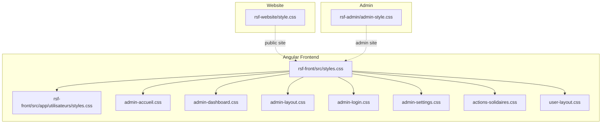
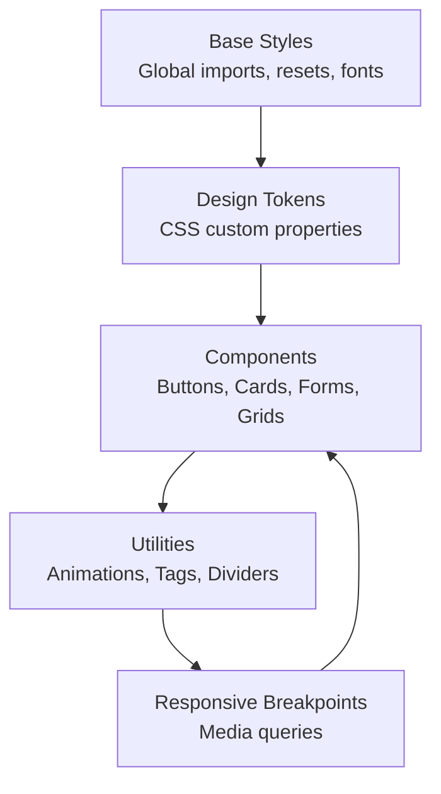
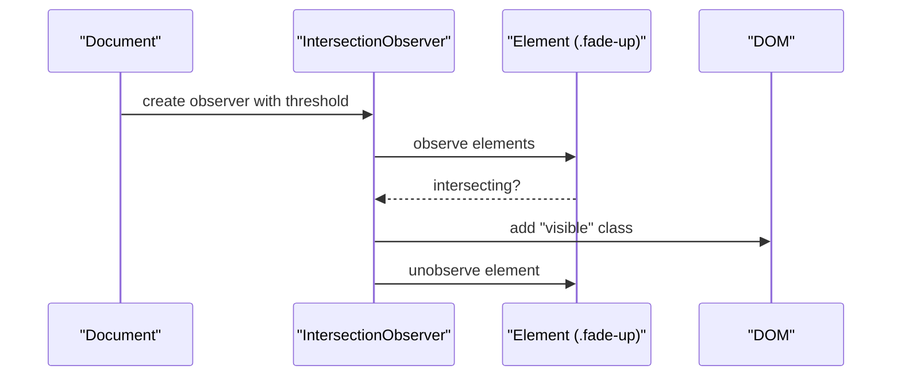
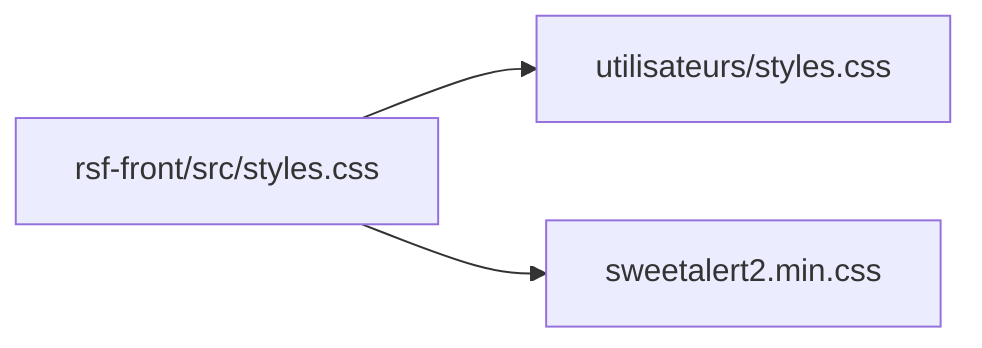

# CSS Styling and Design System

<cite>
**Referenced Files in This Document**
- [style.css](file://rsf-website/style.css)
- [admin-style.css](file://rsf-admin/rsf-admin/admin-style.css)
- [styles.css](file://rsf-front/src/styles.css)
- [utilisateurs/styles.css](file://rsf-front/src/app/utilisateurs/styles.css)
- [admin-accueil.css](file://rsf-front/src/app/admin/admin-accueil/admin-accueil.css)
- [admin-dashboard.css](file://rsf-front/src/app/admin/admin-dashboard/admin-dashboard.css)
- [admin-layout.css](file://rsf-front/src/app/admin/admin-layout/admin-layout.css)
- [admin-login.css](file://rsf-front/src/app/admin/admin-login/admin-login.css)
- [admin-settings.css](file://rsf-front/src/app/admin/admin-settings/admin-settings.css)
- [actions-solidaires.css](file://rsf-front/src/app/utilisateurs/actions-solidaires/actions-solidaires.css)
- [user-layout.css](file://rsf-front/src/app/utilisateurs/user-layout/user-layout.css)
- [actualites.ts](file://rsf-front/src/app/utilisateurs/actualites/actualites.ts)
- [nos-missions.ts](file://rsf-front/src/app/utilisateurs/nos-missions/nos-missions.ts)
</cite>

## Table of Contents
1. [Introduction](#introduction)
2. [Project Structure](#project-structure)
3. [Core Components](#core-components)
4. [Architecture Overview](#architecture-overview)
5. [Detailed Component Analysis](#detailed-component-analysis)
6. [Dependency Analysis](#dependency-analysis)
7. [Performance Considerations](#performance-considerations)
8. [Troubleshooting Guide](#troubleshooting-guide)
9. [Conclusion](#conclusion)
10. [Appendices](#appendices)

## Introduction
This document describes the CSS styling system and design architecture across the website, admin, and front-end Angular applications. It covers the custom properties system, typography, spacing, shadows, responsive design with CSS Grid and Flexbox, component-based styling patterns, animation and interaction systems, and guidelines for maintaining consistency and extending the design system. Browser compatibility and performance optimization strategies are included.

## Project Structure
The styling system is split across three primary areas:
- Website styles for public-facing pages
- Admin styles for internal management interfaces
- Front-end Angular styles for user-facing SPA pages and admin shells

Key characteristics:
- Centralized design tokens via CSS custom properties (:root)
- Component-specific stylesheets for modularity
- Shared base styles imported globally
- Responsive breakpoints tailored to navigation and layout needs

**Diagram sources**
- [style.css:1-309](file://rsf-website/style.css#L1-L309)
- [admin-style.css:1-320](file://rsf-admin/rsf-admin/admin-style.css#L1-L320)
- [styles.css:1-66](file://rsf-front/src/styles.css#L1-L66)
- [utilisateurs/styles.css:1-309](file://rsf-front/src/app/utilisateurs/styles.css#L1-L309)
- [admin-accueil.css:1-318](file://rsf-front/src/app/admin/admin-accueil/admin-accueil.css#L1-L318)
- [admin-dashboard.css:1-120](file://rsf-front/src/app/admin/admin-dashboard/admin-dashboard.css#L1-L120)
- [admin-layout.css:1-417](file://rsf-front/src/app/admin/admin-layout/admin-layout.css#L1-L417)
- [admin-login.css:1-120](file://rsf-front/src/app/admin/admin-login/admin-login.css#L1-L120)
- [admin-settings.css:1-140](file://rsf-front/src/app/admin/admin-settings/admin-settings.css#L1-L140)
- [actions-solidaires.css:1-83](file://rsf-front/src/app/utilisateurs/actions-solidaires/actions-solidaires.css#L1-L83)
- [user-layout.css:1-32](file://rsf-front/src/app/utilisateurs/user-layout/user-layout.css#L1-L32)

**Section sources**
- [styles.css:1-66](file://rsf-front/src/styles.css#L1-L66)
- [utilisateurs/styles.css:1-309](file://rsf-front/src/app/utilisateurs/styles.css#L1-L309)

## Core Components
The design system centers on a set of CSS custom properties that define color palettes, typography, spacing, and elevation. These tokens are consumed consistently across all stylesheets to maintain visual coherence.

- Color system
  - Primary and secondary brand colors with light/dark variants
  - Accent palette for highlights and CTAs
  - Support and danger states for feedback
  - Background and text tokens for light/dark modes
- Typography
  - Playfair Display for headings
  - DM Sans for body and UI text
- Spacing and radii
  - Consistent spacing units and corner radii
- Elevation
  - Standard and large shadow tokens for cards and overlays
- Layout tokens
  - Navigation height and sidebar widths

These tokens appear in both website and admin stylesheets, ensuring a unified look-and-feel across products.

**Section sources**
- [style.css:3-24](file://rsf-website/style.css#L3-L24)
- [admin-style.css:3-27](file://rsf-admin/rsf-admin/admin-style.css#L3-L27)
- [utilisateurs/styles.css:3-24](file://rsf-front/src/app/utilisateurs/styles.css#L3-L24)
- [admin-layout.css:4-35](file://rsf-front/src/app/admin/admin-layout/admin-layout.css#L4-L35)

## Architecture Overview
The styling architecture follows a layered approach:
- Global base styles and imports
- Component-level stylesheets
- Utility and layout helpers
- Responsive adaptations

[No sources needed since this diagram shows conceptual workflow, not actual code structure]

## Detailed Component Analysis

### Custom Properties System
The design system defines a comprehensive set of tokens for colors, typography, spacing, and elevation. These tokens are declared in :root and consumed via var().

- Website tokens
  - Colors: primary, secondary, accent, support, white, bg-light, bg-dark, text-dark, text-mid, text-light
  - Layout: radius, radius-sm, shadow, shadow-lg, nav-h
- Admin tokens
  - Colors: primary, secondary, accent, support, danger, warning, white, bg, bg-dark, sidebar-bg, sidebar-w, topbar-h, border, text, text-mid, text-light
  - Layout: radius, radius-sm, shadow, shadow-md

Usage patterns:
- Color tokens are applied to backgrounds, borders, text, and gradients
- Layout tokens define border-radius, spacing, and elevation
- Typography tokens set font families and weights

**Section sources**
- [style.css:3-24](file://rsf-website/style.css#L3-L24)
- [admin-style.css:3-27](file://rsf-admin/rsf-admin/admin-style.css#L3-L27)
- [utilisateurs/styles.css:3-24](file://rsf-front/src/app/utilisateurs/styles.css#L3-L24)
- [admin-layout.css:4-35](file://rsf-front/src/app/admin/admin-layout/admin-layout.css#L4-L35)

### Typography Scale
Typography is anchored to two font families:
- Playfair Display for headings (h1–h3)
- DM Sans for body copy and interface text

Consistent typographic treatment appears across:
- Website header and page labels
- Admin layout branding and navigation
- User-facing page headers and content

**Section sources**
- [style.css:37-40](file://rsf-website/style.css#L37-L40)
- [utilisateurs/styles.css:37-40](file://rsf-front/src/app/utilisateurs/styles.css#L37-L40)
- [admin-layout.css:1-1](file://rsf-front/src/app/admin/admin-layout/admin-layout.css#L1-L1)

### Spacing Units and Grid System
Spacing units and grid utilities enable flexible, consistent layouts:
- Container and section padding tokens
- Grid helpers for 2, 3, 4, auto-fill columns
- Responsive adjustments for smaller screens

Examples:
- Website uses grid-2, grid-3, grid-4, grid-auto, grid-auto-lg
- Admin uses form-grid, form-grid-2, form-grid-3 for forms
- Dashboard uses grid utilities for quick cards and maps

**Section sources**
- [style.css:164-165](file://rsf-website/style.css#L164-L165)
- [style.css:241-245](file://rsf-website/style.css#L241-L245)
- [admin-style.css:154-156](file://rsf-admin/rsf-admin/admin-style.css#L154-L156)
- [admin-dashboard.css:3-44](file://rsf-front/src/app/admin/admin-dashboard/admin-dashboard.css#L3-L44)

### Shadow and Elevation
Standardized shadow tokens provide depth cues:
- Website: shadow and shadow-lg for cards and hover states
- Admin: shadow and shadow-md for panels and hover states
- Admin layout: subtle header shadow and overlay shadows

**Section sources**
- [style.css:21-22](file://rsf-website/style.css#L21-L22)
- [admin-style.css:25-26](file://rsf-admin/rsf-admin/admin-style.css#L25-L26)
- [admin-layout.css:16-20](file://rsf-front/src/app/admin/admin-layout/admin-layout.css#L16-L20)

### Navigation and Layout Patterns
Navigation and layout follow consistent patterns:
- Fixed header with backdrop blur and dynamic shadow on scroll
- Branding with gradient logo and typography
- Dropdown menus with transitions and hover states
- Mobile hamburger menu and mobile navigation overlay
- Scroll-to-top affordance with show/hide behavior

Responsive adaptations:
- Desktop: expanded navigation links
- Tablet: hamburger menu activation
- Mobile: single-column grids and simplified footers

**Section sources**
- [style.css:42-52](file://rsf-website/style.css#L42-L52)
- [style.css:117-133](file://rsf-website/style.css#L117-L133)
- [style.css:293-308](file://rsf-website/style.css#L293-L308)
- [utilisateurs/styles.css:42-52](file://rsf-front/src/app/utilisateurs/styles.css#L42-L52)
- [utilisateurs/styles.css:117-133](file://rsf-front/src/app/utilisateurs/styles.css#L117-L133)
- [utilisateurs/styles.css:293-308](file://rsf-front/src/app/utilisateurs/styles.css#L293-L308)

### Component-Based Styling
Reusable component classes promote consistency:
- Buttons: primary, outline, accent, support, secondary, sizes
- Cards: light and dark variants with hover elevation
- Forms: groups, labels, inputs, selects, textareas, submit buttons
- Icon boxes: standardized sizing and alignment
- Badges/tags: labeled chips with color variants
- Panels: headers, bodies, and action areas
- Alerts: contextual variants with left borders
- Tabs: active and hover states
- Stats cards: dashboard KPI presentation

**Section sources**
- [style.css:182-197](file://rsf-website/style.css#L182-L197)
- [style.css:199-210](file://rsf-website/style.css#L199-L210)
- [style.css:211-232](file://rsf-website/style.css#L211-L232)
- [style.css:234-238](file://rsf-website/style.css#L234-L238)
- [style.css:286-287](file://rsf-website/style.css#L286-L287)
- [admin-style.css:136-151](file://rsf-admin/rsf-admin/admin-style.css#L136-L151)
- [admin-style.css:236-242](file://rsf-admin/rsf-admin/admin-style.css#L236-L242)
- [admin-style.css:244-260](file://rsf-admin/rsf-admin/admin-style.css#L244-L260)
- [admin-style.css:261-266](file://rsf-admin/rsf-admin/admin-style.css#L261-L266)
- [admin-style.css:267-275](file://rsf-admin/rsf-admin/admin-style.css#L267-L275)

### Animation and Interactive States
Animation system includes:
- Fade-in up effect for content sections using IntersectionObserver
- Hover states for buttons, cards, and navigation items
- Smooth transitions for transforms, opacity, and shadows
- Toast notifications with slide-up animation
- Scroll-to-top button with visibility toggle

**Diagram sources**
- [actualites.ts:54-75](file://rsf-front/src/app/utilisateurs/actualites/actualites.ts#L54-L75)
- [nos-missions.ts:41-62](file://rsf-front/src/app/utilisateurs/nos-missions/nos-missions.ts#L41-L62)
- [style.css:247-249](file://rsf-website/style.css#L247-L249)
- [utilisateurs/styles.css:247-249](file://rsf-front/src/app/utilisateurs/styles.css#L247-L249)

**Section sources**
- [style.css:247-249](file://rsf-website/style.css#L247-L249)
- [utilisateurs/styles.css:247-249](file://rsf-front/src/app/utilisateurs/styles.css#L247-L249)
- [admin-style.css:307-315](file://rsf-admin/rsf-admin/admin-style.css#L307-L315)
- [user-layout.css:1-32](file://rsf-front/src/app/utilisateurs/user-layout/user-layout.css#L1-L32)

### Responsive Design Implementation
Responsive patterns leverage:
- Media queries targeting navigation and layout breakpoints
- CSS Grid auto-fill and repeat utilities
- Flexbox for alignment and distribution
- Clamp() for fluid typography and spacing

Breakpoints and adaptations:
- Website: 1100px, 900px, 600px for nav links, grid columns, footer layout
- Admin layout: 860px and 560px for rail overlay and header actions
- Settings: 900px for form grid reversion to single column

**Section sources**
- [style.css:292-308](file://rsf-website/style.css#L292-L308)
- [admin-layout.css:392-416](file://rsf-front/src/app/admin/admin-layout/admin-layout.css#L392-L416)
- [admin-settings.css:134-139](file://rsf-front/src/app/admin/admin-settings/admin-settings.css#L134-L139)

### Admin Shell and Layout
The admin shell uses a distinct token set and layout:
- Dark nav-rail with active indicators and icons
- Sticky header with breadcrumbs and actions
- Overlay for mobile navigation
- Content area with padding and background

**Section sources**
- [admin-layout.css:4-35](file://rsf-front/src/app/admin/admin-layout/admin-layout.css#L4-L35)
- [admin-layout.css:58-196](file://rsf-front/src/app/admin/admin-layout/admin-layout.css#L58-L196)
- [admin-layout.css:264-378](file://rsf-front/src/app/admin/admin-layout/admin-layout.css#L264-L378)
- [admin-layout.css:392-416](file://rsf-front/src/app/admin/admin-layout/admin-layout.css#L392-L416)

### Public Website Pages
Public pages demonstrate:
- Hero headers with gradient backgrounds and badges
- Tag chips and CTA blocks
- Page-specific color accents and typography

**Section sources**
- [actions-solidaires.css:1-83](file://rsf-front/src/app/utilisateurs/actions-solidaires/actions-solidaires.css#L1-L83)
- [style.css:135-161](file://rsf-website/style.css#L135-L161)

## Dependency Analysis
The Angular global stylesheet imports user-facing styles and third-party UI themes. This centralizes shared styles and ensures consistent theming across components.

**Diagram sources**
- [styles.css:1-66](file://rsf-front/src/styles.css#L1-L66)

**Section sources**
- [styles.css:1-66](file://rsf-front/src/styles.css#L1-L66)

## Performance Considerations
Guidelines for maintaining performance and compatibility:
- Prefer CSS custom properties for theming to reduce duplication and improve maintainability
- Use clamp() for fluid typography and spacing to minimize breakpoint-heavy overrides
- Limit heavy animations to essential interactions; keep transition durations reasonable
- Avoid excessive z-index stacking; use logical stacking order
- Minimize deep selector chains; favor utility-first classes for specificity control
- Keep media queries focused and co-located with relevant components
- Use transform and opacity for animations to leverage GPU acceleration
- Import only necessary fonts and limit font variations to reduce render cost
- Consolidate repeated styles into shared components and utilities

[No sources needed since this section provides general guidance]

## Troubleshooting Guide
Common issues and resolutions:
- Missing IntersectionObserver fallback
  - Symptom: fade animations not triggering on older browsers
  - Resolution: ensure fallback adds visible class when IntersectionObserver is unavailable
- Button hover states not applying
  - Symptom: buttons lack hover elevation or color changes
  - Resolution: verify button classes and hover selectors are present and not overridden
- Grid layout collapsing on small screens
  - Symptom: multiple-column grids compress unexpectedly
  - Resolution: confirm media queries override grid templates for smaller viewports
- Admin sidebar not toggling on mobile
  - Symptom: navigation does not open on small screens
  - Resolution: check overlay and open classes for proper state toggling
- Toast notification not appearing
  - Symptom: save feedback does not show
  - Resolution: verify show class and keyframe animation are applied

**Section sources**
- [actualites.ts:57-60](file://rsf-front/src/app/utilisateurs/actualites/actualites.ts#L57-L60)
- [admin-style.css:291-300](file://rsf-admin/rsf-admin/admin-style.css#L291-L300)
- [admin-layout.css:392-408](file://rsf-front/src/app/admin/admin-layout/admin-layout.css#L392-L408)

## Conclusion
The CSS styling system employs a robust, token-driven design approach with consistent component classes, responsive patterns, and animation primitives. By centralizing design tokens and leveraging CSS Grid and Flexbox, the system achieves visual consistency and scalability across the website, admin, and Angular application. Following the provided guidelines will help maintain quality and performance as the system evolves.

## Appendices

### Browser Compatibility Notes
- IntersectionObserver is used for fade animations; a fallback adds visible class when unsupported
- Modern CSS features (custom properties, clamp, grid) are widely supported; verify vendor prefixes if legacy IE support is required
- Flexbox and Grid are broadly supported; test critical layouts on target browsers

**Section sources**
- [actualites.ts:57-60](file://rsf-front/src/app/utilisateurs/actualites/actualites.ts#L57-L60)