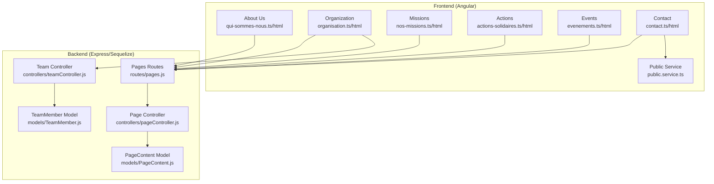
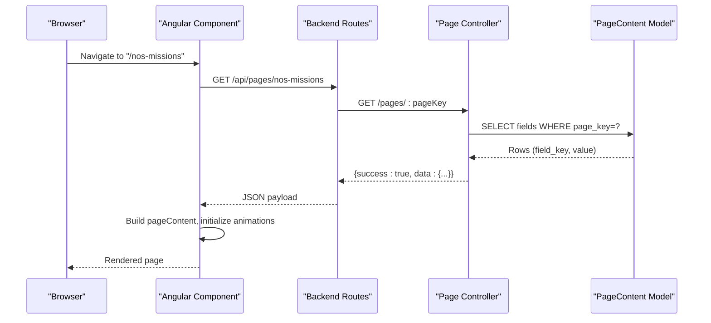
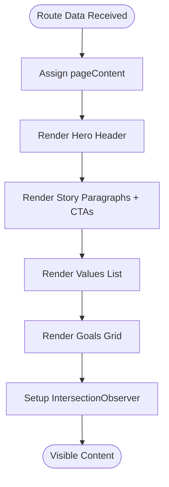
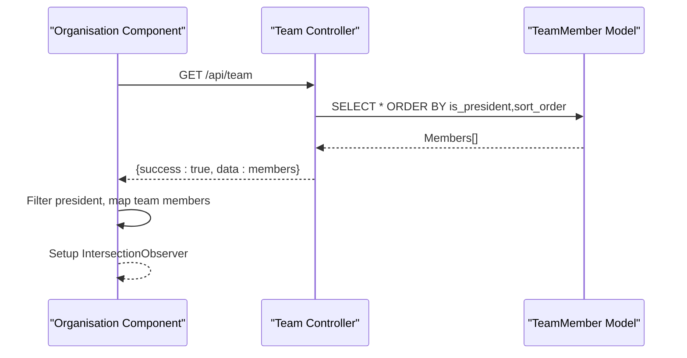
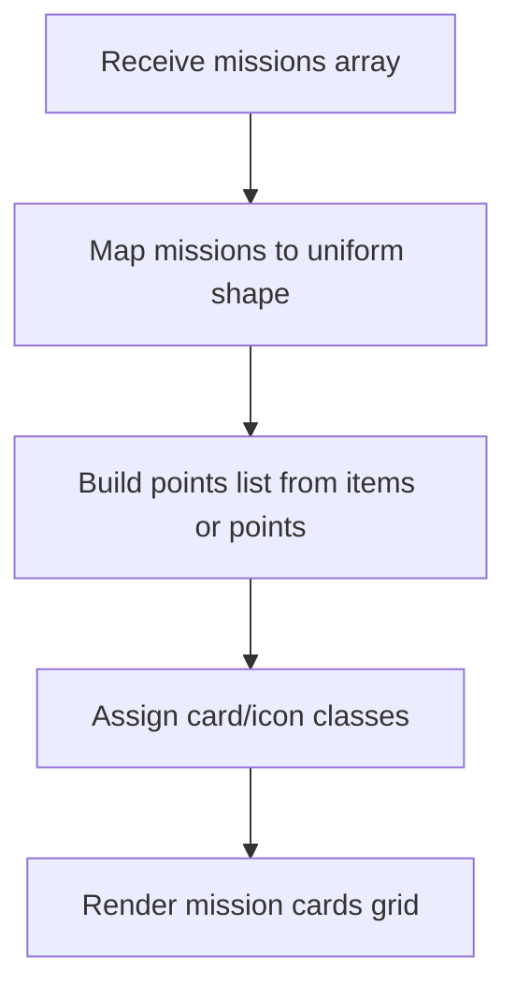
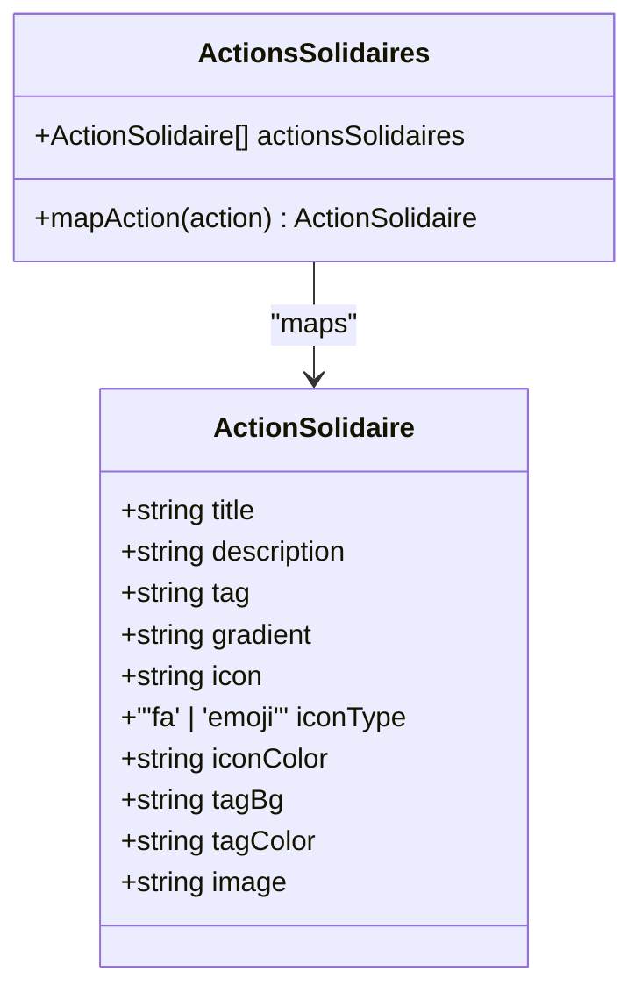
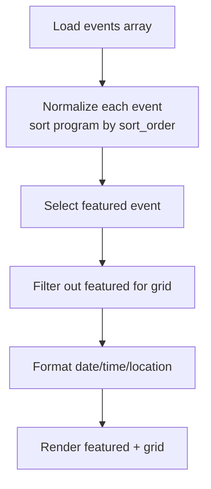
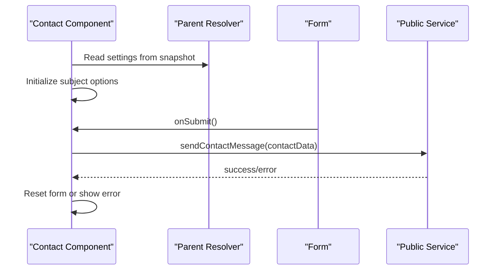
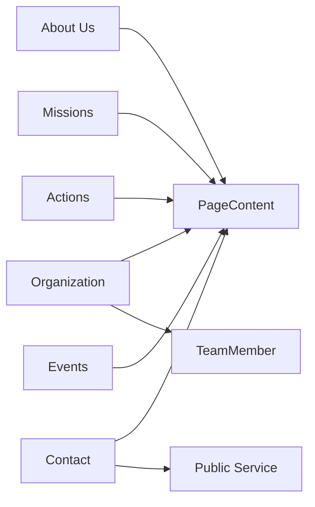

# Content Pages Implementation

<cite>
**Referenced Files in This Document**
- [qui-sommes-nous.html](file://rsf-front/src/app/utilisateurs/qui-sommes-nous/qui-sommes-nous.html)
- [qui-sommes-nous.ts](file://rsf-front/src/app/utilisateurs/qui-sommes-nous/qui-sommes-nous.ts)
- [organisation.html](file://rsf-front/src/app/utilisateurs/organisation/organisation.html)
- [organisation.ts](file://rsf-front/src/app/utilisateurs/organisation/organisation.ts)
- [nos-missions.html](file://rsf-front/src/app/utilisateurs/nos-missions/nos-missions.html)
- [nos-missions.ts](file://rsf-front/src/app/utilisateurs/nos-missions/nos-missions.ts)
- [actions-solidaires.html](file://rsf-front/src/app/utilisateurs/actions-solidaires/actions-solidaires.html)
- [actions-solidaires.ts](file://rsf-front/src/app/utilisateurs/actions-solidaires/actions-solidaires.ts)
- [evenements.html](file://rsf-front/src/app/utilisateurs/evenements/evenements.html)
- [evenements.ts](file://rsf-front/src/app/utilisateurs/evenements/evenements.ts)
- [contact.html](file://rsf-front/src/app/utilisateurs/contact/contact.html)
- [contact.ts](file://rsf-front/src/app/utilisateurs/contact/contact.ts)
- [pageController.js](file://rsf-backend/controllers/pageController.js)
- [PageContent.js](file://rsf-backend/models/PageContent.js)
- [pages.js](file://rsf-backend/routes/pages.js)
- [teamController.js](file://rsf-backend/controllers/teamController.js)
- [TeamMember.js](file://rsf-backend/models/TeamMember.js)
- [public.service.ts](file://rsf-front/src/app/services/public.service.ts)
</cite>

## Table of Contents
1. [Introduction](#introduction)
2. [Project Structure](#project-structure)
3. [Core Components](#core-components)
4. [Architecture Overview](#architecture-overview)
5. [Detailed Component Analysis](#detailed-component-analysis)
6. [Dependency Analysis](#dependency-analysis)
7. [Performance Considerations](#performance-considerations)
8. [Troubleshooting Guide](#troubleshooting-guide)
9. [Conclusion](#conclusion)
10. [Appendices](#appendices)

## Introduction
This document explains how the content-focused pages are implemented across the frontend Angular application and the backend CMS. It covers the consistent layout patterns, typography and information hierarchy, content management via editable page fields, and the integration with the overall site structure. It also documents the implementation patterns for About Us, Organization, Missions, Actions, Events, and Contact pages, including image galleries, team member displays, event listings, and contact forms. Finally, it outlines SEO optimization techniques, update procedures, media asset management, and consistency guidelines.

## Project Structure
The content pages are implemented as standalone Angular components with dedicated templates and TypeScript logic. Each page component subscribes to route data to receive structured content payloads from resolvers. Backend routes expose a generic page content API and specialized endpoints for teams and events. Static HTML pages exist in the legacy website folder but are superseded by the Angular SPA for dynamic content.

**Diagram sources**
- [pages.js:1-10](file://rsf-backend/routes/pages.js#L1-L10)
- [pageController.js:1-185](file://rsf-backend/controllers/pageController.js#L1-L185)
- [PageContent.js:1-49](file://rsf-backend/models/PageContent.js#L1-L49)
- [teamController.js:1-57](file://rsf-backend/controllers/teamController.js#L1-L57)
- [TeamMember.js:1-37](file://rsf-backend/models/TeamMember.js#L1-L37)
- [qui-sommes-nous.ts:1-52](file://rsf-front/src/app/utilisateurs/qui-sommes-nous/qui-sommes-nous.ts#L1-L52)
- [organisation.ts:1-77](file://rsf-front/src/app/utilisateurs/organisation/organisation.ts#L1-L77)
- [nos-missions.ts:1-64](file://rsf-front/src/app/utilisateurs/nos-missions/nos-missions.ts#L1-L64)
- [actions-solidaires.ts:1-90](file://rsf-front/src/app/utilisateurs/actions-solidaires/actions-solidaires.ts#L1-L90)
- [evenements.ts:1-101](file://rsf-front/src/app/utilisateurs/evenements/evenements.ts#L1-L101)
- [contact.ts:1-110](file://rsf-front/src/app/utilisateurs/contact/contact.ts#L1-L110)
- [public.service.ts](file://rsf-front/src/app/services/public.service.ts)

**Section sources**
- [pages.js:1-10](file://rsf-backend/routes/pages.js#L1-L10)
- [pageController.js:47-64](file://rsf-backend/controllers/pageController.js#L47-L64)

## Core Components
- About Us: Presents hero content, story paragraphs, optional CTAs, values list, and goals grid.
- Organization: Displays leadership and team members with photos, bios, and diplomas.
- Missions: Renders mission cards with icons, titles, descriptions, and bullet points.
- Actions: Shows action items with category tags, gradient icons, and optional images.
- Events: Features a highlighted event and a grid of upcoming events with formatted dates/times.
- Contact: Provides contact details and a responsive form integrated with a public service.

Each page follows a consistent header with breadcrumb navigation, a hero section, and modular content blocks. Layouts use CSS Grid and Flexbox for responsive arrangements.

**Section sources**
- [qui-sommes-nous.html:1-67](file://rsf-front/src/app/utilisateurs/qui-sommes-nous/qui-sommes-nous.html#L1-L67)
- [organisation.html:1-60](file://rsf-front/src/app/utilisateurs/organisation/organisation.html#L1-L60)
- [nos-missions.html:1-41](file://rsf-front/src/app/utilisateurs/nos-missions/nos-missions.html#L1-L41)
- [actions-solidaires.html:1-49](file://rsf-front/src/app/utilisateurs/actions-solidaires/actions-solidaires.html#L1-L49)
- [evenements.html:1-57](file://rsf-front/src/app/utilisateurs/evenements/evenements.html#L1-L57)
- [contact.html:1-111](file://rsf-front/src/app/utilisateurs/contact/contact.html#L1-L111)

## Architecture Overview
The frontend components receive structured content via Angular route data. The backend exposes:
- Generic page content retrieval and updates via a key-value store per page.
- Specialized endpoints for teams and events.
- A resolver pattern (not shown here) that fetches page content and related resources before rendering.

**Diagram sources**
- [pages.js:5-7](file://rsf-backend/routes/pages.js#L5-L7)
- [pageController.js:66-104](file://rsf-backend/controllers/pageController.js#L66-L104)
- [PageContent.js:6-45](file://rsf-backend/models/PageContent.js#L6-L45)

## Detailed Component Analysis

### About Us Page
- Layout pattern: Hero header with badge and title, two-column content area (story + values), and a goals section.
- Data model: pageContent.hero, pageContent.story, pageContent.values, pageContent.goals.
- Animation: IntersectionObserver triggers fade-in effects on scroll.
- Typography and hierarchy: Clear semantic headings with labels and subtitles; paragraphs use a description class for consistent spacing.

**Diagram sources**
- [qui-sommes-nous.html:1-67](file://rsf-front/src/app/utilisateurs/qui-sommes-nous/qui-sommes-nous.html#L1-L67)
- [qui-sommes-nous.ts:20-50](file://rsf-front/src/app/utilisateurs/qui-sommes-nous/qui-sommes-nous.ts#L20-L50)

**Section sources**
- [qui-sommes-nous.html:1-67](file://rsf-front/src/app/utilisateurs/qui-sommes-nous/qui-sommes-nous.html#L1-L67)
- [qui-sommes-nous.ts:1-52](file://rsf-front/src/app/utilisateurs/qui-sommes-nous/qui-sommes-nous.ts#L1-L52)

### Organization Page
- Layout pattern: Hero header, leadership profile with photo/bio/diplomas, and a team grid.
- Data model: pageContent.leadership, pageContent.teamSection; resolved team members from team controller.
- Team processing: Filters president, assigns background classes, parses diplomas safely.
- Animation: Fade-up animations triggered by IntersectionObserver.

**Diagram sources**
- [organisation.html:1-60](file://rsf-front/src/app/utilisateurs/organisation/organisation.html#L1-L60)
- [organisation.ts:23-51](file://rsf-front/src/app/utilisateurs/organisation/organisation.ts#L23-L51)
- [teamController.js:5-10](file://rsf-backend/controllers/teamController.js#L5-L10)
- [TeamMember.js:15-31](file://rsf-backend/models/TeamMember.js#L15-L31)

**Section sources**
- [organisation.html:1-60](file://rsf-front/src/app/utilisateurs/organisation/organisation.html#L1-L60)
- [organisation.ts:1-77](file://rsf-front/src/app/utilisateurs/organisation/organisation.ts#L1-L77)
- [teamController.js:1-57](file://rsf-backend/controllers/teamController.js#L1-L57)
- [TeamMember.js:1-37](file://rsf-backend/models/TeamMember.js#L1-L37)

### Missions Page
- Layout pattern: Hero header and a responsive grid of mission cards.
- Data normalization: Converts flat arrays or nested items into a uniform points list; assigns card/icon classes based on color names.
- Typography and hierarchy: Card-based layout with icon boxes, titles, and descriptive lists.

**Diagram sources**
- [nos-missions.html:1-41](file://rsf-front/src/app/utilisateurs/nos-missions/nos-missions.html#L1-L41)
- [nos-missions.ts:22-39](file://rsf-front/src/app/utilisateurs/nos-missions/nos-missions.ts#L22-L39)

**Section sources**
- [nos-missions.html:1-41](file://rsf-front/src/app/utilisateurs/nos-missions/nos-missions.html#L1-L41)
- [nos-missions.ts:1-64](file://rsf-front/src/app/utilisateurs/nos-missions/nos-missions.ts#L1-L64)

### Actions Page
- Layout pattern: Hero header followed by a responsive gallery of actions.
- Data mapping: Normalizes action items to a typed interface supporting FontAwesome icons or emoji, gradients, and tags.
- Image handling: Uses either image URLs or icon placeholders; applies alt attributes from titles.

**Diagram sources**
- [actions-solidaires.ts:5-16](file://rsf-front/src/app/utilisateurs/actions-solidaires/actions-solidaires.ts#L5-L16)
- [actions-solidaires.ts:48-64](file://rsf-front/src/app/utilisateurs/actions-solidaires/actions-solidaires.ts#L48-L64)

**Section sources**
- [actions-solidaires.html:1-49](file://rsf-front/src/app/utilisateurs/actions-solidaires/actions-solidaires.html#L1-L49)
- [actions-solidaires.ts:1-90](file://rsf-front/src/app/utilisateurs/actions-solidaires/actions-solidaires.ts#L1-L90)

### Events Page
- Layout pattern: Hero header, featured event highlight, and a grid of regular events.
- Data normalization: Sorts event programs by sort_order; separates featured event from others.
- Formatting: Formats dates using locale-aware formatting and time ranges.

**Diagram sources**
- [evenements.html:1-57](file://rsf-front/src/app/utilisateurs/evenements/evenements.html#L1-L57)
- [evenements.ts:22-33](file://rsf-front/src/app/utilisateurs/evenements/evenements.ts#L22-L33)
- [evenements.ts:69-76](file://rsf-front/src/app/utilisateurs/evenements/evenements.ts#L69-L76)

**Section sources**
- [evenements.html:1-57](file://rsf-front/src/app/utilisateurs/evenements/evenements.html#L1-L57)
- [evenements.ts:1-101](file://rsf-front/src/app/utilisateurs/evenements/evenements.ts#L1-L101)

### Contact Page
- Layout pattern: Hero header, contact details column, and a styled form in a card.
- Data sources: pageContent for labels and form texts; settings injected from parent resolver snapshot.
- Form submission: Uses Public Service to send messages; handles submit states and resets form on success.

**Diagram sources**
- [contact.html:83-105](file://rsf-front/src/app/utilisateurs/contact/contact.html#L83-L105)
- [contact.ts:32-47](file://rsf-front/src/app/utilisateurs/contact/contact.ts#L32-L47)
- [contact.ts:90-108](file://rsf-front/src/app/utilisateurs/contact/contact.ts#L90-L108)
- [public.service.ts](file://rsf-front/src/app/services/public.service.ts)

**Section sources**
- [contact.html:1-111](file://rsf-front/src/app/utilisateurs/contact/contact.html#L1-L111)
- [contact.ts:1-110](file://rsf-front/src/app/utilisateurs/contact/contact.ts#L1-L110)
- [public.service.ts](file://rsf-front/src/app/services/public.service.ts)

## Dependency Analysis
- Frontend components depend on route data payloads and optional services (e.g., Public Service for contact).
- Backend routes depend on page content storage and specialized models for teams and events.
- The page content controller aggregates stored fields into structured payloads and merges special records (e.g., homepage hero/stats).

**Diagram sources**
- [pageController.js:74-98](file://rsf-backend/controllers/pageController.js#L74-L98)
- [PageContent.js:6-45](file://rsf-backend/models/PageContent.js#L6-L45)
- [teamController.js](file://rsf-backend/controllers/teamController.js#L7)
- [TeamMember.js:4-36](file://rsf-backend/models/TeamMember.js#L4-L36)
- [public.service.ts](file://rsf-front/src/app/services/public.service.ts)

**Section sources**
- [pageController.js:66-104](file://rsf-backend/controllers/pageController.js#L66-L104)
- [PageContent.js:1-49](file://rsf-backend/models/PageContent.js#L1-L49)
- [teamController.js:1-57](file://rsf-backend/controllers/teamController.js#L1-L57)
- [TeamMember.js:1-37](file://rsf-backend/models/TeamMember.js#L1-L37)

## Performance Considerations
- Lazy loading: Components are standalone and imported only when routed; avoid unnecessary initial bundles.
- IntersectionObserver animations: Debounce setup and disconnect observers on destroy to prevent memory leaks.
- Data normalization: Keep transformations minimal and cached where appropriate (e.g., mapped action items).
- Images: Prefer lazy-loading attributes and appropriate sizes; use alt text from titles for accessibility.
- Backend queries: Use indexes on page_key and combined unique index on page_key+field_key for fast lookups.

## Troubleshooting Guide
- Content not appearing: Verify the page key exists in the allowed list and that fields are stored under the correct page_key.
- Team data missing: Ensure team members exist and are ordered properly; check is_president flag and sort_order.
- Form submission errors: Confirm Public Service endpoint availability and CORS configuration; inspect console logs for network errors.
- Dates/times incorrect: Validate event dates and ensure proper localization formatting; check time range parsing.

**Section sources**
- [pageController.js:70-72](file://rsf-backend/controllers/pageController.js#L70-L72)
- [teamController.js:4-10](file://rsf-backend/controllers/teamController.js#L4-L10)
- [contact.ts:90-108](file://rsf-front/src/app/utilisateurs/contact/contact.ts#L90-L108)

## Conclusion
The content pages follow a consistent, modular design with a robust content management system. The frontend components are decoupled from backend specifics through structured route data, while the backend provides a flexible key-value content store and specialized endpoints for teams and events. By adhering to the documented patterns and guidelines, content maintainers can efficiently update and extend pages while preserving visual and functional consistency.

## Appendices

### Content Management Approach
- Static pages vs. dynamic pages: The Angular SPA replaces static HTML for content pages, enabling dynamic content editing and responsive layouts.
- Editable fields: Each page’s content is stored as key-value pairs per page_key, allowing granular editing in the admin interface.
- Integration: Route resolvers fetch page content and related resources; components render the unified payload.

**Section sources**
- [pageController.js:47-64](file://rsf-backend/controllers/pageController.js#L47-L64)
- [PageContent.js:12-28](file://rsf-backend/models/PageContent.js#L12-L28)

### SEO Optimization Techniques
- Meta descriptions: Populate page-specific meta descriptions via the page content editor.
- Structured content: Use semantic headings (h1–h3) and labels to improve readability and assistive technology support.
- Internal linking: Maintain breadcrumbs and CTAs to guide users between related pages.
- Accessibility: Provide alt attributes for images and ensure sufficient color contrast.

[No sources needed since this section provides general guidance]

### Guidelines for Updating Content
- Use the admin interface to edit page content; save frequently and preview changes.
- For team and event content, use the respective admin panels to manage members and schedules.
- Keep media assets organized and sized appropriately; ensure alt text is descriptive.

[No sources needed since this section provides general guidance]

### Media Asset Management
- Store images in the backend’s public/images directory and reference URLs in content fields.
- For team photos, use the team member editor to upload images or provide URLs.
- For action items, supply either image URLs or icon identifiers; ensure fallbacks for accessibility.

[No sources needed since this section provides general guidance]