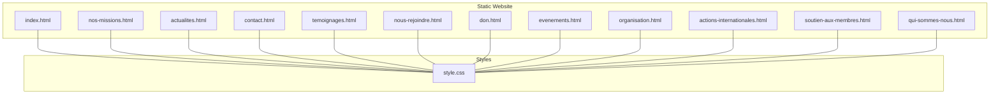
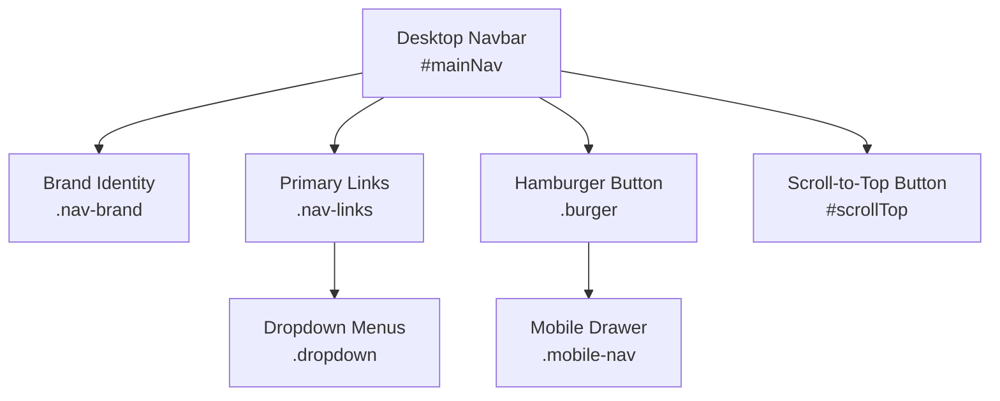
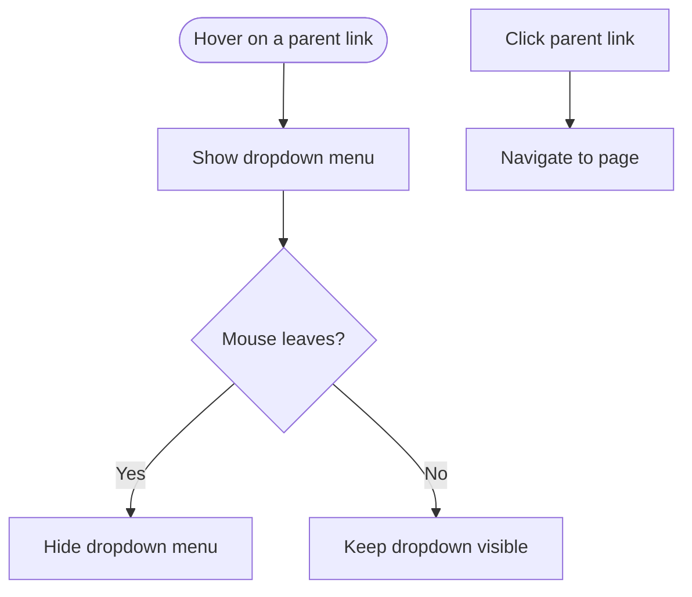
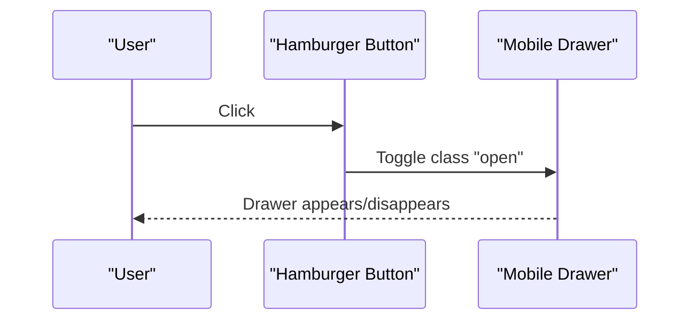
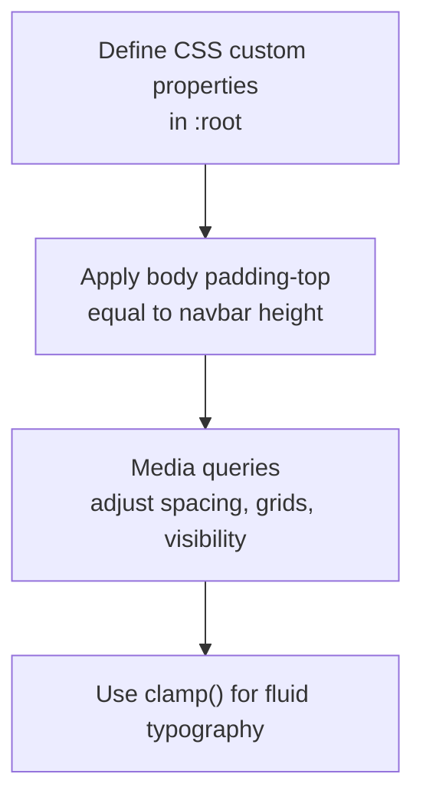
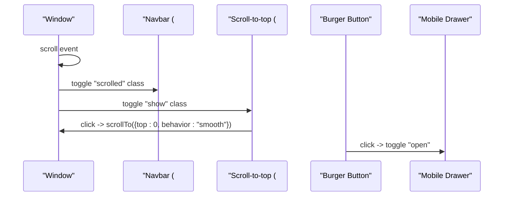
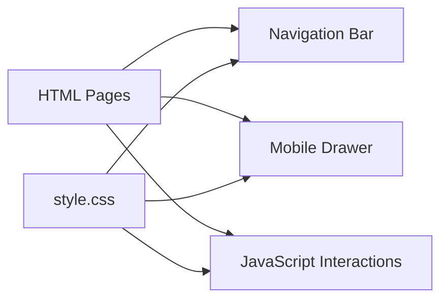

# HTML Structure and Navigation

<cite>
**Referenced Files in This Document**
- [index.html](file://rsf-website/index.html)
- [style.css](file://rsf-website/style.css)
- [nos-missions.html](file://rsf-website/nos-missions.html)
- [actions-solidaires.html](file://rsf-website/actions-solidaires.html)
- [qui-sommes-nous.html](file://rsf-website/qui-sommes-nous.html)
- [contact.html](file://rsf-website/contact.html)
- [actualites.html](file://rsf-website/actualites.html)
- [temoignages.html](file://rsf-website/temoignages.html)
- [nous-rejoindre.html](file://rsf-website/nous-rejoindre.html)
- [don.html](file://rsf-website/don.html)
- [evenements.html](file://rsf-website/evenements.html)
- [organisation.html](file://rsf-website/organisation.html)
- [actions-internationales.html](file://rsf-website/actions-internationales.html)
- [soutien-aux-membres.html](file://rsf-website/soutien-aux-membres.html)
</cite>

## Table of Contents
1. [Introduction](#introduction)
2. [Project Structure](#project-structure)
3. [Core Components](#core-components)
4. [Architecture Overview](#architecture-overview)
5. [Detailed Component Analysis](#detailed-component-analysis)
6. [Dependency Analysis](#dependency-analysis)
7. [Performance Considerations](#performance-considerations)
8. [Troubleshooting Guide](#troubleshooting-guide)
9. [Conclusion](#conclusion)
10. [Appendices](#appendices)

## Introduction
This document explains the HTML structure and navigation system of the static website. It covers semantic markup practices, meta tags, accessibility features, the desktop navigation with dropdown menus, mobile navigation, active state management, responsive design using CSS custom properties and media queries, and JavaScript interactions for smooth scrolling, mobile menu toggling, and scroll detection. It also provides guidelines to maintain consistent HTML structure across all pages and best practices for semantic markup.

## Project Structure
The website is composed of static HTML pages under the rsf-website directory, each sharing a common navigation and styling system. The navigation is consistently structured across pages, with a desktop navbar featuring dropdown menus and a mobile hamburger menu. Styles are centralized in a single stylesheet that defines CSS custom properties and responsive breakpoints.

**Diagram sources**
- [index.html](file://rsf-website/index.html)
- [style.css](file://rsf-website/style.css)

**Section sources**
- [index.html](file://rsf-website/index.html)
- [style.css](file://rsf-website/style.css)

## Core Components
- Navigation bar: Fixed-position, gradient-blur background, brand identity, primary navigation links, dropdown menus, and a call-to-action item.
- Mobile navigation: Off-canvas drawer triggered by a hamburger button, organized by grouped sections.
- Active state management: Desktop links use an "active" class to indicate the current page.
- Scroll behavior: Sticky header shadow and a floating scroll-to-top button appear after scrolling thresholds.
- Responsive design: CSS custom properties define layout and typography; media queries adjust spacing, grid layouts, and reveal the mobile menu.

Key implementation references:
- Navigation structure and active states: [index.html](file://rsf-website/index.html), [nos-missions.html](file://rsf-website/nos-missions.html), [qui-sommes-nous.html](file://rsf-website/qui-sommes-nous.html), [contact.html](file://rsf-website/contact.html), [actualites.html](file://rsf-website/actualites.html), [temoignages.html](file://rsf-website/temoignages.html), [nous-rejoindre.html](file://rsf-website/nous-rejoindre.html), [don.html](file://rsf-website/don.html), [evenements.html](file://rsf-website/evenements.html), [organisation.html](file://rsf-website/organisation.html), [actions-internationales.html](file://rsf-website/actions-internationales.html), [soutien-aux-membres.html](file://rsf-website/soutien-aux-membres.html)
- Mobile navigation and hamburger button: [index.html](file://rsf-website/index.html)
- JavaScript interactions (scroll detection, smooth scrolling, mobile toggle): [index.html](file://rsf-website/index.html), [nos-missions.html](file://rsf-website/nos-missions.html), [actions-solidaires.html](file://rsf-website/actions-solidaires.html), [qui-sommes-nous.html](file://rsf-website/qui-sommes-nous.html), [contact.html](file://rsf-website/contact.html), [actualites.html](file://rsf-website/actualites.html), [temoignages.html](file://rsf-website/temoignages.html), [nous-rejoindre.html](file://rsf-website/nous-rejoindre.html), [don.html](file://rsf-website/don.html), [evenements.html](file://rsf-website/evenements.html), [organisation.html](file://rsf-website/organisation.html), [actions-internationales.html](file://rsf-website/actions-internationales.html), [soutien-aux-membres.html](file://rsf-website/soutien-aux-membres.html)
- Styles and responsive design: [style.css](file://rsf-website/style.css)

**Section sources**
- [index.html](file://rsf-website/index.html)
- [style.css](file://rsf-website/style.css)

## Architecture Overview
The navigation architecture consists of:
- A fixed desktop navbar with hover-triggered dropdown menus.
- A mobile drawer accessible via a hamburger button.
- Global scroll-driven UI enhancements (sticky header, scroll-to-top).
- Consistent semantic structure across pages to support accessibility and SEO.

**Diagram sources**
- [index.html](file://rsf-website/index.html)
- [style.css](file://rsf-website/style.css)

**Section sources**
- [index.html](file://rsf-website/index.html)
- [style.css](file://rsf-website/style.css)

## Detailed Component Analysis

### Semantic HTML Markup Practices
- Document structure: Each page starts with a strict DOCTYPE and sets the language attribute on the html element for accessibility and SEO.
- Meta tags: Pages include charset, viewport, and description meta tags for compatibility and SEO.
- Accessibility: The hamburger button uses an aria-label for screen reader support.
- Page-specific headers: Each content page uses a dedicated header region with breadcrumb navigation and badges to improve comprehension and navigation.

References:
- DOCTYPE and html lang: [index.html](file://rsf-website/index.html), [nos-missions.html](file://rsf-website/nos-missions.html), [qui-sommes-nous.html](file://rsf-website/qui-sommes-nous.html), [contact.html](file://rsf-website/contact.html), [actualites.html](file://rsf-website/actualites.html), [temoignages.html](file://rsf-website/temoignages.html), [nous-rejoindre.html](file://rsf-website/nous-rejoindre.html), [don.html](file://rsf-website/don.html), [evenements.html](file://rsf-website/evenements.html), [organisation.html](file://rsf-website/organisation.html), [actions-internationales.html](file://rsf-website/actions-internationales.html), [soutien-aux-membres.html](file://rsf-website/soutien-aux-membres.html)
- Meta tags: [index.html](file://rsf-website/index.html), [nos-missions.html](file://rsf-website/nos-missions.html), [qui-sommes-nous.html](file://rsf-website/qui-sommes-nous.html), [contact.html](file://rsf-website/contact.html), [actualites.html](file://rsf-website/actualites.html), [temoignages.html](file://rsf-website/temoignages.html), [nous-rejoindre.html](file://rsf-website/nous-rejoindre.html), [don.html](file://rsf-website/don.html), [evenements.html](file://rsf-website/evenements.html), [organisation.html](file://rsf-website/organisation.html), [actions-internationales.html](file://rsf-website/actions-internationales.html), [soutien-aux-membres.html](file://rsf-website/soutien-aux-membres.html)
- Accessibility (aria-label): [index.html](file://rsf-website/index.html)
- Page headers and breadcrumbs: [nos-missions.html](file://rsf-website/nos-missions.html), [actions-solidaires.html](file://rsf-website/actions-solidaires.html), [qui-sommes-nous.html](file://rsf-website/qui-sommes-nous.html), [contact.html](file://rsf-website/contact.html), [actualites.html](file://rsf-website/actualites.html), [temoignages.html](file://rsf-website/temoignages.html), [nous-rejoindre.html](file://rsf-website/nous-rejoindre.html), [don.html](file://rsf-website/don.html), [evenements.html](file://rsf-website/evenements.html), [organisation.html](file://rsf-website/organisation.html), [actions-internationales.html](file://rsf-website/actions-internationales.html), [soutien-aux-membres.html](file://rsf-website/soutien-aux-membres.html)

**Section sources**
- [index.html](file://rsf-website/index.html)
- [nos-missions.html](file://rsf-website/nos-missions.html)
- [qui-sommes-nous.html](file://rsf-website/qui-sommes-nous.html)
- [contact.html](file://rsf-website/contact.html)
- [actualites.html](file://rsf-website/actualites.html)
- [temoignages.html](file://rsf-website/temoignages.html)
- [nous-rejoindre.html](file://rsf-website/nous-rejoindre.html)
- [don.html](file://rsf-website/don.html)
- [evenements.html](file://rsf-website/evenements.html)
- [organisation.html](file://rsf-website/organisation.html)
- [actions-internationales.html](file://rsf-website/actions-internationales.html)
- [soutien-aux-membres.html](file://rsf-website/soutien-aux-membres.html)

### Desktop Navigation Bar with Dropdown Menus
- Structure: Brand identity, primary navigation links, and a call-to-action link.
- Dropdowns: Hover-triggered menus positioned below parent items, styled with shadows and rounded corners.
- Active state: The current page link receives an "active" class for visual indication.

**Diagram sources**
- [index.html](file://rsf-website/index.html)
- [style.css](file://rsf-website/style.css)

**Section sources**
- [index.html](file://rsf-website/index.html)
- [style.css](file://rsf-website/style.css)

### Mobile Navigation Implementation
- Trigger: Hamburger button with three bars.
- Drawer: Full-screen off-canvas menu revealed via a class toggle.
- Organization: Sections group related links for improved scanning.

**Diagram sources**
- [index.html](file://rsf-website/index.html)
- [style.css](file://rsf-website/style.css)

**Section sources**
- [index.html](file://rsf-website/index.html)
- [style.css](file://rsf-website/style.css)

### Active State Management
- Desktop: The current page link has the "active" class applied to indicate the active route.
- Consistency: All pages implement the same pattern to maintain predictable navigation behavior.

References:
- Active class usage: [index.html](file://rsf-website/index.html), [nos-missions.html](file://rsf-website/nos-missions.html), [qui-sommes-nous.html](file://rsf-website/qui-sommes-nous.html), [contact.html](file://rsf-website/contact.html), [actualites.html](file://rsf-website/actualites.html), [temoignages.html](file://rsf-website/temoignages.html), [nous-rejoindre.html](file://rsf-website/nous-rejoindre.html), [don.html](file://rsf-website/don.html), [evenements.html](file://rsf-website/evenements.html), [organisation.html](file://rsf-website/organisation.html), [actions-internationales.html](file://rsf-website/actions-internationales.html), [soutien-aux-membres.html](file://rsf-website/soutien-aux-membres.html)

**Section sources**
- [index.html](file://rsf-website/index.html)
- [nos-missions.html](file://rsf-website/nos-missions.html)
- [qui-sommes-nous.html](file://rsf-website/qui-sommes-nous.html)
- [contact.html](file://rsf-website/contact.html)
- [actualites.html](file://rsf-website/actualites.html)
- [temoignages.html](file://rsf-website/temoignages.html)
- [nous-rejoindre.html](file://rsf-website/nous-rejoindre.html)
- [don.html](file://rsf-website/don.html)
- [evenements.html](file://rsf-website/evenements.html)
- [organisation.html](file://rsf-website/organisation.html)
- [actions-internationales.html](file://rsf-website/actions-internationales.html)
- [soutien-aux-membres.html](file://rsf-website/soutien-aux-membres.html)

### Responsive Design Approach
- CSS custom properties: Centralized theme tokens for colors, typography, spacing, and shadows.
- Body padding: Top padding equals the fixed navbar height to prevent content overlap.
- Grid adjustments: Responsive grid layouts adapt to screen sizes with media queries.
- Typography scaling: clamp() ensures readable font sizes across devices.

**Diagram sources**
- [style.css](file://rsf-website/style.css)

**Section sources**
- [style.css](file://rsf-website/style.css)

### JavaScript Functionality for Navigation Interactions
- Scroll detection: Adds/removes a class on the navbar and shows/hides the scroll-to-top button based on scroll thresholds.
- Smooth scrolling: Clicking the scroll-to-top button triggers smooth scroll to the page top.
- Mobile toggle: Clicking the hamburger button toggles the mobile drawer open/closed.
- Intersection Observer: Animates content into view when scrolled into viewport.

**Diagram sources**
- [index.html](file://rsf-website/index.html)
- [nos-missions.html](file://rsf-website/nos-missions.html)
- [actions-solidaires.html](file://rsf-website/actions-solidaires.html)
- [qui-sommes-nous.html](file://rsf-website/qui-sommes-nous.html)
- [contact.html](file://rsf-website/contact.html)
- [actualites.html](file://rsf-website/actualites.html)
- [temoignages.html](file://rsf-website/temoignages.html)
- [nous-rejoindre.html](file://rsf-website/nous-rejoindre.html)
- [don.html](file://rsf-website/don.html)
- [evenements.html](file://rsf-website/evenements.html)
- [organisation.html](file://rsf-website/organisation.html)
- [actions-internationales.html](file://rsf-website/actions-internationales.html)
- [soutien-aux-membres.html](file://rsf-website/soutien-aux-membres.html)

**Section sources**
- [index.html](file://rsf-website/index.html)
- [nos-missions.html](file://rsf-website/nos-missions.html)
- [actions-solidaires.html](file://rsf-website/actions-solidaires.html)
- [qui-sommes-nous.html](file://rsf-website/qui-sommes-nous.html)
- [contact.html](file://rsf-website/contact.html)
- [actualites.html](file://rsf-website/actualites.html)
- [temoignages.html](file://rsf-website/temoignages.html)
- [nous-rejoindre.html](file://rsf-website/nous-rejoindre.html)
- [don.html](file://rsf-website/don.html)
- [evenements.html](file://rsf-website/evenements.html)
- [organisation.html](file://rsf-website/organisation.html)
- [actions-internationales.html](file://rsf-website/actions-internationales.html)
- [soutien-aux-membres.html](file://rsf-website/soutien-aux-membres.html)

## Dependency Analysis
The navigation system depends on:
- Shared HTML structure across pages for consistent behavior.
- Centralized CSS for styling and responsive behavior.
- JavaScript for interactive features.

**Diagram sources**
- [index.html](file://rsf-website/index.html)
- [style.css](file://rsf-website/style.css)

**Section sources**
- [index.html](file://rsf-website/index.html)
- [style.css](file://rsf-website/style.css)

## Performance Considerations
- CSS custom properties reduce duplication and enable efficient theme updates.
- Media queries optimize rendering for different screen sizes.
- Intersection Observer animations avoid heavy scroll handlers.
- Minimal JavaScript reduces runtime overhead while delivering essential UX.

[No sources needed since this section provides general guidance]

## Troubleshooting Guide
Common issues and resolutions:
- Mobile drawer not opening: Verify the hamburger button ID matches the script selector and that the "open" class toggles correctly.
- Active state not visible: Ensure the current page link has the "active" class and that the associated CSS rule applies appropriate styles.
- Scroll-to-top not appearing: Confirm the scroll threshold logic and that the "show" class is toggled on the scroll-to-top button.
- Dropdowns not visible: Check hover-triggered styles and ensure parent items are not overlapped by other elements.

**Section sources**
- [index.html](file://rsf-website/index.html)
- [style.css](file://rsf-website/style.css)

## Conclusion
The static website employs a consistent, accessible, and responsive navigation system. The desktop navbar with dropdowns and the mobile drawer provide seamless cross-device navigation. CSS custom properties and media queries ensure a cohesive design language, while JavaScript delivers smooth interactions. Following the documented patterns guarantees uniformity across all pages.

[No sources needed since this section summarizes without analyzing specific files]

## Appendices

### Best Practices for Maintaining Consistent HTML Structure
- Use the same navigation container IDs and classes across pages.
- Apply the "active" class to the current page link.
- Include the same meta tags and accessibility attributes.
- Keep the mobile drawer structure identical for predictable behavior.
- Use the same CSS custom properties and media query breakpoints.

**Section sources**
- [index.html](file://rsf-website/index.html)
- [style.css](file://rsf-website/style.css)