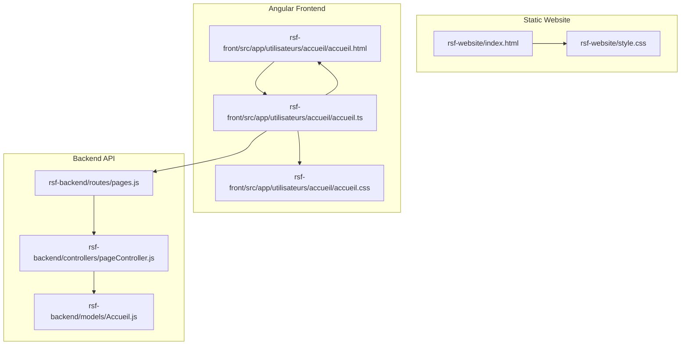
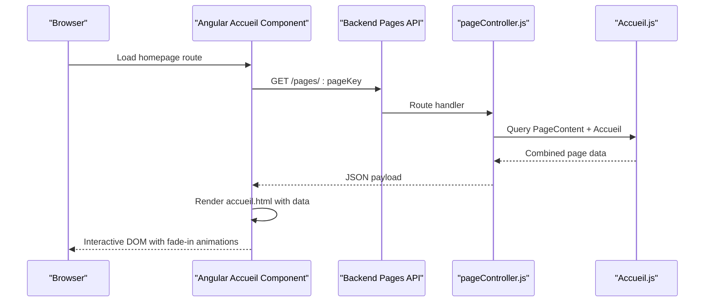
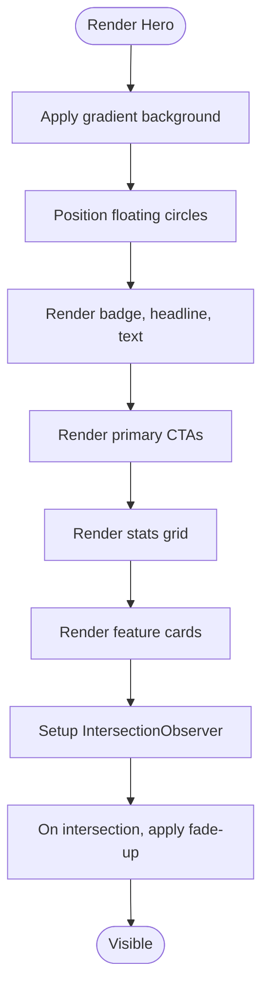
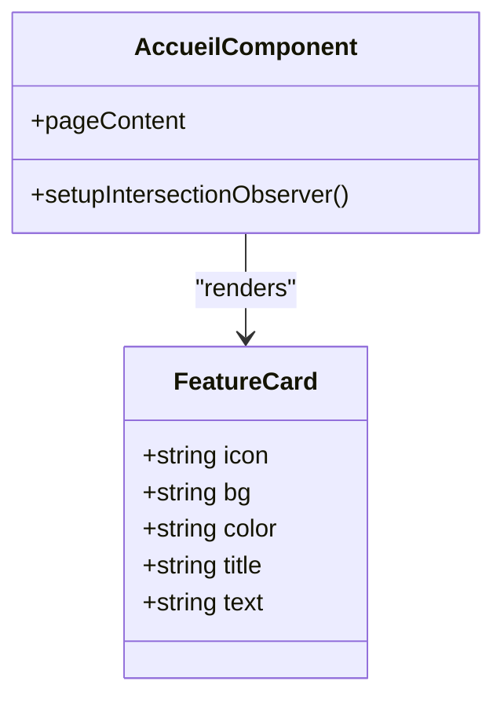
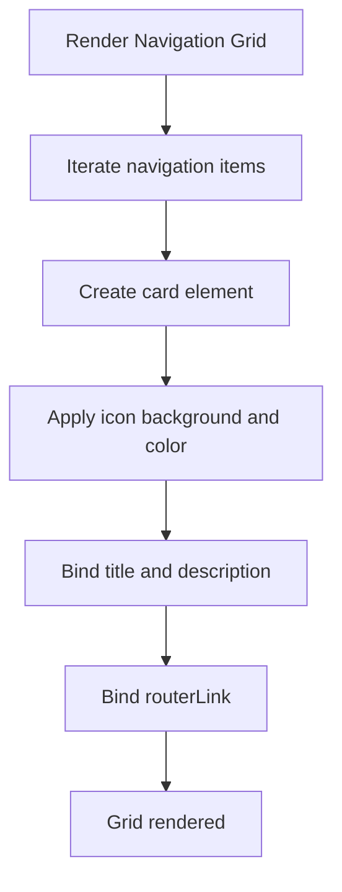
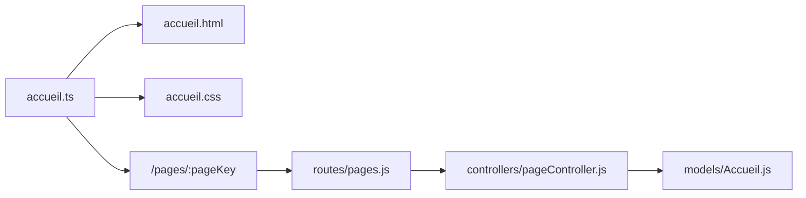

# Homepage Implementation

<cite>
**Referenced Files in This Document**
- [index.html](file://rsf-website/index.html)
- [style.css](file://rsf-website/style.css)
- [accueil.html](file://rsf-front/src/app/utilisateurs/accueil/accueil.html)
- [accueil.css](file://rsf-front/src/app/utilisateurs/accueil/accueil.css)
- [accueil.ts](file://rsf-front/src/app/utilisateurs/accueil/accueil.ts)
- [pageController.js](file://rsf-backend/controllers/pageController.js)
- [Accueil.js](file://rsf-backend/models/Accueil.js)
- [pages.js](file://rsf-backend/routes/pages.js)
</cite>

## Table of Contents
1. [Introduction](#introduction)
2. [Project Structure](#project-structure)
3. [Core Components](#core-components)
4. [Architecture Overview](#architecture-overview)
5. [Detailed Component Analysis](#detailed-component-analysis)
6. [Dependency Analysis](#dependency-analysis)
7. [Performance Considerations](#performance-considerations)
8. [Troubleshooting Guide](#troubleshooting-guide)
9. [Conclusion](#conclusion)

## Introduction
This document provides comprehensive technical documentation for the homepage implementation across both the static website and the Angular frontend. It focuses on the hero section, feature highlights, quick navigation grid, values showcase, call-to-action strip, and footer. It also covers content management via the backend API, styling architecture, responsive behavior, and performance considerations for large background elements and animations.

## Project Structure
The homepage is implemented in two complementary ways:
- Static website: A single HTML page with embedded styles and minimal JavaScript for interactive elements.
- Angular frontend: A dynamic component that loads page content from the backend API and renders the same sections with reactive data binding.

**Diagram sources**
- [index.html:1-296](file://rsf-website/index.html#L1-L296)
- [style.css:1-309](file://rsf-website/style.css#L1-L309)
- [accueil.html:1-110](file://rsf-front/src/app/utilisateurs/accueil/accueil.html#L1-L110)
- [accueil.css:1-178](file://rsf-front/src/app/utilisateurs/accueil/accueil.css#L1-L178)
- [accueil.ts:1-80](file://rsf-front/src/app/utilisateurs/accueil/accueil.ts#L1-L80)
- [pages.js:1-10](file://rsf-backend/routes/pages.js#L1-L10)
- [pageController.js:1-185](file://rsf-backend/controllers/pageController.js#L1-L185)
- [Accueil.js:1-52](file://rsf-backend/models/Accueil.js#L1-L52)

**Section sources**
- [index.html:1-296](file://rsf-website/index.html#L1-L296)
- [style.css:1-309](file://rsf-website/style.css#L1-L309)
- [accueil.html:1-110](file://rsf-front/src/app/utilisateurs/accueil/accueil.html#L1-L110)
- [accueil.css:1-178](file://rsf-front/src/app/utilisateurs/accueil/accueil.css#L1-L178)
- [accueil.ts:1-80](file://rsf-front/src/app/utilisateurs/accueil/accueil.ts#L1-L80)
- [pages.js:1-10](file://rsf-backend/routes/pages.js#L1-L10)
- [pageController.js:1-185](file://rsf-backend/controllers/pageController.js#L1-L185)
- [Accueil.js:1-52](file://rsf-backend/models/Accueil.js#L1-L52)

## Core Components
- Hero section: Gradient background, animated floating circles, headline, descriptive text, value proposition chips, and primary call-to-action buttons.
- Feature cards: Assistance service highlights with icon boxes and concise descriptions.
- Statistics grid: Organizational metrics presented in elevated cards.
- Quick navigation grid: Icon-based cards linking to internal sections.
- Values showcase: Four foundational values with icons and descriptions.
- Call-to-action strip: Prominent gradient section with contrasting buttons.
- Footer: Brand identity, navigation columns, and legal/social information.

These components are consistently styled using CSS custom properties and responsive grid utilities.

**Section sources**
- [index.html:78-131](file://rsf-website/index.html#L78-L131)
- [index.html:134-181](file://rsf-website/index.html#L134-L181)
- [index.html:184-211](file://rsf-website/index.html#L184-L211)
- [index.html:213-225](file://rsf-website/index.html#L213-L225)
- [index.html:231-270](file://rsf-website/index.html#L231-L270)
- [style.css:135-181](file://rsf-website/style.css#L135-L181)
- [style.css:240-246](file://rsf-website/style.css#L240-L246)

## Architecture Overview
The Angular frontend fetches page content from the backend API and renders the homepage dynamically. The static website embeds all content directly in HTML with CSS and JavaScript.

**Diagram sources**
- [accueil.ts:21-26](file://rsf-front/src/app/utilisateurs/accueil/accueil.ts#L21-L26)
- [pages.js:5-7](file://rsf-backend/routes/pages.js#L5-L7)
- [pageController.js:66-104](file://rsf-backend/controllers/pageController.js#L66-L104)
- [Accueil.js:4-48](file://rsf-backend/models/Accueil.js#L4-L48)

## Detailed Component Analysis

### Hero Section
- Design elements:
  - Gradient background spanning the viewport height.
  - Floating animated circles positioned absolutely behind content.
  - Badge with pulsing dot indicating live status.
  - Headline with gradient underline effect.
  - Descriptive paragraph with constrained max-width.
  - Primary CTA buttons with variant support.
  - Statistics grid with elevated cards and borders.
  - Right-side feature cards with icon boxes and descriptive text.
- Animations:
  - Fade-up reveal triggered by IntersectionObserver when elements enter viewport.
- Responsive behavior:
  - Grid layout adjusts to single-column on narrow screens.
  - Typography scales using clamp units for readability.

**Diagram sources**
- [index.html:78-131](file://rsf-website/index.html#L78-L131)
- [style.css:247-249](file://rsf-website/style.css#L247-L249)
- [accueil.html:1-50](file://rsf-front/src/app/utilisateurs/accueil/accueil.html#L1-L50)
- [accueil.css:12-44](file://rsf-front/src/app/utilisateurs/accueil/accueil.css#L12-L44)

**Section sources**
- [index.html:78-131](file://rsf-website/index.html#L78-L131)
- [style.css:247-249](file://rsf-website/style.css#L247-L249)
- [accueil.html:1-50](file://rsf-front/src/app/utilisateurs/accueil/accueil.html#L1-L50)
- [accueil.css:12-44](file://rsf-front/src/app/utilisateurs/accueil/accueil.css#L12-L44)

### Feature Cards System
- Purpose: Showcase assistance services with iconography and short descriptions.
- Structure:
  - Each card contains an icon box and a pair of headline/subtitle paragraphs.
  - Background and border elevation provide depth.
- Dynamic rendering:
  - Angular component iterates over hero features array and applies background and color styling per item.

**Diagram sources**
- [accueil.html:37-47](file://rsf-front/src/app/utilisateurs/accueil/accueil.html#L37-L47)
- [accueil.ts:56-78](file://rsf-front/src/app/utilisateurs/accueil/accueil.ts#L56-L78)

**Section sources**
- [index.html:114-128](file://rsf-website/index.html#L114-L128)
- [accueil.html:37-47](file://rsf-front/src/app/utilisateurs/accueil/accueil.html#L37-L47)
- [accueil.css:133-153](file://rsf-front/src/app/utilisateurs/accueil/accueil.css#L133-L153)

### Quick Navigation Grid
- Purpose: Provide icon-based shortcuts to major sections.
- Structure:
  - Responsive auto-fill grid with minimum card width.
  - Each card includes an icon box, title, and description.
  - Optional accent border for highlighted items.
- Dynamic rendering:
  - Angular component iterates over navigation items and binds router links.

**Diagram sources**
- [accueil.html:52-76](file://rsf-front/src/app/utilisateurs/accueil/accueil.html#L52-L76)
- [accueil.css:200-210](file://rsf-front/src/app/utilisateurs/accueil/accueil.css#L200-L210)

**Section sources**
- [index.html:134-181](file://rsf-website/index.html#L134-L181)
- [accueil.html:52-76](file://rsf-front/src/app/utilisateurs/accueil/accueil.html#L52-L76)
- [accueil.css:200-210](file://rsf-front/src/app/utilisateurs/accueil/accueil.css#L200-L210)

### Values Showcase
- Purpose: Highlight four foundational values with emojis and descriptions.
- Structure:
  - Centered cards with large icons and white-on-dark theme.
  - Responsive grid layout adapts to screen size.

**Section sources**
- [index.html:184-211](file://rsf-website/index.html#L184-L211)
- [accueil.html:78-92](file://rsf-front/src/app/utilisateurs/accueil/accueil.html#L78-L92)
- [accueil.css:200-210](file://rsf-front/src/app/utilisateurs/accueil/accueil.css#L200-L210)

### Call-to-Action Strip
- Purpose: Reinforce engagement with a prominent gradient section and contrasting buttons.
- Structure:
  - Flex container with headline, description, and button row.
  - Buttons use accent styling for donations and secondary actions.

**Section sources**
- [index.html:213-225](file://rsf-website/index.html#L213-L225)
- [accueil.html:94-109](file://rsf-front/src/app/utilisateurs/accueil/accueil.html#L94-L109)
- [accueil.css:155-177](file://rsf-front/src/app/utilisateurs/accueil/accueil.css#L155-L177)

### Footer
- Purpose: Present brand information, navigation links, and legal details.
- Structure:
  - Multi-column layout with brand identity, three navigation columns, and a bottom bar.
  - Links use hover effects and subtle typography hierarchy.

**Section sources**
- [index.html:231-270](file://rsf-website/index.html#L231-L270)
- [style.css:251-273](file://rsf-website/style.css#L251-L273)

## Dependency Analysis
The Angular homepage depends on the backend API for dynamic content. The static website embeds content directly.

**Diagram sources**
- [accueil.ts:16-26](file://rsf-front/src/app/utilisateurs/accueil/accueil.ts#L16-L26)
- [pages.js:5-7](file://rsf-backend/routes/pages.js#L5-L7)
- [pageController.js:66-104](file://rsf-backend/controllers/pageController.js#L66-L104)
- [Accueil.js:4-48](file://rsf-backend/models/Accueil.js#L4-L48)

**Section sources**
- [accueil.ts:16-26](file://rsf-front/src/app/utilisateurs/accueil/accueil.ts#L16-L26)
- [pages.js:5-7](file://rsf-backend/routes/pages.js#L5-L7)
- [pageController.js:66-104](file://rsf-backend/controllers/pageController.js#L66-L104)
- [Accueil.js:4-48](file://rsf-backend/models/Accueil.js#L4-L48)

## Performance Considerations
- Large background gradients and floating circles:
  - Use hardware-accelerated transforms and low-opacity fills to minimize repaint cost.
  - Keep circle sizes proportional to viewport to avoid excessive offscreen rendering.
- Animations:
  - IntersectionObserver is efficient; ensure thresholds match content density.
  - Avoid triggering heavy animations on scroll-heavy devices.
- Images and assets:
  - Prefer modern formats (WebP) and appropriate resolutions.
  - Lazy-load images outside the viewport using native loading="lazy".
- CSS and JS:
  - Consolidate styles and defer non-critical scripts.
  - Minimize reflows by animating transform/opacity only.
- Backend data fetching:
  - Cache frequently accessed page content at CDN level.
  - Paginate or limit hero features to reduce payload size.

[No sources needed since this section provides general guidance]

## Troubleshooting Guide
- Hero content not appearing in Angular:
  - Verify the resolver supplies pageContent to the route data.
  - Confirm the API endpoint returns the expected structure for the requested page key.
- Fade-up animations not triggering:
  - Check browser support for IntersectionObserver; the component falls back to immediate visibility when unsupported.
  - Ensure target elements exist in the DOM before observer setup.
- Button variants not applied:
  - Validate action.variant values against supported variants in the component.
- Stats values missing:
  - Confirm stat.key exists in pageContent.stats or that stat.value is provided directly.
- Backend updates not persisting:
  - Ensure the pageKey is valid and fields conform to expected keys.
  - For homepage, hero and stats are merged from the dedicated model.

**Section sources**
- [accueil.ts:28-41](file://rsf-front/src/app/utilisateurs/accueil/accueil.ts#L28-L41)
- [accueil.ts:43-54](file://rsf-front/src/app/utilisateurs/accueil/accueil.ts#L43-L54)
- [accueil.ts:56-78](file://rsf-front/src/app/utilisateurs/accueil/accueil.ts#L56-L78)
- [pageController.js:66-104](file://rsf-backend/controllers/pageController.js#L66-L104)
- [pageController.js:106-178](file://rsf-backend/controllers/pageController.js#L106-L178)

## Conclusion
The homepage implementation combines a robust static foundation with a flexible Angular-driven approach. The hero section, feature cards, navigation grid, values showcase, and call-to-action strip form a cohesive, accessible, and performant user experience. Content management is streamlined through the backend API, enabling editors to update copy, features, and statistics without modifying templates. Following the guidelines herein ensures consistent visual hierarchy, optimal performance, and maintainable code across both implementations.