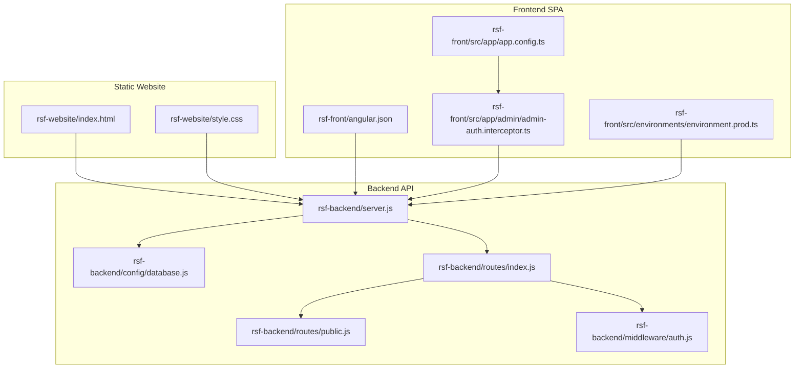
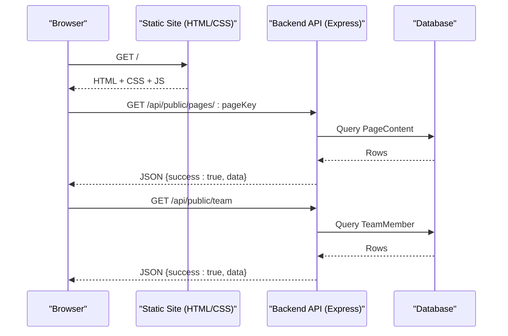
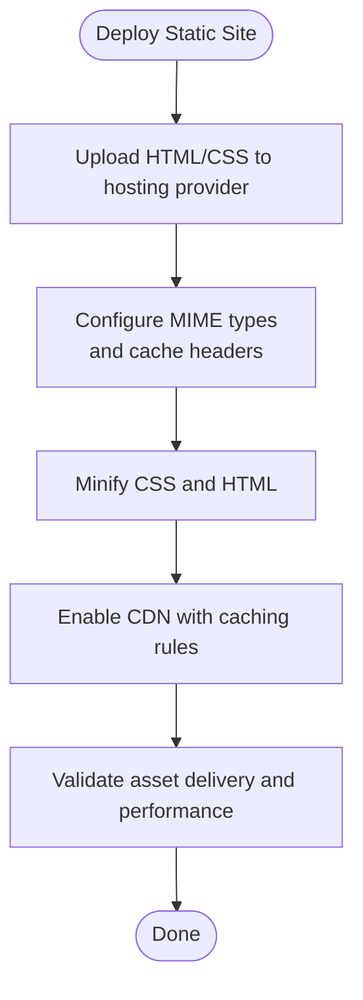
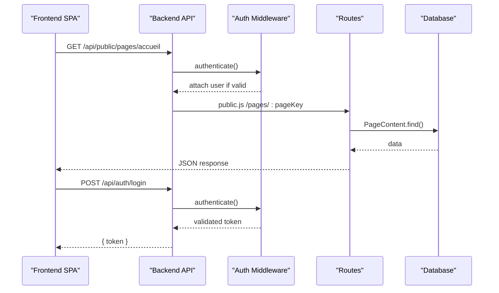
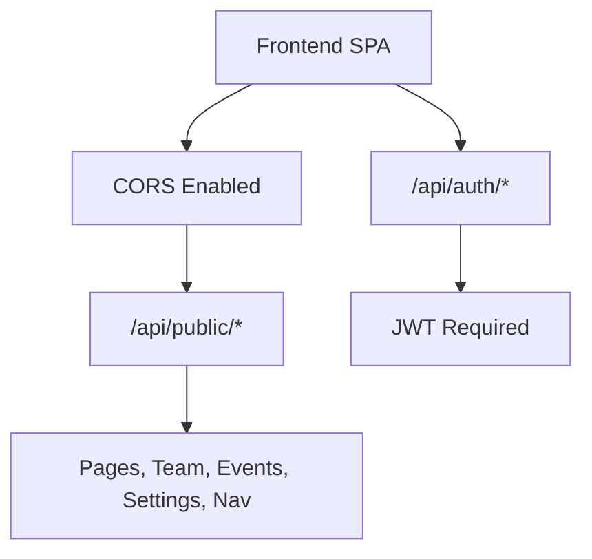
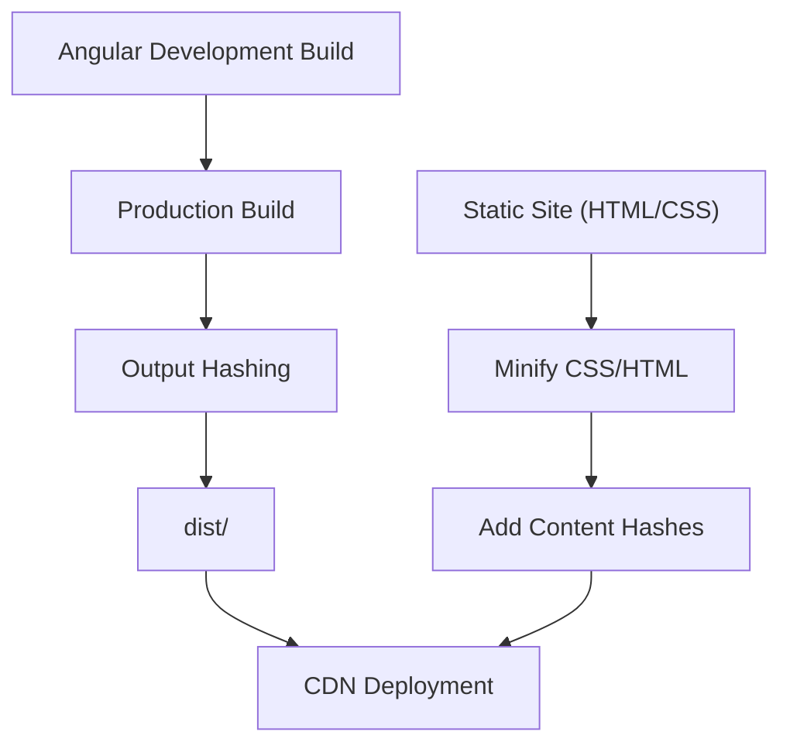
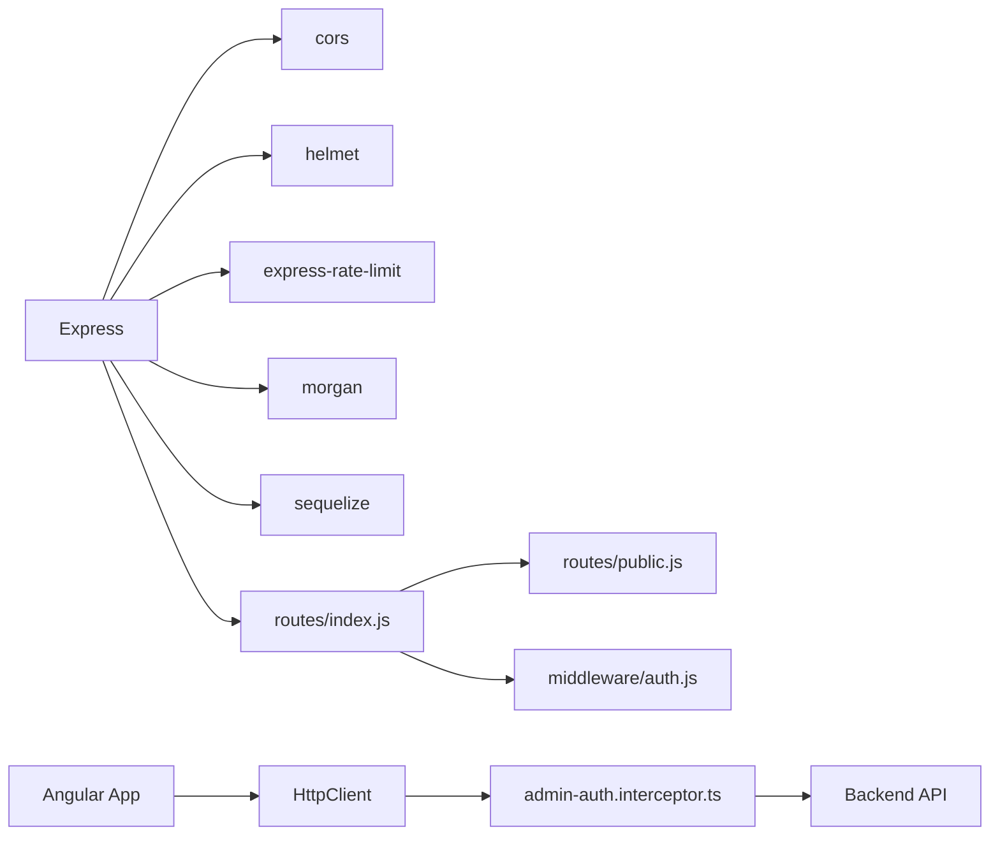

# Static Site Hosting and Integration

<cite>
**Referenced Files in This Document**
- [server.js](file://rsf-backend/server.js)
- [database.js](file://rsf-backend/config/database.js)
- [package.json](file://rsf-backend/package.json)
- [index.js](file://rsf-backend/routes/index.js)
- [public.js](file://rsf-backend/routes/public.js)
- [auth.js](file://rsf-backend/middleware/auth.js)
- [pageController.js](file://rsf-backend/controllers/pageController.js)
- [eventController.js](file://rsf-backend/controllers/eventController.js)
- [teamController.js](file://rsf-backend/controllers/teamController.js)
- [index.html](file://rsf-website/index.html)
- [style.css](file://rsf-website/style.css)
- [angular.json](file://rsf-front/angular.json)
- [app.config.ts](file://rsf-front/src/app/app.config.ts)
- [admin-auth.interceptor.ts](file://rsf-front/src/app/admin/admin-auth.interceptor.ts)
- [environment.prod.ts](file://rsf-front/src/environments/environment.prod.ts)
</cite>

## Table of Contents
1. [Introduction](#introduction)
2. [Project Structure](#project-structure)
3. [Core Components](#core-components)
4. [Architecture Overview](#architecture-overview)
5. [Detailed Component Analysis](#detailed-component-analysis)
6. [Dependency Analysis](#dependency-analysis)
7. [Performance Considerations](#performance-considerations)
8. [Troubleshooting Guide](#troubleshooting-guide)
9. [Conclusion](#conclusion)
10. [Appendices](#appendices)

## Introduction
This document explains how to host a static website alongside a dynamic backend API and integrate them effectively. It covers:
- Static site deployment strategies for HTML/CSS assets
- Backend API integration patterns for dynamic content
- CORS configuration and API endpoint usage
- Caching strategies, CDN integration, and performance optimization
- Build process, minification, and version management
- Maintaining both static and dynamic systems together, redirects, and content updates

## Project Structure
The project consists of three main parts:
- Static website: HTML and CSS files under rsf-website
- Backend API: Express server under rsf-backend exposing REST endpoints
- Frontend application: Angular SPA under rsf-front that consumes the backend API

**Diagram sources**
- [server.js:1-84](file://rsf-backend/server.js#L1-L84)
- [database.js:1-69](file://rsf-backend/config/database.js#L1-L69)
- [index.js:1-28](file://rsf-backend/routes/index.js#L1-L28)
- [public.js:1-201](file://rsf-backend/routes/public.js#L1-L201)
- [auth.js:1-50](file://rsf-backend/middleware/auth.js#L1-L50)
- [index.html:1-296](file://rsf-website/index.html#L1-L296)
- [style.css:1-309](file://rsf-website/style.css#L1-L309)
- [angular.json:1-75](file://rsf-front/angular.json#L1-L75)
- [app.config.ts:1-15](file://rsf-front/src/app/app.config.ts#L1-L15)
- [admin-auth.interceptor.ts:1-30](file://rsf-front/src/app/admin/admin-auth.interceptor.ts#L1-L30)
- [environment.prod.ts:1-5](file://rsf-front/src/environments/environment.prod.ts#L1-L5)

**Section sources**
- [server.js:1-84](file://rsf-backend/server.js#L1-L84)
- [index.html:1-296](file://rsf-website/index.html#L1-L296)
- [style.css:1-309](file://rsf-website/style.css#L1-L309)
- [angular.json:1-75](file://rsf-front/angular.json#L1-L75)

## Core Components
- Static website: Pure HTML/CSS with embedded JavaScript for navigation and UI interactions. No build step is required for the static site itself.
- Backend API: Express server with CORS enabled, image serving, health checks, and modular routes. Public endpoints expose content for the frontend and static site.
- Frontend SPA: Angular application configured to build static assets and send authenticated requests via an HTTP interceptor to the backend API.

Key integration points:
- Static site loads content from backend public endpoints (e.g., pages, team, testimonials, events, settings).
- Angular app authenticates with the backend and attaches tokens to API calls.

**Section sources**
- [server.js:21-52](file://rsf-backend/server.js#L21-L52)
- [public.js:46-200](file://rsf-backend/routes/public.js#L46-L200)
- [index.js:6-26](file://rsf-backend/routes/index.js#L6-L26)
- [app.config.ts:8-14](file://rsf-front/src/app/app.config.ts#L8-L14)
- [admin-auth.interceptor.ts:7-28](file://rsf-front/src/app/admin/admin-auth.interceptor.ts#L7-L28)

## Architecture Overview
The static site and backend API work together as follows:
- Static site: Hosted independently (e.g., via a CDN or web server). It references CSS and JS files and can embed lightweight client-side logic.
- Backend API: Exposes public endpoints for content retrieval and protected endpoints for administration. CORS is enabled to allow cross-origin requests from the frontend.
- Frontend SPA: Built with Angular and served separately. It fetches data from the backend API and authenticates using JWT tokens.

**Diagram sources**
- [public.js:46-81](file://rsf-backend/routes/public.js#L46-L81)
- [pageController.js:66-104](file://rsf-backend/controllers/pageController.js#L66-L104)
- [teamController.js:5-10](file://rsf-backend/controllers/teamController.js#L5-L10)

## Detailed Component Analysis

### Static Site Hosting Strategy
- Files to host: HTML files under rsf-website and CSS under rsf-website/style.css.
- Serving approach: Place these files behind a web server or CDN. Ensure proper MIME types for HTML and CSS.
- Asset management: Keep CSS externalized for caching and minification benefits. The current style.css is self-contained; consider extracting and minifying for production.

**Section sources**
- [index.html:1-296](file://rsf-website/index.html#L1-L296)
- [style.css:1-309](file://rsf-website/style.css#L1-L309)

### Backend API Integration Patterns
- Public endpoints: The backend exposes a /api/public route group for content consumption by the static site and SPA.
- Protected endpoints: Authentication middleware enforces JWT verification for admin routes.
- Image serving: Static images are served under /images.

**Diagram sources**
- [public.js:46-81](file://rsf-backend/routes/public.js#L46-L81)
- [auth.js:10-33](file://rsf-backend/middleware/auth.js#L10-L33)
- [index.js:7-26](file://rsf-backend/routes/index.js#L7-L26)

**Section sources**
- [public.js:1-201](file://rsf-backend/routes/public.js#L1-L201)
- [auth.js:1-50](file://rsf-backend/middleware/auth.js#L1-L50)
- [index.js:1-28](file://rsf-backend/routes/index.js#L1-L28)
- [server.js:29-33](file://rsf-backend/server.js#L29-L33)

### CORS Configuration and API Endpoint Usage
- CORS is enabled globally in the backend server, allowing cross-origin requests from the frontend.
- API endpoints are organized under /api and /api/public. Public endpoints are used by the static site and SPA; protected endpoints require a valid JWT.

**Section sources**
- [server.js:23-27](file://rsf-backend/server.js#L23-L27)
- [index.js:7-26](file://rsf-backend/routes/index.js#L7-L26)
- [public.js:46-200](file://rsf-backend/routes/public.js#L46-L200)

### Caching Strategies and CDN Integration
- Static assets: Cache-Control headers should be set for long-term caching of CSS/JS. ETags or Last-Modified can be used for validation.
- API responses: Responses are JSON; enable caching for read-heavy endpoints (e.g., /api/public/*) with appropriate cache keys.
- CDN: Use a CDN to cache static HTML/CSS and serve them globally. Configure cache invalidation on content updates.

[No sources needed since this section provides general guidance]

### Build Process, Minification, and Version Management
- Angular build: The Angular project is configured with production optimizations, output hashing, and budgets. Assets are copied from the public folder and styles are built from src/styles.css.
- Static site: For the rsf-website static site, minify CSS and HTML and consider adding content hashes to filenames for cache busting.

**Section sources**
- [angular.json:32-54](file://rsf-front/angular.json#L32-L54)
- [style.css:1-309](file://rsf-website/style.css#L1-L309)

### Maintaining Both Systems Together
- Content updates: Use the admin routes (protected by JWT) to update content. The static site and SPA consume the public endpoints.
- Redirects: If migrating from a CMS or changing URLs, configure server-level redirects for SEO and user experience.
- Environment separation: Keep apiUrl aligned with the backend origin in production.

**Section sources**
- [index.js:13-26](file://rsf-backend/routes/index.js#L13-L26)
- [environment.prod.ts:1-5](file://rsf-front/src/environments/environment.prod.ts#L1-L5)

## Dependency Analysis
The backend depends on Express, CORS, Helmet, rate limiting, logging, and Sequelize for database access. The Angular app depends on HttpClient and an authentication interceptor.

**Diagram sources**
- [package.json:16-29](file://rsf-backend/package.json#L16-L29)
- [server.js:6-16](file://rsf-backend/server.js#L6-L16)
- [index.js:1-28](file://rsf-backend/routes/index.js#L1-L28)
- [public.js:1-201](file://rsf-backend/routes/public.js#L1-L201)
- [auth.js:1-50](file://rsf-backend/middleware/auth.js#L1-L50)
- [app.config.ts:8-14](file://rsf-front/src/app/app.config.ts#L8-L14)
- [admin-auth.interceptor.ts:1-30](file://rsf-front/src/app/admin/admin-auth.interceptor.ts#L1-L30)

**Section sources**
- [package.json:1-34](file://rsf-backend/package.json#L1-L34)
- [server.js:1-84](file://rsf-backend/server.js#L1-L84)

## Performance Considerations
- Static site performance: Minify CSS/HTML, enable compression, and leverage CDN caching.
- API performance: Use pagination for large lists, apply rate limiting, and cache read-heavy responses where safe.
- Database: Ensure indexes on frequently queried columns (e.g., published flags, sort orders).

[No sources needed since this section provides general guidance]

## Troubleshooting Guide
Common issues and resolutions:
- CORS errors: Verify CORS is enabled and origins match the frontend domain.
- Authentication failures: Confirm JWT presence and validity; check token expiration and user activation.
- 404 routes: Ensure routes are mounted under /api and /api/public as defined.
- Health checks: Use the /health endpoint to validate backend connectivity and database dialect.

**Section sources**
- [server.js:23-52](file://rsf-backend/server.js#L23-L52)
- [auth.js:10-33](file://rsf-backend/middleware/auth.js#L10-L33)
- [index.js:7-26](file://rsf-backend/routes/index.js#L7-L26)

## Conclusion
By separating concerns—static assets served independently and dynamic content exposed via a secure API—you achieve scalability, maintainability, and optimal performance. Use CDNs for static assets, implement robust caching, and keep the frontend consuming public endpoints while protecting admin routes with JWT authentication.

[No sources needed since this section summarizes without analyzing specific files]

## Appendices

### API Endpoint Reference
- Public endpoints (no auth):
  - GET /api/public/pages/:pageKey
  - GET /api/public/team
  - GET /api/public/missions
  - GET /api/public/testimonials
  - GET /api/public/events
  - GET /api/public/actualities
  - GET /api/public/don-modes
  - GET /api/public/actions
  - GET /api/public/settings
  - GET /api/public/nav

- Protected endpoints (JWT required):
  - Mounted under /api with authentication middleware applied.

**Section sources**
- [public.js:46-200](file://rsf-backend/routes/public.js#L46-L200)
- [index.js:7-26](file://rsf-backend/routes/index.js#L7-L26)