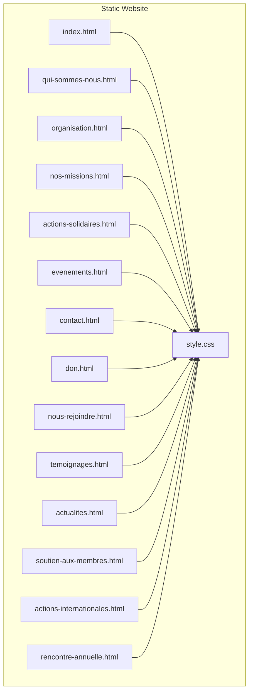
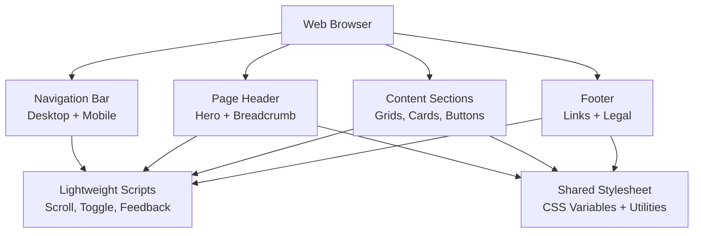
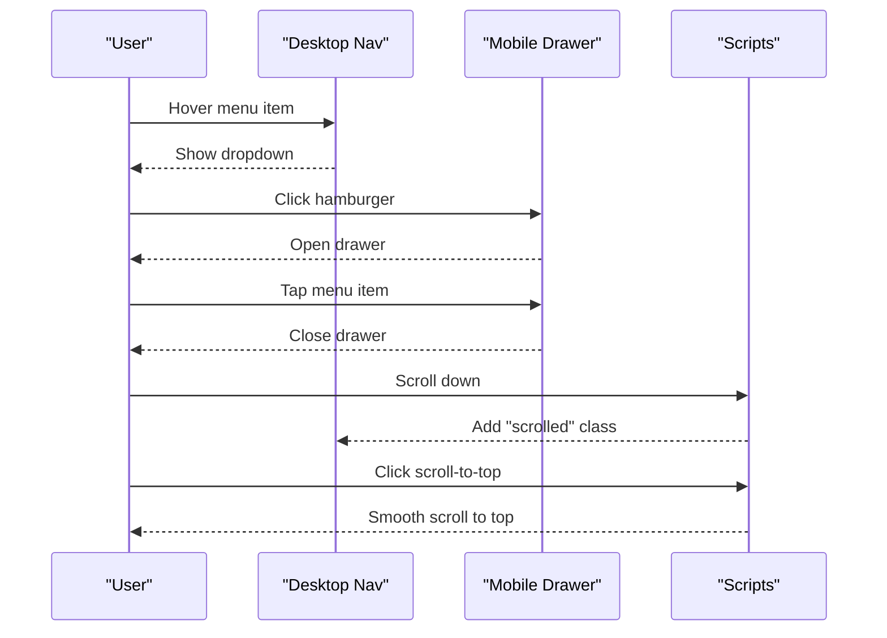
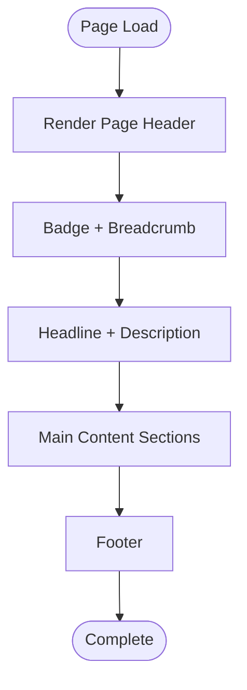
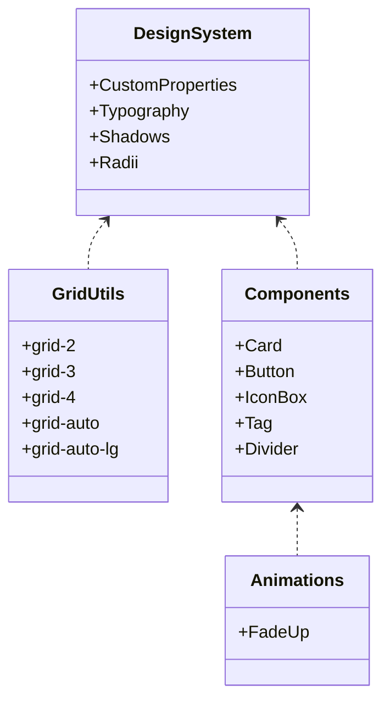
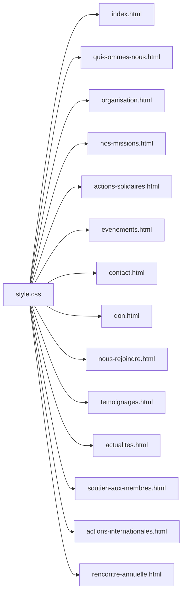

# Static Website Implementation

<cite>
**Referenced Files in This Document**
- [index.html](file://rsf-website/index.html)
- [style.css](file://rsf-website/style.css)
- [qui-sommes-nous.html](file://rsf-website/qui-sommes-nous.html)
- [organisation.html](file://rsf-website/organisation.html)
- [nos-missions.html](file://rsf-website/nos-missions.html)
- [actions-solidaires.html](file://rsf-website/actions-solidaires.html)
- [evenements.html](file://rsf-website/evenements.html)
- [contact.html](file://rsf-website/contact.html)
- [don.html](file://rsf-website/don.html)
- [nous-rejoindre.html](file://rsf-website/nous-rejoindre.html)
- [temoignages.html](file://rsf-website/temoignages.html)
- [actualites.html](file://rsf-website/actualites.html)
- [soutien-aux-membres.html](file://rsf-website/soutien-aux-membres.html)
- [actions-internationales.html](file://rsf-website/actions-internationales.html)
- [rencontre-annuelle.html](file://rsf-website/rencontre-annuelle.html)
</cite>

## Table of Contents
1. [Introduction](#introduction)
2. [Project Structure](#project-structure)
3. [Core Components](#core-components)
4. [Architecture Overview](#architecture-overview)
5. [Detailed Component Analysis](#detailed-component-analysis)
6. [Dependency Analysis](#dependency-analysis)
7. [Performance Considerations](#performance-considerations)
8. [Troubleshooting Guide](#troubleshooting-guide)
9. [Conclusion](#conclusion)
10. [Appendices](#appendices)

## Introduction
This document describes the static website implementation for Réseau Solidarité France (RSF), a public-facing website built with pure HTML and CSS and enhanced with lightweight JavaScript. It covers the HTML structure organization, semantic markup practices, navigation system, CSS styling approach with responsive design, component styling, and design system implementation. It also documents the individual page implementations for the home page, about us, organization, missions, actions, events, and contact pages, along with guidelines for maintaining consistency across pages and implementing new static pages. Finally, it addresses performance optimization for static assets and SEO considerations for improved search engine visibility.

## Project Structure
The website is organized as a set of static HTML pages under the rsf-website directory, sharing a single stylesheet and a common navigation pattern. Each page follows a consistent header, content sections, and footer layout, with a dedicated page header area and a responsive mobile navigation drawer.

**Diagram sources**
- [index.html:1-296](file://rsf-website/index.html#L1-L296)
- [style.css:1-309](file://rsf-website/style.css#L1-L309)

**Section sources**
- [index.html:1-296](file://rsf-website/index.html#L1-L296)
- [style.css:1-309](file://rsf-website/style.css#L1-L309)

## Core Components
- Navigation system: Fixed top navigation bar with desktop dropdown menus and a collapsible mobile drawer. Active states are applied to current pages.
- Page header: A prominent hero-like section with gradient backgrounds, breadcrumbs, badges, and page titles.
- Content sections: Consistent spacing and typography using CSS custom properties and grid utilities.
- Footer: Multi-column layout with site branding, quick links, and legal information.
- Interactive elements: Scroll-to-top button, animated fade-in effects on scroll, and form submission feedback.

Key implementation patterns:
- CSS custom properties define a cohesive design system (colors, shadows, radii, typography).
- Utility classes for grids, cards, buttons, and animations promote reuse and consistency.
- JavaScript handles scroll-aware navigation, mobile menu toggle, scroll-to-top, and form feedback.

**Section sources**
- [index.html:13-75](file://rsf-website/index.html#L13-L75)
- [style.css:3-24](file://rsf-website/style.css#L3-L24)
- [style.css:41-134](file://rsf-website/style.css#L41-L134)
- [style.css:135-181](file://rsf-website/style.css#L135-L181)
- [style.css:251-291](file://rsf-website/style.css#L251-L291)

## Architecture Overview
The website architecture is intentionally simple and static:
- Each page is self-contained with embedded navigation and footer.
- Shared styles are centralized in a single stylesheet.
- Minimal JavaScript is used for UX enhancements (navigation, scroll effects, form feedback).
- No build tooling or framework is used; deployment is straightforward.

**Diagram sources**
- [index.html:11-296](file://rsf-website/index.html#L11-L296)
- [style.css:1-309](file://rsf-website/style.css#L1-L309)

## Detailed Component Analysis

### Navigation System
- Desktop navigation: Fixed bar with brand identity, primary links, and dropdown menus for nested sections.
- Mobile navigation: Collapsible drawer with grouped sections and call-to-action items.
- Active states: Current page links are marked as active; navigation becomes elevated on scroll.
- Scroll behavior: Smooth scrolling and scroll-to-top button appear after threshold.

**Diagram sources**
- [index.html:13-75](file://rsf-website/index.html#L13-L75)
- [index.html:272-293](file://rsf-website/index.html#L272-L293)
- [style.css:41-134](file://rsf-website/style.css#L41-L134)
- [style.css:274-284](file://rsf-website/style.css#L274-L284)

**Section sources**
- [index.html:13-75](file://rsf-website/index.html#L13-L75)
- [style.css:41-134](file://rsf-website/style.css#L41-L134)
- [style.css:274-284](file://rsf-website/style.css#L274-L284)

### Page Header Pattern
- Each page defines a page header with a gradient background, badge, breadcrumb, and headline.
- Typography uses Playfair Display for headings and DM Sans for body text.
- Background shapes and gradients create visual depth while maintaining readability.

**Diagram sources**
- [qui-sommes-nous.html:78-86](file://rsf-website/qui-sommes-nous.html#L78-L86)
- [nos-missions.html:78-85](file://rsf-website/nos-missions.html#L78-L85)
- [actions-solidaires.html:78-85](file://rsf-website/actions-solidaires.html#L78-L85)
- [evenements.html:78-85](file://rsf-website/evenements.html#L78-L85)
- [contact.html:78-85](file://rsf-website/contact.html#L78-L85)
- [don.html:78-85](file://rsf-website/don.html#L78-L85)
- [nous-rejoindre.html:88-95](file://rsf-website/nous-rejoindre.html#L88-L95)
- [temoignages.html:78-85](file://rsf-website/temoignages.html#L78-L85)
- [actualites.html:78-85](file://rsf-website/actualites.html#L78-L85)
- [soutien-aux-membres.html:78-85](file://rsf-website/soutien-aux-membres.html#L78-L85)
- [actions-internationales.html:78-85](file://rsf-website/actions-internationales.html#L78-L85)
- [rencontre-annuelle.html:78-85](file://rsf-website/rencontre-annuelle.html#L78-L85)

**Section sources**
- [qui-sommes-nous.html:78-86](file://rsf-website/qui-sommes-nous.html#L78-L86)
- [style.css:135-161](file://rsf-website/style.css#L135-L161)

### Content Sections and Components
- Grid utilities: Responsive grid classes for 2, 3, 4, auto-fill columns.
- Cards: Elevated content blocks with hover effects and optional dark variants.
- Buttons: Gradient buttons with primary, secondary, accent, and support variants.
- Animations: Fade-up animation triggered by IntersectionObserver when elements enter viewport.

**Diagram sources**
- [style.css:3-24](file://rsf-website/style.css#L3-L24)
- [style.css:240-249](file://rsf-website/style.css#L240-L249)
- [style.css:199-233](file://rsf-website/style.css#L199-L233)
- [style.css:247-249](file://rsf-website/style.css#L247-L249)

**Section sources**
- [style.css:240-249](file://rsf-website/style.css#L240-L249)
- [style.css:199-233](file://rsf-website/style.css#L199-L233)
- [style.css:286-291](file://rsf-website/style.css#L286-L291)

### Individual Page Implementations

#### Home Page (index.html)
- Hero section with animated background shapes and feature highlights.
- Quick links grid to major sections.
- Values highlight section with dark theme.
- Call-to-action strip with gradient background.
- Scroll-aware navigation and mobile drawer.

**Section sources**
- [index.html:77-225](file://rsf-website/index.html#L77-L225)
- [index.html:272-293](file://rsf-website/index.html#L272-L293)

#### About Us (qui-sommes-nous.html)
- Page header with gradient background and badge.
- Story and values presentation with icon boxes.
- Goals grid with mission-related icons.
- Footer with site links.

**Section sources**
- [qui-sommes-nous.html:78-158](file://rsf-website/qui-sommes-nous.html#L78-L158)
- [qui-sommes-nous.html:161-200](file://rsf-website/qui-sommes-nous.html#L161-L200)

#### Organization (organisation.html)
- Page header with gradient background.
- Leadership section featuring president profile.
- Team members grid with gradient headers.
- Footer with site links.

**Section sources**
- [organisation.html:78-197](file://rsf-website/organisation.html#L78-L197)
- [organisation.html:200-239](file://rsf-website/organisation.html#L200-L239)

#### Missions (nos-missions.html)
- Page header with gradient background and badge.
- Mission cards with icons and lists.
- Footer with site links.

**Section sources**
- [nos-missions.html:78-162](file://rsf-website/nos-missions.html#L78-L162)
- [nos-missions.html:165-204](file://rsf-website/nos-missions.html#L165-L204)

#### Actions (actions-solidaires.html)
- Page header with gradient background and badge.
- Articles grid with tags and gradient headers.
- Dark-themed CTA strip.
- Footer with site links.

**Section sources**
- [actions-solidaires.html:78-149](file://rsf-website/actions-solidaires.html#L78-L149)
- [actions-solidaires.html:152-191](file://rsf-website/actions-solidaires.html#L152-L191)

#### Events (evenements.html)
- Page header with gradient background and badge.
- Featured event spotlight and regular activities grid.
- Newsletter CTA card.
- Footer with site links.

**Section sources**
- [evenements.html:78-120](file://rsf-website/evenements.html#L78-L120)
- [evenements.html:123-162](file://rsf-website/evenements.html#L123-L162)

#### Contact (contact.html)
- Page header with gradient background and badge.
- Contact info with icon boxes.
- Contact form with styled inputs and submit button.
- Footer with site links.

**Section sources**
- [contact.html:78-132](file://rsf-website/contact.html#L78-L132)
- [contact.html:135-174](file://rsf-website/contact.html#L135-L174)

#### Donations (don.html)
- Page header with gradient background and badge.
- Donation options with cards and gradient accents.
- Impact showcase grid and inspirational quote.
- Footer with site links.

**Section sources**
- [don.html:78-131](file://rsf-website/don.html#L78-L131)
- [don.html:134-173](file://rsf-website/don.html#L134-L173)

#### Join Us (nous-rejoindre.html)
- Page header with gradient background and badge.
- Volunteering options with icon boxes.
- Application form with dual-column inputs and checkboxes.
- Footer with site links.

**Section sources**
- [nous-rejoindre.html:88-174](file://rsf-website/nous-rejoindre.html#L88-L174)
- [nous-rejoindre.html:177-216](file://rsf-website/nous-rejoindre.html#L177-L216)

#### Testimonials (temoignages.html)
- Page header with gradient background and badge.
- Testimonial cards with blockquotes and avatar placeholders.
- Call-to-action to share experiences.
- Footer with site links.

**Section sources**
- [temoignages.html:78-191](file://rsf-website/temoignages.html#L78-L191)
- [temoignages.html:194-233](file://rsf-website/temoignages.html#L194-L233)

#### News (actualites.html)
- Page header with gradient background and badge.
- News articles grid with tags and dates.
- Newsletter CTA card.
- Footer with site links.

**Section sources**
- [actualites.html:78-125](file://rsf-website/actualites.html#L78-L125)
- [actualites.html:128-167](file://rsf-website/actualites.html#L128-L167)

#### Member Support (soutien-aux-membres.html)
- Page header with gradient background and badge.
- Services grid with icon boxes.
- Contact CTA and process steps.
- Footer with site links.

**Section sources**
- [soutien-aux-membres.html:78-133](file://rsf-website/soutien-aux-membres.html#L78-L133)
- [soutien-aux-membres.html:136-175](file://rsf-website/soutien-aux-membres.html#L136-L175)

#### International Actions (actions-internationales.html)
- Page header with gradient background and badge.
- International mission narrative and impact showcase.
- Footer with site links.

**Section sources**
- [actions-internationales.html:78-124](file://rsf-website/actions-internationales.html#L78-L124)
- [actions-internationales.html:127-166](file://rsf-website/actions-internationales.html#L127-L166)

#### Annual Meeting (rencontre-annuelle.html)
- Page header with gradient background and badge.
- Event details and program schedule.
- Participation CTA.
- Footer with site links.

**Section sources**
- [rencontre-annuelle.html:78-136](file://rsf-website/rencontre-annuelle.html#L78-L136)
- [rencontre-annuelle.html:139-178](file://rsf-website/rencontre-annuelle.html#L139-L178)

## Dependency Analysis
- All pages depend on the shared stylesheet for consistent styling and design tokens.
- Navigation and footer are duplicated across pages, ensuring consistency and reducing coupling.
- JavaScript is included per page for interactive behaviors, keeping each page self-contained.

**Diagram sources**
- [style.css:1-309](file://rsf-website/style.css#L1-L309)
- [index.html](file://rsf-website/index.html#L8)
- [qui-sommes-nous.html](file://rsf-website/qui-sommes-nous.html#L8)

**Section sources**
- [style.css:1-309](file://rsf-website/style.css#L1-L309)
- [index.html](file://rsf-website/index.html#L8)

## Performance Considerations
- Static asset delivery: Serve HTML, CSS, and images via a CDN or static host with compression enabled (gzip/brotli) and cache headers.
- Minimize and combine CSS: Keep a single stylesheet to reduce requests; avoid unnecessary inline styles.
- Lazy load non-critical images: Apply loading="lazy" to images outside the viewport.
- Optimize fonts: Preload critical font subsets and defer non-critical weights.
- Reduce DOM size: Keep markup minimal and avoid deep nesting for faster parsing.
- Image optimization: Use modern formats (AVIF/WebP) and appropriate sizes/resolution.
- Script optimization: Inline small scripts; defer larger ones until after initial render.

[No sources needed since this section provides general guidance]

## Troubleshooting Guide
Common issues and resolutions:
- Navigation not sticky or dropdown not visible: Verify the presence of the "scrolled" class on scroll and ensure dropdown transitions are not overridden by other styles.
- Mobile menu not toggling: Confirm the click handler for the hamburger button exists and toggles the "open" class on the mobile drawer.
- Form submission feedback not working: Ensure the form-submit class is present and the click handler updates the button text and background temporarily.
- Scroll-to-top not appearing: Check the scroll threshold and show class binding.
- Responsive layout breaks: Review media queries and grid utilities for the targeted breakpoints.

**Section sources**
- [index.html:272-293](file://rsf-website/index.html#L272-L293)
- [style.css:292-309](file://rsf-website/style.css#L292-L309)

## Conclusion
The static website for Réseau Solidarité France demonstrates a clean, maintainable approach to building a public-facing site with strong visual consistency and responsive behavior. The shared design system, reusable components, and consistent navigation enable efficient maintenance and easy addition of new pages. By following the guidelines outlined here—especially around consistency, component reuse, and performance—the site can continue to evolve while preserving usability and accessibility.

[No sources needed since this section summarizes without analyzing specific files]

## Appendices

### Guidelines for Maintaining Consistency Across Pages
- Use the page header pattern with consistent structure: breadcrumb, badge, headline, description.
- Apply the same grid utilities and component classes for layout and styling.
- Keep navigation and footer identical across pages to reinforce brand recognition.
- Use CSS custom properties for colors, shadows, and radii to ensure visual coherence.
- Maintain consistent typography scales and weights.

**Section sources**
- [style.css:3-24](file://rsf-website/style.css#L3-L24)
- [style.css:135-181](file://rsf-website/style.css#L135-L181)
- [style.css:240-249](file://rsf-website/style.css#L240-L249)

### Guidelines for Implementing New Static Pages
- Copy the basic structure from an existing page (navigation, page header, footer).
- Define a page header with a gradient background, badge, breadcrumb, and headline.
- Use grid utilities and component classes for content layout.
- Add interactive elements (buttons, forms) with appropriate classes and event handlers.
- Link the new page in the navigation and mobile drawer.
- Test responsiveness across breakpoints and ensure animations work as expected.

**Section sources**
- [index.html:13-75](file://rsf-website/index.html#L13-L75)
- [style.css:240-249](file://rsf-website/style.css#L240-L249)
- [style.css:274-284](file://rsf-website/style.css#L274-L284)

### SEO Considerations
- Page titles and meta descriptions: Ensure each page has a unique and descriptive title and description.
- Semantic markup: Use proper heading hierarchy (H1 for page title, H2/H3 for sections).
- Breadcrumbs: Maintain accurate breadcrumb trails for better navigation and SEO signals.
- Alt attributes: Provide meaningful alt text for decorative images used as icons.
- Structured data: Consider adding schema.org microdata for key pages (organization, event).
- Robots.txt and sitemap: Provide a robots.txt and sitemap for crawlers.

**Section sources**
- [index.html:6-8](file://rsf-website/index.html#L6-L8)
- [qui-sommes-nous.html:6-8](file://rsf-website/qui-sommes-nous.html#L6-L8)
- [organisation.html:6-8](file://rsf-website/organisation.html#L6-L8)
- [nos-missions.html:6-8](file://rsf-website/nos-missions.html#L6-L8)
- [actions-solidaires.html:6-8](file://rsf-website/actions-solidaires.html#L6-L8)
- [evenements.html:6-8](file://rsf-website/evenements.html#L6-L8)
- [contact.html:6-8](file://rsf-website/contact.html#L6-L8)
- [don.html:6-8](file://rsf-website/don.html#L6-L8)
- [nous-rejoindre.html:6-8](file://rsf-website/nous-rejoindre.html#L6-L8)
- [temoignages.html:6-8](file://rsf-website/temoignages.html#L6-L8)
- [actualites.html:6-8](file://rsf-website/actualites.html#L6-L8)
- [soutien-aux-membres.html:6-8](file://rsf-website/soutien-aux-membres.html#L6-L8)
- [actions-internationales.html:6-8](file://rsf-website/actions-internationales.html#L6-L8)
- [rencontre-annuelle.html:6-8](file://rsf-website/rencontre-annuelle.html#L6-L8)